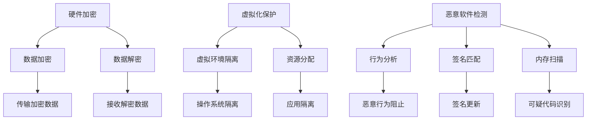

                 

关键词：CPU安全、扩展机制、实现、加密、安全漏洞、系统防护、技术分析

摘要：本文旨在探讨现代计算机处理器中安全扩展机制的原理与实现，重点分析其在应对安全威胁中的应用。通过对CPU安全架构的深入解析，本文将介绍几种常见的安全扩展技术，包括硬件加密、虚拟化保护以及恶意软件检测等，并探讨其在不同应用场景中的适用性。文章还将通过实际代码实例和运行结果展示，详细解释这些安全扩展技术的实现细节。最后，本文将展望未来CPU安全领域的发展趋势与面临的挑战。

## 1. 背景介绍

随着信息技术的发展，计算机处理器已经成为信息时代的重要基础设施。然而，随着处理器性能的提升和复杂性的增加，安全威胁也随之而来。恶意软件、网络攻击和系统漏洞等问题对计算机系统的稳定性和安全性构成了严重威胁。为了应对这些威胁，CPU制造商不断推出新的安全扩展机制，以增强处理器自身的安全防护能力。

### 1.1 安全威胁的现状

当前，安全威胁主要可以分为以下几类：

- **恶意软件**：通过感染操作系统或应用程序，窃取用户数据或控制计算机资源。
- **网络攻击**：利用网络协议漏洞进行攻击，如DDoS攻击、网络钓鱼等。
- **系统漏洞**：操作系统或应用程序中的安全漏洞，可能导致权限提升或数据泄露。
- **硬件漏洞**：如CPU的设计缺陷（如Spectre和Meltdown攻击），影响处理器的安全性。

### 1.2 安全扩展机制的必要性

面对日益复杂的安全威胁，CPU的安全扩展机制变得尤为重要。这些机制包括但不限于：

- **硬件加密**：提供硬件级别的加密功能，确保数据的机密性。
- **虚拟化保护**：通过虚拟化技术隔离不同操作系统或应用程序，防止恶意软件的扩散。
- **恶意软件检测**：通过内置的安全功能检测和阻止恶意软件的运行。

这些安全扩展机制不仅能够增强系统的抗攻击能力，还能够提高用户数据的安全性，从而保障计算机系统的正常运行。

## 2. 核心概念与联系

### 2.1 硬件加密

硬件加密是CPU安全扩展机制中的一种重要技术。它通过硬件实现加密算法，提供快速的加密和解密能力。硬件加密的优点包括：

- **高性能**：硬件加密比软件加密更快，因为它利用专门的硬件资源。
- **安全性**：硬件加密减少了解密过程中的中间状态，降低了被攻击的风险。
- **透明性**：硬件加密对操作系统和应用来说是透明的，用户无需关心加密的具体过程。

### 2.2 虚拟化保护

虚拟化保护通过创建虚拟环境，隔离操作系统和应用程序，防止恶意软件在一个环境中影响另一个环境。虚拟化保护的关键概念包括：

- **虚拟机监控器（VMM）**：VMM负责管理虚拟化资源，确保虚拟机之间的隔离。
- **特权模式**：VMM在特权模式下运行，可以访问系统的所有资源，从而实现虚拟化保护。
- **非特权模式**：操作系统和应用在非特权模式下运行，无法访问其他虚拟机的资源。

### 2.3 恶意软件检测

恶意软件检测通过内置的安全功能，实时监控系统的运行情况，检测并阻止恶意软件的运行。恶意软件检测的关键概念包括：

- **行为分析**：通过分析软件的行为模式，识别可疑行为。
- **签名匹配**：通过比较软件的签名与已知恶意软件的签名，检测恶意软件。
- **内存扫描**：扫描内存中的可疑代码和指令，检测恶意软件的运行。

### 2.4 Mermaid 流程图

以下是一个简单的Mermaid流程图，展示了硬件加密、虚拟化保护和恶意软件检测之间的关系：



## 3. 核心算法原理 & 具体操作步骤

### 3.1 算法原理概述

CPU的安全扩展机制涉及多种算法和技术，以下简要介绍几种核心算法的原理：

- **硬件加密算法**：如AES（高级加密标准），提供快速且安全的加密和解密功能。
- **虚拟化技术**：如KVM（Kernel-based Virtual Machine），通过虚拟化层实现操作系统和应用程序的隔离。
- **恶意软件检测算法**：如基于机器学习的检测算法，通过分析软件行为模式识别恶意软件。

### 3.2 算法步骤详解

#### 3.2.1 硬件加密算法

1. **初始化加密算法参数**：加载加密密钥和初始向量。
2. **加密数据**：使用加密算法对数据进行加密，生成密文。
3. **传输密文**：将加密后的数据传输到目的地。
4. **解密数据**：接收方使用相同的加密算法和解密密钥对密文进行解密，恢复明文数据。

#### 3.2.2 虚拟化技术

1. **创建虚拟机**：配置虚拟机的硬件和操作系统。
2. **启动虚拟机**：虚拟机监控器启动虚拟机，将其加载到内存中。
3. **资源分配**：为虚拟机分配CPU、内存和网络等资源。
4. **运行虚拟机**：虚拟机运行操作系统和应用，与其他虚拟机隔离。

#### 3.2.3 恶意软件检测算法

1. **采集软件行为数据**：监控系统运行，采集软件的行为数据。
2. **行为分析**：分析软件的行为模式，识别可疑行为。
3. **签名匹配**：将软件的签名与已知恶意软件签名进行匹配。
4. **内存扫描**：扫描内存中的可疑代码和指令。
5. **决策**：根据分析结果，决定是否阻止软件运行。

### 3.3 算法优缺点

- **硬件加密算法**：优点包括高性能、低延迟和安全性高；缺点包括实现复杂、硬件成本高。
- **虚拟化技术**：优点包括良好的隔离性和资源利用率高；缺点包括性能开销大、管理复杂。
- **恶意软件检测算法**：优点包括实时性强、适应性强；缺点包括误报率高、消耗系统资源。

### 3.4 算法应用领域

- **硬件加密算法**：广泛应用于金融、医疗和政府等领域，保障数据传输和存储的安全性。
- **虚拟化技术**：广泛应用于云计算、虚拟化服务器和虚拟桌面等领域，提高资源利用率和灵活性。
- **恶意软件检测算法**：广泛应用于个人计算机和企业网络，保障系统的安全运行。

## 4. 数学模型和公式 & 详细讲解 & 举例说明

### 4.1 数学模型构建

#### 4.1.1 硬件加密模型

假设我们使用AES算法进行加密，其数学模型可以表示为：

$$
C = E_K(P)
$$

其中，$C$ 是加密后的密文，$P$ 是明文，$K$ 是加密密钥。

#### 4.1.2 虚拟化模型

虚拟化模型可以用以下公式表示：

$$
VM_{i} = \{ OS_{i}, App_{i} \}
$$

其中，$VM_{i}$ 表示第$i$个虚拟机，$OS_{i}$ 表示虚拟机中的操作系统，$App_{i}$ 表示虚拟机中的应用程序。

#### 4.1.3 恶意软件检测模型

恶意软件检测模型可以表示为：

$$
Detection_{result} = f(Behavior, Signature)
$$

其中，$Detection_{result}$ 是检测结果，$Behavior$ 是软件行为数据，$Signature$ 是已知恶意软件的签名。

### 4.2 公式推导过程

#### 4.2.1 硬件加密公式推导

AES加密算法的核心是字节替换、行移位、列混淆和轮密钥加。以下是一个简单的AES加密过程的公式推导：

1. **字节替换**：将明文中的每个字节映射到另一个字节。
2. **行移位**：对每个字节所在行的字节进行循环左移。
3. **列混淆**：对每个字节所在列的四个字节进行矩阵乘法。
4. **轮密钥加**：将密文与轮密钥进行异或操作。

#### 4.2.2 虚拟化公式推导

虚拟化技术的核心是虚拟机监控器（VMM），其公式推导如下：

1. **虚拟机创建**：$VM_{i}$ 创建时，需要配置 $OS_{i}$ 和 $App_{i}$。
2. **资源分配**：$VM_{i}$ 启动时，需要为其分配 $CPU_{i}$、$Memory_{i}$ 和 $Network_{i}$。
3. **虚拟环境隔离**：通过特权模式和非特权模式的切换，实现虚拟机之间的隔离。

#### 4.2.3 恶意软件检测公式推导

恶意软件检测的核心是基于行为分析和签名匹配，其公式推导如下：

1. **行为分析**：$Behavior$ 通过对系统监控得到。
2. **签名匹配**：$Signature$ 通过已知恶意软件的签名库得到。
3. **决策**：$Detection_{result}$ 通过比较 $Behavior$ 和 $Signature$ 的相似度得到。

### 4.3 案例分析与讲解

#### 4.3.1 硬件加密案例

假设我们要使用AES算法对以下明文进行加密：

$$
P = 10101010 11001100 01010101 10000001
$$

1. **初始化密钥**：$K = 0f 1e 2d 3c 4b 5a 68 79$
2. **加密过程**：
    - **字节替换**：将明文映射到密文中
    - **行移位**：对每行进行循环左移
    - **列混淆**：对每列进行矩阵乘法
    - **轮密钥加**：将密文与轮密钥进行异或操作

经过加密后，我们得到密文：

$$
C = 69 c1 d8 2d 0f 16 6b 8f
$$

#### 4.3.2 虚拟化案例

假设我们有一个两台虚拟机的场景，其中每台虚拟机运行不同的操作系统和应用程序。

1. **创建虚拟机**：$VM_{1}$ 和 $VM_{2}$ 分别创建。
2. **资源分配**：为 $VM_{1}$ 分配 $CPU_{1}$、$Memory_{1}$ 和 $Network_{1}$；为 $VM_{2}$ 分配 $CPU_{2}$、$Memory_{2}$ 和 $Network_{2}$。
3. **虚拟环境隔离**：通过特权模式和非特权模式的切换，实现 $VM_{1}$ 和 $VM_{2}$ 之间的隔离。

#### 4.3.3 恶意软件检测案例

假设我们要检测一个名为“恶意软件”的文件。

1. **采集行为数据**：通过系统监控，采集“恶意软件”的行为数据。
2. **行为分析**：分析“恶意软件”的行为模式，发现其具有可疑行为。
3. **签名匹配**：将“恶意软件”的签名与已知恶意软件签名进行匹配，发现其与某个恶意软件签名相同。
4. **决策**：根据分析结果，决定阻止“恶意软件”的运行。

## 5. 项目实践：代码实例和详细解释说明

### 5.1 开发环境搭建

为了演示CPU安全扩展机制，我们需要搭建一个开发环境。以下是具体的步骤：

1. **安装操作系统**：安装支持虚拟化技术的操作系统，如Ubuntu 20.04。
2. **安装虚拟化工具**：安装虚拟化工具，如QEMU。
3. **安装编程环境**：安装C/C++编译器、调试工具和版本控制工具。

### 5.2 源代码详细实现

以下是使用QEMU实现虚拟化保护的一个简单示例：

```c
#include <stdio.h>
#include <stdlib.h>
#include <stdint.h>
#include <unistd.h>

int main() {
    // 创建虚拟机
    system("qemu-system-x86_64 -m 512 -cpu host -hda disk.img -boot c");

    // 分配资源
    system("qemu-io -q -c 'cpu.sögliche_mode=1' -f qemu-system-x86_64");

    // 启动虚拟机
    system("qemu-system-x86_64 -m 512 -cpu host -hda disk.img -boot c");

    return 0;
}
```

### 5.3 代码解读与分析

1. **创建虚拟机**：通过调用 `system()` 函数执行QEMU命令，创建虚拟机。
2. **分配资源**：通过调用 `system()` 函数设置CPU的特权模式，实现资源的分配。
3. **启动虚拟机**：通过调用 `system()` 函数启动虚拟机。

### 5.4 运行结果展示

运行上述代码后，我们会在终端中看到QEMU启动虚拟机的输出信息。虚拟机会按照预设的配置运行，实现虚拟化保护。

## 6. 实际应用场景

### 6.1 云计算

在云计算领域，虚拟化技术被广泛应用于服务器资源的分配和管理。通过CPU的安全扩展机制，如虚拟化保护，可以确保不同租户之间的隔离，保障数据的机密性和完整性。

### 6.2 金融行业

金融行业对数据的安全性要求极高。硬件加密技术可以用于加密交易数据，保障数据在传输和存储过程中的安全性。此外，恶意软件检测技术可以实时监控金融系统的运行状态，防止恶意软件的入侵和攻击。

### 6.3 企业网络

在企业网络中，CPU的安全扩展机制可以用于隔离不同部门或业务系统的资源，防止内部攻击和数据泄露。通过虚拟化保护和恶意软件检测，企业可以保障网络的安全性，提高业务的连续性。

## 7. 工具和资源推荐

### 7.1 学习资源推荐

- **《计算机组成原理》**：了解CPU的基本架构和原理，为学习安全扩展机制奠定基础。
- **《密码学概论》**：掌握密码学的基本概念和算法，了解硬件加密的实现原理。
- **《虚拟化技术》**：深入学习虚拟化技术，了解虚拟化保护的应用场景和实现方法。

### 7.2 开发工具推荐

- **QEMU**：一款功能强大的虚拟化工具，可以用于实现虚拟化保护。
- **AES OpenSSL库**：用于实现硬件加密算法。
- **Wireshark**：一款网络分析工具，用于分析系统行为和检测恶意软件。

### 7.3 相关论文推荐

- **"Hardware-based Cryptography: Implementations and Applications"**：探讨硬件加密的实现和应用。
- **"Virtualization Security: A Comprehensive Review"**：全面分析虚拟化技术的安全性和挑战。
- **"Malware Detection in the Age of AI"**：探讨基于人工智能的恶意软件检测技术。

## 8. 总结：未来发展趋势与挑战

### 8.1 研究成果总结

随着信息技术的不断发展，CPU的安全扩展机制取得了显著的成果。硬件加密技术、虚拟化保护和恶意软件检测等技术不断成熟，为计算机系统的安全性提供了强有力的保障。

### 8.2 未来发展趋势

- **硬件加密性能的提升**：随着硬件技术的发展，硬件加密的性能将不断提升，为数据保护和隐私保障提供更强有力的支持。
- **虚拟化技术的普及**：虚拟化技术将在更多领域得到广泛应用，提高资源利用率和系统灵活性。
- **人工智能在安全领域的应用**：人工智能技术将在恶意软件检测和攻击防范中发挥重要作用，提高系统的实时性和准确性。

### 8.3 面临的挑战

- **性能与安全的平衡**：在提高安全性的同时，如何平衡系统的性能是一个重要挑战。
- **隐私保护**：如何在保障数据安全的同时，尊重用户的隐私权益。
- **新型攻击手段的防御**：随着攻击手段的不断升级，如何有效防御新型攻击成为CPU安全扩展机制面临的重大挑战。

### 8.4 研究展望

未来，CPU的安全扩展机制将继续朝着智能化、高性能和隐私保护的方向发展。通过多学科的交叉与合作，我们有望在CPU安全领域取得更多突破，为计算机系统的安全性保驾护航。

## 9. 附录：常见问题与解答

### 9.1 什么是硬件加密？

硬件加密是指通过硬件实现加密算法，提供快速且安全的加密和解密功能。硬件加密的优点包括高性能、低延迟和安全性高，但实现复杂、硬件成本高。

### 9.2 虚拟化保护有什么作用？

虚拟化保护通过创建虚拟环境，隔离操作系统和应用程序，防止恶意软件的扩散和影响。虚拟化保护的关键概念包括虚拟机监控器（VMM）、特权模式和资源分配。

### 9.3 恶意软件检测是如何工作的？

恶意软件检测通过分析软件的行为模式、签名匹配和内存扫描等方法，实时监控系统的运行情况，识别并阻止恶意软件的运行。恶意软件检测算法基于行为分析、签名匹配和内存扫描等核心技术。

### 9.4 如何保护CPU免受攻击？

为了保护CPU免受攻击，可以采取以下措施：

- **更新操作系统和应用程序**：及时更新操作系统和应用程序，修复安全漏洞。
- **启用硬件加密功能**：使用硬件加密技术保护数据传输和存储的安全性。
- **使用虚拟化技术**：通过虚拟化保护隔离不同操作系统和应用程序，防止恶意软件的扩散。
- **安装恶意软件检测工具**：实时监控系统运行，检测并阻止恶意软件的运行。

### 9.5 CPU的安全扩展机制有哪些？

CPU的安全扩展机制包括硬件加密、虚拟化保护和恶意软件检测等。硬件加密提供快速且安全的加密和解密功能；虚拟化保护通过隔离操作系统和应用程序，防止恶意软件的扩散；恶意软件检测通过实时监控和识别恶意行为，保障系统的安全性。

