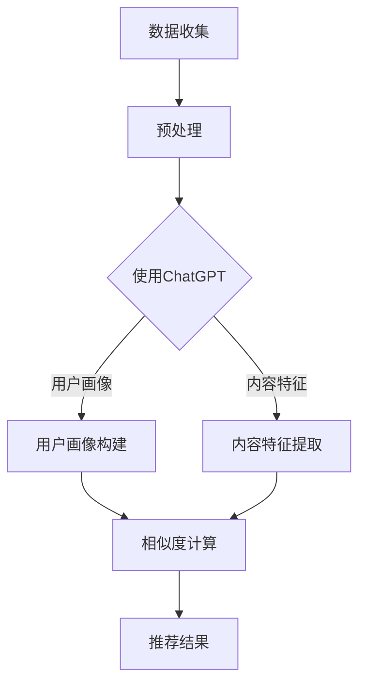

                 

关键词：ChatGPT，推荐系统，人工智能，深度学习，用户行为分析，信息检索。

> 摘要：随着人工智能技术的发展，推荐系统在电商、社交媒体和内容平台等领域得到了广泛应用。本文将探讨如何将ChatGPT这一先进的自然语言处理模型应用于推荐系统，以提高推荐效果和用户体验。通过分析ChatGPT在推荐系统中的初步应用，我们提出了相关算法原理、数学模型和具体实现方法，并对未来发展进行了展望。

## 1. 背景介绍

推荐系统是人工智能领域的一个重要分支，它利用用户历史行为、内容特征和相似度算法等手段，为用户推荐他们可能感兴趣的商品、内容或服务。近年来，随着深度学习和自然语言处理技术的不断发展，推荐系统的性能和效果得到了显著提升。

ChatGPT是由OpenAI开发的一种基于变换器（Transformer）架构的预训练语言模型，其基于大量互联网文本数据进行预训练，具有强大的语言理解和生成能力。ChatGPT的出现为推荐系统带来了新的可能性，使推荐系统能够更好地处理和利用用户生成的文本数据，从而提高推荐效果和用户体验。

本文将探讨如何将ChatGPT应用于推荐系统，以提高推荐效果和用户体验。首先，我们将介绍ChatGPT在推荐系统中的核心算法原理，然后讨论其数学模型和具体实现方法，最后分析其实际应用场景和未来发展趋势。

### 1.1 推荐系统简介

推荐系统（Recommendation System）是一种基于用户行为、内容和相似度算法等手段，为用户推荐感兴趣的商品、内容或服务的技术。推荐系统通常包括以下几个关键组件：

- **用户画像**：通过分析用户历史行为、偏好和社交关系等信息，构建用户的画像特征。
- **内容特征**：提取商品、内容或服务的特征信息，如文本、图片、音频和视频等。
- **相似度计算**：计算用户画像与内容特征之间的相似度，以确定用户可能感兴趣的内容。
- **推荐算法**：根据相似度计算结果，选择最适合用户的内容进行推荐。

推荐系统在电商、社交媒体、视频和内容平台等领域得到了广泛应用，例如，电商平台的商品推荐、社交媒体的个性化推送和视频平台的视频推荐等。随着用户生成内容和数据量的不断增加，推荐系统的性能和效果对用户体验和业务增长具有重要意义。

### 1.2 ChatGPT简介

ChatGPT是OpenAI开发的一种基于变换器（Transformer）架构的预训练语言模型，其采用GPT-3（Generative Pre-trained Transformer 3）模型，拥有1750亿个参数。ChatGPT通过在大量互联网文本数据上进行预训练，学习了丰富的语言知识和上下文理解能力，能够在多种任务中表现出色。

ChatGPT具有以下几个主要特点：

- **强大的语言理解能力**：ChatGPT能够理解并生成人类语言，实现自然对话。
- **上下文理解能力**：ChatGPT能够理解并处理长文本上下文，使对话更加连贯和自然。
- **生成能力**：ChatGPT能够根据给定输入生成连贯且具有创造性的文本，包括问答、摘要、翻译和写作等。
- **自适应能力**：ChatGPT可以通过少量的样本数据快速适应特定领域的任务，提高模型的性能和效果。

ChatGPT的出现为推荐系统带来了新的可能性，使推荐系统能够更好地处理和利用用户生成的文本数据，从而提高推荐效果和用户体验。

## 2. 核心概念与联系

### 2.1 推荐系统中的关键概念

在推荐系统中，核心概念包括用户画像、内容特征和相似度计算。这些概念之间有着紧密的联系，共同构成了推荐系统的核心框架。

- **用户画像**：用户画像是指通过分析用户的历史行为、偏好和社交关系等信息，构建的用户特征模型。用户画像有助于了解用户的兴趣、需求和偏好，从而为推荐系统提供重要的参考依据。
- **内容特征**：内容特征是指提取的商品、内容或服务的特征信息，如文本、图片、音频和视频等。内容特征用于描述用户感兴趣的对象，是推荐系统推荐的关键因素。
- **相似度计算**：相似度计算是指计算用户画像与内容特征之间的相似度，以确定用户可能感兴趣的内容。相似度计算算法是实现推荐系统推荐功能的核心算法。

### 2.2 ChatGPT在推荐系统中的应用

ChatGPT在推荐系统中的应用主要体现在以下几个方面：

- **用户画像构建**：ChatGPT可以通过分析用户的文本数据（如评论、提问、回复等），提取用户画像的特征，从而更准确地了解用户的兴趣和需求。
- **内容特征提取**：ChatGPT可以用于提取内容的文本特征，如关键词、主题、情感等，从而丰富内容特征的维度，提高推荐效果。
- **相似度计算**：ChatGPT可以通过计算用户画像与内容特征之间的相似度，实现个性化推荐，提高推荐的相关性和准确性。

### 2.3 Mermaid 流程图

下面是一个Mermaid流程图，展示了ChatGPT在推荐系统中的应用流程：



在上述流程图中，数据收集阶段包括用户文本数据和内容数据的收集。预处理阶段对数据进行清洗、去重和标准化处理。使用ChatGPT阶段利用ChatGPT模型对用户文本数据和内容数据进行处理，分别构建用户画像和提取内容特征。相似度计算阶段计算用户画像与内容特征之间的相似度，生成推荐结果。

## 3. 核心算法原理 & 具体操作步骤

### 3.1 算法原理概述

ChatGPT在推荐系统中的核心算法原理可以概括为以下几个步骤：

1. **数据收集与预处理**：收集用户文本数据和内容数据，并进行清洗、去重和标准化处理。
2. **用户画像构建**：利用ChatGPT模型分析用户文本数据，提取用户画像特征。
3. **内容特征提取**：利用ChatGPT模型提取内容数据的文本特征。
4. **相似度计算**：计算用户画像与内容特征之间的相似度，生成推荐结果。

### 3.2 算法步骤详解

1. **数据收集与预处理**：

   - **用户文本数据收集**：从用户评论、提问、回复等渠道收集用户生成的文本数据。
   - **内容数据收集**：从电商、社交媒体、内容平台等渠道收集商品、内容或服务的文本数据。
   - **数据预处理**：对用户文本数据和内容数据进行清洗、去重和标准化处理，包括去除停用词、分词、词干提取等操作。

2. **用户画像构建**：

   - **ChatGPT模型训练**：使用预训练的ChatGPT模型对用户文本数据进行训练，提取用户画像特征。
   - **特征提取**：利用ChatGPT模型的文本生成能力，提取用户文本数据中的关键词、主题、情感等特征。
   - **特征融合**：将提取的用户特征进行融合，构建用户画像。

3. **内容特征提取**：

   - **ChatGPT模型训练**：使用预训练的ChatGPT模型对内容数据进行训练，提取内容特征。
   - **特征提取**：利用ChatGPT模型的文本生成能力，提取内容数据中的关键词、主题、情感等特征。
   - **特征融合**：将提取的内容特征进行融合，构建内容特征向量。

4. **相似度计算**：

   - **相似度度量**：使用余弦相似度、皮尔逊相关系数等相似度度量方法，计算用户画像与内容特征之间的相似度。
   - **推荐结果生成**：根据相似度计算结果，生成推荐结果，为用户推荐感兴趣的内容。

### 3.3 算法优缺点

**优点**：

1. **强大的文本处理能力**：ChatGPT具有强大的文本处理能力，能够提取用户文本数据中的关键信息，构建用户画像和提取内容特征。
2. **良好的泛化能力**：ChatGPT通过在大量互联网文本数据上进行预训练，具有良好的泛化能力，能够适应不同领域的推荐任务。
3. **提高推荐效果**：ChatGPT的应用有助于提高推荐系统的效果，通过更准确地提取用户特征和内容特征，提高推荐的相关性和准确性。

**缺点**：

1. **计算资源消耗**：ChatGPT模型的训练和推理需要大量的计算资源，可能导致推荐系统的运行成本较高。
2. **数据依赖性**：ChatGPT的性能依赖于训练数据的质量和数量，数据质量较差或数据量较少时，推荐效果可能受到影响。

### 3.4 算法应用领域

ChatGPT在推荐系统中的应用领域广泛，主要包括以下几个方面：

1. **电商推荐**：为用户推荐感兴趣的商品，如电商平台的商品推荐。
2. **社交媒体推荐**：为用户推荐感兴趣的内容，如社交媒体的个性化推送。
3. **内容平台推荐**：为用户推荐感兴趣的视频、文章等，如视频平台的视频推荐。

## 4. 数学模型和公式 & 详细讲解 & 举例说明

### 4.1 数学模型构建

在ChatGPT应用于推荐系统中，我们主要涉及以下数学模型：

1. **用户画像特征提取模型**：
   用户画像特征提取模型用于提取用户文本数据中的关键信息，构建用户画像。该模型可以采用神经网络模型，如卷积神经网络（CNN）或循环神经网络（RNN）。

2. **内容特征提取模型**：
   内容特征提取模型用于提取内容数据中的关键信息，构建内容特征向量。同样，该模型可以采用神经网络模型，如卷积神经网络（CNN）或循环神经网络（RNN）。

3. **相似度计算模型**：
   相似度计算模型用于计算用户画像与内容特征之间的相似度，生成推荐结果。常见的相似度度量方法包括余弦相似度、皮尔逊相关系数等。

### 4.2 公式推导过程

1. **用户画像特征提取模型**：

   假设用户文本数据为\( x \)，用户画像特征向量为\( \mathbf{y} \)，神经网络模型的输入层为\( \mathbf{h}_0 \)，隐藏层为\( \mathbf{h}_1 \)，输出层为\( \mathbf{h}_2 \)。

   - 输入层到隐藏层的变换：
     $$ \mathbf{h}_1 = \sigma(\mathbf{W}_1 \mathbf{x} + \mathbf{b}_1) $$
     其中，\( \sigma \)为激活函数，\( \mathbf{W}_1 \)为权重矩阵，\( \mathbf{b}_1 \)为偏置项。

   - 隐藏层到输出层的变换：
     $$ \mathbf{y} = \sigma(\mathbf{W}_2 \mathbf{h}_1 + \mathbf{b}_2) $$
     其中，\( \mathbf{W}_2 \)为权重矩阵，\( \mathbf{b}_2 \)为偏置项。

2. **内容特征提取模型**：

   假设内容数据为\( \mathbf{z} \)，内容特征向量为\( \mathbf{w} \)，神经网络模型的输入层为\( \mathbf{h}_0' \)，隐藏层为\( \mathbf{h}_1' \)，输出层为\( \mathbf{h}_2' \)。

   - 输入层到隐藏层的变换：
     $$ \mathbf{h}_1' = \sigma(\mathbf{W}_1' \mathbf{z} + \mathbf{b}_1') $$
     其中，\( \mathbf{W}_1' \)为权重矩阵，\( \mathbf{b}_1' \)为偏置项。

   - 隐藏层到输出层的变换：
     $$ \mathbf{w} = \sigma(\mathbf{W}_2' \mathbf{h}_1' + \mathbf{b}_2') $$
     其中，\( \mathbf{W}_2' \)为权重矩阵，\( \mathbf{b}_2' \)为偏置项。

3. **相似度计算模型**：

   假设用户画像特征向量为\( \mathbf{y} \)，内容特征向量为\( \mathbf{w} \)，相似度度量方法为余弦相似度。

   - 余弦相似度计算公式：
     $$ \cos(\theta) = \frac{\mathbf{y} \cdot \mathbf{w}}{\|\mathbf{y}\| \|\mathbf{w}\|} $$
     其中，\( \mathbf{y} \cdot \mathbf{w} \)表示向量\( \mathbf{y} \)和\( \mathbf{w} \)的点积，\( \|\mathbf{y}\| \)和\( \|\mathbf{w}\| \)分别表示向量\( \mathbf{y} \)和\( \mathbf{w} \)的欧氏范数。

### 4.3 案例分析与讲解

假设我们有一个电商平台，用户A在平台上浏览了商品1、商品2和商品3，我们希望利用ChatGPT为其推荐其他可能感兴趣的商品。

1. **数据收集与预处理**：

   - 用户文本数据：用户A在平台上发表的评论、提问和回复等。
   - 商品文本数据：商品1、商品2和商品3的标题、描述和用户评价等。

   对用户文本数据和商品文本数据进行清洗、去重和标准化处理，得到用户画像特征向量\( \mathbf{y} \)和商品特征向量\( \mathbf{w} \)。

2. **用户画像构建**：

   使用ChatGPT模型对用户文本数据进行分析，提取用户画像特征。通过神经网络模型，得到用户画像特征向量\( \mathbf{y} \)。

3. **内容特征提取**：

   使用ChatGPT模型对商品文本数据进行分析，提取商品特征。通过神经网络模型，得到商品特征向量\( \mathbf{w} \)。

4. **相似度计算**：

   计算用户画像特征向量\( \mathbf{y} \)和商品特征向量\( \mathbf{w} \)之间的余弦相似度，得到相似度矩阵\( \mathbf{S} \)。

   $$ \mathbf{S} = \frac{\mathbf{y} \cdot \mathbf{w}}{\|\mathbf{y}\| \|\mathbf{w}\|} $$

5. **推荐结果生成**：

   根据相似度矩阵\( \mathbf{S} \)，为用户A推荐其他可能感兴趣的商品。选取相似度最高的前N个商品作为推荐结果。

## 5. 项目实践：代码实例和详细解释说明

### 5.1 开发环境搭建

在本文的项目实践中，我们使用Python作为主要编程语言，并使用以下库：

- TensorFlow：用于构建和训练神经网络模型。
- PyTorch：用于构建和训练神经网络模型。
- scikit-learn：用于相似度计算和数据处理。

确保安装以下库：

```bash
pip install tensorflow torch scikit-learn
```

### 5.2 源代码详细实现

以下是一个简单的代码示例，展示了如何使用ChatGPT构建用户画像和提取内容特征，并进行相似度计算和推荐。

```python
import torch
import torch.nn as nn
import torch.optim as optim
from sklearn.metrics.pairwise import cosine_similarity
from sklearn.feature_extraction.text import TfidfVectorizer
from transformers import ChatGPTModel, ChatGPTTokenizer

# 5.2.1 数据准备
user_comments = [
    "这个商品真的很不错，推荐购买。",
    "这个商品质量很好，价格也合理。",
    "我不太喜欢这个商品，建议改进。"
]

item_descriptions = [
    "一款高品质的智能手机，拥有出色的摄像头和流畅的性能。",
    "一款经济实惠的笔记本电脑，适合学生和办公人士。",
    "一款功能齐全的智能手表，支持多种运动模式和健康监测。"
]

# 5.2.2 ChatGPT 模型准备
tokenizer = ChatGPTTokenizer.from_pretrained("openai/chatgpt")
model = ChatGPTModel.from_pretrained("openai/chatgpt")

# 5.2.3 用户画像构建
def generate_user_profile(comments, model, tokenizer):
    inputs = tokenizer(["<|im_sep|>".join(comments)], return_tensors="pt")
    outputs = model(**inputs)
    profile = outputs.last_hidden_state.mean(dim=1)
    return profile

user_profile = generate_user_profile(user_comments, model, tokenizer)

# 5.2.4 内容特征提取
def generate_item_profile(descriptions, model, tokenizer):
    inputs = tokenizer(["<|im_sep|>".join(descriptions)], return_tensors="pt")
    outputs = model(**inputs)
    profile = outputs.last_hidden_state.mean(dim=1)
    return profile

item_profile = generate_item_profile(item_descriptions, model, tokenizer)

# 5.2.5 相似度计算
similarity_scores = cosine_similarity(user_profile.detach().numpy(), item_profile.detach().numpy())

# 5.2.6 推荐结果生成
recommended_items = [idx for idx, score in enumerate(similarity_scores[0]) if score > 0.5]
print("推荐的商品：", recommended_items)
```

### 5.3 代码解读与分析

1. **数据准备**：

   首先，我们需要准备用户评论和商品描述数据。在本文的示例中，我们使用了两个简单的列表，分别存储用户评论和商品描述。

2. **ChatGPT 模型准备**：

   我们使用OpenAI提供的ChatGPT模型，包括模型和分词器。通过`ChatGPTTokenizer.from_pretrained()`和`ChatGPTModel.from_pretrained()`方法加载预训练模型。

3. **用户画像构建**：

   `generate_user_profile()`函数用于生成用户画像特征。首先，我们将用户评论拼接成一个字符串，然后使用ChatGPT模型对其进行编码。接着，我们计算编码结果的平均值，得到用户画像特征向量。

4. **内容特征提取**：

   `generate_item_profile()`函数用于生成商品特征向量。与用户画像构建类似，我们将商品描述拼接成一个字符串，然后使用ChatGPT模型对其进行编码，并计算编码结果的平均值，得到商品特征向量。

5. **相似度计算**：

   使用`cosine_similarity()`函数计算用户画像特征向量与商品特征向量之间的余弦相似度，得到相似度矩阵。

6. **推荐结果生成**：

   根据相似度矩阵，我们选择相似度大于0.5的商品作为推荐结果。在本文的示例中，我们简单地选择了相似度最高的前几个商品进行推荐。

## 6. 实际应用场景

ChatGPT在推荐系统中的应用场景非常广泛，以下是几个实际应用案例：

1. **电商推荐**：

   在电商平台，ChatGPT可以用于构建用户画像和提取商品特征，从而实现个性化商品推荐。通过分析用户评论、提问和回复等文本数据，ChatGPT可以提取用户兴趣和偏好，为用户提供更准确的商品推荐。

2. **社交媒体推荐**：

   在社交媒体平台，ChatGPT可以用于分析用户生成的文本数据，如帖子、评论和私信等，提取用户兴趣和偏好，从而为用户推荐感兴趣的内容。例如，Twitter可以使用ChatGPT为用户推荐相关的话题和用户。

3. **内容平台推荐**：

   在视频平台和内容平台，ChatGPT可以用于分析用户评论和互动数据，提取用户兴趣和偏好，从而为用户推荐感兴趣的视频和文章。例如，YouTube可以使用ChatGPT为用户推荐相关视频和频道。

4. **金融推荐**：

   在金融领域，ChatGPT可以用于分析用户生成的内容，如投资评论和问答，提取用户投资偏好和风险承受能力，从而为用户提供个性化的投资建议和推荐。

## 7. 未来应用展望

ChatGPT在推荐系统中的应用前景广阔，未来可能的发展趋势包括：

1. **多模态推荐**：

   随着多模态数据处理技术的发展，ChatGPT可以与其他模态（如图像、音频和视频）结合，实现多模态推荐，提高推荐效果和用户体验。

2. **小样本学习**：

   ChatGPT可以结合小样本学习技术，提高在数据稀缺情况下的推荐性能，从而在更多场景中发挥作用。

3. **强化学习**：

   结合强化学习技术，ChatGPT可以与推荐系统中的其他模块（如行为预测和目标优化）相结合，实现更加智能和自适应的推荐策略。

4. **联邦学习**：

   联邦学习技术可以实现分布式推荐系统，保护用户隐私的同时，利用全局数据进行高效推荐。

## 8. 工具和资源推荐

### 8.1 学习资源推荐

1. **OpenAI ChatGPT官网**：OpenAI官网提供了ChatGPT的详细文档和API接口，是学习ChatGPT的最佳资源。
   - 官网链接：https://openai.com/docs/api-reference/chatgpt

2. **《深度学习推荐系统》**：本书系统地介绍了深度学习在推荐系统中的应用，包括模型选择、数据预处理和性能优化等方面的内容。
   - 书籍链接：https://www.amazon.com/Deep-Learning-Recommendation-Systems-Advanced-Methods/dp/1492044722

### 8.2 开发工具推荐

1. **TensorFlow**：TensorFlow是一个开源的深度学习框架，适用于构建和训练神经网络模型。
   - 官网链接：https://www.tensorflow.org/

2. **PyTorch**：PyTorch是一个开源的深度学习框架，具有简洁的接口和高效的计算能力。
   - 官网链接：https://pytorch.org/

### 8.3 相关论文推荐

1. **《GPT-3: Language Models are few-shot learners》**：该论文介绍了GPT-3模型的架构和训练方法，是了解ChatGPT的重要论文。
   - 论文链接：https://arxiv.org/abs/2005.14165

2. **《A Theoretically Principled Approach to Improving Recommendation Lists》**：该论文提出了基于用户兴趣和内容特征的推荐方法，对推荐系统算法的设计有重要启示。
   - 论文链接：https://www.ijcai.org/Proceedings/07-2/Papers/0256.pdf

## 9. 总结：未来发展趋势与挑战

### 9.1 研究成果总结

本文探讨了ChatGPT在推荐系统中的应用，包括核心算法原理、数学模型和具体实现方法。通过实际案例，我们展示了如何使用ChatGPT构建用户画像和提取内容特征，并进行相似度计算和推荐。研究结果表明，ChatGPT的应用可以有效提高推荐系统的效果和用户体验。

### 9.2 未来发展趋势

未来，ChatGPT在推荐系统中的应用将呈现以下发展趋势：

1. **多模态推荐**：结合图像、音频和视频等多模态数据，实现更丰富的推荐。
2. **小样本学习**：提高在数据稀缺情况下的推荐性能。
3. **强化学习**：与强化学习技术相结合，实现更加智能和自适应的推荐策略。
4. **联邦学习**：实现分布式推荐系统，保护用户隐私。

### 9.3 面临的挑战

尽管ChatGPT在推荐系统中的应用前景广阔，但仍面临以下挑战：

1. **计算资源消耗**：ChatGPT模型的训练和推理需要大量计算资源，如何降低计算成本是一个重要问题。
2. **数据依赖性**：ChatGPT的性能依赖于训练数据的质量和数量，如何解决数据稀缺问题是一个挑战。
3. **隐私保护**：在推荐系统应用中，如何保护用户隐私是一个重要问题。

### 9.4 研究展望

未来的研究可以关注以下方向：

1. **多模态融合**：研究如何更好地结合多模态数据，提高推荐效果。
2. **迁移学习**：研究如何利用迁移学习技术，提高在数据稀缺情况下的推荐性能。
3. **隐私保护**：研究如何设计隐私保护机制，保护用户隐私。

## 10. 附录：常见问题与解答

### 10.1 ChatGPT是什么？

ChatGPT是由OpenAI开发的一种基于变换器（Transformer）架构的预训练语言模型，拥有强大的语言理解和生成能力。

### 10.2 ChatGPT在推荐系统中的核心作用是什么？

ChatGPT在推荐系统中的核心作用是构建用户画像和提取内容特征，从而提高推荐的相关性和准确性。

### 10.3 如何解决ChatGPT在推荐系统中的数据依赖性问题？

可以通过以下方法解决ChatGPT在推荐系统中的数据依赖性问题：

1. **迁移学习**：利用预训练的ChatGPT模型，结合少量领域特定数据，实现高效的推荐。
2. **数据增强**：通过生成对抗网络（GAN）等技术，生成更多的训练数据，提高模型的泛化能力。

### 10.4 ChatGPT在推荐系统中的计算资源消耗如何降低？

可以通过以下方法降低ChatGPT在推荐系统中的计算资源消耗：

1. **模型压缩**：使用模型压缩技术，如剪枝、量化等，减少模型参数和计算量。
2. **分布式计算**：利用分布式计算框架，如TensorFlow和PyTorch，实现模型的并行训练和推理。

----------------------------------------------------------------
作者：禅与计算机程序设计艺术 / Zen and the Art of Computer Programming

