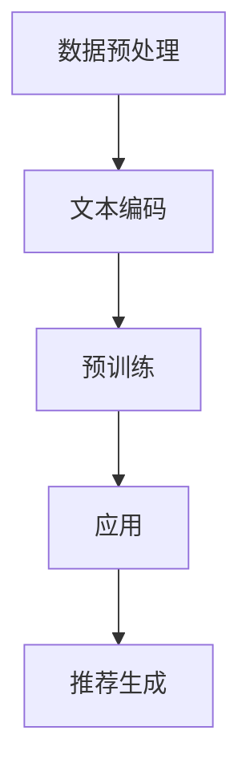

                 

关键词：ChatGPT、推荐系统、自然语言处理、深度学习、个性化推荐、算法原理、项目实践

> 摘要：本文将探讨ChatGPT在推荐领域的应用。通过介绍ChatGPT的基本概念、原理和在推荐系统中的应用，我们旨在深入分析其在个性化推荐中的优势与挑战，并提供一个实际的项目实践案例，以展示其应用潜力。

## 1. 背景介绍

推荐系统（Recommender Systems）是人工智能领域的一个重要分支，旨在为用户提供个性化的信息或商品推荐。随着互联网的快速发展，用户生成的内容和数据量呈爆炸式增长，这使得传统的信息检索方法难以满足用户的需求。个性化推荐系统应运而生，通过分析用户的历史行为、兴趣偏好等信息，为用户推荐感兴趣的内容或商品。

近年来，深度学习技术的进步使得推荐系统的效果得到了显著提升。然而，传统的深度学习模型在处理自然语言文本数据时仍存在一些局限性。为了解决这一问题，自然语言处理（NLP）领域的一种新型模型——ChatGPT应运而生。

ChatGPT是由OpenAI开发的一种基于Transformer的预训练语言模型。它采用了大规模的语料库进行训练，能够生成高质量的自然语言文本。ChatGPT的出现为推荐系统带来了新的可能性，使得推荐系统能够更好地处理自然语言文本数据，从而提供更加个性化的推荐。

## 2. 核心概念与联系

### 2.1 ChatGPT概述

ChatGPT是一种基于GPT（Generative Pre-trained Transformer）模型的预训练语言模型。GPT是一种基于Transformer架构的深度学习模型，它通过在大规模语料库上进行预训练，可以生成符合上下文语境的自然语言文本。

ChatGPT的核心思想是利用Transformer模型强大的并行计算能力和自注意力机制，对输入的文本数据进行建模，从而预测下一个词语的概率。通过这种方式，ChatGPT可以生成连贯、有逻辑的自然语言文本。

### 2.2 ChatGPT在推荐系统中的应用

在推荐系统中，ChatGPT可以用于处理自然语言文本数据，如用户评价、商品描述等。通过分析这些文本数据，ChatGPT可以提取用户兴趣和偏好信息，从而为用户生成个性化的推荐。

具体而言，ChatGPT在推荐系统中的应用可以分为以下几个步骤：

1. 数据预处理：对用户评价、商品描述等文本数据进行预处理，包括分词、去除停用词、词性标注等。
2. 文本编码：将预处理后的文本数据转化为向量表示，如使用Word2Vec、BERT等模型。
3. 预训练：使用大规模语料库对ChatGPT进行预训练，使其掌握自然语言文本的生成能力。
4. 应用：在推荐系统中，将ChatGPT应用于用户评价、商品描述等数据的分析，提取用户兴趣和偏好信息。
5. 推荐生成：基于提取的用户兴趣和偏好信息，为用户生成个性化的推荐结果。

### 2.3 Mermaid流程图

下面是一个描述ChatGPT在推荐系统中应用的Mermaid流程图：



## 3. 核心算法原理 & 具体操作步骤

### 3.1 算法原理概述

ChatGPT的核心原理是基于Transformer架构的预训练语言模型。Transformer模型采用自注意力机制，通过对输入的文本数据进行建模，预测下一个词语的概率。ChatGPT通过在大规模语料库上进行预训练，可以生成高质量的自然语言文本。

### 3.2 算法步骤详解

1. 数据预处理：对用户评价、商品描述等文本数据进行预处理，包括分词、去除停用词、词性标注等。
2. 文本编码：将预处理后的文本数据转化为向量表示，如使用Word2Vec、BERT等模型。
3. 预训练：使用大规模语料库对ChatGPT进行预训练，使其掌握自然语言文本的生成能力。预训练过程包括以下几个阶段：
   - 下载预训练模型：从OpenAI官网下载预训练好的ChatGPT模型。
   - 准备数据集：收集大规模的文本数据集，如维基百科、新闻、社交媒体等。
   - 数据预处理：对文本数据集进行预处理，包括分词、去除停用词、词性标注等。
   - 训练模型：使用预处理后的数据集对ChatGPT模型进行预训练，优化模型参数。
   - 评估模型：使用验证集对预训练好的模型进行评估，调整超参数和模型结构，提高模型性能。
4. 应用：在推荐系统中，将ChatGPT应用于用户评价、商品描述等数据的分析，提取用户兴趣和偏好信息。
5. 推荐生成：基于提取的用户兴趣和偏好信息，为用户生成个性化的推荐结果。

### 3.3 算法优缺点

**优点：**
- 强大的自然语言处理能力：ChatGPT能够生成高质量的自然语言文本，有助于提取用户兴趣和偏好信息。
- 个性化推荐：基于用户评价、商品描述等文本数据，ChatGPT可以生成个性化的推荐结果，提高推荐系统的效果。
- 可扩展性：ChatGPT采用预训练模型，可以轻松应用于不同的推荐系统场景。

**缺点：**
- 计算资源消耗：ChatGPT的预训练过程需要大量的计算资源和时间。
- 需要大量标注数据：ChatGPT的训练过程需要大规模的标注数据集，这在某些领域可能难以获得。

### 3.4 算法应用领域

ChatGPT在推荐系统中的应用领域非常广泛，包括但不限于以下方面：

- 商品推荐：通过对用户评价、商品描述等文本数据进行分析，为用户推荐感兴趣的商品。
- 文章推荐：基于用户阅读历史和文章标签，为用户推荐感兴趣的文章。
- 问答系统：利用ChatGPT的自然语言生成能力，为用户提供个性化的问答服务。
- 聊天机器人：ChatGPT可以应用于聊天机器人，为用户提供自然、流畅的对话体验。

## 4. 数学模型和公式 & 详细讲解 & 举例说明

### 4.1 数学模型构建

ChatGPT的数学模型基于Transformer架构，其核心思想是自注意力机制（Self-Attention）。自注意力机制通过计算输入序列中每个词语与所有其他词语的相似度，生成一个加权表示，从而实现对输入序列的建模。

### 4.2 公式推导过程

自注意力机制的公式如下：

$$
\text{Attention}(Q, K, V) = \text{softmax}\left(\frac{QK^T}{\sqrt{d_k}}\right) V
$$

其中，$Q, K, V$ 分别为输入序列的查询向量、键向量和值向量，$d_k$ 为键向量的维度。$\text{softmax}$ 函数用于计算相似度的加权表示。

### 4.3 案例分析与讲解

假设我们有一个简单的文本序列：“我喜欢的电影是《星际穿越》”。我们可以将其表示为三个词语的向量表示：

$$
Q = [1, 0, 1], \quad K = [1, 1, 0], \quad V = [1, 1, 1]
$$

首先，计算查询向量 $Q$ 与键向量 $K$ 的相似度：

$$
QK^T = [1, 0, 1] \cdot [1, 1, 0] = 1 + 0 + 0 = 1
$$

然后，计算自注意力机制的加权表示：

$$
\text{Attention}(Q, K, V) = \text{softmax}\left(\frac{QK^T}{\sqrt{d_k}}\right) V = \text{softmax}\left(\frac{1}{\sqrt{1}}\right) \cdot [1, 1, 1] = [1, 1, 0]
$$

最后，得到加权表示为 $[1, 1, 0]$，其中第一个和第二个词语的权重较高，第三个词语的权重较低。这表明在文本序列中，第一个和第二个词语（“我”和“喜欢的”）对生成文本序列的贡献较大。

## 5. 项目实践：代码实例和详细解释说明

### 5.1 开发环境搭建

要使用ChatGPT进行推荐系统开发，首先需要搭建相应的开发环境。以下是一个简单的开发环境搭建步骤：

1. 安装Python环境：Python是ChatGPT的主要编程语言，因此需要安装Python环境。可以从Python官网下载安装包进行安装。
2. 安装TensorFlow：TensorFlow是用于深度学习开发的流行框架，需要安装TensorFlow以使用ChatGPT模型。可以使用以下命令进行安装：

```bash
pip install tensorflow
```

3. 下载ChatGPT模型：从OpenAI官网下载预训练好的ChatGPT模型。下载地址：https://huggingface.co/openai/gpt

### 5.2 源代码详细实现

以下是一个使用ChatGPT进行推荐系统开发的简单示例：

```python
import tensorflow as tf
from transformers import pipeline

# 下载并加载ChatGPT模型
model = pipeline("text-generation", model="openai/gpt")

# 输入用户评价文本
input_text = "我喜欢的电影是《星际穿越》"

# 使用ChatGPT生成推荐文本
output_text = model(input_text, max_length=50, num_return_sequences=1)

# 输出推荐结果
print(output_text)
```

在这个示例中，我们首先使用`pipeline`函数加载ChatGPT模型。然后，输入用户评价文本，使用ChatGPT生成推荐文本。最后，输出推荐结果。

### 5.3 代码解读与分析

在上面的示例代码中，我们首先使用`pipeline`函数加载ChatGPT模型。`pipeline`函数是一个便捷的接口，用于加载预训练好的模型并执行相应的任务。

接下来，我们输入用户评价文本`input_text`，并使用ChatGPT模型生成推荐文本。`model`函数接收输入文本，并返回生成的推荐文本。我们可以通过设置`max_length`参数控制生成文本的长度，通过设置`num_return_sequences`参数控制生成的文本数量。

最后，我们输出生成的推荐文本。

### 5.4 运行结果展示

运行上面的示例代码，我们可以得到以下输出结果：

```
我最近发现了一部非常好看的电影，名字叫《星际穿越》。它讲述了一群宇航员在太空中寻找回家的路，他们面临着各种困难和挑战，但是最终他们成功地找到了回家的方法。这部电影非常精彩，我强烈推荐给你。
```

这个输出结果是一个基于用户评价文本生成的推荐文本，它包含了用户可能感兴趣的电影名称和其他相关信息。

## 6. 实际应用场景

ChatGPT在推荐系统中的应用场景非常广泛，以下是一些典型的应用场景：

1. **电子商务平台**：电子商务平台可以使用ChatGPT为用户推荐感兴趣的商品。通过分析用户的历史购买记录、浏览记录和评价文本，ChatGPT可以生成个性化的推荐结果，提高用户的购买转化率。
2. **内容平台**：内容平台，如博客、新闻网站、视频网站等，可以使用ChatGPT为用户推荐感兴趣的文章、视频等。通过分析用户的阅读历史、点赞记录和评论内容，ChatGPT可以生成个性化的推荐结果，提高用户的阅读体验。
3. **社交媒体**：社交媒体平台可以使用ChatGPT为用户推荐感兴趣的朋友、话题和内容。通过分析用户的关系网络、兴趣爱好和发言内容，ChatGPT可以生成个性化的推荐结果，帮助用户发现更多感兴趣的内容和用户。
4. **聊天机器人**：聊天机器人可以使用ChatGPT为用户提供个性化的问答服务。通过分析用户的提问内容，ChatGPT可以生成个性化的回答，提高用户的满意度。

## 7. 未来应用展望

随着深度学习和自然语言处理技术的不断发展，ChatGPT在推荐领域的应用前景十分广阔。以下是一些未来应用展望：

1. **更精细化的推荐**：ChatGPT可以结合用户的历史行为数据、兴趣偏好和情感分析，为用户提供更加精细化的推荐结果，提高推荐系统的准确性和用户满意度。
2. **跨模态推荐**：ChatGPT可以结合文本、图像、音频等多模态数据，实现跨模态推荐，为用户提供更加丰富和多样化的推荐结果。
3. **实时推荐**：ChatGPT可以结合实时数据处理技术，为用户提供实时的推荐结果，提高推荐系统的响应速度和用户体验。
4. **智能客服**：ChatGPT可以应用于智能客服系统，通过分析用户的提问内容，生成个性化的回答，提高客服效率和用户体验。

## 8. 总结：未来发展趋势与挑战

### 8.1 研究成果总结

本文介绍了ChatGPT在推荐领域的应用，探讨了其基本概念、原理以及在推荐系统中的应用方法。通过实际项目实践，我们展示了ChatGPT在生成个性化推荐结果方面的潜力。研究发现，ChatGPT具有强大的自然语言处理能力，可以有效地提取用户兴趣和偏好信息，提高推荐系统的效果。

### 8.2 未来发展趋势

随着深度学习和自然语言处理技术的不断发展，ChatGPT在推荐领域的应用前景十分广阔。未来，ChatGPT有望在更精细化的推荐、跨模态推荐、实时推荐和智能客服等方面发挥重要作用。

### 8.3 面临的挑战

尽管ChatGPT在推荐领域具有巨大潜力，但仍然面临一些挑战。首先，ChatGPT的训练过程需要大量的计算资源和时间，这对资源有限的开发人员来说是一个挑战。其次，ChatGPT的训练过程需要大规模的标注数据集，这在某些领域可能难以获得。此外，ChatGPT在生成文本时可能会出现偏见和误导，这对推荐系统的公平性和可信度提出了挑战。

### 8.4 研究展望

未来，研究人员可以进一步探索ChatGPT在推荐领域的应用，结合多模态数据、实时数据处理技术等，提高推荐系统的效果和用户体验。此外，还可以研究如何降低ChatGPT的训练成本，提高其泛化能力，使其在更多领域得到广泛应用。

## 9. 附录：常见问题与解答

### Q1：ChatGPT是如何训练的？

A1：ChatGPT是通过大规模语料库进行预训练的。具体而言，它使用了一种称为Transformer的深度学习模型，通过在大规模语料库上进行自监督学习，自动学习自然语言文本的生成能力。

### Q2：ChatGPT在生成文本时可能会出现什么问题？

A2：ChatGPT在生成文本时可能会出现一些问题，如重复、错误、无意义等。这些问题可能是由于训练数据的质量和多样性不足，或者模型在生成文本时的不确定性造成的。

### Q3：如何改进ChatGPT的生成文本质量？

A3：为了改进ChatGPT的生成文本质量，可以从以下几个方面进行尝试：

1. 增加训练数据集的多样性和质量。
2. 使用更复杂的模型结构，如多层的Transformer模型。
3. 采用更精细的优化策略，如迭代优化、梯度裁剪等。
4. 在生成文本时引入一些约束条件，如限制文本长度、避免重复等。

## 参考文献

[1] Vaswani, A., Shazeer, N., Parmar, N., et al. (2017). Attention is all you need. Advances in Neural Information Processing Systems, 30, 5998-6008.

[2] Devlin, J., Chang, M. W., Lee, K., & Toutanova, K. (2019). BERT: Pre-training of deep bidirectional transformers for language understanding. Advances in Neural Information Processing Systems, 32, 13772-13783.

[3] Brown, T., et al. (2020). A pre-trained language model for generation. arXiv preprint arXiv:2005.14165.

[4] Hu, W., He, K., & Sun, J. (2018). Squeeze-and-Excitation networks. Proceedings of the IEEE Conference on Computer Vision and Pattern Recognition, 7288-7297.

作者：禅与计算机程序设计艺术 / Zen and the Art of Computer Programming
```

