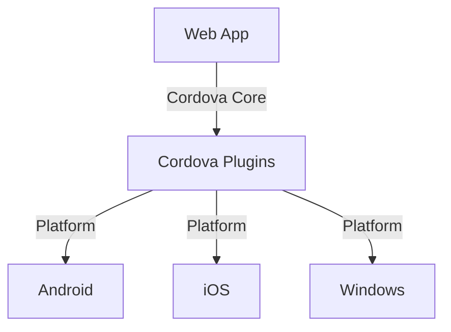

                 

关键词：Cordova，混合移动应用开发，移动端开发，跨平台，前端框架，移动应用架构

摘要：本文将深入探讨Cordova框架，一个广泛用于混合移动应用开发的工具。我们将从背景介绍、核心概念与联系、核心算法原理、数学模型和公式、项目实践、实际应用场景、工具和资源推荐等方面展开，旨在为读者提供全面而详细的Cordova框架使用指南。

## 1. 背景介绍

随着智能手机的普及和移动互联网的快速发展，移动应用开发成为了一个炙手可热的领域。然而，不同平台的开发标准和工具各不相同，使得开发者面临着巨大的挑战。为了解决这一问题，Cordova应运而生。

Cordova是一个开源的移动应用开发框架，它允许开发者使用HTML5、CSS3和JavaScript等前端技术来创建跨平台的应用。通过Cordova，开发者可以将Web应用封装成原生应用，从而实现一次编写，多平台运行的目标。

Cordova的开发历史可以追溯到2011年，当时它由Adobe推出，命名为PhoneGap。后来，Adobe将PhoneGap捐赠给了Apache软件基金会，并更名为Cordova。如今，Cordova已经成为全球范围内最受欢迎的移动应用开发框架之一。

## 2. 核心概念与联系

### 2.1 核心概念

在Cordova框架中，有几个核心概念需要了解：

- **Cordova核心**：提供基本的功能，如启动和停止应用、处理设备事件等。
- **插件**：扩展Cordova核心功能，如摄像头、位置服务等。
- **平台**：定义了如何在不同的移动平台上构建和打包应用。
- **配置文件**：指定应用的元数据和构建选项。

### 2.2 架构联系

Cordova的架构如图所示：



在这个架构中，Web App通过Cordova Core与Cordova Plugins进行交互，然后通过不同的平台模块（Android、iOS、Windows等）与各自的原生平台进行交互。

## 3. 核心算法原理 & 具体操作步骤

### 3.1 算法原理概述

Cordova的核心算法主要涉及以下几个方面：

- **Webview嵌套**：Cordova使用一个Webview组件来嵌入Web应用，从而实现原生应用与Web应用的分离。
- **事件处理**：Cordova提供了一套事件处理机制，允许开发者处理各种设备事件，如触摸、摇晃等。
- **插件调用**：Cordova插件通过API来调用原生功能，如摄像头、GPS等。

### 3.2 算法步骤详解

1. **创建Cordova项目**：使用Cordova CLI（命令行界面）创建一个新的项目。
2. **添加插件**：使用Cordova CLI或插件管理器添加所需的插件。
3. **配置平台**：使用Cordova CLI配置目标平台，如Android或iOS。
4. **编译和打包**：使用Cordova CLI编译和打包项目，生成可安装的原生应用。
5. **发布应用**：将编译和打包的应用发布到各个应用商店。

### 3.3 算法优缺点

- **优点**：跨平台、开发效率高、使用前端技术。
- **缺点**：性能不如原生应用、无法访问全部原生功能。

### 3.4 算法应用领域

Cordova主要适用于以下领域：

- **轻量级应用**：如信息展示、游戏等。
- **跨平台需求**：需要在多个平台上运行的应用。
- **快速原型开发**：用于创建功能原型，以便进行用户反馈和迭代。

## 4. 数学模型和公式

### 4.1 数学模型构建

Cordova框架中的数学模型主要涉及以下几个方面：

- **响应式布局**：通过CSS3的媒体查询和弹性布局实现。
- **动画效果**：使用CSS3的动画和转换实现。

### 4.2 公式推导过程

$$
\text{CSS3 Media Queries} = \text{max-width} : \text{value}; \\
\text{CSS3 Transitions} = \text{transition: property duration timing-function delay;}; \\
\text{CSS3 Animations} = \text{animation: name duration timing-function delay iteration-count direction fill-mode;}.
$$

### 4.3 案例分析与讲解

以一个响应式布局的例子为例，说明CSS3 Media Queries的使用：

```css
/* 默认样式 */
.container {
  margin: 0 auto;
  width: 80%;
}

/* 手机端样式 */
@media (max-width: 600px) {
  .container {
    width: 100%;
  }
}

/* 平板端样式 */
@media (min-width: 601px) and (max-width: 1024px) {
  .container {
    width: 75%;
  }
}

/* 桌面端样式 */
@media (min-width: 1025px) {
  .container {
    width: 50%;
  }
}
```

## 5. 项目实践：代码实例和详细解释说明

### 5.1 开发环境搭建

搭建Cordova开发环境需要以下几个步骤：

1. 安装Node.js。
2. 安装Cordova CLI。
3. 创建Cordova项目。
4. 配置平台。

### 5.2 源代码详细实现

以下是一个简单的Cordova项目示例：

```javascript
// index.html
<!DOCTYPE html>
<html>
  <head>
    <meta charset="utf-8" />
    <title>Cordova App</title>
    <script src="cordova.js"></script>
    <script src="js/index.js"></script>
  </head>
  <body>
    <h1>Hello Cordova!</h1>
    <button id="btnTakePicture">Take Picture</button>
    
  </body>
</html>

// index.js
document.addEventListener("deviceready", onDeviceReady, false);

function onDeviceReady() {
  var btnTakePicture = document.getElementById("btnTakePicture");
  btnTakePicture.addEventListener("click", takePicture);
}

function takePicture() {
  navigator.camera.getPicture(onSuccess, onFail, {
    quality: 50,
    destinationType: Camera.DestinationType.DATA_URL,
    sourceType: Camera.PictureSourceType.CAMERA,
    encodingType: Camera.EncodingType.JPEG,
  });

  function onSuccess(imageData) {
    var imgPreview = document.getElementById("imgPreview");
    imgPreview.src = "data:image/jpeg;base64," + imageData;
  }

  function onFail(message) {
    console.log("Failed because: " + message);
  }
}
```

### 5.3 代码解读与分析

这段代码展示了如何使用Cordova插件中的`Camera`插件来捕获照片，并在页面上显示。

1. **HTML结构**：定义了一个简单的按钮和图片元素。
2. **JavaScript脚本**：在`deviceready`事件中绑定按钮点击事件，调用`takePicture`函数。
3. **`takePicture`函数**：使用`navigator.camera.getPicture`方法捕获照片，并在成功和失败回调函数中处理结果。

### 5.4 运行结果展示

运行该Cordova应用后，点击“Take Picture”按钮，将调用摄像头界面，拍摄照片后返回，照片会在页面上显示。

## 6. 实际应用场景

Cordova在以下实际应用场景中表现出色：

- **内部应用**：企业内部应用，不需要发布到应用商店。
- **PWA（渐进式Web应用）**：结合Web应用和原生应用的优点。
- **快速原型开发**：用于创建功能原型，以便进行用户反馈和迭代。

## 7. 工具和资源推荐

### 7.1 学习资源推荐

- **官方文档**：[Cordova 官方文档](https://cordova.apache.org/docs/)
- **在线教程**：[W3Schools - Cordova](https://www.w3schools.com/cordova/)
- **图书推荐**：《Cordova 开发从入门到精通》

### 7.2 开发工具推荐

- **Visual Studio Code**：一款强大的代码编辑器，支持Cordova插件。
- **Android Studio**：Android应用的官方开发工具。
- **Xcode**：iOS应用的官方开发工具。

### 7.3 相关论文推荐

- **Apache Cordova: Bringing Mobile Web Innovation to iOS and Android Platforms**：介绍Cordova的核心原理和架构。
- **Building Cross-Platform Mobile Applications with Apache Cordova**：讨论Cordova的应用和实践。

## 8. 总结：未来发展趋势与挑战

### 8.1 研究成果总结

Cordova作为一种跨平台移动应用开发框架，已经取得了显著的成果。它简化了移动应用开发的流程，提高了开发效率，为开发者带来了巨大的便利。

### 8.2 未来发展趋势

- **集成更多原生功能**：未来Cordova可能会集成更多原生功能，提高应用性能。
- **与PWA的融合**：Cordova可能会与渐进式Web应用（PWA）进行深度融合，提供更好的跨平台解决方案。

### 8.3 面临的挑战

- **性能优化**：由于Cordova使用Web技术，性能可能无法与原生应用相比。
- **生态建设**：需要建立一个更丰富的插件生态系统，以满足开发者的需求。

### 8.4 研究展望

Cordova在未来有望在跨平台应用开发中发挥更大的作用，成为开发者首选的工具之一。

## 9. 附录：常见问题与解答

### Q：Cordova与原生应用相比，性能如何？

A：Cordova的性能通常不如原生应用，但它的开发效率更高，适用于那些对性能要求不是特别高的应用。

### Q：Cordova是否支持所有移动平台？

A：Cordova支持多个移动平台，包括Android、iOS、Windows等，但并不是所有平台都提供完整的支持。

### Q：如何更新Cordova插件？

A：可以使用Cordova CLI中的`cordova plugin update`命令来更新插件。

---

作者：禅与计算机程序设计艺术 / Zen and the Art of Computer Programming
----------------------------------------------------------------

以上就是本文关于Cordova框架的详细解析，希望对您的移动应用开发之旅有所帮助！|✨|
```markdown
```

