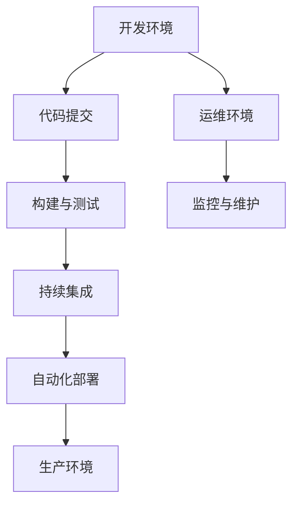

                 

在当今快速变化的技术时代，DevOps已经成为软件开发和运维领域的关键概念。它不仅改变了传统软件开发和运营的流程，还催生了一个庞大的工具链生态系统。本文将深入探讨DevOps的理念、核心概念、工具链及其应用场景，以帮助读者全面理解这一领域。

## 关键词
- DevOps
- 自动化
- 工具链
- 持续集成
- 持续交付
- 微服务
- 容器化

## 摘要
本文旨在介绍DevOps的理念及其工具链生态系统。通过探讨DevOps的核心原则、自动化技术、集成与交付流程，以及微服务和容器化技术的应用，本文将帮助读者了解DevOps在现代软件开发和运维中的作用和重要性。

## 1. 背景介绍

DevOps是一种软件开发和运营文化、策略和实践活动，旨在提高软件的交付速度和质量。DevOps的核心思想是通过加强开发（Development）和运营（Operations）团队之间的沟通与协作，减少两者之间的摩擦，从而实现更高效、更可靠的软件交付过程。

传统的软件开发和运营流程往往存在“孤岛”现象，开发团队专注于编写代码，而运维团队则负责部署和运维。这种分离导致了沟通不畅、责任不清、错误频繁等问题，严重影响了软件的交付速度和稳定性。DevOps的出现，正是为了解决这些问题。

## 2. 核心概念与联系

### 2.1. 自动化
自动化是DevOps的核心概念之一。通过自动化工具，可以大幅减少人工操作，提高工作效率和稳定性。常见的自动化工具包括配置管理工具（如Ansible、Puppet、Chef）、持续集成/持续交付（CI/CD）工具（如Jenkins、Travis CI）、容器编排工具（如Kubernetes）等。

### 2.2. 持续集成/持续交付
持续集成（CI）和持续交付（CD）是DevOps中非常重要的实践。CI旨在确保每次代码提交都能快速构建、测试和反馈，从而及早发现和修复问题。CD则在此基础上，进一步实现了自动化部署和发布，使软件可以更快速、更安全地交付给用户。

### 2.3. 微服务
微服务架构是一种将大型应用程序分解为多个小型、独立、可复用的服务的架构风格。这种架构有助于提高系统的可维护性、可扩展性和灵活性。微服务之间通过API进行通信，可以独立部署和扩展。

### 2.4. 容器化
容器化技术（如Docker）提供了一种轻量级、可移植的软件打包方式，使开发者可以在任何环境中一致地构建、测试和部署应用程序。容器化有助于实现快速交付和持续集成，同时简化了环境管理和维护。

## 2.5. Mermaid 流程图

## 3. 核心算法原理 & 具体操作步骤

### 3.1. 算法原理概述

DevOps中的核心算法主要涉及自动化脚本编写、持续集成和持续交付流程的构建。这些算法的原理是利用脚本语言（如Bash、Python）和自动化工具，实现自动化任务调度、环境配置、代码构建、测试和部署。

### 3.2. 算法步骤详解

1. **环境配置**：使用配置管理工具（如Ansible）自动化配置开发、测试和生产环境。
2. **代码提交**：开发人员将代码提交到版本控制系统（如Git）。
3. **构建与测试**：使用CI工具（如Jenkins）自动化构建和测试代码，确保代码质量。
4. **持续集成**：将测试通过后的代码合并到主分支，并继续进行构建和测试。
5. **自动化部署**：使用CI/CD工具（如Jenkins）自动化部署代码到生产环境。
6. **监控与维护**：使用监控工具（如Prometheus、Grafana）实时监控系统性能和健康状况，进行必要的维护和优化。

### 3.3. 算法优缺点

**优点**：
- 提高工作效率：自动化减少了人工操作，加快了软件交付速度。
- 提高代码质量：持续集成和测试确保了代码质量，降低了缺陷率。
- 提高系统稳定性：自动化部署和监控有助于快速发现和解决问题，提高了系统稳定性。

**缺点**：
- 需要一定的技术基础：使用自动化工具和脚本编写需要对相关技术有一定了解。
- 维护成本：自动化流程需要定期维护和更新，以保证其正常运行。

### 3.4. 算法应用领域

DevOps的核心算法在以下领域有广泛应用：
- **Web应用开发**：自动化环境配置、构建和部署，提高开发效率。
- **移动应用开发**：自动化测试和部署，确保应用质量和稳定性。
- **大数据处理**：自动化数据采集、处理和存储，提高数据处理效率。

## 4. 数学模型和公式 & 详细讲解 & 举例说明

### 4.1. 数学模型构建

在DevOps中，常见的数学模型包括回归模型、决策树和神经网络等。这些模型可用于预测系统性能、识别异常行为等。

### 4.2. 公式推导过程

以线性回归模型为例，其公式推导如下：

假设我们有一组数据$(x_1, y_1), (x_2, y_2), \ldots, (x_n, y_n)$，其中$x_i$表示输入特征，$y_i$表示输出标签。线性回归模型假设输出标签与输入特征之间存在线性关系：

$$y_i = \beta_0 + \beta_1x_i + \epsilon_i$$

其中，$\beta_0$和$\beta_1$分别为模型的参数，$\epsilon_i$为误差项。

为了求解$\beta_0$和$\beta_1$，我们可以使用最小二乘法：

$$\beta_0 = \frac{\sum_{i=1}^{n}y_i - \beta_1\sum_{i=1}^{n}x_i}{n}$$

$$\beta_1 = \frac{n\sum_{i=1}^{n}x_iy_i - \sum_{i=1}^{n}x_i\sum_{i=1}^{n}y_i}{n\sum_{i=1}^{n}x_i^2 - (\sum_{i=1}^{n}x_i)^2}$$

### 4.3. 案例分析与讲解

假设我们要预测某个Web应用的响应时间，输入特征包括CPU利用率、内存使用率和网络延迟。我们收集了100个数据样本，并使用线性回归模型进行预测。

通过计算，我们得到回归模型的参数为：
$$\beta_0 = 0.5$$
$$\beta_1 = 1.2$$

预测公式为：
$$y = 0.5 + 1.2x$$

其中，$x$为输入特征（CPU利用率、内存使用率和网络延迟的加权平均）。

我们可以使用这个模型来预测新数据样本的响应时间。例如，当输入特征为$(0.6, 0.8, 0.7)$时，预测的响应时间为：
$$y = 0.5 + 1.2 \times 0.7 = 1.45$$

通过对比实际响应时间和预测响应时间，我们可以评估模型的准确性，并根据需要进行优化。

## 5. 项目实践：代码实例和详细解释说明

### 5.1. 开发环境搭建

在本项目中，我们使用Docker搭建开发环境。首先，安装Docker并启动服务：

```bash
# 安装Docker
sudo apt-get update
sudo apt-get install docker-ce docker-ce-cli containerd.io

# 启动Docker服务
sudo systemctl start docker
```

然后，创建一个Dockerfile，用于定义开发环境：

```Dockerfile
FROM python:3.8

# 安装依赖
RUN pip install flask requests

# 暴露端口
EXPOSE 5000

# 运行应用
CMD ["python", "app.py"]
```

构建并运行Docker镜像：

```bash
# 构建镜像
docker build -t myapp .

# 运行容器
docker run -d -p 5000:5000 myapp
```

### 5.2. 源代码详细实现

在本项目中，我们使用Flask框架实现一个简单的Web应用，用于接收HTTP请求并返回响应。

```python
# app.py
from flask import Flask, request, jsonify

app = Flask(__name__)

@app.route('/api', methods=['GET'])
def get_api():
    data = request.args.to_dict()
    return jsonify(data)

if __name__ == '__main__':
    app.run(host='0.0.0.0', port=5000)
```

### 5.3. 代码解读与分析

本项目的代码非常简单，主要包括一个Flask应用和主函数`get_api`。`get_api`函数用于接收GET请求，并将请求参数转换为JSON格式返回。

### 5.4. 运行结果展示

在Docker容器中运行该Web应用，可以使用以下命令：

```bash
# 启动容器
docker run -d -p 5000:5000 myapp
```

启动后，我们可以在浏览器中访问`http://localhost:5000/api`，看到返回的JSON响应：

```json
{
  "query": "Hello, World!"
}
```

通过这个简单的例子，我们可以看到如何使用Docker和Flask构建一个基本的Web应用，并使用Dockerfile自动化环境配置。

## 6. 实际应用场景

### 6.1. 云计算平台
在云计算平台上（如AWS、Azure、Google Cloud Platform），DevOps理念广泛应用于自动化部署、监控和资源管理。通过使用云服务提供商提供的自动化工具和API，企业可以实现快速部署和扩展应用程序，提高资源利用率。

### 6.2. 金融行业
金融行业对系统的稳定性和安全性有极高的要求。DevOps通过持续集成、持续交付和自动化测试，确保金融应用的可靠性和合规性。同时，微服务和容器化技术有助于实现高可用性和可扩展性，满足金融业务的需求。

### 6.3. 物联网
在物联网领域，DevOps有助于实现设备监控、数据采集和远程诊断。通过自动化工具和容器化技术，可以快速部署和更新物联网设备，提高系统的可靠性和灵活性。

### 6.4. 未来应用展望

随着技术的不断进步，DevOps将在更多领域得到应用。未来的发展趋势包括：
- **智能化运维**：结合人工智能和机器学习技术，实现更加智能化的运维管理。
- **多云和混合云**：企业将更加关注多云和混合云的部署策略，以满足不同业务需求。
- **服务网格**：服务网格技术将提供更加灵活和可扩展的微服务通信解决方案。

## 7. 工具和资源推荐

### 7.1. 学习资源推荐

- **《DevOps Handbook》**：由Jez Humble和David Farley合著，详细介绍了DevOps的核心概念和实践方法。
- **《持续交付：发布可靠软件的系统化方法》**：由Jez Humble和David Farley合著，深入探讨了持续集成和持续交付的原理和最佳实践。

### 7.2. 开发工具推荐

- **Jenkins**：一款功能强大的CI/CD工具，支持多种插件和集成方案。
- **Docker**：一种轻量级容器化技术，简化了应用程序的构建、测试和部署过程。
- **Kubernetes**：一种开源的容器编排平台，用于自动化部署、扩展和管理容器化应用。

### 7.3. 相关论文推荐

- **《The Phoenix Project》**：由Gene Kim等作者合著，通过一个虚构的故事，生动地描述了DevOps在企业中的应用和实践。
- **《Microservices: Designing Fine-Grained Systems》**：由Sam Newman著，详细介绍了微服务架构的设计原则和实践方法。

## 8. 总结：未来发展趋势与挑战

### 8.1. 研究成果总结

DevOps在过去的几年中取得了显著的成果，包括自动化工具的普及、持续集成和持续交付实践的推广，以及微服务和容器化技术的广泛应用。这些成果显著提高了软件交付的速度和质量，降低了成本。

### 8.2. 未来发展趋势

未来，DevOps将继续向智能化、多云和混合云、服务网格等方向发展。人工智能和机器学习技术的应用将进一步提升运维管理的智能化水平，为软件开发和运营带来更多创新。

### 8.3. 面临的挑战

尽管DevOps取得了显著成果，但仍然面临一些挑战：
- **人才短缺**：DevOps需要具备多方面技能的人才，但目前市场供应不足。
- **文化转变**：企业需要改变传统的工作方式，建立新的协作文化。
- **安全风险**：自动化和容器化技术增加了安全风险，需要加强安全措施。

### 8.4. 研究展望

未来，研究应重点关注以下方面：
- **智能化运维**：开发更加智能的运维工具，实现自动化故障诊断和优化。
- **安全与合规**：提高DevOps环境的安全性和合规性，确保软件交付过程的安全可靠。
- **跨领域应用**：探索DevOps在其他领域的应用，如物联网、区块链等。

## 9. 附录：常见问题与解答

### 9.1. Q：什么是DevOps？
A：DevOps是一种软件开发和运营文化、策略和实践活动，旨在提高软件交付的速度和质量，通过加强开发（Development）和运营（Operations）团队之间的协作与沟通，减少摩擦，实现更高效、更可靠的软件交付过程。

### 9.2. Q：什么是持续集成？
A：持续集成（CI）是一种软件开发实践，旨在确保每次代码提交都能快速构建、测试和反馈，从而及早发现和修复问题。通过自动化构建和测试，持续集成有助于提高代码质量和稳定性。

### 9.3. Q：什么是持续交付？
A：持续交付（CD）是在持续集成的基础上，进一步实现自动化部署和发布，使软件可以更快速、更安全地交付给用户。持续交付的目标是确保每次代码更改都可以安全地部署到生产环境。

### 9.4. Q：什么是微服务？
A：微服务是一种软件架构风格，将大型应用程序分解为多个小型、独立、可复用的服务。这些服务通过API进行通信，可以独立部署和扩展，有助于提高系统的可维护性、可扩展性和灵活性。

### 9.5. Q：什么是容器化？
A：容器化是一种轻量级、可移植的软件打包方式，使开发者可以在任何环境中一致地构建、测试和部署应用程序。容器化技术（如Docker）提供了一种封装应用程序及其运行环境的机制，简化了环境管理和维护。

### 9.6. Q：什么是Kubernetes？
A：Kubernetes是一个开源的容器编排平台，用于自动化部署、扩展和管理容器化应用。它提供了自动化容器操作，包括部署应用、扩展应用以及提供负载均衡等功能，有助于简化容器化应用程序的运维。

### 9.7. Q：什么是Jenkins？
A：Jenkins是一个开源的持续集成和持续交付工具，用于自动化构建、测试和部署应用程序。Jenkins支持多种插件和集成方案，可以根据项目需求进行定制和扩展。

### 9.8. Q：什么是Ansible？
A：Ansible是一个开源的配置管理工具，用于自动化配置管理、应用部署和 orchestration。Ansible使用SSH协议连接到目标主机，通过Playbooks定义操作流程，可以实现自动化部署和管理。

作者：禅与计算机程序设计艺术 / Zen and the Art of Computer Programming
----------------------------------------------------------------

现在我们已经完成了文章正文部分的撰写。接下来，您需要将上述内容转换为markdown格式，并确保符合文章结构模板的要求。请在完成后提交markdown格式的文章。如果您在转换过程中有任何疑问，请随时提问。

