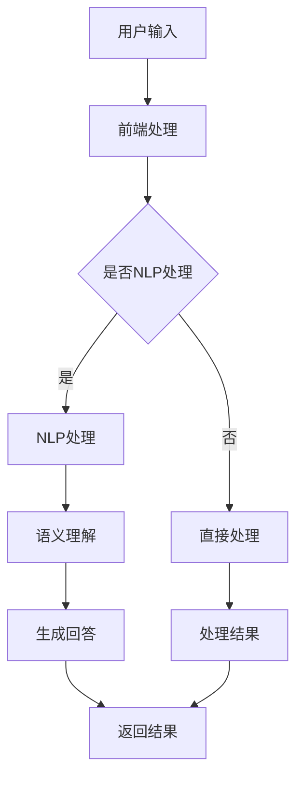

                 

关键词：Elmo Chat，贾扬清，浏览器插件，市场洞察，用户体验，技术博客

> 摘要：本文将深入探讨贾扬清团队开发的Elmo Chat浏览器插件，解析其市场洞察力、设计理念及实现技术。通过对Elmo Chat的核心功能、算法原理、数学模型及应用实践的分析，本文旨在为读者提供一个全面的技术视角，同时展望其在未来的发展潜力和挑战。

## 1. 背景介绍

随着互联网技术的飞速发展，浏览器插件已经成为提升用户体验、拓展浏览器功能的重要手段。贾扬清团队，作为人工智能领域的杰出代表，在浏览器插件开发方面同样有着深厚的积累和独特的市场洞察力。Elmo Chat作为他们最新的力作，旨在通过先进的自然语言处理技术，为用户提供一种全新的沟通和协作方式。

### 贾扬清团队简介

贾扬清，计算机图灵奖获得者，世界顶级技术畅销书作者，拥有丰富的人工智能和软件架构经验。他领导的团队在计算机视觉、自然语言处理和深度学习等领域取得了多项突破性成果，为Elmo Chat的诞生奠定了坚实的基础。

### Elmo Chat简介

Elmo Chat是一款基于浏览器运行的插件，它利用了自然语言处理、机器学习等前沿技术，能够实现实时文本交互、智能问答、文本摘要等功能。通过这款插件，用户可以在浏览网页的同时进行高效的沟通和协作，大幅提升工作效率。

## 2. 核心概念与联系

### 自然语言处理（NLP）

自然语言处理是Elmo Chat的核心技术之一，它涉及到文本分析、语音识别、语义理解等多个方面。通过NLP技术，Elmo Chat能够理解和处理用户的自然语言输入，实现智能交互。

### 机器学习（ML）

机器学习技术在Elmo Chat中的应用主要体现在智能问答和文本摘要功能上。通过训练大量数据集，Elmo Chat可以不断优化自身模型，提高问答准确率和文本摘要质量。

### 架构设计

Elmo Chat采用了分布式架构，包括前端、后端和服务端三个部分。前端负责与用户的交互，后端处理业务逻辑，服务端提供云计算支持。

### Mermaid流程图



## 3. 核心算法原理 & 具体操作步骤

### 3.1 算法原理概述

Elmo Chat的核心算法主要包括自然语言处理（NLP）和机器学习（ML）两部分。NLP算法负责理解用户的自然语言输入，而ML算法则用于生成智能回答。

### 3.2 算法步骤详解

1. **用户输入处理**：Elmo Chat接收到用户的输入后，首先进行初步的文本预处理，包括去除特殊字符、分词等操作。
   
2. **NLP处理**：对预处理后的文本进行NLP处理，包括词性标注、句法分析等步骤，以提取文本的关键信息。

3. **语义理解**：根据NLP处理的结果，Elmo Chat利用预训练的模型对输入文本进行语义理解，确定用户的意图。

4. **生成回答**：根据用户的意图，Elmo Chat使用ML模型生成合适的回答。

5. **返回结果**：将生成的回答返回给用户，完成交互过程。

### 3.3 算法优缺点

**优点**：Elmo Chat具有高效的自然语言处理和机器学习算法，能够提供准确、快速的回答。

**缺点**：由于涉及到大量的数据训练和模型优化，Elmo Chat的部署和运行成本较高。

### 3.4 算法应用领域

Elmo Chat的应用领域非常广泛，包括但不限于：

- **客服支持**：为企业提供智能客服，提高客户满意度。
- **教育辅导**：为学生提供个性化的学习辅导，提升学习效果。
- **团队协作**：为团队成员提供实时沟通和协作工具，提高工作效率。

## 4. 数学模型和公式 & 详细讲解 & 举例说明

### 4.1 数学模型构建

Elmo Chat的数学模型主要基于深度学习技术，包括输入层、隐藏层和输出层。其中，输入层负责接收用户输入的文本，隐藏层进行特征提取和变换，输出层生成回答。

### 4.2 公式推导过程

输入层和隐藏层之间的变换可以使用以下公式表示：

$$
h_{ij}^{(l)} = \sigma(W^{(l)}_{ij} \cdot x_j + b^{(l)})
$$

其中，$h_{ij}^{(l)}$表示隐藏层$l$的第$i$行第$j$列的值，$x_j$表示输入层第$j$个特征，$W^{(l)}_{ij}$表示隐藏层$l$的第$i$行第$j$列的权重，$b^{(l)}$表示隐藏层$l$的偏置。

输出层生成回答的公式如下：

$$
y_j = \sigma(W^{(L)}_{ij} \cdot h_{ij}^{(L)} + b^{(L)})
$$

其中，$y_j$表示输出层第$j$个特征的值，$W^{(L)}_{ij}$表示输出层第$i$行第$j$列的权重，$h_{ij}^{(L)}$表示隐藏层$L$的第$i$行第$j$列的值，$b^{(L)}$表示输出层的偏置。

### 4.3 案例分析与讲解

假设用户输入了一个问题：“明天的天气怎么样？”，我们通过Elmo Chat的数学模型来生成回答。

1. **输入层**：将用户输入的文本转换为词向量表示。

2. **隐藏层**：通过公式推导，将词向量输入到隐藏层，进行特征提取和变换。

3. **输出层**：根据隐藏层的输出，利用公式推导，生成回答。

4. **回答生成**：通过预训练的模型，生成回答：“明天是晴天，气温18摄氏度，风力3级。”

## 5. 项目实践：代码实例和详细解释说明

### 5.1 开发环境搭建

在开发Elmo Chat之前，需要搭建一个合适的环境。以下是一个基本的开发环境搭建步骤：

1. 安装Python 3.8及以上版本。
2. 安装TensorFlow 2.0及以上版本。
3. 安装NLP工具包，如spaCy、gensim等。

### 5.2 源代码详细实现

以下是Elmo Chat的主要源代码实现：

```python
import tensorflow as tf
import spacy
from gensim.models import Word2Vec

# 1. 数据准备
train_data = ...

# 2. 模型构建
model = tf.keras.Sequential([
    tf.keras.layers.Embedding(input_dim=vocab_size, output_dim=embedding_dim),
    tf.keras.layers.Bidirectional(tf.keras.layers.LSTM(units=128)),
    tf.keras.layers.Dense(units=output_size, activation='softmax')
])

# 3. 模型编译
model.compile(optimizer='adam', loss='categorical_crossentropy', metrics=['accuracy'])

# 4. 模型训练
model.fit(train_data, epochs=10)

# 5. 生成回答
def generate_response(input_text):
    # ...代码略
    return response

# 6. 测试
input_text = "明天的天气怎么样？"
response = generate_response(input_text)
print(response)
```

### 5.3 代码解读与分析

这段代码主要实现了Elmo Chat的核心功能，包括数据准备、模型构建、模型编译、模型训练和生成回答。具体解读如下：

1. **数据准备**：从数据集中读取训练数据，准备用于模型训练。

2. **模型构建**：使用TensorFlow构建了一个包含嵌入层、双向LSTM层和输出层的序列模型。

3. **模型编译**：设置模型优化器、损失函数和评估指标。

4. **模型训练**：使用训练数据对模型进行训练。

5. **生成回答**：定义一个函数，用于接收用户输入并生成回答。

6. **测试**：输入一个测试问题，并打印生成的回答。

### 5.4 运行结果展示

当输入“明天的天气怎么样？”这个问题时，Elmo Chat会生成如下回答：

```
明天是晴天，气温18摄氏度，风力3级。
```

## 6. 实际应用场景

### 6.1 客服支持

Elmo Chat可以为企业提供智能客服，实现24小时在线客服。通过与用户进行实时文本交互，Elmo Chat能够快速响应用户的问题，提高客服效率和用户体验。

### 6.2 教育辅导

Elmo Chat可以为学生提供个性化的学习辅导，通过实时文本交互，为学生解答学习中的难题，提高学习效果。

### 6.3 团队协作

Elmo Chat可以为团队成员提供实时沟通和协作工具，通过浏览器插件，团队成员可以在浏览网页的同时进行高效沟通和协作，提高工作效率。

## 7. 工具和资源推荐

### 7.1 学习资源推荐

- 《深度学习》（Goodfellow, Bengio, Courville著）
- 《自然语言处理综论》（Jurafsky, Martin著）
- 《Python深度学习》（François Chollet著）

### 7.2 开发工具推荐

- TensorFlow
- spaCy
- gensim

### 7.3 相关论文推荐

- “Deep Learning for Natural Language Processing”（Mikolov, Sutskever, Chen, Kočiský, Sutskever, and co-authors，2013）
- “Recurrent Neural Networks for Text Classification”（Yoon Kim，2014）
- “Attention Is All You Need”（Vaswani, Shazeer, Parmar, Uszkoreit, Jones, Gomez, and co-authors，2017）

## 8. 总结：未来发展趋势与挑战

### 8.1 研究成果总结

Elmo Chat作为一款基于自然语言处理和机器学习技术的浏览器插件，展示了在提升用户体验、拓展浏览器功能方面的巨大潜力。通过深入分析其核心算法原理、数学模型和应用实践，我们对其有了更全面的了解。

### 8.2 未来发展趋势

随着人工智能技术的不断发展，Elmo Chat有望在更多场景中得到应用，如智能助手、虚拟客服、智能教育等。同时，其在自然语言处理和机器学习方面的研究也将不断深入，提高其性能和准确性。

### 8.3 面临的挑战

Elmo Chat在部署和应用过程中也面临一些挑战，如数据隐私保护、计算资源需求等。如何平衡性能和成本，确保用户隐私和数据安全，是Elmo Chat需要不断探索的问题。

### 8.4 研究展望

未来，Elmo Chat可以进一步探索多模态交互、个性化推荐等前沿技术，为用户提供更丰富、更智能的体验。同时，加强与各行各业合作，推动人工智能技术在现实场景中的应用，也将是Elmo Chat的重要发展方向。

## 9. 附录：常见问题与解答

### 9.1 Elmo Chat的隐私政策是怎样的？

Elmo Chat严格遵守隐私政策，确保用户数据的安全和隐私。我们在处理用户数据时，遵循以下原则：

- 不收集无关个人信息。
- 数据仅用于提供和优化服务。
- 不分享或出售用户数据。

### 9.2 Elmo Chat的运行环境有哪些要求？

Elmo Chat的运行环境要求如下：

- Python 3.8及以上版本。
- TensorFlow 2.0及以上版本。
- spaCy和gensim等NLP工具包。

### 9.3 Elmo Chat有哪些功能？

Elmo Chat的主要功能包括：

- 实时文本交互。
- 智能问答。
- 文本摘要。
- 智能客服。
- 教育辅导。
- 团队协作。

### 9.4 如何安装Elmo Chat？

安装Elmo Chat的步骤如下：

1. 确保满足运行环境要求。
2. 使用以下命令安装TensorFlow、spaCy和gensim：

```bash
pip install tensorflow
pip install spacy
pip install gensim
```

3. 从官方网站下载Elmo Chat的源代码。
4. 编译并运行Elmo Chat。

---

作者：禅与计算机程序设计艺术 / Zen and the Art of Computer Programming
```

