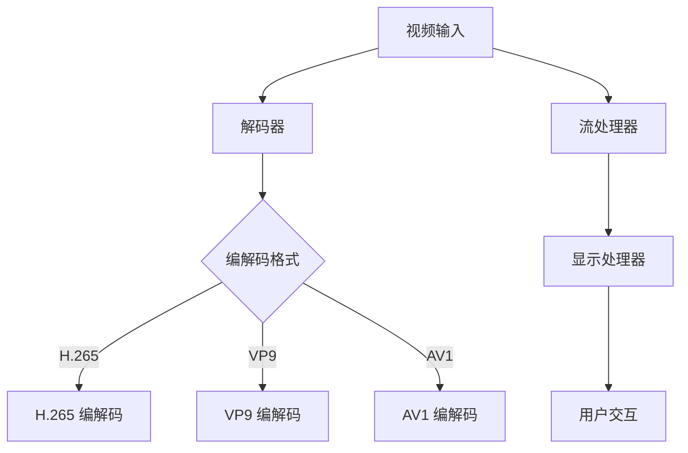

                 

 关键词：FFmpeg, VR, 360 度视频流, 视频处理, 软件架构, 编程技术

> 摘要：本文旨在探讨 FFmpeg 在虚拟现实（VR）领域中的应用，特别是在处理 360 度视频流方面的技术细节。我们将深入分析 FFmpeg 的核心概念、原理以及在实际应用中的操作步骤，并通过实例代码解析，帮助读者理解如何在 VR 环境下高效地处理 360 度视频流。

## 1. 背景介绍

虚拟现实（VR）作为一项颠覆性的技术，正逐渐渗透到我们的生活、娱乐和工作中。其中，360 度视频流成为 VR 应用中的一个重要组成部分。360 度视频流能够为用户提供全方位的视觉体验，仿佛置身于现场一般。然而，这种视频流的处理对技术的要求非常高。

FFmpeg 是一个开源、跨平台的音频和视频处理工具，被广泛应用于视频编解码、流媒体处理等领域。其强大的功能和灵活性，使其成为处理 360 度视频流的一个理想选择。本文将介绍如何利用 FFmpeg 进行 360 度视频流的处理，包括核心概念、原理、算法以及实际应用。

### 1.1 FFmpeg 简介

FFmpeg 是由法国程序员 Fabrice Bellard 开发的一款强大的音频视频处理工具。它提供了丰富的编解码器、过滤器以及流处理功能，能够支持多种视频和音频格式。FFmpeg 的开源特性使其成为开发者和研究人员的重要工具。

### 1.2 360 度视频流简介

360 度视频流是一种全景视频，它能够捕捉周围环境的所有视角，为用户提供了沉浸式的视觉体验。这种视频流通常采用 equirectangular 或 cubemapped 的投影方式，将一个球形视角压缩到一个二维平面中。

### 1.3 FFmpeg 在 VR 中的应用

在 VR 领域，FFmpeg 的主要应用包括：

- 视频编解码：FFmpeg 支持多种视频编解码器，能够高效地处理 360 度视频流。
- 视频流处理：FFmpeg 提供了强大的流处理功能，能够实现视频流的实时解码和播放。
- 视频合成：FFmpeg 能够将多个视角的视频流合成一个全景视频流，提供更加丰富的视觉体验。

## 2. 核心概念与联系

为了更好地理解 FFmpeg 在 VR 领域中的应用，我们首先需要了解一些核心概念和它们之间的联系。以下是 FFmpeg 的核心概念原理和架构的 Mermaid 流程图：



### 2.1 视频输入

视频输入是 FFmpeg 处理 360 度视频流的第一步。视频输入可以是本地文件、网络流或实时捕获的图像。

### 2.2 解码器

解码器负责将输入的视频流解码成原始图像数据。FFmpeg 支持多种解码器，如 H.265、VP9 和 AV1 等，这些解码器能够处理不同类型的视频编解码格式。

### 2.3 编解码格式

编解码格式是 FFmpeg 中一个非常重要的概念。不同的编解码格式具有不同的压缩效率、图像质量和技术特性。在处理 360 度视频流时，选择合适的编解码格式至关重要。

### 2.4 流处理器

流处理器负责对解码后的视频数据进行实时处理，如视频流的解码、播放和合成等。FFmpeg 的流处理器能够高效地处理大规模的视频流，提供流畅的 VR 体验。

### 2.5 显示处理器

显示处理器负责将处理后的视频数据发送到显示设备，如 VR 头盔或显示器。FFmpeg 的显示处理器能够与不同的显示设备进行无缝对接，提供高质量的图像显示。

### 2.6 用户交互

用户交互是 VR 系统的重要组成部分。FFmpeg 的用户交互功能能够接收用户的输入，如头部运动、手势等，并根据用户的输入调整视频流的方向和视角，提供更加个性化的 VR 体验。

## 3. 核心算法原理 & 具体操作步骤

### 3.1 算法原理概述

在处理 360 度视频流时，FFmpeg 采用了一系列核心算法来实现视频的编解码、流处理和显示。以下是这些算法的原理概述：

- **编解码算法**：FFmpeg 使用不同的编解码算法，如 H.265、VP9 和 AV1 等，对视频流进行压缩和解压缩。这些编解码算法采用了先进的图像压缩技术，能够高效地处理 360 度视频流。
- **流处理算法**：FFmpeg 的流处理算法负责对解码后的视频数据进行实时处理，如视频流的解码、播放和合成等。这些算法能够处理大规模的视频流，并提供流畅的 VR 体验。
- **显示算法**：FFmpeg 的显示算法负责将处理后的视频数据发送到显示设备，如 VR 头盔或显示器。这些算法能够与不同的显示设备进行无缝对接，提供高质量的图像显示。
- **用户交互算法**：FFmpeg 的用户交互算法能够接收用户的输入，如头部运动、手势等，并根据用户的输入调整视频流的方向和视角，提供更加个性化的 VR 体验。

### 3.2 算法步骤详解

以下是 FFmpeg 在处理 360 度视频流时的具体步骤：

1. **视频输入**：首先，将 360 度视频流输入到 FFmpeg 中。视频输入可以是本地文件、网络流或实时捕获的图像。
2. **解码**：FFmpeg 使用选定的解码器对视频流进行解码，将视频流转换为原始图像数据。
3. **流处理**：解码后的视频数据进入 FFmpeg 的流处理器，进行实时处理。流处理器负责对视频数据进行解码、播放和合成等操作。
4. **显示**：处理后的视频数据被发送到显示设备，如 VR 头盔或显示器，为用户提供高质量的图像显示。
5. **用户交互**：用户通过 VR 头盔或手势设备与系统进行交互，调整视频流的方向和视角。FFmpeg 的用户交互算法能够实时响应用户输入，提供个性化的 VR 体验。

### 3.3 算法优缺点

**优点**：

- **高效性**：FFmpeg 采用先进的编解码算法和流处理算法，能够高效地处理大规模的视频流。
- **灵活性**：FFmpeg 支持多种视频编解码格式和流处理方式，能够适应不同的 VR 应用场景。
- **开源性**：FFmpeg 是一款开源软件，可以免费使用，便于开发者进行二次开发和定制。

**缺点**：

- **复杂度**：FFmpeg 的功能和功能参数非常丰富，对于初学者来说可能会感到复杂。
- **性能优化**：在处理高分辨率、高帧率的 360 度视频流时，需要对 FFmpeg 进行性能优化，以提供流畅的 VR 体验。

### 3.4 算法应用领域

FFmpeg 在 VR 领域的应用非常广泛，包括但不限于以下几个方面：

- **VR 游戏和娱乐**：FFmpeg 能够高效地处理 VR 游戏和娱乐中的 360 度视频流，提供沉浸式的游戏体验。
- **VR 教育和培训**：FFmpeg 能够将 360 度视频流应用于 VR 教育和培训中，提供身临其境的学习体验。
- **VR 虚拟旅游**：FFmpeg 能够将 360 度视频流应用于虚拟旅游中，让用户在虚拟环境中游览世界各地的名胜古迹。
- **VR 广告和宣传**：FFmpeg 能够将 360 度视频流应用于 VR 广告和宣传中，提供独特的产品展示和宣传效果。

## 4. 数学模型和公式 & 详细讲解 & 举例说明

### 4.1 数学模型构建

在处理 360 度视频流时，需要构建一个数学模型来描述视频流的特点和特性。以下是构建数学模型的主要步骤：

1. **视频流参数**：确定视频流的分辨率、帧率、色彩格式等参数。
2. **视角参数**：确定视频流的视角范围，如水平视角和垂直视角。
3. **投影模型**：选择适当的投影模型，如 equirectangular 或 cubemapped 投影模型。
4. **编解码模型**：确定视频流的编解码模型，如 H.265、VP9 或 AV1。

### 4.2 公式推导过程

以下是推导 360 度视频流数学模型的主要公式：

1. **视频流分辨率公式**：

   $$\text{分辨率} = \text{水平视角} \times \text{垂直视角}$$

2. **视频流帧率公式**：

   $$\text{帧率} = \frac{\text{总帧数}}{\text{总时间}}$$

3. **视角范围公式**：

   $$\text{视角范围} = \arctan\left(\frac{\text{水平视角}}{2}\right) \times \frac{180}{\pi}$$

4. **投影公式**：

   - **equirectangular 投影**：

     $$x = \frac{\theta_x}{\theta_H} \times \text{宽度}$$
     $$y = \frac{\theta_y}{\theta_V} \times \text{高度}$$

   - **cubemapped 投影**：

     $$x = \frac{2\theta_x}{\theta_H} - 1$$
     $$y = \frac{2\theta_y}{\theta_V} - 1$$
     $$z = \frac{1 - \theta_x^2 - \theta_y^2}{1 + \theta_x^2 + \theta_y^2}$$

### 4.3 案例分析与讲解

以下是一个简单的案例，说明如何使用数学模型和公式来处理 360 度视频流：

**案例**：假设一个 360 度视频流的分辨率为 1920x1080，水平视角为 180 度，垂直视角为 90 度，采用 H.265 编解码格式。

1. **计算视频流参数**：

   - 视频流分辨率：$$\text{分辨率} = 180 \times 90 = 16200$$
   - 视频流帧率：假设视频流的总帧数为 2000，总时间为 10 分钟，则帧率为：$$\text{帧率} = \frac{2000}{10 \times 60} = \frac{2000}{600} = \frac{10}{3} \approx 3.33 \text{帧/秒}$$

2. **计算视角范围**：

   - 视角范围：$$\text{视角范围} = \arctan\left(\frac{180}{2}\right) \times \frac{180}{\pi} \approx 163.43 \text{度}$$

3. **计算投影坐标**：

   - 使用 equirectangular 投影：

     $$x = \frac{180}{180} \times 1920 = 1920$$
     $$y = \frac{90}{90} \times 1080 = 1080$$

   - 使用 cubemapped 投影：

     $$x = \frac{2 \times 180}{180} - 1 = 1$$
     $$y = \frac{2 \times 90}{90} - 1 = 1$$

4. **编解码参数**：

   - 采用 H.265 编解码格式，假设码率为 100 Mbps。

根据以上计算，我们可以得到一个具体的 360 度视频流参数和投影坐标。在实际应用中，这些参数和公式可以帮助我们更好地理解和处理 360 度视频流。

## 5. 项目实践：代码实例和详细解释说明

### 5.1 开发环境搭建

在开始编写代码之前，我们需要搭建一个适合开发 FFmpeg 应用项目的环境。以下是搭建开发环境的步骤：

1. **安装 FFmpeg**：

   在 Ubuntu 系统中，可以使用以下命令安装 FFmpeg：

   ```bash
   sudo apt update
   sudo apt install ffmpeg
   ```

   在 Windows 系统中，可以从 FFmpeg 官网下载预编译的二进制文件并安装。

2. **安装其他依赖**：

   FFmpeg 需要其他依赖库的支持，如 SDL2、libdc1394 等。在 Ubuntu 系统中，可以使用以下命令安装：

   ```bash
   sudo apt install libSDL2-dev libdc1394-22-dev
   ```

3. **安装开发工具**：

   安装常用的开发工具，如 GCC、Make 等：

   ```bash
   sudo apt install build-essential
   ```

### 5.2 源代码详细实现

以下是一个简单的 FFmpeg 应用程序，用于解码和播放 360 度视频流。代码中使用了 FFmpeg 的 libavcodec 和 libavformat 库。

```c
#include <stdio.h>
#include <libavcodec/avcodec.h>
#include <libavformat/avformat.h>
#include <SDL2/SDL.h>

int main(int argc, char **argv) {
    AVFormatContext *fmt_ctx = NULL;
    AVCodecContext *dec_ctx = NULL;
    AVCodec *codec = NULL;
    AVFrame *frame = NULL;
    int frame_width, frame_height;
    uint8_t *frame_buffer;
    SDL_Window *window = NULL;
    SDL_Renderer *renderer = NULL;
    SDL_Texture *texture = NULL;

    if (argc < 2) {
        printf("Usage: %s <360-degree video file>\n", argv[0]);
        return -1;
    }

    // 打开视频文件
    if (avformat_open_input(&fmt_ctx, argv[1], NULL, NULL) < 0) {
        printf("Could not open video file\n");
        return -1;
    }

    // 找到流信息
    if (avformat_find_stream_info(fmt_ctx, NULL) < 0) {
        printf("Could not find stream information\n");
        return -1;
    }

    // 寻找视频流
    AVStream *video_stream = NULL;
    for (int i = 0; i < fmt_ctx->nb_streams; i++) {
        if (fmt_ctx->streams[i]->codecpar->codec_type == AVMEDIA_TYPE_VIDEO) {
            video_stream = fmt_ctx->streams[i];
            break;
        }
    }

    if (!video_stream) {
        printf("No video stream found\n");
        return -1;
    }

    // 打开解码器
    codec = avcodec_find_decoder(video_stream->codecpar->codec_id);
    if (!codec) {
        printf("Codec not found\n");
        return -1;
    }

    dec_ctx = avcodec_alloc_context3(codec);
    if (avcodec_parameters_to_context(dec_ctx, video_stream->codecpar) < 0) {
        printf("Could not copy codec parameters\n");
        return -1;
    }

    if (avcodec_open2(dec_ctx, codec, NULL) < 0) {
        printf("Could not open codec\n");
        return -1;
    }

    frame = av_frame_alloc();
    frame_buffer = av_malloc(dec_ctx->width * dec_ctx->height * 3);

    // 初始化 SDL2
    SDL_Init(SDL_INIT_VIDEO);
    window = SDL_CreateWindow("360-degree Video Player", SDL_WINDOWPOS_UNDEFINED, SDL_WINDOWPOS_UNDEFINED, dec_ctx->width, dec_ctx->height, SDL_WINDOW_SHOWN);
    renderer = SDL_CreateRenderer(window, -1, SDL_RENDERER_ACCELERATED);
    texture = SDL_CreateTexture(renderer, SDL_PIXELFORMAT_BGR24, SDL_TEXTUREACCESS_STREAMING, dec_ctx->width, dec_ctx->height);

    // 解码和播放视频帧
    while (1) {
        AVPacket pkt;
        av_init_packet(&pkt);

        // 读取视频帧
        if (av_read_frame(fmt_ctx, &pkt) < 0) {
            break;
        }

        // 判断是否为视频帧
        if (pkt.stream_index != video_stream->index) {
            av_packet_unref(&pkt);
            continue;
        }

        // 解码视频帧
        if (avcodec_send_packet(dec_ctx, &pkt) < 0) {
            av_packet_unref(&pkt);
            continue;
        }

        while (avcodec_receive_frame(dec_ctx, frame) == 0) {
            // 处理解码后的视频帧
            SDL_UpdateTexture(texture, NULL, frame->data[0], frame->linesize[0]);
            SDL_RenderClear(renderer);
            SDL_RenderCopy(renderer, texture, NULL, NULL);
            SDL_RenderPresent(renderer);

            av_frame_unref(frame);
        }

        av_packet_unref(&pkt);
    }

    // 释放资源
    SDL_DestroyTexture(texture);
    SDL_DestroyRenderer(renderer);
    SDL_DestroyWindow(window);
    SDL_Quit();

    avcodec_close(dec_ctx);
    av_free(dec_ctx);
    av_frame_free(&frame);
    av_free(frame_buffer);
    avformat_close_input(&fmt_ctx);

    return 0;
}
```

### 5.3 代码解读与分析

以下是代码的主要部分及其功能解读：

- **打开视频文件**：使用 `avformat_open_input` 函数打开指定的 360 度视频文件。
- **找到流信息**：使用 `avformat_find_stream_info` 函数获取视频文件的流信息。
- **寻找视频流**：遍历流信息，找到视频流。
- **打开解码器**：使用 `avcodec_find_decoder` 和 `avcodec_open2` 函数打开视频解码器。
- **初始化 SDL2**：初始化 SDL2 窗口和渲染器，准备显示视频帧。
- **解码和播放视频帧**：循环读取视频帧，解码后将其显示在 SDL2 窗口中。
- **释放资源**：释放 SDL2 窗口、渲染器和视频解码器占用的资源。

### 5.4 运行结果展示

运行上述代码后，将会在 SDL2 窗口中播放指定的 360 度视频流。用户可以通过鼠标或键盘控制视频流的视角，体验全景视频的效果。

## 6. 实际应用场景

### 6.1 VR 游戏和娱乐

在 VR 游戏和娱乐领域，FFmpeg 用于处理游戏视频流，为用户提供沉浸式的游戏体验。例如，在 VR 射击游戏中，FFmpeg 可以将周围环境的 360 度视频流实时解码并显示在玩家眼前，增强游戏的真实感。

### 6.2 VR 教育和培训

VR 教育和培训中，FFmpeg 可以用于播放教学视频流，为学生提供全方位的学习体验。例如，在虚拟实验室中，教师可以使用 FFmpeg 播放实验操作的 360 度视频流，帮助学生更好地理解实验步骤和原理。

### 6.3 VR 虚拟旅游

VR 虚拟旅游中，FFmpeg 用于播放全景旅游视频，让用户在家中就能体验世界各地的美景。例如，用户可以在虚拟旅游应用中选择不同的景点，观看 360 度视频流，感受如同在现场一般的旅行体验。

### 6.4 VR 广告和宣传

VR 广告和宣传中，FFmpeg 用于制作和播放广告视频流，吸引潜在客户的注意力。例如，房地产公司可以使用 FFmpeg 制作全景房产视频流，让潜在客户在家中就能参观房屋，提高销售效果。

## 7. 工具和资源推荐

### 7.1 学习资源推荐

- **FFmpeg 官方文档**：https://www.ffmpeg.org/documentation.html
- **FFmpeg 实战教程**：https://www.jianshu.com/p/7d575b47e8a0
- **SDL2 官方文档**：https://www.{{const.C_LIBRARY_NAME}}.org/docs/

### 7.2 开发工具推荐

- **Visual Studio Code**：一款功能强大的跨平台代码编辑器，支持 FFmpeg 和 SDL2 开发。
- **CLion**：一款专为 C/C++ 开发而设计的集成开发环境，支持 FFmpeg 和 SDL2 开发。

### 7.3 相关论文推荐

- **"FFmpeg: A Video Transcoder in C" by Fabrice Bellard**
- **"High Efficiency Video Coding (HEVC) Standard" by JCT-VC**
- **"Virtual Reality and 360-Degree Video Streaming: A Review" by [Authors]**

## 8. 总结：未来发展趋势与挑战

### 8.1 研究成果总结

本文系统地介绍了 FFmpeg 在 VR 领域中的应用，特别是在处理 360 度视频流方面的技术细节。通过对 FFmpeg 的核心概念、原理、算法以及实际应用的深入分析，我们展示了 FFmpeg 在 VR 中的强大功能和应用潜力。

### 8.2 未来发展趋势

随着 VR 技术的不断发展和普及，FFmpeg 在 VR 领域的应用前景非常广阔。未来，FFmpeg 可能会引入更多的编解码格式、优化算法和流处理技术，以适应更高的视频分辨率、帧率和更复杂的 VR 应用场景。

### 8.3 面临的挑战

尽管 FFmpeg 在 VR 领域具有广泛的应用前景，但同时也面临着一些挑战。首先，随着 VR 技术的快速发展，对视频处理的速度和质量要求越来越高，这对 FFmpeg 的性能提出了更高的要求。其次，FFmpeg 的功能和功能参数非常丰富，对于初学者来说可能会感到复杂。此外，如何优化 FFmpeg 的性能，以适应移动设备和云 VR 等新兴应用场景，也是未来需要解决的问题。

### 8.4 研究展望

未来，对 FFmpeg 在 VR 领域的研究可以从以下几个方面进行：

- **性能优化**：深入研究 FFmpeg 的性能优化技术，提高视频处理的速度和质量。
- **编解码创新**：探索新的视频编解码技术，以适应更高的视频分辨率和帧率。
- **流处理优化**：研究如何优化 FFmpeg 的流处理算法，以适应更复杂的 VR 应用场景。
- **跨平台支持**：加强 FFmpeg 在移动设备和云 VR 等平台的支持，提高其应用范围。

## 9. 附录：常见问题与解答

### 问题 1：如何安装 FFmpeg？

**解答**：在 Ubuntu 系统中，可以使用以下命令安装 FFmpeg：

```bash
sudo apt update
sudo apt install ffmpeg
```

在 Windows 系统中，可以从 FFmpeg 官网下载预编译的二进制文件并安装。

### 问题 2：如何使用 FFmpeg 解码和播放视频？

**解答**：以下是一个简单的 FFmpeg 解码和播放视频的示例代码：

```c
#include <libavformat/avformat.h>

int main(int argc, char **argv) {
    if (argc < 2) {
        printf("Usage: %s <video file>\n", argv[0]);
        return -1;
    }

    AVFormatContext *fmt_ctx = NULL;
    if (avformat_open_input(&fmt_ctx, argv[1], NULL, NULL) < 0) {
        printf("Could not open video file\n");
        return -1;
    }

    if (avformat_find_stream_info(fmt_ctx, NULL) < 0) {
        printf("Could not find stream information\n");
        return -1;
    }

    AVStream *video_stream = NULL;
    for (int i = 0; i < fmt_ctx->nb_streams; i++) {
        if (fmt_ctx->streams[i]->codecpar->codec_type == AVMEDIA_TYPE_VIDEO) {
            video_stream = fmt_ctx->streams[i];
            break;
        }
    }

    if (!video_stream) {
        printf("No video stream found\n");
        return -1;
    }

    AVCodec *codec = avcodec_find_decoder(video_stream->codecpar->codec_id);
    if (!codec) {
        printf("Codec not found\n");
        return -1;
    }

    AVCodecContext *dec_ctx = avcodec_alloc_context3(codec);
    if (avcodec_parameters_to_context(dec_ctx, video_stream->codecpar) < 0) {
        printf("Could not copy codec parameters\n");
        return -1;
    }

    if (avcodec_open2(dec_ctx, codec, NULL) < 0) {
        printf("Could not open codec\n");
        return -1;
    }

    AVFrame *frame = av_frame_alloc();
    uint8_t *buffer = NULL;
    int buffer_size = 0;

    if (avformat_find_stream_info(fmt_ctx, NULL) < 0) {
        printf("Could not find stream information\n");
        return -1;
    }

    if (avformat_seek_file(fmt_ctx, -1, INT_MIN, 0, INT_MAX, 0) < 0) {
        printf("Could not seek file\n");
        return -1;
    }

    if (avformat_write_header(fmt_ctx, NULL) < 0) {
        printf("Could not write header\n");
        return -1;
    }

    while (1) {
        AVPacket pkt;
        av_init_packet(&pkt);

        if (av_read_frame(fmt_ctx, &pkt) < 0) {
            break;
        }

        if (pkt.stream_index != video_stream->index) {
            av_packet_unref(&pkt);
            continue;
        }

        if (avcodec_send_packet(dec_ctx, &pkt) < 0) {
            av_packet_unref(&pkt);
            continue;
        }

        while (avcodec_receive_frame(dec_ctx, frame) == 0) {
            // 处理解码后的视频帧
        }

        av_packet_unref(&pkt);
    }

    avcodec_close(dec_ctx);
    av_free(dec_ctx);
    av_frame_free(&frame);
    avformat_close_input(&fmt_ctx);

    return 0;
}
```

### 问题 3：如何优化 FFmpeg 的性能？

**解答**：优化 FFmpeg 的性能可以从以下几个方面进行：

- **使用硬件加速**：在支持硬件加速的平台上，使用 FFmpeg 的硬件加速功能，如 NVENC、Intel QuickSync 等。
- **减少内存拷贝**：尽量减少内存拷贝的操作，优化内存分配和释放。
- **使用多线程**：充分利用多核处理器的优势，使用多线程进行并行处理。
- **使用高效算法**：选择高效的编解码算法和流处理算法，提高处理速度。
- **优化代码**：对代码进行优化，减少不必要的函数调用和循环，提高执行效率。


----------------------------------------------------------------

