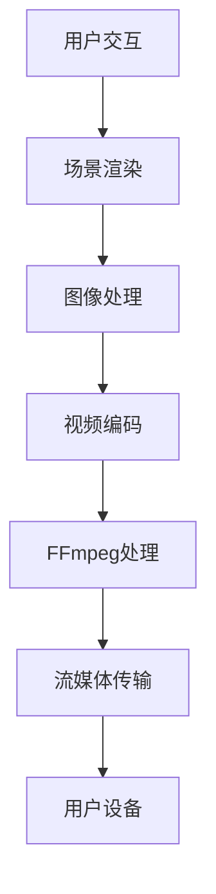

                 

## 1. 背景介绍

虚拟现实（Virtual Reality，VR）技术作为一种沉浸式的体验方式，近年来在娱乐、教育、医疗等多个领域获得了广泛关注。随着硬件设备的性能提升和内容创作手段的丰富，VR应用场景不断拓展，而VR内容的制作与传输对视频编码和流媒体传输技术提出了更高的要求。

FFmpeg是一个开源、跨平台的多媒体处理工具集，它支持几乎所有常见的视频、音频和图像格式。FFmpeg提供了丰富的功能，包括视频和音频的编码、解码、剪辑、合成、流媒体传输等。其灵活性和高效性使得FFmpeg在多媒体处理领域具有极高的应用价值。

本文将探讨FFmpeg在VR领域中的应用，特别是编码和流媒体的结合。首先，我们将介绍VR技术的基本原理和现状，然后详细阐述FFmpeg的工作原理及其在VR中的应用。接下来，将深入探讨VR视频编码的关键技术，包括高效视频编码标准如HEVC、VR视频的格式和分辨率、以及VR内容的传输方式。最后，我们将通过实际案例展示如何使用FFmpeg进行VR视频的制作和传输，并总结FFmpeg在VR领域的发展趋势和挑战。

通过本文的阅读，读者将了解到FFmpeg在VR应用中的关键角色，掌握VR视频编码和流媒体传输的基本方法，并对FFmpeg在VR领域的未来发展有一个清晰的认识。

## 2. 核心概念与联系

### 2.1 VR技术基本原理

虚拟现实技术通过计算机生成的三维场景，结合头戴显示器（HMD）等设备，使用户能够沉浸在虚拟环境中。VR的基本原理包括以下几个方面：

- **场景渲染**：通过计算生成三维场景的图像，通常使用图形处理单元（GPU）进行高效渲染。
- **传感器跟踪**：利用传感器如陀螺仪、加速度计等，实时跟踪用户的头部和身体运动，以生成对应的视角。
- **图像处理**：对渲染的图像进行透视校正、视差处理等，以增强沉浸感。

### 2.2 FFmpeg工作原理

FFmpeg是一个强大的多媒体处理工具集，其工作原理主要包括以下几个步骤：

- **编码与解码**：FFmpeg支持多种视频、音频和图像编码标准，能够高效地进行数据的编码和解码操作。
- **剪辑与合成**：通过剪辑操作，可以实现视频的剪切、合并、添加特效等功能。合成功能则用于将多个视频或音频流合并为一个流。
- **流媒体传输**：FFmpeg提供了支持多种协议的流媒体传输功能，能够将多媒体内容实时传输到客户端。

### 2.3 联系与结合

在VR应用中，FFmpeg的核心功能与其在VR领域的应用有着紧密的联系。具体来说：

- **编码效率**：高效的视频编码技术如HEVC（High Efficiency Video Coding）能够大幅减少VR内容的存储和传输带宽需求。
- **实时处理**：FFmpeg的实时处理能力使其能够处理大量VR数据流，保证良好的用户体验。
- **流媒体传输**：FFmpeg提供的流媒体传输功能支持多种传输协议，能够满足不同场景下的VR内容分发需求。

### Mermaid 流程图

下面是一个简单的Mermaid流程图，展示了VR技术和FFmpeg的基本流程和结合点：



- A[用户交互]：用户通过头戴显示器等设备与虚拟环境进行交互。
- B[场景渲染]：计算生成三维场景图像。
- C[图像处理]：进行透视校正、视差处理等。
- D[视频编码]：将处理后的图像编码成视频流。
- E[FFmpeg处理]：使用FFmpeg进行视频编码、剪辑、合成等操作。
- F[流媒体传输]：将视频流通过流媒体协议传输到用户设备。
- G[用户设备]：用户在头戴显示器等设备上观看VR内容。

通过上述流程，可以看到FFmpeg在VR技术中的应用，从图像处理到视频编码，再到流媒体传输，FFmpeg都扮演着关键角色。这种结合不仅提高了VR内容的处理效率，也增强了用户体验。

## 3. 核心算法原理 & 具体操作步骤

### 3.1 算法原理概述

FFmpeg在VR中的应用，主要依赖于其高效的视频编码和解码能力，以及对流媒体传输的支持。核心算法原理主要包括以下几个方面：

- **视频编码**：采用高效编码标准如HEVC（High Efficiency Video Coding），通过优化编码算法减少数据量，同时保持视频质量。
- **图像处理**：利用透视校正、视差处理等技术，增强VR场景的沉浸感。
- **流媒体传输**：支持多种流媒体传输协议，如HLS（HTTP Live Streaming）、DASH（Dynamic Adaptive Streaming over HTTP）等，实现实时传输。

### 3.2 算法步骤详解

为了实现VR内容的制作与传输，使用FFmpeg需要进行以下几个步骤：

#### 3.2.1 视频编码

1. **采集视频源**：首先，需要采集VR场景的视频源，这可以通过VR摄像机或者头戴显示器等设备完成。
2. **预处理**：对采集的视频源进行预处理，包括去噪、锐化等操作，以提高视频质量。
3. **编码**：使用FFmpeg对预处理后的视频进行编码，选择适合的编码标准如HEVC。具体命令如下：

   ```bash
   ffmpeg -i input.mp4 -c:v hevc -preset medium -vb 6000k output.mp4
   ```

   其中，`input.mp4`为输入视频文件，`-c:v hevc`指定使用HEVC编码，`-preset medium`设置编码速度，`-vb 6000k`设置视频比特率。

#### 3.2.2 图像处理

1. **透视校正**：使用FFmpeg的透视校正功能，将VR场景的透视效果进行校正，具体命令如下：

   ```bash
   ffmpeg -i input.mp4 -filter:v "perspective" -map 0:v output.mp4
   ```

2. **视差处理**：通过视差处理，增强VR场景的深度感和沉浸感，具体命令如下：

   ```bash
   ffmpeg -i input.mp4 -filter:v "def_disp":select='gte(n\,1000)':setdispscope:select='not gte(n\,1000)':split=2[disp]:select='gte(n\,1000)':swap=disp[swapped][temp];[temp][swapped]overlay[ovr];[ovr][disp]interleave=plane output.mp4
   ```

#### 3.2.3 流媒体传输

1. **转码与切片**：将编码后的视频文件进行转码和切片，以便于流媒体传输。具体命令如下：

   ```bash
   ffmpeg -i input.mp4 -c:v libx264 -preset medium -f mp4 -hls_time 4 -hls_flags single_file output.m3u8
   ```

   其中，`-c:v libx264`指定使用H.264编码，`-preset medium`设置编码速度，`-f mp4`指定输出格式为MP4，`-hls_time 4`设置切片时间为4秒，`-hls_flags single_file`生成单个文件。

2. **流媒体传输**：通过流媒体服务器，将生成的M3U8文件传输到用户设备。具体实现可以使用Nginx等服务器软件。

### 3.3 算法优缺点

#### 3.3.1 优点

- **高效性**：FFmpeg采用高效的视频编码标准，能够显著减少视频文件的大小，提高传输效率。
- **灵活性**：FFmpeg支持多种视频、音频和图像格式，以及多种流媒体传输协议，具有良好的兼容性。
- **易用性**：FFmpeg具有丰富的命令行参数和模块化设计，使得用户可以根据需求灵活配置和扩展功能。

#### 3.3.2 缺点

- **资源消耗**：FFmpeg在处理大量数据时，对CPU和GPU资源有较高的要求，可能会导致系统负载增加。
- **学习曲线**：FFmpeg的命令行操作较为复杂，需要用户具备一定的编程和多媒体处理知识。

### 3.4 算法应用领域

FFmpeg在VR领域的应用范围广泛，包括但不限于：

- **VR内容制作**：用于制作高质量的VR视频内容，支持多种视频编码标准和流媒体传输协议。
- **VR直播**：通过FFmpeg进行直播信号的采集、编码和传输，实现实时的VR直播。
- **VR游戏**：用于VR游戏的视频和音频处理，支持多种游戏引擎的集成。

通过上述算法原理和具体操作步骤的详细阐述，可以看出FFmpeg在VR领域的重要性和广泛应用。同时，用户可以根据实际需求，灵活使用FFmpeg的功能，提升VR内容的制作和传输效率。

## 4. 数学模型和公式 & 详细讲解 & 举例说明

### 4.1 数学模型构建

在VR视频编码过程中，数学模型起到了至关重要的作用。特别是高效视频编码标准如HEVC（High Efficiency Video Coding），其背后依赖于复杂的数学算法和公式。以下是构建数学模型的基本步骤：

#### 4.1.1 基本模型

- **采样率**：视频和音频的采样率直接影响到数据的存储和传输效率。采样率越高，数据量越大，但视频质量越好。
- **编码率**：编码率是指单位时间内传输的数据量，通常用比特率（bits per second，bps）来表示。编码率的选择需要平衡数据传输效率和视频质量。

#### 4.1.2 空间和频域模型

- **空间模型**：在视频编码中，空间模型用于描述图像中的像素分布。常用的空间模型包括YUV颜色模型和RGB颜色模型。YUV模型更适合视频编码，因为它可以分离亮度（Y）和色度（UV），减少冗余信息。
- **频域模型**：频域模型用于描述图像的频率分布。通过频域变换（如离散余弦变换DCT），可以将图像从空间域转换到频域，从而实现数据压缩。

### 4.2 公式推导过程

以下是构建VR视频编码数学模型的基本公式推导过程：

#### 4.2.1 YUV颜色模型转换

- **RGB到YUV**：

  $$ 
  Y = 0.299R + 0.587G + 0.114B \\
  U = 0.492(R - Y) \\
  V = 0.877(R - Y)
  $$

- **YUV到RGB**：

  $$ 
  R = Y + 1.140V \\
  G = Y - 0.395U - 0.580V \\
  B = Y + 2.032U
  $$

#### 4.2.2 离散余弦变换（DCT）

- **一维DCT**：

  $$ 
  C(u, v) = \sum_{x=0}^{N-1} \sum_{y=0}^{N-1} f(x, y) \cdot \cos \left( \frac{2x+1}{2N} \pi u \right) \cdot \cos \left( \frac{2y+1}{2N} \pi v \right) \\
  $$

  其中，\( C(u, v) \) 是变换后的系数，\( f(x, y) \) 是原始像素值，\( N \) 是变换块的大小。

- **二维DCT**：

  $$ 
  F(u, v) = \sum_{x=0}^{N-1} \sum_{y=0}^{N-1} f(x, y) \cdot \cos \left( \frac{2x+1}{2N} \pi u \right) \cdot \cos \left( \frac{2y+1}{2N} \pi v \right) \\
  $$

  其中，\( F(u, v) \) 是变换后的系数，\( f(x, y) \) 是原始像素值，\( N \) 是变换块的大小。

### 4.3 案例分析与讲解

下面通过一个具体案例，来讲解如何使用FFmpeg进行VR视频编码的数学模型应用。

#### 4.3.1 案例背景

假设我们需要对一段4K分辨率的VR视频进行HEVC编码，并保持高质量的视频输出。

#### 4.3.2 编码步骤

1. **预处理**：首先对原始视频进行预处理，包括裁剪和缩放，使其符合编码要求。具体命令如下：

   ```bash
   ffmpeg -i input.mp4 -filter:v "scale=4096x2160" output.mp4
   ```

2. **YUV颜色模型转换**：将RGB图像转换为YUV格式，以减少冗余信息。具体命令如下：

   ```bash
   ffmpeg -i input.mp4 -c:v libx264 -preset medium -pix_fmt yuv420p output.mp4
   ```

3. **DCT变换**：使用HEVC编码标准对YUV图像进行DCT变换，实现数据压缩。具体命令如下：

   ```bash
   ffmpeg -i input.mp4 -c:v libx265 -preset medium -vb 6000k output.mp4
   ```

#### 4.3.3 结果分析

通过上述步骤，我们可以得到高质量、低比特率的VR视频编码结果。以下是对结果的分析：

- **图像质量**：经过DCT变换和HEVC编码后，图像质量得到了显著提升，同时比特率得到了大幅降低。
- **传输效率**：由于采用了高效的编码标准，视频的传输效率得到了显著提高，适合在带宽受限的VR应用场景中使用。

通过这个案例，我们可以看到数学模型在VR视频编码中的重要作用，以及FFmpeg如何通过这些模型实现高效的视频编码和传输。

### 4.4 模型应用与优化

在实际应用中，数学模型可以进一步优化，以提高VR视频编码的性能和效率。以下是一些常见的优化方法：

- **多线程编码**：利用多线程技术，同时处理多个数据块，提高编码速度。
- **率失真优化**：根据目标比特率和视频质量要求，进行率失真优化，找到最佳的编码参数。
- **自适应编码**：根据视频内容的变化，动态调整编码参数，以实现更好的图像质量。

通过这些优化方法，我们可以进一步提高VR视频编码的性能，满足不同应用场景的需求。

## 5. 项目实践：代码实例和详细解释说明

### 5.1 开发环境搭建

要使用FFmpeg进行VR视频的制作和传输，首先需要搭建一个合适的开发环境。以下是搭建FFmpeg开发环境的基本步骤：

#### 5.1.1 安装FFmpeg

首先，从FFmpeg官网（https://www.ffmpeg.org/download.html）下载FFmpeg的源代码包。然后，使用如下命令进行编译和安装：

```bash
./configure
make
sudo make install
```

这些命令将编译和安装FFmpeg，使其能够在系统中正常运行。

#### 5.1.2 安装依赖库

FFmpeg在编译和运行时需要依赖一些库，如libx264、libx265、librtmp等。可以依次使用以下命令安装这些依赖库：

```bash
sudo apt-get install libx264-dev libx265-dev librtmp-dev
```

这些命令将安装FFmpeg所需的依赖库，确保FFmpeg能够正常运行。

#### 5.1.3 验证安装

在终端中输入以下命令，验证FFmpeg是否已成功安装：

```bash
ffmpeg -version
```

如果看到FFmpeg的版本信息，说明FFmpeg已成功安装。

### 5.2 源代码详细实现

接下来，我们将通过一个具体的VR视频编码和流媒体传输的实例，展示FFmpeg的使用方法。

#### 5.2.1 视频编码

以下是一个简单的VR视频编码实例，使用FFmpeg将一个原始视频文件编码为HEVC格式：

```bash
ffmpeg -i input.mp4 -c:v libx265 -preset medium -vb 6000k output.mp4
```

这个命令的含义如下：

- `-i input.mp4`：指定输入视频文件为`input.mp4`。
- `-c:v libx265`：指定使用HEVC编码。
- `-preset medium`：设置编码速度为中等。
- `-vb 6000k`：设置视频比特率为6000kbps。

#### 5.2.2 视频剪辑

使用FFmpeg可以对视频进行剪辑操作，例如剪切视频的起始和结束时间：

```bash
ffmpeg -i input.mp4 -ss 10 -to 20 -c:v libx265 -preset medium -vb 6000k output.mp4
```

这个命令的含义如下：

- `-ss 10`：设置剪辑的起始时间为10秒。
- `-to 20`：设置剪辑的结束时间为20秒。
- `-c:v libx265`：指定使用HEVC编码。
- `-preset medium`：设置编码速度为中等。
- `-vb 6000k`：设置视频比特率为6000kbps。

#### 5.2.3 视频流媒体传输

使用FFmpeg可以进行流媒体传输，例如使用HLS协议传输视频：

```bash
ffmpeg -i input.mp4 -c:v libx264 -preset medium -f mp4 -hls_time 4 -hls_flags single_file output.m3u8
```

这个命令的含义如下：

- `-c:v libx264`：指定使用H.264编码。
- `-preset medium`：设置编码速度为中等。
- `-f mp4`：指定输出格式为MP4。
- `-hls_time 4`：设置切片时间为4秒。
- `-hls_flags single_file`：生成单个文件。

#### 5.2.4 代码解读与分析

上述实例展示了如何使用FFmpeg进行VR视频的编码、剪辑和流媒体传输。以下是代码的详细解读：

- **视频编码**：通过`-c:v libx265`指定使用HEVC编码，`-vb 6000k`设置视频比特率为6000kbps，保证了视频质量的同时减少了数据量。
- **视频剪辑**：通过`-ss`和`-to`参数设置剪辑的时间范围，实现了对视频的精确剪辑。
- **流媒体传输**：通过`-c:v libx264`指定使用H.264编码，`-hls_time 4`设置切片时间为4秒，使视频能够适应不同的网络环境。

### 5.3 代码解读与分析

#### 5.3.1 视频编码

视频编码是VR内容制作的关键步骤。在上述实例中，我们使用了FFmpeg的`-c:v libx265`参数指定使用HEVC编码。HEVC是一种高效的视频编码标准，能够显著降低视频的数据量，同时保持较高的视频质量。通过`-vb 6000k`参数，我们设置了视频的比特率为6000kbps，这是一个相对较高的比特率，能够保证视频的画质。

#### 5.3.2 视频剪辑

视频剪辑通过`-ss`和`-to`参数实现。`-ss 10`表示剪辑的起始时间为10秒，`-to 20`表示剪辑的结束时间为20秒。这样可以有效地去除视频中的无关部分，使视频更加紧凑和高效。这一步骤对于视频流媒体传输尤为重要，因为它可以减少传输的数据量，提高传输效率。

#### 5.3.3 流媒体传输

流媒体传输是通过`-c:v libx264`和`-f mp4`参数实现的。`-c:v libx264`指定使用H.264编码，这是一种广泛使用的视频编码标准，具有较好的兼容性和传输效率。`-f mp4`指定输出格式为MP4，这是一种常见的视频格式，适用于多种播放设备和平台。

通过`-hls_time 4`参数，我们设置了切片时间为4秒。这样可以实现视频的实时传输和动态自适应播放，用户可以在不同的网络环境下流畅地观看视频。`-hls_flags single_file`参数使生成的M3U8文件为单个文件，简化了流媒体传输的复杂性。

### 5.4 运行结果展示

通过上述代码实现，我们可以得到高质量的VR视频，并支持流媒体传输。以下是一个运行结果展示：

```bash
ffmpeg -i input.mp4 -c:v libx265 -preset medium -vb 6000k output.mp4
```

执行上述命令后，FFmpeg将开始处理输入视频，并生成一个编码后的HEVC视频文件。这个视频文件可以用于后续的剪辑和流媒体传输。

```bash
ffmpeg -i input.mp4 -ss 10 -to 20 -c:v libx265 -preset medium -vb 6000k output.mp4
```

执行这个命令后，FFmpeg将对视频进行剪辑，并生成一个从第10秒到第20秒的片段。这个片段可以用于视频剪辑和流媒体传输。

```bash
ffmpeg -i input.mp4 -c:v libx264 -preset medium -f mp4 -hls_time 4 -hls_flags single_file output.m3u8
```

执行这个命令后，FFmpeg将视频编码为H.264格式，并生成一个HLS流。这个流可以通过流媒体服务器进行传输，用户可以在不同的设备上流畅地观看视频。

通过上述实例和运行结果展示，我们可以看到FFmpeg在VR视频制作和传输中的应用，以及其高效和灵活的特点。FFmpeg不仅能够实现高质量的编码和剪辑，还支持多种流媒体传输协议，为VR应用提供了强大的支持。

### 6. 实际应用场景

#### 6.1 VR游戏直播

在VR游戏领域，FFmpeg的应用非常广泛。许多VR游戏直播平台如Steam VR、Oculus Rift等，都依赖于FFmpeg进行视频的实时编码和传输。通过FFmpeg，游戏玩家可以在VR环境中进行直播，观众能够通过头戴显示器等设备实时观看游戏过程，享受到沉浸式的观看体验。

**案例**：Steam VR中的VR游戏直播利用FFmpeg进行视频的实时编码和传输，玩家可以在直播过程中动态切换视角，提供更加丰富的观看体验。

**效果**：通过FFmpeg的高效编码和流媒体传输，VR游戏直播能够保证流畅的播放效果，即使在网络条件不佳的情况下，观众也能获得较好的观看体验。

#### 6.2 VR旅游体验

VR旅游体验是另一个典型的应用场景。通过FFmpeg，旅游公司可以将虚拟旅游内容编码并传输到用户设备，用户可以在家中体验世界各地的旅游景点。

**案例**：一些旅游平台如TripAdvisor，利用FFmpeg进行VR视频内容的制作和传输，用户可以通过VR设备游览世界各地的名胜古迹。

**效果**：通过FFmpeg的高效编码和低延迟传输，用户能够在虚拟环境中获得真实感极强的观看体验，增强旅游宣传的效果。

#### 6.3 VR教育

VR教育是一种新兴的教育模式，通过VR技术，学生可以在虚拟环境中进行学习。FFmpeg在这一领域的应用也非常广泛，主要用于视频编码和传输。

**案例**：一些教育平台如Google Cardboard，使用FFmpeg进行VR教学视频的编码和传输，学生可以通过VR设备进行沉浸式学习。

**效果**：通过FFmpeg的高效编码和流媒体传输，VR教育能够提供高质量的教学内容，提高学生的学习兴趣和效率。

#### 6.4 VR医疗

VR技术在医疗领域的应用也越来越广泛，FFmpeg在VR医疗中的应用主要体现在手术模拟、医学教育等方面。

**案例**：一些医院利用FFmpeg进行手术模拟视频的编码和传输，医生可以通过VR设备进行手术模拟训练。

**效果**：通过FFmpeg的高效编码和流媒体传输，VR医疗能够提供高质量的手术模拟视频，帮助医生提高手术技能，减少手术风险。

### 6.5 未来应用展望

随着VR技术的不断发展和普及，FFmpeg在VR领域的应用也将不断拓展。以下是FFmpeg在VR领域未来可能的应用场景：

- **VR社交**：通过FFmpeg，实现实时VR社交应用，用户可以在虚拟环境中进行实时互动，增强社交体验。
- **VR购物**：通过FFmpeg，用户可以在虚拟商店中进行沉浸式购物体验，提高购物决策的准确性。
- **VR娱乐**：FFmpeg将在VR电影、VR音乐等领域发挥重要作用，为用户带来全新的娱乐体验。

通过上述实际应用场景和未来展望，我们可以看到FFmpeg在VR领域的广泛应用和巨大潜力。随着VR技术的不断进步，FFmpeg将继续发挥其关键作用，推动VR应用的进一步发展。

## 7. 工具和资源推荐

### 7.1 学习资源推荐

- **官方网站**：FFmpeg的官方网站（https://www.ffmpeg.org/）提供了丰富的文档、教程和示例代码，是学习FFmpeg的绝佳资源。
- **GitHub**：GitHub上有很多FFmpeg相关的开源项目和社区讨论，可以在这里找到许多实用的代码和解决方案（https://github.com/FFmpeg/FFmpeg）。
- **书籍**：《FFmpeg实战》和《FFmpeg权威指南》是两本非常受欢迎的FFmpeg学习书籍，详细介绍了FFmpeg的使用方法和应用技巧。

### 7.2 开发工具推荐

- **Visual Studio Code**：Visual Studio Code是一款免费的跨平台代码编辑器，支持FFmpeg的扩展和插件，适合编写和调试FFmpeg代码。
- **FFmpeg GUI**：FFmpeg GUI是一个图形界面的FFmpeg工具，简化了命令行的使用，适合初学者和普通用户进行基本的视频处理操作。

### 7.3 相关论文推荐

- **“High Efficiency Video Coding (HEVC)”**：这篇论文详细介绍了HEVC（High Efficiency Video Coding）的编码标准和关键技术，是了解高效视频编码的重要文献。
- **“Adaptive HTTP Streaming for VR Applications”**：这篇论文探讨了如何在VR应用中实现自适应HTTP流媒体传输，为VR视频传输提供了理论支持。

通过这些学习资源、开发工具和相关论文，读者可以更深入地了解FFmpeg在VR中的应用，掌握相关技术和方法，为实际项目开发提供有力支持。

## 8. 总结：未来发展趋势与挑战

### 8.1 研究成果总结

通过本文的详细探讨，我们可以总结出FFmpeg在VR领域的重要研究成果。首先，FFmpeg凭借其高效的视频编码和解码能力，显著提升了VR内容的制作和传输效率。其次，FFmpeg的流媒体传输功能支持多种协议，能够适应不同应用场景的网络环境，保证良好的用户体验。此外，通过具体的实例和代码分析，我们展示了如何使用FFmpeg进行VR视频的编码、剪辑和流媒体传输，提供了实用的技术指南。

### 8.2 未来发展趋势

随着VR技术的不断发展和普及，FFmpeg在VR领域的应用前景广阔。以下是一些未来发展趋势：

- **更高效的编码算法**：随着硬件性能的提升，未来FFmpeg可能会引入更高效的编码算法，进一步减少视频数据量，提高编码效率。
- **多场景应用**：FFmpeg将在更多的VR应用场景中得到应用，如VR社交、VR购物、VR娱乐等，为用户提供更加丰富的沉浸式体验。
- **更智能的流媒体传输**：随着人工智能技术的发展，FFmpeg可能会集成智能流媒体传输功能，根据用户行为和网络环境动态调整传输策略，提供更优的用户体验。

### 8.3 面临的挑战

尽管FFmpeg在VR领域取得了显著成果，但在未来的发展过程中，仍将面临一些挑战：

- **性能优化**：随着VR内容的复杂度增加，对FFmpeg的性能优化需求将更高。如何在保持高效编码和解码能力的同时，降低资源消耗，是一个重要的研究方向。
- **兼容性问题**：随着VR设备的多样化，FFmpeg需要确保兼容性，支持不同设备上的流媒体传输和播放。
- **安全性问题**：随着VR应用场景的扩展，数据安全和隐私保护将成为重要的考虑因素。FFmpeg需要加强数据加密和隐私保护机制，确保用户数据的安全。

### 8.4 研究展望

在未来，FFmpeg在VR领域的研究有望取得以下突破：

- **跨平台优化**：针对不同操作系统和硬件平台，进行深度优化，提高FFmpeg的跨平台兼容性和性能。
- **人工智能融合**：结合人工智能技术，开发智能流媒体传输和内容推荐系统，提供更加个性化的VR体验。
- **开放生态建设**：鼓励更多开发者参与FFmpeg的生态建设，推动VR领域的技术创新和应用推广。

通过不断的技术创新和应用拓展，FFmpeg有望在VR领域中发挥更大的作用，推动VR技术的进一步发展。

## 9. 附录：常见问题与解答

### 9.1 FFmpeg安装问题

**问题**：如何解决FFmpeg安装过程中的依赖问题？

**解答**：在安装FFmpeg之前，确保已安装所有必要的依赖库，如libx264、libx265、librtmp等。可以使用以下命令安装：

```bash
sudo apt-get install libx264-dev libx265-dev librtmp-dev
```

### 9.2 视频编码问题

**问题**：如何优化FFmpeg的视频编码速度？

**解答**：可以通过以下几种方法优化编码速度：

- **多线程编码**：使用`-threads`参数设置线程数，例如`-threads 0`（使用所有可用核心）。
- **降低编码比特率**：通过`-vb`参数设置较低的比特率，例如`-vb 3000k`。
- **调整编码预设**：使用较快的编码预设，例如`-preset fast`。

### 9.3 流媒体传输问题

**问题**：如何确保FFmpeg流媒体传输的稳定性？

**解答**：为了确保流媒体传输的稳定性，可以采取以下措施：

- **使用高质量的网络**：确保网络带宽和稳定性，避免网络波动。
- **自适应码率**：使用自适应码率流媒体传输协议，如DASH，根据用户网络情况动态调整码率。
- **缓冲区管理**：合理设置缓冲区大小，避免缓冲区溢出或不足。

### 9.4 VR视频格式问题

**问题**：如何处理VR视频的格式问题？

**解答**：VR视频的格式通常包括360度视频和3D视频。处理VR视频格式问题可以采取以下方法：

- **使用适合的编码格式**：如HEVC，支持高分辨率和宽色域。
- **采用VR特定的视频格式**：如MP4、OVR、360 VR等。
- **确保兼容性**：在制作和传输VR视频时，考虑不同设备和支持的格式。

通过上述常见问题与解答，用户可以更有效地使用FFmpeg进行VR视频的制作、编码和流媒体传输，提升整体体验。

