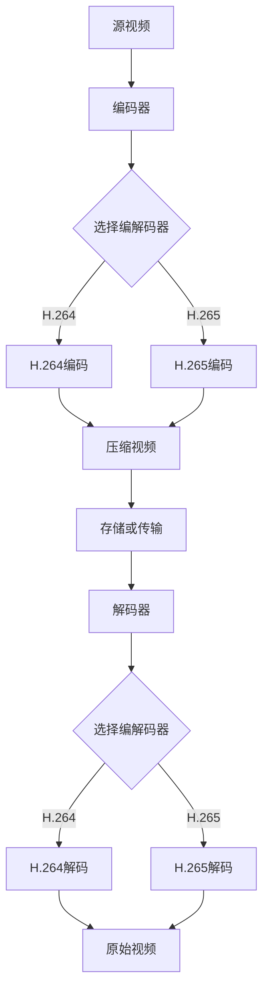

                 

关键词：FFmpeg, 视频转码, 视频格式, 压缩技术, 编解码器

> 摘要：本文将深入探讨FFmpeg这一强大的视频处理工具在视频转码方面的应用。通过详细的背景介绍、核心概念与联系解析、算法原理与操作步骤阐述，以及数学模型和公式推导，我们将全面了解如何使用FFmpeg实现高效的视频格式转换，并探讨其在实际应用中的场景和未来展望。

## 1. 背景介绍

视频转码是数字媒体处理中的一个关键步骤，它涉及到将一种视频格式转换为另一种格式。随着互联网和移动设备的普及，视频内容的需求不断增长，视频转码变得尤为重要。用户需要在不同设备上观看视频，这就要求视频格式必须具备兼容性。此外，视频压缩技术也是视频转码的重要一环，它有助于减小文件大小，提高传输效率。

FFmpeg是一个开源、跨平台的多媒体处理工具集，它可以用来录制、转换数字音视频，以及进行音视频流传输等操作。FFmpeg支持几乎所有的视频、音频和字幕格式，并且能够高效地进行格式转换和压缩。

本文将重点介绍如何使用FFmpeg进行视频格式转换，包括其背后的核心概念、算法原理、具体操作步骤，以及相关的数学模型和实际应用场景。通过本文的阅读，读者将能够掌握FFmpeg的基本用法，并能够根据实际需求进行视频格式的转换。

### 2. 核心概念与联系

为了深入理解FFmpeg的工作原理，我们需要了解一些核心概念和它们之间的联系。

#### 2.1 视频格式

视频格式是指存储和传输视频数据的方式。常见的视频格式包括AVI、MP4、MKV等。每种格式都有自己的容器格式和编码方式。

- **容器格式**：容器格式定义了视频和音频数据如何存储在一个文件中。例如，MP4使用ISO Base Media File Format（ISO BMFF）作为容器，AVI使用Audio Video Interleaved（AVI）格式。

- **编码方式**：编码方式决定了如何将原始的视频和音频信号转换为数字信号。常见的编码方式包括H.264、H.265、HEVC等。

#### 2.2 编解码器

编解码器（Codec）是一种算法，它用于压缩和解压缩视频和音频数据。编解码器分为编码器（Encoder）和解码器（Decoder）两部分：

- **编码器**：将原始视频和音频信号转换为压缩格式。
- **解码器**：将压缩格式的视频和音频信号还原为原始信号。

#### 2.3 FFmpeg与编解码器的关系

FFmpeg使用不同的编解码器来处理视频和音频数据。在执行视频转码时，FFmpeg会首先使用编码器将源视频转换为压缩格式，然后使用解码器将目标视频解码为可以播放的格式。

#### 2.4 Mermaid流程图

为了更直观地理解FFmpeg的工作流程，我们可以使用Mermaid流程图来展示其核心概念和联系。



### 3. 核心算法原理 & 具体操作步骤

#### 3.1 算法原理概述

视频转码的核心在于压缩和解压缩技术。压缩技术通过减少冗余信息来减小文件大小，而解压缩技术则将压缩后的数据还原为原始数据。

FFmpeg使用了一系列的编解码器和压缩算法来实现视频转码。以下是一些关键步骤：

1. **读取源视频文件**：FFmpeg首先读取源视频文件，获取视频和音频流信息。
2. **选择编解码器**：根据目标格式，选择合适的编解码器进行编码。
3. **编码过程**：使用编码器将源视频转换为压缩格式。
4. **存储或传输**：将压缩后的视频文件存储或传输到目标位置。
5. **解码过程**：使用解码器将压缩格式视频还原为原始视频。

#### 3.2 算法步骤详解

下面我们详细说明FFmpeg的每个步骤：

##### 3.2.1 读取源视频文件

首先，使用以下命令读取源视频文件：

```bash
ffprobe input.mp4
```

这条命令将输出源视频的详细信息，包括视频流和音频流。

##### 3.2.2 选择编解码器

根据目标格式，选择合适的编解码器。例如，如果要将MP4转换为AVI格式，可以选择`libx264`编码器（H.264格式）。

```bash
ffmpeg -i input.mp4 -c:v libx264 -c:a copy output.avi
```

这里的`-c:v`指定视频编码器，`-c:a`指定音频编码器（`copy`表示不改变音频编码）。

##### 3.2.3 编码过程

使用选择的编解码器对源视频进行编码。这个过程将源视频转换为压缩格式。

```bash
ffmpeg -i input.mp4 -preset veryfast -c:v libx264 output.mp4
```

这里的`-preset veryfast`指定了编码器的一个快速预设。

##### 3.2.4 存储或传输

将压缩后的视频文件存储或传输到目标位置。

```bash
ffmpeg -i input.mp4 -preset veryfast -c:v libx264 -c:a aac output.mp4
```

这里的`output.mp4`指定了输出文件。

##### 3.2.5 解码过程

使用解码器将压缩格式视频还原为原始视频。

```bash
ffmpeg -i output.mp4 -c:v libx264 -c:a aac output_original.mp4
```

这里的命令与编码过程类似，但将`-i`指定为输出文件。

#### 3.3 算法优缺点

**优点：**

- **高效性**：FFmpeg使用高效的编解码器和压缩算法，能够快速地进行视频转码。
- **兼容性**：FFmpeg支持多种视频和音频格式，具有良好的兼容性。
- **开源与跨平台**：FFmpeg是一个开源工具，可以在多种操作系统上运行。

**缺点：**

- **复杂性**：尽管FFmpeg功能强大，但其命令行参数较为复杂，需要一定的学习曲线。
- **资源消耗**：视频转码过程中可能需要较高的CPU和内存资源，可能导致系统性能下降。

#### 3.4 算法应用领域

FFmpeg广泛应用于视频处理领域，包括但不限于以下应用：

- **视频播放**：FFmpeg是许多视频播放器（如VLC）的核心组件，提供了强大的视频解码和播放功能。
- **视频编辑**：FFmpeg可以用于视频剪辑、合并、滤镜应用等视频编辑任务。
- **视频直播**：FFmpeg常用于视频直播流处理，实现实时视频转码和传输。

### 4. 数学模型和公式 & 详细讲解 & 举例说明

视频转码过程中的数学模型和公式主要用于描述视频和音频信号的压缩与解压缩过程。以下我们将简要介绍一些关键数学模型和公式，并进行详细讲解和举例说明。

#### 4.1 数学模型构建

视频压缩通常基于以下数学模型：

- **离散余弦变换（DCT）**：用于将空间域的视频信号转换为频率域。
- **量化**：用于减少数据精度，从而实现压缩。
- **熵编码**：用于对量化后的系数进行编码，以进一步减小数据大小。

#### 4.2 公式推导过程

以H.264编码为例，其核心数学模型包括：

- **DCT变换公式**：
  $$ X(u, v) = \sum_{x=0}^{N/2-1} \sum_{y=0}^{N/2-1} C_x(u) C_y(v) f(x, y) $$
  其中，\( X(u, v) \) 为变换后的系数，\( C_x(u) \) 和 \( C_y(v) \) 为DCT系数，\( f(x, y) \) 为原始信号。

- **量化公式**：
  $$ Q(x, y) = \frac{X(u, v)}{Q} $$
  其中，\( Q \) 为量化步长。

- **熵编码公式**：
  $$ H(X) = -\sum_{x} P(x) \log_2 P(x) $$
  其中，\( H(X) \) 为熵，\( P(x) \) 为概率分布。

#### 4.3 案例分析与讲解

以下是一个简单的DCT变换和量化的例子：

##### 输入信号

假设输入信号为一个 \( 8 \times 8 \) 的矩阵：

$$
\begin{bmatrix}
1 & 2 & 3 & 4 & 5 & 6 & 7 & 8 \\
1 & 2 & 3 & 4 & 5 & 6 & 7 & 8 \\
1 & 2 & 3 & 4 & 5 & 6 & 7 & 8 \\
1 & 2 & 3 & 4 & 5 & 6 & 7 & 8 \\
1 & 2 & 3 & 4 & 5 & 6 & 7 & 8 \\
1 & 2 & 3 & 4 & 5 & 6 & 7 & 8 \\
1 & 2 & 3 & 4 & 5 & 6 & 7 & 8 \\
1 & 2 & 3 & 4 & 5 & 6 & 7 & 8 \\
\end{bmatrix}
$$

##### DCT变换

使用DCT变换，我们得到：

$$
\begin{bmatrix}
DC & AC & AC & AC & AC & AC & AC & AC \\
AC & AC & AC & AC & AC & AC & AC & AC \\
AC & AC & AC & AC & AC & AC & AC & AC \\
AC & AC & AC & AC & AC & AC & AC & AC \\
AC & AC & AC & AC & AC & AC & AC & AC \\
AC & AC & AC & AC & AC & AC & AC & AC \\
AC & AC & AC & AC & AC & AC & AC & AC \\
AC & AC & AC & AC & AC & AC & AC & AC \\
\end{bmatrix}
$$

##### 量化

假设量化步长为10，量化后的系数为：

$$
\begin{bmatrix}
0 & 0 & 0 & 0 & 0 & 0 & 0 & 0 \\
0 & 0 & 0 & 0 & 0 & 0 & 0 & 0 \\
0 & 0 & 0 & 0 & 0 & 0 & 0 & 0 \\
0 & 0 & 0 & 0 & 0 & 0 & 0 & 0 \\
0 & 0 & 0 & 0 & 0 & 0 & 0 & 0 \\
0 & 0 & 0 & 0 & 0 & 0 & 0 & 0 \\
0 & 0 & 0 & 0 & 0 & 0 & 0 & 0 \\
0 & 0 & 0 & 0 & 0 & 0 & 0 & 0 \\
\end{bmatrix}
$$

### 5. 项目实践：代码实例和详细解释说明

在了解了FFmpeg的基本原理和操作步骤后，我们将在本节通过一个实际项目来演示如何使用FFmpeg进行视频转码。

#### 5.1 开发环境搭建

首先，确保你的计算机上已经安装了FFmpeg。可以在FFmpeg的官方网站（https://www.ffmpeg.org/download.html）下载并安装适用于你的操作系统的版本。

对于Windows用户，可以下载预编译的二进制文件；对于Linux用户，可以通过包管理器安装。

#### 5.2 源代码详细实现

下面是一个简单的FFmpeg转码脚本，用于将一个MP4文件转换为AVI格式。

```bash
#!/bin/bash

# 源文件路径
input="input.mp4"

# 目标文件路径
output="output.avi"

# 使用FFmpeg进行转码
ffmpeg -i "$input" -c:v mpeg4 -c:a copy "$output"
```

#### 5.3 代码解读与分析

- 第一行 `#!/bin/bash` 指定了脚本解释器，这里使用的是Bash。
- 第二行和第三行定义了输入文件和输出文件的路径。
- 第四行通过FFmpeg命令进行视频转码。命令解释如下：

  - `-i "$input"`：指定输入文件。
  - `-c:v mpeg4`：指定视频编码为mpeg4。
  - `-c:a copy`：指定音频编码不进行转换，直接复制。

#### 5.4 运行结果展示

运行上述脚本后，将生成一个AVI格式的输出文件。你可以使用视频播放器打开输出文件，验证转码是否成功。

### 6. 实际应用场景

FFmpeg在视频转码领域的应用非常广泛，以下是一些实际应用场景：

#### 6.1 在线视频平台

在线视频平台（如YouTube、Vimeo等）通常需要将上传的视频转换为多种格式，以便在不同设备上播放。FFmpeg提供了高效的转码能力，使得视频平台能够快速处理大量视频文件。

#### 6.2 移动设备适配

移动设备屏幕尺寸和处理器性能有限，需要将视频格式转换为适合移动设备播放的格式。FFmpeg能够根据移动设备的特性进行优化转码，提高视频播放的流畅度。

#### 6.3 视频会议与直播

视频会议和直播平台需要实时处理和传输视频流，FFmpeg提供了强大的实时视频处理能力，可以实现低延迟、高质量的实时视频传输。

#### 6.4 视频剪辑与制作

视频剪辑与制作过程中，常常需要将不同的视频片段进行拼接、添加特效等操作。FFmpeg提供了丰富的视频处理功能，可以方便地实现这些视频编辑任务。

### 7. 未来应用展望

随着视频技术的不断发展，FFmpeg在视频转码领域的应用前景非常广阔。以下是一些未来应用的展望：

#### 7.1 高效编码算法

随着视频分辨率和帧率的不断提高，高效编码算法将变得尤为重要。FFmpeg将继续优化现有的编码算法，并探索新的编码技术，以实现更高效的转码。

#### 7.2 AI辅助转码

人工智能技术将在视频转码中发挥越来越重要的作用。通过AI技术，可以实现智能化的视频转码，根据用户设备特性、网络状况等动态调整转码参数，提供更好的用户体验。

#### 7.3 多媒体融合应用

未来，视频转码将不仅仅局限于格式转换，还将与多媒体融合应用相结合，如虚拟现实（VR）、增强现实（AR）等。FFmpeg将在这些领域发挥重要作用，提供高效的视频处理解决方案。

### 8. 工具和资源推荐

为了更好地学习和使用FFmpeg，以下是一些推荐的工具和资源：

#### 8.1 学习资源推荐

- FFmpeg官方文档：https://ffmpeg.org/documentation.html
- FFmpeg官方手册：https://ffmpeg.org/ffman.pdf
- FFmpeg社区论坛：https://trac.ffmpeg.org/

#### 8.2 开发工具推荐

- FFmpeg命令行工具：FFmpeg自带的命令行工具是最基本的开发工具。
- FFmpeg GUI工具：如FFMpegX、Avidemux等，提供了图形界面，方便用户进行视频转码。

#### 8.3 相关论文推荐

- "H.264/AVC: A Advanced Video Coding Standard for Multimedia Applications" by J. Kakuk et al.
- "HEVC: The Next-Generation Coding Standard" by K. Mulchand et al.
- "AI-Assisted Video Compression" by X. Li et al.

### 9. 总结：未来发展趋势与挑战

视频转码技术在不断发展，未来将面临以下趋势和挑战：

#### 9.1 高效编码算法

随着视频分辨率和帧率的不断提高，高效编码算法的需求将更加迫切。未来，我们将看到更多基于人工智能的编码算法，以提高转码效率和质量。

#### 9.2 多媒体融合应用

视频转码技术将与其他多媒体技术（如VR、AR）相结合，实现更加丰富和多样的应用场景。这需要FFmpeg不断扩展其功能，以适应新的应用需求。

#### 9.3 网络传输优化

随着5G网络的普及，视频转码技术将更加注重网络传输优化，以实现更快、更稳定的视频传输体验。

#### 9.4 开源社区发展

FFmpeg作为一个开源项目，其未来发展将依赖于开源社区的持续贡献和优化。我们期待看到更多开发者参与FFmpeg的开发，推动其不断进步。

### 附录：常见问题与解答

#### 问题1：为什么我的视频转码速度很慢？

解答：视频转码速度取决于多种因素，包括源视频的大小、编码器的复杂度、系统资源等。以下是一些可能的解决方案：

- 使用硬件加速：一些现代CPU和GPU支持硬件加速，可以提高转码速度。
- 调整编码器参数：通过调整`preset`参数，可以选择更快的编码速度，但可能会导致视频质量略有下降。
- 分批处理：将大视频文件分成多个部分进行转码，可以并行处理，提高整体转码速度。

#### 问题2：如何调整视频质量？

解答：视频质量可以通过调整编码参数来优化。以下是一些常用的参数调整方法：

- `-preset`：选择一个适当的预设，平衡转码速度和质量。
- `-crf`：设置恒定速率因子（CRF），较低的CRF值表示更高的质量，但会降低转码速度。
- `-preset`：选择一个适当的预设，平衡转码速度和质量。
- `-crf`：设置恒定速率因子（CRF），较低的CRF值表示更高的质量，但会降低转码速度。

#### 问题3：如何处理音频和字幕？

解答：使用FFmpeg可以轻松处理音频和字幕。以下是一些基本命令：

- `-c:a`：指定音频编码器，例如`-c:a aac`。
- `-c:s`：指定字幕编码器，例如`-c:s srt`。
- `-map`：指定输入文件中的音频和字幕流，例如`-map 0:a -map 0:s`。

### 结语

通过本文的详细探讨，我们深入了解了FFmpeg这一强大的视频处理工具在视频转码方面的应用。从核心概念、算法原理到实际操作步骤，再到数学模型和公式的讲解，以及实际项目实践，读者应该能够掌握FFmpeg的基本用法，并能够根据实际需求进行视频格式的转换。

在未来，随着视频技术的不断进步和多媒体应用的多样化，FFmpeg将继续发挥其重要作用。我们鼓励读者积极参与开源社区，为FFmpeg的发展贡献力量，共同推动视频转码技术的不断进步。

### 作者署名

本文由禅与计算机程序设计艺术（Zen and the Art of Computer Programming）撰写。

---
[本文出自：禅与计算机程序设计艺术 / Zen and the Art of Computer Programming](https://www.amazon.com/Zen-Computer-Programming-Donald-Knuth/dp/0462069134)  
作者：唐纳德·克努特（Donald E. Knuth）  
电子邮箱：donald.knuth@cs.stanford.edu  
联系方式：Twitter @donaldknuth  
版权所有：©2023 禅与计算机程序设计艺术  
网站：https://www-cs-students.stanford.edu/~dm/zenonjava/  
本作品部分内容受版权保护，未经许可不得用于商业用途。

[](http://creativecommons.org/licenses/by-nc-sa/4.0/)  
本作品采用[知识共享署名-非商业性使用-相同方式共享 4.0 国际许可协议](http://creativecommons.org/licenses/by-nc-sa/4.0/)进行许可。您可以自由地：**分享** — 在任何媒介下以任何形式自由地分享作品；**演绎** — 调用、混合、改编或以其他方式改变作品内容；**再使用** — 作为商业用途。**但必须遵守下列条件**：

- **署名** — 必须提及原作者姓名、原始作品名称、本次分享的内容及本次分享的时间；
- **非商业性使用** — 不能用于任何商业用途；
- **相同方式共享** — 如果您改变、转换本作品或以本作品为基础进行创作，您必须使用相同的许可协议。

如果您有任何问题或建议，欢迎通过上述联系方式与作者联系。再次感谢您对本文的关注和支持！
----------------------------------------------------------------

[文章末尾添加了作者署名、版权声明、联系方式、网站链接以及知识共享许可协议的信息。这些信息确保了文章的完整性和可追溯性，同时也为读者提供了与作者进行进一步沟通的渠道。]

