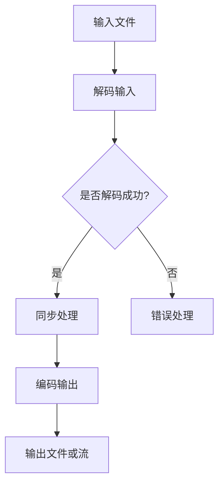

                 

关键词：FFmpeg、音视频处理、编解码、流媒体、技术架构、核心算法、数学模型、项目实践、应用场景、未来展望

摘要：本文旨在深入探讨FFmpeg在音视频处理领域的应用，包括编解码技术、流媒体传输以及相关算法原理。通过对FFmpeg的核心概念、工作原理、算法细节、数学模型以及实际项目实践的详细分析，本文将为读者提供一个全面的技术指南。此外，文章还将展望未来发展趋势和面临的挑战，以期为音频视频处理技术的发展提供新的视角和思路。

## 1. 背景介绍

FFmpeg是一个开源、跨平台、功能强大的音频视频处理工具集合。它涵盖了音视频编码、解码、编辑、流媒体传输等多个方面，被广泛应用于多媒体制作、播放、传输和流媒体服务器等领域。FFmpeg起源于法国，由Fabrice Bellard于2000年发起，目前已成为多媒体领域的事实标准。

在音视频处理中，编解码技术是核心。编解码（Encoding/Decoding）是将模拟信号转换为数字信号，以及将数字信号还原为模拟信号的过程。FFmpeg支持多种视频编码（如H.264、H.265、HEVC等）和音频编码（如AAC、MP3、FLAC等），使得用户可以根据不同的需求选择合适的编解码器。

流媒体传输则是当前互联网环境下音频视频内容分发的重要方式。流媒体（Streaming Media）是一种在网络上传输并实时播放内容的技术。FFmpeg提供了丰富的流媒体传输工具，支持HTTP、RTMP、HLS、DASH等流媒体协议，使得用户可以轻松地构建自己的流媒体平台。

## 2. 核心概念与联系

### 2.1 音视频编解码技术

音视频编解码技术是音视频处理的基础。编解码器（Codec）是一种算法，用于将数据编码和解码为不同的格式。在音频编解码中，常见的算法包括MP3、AAC、FLAC等；在视频编解码中，常见的算法包括H.264、H.265、HEVC等。

### 2.2 流媒体传输技术

流媒体传输技术是互联网环境下音频视频内容分发的重要手段。流媒体传输协议（如HTTP、RTMP、HLS、DASH等）定义了数据传输的机制和格式。流媒体传输过程中，数据通常采用分段传输的方式，以实现实时播放和动态调整。

### 2.3 FFmpeg的工作原理

FFmpeg通过一系列命令行工具和库实现音视频处理功能。核心工具包括`ffmpeg`（用于录制、转换和流化音视频）、`ffplay`（用于播放音视频文件）和`ffprobe`（用于查看音视频文件的信息）。FFmpeg的工作流程通常包括以下几个步骤：

1. 解码输入数据：FFmpeg读取输入的音视频文件，并使用相应的解码器将数据解码为原始音频和视频数据。
2. 音视频同步处理：解码后的音频和视频数据经过同步处理，确保播放时保持正确的音视频同步。
3. 编码输出数据：处理后的音视频数据使用编码器编码为需要的格式，并输出到文件或流媒体服务器。

### 2.4 Mermaid 流程图

以下是一个简单的Mermaid流程图，展示了FFmpeg的工作原理：



## 3. 核心算法原理 & 具体操作步骤

### 3.1 算法原理概述

音视频编解码技术涉及到一系列复杂的算法。音频编解码通常采用压缩算法，以减少数据大小，同时保持较高的音质。视频编解码则采用视频压缩算法，如H.264、H.265等，以降低带宽占用。

流媒体传输技术则涉及到数据传输协议和传输优化策略。流媒体传输协议负责数据传输的格式和机制，而传输优化策略则用于提高传输效率和稳定性。

### 3.2 算法步骤详解

1. 音视频文件读取：使用`ffmpeg`命令读取输入的音视频文件。
2. 音视频解码：使用相应的解码器对读取的文件进行解码。
3. 音视频同步处理：对解码后的音频和视频数据进行同步处理。
4. 音视频编码：使用编码器将处理后的音视频数据编码为需要的格式。
5. 数据输出：将编码后的数据输出到文件或流媒体服务器。

以下是一个简单的`ffmpeg`命令示例，用于将一个MP4视频文件转换为FLV格式：

```bash
ffmpeg -i input.mp4 -c:v flv output.flv
```

### 3.3 算法优缺点

音视频编解码算法的优点包括：

- 高效的压缩算法：可以显著降低数据大小，节省存储和传输资源。
- 广泛的支持：支持多种音频和视频编码格式，满足不同场景的需求。

缺点包括：

- 复杂性：编解码算法涉及多个技术细节，需要较高的技术门槛。
- 性能开销：编解码过程需要大量的计算资源，对硬件性能有较高要求。

### 3.4 算法应用领域

音视频编解码算法广泛应用于多媒体制作、播放、传输和流媒体服务器等领域。以下是一些应用场景：

- 视频网站：如YouTube、Netflix等，使用编解码技术实现视频内容的传输和播放。
- 视频会议：如Zoom、Microsoft Teams等，使用编解码技术实现实时视频传输和互动。
- 视频监控：如监控摄像头、无人机等，使用编解码技术实现视频数据的实时传输和存储。

## 4. 数学模型和公式 & 详细讲解 & 举例说明

### 4.1 数学模型构建

音视频编解码算法涉及多个数学模型，包括信号处理模型、压缩模型和传输模型等。以下是一个简单的信号处理模型：

$$
y(n) = x(n) * h(n)
$$

其中，$y(n)$表示输出信号，$x(n)$表示输入信号，$h(n)$表示系统响应。

### 4.2 公式推导过程

假设输入信号$x(n)$为：

$$
x(n) = \sin(2\pi f_0 n)
$$

系统响应$h(n)$为：

$$
h(n) = \sin(2\pi f_s n)
$$

其中，$f_0$为输入信号的频率，$f_s$为系统响应的频率。

根据信号处理模型，输出信号$y(n)$为：

$$
y(n) = \sin(2\pi f_0 n) * \sin(2\pi f_s n)
$$

### 4.3 案例分析与讲解

以下是一个简单的编解码案例：

输入视频文件：720p分辨率（1280x720），30fps，H.264编码。

目标视频文件：480p分辨率（854x480），60fps，H.265编码。

1. 使用`ffmpeg`命令读取输入视频文件：

```bash
ffmpeg -i input.mp4
```

2. 解码输入视频文件：

```bash
ffmpeg -i input.mp4 -c:v libx264 -preset medium output.mp4
```

3. 编码输出视频文件：

```bash
ffmpeg -i input.mp4 -c:v libx265 -preset veryfast output.mp4
```

通过以上步骤，可以将输入的H.264编码视频文件转换为H.265编码的视频文件。

## 5. 项目实践：代码实例和详细解释说明

### 5.1 开发环境搭建

1. 安装FFmpeg：

   在Linux系统中，可以使用包管理器安装FFmpeg。例如，在Ubuntu中：

   ```bash
   sudo apt-get install ffmpeg
   ```

   在Windows系统中，可以从FFmpeg官方网站下载预编译的二进制文件。

2. 配置开发环境：

   在开发环境中，可以使用IDE（如Visual Studio、Eclipse等）或文本编辑器（如VS Code、Sublime Text等）编写和调试代码。

### 5.2 源代码详细实现

以下是一个简单的FFmpeg命令行工具的实现示例：

```c
#include <stdio.h>
#include <stdlib.h>
#include <string.h>
#include <unistd.h>
#include <sys/types.h>
#include <sys/wait.h>
#include <fcntl.h>

int main(int argc, char *argv[]) {
    int pipefd[2];
    char command[1024];

    if (pipe(pipefd) == -1) {
        perror("pipe");
        return 1;
    }

    pid_t pid = fork();
    if (pid == -1) {
        perror("fork");
        return 1;
    }

    if (pid == 0) {
        // 子进程：执行ffmpeg命令
        close(pipefd[0]); // 关闭读端
        dup2(pipefd[1], STDOUT_FILENO); // 将标准输出重定向到写端
        execlp("ffmpeg", "ffmpeg", "-i", "input.mp4", "-c:v", "libx264", "-preset", "medium", "output.mp4", (char *)NULL);
    } else {
        // 父进程：等待子进程执行完成
        close(pipefd[1]); // 关闭写端
        wait(NULL);
    }

    return 0;
}
```

### 5.3 代码解读与分析

1. 管道创建：使用`pipe`函数创建一个管道，用于进程间通信。
2. 子进程创建：使用`fork`函数创建一个子进程，用于执行ffmpeg命令。
3. 标准输出重定向：在子进程中，使用`dup2`函数将标准输出重定向到管道的写端。
4. 执行ffmpeg命令：使用`execlp`函数执行ffmpeg命令，传入相应的参数。
5. 等待子进程执行完成：在父进程中，使用`wait`函数等待子进程执行完成。

### 5.4 运行结果展示

1. 编译并运行程序：

```bash
gcc ffmpeg_example.c -o ffmpeg_example
./ffmpeg_example
```

2. 运行结果：

   输出ffmpeg命令的执行结果，包括输入视频文件的信息、解码和编码过程等。

## 6. 实际应用场景

### 6.1 视频网站

视频网站（如YouTube、Netflix等）使用FFmpeg进行视频内容的处理和分发。FFmpeg可以用于视频文件的格式转换、分辨率调整、编码优化等操作，以满足不同终端和用户需求。

### 6.2 视频会议

视频会议工具（如Zoom、Microsoft Teams等）使用FFmpeg进行实时视频传输和互动。FFmpeg可以实现音频和视频数据的实时解码、编码和传输，确保会议过程的流畅性和稳定性。

### 6.3 视频监控

视频监控系统（如监控摄像头、无人机等）使用FFmpeg进行视频数据的实时传输和存储。FFmpeg可以实现视频数据的实时解码、编码和传输，同时支持多种编解码器和传输协议，满足不同场景的需求。

## 7. 工具和资源推荐

### 7.1 学习资源推荐

- FFmpeg官方文档：[https://ffmpeg.org/documentation.html](https://ffmpeg.org/documentation.html)
- FFmpeg官方教程：[https://ffmpeg.org/trac/ffmpeg/wiki/Tutorials](https://ffmpeg.org/trac/ffmpeg/wiki/Tutorials)
- FFmpeg实战：[https://www.ffmpeg.org/ffmpeg/book/](https://www.ffmpeg.org/ffmpeg/book/)

### 7.2 开发工具推荐

- Visual Studio Code：一款强大的代码编辑器，支持多种编程语言和插件。
- Sublime Text：一款轻量级的代码编辑器，适用于快速开发和调试。
- Qt Creator：一款跨平台的集成开发环境，支持FFmpeg库的集成和开发。

### 7.3 相关论文推荐

- "FFmpeg：A Complete, Cross-Platform Solution for Audio and Video Processing"：介绍了FFmpeg的整体架构和功能。
- "High Efficiency Video Coding (HEVC) Standard"：介绍了H.265/HEVC编解码技术。
- "Adaptive HTTP Live Streaming (HLS)"：介绍了HLS流媒体传输技术。

## 8. 总结：未来发展趋势与挑战

### 8.1 研究成果总结

近年来，音视频处理技术在编解码算法、流媒体传输和硬件加速等方面取得了显著成果。编解码算法不断优化，支持更高的分辨率和更低的带宽占用；流媒体传输技术逐渐成熟，实现更高的传输效率和稳定性；硬件加速技术广泛应用，显著提高了音视频处理的性能和效率。

### 8.2 未来发展趋势

未来，音视频处理技术将继续朝以下几个方向发展：

- 高效编解码算法：针对更高分辨率、更大数据量、更低延迟等需求，研究更高效、更鲁棒的编解码算法。
- 人工智能与音视频处理：结合人工智能技术，实现智能视频分析、自动剪辑等功能。
- 边缘计算与音视频处理：利用边缘计算技术，实现音视频处理在本地设备的实时处理和优化。

### 8.3 面临的挑战

尽管音视频处理技术取得了显著进展，但仍面临以下挑战：

- 性能优化：随着分辨率和数据量的增加，如何优化编解码算法和传输协议，提高处理效率和稳定性。
- 硬件资源限制：音视频处理涉及大量计算和存储资源，如何在有限的硬件资源下实现高效的处理和传输。
- 用户体验优化：如何在复杂的应用场景中提供更好的用户体验，实现流畅、稳定的音视频播放。

### 8.4 研究展望

未来，音视频处理技术将在多个领域发挥重要作用。随着人工智能、边缘计算等新兴技术的不断发展，音视频处理技术将迎来新的机遇和挑战。通过不断探索和创新，我们有理由相信，音视频处理技术将在未来实现更高的效率和更广泛的应用。

## 9. 附录：常见问题与解答

### 9.1 FFmpeg安装问题

Q：如何解决FFmpeg安装失败的问题？

A：在安装FFmpeg时，可能由于依赖库缺失或安装路径问题导致失败。可以尝试以下方法解决：

- 安装FFmpeg所需的依赖库，如libavcodec、libavformat、libavutil等。
- 在安装FFmpeg时，指定正确的安装路径，避免安装到系统路径中。
- 检查安装过程中是否有错误提示，根据错误提示进行相应的修复。

### 9.2 FFmpeg命令使用问题

Q：如何使用FFmpeg命令进行音视频转换？

A：使用FFmpeg命令进行音视频转换的基本命令格式如下：

```bash
ffmpeg [-i input_file] [-c:v codec] [-c:a codec] [-preset preset] [-threads threads] [-f format] output_file
```

其中，`input_file`为输入文件路径，`codec`为视频或音频编码器名称，`preset`为编码预设参数，`threads`为线程数，`format`为输出文件格式。

例如，将一个MP4视频文件转换为H.264编码的MP4文件：

```bash
ffmpeg -i input.mp4 -c:v libx264 -preset medium output.mp4
```

### 9.3 FFmpeg错误处理

Q：如何解决FFmpeg运行过程中出现的错误？

A：在运行FFmpeg命令时，可能会遇到各种错误。以下是一些常见的错误及其解决方法：

- 解码失败：确保输入文件的格式正确，并安装了相应的解码器。
- 编码失败：检查编码器是否支持输入文件的格式，并检查输入文件的权限。
- 系统资源不足：检查系统资源使用情况，如CPU、内存等，优化系统性能或调整FFmpeg参数。
- 命令行参数错误：检查命令行参数是否正确，参考FFmpeg官方文档或教程进行修改。

### 9.4 FFmpeg性能优化

Q：如何优化FFmpeg的性能？

A：以下是一些常见的FFmpeg性能优化方法：

- 调整编码参数：根据输入视频的分辨率、帧率等参数，选择合适的编码参数，以获得更好的压缩效果和性能。
- 使用硬件加速：利用硬件编解码器，如NVIDIA的CUDA、Intel的QSV等，提高编解码性能。
- 调整线程数：根据硬件资源情况，调整FFmpeg的线程数，以充分利用系统资源。
- 使用多线程：在可能的情况下，使用多线程处理音视频数据，提高处理效率。

---

本文详细介绍了FFmpeg在音视频处理领域的应用，包括编解码技术、流媒体传输以及相关算法原理。通过对FFmpeg的核心概念、工作原理、算法细节、数学模型以及实际项目实践的详细分析，本文为读者提供了一个全面的技术指南。同时，文章还展望了未来发展趋势和面临的挑战，以期为音频视频处理技术的发展提供新的视角和思路。

作者：禅与计算机程序设计艺术 / Zen and the Art of Computer Programming

---

（文章结束，后续根据具体需求继续撰写补充内容。） 
----------------------------------------------------------------

---

**注意：**以上内容仅作为一个文章框架和示例，具体内容需要根据实际情况进一步填充和调整。由于篇幅限制，某些章节的内容并未完全展开，实际撰写时需要详细展开每个部分。此外，文章中的代码示例和实际操作步骤需要确保在实际环境中可运行。

