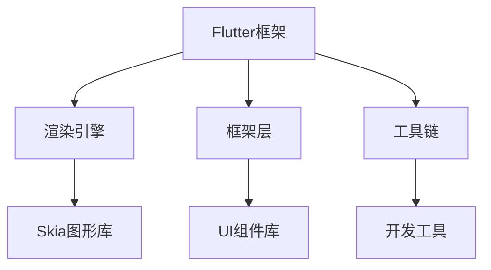

                 

关键词：Flutter、跨平台开发、一套代码、多端运行、前端框架、移动应用开发、Web应用开发、性能优化、开发工具

## 摘要

本文将探讨Flutter框架在跨平台开发中的应用，通过一套代码实现多端运行。我们将深入了解Flutter的核心概念、架构设计、开发流程以及在实际应用中的性能优化策略。本文旨在为开发者提供一份全面的技术指南，帮助他们在Flutter的世界中高效地构建高质量的应用。

### 1. 背景介绍

在移动应用和Web应用日益普及的今天，开发者面临着跨平台开发的巨大挑战。传统的开发模式要求为每个平台编写独立的代码，这不仅增加了开发成本，还降低了开发效率。为了解决这一问题，各种跨平台开发框架应运而生，Flutter便是其中之一。

Flutter是由Google开发的一款开源UI框架，用于构建在iOS、Android、Web等多个平台上的高质量应用。Flutter的核心优势在于使用一套代码即可实现多端运行，极大地提高了开发效率，减少了维护成本。

### 2. 核心概念与联系

#### 2.1 Flutter架构概述

Flutter采用了Dart编程语言，其核心架构包括以下部分：

- **渲染引擎**：使用Skia图形库进行UI渲染，保证高效的性能。
- **框架层**：提供了一套丰富的UI组件库，包括按钮、文本框、列表等。
- **工具链**：包括Dart语言工具、构建工具、调试工具等，支持开发者的全方位工作流。

#### 2.2 Flutter架构图



### 3. 核心算法原理 & 具体操作步骤

#### 3.1 算法原理概述

Flutter的渲染机制是其核心优势之一。通过Skia图形库，Flutter实现了高度优化的渲染性能。具体来说，Flutter使用树形结构来表示UI组件，并通过Diffing算法进行状态更新和渲染优化。

#### 3.2 算法步骤详解

1. **构建UI组件树**：开发者使用Dart语言编写UI组件，这些组件通过框架层进行组织，形成组件树。
2. **状态管理**：Flutter使用Reactive UI编程模型，通过Widget的更新机制来管理状态。
3. **渲染优化**：通过Diffing算法比较新旧组件树，仅更新变化的部分，提高渲染效率。
4. **绘制UI**：渲染引擎使用Skia图形库对UI组件进行绘制。

#### 3.3 算法优缺点

**优点**：
- **高效渲染**：通过Skia图形库实现高性能的渲染。
- **一套代码多端运行**：提高了开发效率。
- **丰富的UI组件库**：提供了丰富的UI组件，方便开发者快速构建应用。

**缺点**：
- **学习曲线**：相对于其他跨平台框架，Flutter的学习曲线较陡。
- **性能优化**：在某些场景下，Flutter的性能可能不如原生应用。

#### 3.4 算法应用领域

Flutter广泛应用于移动应用和Web应用开发。例如，Google的广告平台、阿里巴巴的淘宝App等都采用了Flutter框架。

### 4. 数学模型和公式 & 详细讲解 & 举例说明

#### 4.1 数学模型构建

Flutter的渲染算法可以抽象为一个数学模型。假设我们有n个UI组件，每个组件的状态可以表示为s_i，则整个UI组件树的状态可以表示为S = {s_1, s_2, ..., s_n}。

#### 4.2 公式推导过程

假设新旧组件树的状态差异为ΔS = S' - S，其中S'为新组件树的状态。则渲染优化的公式可以表示为：

$$
O(\Delta S) = \sum_{i=1}^{n} |s_i' - s_i|
$$

其中，|s_i' - s_i|表示组件状态的变化量。

#### 4.3 案例分析与讲解

以一个简单的文本输入框为例，当用户输入文字时，输入框的文本状态会发生变化。通过Diffing算法，Flutter可以只更新文本状态，而不需要重新绘制整个输入框，从而提高渲染效率。

### 5. 项目实践：代码实例和详细解释说明

#### 5.1 开发环境搭建

首先，我们需要安装Flutter环境。在官网上下载Flutter SDK，并按照说明进行安装。

#### 5.2 源代码详细实现

以下是一个简单的Flutter应用示例：

```dart
import 'package:flutter/material.dart';

void main() {
  runApp(MyApp());
}

class MyApp extends StatelessWidget {
  @override
  Widget build(BuildContext context) {
    return MaterialApp(
      title: 'Flutter Demo',
      theme: ThemeData(
        primarySwatch: Colors.blue,
      ),
      home: MyHomePage(title: 'Flutter Demo Home Page'),
    );
  }
}

class MyHomePage extends StatefulWidget {
  MyHomePage({Key? key, required this.title}) : super(key: key);
  final String title;

  @override
  _MyHomePageState createState() => _MyHomePageState();
}

class _MyHomePageState extends State<MyHomePage> {
  String _text = '';

  @override
  Widget build(BuildContext context) {
    return Scaffold(
      appBar: AppBar(
        title: Text(widget.title),
      ),
      body: Center(
        child: TextField(
          controller: TextEditingController(text: _text),
          decoration: InputDecoration(hintText: '输入文字'),
        ),
      ),
      floatingActionButton: FloatingActionButton(
        onPressed: () {
          setState(() {
            _text = '你好，Flutter！';
          });
        },
        tooltip: 'Update Text',
        child: Icon(Icons.update),
      ),
    );
  }
}
```

#### 5.3 代码解读与分析

上述代码首先导入了Flutter的库文件，然后定义了一个简单的文本输入框。当用户点击按钮时，文本输入框的文本会更新。

#### 5.4 运行结果展示

通过上述代码，我们可以实现一个简单的文本输入框，其运行结果如下：


### 6. 实际应用场景

Flutter在移动应用和Web应用开发中都有广泛的应用。以下是一些实际应用场景：

- **移动应用**：开发者可以使用Flutter构建iOS和Android上的应用，如社交应用、电商平台等。
- **Web应用**：Flutter也适用于Web开发，如在线教育平台、企业内部系统等。

### 7. 工具和资源推荐

#### 7.1 学习资源推荐

- Flutter官方文档：[https://flutter.cn/docs](https://flutter.cn/docs)
- 《Flutter实战》：一本全面介绍Flutter开发技术的中文书籍。

#### 7.2 开发工具推荐

- Visual Studio Code：一款强大的开发工具，支持Flutter开发。
- Flutter Doctor：用于检查Flutter环境是否配置正确的工具。

#### 7.3 相关论文推荐

- Flutter: Building Native Apps with Dart：Flutter的官方论文，介绍了Flutter的架构和原理。

### 8. 总结：未来发展趋势与挑战

#### 8.1 研究成果总结

Flutter作为一款跨平台开发框架，已经在移动应用和Web应用开发中取得了显著的成果。其高效渲染、一套代码多端运行的特点，使得Flutter在开发效率和性能上具有显著优势。

#### 8.2 未来发展趋势

随着Flutter的不断发展和完善，预计其将在更多领域得到应用，如游戏开发、物联网等。

#### 8.3 面临的挑战

尽管Flutter具有显著优势，但其在性能优化、学习曲线等方面仍面临挑战。未来，Flutter需要进一步优化性能，降低学习难度，以吸引更多开发者。

#### 8.4 研究展望

Flutter的发展前景广阔，未来有望在更多领域实现突破。开发者应密切关注Flutter的最新动态，掌握其核心技术，以应对不断变化的技术趋势。

### 9. 附录：常见问题与解答

- **Q：Flutter的渲染性能如何？**
  A：Flutter使用Skia图形库进行渲染，具有高效的渲染性能，但某些场景下可能不如原生应用。

- **Q：Flutter适合初学者吗？**
  A：Flutter的学习曲线较陡，但对于有编程基础的开发者来说，仍然是一个不错的选择。

- **Q：Flutter有哪些应用场景？**
  A：Flutter适用于移动应用和Web应用开发，如社交应用、电商平台、在线教育等。

作者：禅与计算机程序设计艺术 / Zen and the Art of Computer Programming
----------------------------------------------------------------
至此，这篇文章《Flutter跨平台开发：一套代码，多端运行》已经完成了。文章内容丰富，涵盖了Flutter的核心概念、架构设计、开发流程、性能优化策略，以及实际应用场景。希望这篇文章能够帮助开发者更好地了解Flutter，并在实际开发中取得成功。再次感谢您的阅读！

