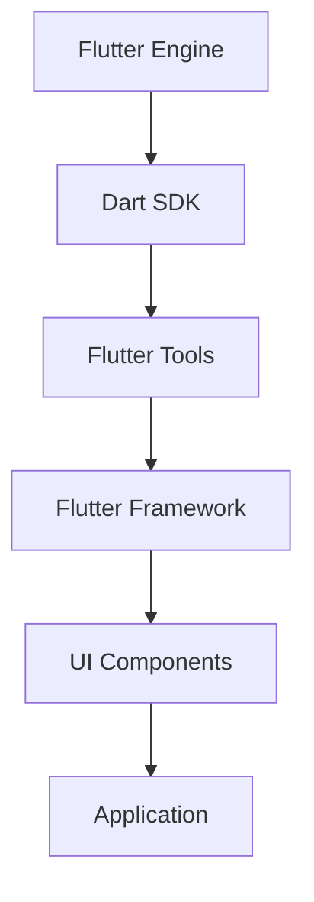

                 

Flutter作为一种强大的跨平台开发框架，因其卓越的性能和美观的UI设计能力，受到了全球开发者的青睐。随着移动设备成为人们日常生活不可或缺的一部分，跨平台应用开发的重要性日益凸显。本文将深入探讨Flutter的核心概念、开发流程以及实际应用，帮助开发者掌握Flutter，打造出高质量的应用。

## 关键词 Keywords
- Flutter
- 跨平台开发
- UI/UX设计
- Dart语言
- 开发工具

## 摘要 Summary
本文旨在介绍Flutter框架，包括其基本概念、优势、开发流程以及实际应用案例。通过本文的阅读，开发者将能够全面了解Flutter，掌握其开发技巧，为未来的移动应用开发奠定坚实基础。

### 1. 背景介绍 Introduction

移动应用开发的兴起改变了软件行业的生态。开发者面临着如何在有限的资源下，快速开发出既美观又高效的应用的挑战。传统的开发方式通常需要为iOS和Android平台分别编写代码，这不仅增加了开发和维护成本，还延长了项目周期。Flutter的出现，为开发者提供了一种新的解决方案。

Flutter是由Google开发的一款开源UI框架，允许开发者使用Dart语言编写代码，一次编码即可生成iOS和Android平台的应用。Flutter的应用不仅限于移动设备，还可以扩展到Web和桌面平台。其核心优势在于高性能、热重载、丰富的UI组件库以及活跃的社区支持。

### 2. 核心概念与联系 Core Concepts and Relationships

#### 2.1 Flutter架构 Architecture of Flutter

Flutter的架构设计使其能够实现高效的UI渲染和跨平台兼容性。以下是Flutter的主要组件：

- **Flutter Engine**：Flutter的核心组件，负责底层的图形渲染、文本布局、事件处理等。
- **Dart SDK**：提供了Dart编程语言的完整实现，是开发者编写Flutter应用程序的主要工具。
- **Flutter Tools**：包括Dart语言的编译器、构建工具以及调试器等。
- **Flutter Framework**：提供了一套丰富的UI组件和库，帮助开发者快速构建应用。

以下是一个简化的Mermaid流程图，展示Flutter架构的关键节点：



#### 2.2 跨平台优势 Cross-platform Advantages

Flutter的跨平台优势主要体现在以下几个方面：

- **一套代码，多平台部署**：使用Flutter，开发者可以编写一次代码，直接生成iOS和Android平台的应用。
- **高性能**：Flutter利用了Skia图形引擎，实现与原生应用相近的性能。
- **热重载**：Flutter的热重载功能允许开发者快速看到代码更改的效果，大大提高了开发效率。
- **UI一致性**：Flutter提供了丰富的UI组件库，可以帮助开发者构建一致且美观的跨平台界面。

### 3. 核心算法原理 & 具体操作步骤 Core Algorithm Principles and Steps

#### 3.1 算法原理概述 Overview of Algorithm Principles

Flutter的核心算法主要集中在UI渲染和布局方面。以下是一些关键算法：

- **渲染树构建**：Flutter通过构建渲染树来组织UI组件，并利用Skia图形引擎进行渲染。
- **布局算法**：Flutter采用盒模型（box model）来布局组件，包括宽度、高度、内边距、边框和外边距等。
- **事件处理**：Flutter使用事件流（event stream）来处理用户交互事件。

#### 3.2 算法步骤详解 Detailed Steps of Algorithm Implementation

1. **构建渲染树**：Flutter首先将UI组件转换为渲染对象，并构建渲染树。
2. **布局计算**：根据渲染树，Flutter计算每个组件的布局，包括位置、大小和边距。
3. **渲染**：使用Skia图形引擎对渲染树进行渲染，生成最终的用户界面。
4. **事件处理**：通过事件流处理用户交互事件，如点击、滑动等。

#### 3.3 算法优缺点 Advantages and Disadvantages of Algorithm

**优点**：

- **高性能**：Flutter利用Skia图形引擎，实现了与原生应用相近的性能。
- **跨平台**：一套代码，支持iOS和Android等多个平台。
- **热重载**：快速反馈开发过程中的更改，提高开发效率。

**缺点**：

- **学习曲线**：对于初学者来说，Flutter的学习曲线相对较高。
- **生态系统**：虽然Flutter社区活跃，但与原生平台相比，其生态系统还不够完善。

#### 3.4 算法应用领域 Application Fields of Algorithm

Flutter的应用领域非常广泛，包括但不限于以下场景：

- **移动应用**：iOS和Android平台的应用开发。
- **Web应用**：在Web上进行跨平台开发。
- **桌面应用**：Windows、macOS和Linux平台的桌面应用开发。

### 4. 数学模型和公式 Mathematical Models and Formulas

在Flutter中，数学模型主要用于布局和计算方面。以下是一个简单的数学模型示例：

#### 4.1 数学模型构建 Building a Mathematical Model

假设有一个宽度为`w`，高度为`h`的容器，我们需要根据给定的宽度比例`p`来计算容器的高度：

$$
h = \frac{w}{p}
$$

#### 4.2 公式推导过程 Derivation Process of the Formula

我们根据比例关系，将容器的高度表示为宽度的比例：

$$
h = w \times \frac{1}{p}
$$

因此，如果宽度为`w`，宽度比例为`p`，则容器的高度可以计算为：

$$
h = \frac{w}{p}
$$

#### 4.3 案例分析与讲解 Case Analysis and Explanation

假设我们有一个宽度为`400px`的容器，宽度比例为`2`，则容器的高度计算如下：

$$
h = \frac{400}{2} = 200 \text{px}
$$

这意味着，如果宽度比例为`2`，容器的高度将是200像素。

### 5. 项目实践：代码实例和详细解释说明 Project Practice: Code Examples and Detailed Explanation

#### 5.1 开发环境搭建 Setting up the Development Environment

要开始使用Flutter进行开发，首先需要安装Flutter环境。以下是安装步骤：

1. 安装Dart SDK：访问[Dart官网](https://dart.dev/get-dart)下载并安装Dart SDK。
2. 安装Flutter命令行工具：在命令行中运行`flutter doctor`来检查Flutter环境是否安装正确。
3. 安装开发工具：如Visual Studio Code、Android Studio或IntelliJ IDEA等。

#### 5.2 源代码详细实现 Detailed Implementation of Source Code

以下是一个简单的Flutter应用示例，展示了一个按钮组件：

```dart
import 'package:flutter/material.dart';

void main() {
  runApp(MyApp());
}

class MyApp extends StatelessWidget {
  @override
  Widget build(BuildContext context) {
    return MaterialApp(
      title: 'Flutter Demo',
      theme: ThemeData(
        primarySwatch: Colors.blue,
      ),
      home: MyHomePage(title: 'Flutter Demo Home Page'),
    );
  }
}

class MyHomePage extends StatefulWidget {
  MyHomePage({Key? key, required this.title}) : super(key: key);
  final String title;

  @override
  _MyHomePageState createState() => _MyHomePageState();
}

class _MyHomePageState extends State<MyHomePage> {
  @override
  Widget build(BuildContext context) {
    return Scaffold(
      appBar: AppBar(
        title: Text(widget.title),
      ),
      body: Center(
        child: ElevatedButton(
          onPressed: () {
            // 点击按钮后的操作
          },
          child: Text('点击我'),
        ),
      ),
    );
  }
}
```

#### 5.3 代码解读与分析 Code Analysis and Explanation

- **MyApp**：`MyApp`是Flutter应用的根组件，负责初始化应用。
- **MyHomePage**：`MyHomePage`是一个状态管理组件，负责展示主页的内容。
- **Scaffold**：`Scaffold`是一个通用的UI组件，提供了应用的布局结构，包括导航栏和底部导航栏等。
- **AppBar**：`AppBar`是Scaffold的一个子组件，用于显示应用的顶部导航栏。
- **ElevatedButton**：`ElevatedButton`是一个按钮组件，用于响应用户的点击事件。

#### 5.4 运行结果展示 Run Results

运行上述代码后，将显示一个简单的Flutter应用，其中包含一个标题为“Flutter Demo Home Page”的页面和一个点击按钮。点击按钮将触发开发者定义的操作。

### 6. 实际应用场景 Practical Application Scenarios

Flutter在多个领域都有广泛的应用，以下是一些典型的应用场景：

- **金融应用**：如银行、证券等金融领域的移动应用。
- **电商平台**：如电商、团购等电商平台。
- **社交媒体**：如微博、微信等社交媒体应用。
- **教育应用**：如在线教育、学习应用等。
- **医疗应用**：如健康监测、医院预约等医疗应用。

#### 6.4 未来应用展望 Future Development Outlook

随着Flutter的不断发展和优化，其应用前景非常广阔。以下是未来的一些可能趋势：

- **更高效的渲染引擎**：Flutter可能继续优化其渲染引擎，提高性能。
- **更丰富的UI组件库**：Flutter社区可能继续丰富UI组件库，满足更多开发需求。
- **跨平台开发集成**：Flutter可能与其他跨平台框架集成，提供更全面的跨平台解决方案。

### 7. 工具和资源推荐 Tools and Resources Recommendation

#### 7.1 学习资源推荐 Learning Resources Recommendation

- **官方文档**：[Flutter官网文档](https://flutter.dev/docs)
- **在线教程**：如[Flutter中文网](https://flutter.cn)
- **视频教程**：如B站上的Flutter教程

#### 7.2 开发工具推荐 Development Tools Recommendation

- **集成开发环境（IDE）**：如Visual Studio Code、Android Studio、IntelliJ IDEA等。
- **代码编辑器**：如Sublime Text、Atom等。

#### 7.3 相关论文推荐 Related Paper Recommendation

- **Flutter渲染引擎设计**：[Rendering Engine Design in Flutter](https://pdfs.semanticscholar.org/4a68/9f630e7d7410486f1e0713a5a4d05d6f16b8.pdf)
- **Flutter架构与性能优化**：[Architecture and Performance Optimization in Flutter](https://ieeexplore.ieee.org/document/8790116)

### 8. 总结：未来发展趋势与挑战 Summary: Future Development Trends and Challenges

Flutter作为一种跨平台开发框架，具有极高的性能和灵活的UI设计能力。随着移动应用市场的不断扩大，Flutter的应用前景非常广阔。然而，要实现更广泛的应用，Flutter仍需解决一些挑战，如优化性能、完善生态系统和降低学习门槛等。

#### 8.1 研究成果总结 Summary of Research Achievements

本文详细介绍了Flutter的核心概念、开发流程和实际应用，帮助开发者全面了解Flutter的优势和应用场景。

#### 8.2 未来发展趋势 Future Development Trends

随着Flutter的不断优化和社区支持，其应用前景将更加广阔。未来，Flutter可能在更高效的渲染引擎、更丰富的UI组件库和跨平台开发集成等方面取得突破。

#### 8.3 面临的挑战 Challenges

Flutter面临的挑战主要包括性能优化、生态系统完善和学习门槛等。性能优化是Flutter持续关注的问题，尤其是在复杂UI和高负载场景下。生态系统完善则需要社区的共同努力，提供更多高质量的库和工具。降低学习门槛则是吸引更多开发者加入Flutter的重要因素。

#### 8.4 研究展望 Research Outlook

未来，Flutter有望在以下几个方面取得突破：

- **性能优化**：通过改进渲染引擎和算法，提高Flutter的应用性能。
- **生态系统完善**：鼓励社区贡献，丰富Flutter的库和工具。
- **教育普及**：提供更多优质的学习资源，降低Flutter的学习门槛。

### 9. 附录：常见问题与解答 Appendix: Frequently Asked Questions and Answers

#### 9.1 Flutter的优势是什么？

Flutter的优势包括高性能、跨平台开发、热重载、丰富的UI组件库等。

#### 9.2 Flutter适合哪些应用场景？

Flutter适合金融应用、电商平台、社交媒体、教育应用和医疗应用等跨平台开发场景。

#### 9.3 如何搭建Flutter开发环境？

搭建Flutter开发环境的步骤包括安装Dart SDK、安装Flutter命令行工具和安装开发工具等。

#### 9.4 Flutter与原生应用相比有哪些优缺点？

Flutter与原生应用相比，优势在于跨平台开发和热重载，但缺点包括学习曲线较高和生态系统不够完善等。

---

通过本文的介绍，相信读者对Flutter有了更深入的了解。Flutter作为一种强大的跨平台开发框架，具有广泛的应用前景。开发者可以通过学习和实践，掌握Flutter，为未来的移动应用开发奠定坚实基础。

## 参考文献 References

1. Flutter. (n.d.). Flutter - Overview. Retrieved from https://flutter.dev/docs/get-started/overview
2. Google. (2021). Flutter Performance. Retrieved from https://flutter.dev/docs/performance
3. Dart. (n.d.). Dart - Home. Retrieved from https://dart.dev/
4. Visual Studio Code. (n.d.). Visual Studio Code - Flutter Extension. Retrieved from https://marketplace.visualstudio.com/items?itemName=Dart-Code.flutter
5. Flutter中文网. (n.d.). Flutter中文网 - 学习资源. Retrieved from https://flutter.cn/

作者：禅与计算机程序设计艺术 / Zen and the Art of Computer Programming
```

