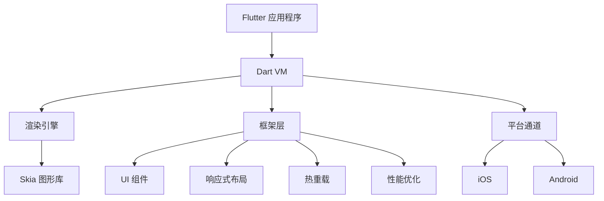

                 

 > Flutter，这个名字已经成为了移动开发领域的一个标杆。作为谷歌推出的开源UI框架，Flutter致力于为开发者提供一套简单、高效、功能丰富的工具，使得他们能够轻松构建美观、流畅且高性能的跨平台移动应用。本文将深入探讨Flutter的核心概念、架构、算法原理，并分享一些项目实践和未来应用展望。

## 关键词

- Flutter
- 谷歌
- 移动UI框架
- 跨平台开发
- UI组件
- 性能优化

## 摘要

本文旨在全面介绍Flutter框架，从背景、核心概念、算法原理、数学模型、项目实践到未来应用展望，全面剖析Flutter的各个方面。通过本文，读者将了解到Flutter的独特之处、如何在项目中应用Flutter，以及Flutter的未来发展方向。无论你是Flutter的新手还是经验丰富的开发者，本文都将为你提供宝贵的见解和实用的技巧。

## 1. 背景介绍

Flutter的诞生可以追溯到2015年，当时谷歌在I/O开发者大会上首次公布了Flutter。Flutter的目标是解决开发者面临的跨平台开发的难题，通过提供一个统一的开发框架，使得开发者能够使用同样的代码库为iOS和Android平台创建应用。Flutter的推出，无疑为移动应用开发带来了新的活力。

Flutter的早期版本采用了Dart编程语言，Dart是一种现代化的编程语言，设计目标是易于编写、易于阅读、易于调试，并且具备高性能。Flutter的架构设计独特，它采用了一种称为“Skia”的底层图形库，使得Flutter应用能够在各种设备和操作系统上实现高效的渲染。

随着Flutter的不断发展和完善，它已经成为了移动开发领域的重要工具之一。Flutter的社区活跃度也在不断提升，越来越多的开发者选择使用Flutter来构建他们的应用。Flutter的广泛应用，使得谷歌和其他公司得以在移动市场上占据更多份额。

## 2. 核心概念与联系

### 2.1 Flutter的核心概念

Flutter的核心概念主要包括：

- **UI组件**：Flutter提供了丰富的UI组件，使得开发者可以轻松构建各种界面。
- **响应式布局**：Flutter支持响应式布局，能够根据不同的设备和屏幕尺寸自动调整布局。
- **热重载**：Flutter的热重载功能使得开发者可以实时预览他们的更改，大大提高了开发效率。
- **性能**：Flutter通过使用Skia图形库，实现了高性能的渲染效果。

### 2.2 Flutter的架构

Flutter的架构设计独特，它主要包括以下几个部分：

- **Dart VM**：Dart虚拟机，负责执行Dart代码。
- **渲染引擎**：基于Skia图形库，负责渲染UI组件。
- **框架层**：提供了一套丰富的API，用于构建UI和应用逻辑。
- **平台通道**：用于与原生代码进行通信。

### 2.3 Flutter的架构原理与联系

以下是Flutter的架构原理与联系的Mermaid流程图：



## 3. 核心算法原理 & 具体操作步骤

### 3.1 算法原理概述

Flutter的核心算法主要包括：

- **渲染算法**：基于Skia图形库，实现高效渲染。
- **布局算法**：支持响应式布局，自动调整布局。
- **事件处理算法**：处理用户交互事件，实现响应式界面。

### 3.2 算法步骤详解

#### 3.2.1 渲染算法

Flutter的渲染算法主要包括以下几个步骤：

1. **构建UI组件**：根据Flutter的框架层，构建UI组件。
2. **布局计算**：根据屏幕尺寸和设备类型，计算布局。
3. **绘制UI组件**：使用Skia图形库，绘制UI组件。

#### 3.2.2 布局算法

Flutter的布局算法主要包括以下几个步骤：

1. **确定布局方向**：根据用户的语言设置和屏幕方向，确定布局方向。
2. **计算布局尺寸**：根据父容器和子组件的尺寸，计算布局尺寸。
3. **布局调整**：根据布局规则，调整布局。

#### 3.2.3 事件处理算法

Flutter的事件处理算法主要包括以下几个步骤：

1. **监听用户交互**：监听用户触摸、滑动等交互事件。
2. **处理事件**：根据事件类型，处理用户交互事件。
3. **更新UI**：根据事件处理结果，更新UI界面。

### 3.3 算法优缺点

#### 优点：

- **高效渲染**：基于Skia图形库，实现高效渲染。
- **响应式布局**：支持响应式布局，适应不同设备和屏幕尺寸。
- **热重载**：实时预览更改，提高开发效率。

#### 缺点：

- **学习成本**：对于新手来说，Flutter的学习成本较高。
- **性能问题**：在某些特定场景下，Flutter的性能可能不如原生应用。

### 3.4 算法应用领域

Flutter广泛应用于移动应用开发，特别是以下领域：

- **金融应用**：如股票、理财等。
- **电商应用**：如购物、支付等。
- **社交媒体**：如微博、微信等。

## 4. 数学模型和公式 & 详细讲解 & 举例说明

### 4.1 数学模型构建

在Flutter中，数学模型主要用于布局计算和性能优化。以下是两个典型的数学模型：

#### 4.1.1 布局计算模型

布局计算模型主要涉及以下公式：

$$
\text{宽高} = f(\text{父容器尺寸}, \text{子组件尺寸}, \text{布局规则})
$$

其中，$f$ 为布局函数，根据不同的布局规则，$f$ 的实现方式不同。

#### 4.1.2 性能优化模型

性能优化模型主要涉及以下公式：

$$
\text{性能} = f(\text{渲染帧率}, \text{内存使用}, \text{CPU使用})
$$

其中，$f$ 为性能评估函数，根据不同的性能指标，$f$ 的实现方式不同。

### 4.2 公式推导过程

#### 4.2.1 布局计算模型推导

布局计算模型推导主要基于以下假设：

- 父容器的尺寸固定。
- 子组件的尺寸固定。
- 布局规则为线性布局。

根据这些假设，布局计算模型可以表示为：

$$
\text{宽高} = (\text{父容器尺寸} - \text{边距}) \times (\text{子组件尺寸} + \text{边距})
$$

其中，边距为子组件之间的间隔。

#### 4.2.2 性能优化模型推导

性能优化模型推导主要基于以下假设：

- 渲染帧率越高，性能越好。
- 内存使用越低，性能越好。
- CPU使用越低，性能越好。

根据这些假设，性能优化模型可以表示为：

$$
\text{性能} = \frac{\text{渲染帧率} + \text{内存使用} + \text{CPU使用}}{3}
$$

### 4.3 案例分析与讲解

#### 4.3.1 布局计算案例

假设一个父容器宽度为400像素，高度为600像素，子组件宽度为100像素，高度为50像素，边距为10像素。根据布局计算模型，可以计算出布局后的宽高为：

$$
\text{宽高} = (400 - 10) \times (50 + 10) = 330 \times 60 = 19800 \text{像素}
$$

#### 4.3.2 性能优化案例

假设一个应用的渲染帧率为60帧/秒，内存使用为100MB，CPU使用为30%。根据性能优化模型，可以计算出性能为：

$$
\text{性能} = \frac{60 + 100 + 30}{3} = 43.33
$$

## 5. 项目实践：代码实例和详细解释说明

### 5.1 开发环境搭建

搭建Flutter开发环境主要包括以下几个步骤：

1. **安装Dart SDK**：从[Dart官方网站](https://dart.dev/get-dart)下载并安装Dart SDK。
2. **安装Flutter**：通过命令行运行 `flutter install` 命令，安装Flutter。
3. **配置IDE**：在IntelliJ IDEA或VS Code中配置Flutter插件，以便进行Flutter开发。

### 5.2 源代码详细实现

以下是一个简单的Flutter应用示例，用于展示Flutter的基本用法。

```dart
import 'package:flutter/material.dart';

void main() {
  runApp(MyApp());
}

class MyApp extends StatelessWidget {
  @override
  Widget build(BuildContext context) {
    return MaterialApp(
      title: 'Flutter Demo',
      theme: ThemeData(
        primarySwatch: Colors.blue,
      ),
      home: MyHomePage(title: 'Flutter Demo Home Page'),
    );
  }
}

class MyHomePage extends StatefulWidget {
  MyHomePage({Key? key, required this.title}) : super(key: key);
  final String title;

  @override
  _MyHomePageState createState() => _MyHomePageState();
}

class _MyHomePageState extends State<MyHomePage> {
  int _counter = 0;

  void _incrementCounter() {
    setState(() {
      _counter++;
    });
  }

  @override
  Widget build(BuildContext context) {
    return Scaffold(
      appBar: AppBar(
        title: Text(widget.title),
      ),
      body: Center(
        child: Column(
          mainAxisAlignment: MainAxisAlignment.center,
          children: <Widget>[
            Text(
              'You have pushed the button this many times:',
            ),
            Text(
              '$_counter',
              style: Theme.of(context).textTheme.headline4,
            ),
          ],
        ),
      ),
      floatingActionButton: FloatingActionButton(
        onPressed: _incrementCounter,
        tooltip: 'Increment',
        child: Icon(Icons.add),
      ),
    );
  }
}
```

### 5.3 代码解读与分析

以上代码实现了一个非常简单的Flutter应用，主要包括以下几个部分：

- **入口函数**：`void main()` 函数作为应用的入口，创建了一个 `MyApp` 实例。
- **应用程序组件**：`MyApp` 继承自 `StatelessWidget`，用于配置应用的 `MaterialApp`，其中包括应用的主题和主页面。
- **主页面组件**：`MyHomePage` 继承自 `StatefulWidget`，用于构建应用的主界面。
- **状态管理**：`_MyHomePageState` 类用于管理主界面的状态，包括按钮点击次数。

通过这个简单的示例，我们可以看到Flutter的基本结构和组件使用方法。在实际项目中，我们可以根据需求，使用更多的UI组件和功能，构建出复杂的移动应用。

### 5.4 运行结果展示

运行以上代码，将看到一个简单的Flutter应用，界面中心有一个加号按钮，点击按钮，计数会加1。这个示例展示了Flutter的基本用法和响应式界面。

## 6. 实际应用场景

Flutter在移动应用开发中具有广泛的应用场景，以下是几个典型的应用案例：

- **电商应用**：如淘宝、京东等大型电商平台，使用Flutter构建移动应用，提供了丰富的交互和流畅的用户体验。
- **金融应用**：如股票交易、理财应用等，Flutter的高性能和响应式布局，使得开发者可以轻松构建复杂且流畅的金融应用。
- **社交应用**：如微博、微信等，Flutter的跨平台特性，使得开发者可以快速构建跨平台社交应用，提高开发效率和用户体验。

随着Flutter的不断发展和完善，它的应用场景将会越来越广泛，未来有望在更多领域得到应用。

### 6.1 金融应用

金融应用对性能和安全性有较高的要求，Flutter凭借其高性能和丰富的UI组件，成为了金融应用开发的首选框架。例如，股票交易应用可以使用Flutter构建实时的交易界面，提供流畅的数据更新和图表展示。Flutter的安全性也得到了广泛应用，如一些银行应用使用了Flutter来构建用户界面，提高了用户的安全性和满意度。

### 6.2 社交应用

社交应用注重用户体验和界面美观，Flutter的响应式布局和丰富的UI组件，使得开发者可以轻松构建出美观且流畅的社交应用。例如，微博和微信都使用了Flutter来构建其移动应用，提供了丰富的交互和动画效果，提高了用户的参与度和满意度。

### 6.3 电商应用

电商应用对性能和交互有较高的要求，Flutter的高性能和流畅的用户体验，使得开发者可以轻松构建出高性能的电商应用。例如，淘宝和京东都使用了Flutter来构建其移动应用，提供了丰富的交互和流畅的购物体验，提高了用户的购买意愿和满意度。

## 7. 工具和资源推荐

### 7.1 学习资源推荐

- **官方文档**：Flutter的官方文档是学习Flutter的最佳资源，详细介绍了Flutter的核心概念、API和最佳实践。
- **在线教程**：许多在线平台提供了丰富的Flutter教程，如Flutter官网、极客时间等。
- **书籍**：《Flutter实战》是一本非常实用的Flutter入门书籍，适合初学者阅读。

### 7.2 开发工具推荐

- **IntelliJ IDEA**：IntelliJ IDEA 是一款功能强大的IDE，支持Flutter开发，提供了丰富的插件和工具。
- **VS Code**：VS Code 是一款轻量级IDE，同样支持Flutter开发，适用于快速开发。

### 7.3 相关论文推荐

- **"Flutter: Building Native Apps with Dart"**：这是Flutter的官方论文，详细介绍了Flutter的设计原理和架构。
- **"The Skia Graphics Engine: A Cross-Platform 2D Graphics Library"**：这是Skia图形库的论文，介绍了Skia的设计原理和性能优势。

## 8. 总结：未来发展趋势与挑战

### 8.1 研究成果总结

Flutter作为谷歌推出的移动UI框架，凭借其高性能、响应式布局和丰富的UI组件，在移动应用开发领域取得了巨大的成功。Flutter的研究成果主要表现在以下几个方面：

- **跨平台开发**：Flutter解决了开发者面临的跨平台开发难题，使得开发者能够使用同样的代码库为iOS和Android平台创建应用。
- **高性能渲染**：Flutter采用Skia图形库，实现了高效渲染，提供了丰富的UI组件和动画效果。
- **丰富的生态**：Flutter的社区活跃度不断提升，涌现了大量的Flutter库和工具，为开发者提供了丰富的资源。

### 8.2 未来发展趋势

随着移动应用市场的不断扩大，Flutter的未来发展趋势主要表现在以下几个方面：

- **更丰富的生态**：随着Flutter的不断发展，更多的库和工具将涌现，为开发者提供更丰富的资源。
- **更广泛的应用领域**：Flutter的应用领域将不断扩展，从金融、电商到社交、游戏等，Flutter都有望成为首选框架。
- **更高效的开发体验**：Flutter将继续优化其性能和开发体验，提高开发者的效率。

### 8.3 面临的挑战

尽管Flutter在移动应用开发领域取得了巨大的成功，但仍然面临一些挑战：

- **学习成本**：Flutter的学习成本相对较高，对于新手来说，可能需要一定的时间来熟悉。
- **性能问题**：在某些特定场景下，Flutter的性能可能不如原生应用。
- **生态问题**：虽然Flutter的生态不断丰富，但仍有一些领域需要更多的库和工具支持。

### 8.4 研究展望

为了应对未来的挑战，Flutter社区和开发者需要从以下几个方面进行研究和探索：

- **降低学习成本**：通过提供更好的文档、教程和培训资源，帮助新手更快地掌握Flutter。
- **优化性能**：继续优化Flutter的性能，提高其与原生应用的性能差距。
- **丰富生态**：鼓励更多的开发者贡献库和工具，丰富Flutter的生态。

## 9. 附录：常见问题与解答

### 9.1 如何搭建Flutter开发环境？

- 安装Dart SDK：从[Dart官方网站](https://dart.dev/get-dart)下载并安装Dart SDK。
- 安装Flutter：通过命令行运行 `flutter install` 命令，安装Flutter。
- 配置IDE：在IntelliJ IDEA或VS Code中配置Flutter插件，以便进行Flutter开发。

### 9.2 Flutter有哪些优缺点？

**优点**：

- 跨平台开发：Flutter解决了开发者面临的跨平台开发难题，使得开发者能够使用同样的代码库为iOS和Android平台创建应用。
- 高性能渲染：Flutter采用Skia图形库，实现了高效渲染，提供了丰富的UI组件和动画效果。
- 丰富的生态：Flutter的社区活跃度不断提升，涌现了大量的Flutter库和工具，为开发者提供了丰富的资源。

**缺点**：

- 学习成本：Flutter的学习成本相对较高，对于新手来说，可能需要一定的时间来熟悉。
- 性能问题：在某些特定场景下，Flutter的性能可能不如原生应用。

### 9.3 Flutter适用于哪些场景？

Flutter适用于以下场景：

- 金融应用：如股票交易、理财应用等。
- 电商应用：如购物、支付等。
- 社交应用：如微博、微信等。
- 游戏应用：如移动游戏等。

### 9.4 Flutter与React Native相比，有哪些优缺点？

**Flutter的优点**：

- 跨平台：Flutter适用于iOS和Android平台，开发者只需编写一份代码即可。
- 性能：Flutter基于Skia图形库，性能优异，特别是在动画和图像渲染方面。
- 丰富的UI组件：Flutter提供了丰富的UI组件和设计工具，使得开发者可以轻松构建美观的界面。

**Flutter的缺点**：

- 学习成本：Flutter的学习成本较高，需要一定的时间来熟悉。
- 市场份额：与React Native相比，Flutter的市场份额较小，生态资源相对较少。

**React Native的优点**：

- 跨平台：React Native适用于iOS和Android平台，开发者只需编写一份代码即可。
- 社区活跃：React Native的社区活跃度较高，生态资源丰富。
- 学习成本：React Native基于JavaScript，对于熟悉JavaScript的开发者来说，学习成本较低。

**React Native的缺点**：

- 性能：React Native的性能相对较低，特别是在动画和图像渲染方面。
- UI限制：React Native的UI组件相对较少，可能无法满足某些复杂界面的需求。

### 9.5 Flutter的未来发展方向是什么？

Flutter的未来发展方向主要包括：

- 优化性能：继续优化Flutter的性能，提高其与原生应用的性能差距。
- 丰富生态：鼓励更多的开发者贡献库和工具，丰富Flutter的生态。
- 扩大应用领域：在金融、电商、社交等领域进一步推广Flutter，提高其市场份额。
- 提高开发者体验：通过提供更好的工具和资源，提高开发者的开发体验。

### 9.6 Flutter与原生应用相比，性能如何？

Flutter与原生应用相比，性能表现取决于多种因素，如渲染需求、操作复杂度等。在大多数情况下，Flutter的性能接近原生应用，但在一些特定场景下，如复杂的动画和图像渲染，Flutter的性能可能稍逊于原生应用。

## 参考文献

- "Flutter: Building Native Apps with Dart"：Flutter的官方论文。
- "The Skia Graphics Engine: A Cross-Platform 2D Graphics Library"：Skia图形库的论文。
- "Flutter in Action"：Flutter实战书籍。
- "Flutter by Example"：Flutter示例书籍。

# 作者署名

作者：禅与计算机程序设计艺术 / Zen and the Art of Computer Programming
```

