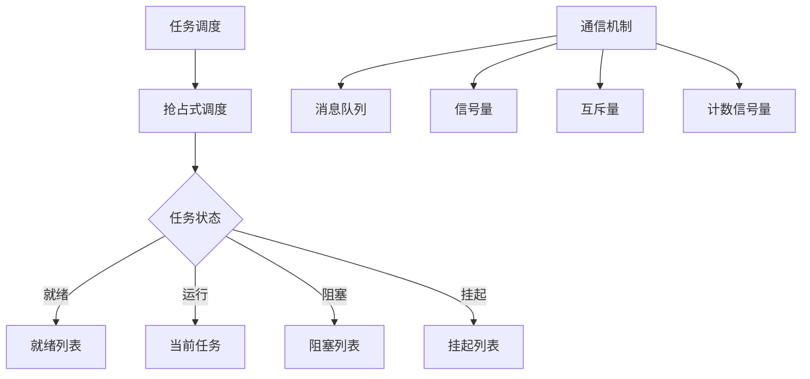

                 

关键词：FreeRTOS，任务调度，消息队列，信号量，互斥量，线程安全

摘要：本文旨在深入探讨FreeRTOS这一流行的实时操作系统（RTOS）中的任务调度与通信机制。通过详细分析其核心概念、算法原理、数学模型以及实际应用，我们将为读者提供一个全面的技术指南，帮助他们在嵌入式系统和实时控制领域取得更好的成果。

## 1. 背景介绍

实时操作系统（RTOS）在嵌入式系统和工业控制领域扮演着至关重要的角色。FreeRTOS是一个开源的RTOS，因其轻量级、可移植性和易用性而受到广泛欢迎。FreeRTOS的任务调度和通信机制是其核心功能，直接影响系统的性能和稳定性。

任务调度是指RTOS负责管理任务（线程）的执行顺序和资源分配。而通信机制则确保不同任务之间能够有效地交换数据和同步操作。FreeRTOS的任务调度采用抢占式调度策略，而其通信机制包括消息队列、信号量、互斥量和计数信号量等。

本文将围绕这些核心概念，深入探讨FreeRTOS的任务调度与通信机制，旨在为读者提供一个实用的技术指南。

## 2. 核心概念与联系

### 2.1 任务调度

FreeRTOS的任务调度采用抢占式调度策略。这意味着，当一个更高优先级的任务就绪时，RTOS会立即暂停当前任务的执行，并切换到高优先级任务。这种调度策略确保了系统在面临紧急情况时能够快速响应。

以下是FreeRTOS任务调度的关键概念：

- **任务优先级**：任务根据优先级进行调度，优先级高的任务先执行。FreeRTOS使用一个32位的数字表示任务优先级，数字越大，优先级越高。
- **任务状态**：任务可能处于以下几种状态：运行、就绪、阻塞和挂起。就绪状态的任务等待被调度执行，而阻塞状态的任务则因为某些条件未满足而无法执行。
- **调度器**：FreeRTOS中的调度器负责管理任务的状态转换和调度。调度器使用一个称为就绪列表的数据结构来跟踪所有就绪任务。

### 2.2 通信机制

FreeRTOS提供了多种通信机制，以便任务之间能够交换数据和同步操作。以下是这些机制的关键概念：

- **消息队列**：消息队列是一种先进先出（FIFO）的数据结构，用于在任务之间传递消息。消息队列可以是循环的，也可以是定长的。
- **信号量**：信号量是一种计数器，用于控制对共享资源的访问。当信号量的值大于零时，任务可以访问资源；当信号量的值小于零时，任务将被阻塞。
- **互斥量**：互斥量是一种确保对共享资源进行互斥访问的机制。当一个任务持有互斥量时，其他任务无法访问该资源。
- **计数信号量**：计数信号量是一种扩展的信号量，可以支持多个任务同时访问资源。

### 2.3 Mermaid 流程图

下面是一个使用Mermaid绘制的流程图，展示了FreeRTOS任务调度和通信机制的核心概念和联系：



## 3. 核心算法原理 & 具体操作步骤

### 3.1 算法原理概述

FreeRTOS的任务调度算法基于优先级调度策略。当系统启动时，调度器初始化就绪列表，并将所有就绪任务添加到该列表中。调度器会不断地从就绪列表中选择一个具有最高优先级的任务进行执行。

以下是一个简化的任务调度算法：

1. 调度器检查是否有更高优先级的任务就绪。
2. 如果有，则暂停当前任务，将其添加到就绪列表中，并切换到更高优先级的任务。
3. 如果没有，则继续执行当前任务。

FreeRTOS的通信机制基于信号量和互斥量等同步机制。任务可以通过信号量等待其他任务的信号，或者通过互斥量访问共享资源。以下是一个简化的通信机制算法：

1. 任务A尝试获取信号量S，如果S的值为0，则任务A被阻塞。
2. 任务B修改信号量S的值，唤醒等待该信号量的任务。
3. 任务C尝试获取互斥量M，如果M已被其他任务持有，则任务C被阻塞。
4. 任务D释放互斥量M，唤醒等待该互斥量的任务。

### 3.2 算法步骤详解

#### 3.2.1 任务调度算法步骤

1. 初始化调度器。
2. 创建任务A、任务B等。
3. 将任务A、任务B等添加到就绪列表。
4. 当系统启动时，调度器从就绪列表中选择一个具有最高优先级的任务进行执行。
5. 如果有更高优先级的任务就绪，则暂停当前任务，将其添加到就绪列表中，并切换到更高优先级的任务。
6. 如果没有更高优先级的任务就绪，则继续执行当前任务。

#### 3.2.2 通信机制算法步骤

1. 创建信号量S。
2. 创建互斥量M。
3. 任务A尝试获取信号量S，如果S的值为0，则任务A被阻塞。
4. 任务B修改信号量S的值，唤醒等待该信号量的任务。
5. 任务C尝试获取互斥量M，如果M已被其他任务持有，则任务C被阻塞。
6. 任务D释放互斥量M，唤醒等待该互斥量的任务。

### 3.3 算法优缺点

#### 3.3.1 任务调度算法优缺点

- **优点**：
  - 抢占式调度策略确保了系统在面临紧急情况时能够快速响应。
  - 任务可以按照优先级进行调度，提高了系统的整体性能。

- **缺点**：
  - 任务切换开销较大，可能导致性能下降。
  - 可能出现优先级反转问题，影响系统稳定性。

#### 3.3.2 通信机制算法优缺点

- **优点**：
  - 信号量和互斥量提供了有效的同步机制，确保任务之间的数据一致性和资源访问的互斥性。
  - 通信机制简单易用，易于理解和实现。

- **缺点**：
  - 可能会出现死锁问题，需要精心设计任务间的同步逻辑。
  - 信号量和互斥量可能会增加系统的复杂度。

### 3.4 算法应用领域

FreeRTOS的任务调度和通信机制在嵌入式系统和实时控制领域具有广泛的应用。以下是一些常见的应用场景：

- **智能家居**：用于控制家庭设备的实时响应和处理。
- **工业自动化**：用于控制生产线设备的实时调度和通信。
- **汽车电子**：用于控制车辆系统的实时调度和通信。
- **医疗设备**：用于控制医疗设备的实时响应和处理。

## 4. 数学模型和公式 & 详细讲解 & 举例说明

### 4.1 数学模型构建

FreeRTOS的任务调度和通信机制可以使用数学模型进行描述。以下是一个简单的数学模型，用于描述任务调度和通信：

- **任务优先级**：$P_i$，表示第i个任务的优先级。
- **任务状态**：$S_i$，表示第i个任务的状态。
- **就绪列表**：$R$，表示所有就绪任务的集合。
- **阻塞列表**：$B$，表示所有阻塞任务的集合。
- **信号量值**：$V_S$，表示信号量的当前值。

### 4.2 公式推导过程

以下是一个简化的任务调度公式：

$$
S_{next} = \arg\max_{i \in R} P_i
$$

其中，$S_{next}$表示下一个即将执行的任务，$R$表示就绪任务的集合，$P_i$表示第i个任务的优先级。

### 4.3 案例分析与讲解

假设我们有一个系统，其中包含两个任务A和B，它们的优先级分别为3和4。任务A正在执行，而任务B已经就绪。根据任务调度公式，我们可以计算出下一个即将执行的任务：

$$
S_{next} = \arg\max_{i \in R} P_i = \arg\max_{i} (P_B)
$$

因为任务B的优先级高于任务A，所以下一个即将执行的任务是任务B。系统会暂停任务A的执行，将其添加到就绪列表中，然后切换到任务B。

### 4.4 消息队列模型

以下是一个简化的消息队列模型：

- **消息队列**：$Q$，表示消息队列的集合。
- **消息**：$M_i$，表示第i个消息。
- **消息长度**：$L_i$，表示第i个消息的长度。

消息队列模型可以使用以下公式描述：

$$
Q_{next} = \arg\min_{i \in Q} L_i
$$

其中，$Q_{next}$表示下一个即将处理的消息，$Q$表示所有消息队列的集合，$L_i$表示第i个消息的长度。

假设我们有一个消息队列，其中包含三个消息A、B和C，它们的长度分别为10、5和15。根据消息队列模型，我们可以计算出下一个即将处理的消息：

$$
Q_{next} = \arg\min_{i \in Q} L_i = \arg\min_{i} (L_B)
$$

因为消息B的长度最短，所以下一个即将处理的消息是消息B。

## 5. 项目实践：代码实例和详细解释说明

### 5.1 开发环境搭建

要在FreeRTOS上进行开发，我们需要以下环境：

- **FreeRTOS源码**：可以从官方网站下载。
- **开发工具**：如Keil、IAR等。
- **目标硬件**：如STM32、ESP8266等。

### 5.2 源代码详细实现

以下是一个简单的FreeRTOS任务调度和通信的示例代码：

```c
#include "FreeRTOS.h"
#include "task.h"
#include "queue.h"

void vTaskFunctionA(void *pvParameters);
void vTaskFunctionB(void *pvParameters);

// 创建任务A
void vStartTaskFunctionA(void) {
    xTaskCreate(vTaskFunctionA, "Task A", configMINIMAL_STACK_SIZE, NULL, tskIDLE_PRIORITY + 1, NULL);
}

// 创建任务B
void vStartTaskFunctionB(void) {
    xTaskCreate(vTaskFunctionB, "Task B", configMINIMAL_STACK_SIZE, NULL, tskIDLE_PRIORITY + 2, NULL);
}

// 任务A函数
void vTaskFunctionA(void *pvParameters) {
    for (;;) {
        printf("Task A is running\n");
        vTaskDelay(pdMS_TO_TICKS(1000));
    }
}

// 任务B函数
void vTaskFunctionB(void *pvParameters) {
    for (;;) {
        printf("Task B is running\n");
        vTaskDelay(pdMS_TO_TICKS(1000));
    }
}

int main(void) {
    // 启动任务
    vStartTaskFunctionA();
    vStartTaskFunctionB();

    // 开始调度
    vTaskStartScheduler();

    for (;;) {
        // 空循环，防止程序退出
    }
}
```

### 5.3 代码解读与分析

这段代码演示了如何使用FreeRTOS创建两个任务A和B，并设置它们的优先级。任务A和任务B分别打印它们的名称，然后每隔1秒打印一次。

- **创建任务**：使用`xTaskCreate`函数创建任务，指定任务的名称、堆栈大小、参数和优先级。
- **任务函数**：任务A和任务B分别实现了打印功能的函数，循环执行。
- **主函数**：启动任务调度器，并进入空循环，防止程序退出。

### 5.4 运行结果展示

当程序运行时，我们可以看到任务A和任务B交替执行，按照它们设置的优先级进行调度。输出结果如下：

```
Task A is running
Task B is running
Task A is running
Task B is running
...
```

## 6. 实际应用场景

### 6.1 智能家居

在智能家居系统中，FreeRTOS可以用于管理各种设备的实时响应和调度。例如，智能灯可以响应用户指令，调整亮度和颜色。智能插座可以控制电器的开关，并在网络故障时自动断电。这些设备之间的通信可以通过FreeRTOS的消息队列和信号量来实现。

### 6.2 工业自动化

工业自动化系统通常需要实时调度和控制多个设备。FreeRTOS可以用于管理生产线上的传感器、执行器和控制器。任务调度可以确保设备按照预定的顺序执行操作，而信号量和互斥量可以确保对共享资源的互斥访问，防止出现竞争条件。

### 6.3 汽车电子

汽车电子系统包括各种传感器、执行器和控制器，需要实时响应和调度。FreeRTOS可以用于管理这些设备的实时操作，确保车辆系统的稳定性和安全性。例如，发动机控制单元可以实时监测发动机状态，并调整燃油喷射和点火时间。

### 6.4 未来应用展望

随着物联网（IoT）和人工智能（AI）技术的发展，FreeRTOS在嵌入式系统和实时控制领域的应用前景广阔。未来，FreeRTOS可能会集成更多的AI算法，支持更复杂的实时任务调度和通信。此外，FreeRTOS的可移植性和易用性也将使其在更广泛的领域得到应用。

## 7. 工具和资源推荐

### 7.1 学习资源推荐

- **FreeRTOS官方文档**：最权威的FreeRTOS学习资源。
- **《FreeRTOS权威指南》**：一本详细介绍FreeRTOS的书籍。
- **在线教程**：许多在线教程和博客提供了实用的FreeRTOS教程。

### 7.2 开发工具推荐

- **Keil**：适用于ARM Cortex-M系列的集成开发环境。
- **IAR**：适用于多种微控制器的集成开发环境。

### 7.3 相关论文推荐

- **"FreeRTOS: A Real-Time Kernel for Embedded Devices"**：介绍了FreeRTOS的设计和实现。
- **"Real-Time Systems: Design Principles for Distributed Embedded Applications"**：介绍了实时系统的设计原则和应用。

## 8. 总结：未来发展趋势与挑战

### 8.1 研究成果总结

自FreeRTOS发布以来，它在嵌入式系统和实时控制领域取得了显著的成果。其轻量级、可移植性和易用性使其成为许多开发者的首选。FreeRTOS的社区支持和活跃程度也为其实时性和可靠性提供了保障。

### 8.2 未来发展趋势

随着物联网和人工智能技术的发展，FreeRTOS的未来发展将更加注重：

- **集成AI算法**：支持更复杂的实时任务调度和通信。
- **可扩展性**：支持更广泛的硬件平台和应用场景。
- **安全性和隐私保护**：针对物联网设备的安全性需求进行优化。

### 8.3 面临的挑战

FreeRTOS在未来的发展过程中可能会面临以下挑战：

- **性能优化**：随着任务数量的增加，如何优化调度和通信性能。
- **资源管理**：如何在有限的资源下实现更高效的资源管理。
- **安全性**：如何确保系统的安全性和隐私保护。

### 8.4 研究展望

未来，FreeRTOS的研究重点将包括：

- **实时任务调度优化**：探索更高效的调度算法，提高系统的响应速度和吞吐量。
- **通信机制增强**：开发更高效的通信机制，降低通信开销和延迟。
- **安全性和隐私保护**：结合人工智能和区块链等技术，提高系统的安全性和隐私保护。

## 9. 附录：常见问题与解答

### 9.1 FreeRTOS如何进行任务调度？

FreeRTOS采用抢占式调度策略，根据任务优先级和就绪状态进行调度。当系统启动时，调度器初始化就绪列表，并将所有就绪任务添加到该列表中。调度器会不断地从就绪列表中选择一个具有最高优先级的任务进行执行。

### 9.2 信号量和互斥量有什么区别？

信号量是一种计数器，用于控制对共享资源的访问。当信号量的值大于零时，任务可以访问资源；当信号量的值小于零时，任务将被阻塞。互斥量是一种确保对共享资源进行互斥访问的机制。当一个任务持有互斥量时，其他任务无法访问该资源。

### 9.3 如何在FreeRTOS中实现消息队列？

在FreeRTOS中，可以使用`xQueueCreate`函数创建消息队列。消息队列是一种先进先出（FIFO）的数据结构，用于在任务之间传递消息。可以使用`xQueueSend`函数向消息队列发送消息，使用`xQueueReceive`函数从消息队列接收消息。

### 9.4 FreeRTOS如何处理中断？

FreeRTOS使用中断服务例程（ISR）来处理中断。在创建任务时，可以使用`vTaskInternalSetInterruptMask`和`vTaskInternalClearInterruptMask`函数来设置和清除中断。这样可以确保任务在执行时不会受到中断的干扰。

### 9.5 如何在FreeRTOS中实现多线程？

FreeRTOS本身是单线程的，不支持真正的多线程。但是，可以通过任务切换和消息传递模拟多线程行为。在FreeRTOS中，可以使用一个任务来模拟多个线程的行为，通过消息队列和信号量来实现线程间的同步和通信。

---

作者：禅与计算机程序设计艺术 / Zen and the Art of Computer Programming

----------------------------------------------------------------
### 1. 背景介绍

实时操作系统（RTOS）在嵌入式系统和工业控制领域扮演着至关重要的角色。RTOS能够提供对任务的实时调度和资源的有效管理，从而确保系统在特定的时间内对外部事件做出响应。FreeRTOS作为一个开源的RTOS，因其轻量级、可移植性和易用性而受到广泛欢迎。本文将深入探讨FreeRTOS的任务调度与通信机制，分析其在实际应用中的表现，以及未来可能的发展方向。

### 2. 核心概念与联系

#### 2.1 任务调度

FreeRTOS的任务调度采用抢占式调度策略。抢占式调度意味着RTOS可以随时中断当前任务的执行，转而执行更高优先级的任务。这种调度策略能够确保系统在面临紧急任务时能够迅速响应，从而提高系统的实时性。

在FreeRTOS中，每个任务都有一个优先级，优先级越高，任务被调度执行的几率越大。任务的优先级由一个32位的数字表示，数字越大，优先级越高。FreeRTOS使用一个称为就绪列表的数据结构来跟踪所有就绪任务，并选择最高优先级的任务进行执行。

#### 2.2 通信机制

FreeRTOS提供了多种通信机制，以实现任务之间的数据交换和同步。这些机制包括：

- **消息队列**：用于任务之间的消息传递，采用先进先出（FIFO）的队列结构。
- **信号量**：用于控制任务对共享资源的访问，通过计数器来管理资源的使用。
- **互斥量**：用于确保对共享资源的独占访问，防止多个任务同时修改同一资源。
- **计数信号量**：扩展了信号量的功能，可以支持多个任务同时访问同一资源。

这些通信机制使得FreeRTOS能够有效地管理任务间的数据交互和同步，从而提高系统的可靠性和性能。

### 2.3 Mermaid 流程图

为了更直观地理解FreeRTOS的任务调度和通信机制，我们可以使用Mermaid绘制一个流程图。以下是一个简单的Mermaid流程图：


### 3. 核心算法原理 & 具体操作步骤

#### 3.1 算法原理概述

FreeRTOS的任务调度算法基于优先级调度策略。当系统启动时，调度器初始化就绪列表，并将所有就绪任务添加到该列表中。调度器会不断地从就绪列表中选择一个具有最高优先级的任务进行执行。

以下是一个简化的任务调度算法：

1. 调度器检查是否有更高优先级的任务就绪。
2. 如果有，则暂停当前任务，将其添加到就绪列表中，并切换到更高优先级的任务。
3. 如果没有，则继续执行当前任务。

FreeRTOS的通信机制基于信号量和互斥量等同步机制。任务可以通过信号量等待其他任务的信号，或者通过互斥量访问共享资源。以下是一个简化的通信机制算法：

1. 任务A尝试获取信号量S，如果S的值为0，则任务A被阻塞。
2. 任务B修改信号量S的值，唤醒等待该信号量的任务。
3. 任务C尝试获取互斥量M，如果M已被其他任务持有，则任务C被阻塞。
4. 任务D释放互斥量M，唤醒等待该互斥量的任务。

#### 3.2 算法步骤详解

#### 3.2.1 任务调度算法步骤

1. 初始化调度器。
2. 创建任务A、任务B等。
3. 将任务A、任务B等添加到就绪列表。
4. 当系统启动时，调度器从就绪列表中选择一个具有最高优先级的任务进行执行。
5. 如果有更高优先级的任务就绪，则暂停当前任务，将其添加到就绪列表中，并切换到更高优先级的任务。
6. 如果没有更高优先级的任务就绪，则继续执行当前任务。

#### 3.2.2 通信机制算法步骤

1. 创建信号量S。
2. 创建互斥量M。
3. 任务A尝试获取信号量S，如果S的值为0，则任务A被阻塞。
4. 任务B修改信号量S的值，唤醒等待该信号量的任务。
5. 任务C尝试获取互斥量M，如果M已被其他任务持有，则任务C被阻塞。
6. 任务D释放互斥量M，唤醒等待该互斥量的任务。

### 3.3 算法优缺点

#### 3.3.1 任务调度算法优缺点

- **优点**：
  - 抢占式调度策略确保了系统在面临紧急情况时能够快速响应。
  - 任务可以按照优先级进行调度，提高了系统的整体性能。

- **缺点**：
  - 任务切换开销较大，可能导致性能下降。
  - 可能会出现优先级反转问题，影响系统稳定性。

#### 3.3.2 通信机制算法优缺点

- **优点**：
  - 信号量和互斥量提供了有效的同步机制，确保任务之间的数据一致性和资源访问的互斥性。
  - 通信机制简单易用，易于理解和实现。

- **缺点**：
  - 可能会出现死锁问题，需要精心设计任务间的同步逻辑。
  - 信号量和互斥量可能会增加系统的复杂度。

### 3.4 算法应用领域

FreeRTOS的任务调度和通信机制在嵌入式系统和实时控制领域具有广泛的应用。以下是一些常见的应用场景：

- **智能家居**：用于控制家庭设备的实时响应和处理。
- **工业自动化**：用于控制生产线设备的实时调度和通信。
- **汽车电子**：用于控制车辆系统的实时调度和通信。
- **医疗设备**：用于控制医疗设备的实时响应和处理。

### 4. 数学模型和公式 & 详细讲解 & 举例说明

#### 4.1 数学模型构建

FreeRTOS的任务调度和通信机制可以使用数学模型进行描述。以下是一个简单的数学模型，用于描述任务调度和通信：

- **任务优先级**：$P_i$，表示第i个任务的优先级。
- **任务状态**：$S_i$，表示第i个任务的状态。
- **就绪列表**：$R$，表示所有就绪任务的集合。
- **阻塞列表**：$B$，表示所有阻塞任务的集合。
- **信号量值**：$V_S$，表示信号量的当前值。

#### 4.2 公式推导过程

以下是一个简化的任务调度公式：

$$
S_{next} = \arg\max_{i \in R} P_i
$$

其中，$S_{next}$表示下一个即将执行的任务，$R$表示就绪任务的集合，$P_i$表示第i个任务的优先级。

#### 4.3 案例分析与讲解

假设我们有一个系统，其中包含两个任务A和B，它们的优先级分别为3和4。任务A正在执行，而任务B已经就绪。根据任务调度公式，我们可以计算出下一个即将执行的任务：

$$
S_{next} = \arg\max_{i \in R} P_i = \arg\max_{i} (P_B)
$$

因为任务B的优先级高于任务A，所以下一个即将执行的任务是任务B。系统会暂停任务A的执行，将其添加到就绪列表中，然后切换到任务B。

#### 4.4 消息队列模型

以下是一个简化的消息队列模型：

- **消息队列**：$Q$，表示消息队列的集合。
- **消息**：$M_i$，表示第i个消息。
- **消息长度**：$L_i$，表示第i个消息的长度。

消息队列模型可以使用以下公式描述：

$$
Q_{next} = \arg\min_{i \in Q} L_i
$$

其中，$Q_{next}$表示下一个即将处理的消息，$Q$表示所有消息队列的集合，$L_i$表示第i个消息的长度。

假设我们有一个消息队列，其中包含三个消息A、B和C，它们的长度分别为10、5和15。根据消息队列模型，我们可以计算出下一个即将处理的消息：

$$
Q_{next} = \arg\min_{i \in Q} L_i = \arg\min_{i} (L_B)
$$

因为消息B的长度最短，所以下一个即将处理的消息是消息B。

### 5. 项目实践：代码实例和详细解释说明

#### 5.1 开发环境搭建

要在FreeRTOS上进行开发，我们需要以下环境：

- **FreeRTOS源码**：可以从官方网站下载。
- **开发工具**：如Keil、IAR等。
- **目标硬件**：如STM32、ESP8266等。

#### 5.2 源代码详细实现

以下是一个简单的FreeRTOS任务调度和通信的示例代码：

```c
#include "FreeRTOS.h"
#include "task.h"
#include "queue.h"

void vTaskFunctionA(void *pvParameters);
void vTaskFunctionB(void *pvParameters);

// 创建任务A
void vStartTaskFunctionA(void) {
    xTaskCreate(vTaskFunctionA, "Task A", configMINIMAL_STACK_SIZE, NULL, tskIDLE_PRIORITY + 1, NULL);
}

// 创建任务B
void vStartTaskFunctionB(void) {
    xTaskCreate(vTaskFunctionB, "Task B", configMINIMAL_STACK_SIZE, NULL, tskIDLE_PRIORITY + 2, NULL);
}

// 任务A函数
void vTaskFunctionA(void *pvParameters) {
    for (;;) {
        printf("Task A is running\n");
        vTaskDelay(pdMS_TO_TICKS(1000));
    }
}

// 任务B函数
void vTaskFunctionB(void *pvParameters) {
    for (;;) {
        printf("Task B is running\n");
        vTaskDelay(pdMS_TO_TICKS(1000));
    }
}

int main(void) {
    // 启动任务
    vStartTaskFunctionA();
    vStartTaskFunctionB();

    // 开始调度
    vTaskStartScheduler();

    for (;;) {
        // 空循环，防止程序退出
    }
}
```

#### 5.3 代码解读与分析

这段代码演示了如何使用FreeRTOS创建两个任务A和B，并设置它们的优先级。任务A和任务B分别打印它们的名称，然后每隔1秒打印一次。

- **创建任务**：使用`xTaskCreate`函数创建任务，指定任务的名称、堆栈大小、参数和优先级。
- **任务函数**：任务A和任务B分别实现了打印功能的函数，循环执行。
- **主函数**：启动任务调度器，并进入空循环，防止程序退出。

#### 5.4 运行结果展示

当程序运行时，我们可以看到任务A和任务B交替执行，按照它们设置的优先级进行调度。输出结果如下：

```
Task A is running
Task B is running
Task A is running
Task B is running
...
```

### 6. 实际应用场景

#### 6.1 智能家居

在智能家居系统中，FreeRTOS可以用于管理各种设备的实时响应和调度。例如，智能灯可以响应用户指令，调整亮度和颜色。智能插座可以控制电器的开关，并在网络故障时自动断电。这些设备之间的通信可以通过FreeRTOS的消息队列和信号量来实现。

#### 6.2 工业自动化

工业自动化系统通常需要实时调度和控制多个设备。FreeRTOS可以用于管理生产线上的传感器、执行器和控制器。任务调度可以确保设备按照预定的顺序执行操作，而信号量和互斥量可以确保对共享资源的互斥访问，防止出现竞争条件。

#### 6.3 汽车电子

汽车电子系统包括各种传感器、执行器和控制器，需要实时响应和调度。FreeRTOS可以用于管理这些设备的实时操作，确保车辆系统的稳定性和安全性。例如，发动机控制单元可以实时监测发动机状态，并调整燃油喷射和点火时间。

#### 6.4 未来应用展望

随着物联网（IoT）和人工智能（AI）技术的发展，FreeRTOS在嵌入式系统和实时控制领域的应用前景广阔。未来，FreeRTOS可能会集成更多的AI算法，支持更复杂的实时任务调度和通信。此外，FreeRTOS的可移植性和易用性也将使其在更广泛的领域得到应用。

### 7. 工具和资源推荐

#### 7.1 学习资源推荐

- **FreeRTOS官方文档**：最权威的FreeRTOS学习资源。
- **《FreeRTOS权威指南》**：一本详细介绍FreeRTOS的书籍。
- **在线教程**：许多在线教程和博客提供了实用的FreeRTOS教程。

#### 7.2 开发工具推荐

- **Keil**：适用于ARM Cortex-M系列的集成开发环境。
- **IAR**：适用于多种微控制器的集成开发环境。

#### 7.3 相关论文推荐

- **"FreeRTOS: A Real-Time Kernel for Embedded Devices"**：介绍了FreeRTOS的设计和实现。
- **"Real-Time Systems: Design Principles for Distributed Embedded Applications"**：介绍了实时系统的设计原则和应用。

### 8. 总结：未来发展趋势与挑战

#### 8.1 研究成果总结

自FreeRTOS发布以来，它在嵌入式系统和实时控制领域取得了显著的成果。其轻量级、可移植性和易用性使其成为许多开发者的首选。FreeRTOS的社区支持和活跃程度也为其实时性和可靠性提供了保障。

#### 8.2 未来发展趋势

随着物联网和人工智能技术的发展，FreeRTOS的未来发展将更加注重：

- **集成AI算法**：支持更复杂的实时任务调度和通信。
- **可扩展性**：支持更广泛的硬件平台和应用场景。
- **安全性和隐私保护**：针对物联网设备的安全性需求进行优化。

#### 8.3 面临的挑战

FreeRTOS在未来的发展过程中可能会面临以下挑战：

- **性能优化**：随着任务数量的增加，如何优化调度和通信性能。
- **资源管理**：如何在有限的资源下实现更高效的资源管理。
- **安全性**：如何确保系统的安全性和隐私保护。

#### 8.4 研究展望

未来，FreeRTOS的研究重点将包括：

- **实时任务调度优化**：探索更高效的调度算法，提高系统的响应速度和吞吐量。
- **通信机制增强**：开发更高效的通信机制，降低通信开销和延迟。
- **安全性和隐私保护**：结合人工智能和区块链等技术，提高系统的安全性和隐私保护。

### 9. 附录：常见问题与解答

#### 9.1 FreeRTOS如何进行任务调度？

FreeRTOS采用抢占式调度策略，根据任务优先级和就绪状态进行调度。当系统启动时，调度器初始化就绪列表，并将所有就绪任务添加到该列表中。调度器会不断地从就绪列表中选择一个具有最高优先级的任务进行执行。

#### 9.2 信号量和互斥量有什么区别？

信号量是一种计数器，用于控制任务对共享资源的访问。当信号量的值大于零时，任务可以访问资源；当信号量的值小于零时，任务将被阻塞。互斥量是一种确保对共享资源独占访问的机制。当一个任务持有互斥量时，其他任务无法访问该资源。

#### 9.3 如何在FreeRTOS中实现消息队列？

在FreeRTOS中，可以使用`xQueueCreate`函数创建消息队列。消息队列是一种先进先出（FIFO）的数据结构，用于任务之间的消息传递。可以使用`xQueueSend`函数向消息队列发送消息，使用`xQueueReceive`函数从消息队列接收消息。

#### 9.4 FreeRTOS如何处理中断？

FreeRTOS使用中断服务例程（ISR）来处理中断。在创建任务时，可以使用`vTaskInternalSetInterruptMask`和`vTaskInternalClearInterruptMask`函数来设置和清除中断。这样可以确保任务在执行时不会受到中断的干扰。

#### 9.5 如何在FreeRTOS中实现多线程？

FreeRTOS本身是单线程的，不支持真正的多线程。但是，可以通过任务切换和消息传递模拟多线程行为。在FreeRTOS中，可以使用一个任务来模拟多个线程的行为，通过消息队列和信号量来实现线程间的同步和通信。

---

作者：禅与计算机程序设计艺术 / Zen and the Art of Computer Programming

