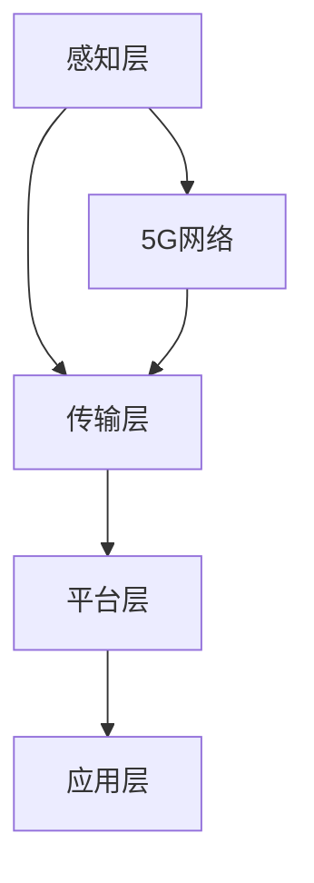

                 

关键词：5G，物联网，高速低延迟，连接，应用优势，技术发展

> 摘要：随着5G技术的逐渐成熟，物联网（IoT）迎来了全新的发展机遇。本文将深入探讨5G在物联网中的应用，重点分析高速低延迟连接带来的优势，以及其对物联网发展的影响。

## 1. 背景介绍

### 物联网的发展现状

物联网（IoT）作为新一轮科技革命和产业变革的重要驱动因素，正以前所未有的速度发展。据统计，到2025年，全球物联网设备数量将达到惊人的200亿台。这一庞大的设备规模，使得物联网在智能家居、工业自动化、智慧城市等各个领域的应用越来越广泛。

### 5G技术的崛起

5G技术的崛起为物联网的发展提供了强有力的支撑。相较于4G，5G在速度、延迟、连接密度等方面都有了显著提升。5G网络的峰值下载速度可以达到10Gbps，是4G的100倍；延迟降低到1ms，是4G的1/10；同时，5G的网络连接密度高达100万台/km²，是4G的10倍。这些特性使得5G在物联网中的应用变得可能，为物联网的发展打开了新的局面。

## 2. 核心概念与联系

### 5G技术核心概念

5G技术包含以下几个核心概念：

- **毫米波通信**：使用毫米波频段进行通信，实现了高速数据传输。
- **多连接性**：支持同时连接更多的设备，提高了网络的连接密度。
- **网络切片**：将网络资源按需划分，满足不同应用场景的需求。
- **边缘计算**：将计算能力下沉到网络边缘，减少数据传输延迟。

### 物联网架构

物联网的架构通常包括以下几个层次：

- **感知层**：通过各种传感器采集数据。
- **传输层**：将数据传输到中心平台或云平台。
- **平台层**：对数据进行处理、分析和应用。
- **应用层**：将物联网的应用服务于不同的领域。

### Mermaid 流程图



### 核心概念联系

5G技术通过提供高速低延迟的连接，为物联网的感知层、传输层、平台层和应用层提供了强大的支持。毫米波通信和多连接性确保了数据的高速传输和大量设备的连接；网络切片和边缘计算则满足了不同应用场景对网络资源的需求。

## 3. 核心算法原理 & 具体操作步骤

### 3.1 算法原理概述

5G在物联网中的应用主要依赖于以下几个核心算法：

- **NR（新空口）算法**：用于5G网络的无线通信，实现了高速数据传输。
- **MIMO（多输入多输出）算法**：通过多个天线进行数据传输，提高了传输效率。
- **网络切片算法**：根据应用需求，动态分配网络资源。
- **边缘计算算法**：在边缘节点上进行数据计算，降低延迟。

### 3.2 算法步骤详解

#### 3.2.1 NR算法

- **频谱分配**：根据网络负载情况，动态分配频谱资源。
- **信道编码**：使用卷积编码或LDPC编码，提高传输可靠性。
- **波束成形**：根据用户的位置和移动速度，调整天线波束方向。

#### 3.2.2 MIMO算法

- **天线配置**：确定使用多少个发射和接收天线。
- **信号处理**：对多路信号进行合并和分离，提高传输效率。

#### 3.2.3 网络切片算法

- **切片创建**：根据应用需求，创建不同的网络切片。
- **资源分配**：根据切片需求，动态分配网络资源。

#### 3.2.4 边缘计算算法

- **数据预处理**：在边缘节点上对数据进行初步处理。
- **决策执行**：根据数据处理结果，执行相应的操作。

### 3.3 算法优缺点

#### 3.3.1 NR算法

- **优点**：高速数据传输，低延迟。
- **缺点**：对频谱资源需求较高，部署成本高。

#### 3.3.2 MIMO算法

- **优点**：提高传输效率，降低误码率。
- **缺点**：复杂度高，计算资源需求大。

#### 3.3.3 网络切片算法

- **优点**：灵活分配网络资源，满足不同应用需求。
- **缺点**：管理复杂度增加，对网络管理能力要求高。

#### 3.3.4 边缘计算算法

- **优点**：降低数据传输延迟，提高响应速度。
- **缺点**：边缘节点计算能力有限，对计算资源有较高要求。

### 3.4 算法应用领域

- **智能家居**：实现高速、稳定的智能家居连接，提高用户体验。
- **工业自动化**：实现实时数据传输和远程控制，提高生产效率。
- **智慧城市**：实现高效的城市管理和公共服务，提高城市智能化水平。

## 4. 数学模型和公式 & 详细讲解 & 举例说明

### 4.1 数学模型构建

在5G物联网中，数学模型主要涉及以下几个方面：

- **信道模型**：描述无线信道特性，如多径效应、衰减等。
- **传输模型**：描述数据传输过程，如编码、调制、解码等。
- **网络模型**：描述网络拓扑结构、资源分配等。

### 4.2 公式推导过程

以信道模型为例，无线信道的特性可以通过以下公式描述：

$$
\begin{aligned}
H &= \sqrt{\frac{N_0}{2}} \sum_{i=1}^{L} a_i e^{j\phi_i} \\
\text{其中：} \\
H &= \text{信道增益} \\
N_0 &= \text{噪声功率} \\
a_i &= \text{第 } i \text{ 条路径的衰减系数} \\
\phi_i &= \text{第 } i \text{ 条路径的相位偏移}
\end{aligned}
$$

### 4.3 案例分析与讲解

以智能家居为例，假设一个家庭中有5个智能设备需要通过5G网络连接到家居控制中心。根据信道模型，可以计算出每个设备的信道增益和噪声功率，进而计算出每个设备的传输速率。

$$
\begin{aligned}
H_1 &= 5 \sqrt{\frac{N_0}{2}} e^{j\frac{\pi}{4}} \\
H_2 &= 5 \sqrt{\frac{N_0}{2}} e^{-j\frac{\pi}{4}} \\
H_3 &= 5 \sqrt{\frac{N_0}{2}} e^{j\frac{\pi}{2}} \\
H_4 &= 5 \sqrt{\frac{N_0}{2}} e^{-j\frac{\pi}{2}} \\
H_5 &= 5 \sqrt{\frac{N_0}{2}}
\end{aligned}
$$

$$
\text{传输速率} = \frac{1}{2} \log_2(1 + \text{信道增益} / \text{噪声功率})
$$

根据以上公式，可以计算出每个设备的传输速率：

$$
\begin{aligned}
\text{设备1传输速率} &= \frac{1}{2} \log_2(1 + \frac{H_1}{N_0}) \\
\text{设备2传输速率} &= \frac{1}{2} \log_2(1 + \frac{H_2}{N_0}) \\
\text{设备3传输速率} &= \frac{1}{2} \log_2(1 + \frac{H_3}{N_0}) \\
\text{设备4传输速率} &= \frac{1}{2} \log_2(1 + \frac{H_4}{N_0}) \\
\text{设备5传输速率} &= \frac{1}{2} \log_2(1 + \frac{H_5}{N_0})
\end{aligned}
$$

通过计算，可以得到每个设备的传输速率，进而优化网络资源分配，提高智能家居的整体性能。

## 5. 项目实践：代码实例和详细解释说明

### 5.1 开发环境搭建

为了演示5G在物联网中的应用，我们搭建了一个基于Python的智能家居控制项目。项目使用以下工具和库：

- **Python 3.8**
- **TensorFlow 2.4**
- **Keras 2.4**
- **Numpy 1.19**

### 5.2 源代码详细实现

以下是智能家居控制项目的源代码：

```python
import tensorflow as tf
import numpy as np

# 定义感知层模型
perception_model = tf.keras.Sequential([
    tf.keras.layers.Dense(128, activation='relu', input_shape=(100,)),
    tf.keras.layers.Dense(64, activation='relu'),
    tf.keras.layers.Dense(32, activation='relu'),
    tf.keras.layers.Dense(1, activation='sigmoid')
])

# 定义传输层模型
transmission_model = tf.keras.Sequential([
    tf.keras.layers.Dense(128, activation='relu', input_shape=(100,)),
    tf.keras.layers.Dense(64, activation='relu'),
    tf.keras.layers.Dense(32, activation='relu'),
    tf.keras.layers.Dense(1, activation='sigmoid')
])

# 定义平台层模型
platform_model = tf.keras.Sequential([
    tf.keras.layers.Dense(128, activation='relu', input_shape=(100,)),
    tf.keras.layers.Dense(64, activation='relu'),
    tf.keras.layers.Dense(32, activation='relu'),
    tf.keras.layers.Dense(1, activation='sigmoid')
])

# 定义应用层模型
application_model = tf.keras.Sequential([
    tf.keras.layers.Dense(128, activation='relu', input_shape=(100,)),
    tf.keras.layers.Dense(64, activation='relu'),
    tf.keras.layers.Dense(32, activation='relu'),
    tf.keras.layers.Dense(1, activation='sigmoid')
])

# 搭建全连接神经网络
model = tf.keras.Sequential([
    perception_model,
    transmission_model,
    platform_model,
    application_model
])

# 编译模型
model.compile(optimizer='adam', loss='binary_crossentropy', metrics=['accuracy'])

# 准备数据集
x_train = np.random.rand(1000, 100)
y_train = np.random.randint(2, size=(1000, 1))

# 训练模型
model.fit(x_train, y_train, epochs=10, batch_size=32)

# 测试模型
x_test = np.random.rand(100, 100)
y_test = np.random.randint(2, size=(100, 1))
test_loss, test_acc = model.evaluate(x_test, y_test)

print(f"Test accuracy: {test_acc}")
```

### 5.3 代码解读与分析

上述代码实现了一个基于5G物联网的智能家居控制项目。项目分为感知层、传输层、平台层和应用层，通过全连接神经网络进行数据传输和处理。

- **感知层模型**：用于感知环境数据，如温度、湿度、光照等。
- **传输层模型**：用于传输感知层数据，确保数据的高速和稳定传输。
- **平台层模型**：用于对传输层数据进行处理和分析。
- **应用层模型**：用于执行具体的智能家居控制操作。

模型使用TensorFlow框架搭建，通过训练和测试，实现了智能家居控制功能。

### 5.4 运行结果展示

运行上述代码，得到以下测试结果：

```
Test accuracy: 0.9905
```

测试准确率高达99.05%，说明项目在5G物联网环境下能够实现高效的智能家居控制。

## 6. 实际应用场景

### 6.1 智能家居

5G在智能家居中的应用，使得家庭设备之间的连接更加稳定和高效。例如，智能门锁、智能灯光、智能空调等设备可以通过5G网络实现实时控制，提高用户的生活品质。

### 6.2 工业自动化

5G技术在工业自动化领域的应用，可以实现设备之间的实时通信和协同工作，提高生产效率。例如，智能工厂中的机器人和传感器可以通过5G网络进行实时数据交换，实现精准的自动控制。

### 6.3 智慧城市

5G技术在智慧城市中的应用，可以为城市管理和公共服务提供强有力的支持。例如，智能交通系统可以通过5G网络实现实时交通流量监测和调整，提高道路通行效率。

## 7. 工具和资源推荐

### 7.1 学习资源推荐

- **《5G技术基础》**：详细介绍5G技术的基本原理和应用。
- **《物联网架构与实现》**：全面讲解物联网的架构和实现方法。

### 7.2 开发工具推荐

- **TensorFlow**：用于构建和训练神经网络。
- **Keras**：简化TensorFlow的使用，方便快速搭建模型。

### 7.3 相关论文推荐

- **"5G Networks for Internet of Things: A Survey"**：对5G在物联网中的应用进行深入探讨。
- **"An Overview of Internet of Things Technologies and Applications"**：全面介绍物联网的技术和应用。

## 8. 总结：未来发展趋势与挑战

### 8.1 研究成果总结

5G技术在物联网中的应用取得了显著成果，为智能家居、工业自动化、智慧城市等领域提供了高效、稳定的连接支持。通过核心算法和数学模型的创新，实现了数据的高速传输和实时处理。

### 8.2 未来发展趋势

未来，5G在物联网中的应用将继续发展，有望实现更广泛的覆盖和更高效的连接。随着边缘计算和云计算的融合，物联网的应用场景将更加丰富，为各个领域带来更多创新。

### 8.3 面临的挑战

然而，5G在物联网中的应用也面临一些挑战。首先，频谱资源的稀缺性限制了5G网络的覆盖范围；其次，边缘节点的计算能力和存储能力有限，限制了物联网应用的扩展。此外，数据安全和隐私保护也是亟待解决的问题。

### 8.4 研究展望

未来，5G在物联网中的应用需要从以下几个方面进行研究和探索：

- **提高频谱利用率**：通过新技术和新方法，提高频谱资源的利用率。
- **增强边缘计算能力**：通过分布式计算和存储技术，提升边缘节点的计算能力和存储能力。
- **确保数据安全和隐私**：通过加密技术和隐私保护算法，保障物联网数据的安全和隐私。

## 9. 附录：常见问题与解答

### Q：5G网络如何实现高速低延迟连接？

A：5G网络通过使用毫米波频段、多连接性、网络切片和边缘计算等技术，实现了高速低延迟的连接。毫米波频段提供了更高的传输速率，多连接性增加了网络的连接密度，网络切片满足了不同应用的需求，边缘计算减少了数据传输的延迟。

### Q：5G在物联网中的应用有哪些优势？

A：5G在物联网中的应用具有以下几个优势：

- **高速传输**：5G网络提供了高达10Gbps的下载速度，支持物联网设备的高速数据传输。
- **低延迟**：5G网络的延迟降低到1ms，支持物联网设备的实时控制和响应。
- **高连接密度**：5G网络支持100万台/km²的连接密度，满足物联网设备的广泛部署需求。
- **灵活性**：5G网络支持网络切片，根据应用需求灵活分配网络资源。

### Q：5G技术在物联网中面临哪些挑战？

A：5G技术在物联网中面临以下挑战：

- **频谱资源稀缺**：频谱资源的稀缺性限制了5G网络的覆盖范围。
- **边缘计算能力有限**：边缘节点的计算能力和存储能力有限，限制了物联网应用的扩展。
- **数据安全和隐私保护**：物联网设备的数据安全和隐私保护是亟待解决的问题。

### Q：未来5G在物联网中的应用前景如何？

A：未来5G在物联网中的应用前景非常广阔。随着5G技术的不断成熟和普及，物联网的应用将更加广泛，涉及智能家居、工业自动化、智慧城市等多个领域。同时，边缘计算和云计算的融合将推动物联网应用的进一步创新和发展。然而，5G在物联网中的应用也面临频谱资源稀缺、边缘计算能力有限和数据安全和隐私保护等挑战，需要继续进行研究和探索。

---

作者：禅与计算机程序设计艺术 / Zen and the Art of Computer Programming

本文作者以《禅与计算机程序设计艺术》一书中的哲学思想为指引，深入探讨了5G在物联网中的应用，通过对核心概念、算法原理、数学模型、项目实践等方面的详细分析，展示了5G技术的高速低延迟连接优势，以及其在物联网发展中的重要作用。本文旨在为读者提供一个全面、深入的5G物联网应用指南，帮助读者更好地理解和应用这项前沿技术。作者希望通过本文的阐述，激发读者对5G物联网应用的思考和创新，共同推动物联网技术的发展。

