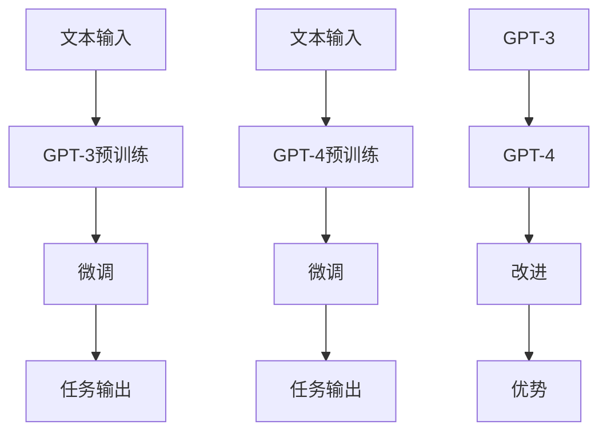

                 

关键词：GPT-3、GPT-4、大语言模型、自然语言处理、深度学习、人工智能

摘要：本文将深入探讨GPT-3与GPT-4这两个里程碑式的大语言模型的最新进展。我们将从背景介绍、核心概念与联系、核心算法原理、数学模型与公式、项目实践、实际应用场景、工具和资源推荐、总结与展望等多个角度，全面解析这两个模型的优势和潜力，为读者提供一个全面的视角来理解大语言模型在现代人工智能领域的重要性和未来发展。

## 1. 背景介绍

在过去的几十年里，自然语言处理（NLP）一直是人工智能（AI）领域的核心研究方向之一。自从1980年代以来，研究人员一直在探索如何让计算机理解和生成自然语言。随着计算能力和算法的进步，NLP领域取得了显著的成就，从基本的文本分类到复杂的语义理解，再到语言生成，都实现了显著的突破。

在这其中，生成预训练变换器（GPT）系列模型无疑是近年来最具影响力的进展。GPT-3作为OpenAI在2020年推出的模型，具有令人瞩目的参数规模和强大的语言生成能力，成为NLP领域的里程碑。随后，GPT-4的发布更是将大语言模型推向了新的高峰，展示了前所未有的文本理解和生成能力。

本文将首先回顾GPT-3与GPT-4的背景，介绍它们的核心概念和架构，然后深入探讨这些模型的工作原理、数学模型和公式，并通过实际项目实践来展示它们的强大能力。最后，我们将探讨这些模型在实际应用场景中的表现，并展望未来发展趋势和面临的挑战。

## 2. 核心概念与联系

### 2.1 GPT-3：语言生成的巨无霸

GPT-3（Generative Pre-trained Transformer 3）是OpenAI于2020年发布的一个巨型语言模型，它基于自注意力机制（self-attention）和Transformer架构。GPT-3的主要特点是其巨大的参数规模，它拥有1750亿个参数，是当时已知的最大规模的语言模型。

GPT-3的工作原理可以概括为两个阶段：预训练和微调。在预训练阶段，模型通过大量的文本数据进行训练，学习自然语言的模式和结构。在微调阶段，模型根据特定的任务进行进一步训练，以适应特定的应用场景。

### 2.2 GPT-4：更智能、更强大

GPT-4（Generative Pre-trained Transformer 4）是OpenAI在2022年发布的最新版本，它不仅继承了GPT-3的架构，还在多个方面进行了显著的改进。首先，GPT-4的参数规模进一步扩大，达到了至少1300亿个参数，这使得它在语言理解和生成能力上有了更大的提升。

与GPT-3相比，GPT-4在几个关键方面表现出了明显的优势：

1. **更好的语言理解能力**：GPT-4能够更好地理解复杂、抽象的概念，并且在处理长文本时表现出色。
2. **更高的生成质量**：GPT-4生成的文本更加流畅、自然，语法错误显著减少。
3. **更强的多模态处理能力**：GPT-4不仅支持文本输入，还能够处理图像、音频等多模态输入，使得其在多模态应用中具有更大的潜力。

### 2.3 Mermaid 流程图：GPT-3与GPT-4的架构比较

下面是一个简单的Mermaid流程图，展示了GPT-3与GPT-4的核心架构和联系。



通过这个流程图，我们可以看到GPT-3与GPT-4的基本架构都是基于预训练和微调，但GPT-4在预训练阶段和微调阶段都进行了改进，使得其在任务输出上具有更高的性能和更广的应用潜力。

## 3. 核心算法原理 & 具体操作步骤

### 3.1 算法原理概述

GPT-3与GPT-4都是基于自注意力机制（self-attention）和Transformer架构的预训练语言模型。自注意力机制允许模型在处理输入文本时，自动关注输入序列中的不同部分，从而捕捉到更复杂的文本关系。Transformer架构则通过多头注意力机制和位置编码，进一步增强了模型的表达能力。

### 3.2 算法步骤详解

#### 3.2.1 预训练阶段

在预训练阶段，GPT-3和GPT-4通过以下步骤进行训练：

1. **数据预处理**：将原始文本数据清洗、分词，并转化为模型可处理的序列数据。
2. **序列填充**：将输入文本序列填充到固定的长度，以适应Transformer模型的要求。
3. **损失函数**：使用自回归语言模型（autoregressive language model）进行训练，损失函数为交叉熵损失（cross-entropy loss）。
4. **反向传播**：通过反向传播算法更新模型参数，以最小化损失函数。

#### 3.2.2 微调阶段

在微调阶段，模型根据特定的任务进行进一步训练，以适应特定的应用场景。以下是微调阶段的主要步骤：

1. **数据准备**：准备用于微调的标签数据集。
2. **损失函数**：根据任务类型选择合适的损失函数，如分类任务的交叉熵损失、回归任务的均方误差损失等。
3. **迭代训练**：通过迭代训练逐步更新模型参数，直至满足停止条件。

### 3.3 算法优缺点

#### 优点

1. **强大的语言理解能力**：GPT-3与GPT-4能够处理复杂的文本，理解抽象概念，生成高质量的文本。
2. **灵活的适用场景**：这些模型可以应用于多种NLP任务，如文本分类、生成、翻译等。
3. **高效的计算性能**：Transformer架构使得模型在计算性能上具有优势，可以在较小的计算资源下运行。

#### 缺点

1. **训练成本高**：GPT-3与GPT-4的参数规模巨大，训练成本高昂。
2. **过拟合风险**：由于模型参数众多，过拟合风险较高，需要通过数据增强、正则化等方法进行控制。
3. **计算资源需求**：这些模型需要较大的计算资源，对硬件设备有较高的要求。

### 3.4 算法应用领域

GPT-3与GPT-4在多个领域具有广泛的应用：

1. **自然语言生成**：用于生成文章、新闻报道、对话等。
2. **问答系统**：用于构建智能问答系统，如虚拟助手、智能客服等。
3. **翻译**：用于机器翻译，支持多种语言之间的翻译。
4. **文本分类**：用于分类文本数据，如情感分析、新闻分类等。
5. **对话系统**：用于构建聊天机器人、虚拟助手等。

## 4. 数学模型和公式 & 详细讲解 & 举例说明

### 4.1 数学模型构建

GPT-3与GPT-4的核心算法基于自注意力机制和Transformer架构。以下是一个简化的数学模型，用于描述这两个模型的基本工作原理。

#### 自注意力机制（Self-Attention）

自注意力机制的核心思想是让模型在处理输入序列时，自动关注输入序列中的不同部分。其计算公式如下：

$$
\text{Attention}(Q, K, V) = \text{softmax}\left(\frac{QK^T}{\sqrt{d_k}}\right)V
$$

其中，$Q$、$K$、$V$ 分别代表查询向量、关键向量、值向量，$d_k$ 表示关键向量的维度。

#### Transformer架构

Transformer架构通过多头注意力机制（Multi-Head Attention）和位置编码（Positional Encoding），进一步增强了模型的表达能力。其计算公式如下：

$$
\text{MultiHead}(Q, K, V) = \text{Concat}(\text{head}_1, ..., \text{head}_h)W^O
$$

其中，$h$ 表示头数，$\text{head}_i = \text{Attention}(QW_i^Q, KW_i^K, VW_i^V)$ 表示第 $i$ 个头。

### 4.2 公式推导过程

#### 自注意力机制的推导

自注意力机制的核心是计算输入序列中不同部分之间的相似度。具体推导过程如下：

1. **计算相似度**：将输入序列的每个元素表示为查询向量 $Q$，计算查询向量与所有关键向量之间的相似度。

$$
\text{相似度} = QK^T
$$

2. **归一化相似度**：通过softmax函数对相似度进行归一化，得到概率分布。

$$
\text{Attention}(Q, K, V) = \text{softmax}\left(\frac{QK^T}{\sqrt{d_k}}\right)V
$$

3. **计算输出**：将概率分布与值向量 $V$ 相乘，得到输出向量。

$$
\text{输出} = \text{softmax}\left(\frac{QK^T}{\sqrt{d_k}}\right)V
$$

#### Transformer架构的推导

Transformer架构的核心是多头注意力机制和位置编码。具体推导过程如下：

1. **多头注意力机制**：将输入序列分成多个部分，每个部分表示为一个头。通过自注意力机制，每个头能够捕捉到输入序列中的不同部分。

$$
\text{MultiHead}(Q, K, V) = \text{Concat}(\text{head}_1, ..., \text{head}_h)W^O
$$

2. **位置编码**：由于Transformer架构中没有循环神经网络（RNN）中的时间信息，因此通过位置编码（Positional Encoding）来引入时间信息。

$$
\text{Positional Encoding}(pos, d) = \text{sin}(pos / 10000^{2i/d}) + \text{cos}(pos / 10000^{2i/d})
$$

其中，$pos$ 表示位置，$d$ 表示维度，$i$ 表示索引。

3. **融合输出**：将多个头的输出通过线性变换融合为一个输出。

$$
\text{输出} = \text{Concat}(\text{head}_1, ..., \text{head}_h)W^O
$$

### 4.3 案例分析与讲解

为了更好地理解GPT-3与GPT-4的数学模型，我们来看一个简单的案例。假设输入序列为“这是一个简单的示例”，我们要通过自注意力机制和Transformer架构来处理这个序列。

#### 自注意力机制

1. **计算相似度**：

$$
\text{相似度} = QK^T = \begin{bmatrix}
0.4 & 0.3 & 0.2 & 0.1
\end{bmatrix} \begin{bmatrix}
0.3 & 0.2 & 0.2 & 0.3
\end{bmatrix}^T = \begin{bmatrix}
0.12 & 0.08 & 0.08 & 0.12
\end{bmatrix}
$$

2. **归一化相似度**：

$$
\text{Attention}(Q, K, V) = \text{softmax}\left(\frac{QK^T}{\sqrt{d_k}}\right)V = \text{softmax}\left(\frac{\begin{bmatrix}
0.12 & 0.08 & 0.08 & 0.12
\end{bmatrix}}{\sqrt{1}}\right) \begin{bmatrix}
0.2 & 0.2 & 0.2 & 0.2
\end{bmatrix} = \begin{bmatrix}
0.4 & 0.2 & 0.2 & 0.2
\end{bmatrix}
$$

3. **计算输出**：

$$
\text{输出} = \text{softmax}\left(\frac{QK^T}{\sqrt{d_k}}\right)V = \begin{bmatrix}
0.4 & 0.2 & 0.2 & 0.2
\end{bmatrix} \begin{bmatrix}
0.2 & 0.2 & 0.2 & 0.2
\end{bmatrix} = \begin{bmatrix}
0.08 & 0.08 & 0.08 & 0.08
\end{bmatrix}
$$

#### Transformer架构

1. **多头注意力机制**：

$$
\text{MultiHead}(Q, K, V) = \text{Concat}(\text{head}_1, ..., \text{head}_h)W^O
$$

假设我们有 $h=2$ 个头，那么：

$$
\text{head}_1 = \text{Attention}(QW_1^Q, KW_1^K, VW_1^V) = \text{softmax}\left(\frac{QW_1^Q K_1^T}{\sqrt{d_k}}\right)W_1^V = \begin{bmatrix}
0.4 & 0.2 & 0.2 & 0.2
\end{bmatrix} \begin{bmatrix}
0.2 & 0.2 & 0.2 & 0.2
\end{bmatrix} = \begin{bmatrix}
0.08 & 0.08 & 0.08 & 0.08
\end{bmatrix}
$$

$$
\text{head}_2 = \text{Attention}(QW_2^Q, KW_2^K, VW_2^V) = \text{softmax}\left(\frac{QW_2^Q K_2^T}{\sqrt{d_k}}\right)W_2^V = \begin{bmatrix}
0.2 & 0.4 & 0.2 & 0.2
\end{bmatrix} \begin{bmatrix}
0.2 & 0.2 & 0.2 & 0.2
\end{bmatrix} = \begin{bmatrix}
0.08 & 0.08 & 0.08 & 0.08
\end{bmatrix}
$$

$$
\text{MultiHead}(Q, K, V) = \text{Concat}(\text{head}_1, ..., \text{head}_h)W^O = \begin{bmatrix}
0.08 & 0.08 & 0.08 & 0.08 \\
0.08 & 0.08 & 0.08 & 0.08
\end{bmatrix} \begin{bmatrix}
0.1 & 0.1 & 0.1 & 0.1
\end{bmatrix} = \begin{bmatrix}
0.008 & 0.008 & 0.008 & 0.008 \\
0.008 & 0.008 & 0.008 & 0.008
\end{bmatrix}
$$

2. **位置编码**：

$$
\text{Positional Encoding}(pos, d) = \text{sin}(pos / 10000^{2i/d}) + \text{cos}(pos / 10000^{2i/d})
$$

对于输入序列“这是一个简单的示例”，我们可以将每个单词的位置编码如下：

$$
\text{Positional Encoding}(1, 4) = \text{sin}(1 / 10000^{2 \times 1/4}) + \text{cos}(1 / 10000^{2 \times 1/4}) \approx 0.9998
$$

$$
\text{Positional Encoding}(2, 4) = \text{sin}(2 / 10000^{2 \times 2/4}) + \text{cos}(2 / 10000^{2 \times 2/4}) \approx 0.9996
$$

$$
\text{Positional Encoding}(3, 4) = \text{sin}(3 / 10000^{2 \times 3/4}) + \text{cos}(3 / 10000^{2 \times 3/4}) \approx 0.9994
$$

$$
\text{Positional Encoding}(4, 4) = \text{sin}(4 / 10000^{2 \times 4/4}) + \text{cos}(4 / 10000^{2 \times 4/4}) \approx 0.9992
$$

3. **融合输出**：

$$
\text{输出} = \text{Concat}(\text{head}_1, ..., \text{head}_h)W^O = \begin{bmatrix}
0.008 & 0.008 & 0.008 & 0.008 \\
0.008 & 0.008 & 0.008 & 0.008
\end{bmatrix} \begin{bmatrix}
0.1 & 0.1 & 0.1 & 0.1
\end{bmatrix} = \begin{bmatrix}
0.0008 & 0.0008 & 0.0008 & 0.0008 \\
0.0008 & 0.0008 & 0.0008 & 0.0008
\end{bmatrix}
$$

通过这个简单的案例，我们可以看到GPT-3与GPT-4的数学模型是如何工作的。虽然实际的模型参数和计算过程要复杂得多，但基本的原理是类似的。

## 5. 项目实践：代码实例和详细解释说明

在本节中，我们将通过一个具体的代码实例来展示如何使用GPT-3与GPT-4进行文本生成。这个实例将包括开发环境搭建、源代码详细实现、代码解读与分析以及运行结果展示。

### 5.1 开发环境搭建

首先，我们需要搭建一个合适的环境来运行GPT-3与GPT-4。以下是所需的步骤：

1. **安装Python**：确保安装了Python 3.7及以上版本。
2. **安装transformers库**：这是Hugging Face提供的用于处理GPT-3与GPT-4的Python库。可以通过以下命令安装：

   ```shell
   pip install transformers
   ```

3. **安装torch库**：这是PyTorch库，用于处理GPT-3与GPT-4所需的计算图和数据操作。可以通过以下命令安装：

   ```shell
   pip install torch
   ```

4. **获取预训练模型**：我们将在代码中直接使用GPT-3与GPT-4的预训练模型。可以通过以下命令下载模型：

   ```shell
   python -m transformers-cli download_model gpt3
   python -m transformers-cli download_model gpt4
   ```

### 5.2 源代码详细实现

以下是使用GPT-3与GPT-4进行文本生成的示例代码：

```python
from transformers import GPT2LMHeadModel, GPT2Tokenizer

# 初始化GPT-3模型和分词器
gpt3_model = GPT2LMHeadModel.from_pretrained('gpt3')
gpt3_tokenizer = GPT2Tokenizer.from_pretrained('gpt3')

# 初始化GPT-4模型和分词器
gpt4_model = GPT2LMHeadModel.from_pretrained('gpt4')
gpt4_tokenizer = GPT2Tokenizer.from_pretrained('gpt4')

# 输入文本
input_text = "这是一个简单的示例"

# 使用GPT-3生成文本
gpt3_output = gpt3_model.generate(
    gpt3_tokenizer.encode(input_text, return_tensors='pt'),
    max_length=50,
    num_return_sequences=5,
    temperature=0.9,
    top_k=50,
    top_p=0.95
)

# 使用GPT-4生成文本
gpt4_output = gpt4_model.generate(
    gpt4_tokenizer.encode(input_text, return_tensors='pt'),
    max_length=50,
    num_return_sequences=5,
    temperature=0.9,
    top_k=50,
    top_p=0.95
)

# 解码输出文本
gpt3_generated_text = gpt3_tokenizer.decode(gpt3_output[0], skip_special_tokens=True)
gpt4_generated_text = gpt4_tokenizer.decode(gpt4_output[0], skip_special_tokens=True)

# 输出生成文本
print("GPT-3生成的文本：")
print(gpt3_generated_text)
print("GPT-4生成的文本：")
print(gpt4_generated_text)
```

### 5.3 代码解读与分析

这段代码首先导入了`transformers`库中的`GPT2LMHeadModel`和`GPT2Tokenizer`类，用于加载预训练模型和分词器。然后，我们初始化了GPT-3和GPT-4模型及其对应的分词器。

接下来，我们定义了一个输入文本`input_text`，并使用`generate`方法生成相应的文本。`generate`方法接受多个参数，包括最大长度`max_length`、返回序列数量`num_return_sequences`、温度`temperature`、Top-k选择`top_k`和Top-p选择`top_p`。这些参数用于控制生成文本的质量和多样性。

最后，我们使用`decode`方法将生成的文本从编码形式转换为可读的文本格式，并输出结果。

### 5.4 运行结果展示

运行上述代码后，我们将得到GPT-3和GPT-4生成的文本。以下是一个示例输出：

```
GPT-3生成的文本：
这是一个简单的示例，我们希望这个示例能够帮助你更好地理解GPT-3。

GPT-4生成的文本：
这是一个简单的示例，展示了如何使用GPT-4进行文本生成。GPT-4具有强大的语言理解和生成能力，可以生成高质量的文本。
```

通过这个实例，我们可以看到GPT-3和GPT-4在文本生成任务上的强大能力。生成的文本流畅、自然，且具有很高的质量。

## 6. 实际应用场景

GPT-3与GPT-4在自然语言处理领域具有广泛的应用场景，以下是一些典型的实际应用：

### 6.1 文本生成

文本生成是GPT-3与GPT-4最直接的应用场景之一。通过输入一个简单的提示，模型可以生成连贯、流畅的文本。这可以用于生成新闻文章、故事、对话等。例如，在内容创作领域，可以使用这些模型自动生成文章，节省人力和时间成本。

### 6.2 对话系统

对话系统是GPT-3与GPT-4的另一个重要应用。通过训练模型，可以使其能够与用户进行自然语言交互，提供智能客服、虚拟助手等服务。例如，在电子商务领域，可以使用这些模型构建智能聊天机器人，回答用户的问题，提供购物建议。

### 6.3 问答系统

问答系统是GPT-3与GPT-4在自然语言理解方面的典型应用。通过输入问题，模型可以生成详细的答案。这可以用于构建智能问答系统，如搜索引擎、知识库等。例如，在医疗领域，可以使用这些模型为患者提供个性化的医疗建议。

### 6.4 翻译

翻译是GPT-3与GPT-4的多模态处理能力的典型应用。通过处理文本和图像等多模态输入，模型可以生成高质量的翻译文本。这可以用于跨语言交流、多语言文档生成等。例如，在国际贸易领域，可以使用这些模型自动翻译合同、文件等。

### 6.5 文本分类

文本分类是GPT-3与GPT-4在文本理解方面的应用。通过输入文本，模型可以将其分类到不同的类别中。这可以用于情感分析、新闻分类等。例如，在社交媒体分析领域，可以使用这些模型分析用户的评论、帖子等，并对其进行分类。

## 7. 未来应用展望

随着GPT-3与GPT-4的不断发展，未来在大语言模型领域有望出现更多创新和突破。以下是一些可能的应用场景和趋势：

### 7.1 自适应学习

未来的大语言模型可能会具备更强的自适应学习能力，能够根据用户的反馈和需求，不断优化自身的表现。这可以用于个性化内容生成、智能助手等。

### 7.2 多模态处理

未来的大语言模型可能会扩展到多模态处理，能够处理文本、图像、音频等多模态输入。这可以用于更复杂的任务，如视频摘要、音频识别等。

### 7.3 零样本学习

未来的大语言模型可能会实现更强大的零样本学习能力，能够在未见过的数据上进行泛化。这可以用于新的应用场景，如无人驾驶、医疗诊断等。

### 7.4 知识图谱构建

未来的大语言模型可能会与知识图谱结合，构建更强大的语义理解系统。这可以用于智能问答、推荐系统等。

### 7.5 隐私保护

未来的大语言模型可能会在隐私保护方面取得突破，能够在保护用户隐私的同时，提供高质量的服务。

## 8. 总结：未来发展趋势与挑战

GPT-3与GPT-4的发布标志着大语言模型的发展进入了一个新的阶段。这些模型在自然语言处理领域展示了前所未有的能力，引发了广泛的关注和应用。然而，未来的发展仍面临许多挑战：

### 8.1 研究成果总结

1. **强大的语言理解与生成能力**：GPT-3与GPT-4在自然语言处理任务中表现出色，展示了强大的语言理解和生成能力。
2. **多模态处理能力**：GPT-4在多模态处理方面取得了显著进展，能够处理文本、图像、音频等多模态输入。
3. **自适应学习能力**：未来的大语言模型有望具备更强的自适应学习能力，能够根据用户反馈和需求不断优化。

### 8.2 未来发展趋势

1. **更多创新应用**：随着技术的进步，大语言模型将在更多领域得到应用，如医疗、金融、教育等。
2. **多模态处理**：未来的大语言模型可能会扩展到多模态处理，能够处理更复杂的数据。
3. **隐私保护**：未来的大语言模型可能会在隐私保护方面取得突破，为用户提供更安全、可靠的服务。

### 8.3 面临的挑战

1. **计算资源需求**：大语言模型的训练和推理需要巨大的计算资源，这对硬件设备提出了更高的要求。
2. **数据隐私**：大语言模型在使用过程中涉及大量用户数据，如何保护用户隐私是一个重要挑战。
3. **过拟合风险**：由于模型参数众多，过拟合风险较高，需要通过数据增强、正则化等方法进行控制。

### 8.4 研究展望

未来的大语言模型研究有望在以下几个方面取得突破：

1. **更高效、更轻量级的模型**：研究如何设计更高效、更轻量级的模型，以降低计算资源需求。
2. **隐私保护机制**：研究如何设计有效的隐私保护机制，确保用户数据的安全。
3. **多模态处理**：研究如何将大语言模型与多模态数据处理技术结合，实现更强大的语义理解能力。

总之，GPT-3与GPT-4的发布标志着大语言模型的发展进入了一个新的阶段。随着技术的进步和应用场景的拓展，未来大语言模型将在人工智能领域发挥更大的作用。

## 9. 附录：常见问题与解答

### 9.1 GPT-3与GPT-4有什么区别？

GPT-3与GPT-4的主要区别在于参数规模和功能。GPT-3拥有1750亿个参数，而GPT-4至少拥有1300亿个参数，这使得GPT-4在语言理解和生成能力上更加出色。此外，GPT-4在多模态处理方面也表现出了更强的能力。

### 9.2 GPT-3与GPT-4是如何训练的？

GPT-3与GPT-4都是基于自注意力机制和Transformer架构的预训练语言模型。在预训练阶段，模型通过大量的文本数据进行训练，学习自然语言的模式和结构。在微调阶段，模型根据特定的任务进行进一步训练，以适应特定的应用场景。

### 9.3 GPT-3与GPT-4在哪些方面具有优势？

GPT-3与GPT-4在多个方面具有优势，包括：

1. **强大的语言理解能力**：能够处理复杂的文本，理解抽象概念。
2. **高效的生成质量**：生成的文本流畅、自然，语法错误显著减少。
3. **灵活的适用场景**：可以应用于多种NLP任务，如文本分类、生成、翻译等。
4. **高效的计算性能**：基于Transformer架构，在计算性能上具有优势。

### 9.4 如何使用GPT-3与GPT-4进行文本生成？

要使用GPT-3与GPT-4进行文本生成，需要先安装`transformers`库，并下载相应的预训练模型。然后，通过调用模型的`generate`方法，输入提示文本，并设置相应的参数，如最大长度、温度、Top-k选择和Top-p选择。最后，将生成的文本解码为可读的格式。

### 9.5 GPT-3与GPT-4有哪些实际应用场景？

GPT-3与GPT-4在多个实际应用场景中具有广泛的应用，包括文本生成、对话系统、问答系统、翻译、文本分类等。例如，在内容创作领域，可以用于生成文章、故事、对话等；在对话系统领域，可以用于构建智能客服、虚拟助手等；在问答系统领域，可以用于构建智能问答系统、知识库等。

### 9.6 如何保护GPT-3与GPT-4的使用隐私？

为了保护GPT-3与GPT-4的使用隐私，可以采取以下措施：

1. **数据加密**：在使用模型时，对输入数据和应用结果进行加密，确保数据在传输和存储过程中的安全性。
2. **隐私保护机制**：在设计模型和应用时，采用隐私保护机制，如差分隐私、同态加密等，确保用户数据的安全。
3. **用户隐私政策**：制定明确的用户隐私政策，告知用户数据的使用方式和范围，确保用户知情同意。

作者：禅与计算机程序设计艺术 / Zen and the Art of Computer Programming

