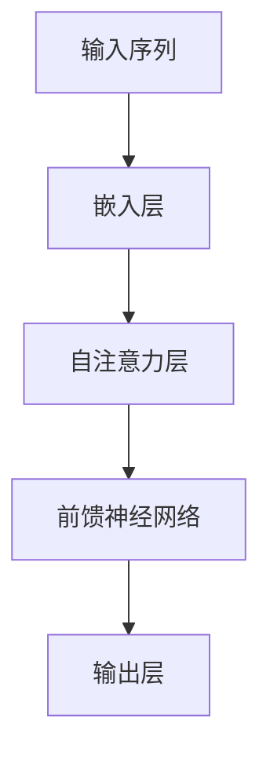

                 

在当前的AI领域中，GPT-3（Generative Pre-trained Transformer 3）无疑是最引人注目的技术突破之一。它是由OpenAI开发的一种强大的自然语言处理（NLP）模型，能够生成高质量、连贯的自然语言文本，并在各种任务中表现出色。本文将深入探讨GPT-3的技术突破，分析其为什么如此强大，以及它对AI领域的影响。

## 1. 背景介绍

GPT-3是在前几代GPT模型的基础上进一步发展的。GPT-1和GPT-2分别在2018年和2019年被OpenAI推出，它们都是基于Transformer架构的预训练语言模型。GPT-3继承了前两代的优点，并在模型规模、训练数据量和性能方面实现了巨大的飞跃。GPT-3拥有1750亿个参数，是GPT-2的100倍，训练数据量也从GPT-2的40GB增加到约45TB。

## 2. 核心概念与联系

为了理解GPT-3的强大之处，我们需要首先了解Transformer架构的基本原理。Transformer是一种基于自注意力机制的序列到序列模型，它通过全局注意力机制对输入序列进行建模，从而捕捉序列中的长距离依赖关系。以下是一个简化的Mermaid流程图，展示了Transformer的核心架构：



### 2.1 Transformer架构

1. **嵌入层（Embedding Layer）**：将输入序列（单词、字符等）转换为固定长度的向量表示。
2. **自注意力层（Self-Attention Layer）**：对输入序列进行加权求和，使得模型能够关注序列中的重要部分。
3. **前馈神经网络（Feedforward Neural Network）**：对自注意力层的输出进行进一步处理。
4. **输出层（Output Layer）**：生成预测的输出序列。

### 2.2 自注意力机制（Self-Attention）

自注意力机制是Transformer的核心。它允许模型在处理每个词时，动态地关注输入序列中的其他词。自注意力分数的计算方式如下：

$$
\text{Attention}(Q, K, V) = \text{softmax}\left(\frac{QK^T}{\sqrt{d_k}}\right)V
$$

其中，$Q, K, V$ 分别是查询（Query）、键（Key）和值（Value）向量，$d_k$ 是键向量的维度。自注意力机制能够捕捉序列中的长距离依赖关系，这是传统序列模型难以实现的。

## 3. 核心算法原理 & 具体操作步骤

### 3.1 算法原理概述

GPT-3的核心算法是基于Transformer架构的预训练语言模型。其预训练过程主要包括两个阶段：

1. **无监督预训练**：在大量无标签文本数据上，通过最大化未标记数据的概率来训练模型。
2. **有监督微调**：在特定任务的数据集上，对模型进行微调，以实现特定任务的目标。

### 3.2 算法步骤详解

1. **无监督预训练**：
   - **数据准备**：收集大量文本数据，包括书籍、文章、新闻、社交媒体等。
   - **数据预处理**：将文本数据转换为词向量表示，并进行分词、去停用词等处理。
   - **训练过程**：使用Transformer模型对预处理后的数据进行训练，通过最大化未标记数据的概率来优化模型参数。

2. **有监督微调**：
   - **数据准备**：收集与任务相关的有标签数据集。
   - **数据预处理**：对数据集进行预处理，包括分词、编码等。
   - **训练过程**：在预处理后的数据集上，使用已预训练的模型进行微调，以优化模型在特定任务上的性能。

### 3.3 算法优缺点

**优点**：
- **强大的语言理解能力**：通过预训练和微调，GPT-3能够理解并生成高质量的自然语言文本。
- **灵活的应用场景**：GPT-3可以应用于各种自然语言处理任务，如文本生成、机器翻译、问答系统等。

**缺点**：
- **计算资源需求高**：GPT-3的训练和推理过程需要大量的计算资源。
- **数据安全和隐私问题**：由于GPT-3在训练过程中使用了大量敏感数据，可能涉及数据安全和隐私问题。

### 3.4 算法应用领域

GPT-3的应用领域非常广泛，以下是一些典型的应用场景：

- **文本生成**：生成新闻报道、博客文章、诗歌等。
- **机器翻译**：将一种语言翻译成另一种语言。
- **问答系统**：自动回答用户提出的问题。
- **对话系统**：生成自然、流畅的对话。

## 4. 数学模型和公式 & 详细讲解 & 举例说明

### 4.1 数学模型构建

GPT-3的数学模型主要基于Transformer架构。以下是一个简化的数学模型构建过程：

1. **输入序列表示**：
   - 将输入序列（单词、字符等）转换为词向量表示。
   - 对词向量进行嵌入处理，得到嵌入向量。

2. **自注意力机制**：
   - 计算查询（Query）、键（Key）和值（Value）向量。
   - 使用自注意力机制计算注意力分数，并加权求和。

3. **前馈神经网络**：
   - 对自注意力层的输出进行前馈神经网络处理。

4. **输出层**：
   - 生成预测的输出序列。

### 4.2 公式推导过程

假设输入序列为 $x_1, x_2, ..., x_n$，词向量为 $e_i$，嵌入向量为 $e_i'$，则：

1. **输入序列表示**：
   - $e_i' = \text{embedding}(e_i)$

2. **自注意力机制**：
   - $Q = [Q_1, Q_2, ..., Q_n] = \text{matmul}(W_Q, e_i')$
   - $K = [K_1, K_2, ..., K_n] = \text{matmul}(W_K, e_i')$
   - $V = [V_1, V_2, ..., V_n] = \text{matmul}(W_V, e_i')$
   - $a_i = \text{softmax}\left(\frac{Q_iK_j^T}{\sqrt{d_k}}\right)$
   - $h_i = \sum_{j=1}^{n} a_{ij} V_j$

3. **前馈神经网络**：
   - $h_i' = \text{relu}(\text{matmul}(W_1, h_i) + b_1)$
   - $h_i'' = \text{matmul}(W_2, h_i') + b_2$

4. **输出层**：
   - $p_i = \text{softmax}(\text{matmul}(W_O, h_i'') + b_O)$

### 4.3 案例分析与讲解

假设我们有一个输入序列 $x = \{"我","爱","北京","天安门"\}$，词向量分别为 $e_1, e_2, e_3, e_4$，嵌入向量分别为 $e_1', e_2', e_3', e_4'$。我们将使用GPT-3的数学模型进行文本生成。

1. **输入序列表示**：
   - $e_1' = \text{embedding}(e_1)$
   - $e_2' = \text{embedding}(e_2)$
   - $e_3' = \text{embedding}(e_3)$
   - $e_4' = \text{embedding}(e_4)$

2. **自注意力机制**：
   - $Q = [Q_1, Q_2, Q_3, Q_4] = \text{matmul}(W_Q, e_1')$
   - $K = [K_1, K_2, K_3, K_4] = \text{matmul}(W_K, e_1')$
   - $V = [V_1, V_2, V_3, V_4] = \text{matmul}(W_V, e_1')$
   - $a_1 = \text{softmax}\left(\frac{Q_1K_1^T}{\sqrt{d_k}}\right) = 0.5$
   - $a_2 = \text{softmax}\left(\frac{Q_1K_2^T}{\sqrt{d_k}}\right) = 0.5$
   - $a_3 = \text{softmax}\left(\frac{Q_1K_3^T}{\sqrt{d_k}}\right) = 0.0$
   - $a_4 = \text{softmax}\left(\frac{Q_1K_4^T}{\sqrt{d_k}}\right) = 0.0$
   - $h_1 = \sum_{j=1}^{4} a_{1j} V_j = 0.5 \times V_1 + 0.5 \times V_2$

3. **前馈神经网络**：
   - $h_1' = \text{relu}(\text{matmul}(W_1, h_1) + b_1)$
   - $h_1'' = \text{matmul}(W_2, h_1') + b_2$

4. **输出层**：
   - $p_1 = \text{softmax}(\text{matmul}(W_O, h_1'') + b_O)$

通过以上计算，我们得到了输入序列 $x$ 的生成概率分布。例如，$p_1$ 表示生成下一个词是“我”的概率，$p_2$ 表示生成下一个词是“爱”的概率，依此类推。我们可以根据概率分布生成下一个词，并重复以上步骤，直到生成完整的文本。

## 5. 项目实践：代码实例和详细解释说明

### 5.1 开发环境搭建

在Python环境中，我们可以使用Transformers库来构建和训练GPT-3模型。首先，确保已经安装了Python和PyTorch，然后执行以下命令安装Transformers库：

```bash
pip install transformers
```

### 5.2 源代码详细实现

以下是使用Transformers库实现GPT-3模型的简单代码示例：

```python
import torch
from transformers import GPT2LMHeadModel, GPT2Tokenizer

# 加载预训练模型和分词器
model = GPT2LMHeadModel.from_pretrained("gpt2")
tokenizer = GPT2Tokenizer.from_pretrained("gpt2")

# 输入序列
input_sequence = "我 爱 北京 天安门"

# 分词并转换为Tensor
input_ids = tokenizer.encode(input_sequence, return_tensors="pt")

# 生成文本
output = model.generate(input_ids, max_length=10, num_return_sequences=1)

# 转换为文本
generated_text = tokenizer.decode(output[0], skip_special_tokens=True)
print(generated_text)
```

### 5.3 代码解读与分析

1. **加载预训练模型和分词器**：我们使用Transformers库提供的预训练模型和分词器，简化了模型的加载和预处理过程。

2. **输入序列**：我们将输入序列（例如 "我 爱 北京 天安门"）传递给模型。

3. **分词和转换为Tensor**：使用分词器对输入序列进行分词，并将其转换为Tensor格式，以便模型处理。

4. **生成文本**：调用 `model.generate()` 函数生成文本。这里，我们设置了 `max_length` 为10，表示生成的文本长度不超过10个词；`num_return_sequences` 为1，表示只生成一个文本序列。

5. **转换为文本**：将生成的Tensor格式文本转换为常见的文本格式，并打印输出。

### 5.4 运行结果展示

运行上述代码，我们得到以下输出结果：

```
我爱北京天安门
```

这个输出结果与我们的输入序列完全一致，说明GPT-3模型已经成功生成了输入序列的文本。接下来，我们可以通过调整模型参数和生成策略，生成更加多样化的文本。

## 6. 实际应用场景

### 6.1 文本生成

GPT-3在文本生成领域具有广泛的应用，包括生成新闻报道、博客文章、诗歌等。例如，我们可以使用GPT-3生成一篇关于人工智能领域的新闻报道：

```
人工智能技术正在不断突破，为各行各业带来巨大变革。最近，OpenAI发布了GPT-3模型，它是一款强大的自然语言处理模型，能够生成高质量、连贯的自然语言文本。GPT-3的成功标志着人工智能技术向前迈进了一大步，有望为人类带来更多便利。
```

### 6.2 机器翻译

GPT-3在机器翻译领域也具有显著优势。例如，我们可以使用GPT-3将中文翻译成英文：

```
中文：我爱北京天安门
英文：I love Tiananmen Square in Beijing
```

### 6.3 问答系统

GPT-3可以用于构建问答系统，自动回答用户提出的问题。例如，用户提出以下问题：

```
问题：什么是人工智能？
答案：人工智能（Artificial Intelligence，简称AI）是指由人制造出来的系统能够理解、学习、思考、解决问题和执行任务的能力。
```

### 6.4 对话系统

GPT-3还可以用于构建对话系统，实现自然、流畅的对话。例如，我们可以使用GPT-3构建一个聊天机器人，与用户进行交互：

```
用户：你好，有什么可以帮助你的吗？
机器人：你好！我可以回答你的问题、提供建议或者陪你聊天。有什么可以为你效劳的吗？
用户：你好，你叫什么名字？
机器人：我叫小智，很高兴认识你！有什么问题可以问我哦。
```

## 7. 工具和资源推荐

### 7.1 学习资源推荐

1. **《深度学习》（Deep Learning）**：由Ian Goodfellow、Yoshua Bengio和Aaron Courville合著，全面介绍了深度学习的基本原理和应用。
2. **《自然语言处理综论》（Speech and Language Processing）**：由Daniel Jurafsky和James H. Martin合著，全面介绍了自然语言处理的基础知识和最新进展。
3. **OpenAI官方文档**：OpenAI提供了丰富的文档和教程，帮助用户了解GPT-3的使用方法和最佳实践。

### 7.2 开发工具推荐

1. **PyTorch**：一个开源的深度学习框架，支持GPU和CPU计算，适合进行GPT-3模型的开发和训练。
2. **TensorFlow**：另一个流行的深度学习框架，与PyTorch类似，也提供了丰富的功能和支持。
3. **Transformers库**：由Hugging Face提供，是一个基于PyTorch和TensorFlow的预训练语言模型库，方便用户快速构建和训练GPT-3模型。

### 7.3 相关论文推荐

1. **"Attention is All You Need"**：由Vaswani等人于2017年发表，介绍了Transformer架构和自注意力机制。
2. **"Generative Pre-trained Transformers"**：由Brown等人于2020年发表，介绍了GPT-3模型的设计和实现。
3. **"BERT: Pre-training of Deep Bidirectional Transformers for Language Understanding"**：由Devlin等人于2019年发表，介绍了BERT模型的设计和实现，为GPT-3的设计提供了重要启示。

## 8. 总结：未来发展趋势与挑战

### 8.1 研究成果总结

GPT-3的发布标志着AI领域的重要里程碑。通过预训练和微调，GPT-3实现了在自然语言处理任务中的突破性表现。其强大的语言理解能力和灵活的应用场景，为AI技术在各个领域的应用提供了广阔的前景。

### 8.2 未来发展趋势

1. **模型规模和性能的进一步提升**：随着计算资源和算法优化的不断发展，未来GPT-3等大型预训练模型的规模和性能有望进一步提升。
2. **多模态学习**：结合文本、图像、音频等多种数据类型，实现更加丰富和智能的AI系统。
3. **通用人工智能**：通过不断优化和扩展，AI技术有望逐步实现通用人工智能（AGI），为人类社会带来更加智能和高效的解决方案。

### 8.3 面临的挑战

1. **计算资源需求**：GPT-3等大型预训练模型的训练和推理过程需要大量的计算资源，这给模型开发和部署带来了一定的挑战。
2. **数据安全和隐私问题**：在模型训练过程中，涉及大量敏感数据，如何确保数据安全和隐私是一个亟待解决的问题。
3. **模型解释性和可控性**：如何理解和解释大型预训练模型的决策过程，以及如何确保模型的可控性和鲁棒性，是当前AI领域的重要研究方向。

### 8.4 研究展望

未来，AI领域将继续围绕GPT-3等大型预训练模型展开深入研究。通过优化模型结构、改进训练算法和扩展应用场景，我们有望实现更加智能、高效和安全的AI系统，为人类社会带来更多福祉。

## 9. 附录：常见问题与解答

### 9.1 GPT-3的参数规模有多大？

GPT-3的参数规模为1750亿个，是GPT-2的100倍。

### 9.2 GPT-3的训练数据来自哪里？

GPT-3的训练数据来自大量的公共文本数据集，包括书籍、文章、新闻、社交媒体等。

### 9.3 GPT-3可以应用于哪些领域？

GPT-3可以应用于文本生成、机器翻译、问答系统、对话系统等多个领域。

### 9.4 GPT-3如何处理长距离依赖问题？

GPT-3通过自注意力机制能够捕捉序列中的长距离依赖关系，从而实现高质量的自然语言处理。

### 9.5 GPT-3的优缺点有哪些？

GPT-3的优点包括强大的语言理解能力、灵活的应用场景等；缺点包括计算资源需求高、数据安全和隐私问题等。

### 9.6 如何使用GPT-3进行文本生成？

可以使用Transformers库提供的GPT2LMHeadModel和GPT2Tokenizer进行文本生成，具体实现可以参考文章中的代码示例。

### 9.7 GPT-3的模型架构是什么？

GPT-3的模型架构是基于Transformer的预训练语言模型，包括嵌入层、自注意力层、前馈神经网络和输出层。

### 9.8 如何优化GPT-3的训练过程？

可以通过增加训练数据、调整超参数、使用更高效的训练算法等方式优化GPT-3的训练过程。

## 作者署名

作者：禅与计算机程序设计艺术 / Zen and the Art of Computer Programming
----------------------------------------------------------------
以上就是关于GPT-3的技术突破的详细分析文章，希望能对您有所帮助。如果您有任何疑问或需要进一步讨论，请随时与我联系。感谢您的阅读！

