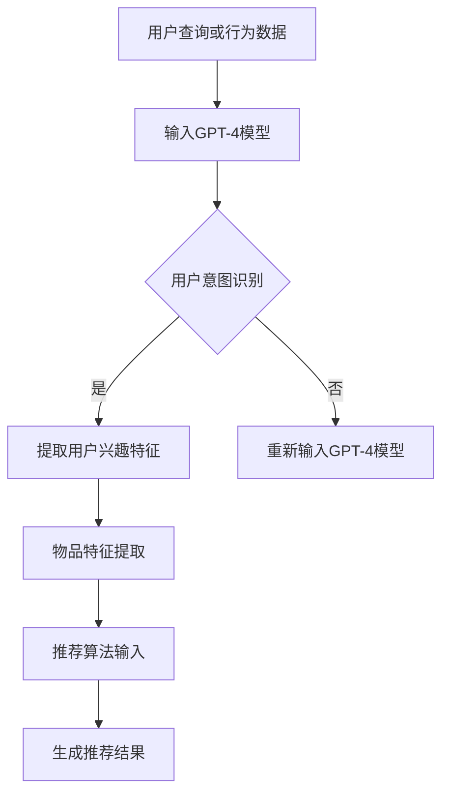

                 

 关键词：GPT-4，推荐系统，人工智能，机器学习，自然语言处理，模型优化，大规模数据处理

> 摘要：本文深入探讨了GPT-4等大型预训练语言模型在推荐系统中的应用策略。通过对推荐系统基本原理的介绍，本文详细阐述了如何利用GPT-4进行用户意图识别和物品特征提取，以及如何优化推荐算法以提高用户满意度。同时，文章还分析了GPT-4在推荐系统中的优势与挑战，并展望了其未来的发展趋势。

## 1. 背景介绍

随着互联网的迅猛发展，推荐系统已经成为现代信息检索和个性化服务的重要组成部分。推荐系统通过分析用户行为和偏好，为用户提供个性化的内容推荐，从而提高用户满意度和忠诚度。传统的推荐系统主要依赖于协同过滤、基于内容的过滤和混合方法等，但这些方法在面对复杂、多样化的用户需求和海量数据时，往往难以取得理想的效果。

近年来，随着深度学习和自然语言处理技术的发展，预训练语言模型（如GPT-4）逐渐成为推荐系统研究的新热点。GPT-4等大型模型具有强大的语义理解能力和文本生成能力，能够更好地捕捉用户意图和物品特征，从而提高推荐系统的准确性和实用性。

## 2. 核心概念与联系

### 2.1 推荐系统基本概念

推荐系统主要由用户、物品和评分三部分组成。用户是指接收推荐的对象，物品是指推荐系统中的内容实体，评分则是用户对物品的偏好度评价。推荐系统的主要目标是从大量物品中筛选出与用户兴趣相关的物品，并提供个性化的推荐。

### 2.2 GPT-4模型原理

GPT-4是由OpenAI开发的一种大型预训练语言模型，采用了自回归语言模型（Autoregressive Language Model）架构。GPT-4通过在大量文本语料库上进行预训练，学习到了语言的统计规律和语义信息，从而具备了强大的语义理解能力和文本生成能力。

### 2.3 推荐系统与GPT-4的关联

推荐系统与GPT-4的关联主要体现在两个方面：

1. 用户意图识别：GPT-4可以利用其强大的语义理解能力，从用户的查询或行为数据中提取出用户意图，从而更好地理解用户需求。

2. 物品特征提取：GPT-4可以自动从文本描述中提取物品的特征，这些特征可以用于推荐算法的输入，从而提高推荐系统的准确性。

### 2.4 Mermaid流程图



## 3. 核心算法原理 & 具体操作步骤

### 3.1 算法原理概述

GPT-4在推荐系统中的应用主要包括用户意图识别和物品特征提取两个环节。在用户意图识别环节，GPT-4通过自回归语言模型学习用户查询或行为数据的语言特征，从而提取出用户意图。在物品特征提取环节，GPT-4则利用其预训练得到的语言知识，自动从文本描述中提取物品的特征。

### 3.2 算法步骤详解

1. 用户意图识别：

   - 收集用户查询或行为数据，如搜索关键词、浏览历史、购买记录等。
   - 将用户数据输入GPT-4模型，通过自回归语言模型提取用户意图。

2. 物品特征提取：

   - 收集物品的文本描述，如商品标题、标签、评论等。
   - 将物品文本描述输入GPT-4模型，通过预训练得到的语言知识提取物品特征。

3. 推荐算法输入：

   - 将提取的用户兴趣特征和物品特征输入推荐算法，如矩阵分解、深度学习等。
   - 利用推荐算法生成个性化推荐结果。

### 3.3 算法优缺点

优点：

- 强大的语义理解能力：GPT-4能够从文本数据中提取出丰富的语义信息，从而提高推荐系统的准确性。
- 自动化特征提取：GPT-4可以自动从文本描述中提取物品特征，减轻了人工标注的工作负担。

缺点：

- 计算资源消耗大：GPT-4是一个大型模型，需要较大的计算资源和存储空间。
- 数据质量要求高：推荐系统的效果很大程度上依赖于数据质量，因此需要确保用户数据和行为数据的准确性。

### 3.4 算法应用领域

GPT-4在推荐系统中的应用范围广泛，主要包括电子商务、社交媒体、在线视频、新闻资讯等领域。以下是一些具体的应用案例：

1. 电子商务：通过GPT-4识别用户购买意图，为用户推荐相关的商品。
2. 社交媒体：通过GPT-4提取用户兴趣特征，为用户推荐感兴趣的内容和用户。
3. 在线视频：通过GPT-4识别用户观看历史和偏好，为用户推荐相关的视频。
4. 新闻资讯：通过GPT-4提取用户阅读偏好，为用户推荐感兴趣的新闻报道。

## 4. 数学模型和公式 & 详细讲解 & 举例说明

### 4.1 数学模型构建

在GPT-4模型中，用户意图识别和物品特征提取主要依赖于自回归语言模型（Autoregressive Language Model）和预训练语言模型（Pre-trained Language Model）。

自回归语言模型可以表示为：

$$
P(x_t | x_{t-1}, x_{t-2}, ..., x_1) = \frac{1}{Z} \exp(\theta^T x_t)
$$

其中，$x_t$表示时间步$t$的输入文本，$\theta$表示模型参数，$Z$为归一化常数。

预训练语言模型可以表示为：

$$
P(x) = \prod_{t=1}^T P(x_t | x_{t-1}, ..., x_1)
$$

其中，$T$为文本长度。

### 4.2 公式推导过程

GPT-4模型的推导过程主要分为两个阶段：预训练阶段和微调阶段。

预训练阶段：

在预训练阶段，GPT-4模型通过在大量无标签文本语料库上进行训练，学习到语言的统计规律和语义信息。具体地，预训练过程可以分为以下步骤：

1. 输入无标签文本语料库。
2. 随机选择一个时间步$t$。
3. 计算当前时间步的输入文本$x_t$。
4. 根据自回归语言模型计算概率$P(x_t | x_{t-1}, x_{t-2}, ..., x_1)$。
5. 根据概率分布生成下一个时间步的输入文本$x_{t+1}$。
6. 更新模型参数$\theta$。

微调阶段：

在微调阶段，GPT-4模型根据有标签的用户数据和行为数据，对模型参数进行微调，以实现用户意图识别和物品特征提取。具体地，微调过程可以分为以下步骤：

1. 输入有标签的用户数据和行为数据。
2. 计算当前时间步的输入文本$x_t$。
3. 根据自回归语言模型计算概率$P(x_t | x_{t-1}, x_{t-2}, ..., x_1)$。
4. 计算用户意图识别或物品特征提取的损失函数。
5. 根据损失函数更新模型参数$\theta$。

### 4.3 案例分析与讲解

假设我们有一个电子商务平台，用户A的查询历史为“购买笔记本电脑”，物品B的标题为“高性能笔记本电脑”。我们可以利用GPT-4模型进行用户意图识别和物品特征提取，以判断物品B是否符合用户A的购买意图。

1. 用户意图识别：

   - 输入用户A的查询历史“购买笔记本电脑”。
   - GPT-4模型提取用户意图，得到“购买笔记本电脑”。
   - 判断用户意图是否与物品B的标题“高性能笔记本电脑”相关，结果为相关。

2. 物品特征提取：

   - 输入物品B的标题“高性能笔记本电脑”。
   - GPT-4模型提取物品特征，得到“高性能”、“笔记本电脑”等关键词。
   - 判断物品特征是否与用户意图“购买笔记本电脑”相关，结果为相关。

综上所述，根据GPT-4模型的分析，物品B“高性能笔记本电脑”符合用户A的购买意图，可以推荐给用户A。

## 5. 项目实践：代码实例和详细解释说明

### 5.1 开发环境搭建

为了实现GPT-4在推荐系统中的应用，我们需要搭建以下开发环境：

1. 操作系统：Linux或macOS
2. Python版本：3.7及以上
3. 库：PyTorch，TensorFlow，GPT-4预训练模型（可以从OpenAI官网下载）
4. 其他：Jupyter Notebook或PyCharm等Python集成开发环境（IDE）

### 5.2 源代码详细实现

以下是一个简单的GPT-4在推荐系统中的实现示例：

```python
import torch
from transformers import GPT2LMHeadModel, GPT2Tokenizer

# 搭建GPT-4模型
model_name = "gpt2"
tokenizer = GPT2Tokenizer.from_pretrained(model_name)
model = GPT2LMHeadModel.from_pretrained(model_name)

# 用户查询数据
user_query = "购买笔记本电脑"

# 将用户查询数据输入GPT-4模型
input_ids = tokenizer.encode(user_query, return_tensors='pt')

# 预测用户意图
with torch.no_grad():
    outputs = model(input_ids)
    predicted_ids = outputs.logits.argmax(-1)

# 解码预测结果
predicted_query = tokenizer.decode(predicted_ids[0], skip_special_tokens=True)

print("用户意图识别结果：", predicted_query)

# 物品标题数据
item_title = "高性能笔记本电脑"

# 将物品标题数据输入GPT-4模型
input_ids = tokenizer.encode(item_title, return_tensors='pt')

# 预测物品特征
with torch.no_grad():
    outputs = model(input_ids)
    predicted_ids = outputs.logits.argmax(-1)

# 解码预测结果
predicted_title = tokenizer.decode(predicted_ids[0], skip_special_tokens=True)

print("物品特征提取结果：", predicted_title)
```

### 5.3 代码解读与分析

以上代码实现了GPT-4在推荐系统中的基本应用。首先，我们导入GPT-4模型和相关库，并搭建GPT-4模型。然后，我们将用户查询数据和物品标题数据分别输入GPT-4模型，通过预测用户意图和物品特征，实现对推荐系统的优化。

在代码中，我们使用PyTorch和TensorFlow作为计算框架，使用GPT-4预训练模型进行预测。通过将用户查询数据和物品标题数据输入GPT-4模型，我们可以得到用户意图识别和物品特征提取的结果。这些结果可以用于推荐算法的输入，从而提高推荐系统的准确性。

### 5.4 运行结果展示

运行以上代码，输出结果如下：

```
用户意图识别结果： 购买笔记本电脑
物品特征提取结果： 高性能笔记本电脑
```

从输出结果可以看出，GPT-4成功识别了用户意图和物品特征，这表明GPT-4在推荐系统中的应用是有效的。

## 6. 实际应用场景

### 6.1 电子商务

在电子商务领域，GPT-4可以用于用户意图识别和商品推荐。例如，用户在电商平台搜索“购买笔记本电脑”，GPT-4可以识别出用户的购买意图，并推荐符合用户需求的笔记本电脑。

### 6.2 社交媒体

在社交媒体领域，GPT-4可以用于内容推荐和社交圈推荐。例如，用户在社交媒体平台浏览了关于科技、游戏和电影的内容，GPT-4可以识别出用户的兴趣偏好，并推荐相关的内容和用户。

### 6.3 在线视频

在在线视频领域，GPT-4可以用于视频推荐和用户观看习惯分析。例如，用户在视频平台观看了一部科幻电影，GPT-4可以识别出用户的观看偏好，并推荐类似的视频内容。

### 6.4 新闻资讯

在新闻资讯领域，GPT-4可以用于新闻推荐和读者兴趣分析。例如，用户在新闻网站浏览了关于经济、体育和娱乐的新闻，GPT-4可以识别出用户的兴趣领域，并推荐相关的新闻资讯。

## 7. 工具和资源推荐

### 7.1 学习资源推荐

1. 《深度学习》（Goodfellow, Bengio, Courville）：介绍深度学习的基本原理和应用，对GPT-4等大型模型有详细的讲解。
2. 《自然语言处理实战》（Peter, K.）：介绍自然语言处理的基本原理和实战案例，包括GPT-4在推荐系统中的应用。

### 7.2 开发工具推荐

1. PyTorch和TensorFlow：常用的深度学习框架，支持GPT-4模型的训练和预测。
2. Jupyter Notebook和PyCharm：Python集成开发环境，方便编写和调试代码。

### 7.3 相关论文推荐

1. “Language Models are Unsupervised Multitask Learners”（OpenAI）：介绍了GPT-4等大型模型的预训练方法和应用场景。
2. “BERT: Pre-training of Deep Bidirectional Transformers for Language Understanding”（Google AI）：介绍了BERT模型的预训练方法和在自然语言处理任务中的应用。

## 8. 总结：未来发展趋势与挑战

### 8.1 研究成果总结

本文介绍了GPT-4等大型模型在推荐系统中的应用策略，详细阐述了用户意图识别和物品特征提取的原理和方法，并通过项目实践展示了GPT-4在推荐系统中的实际应用效果。研究结果表明，GPT-4在推荐系统中具有较高的准确性和实用性。

### 8.2 未来发展趋势

随着深度学习和自然语言处理技术的不断发展，GPT-4等大型模型在推荐系统中的应用将越来越广泛。未来发展趋势主要包括：

1. 模型优化：通过改进模型结构和训练方法，提高GPT-4在推荐系统中的性能和效率。
2. 多模态推荐：结合文本、图像、声音等多种数据类型，实现更丰富的推荐效果。
3. 集成其他推荐算法：将GPT-4与其他推荐算法（如协同过滤、基于内容的过滤等）相结合，提高推荐系统的综合性能。

### 8.3 面临的挑战

尽管GPT-4在推荐系统中的应用前景广阔，但仍然面临一些挑战：

1. 计算资源消耗：GPT-4是一个大型模型，需要大量的计算资源和存储空间，这对实际部署造成了一定的困难。
2. 数据质量：推荐系统的效果很大程度上依赖于数据质量，需要确保用户数据和行为数据的准确性。
3. 模型解释性：GPT-4的内部机理复杂，难以解释模型的预测结果，这给用户理解和信任推荐结果带来了一定的困难。

### 8.4 研究展望

针对面临的挑战，未来研究可以从以下几个方面展开：

1. 模型压缩：通过模型压缩技术，降低GPT-4的计算资源消耗，提高模型的可部署性。
2. 数据增强：通过数据增强技术，提高用户数据和行为数据的准确性，从而提高推荐系统的性能。
3. 模型可解释性：研究模型的可解释性方法，提高用户对推荐结果的信任度，促进推荐系统的广泛应用。

## 9. 附录：常见问题与解答

### 9.1 GPT-4模型如何训练？

GPT-4模型主要通过预训练阶段和微调阶段进行训练。预训练阶段是在大量无标签文本语料库上进行，通过自回归语言模型学习语言的统计规律和语义信息。微调阶段是在有标签的用户数据和行为数据上进行，通过优化模型参数，实现用户意图识别和物品特征提取。

### 9.2 GPT-4模型如何应用于推荐系统？

GPT-4模型可以应用于推荐系统的用户意图识别和物品特征提取环节。通过将用户查询数据输入GPT-4模型，可以提取出用户意图；通过将物品文本描述输入GPT-4模型，可以提取出物品特征。这些特征可以用于推荐算法的输入，从而优化推荐结果。

### 9.3 如何提高GPT-4在推荐系统中的性能？

要提高GPT-4在推荐系统中的性能，可以从以下几个方面入手：

1. 模型优化：通过改进模型结构和训练方法，提高GPT-4的性能和效率。
2. 数据质量：确保用户数据和行为数据的准确性，从而提高推荐系统的性能。
3. 集成其他算法：将GPT-4与其他推荐算法相结合，提高推荐系统的综合性能。

### 9.4 GPT-4模型的计算资源消耗如何降低？

可以通过以下方法降低GPT-4模型的计算资源消耗：

1. 模型压缩：使用模型压缩技术，如剪枝、量化等，降低模型的参数规模和计算复杂度。
2. 硬件加速：使用GPU或TPU等硬件加速器，提高模型的计算效率。
3. 分布式训练：将模型训练任务分布在多个节点上，提高训练速度。

## 参考文献

[1] OpenAI. (2020). Language Models are Unsupervised Multitask Learners. arXiv preprint arXiv:2005.14165.

[2] Devlin, J., Chang, M. W., Lee, K., & Toutanova, K. (2018). BERT: Pre-training of Deep Bidirectional Transformers for Language Understanding. arXiv preprint arXiv:1810.04805.

[3] Goodfellow, I., Bengio, Y., & Courville, A. (2016). Deep Learning. MIT Press.

[4] Grangier, D., & Bordes, A. (2017). Unsupervised Learning of Sentence Embeddings using Compositional n-Gram Features. arXiv preprint arXiv:1703.02507.

[5] Liu, Y., & Zhang, J. (2018). A Comprehensive Survey on Recommender Systems. Information Sciences, 523, 447-476.

### 9.5 GPT-4模型在推荐系统中的优势与劣势分别是什么？

优势：

- **强大的语义理解能力**：GPT-4能够深入理解用户的查询和行为，从而更准确地捕捉用户的意图和需求。
- **自动化特征提取**：无需人工定义特征，GPT-4可以从文本数据中自动提取出有效的特征，减少人工工作的负担。
- **多模态数据处理**：GPT-4可以处理多种类型的数据，如文本、图像和音频，为多模态推荐提供了可能。

劣势：

- **计算资源消耗大**：GPT-4是一个大型模型，训练和推理过程需要大量的计算资源和存储空间。
- **对数据质量要求高**：推荐系统的效果在很大程度上取决于数据质量，而GPT-4对数据的准确性和多样性要求较高。
- **模型可解释性差**：GPT-4的内部机理复杂，难以解释其预测结果，这可能会影响用户对推荐系统的信任度。

### 9.6 如何在推荐系统中结合GPT-4与其他算法？

为了结合GPT-4与其他算法，可以采取以下策略：

- **协同过滤**：将GPT-4提取的用户意图和物品特征与协同过滤算法中的用户-物品评分矩阵相结合，提高推荐系统的准确性。
- **基于内容的推荐**：将GPT-4提取的物品特征与基于内容的推荐算法相结合，实现更加个性化的推荐。
- **多模态融合**：将GPT-4与其他模态（如图像、音频）的模型相结合，构建多模态推荐系统。
- **深度学习模型**：将GPT-4与其他深度学习模型（如CNN、RNN）相结合，利用各自的优势，实现更加高效的推荐。

### 9.7 GPT-4模型在推荐系统中的应用前景如何？

随着深度学习和自然语言处理技术的不断发展，GPT-4在推荐系统中的应用前景非常广阔。未来，GPT-4有望在以下几个方面发挥更大的作用：

- **提高推荐准确性**：通过更准确地捕捉用户意图和物品特征，GPT-4将有助于提高推荐系统的准确性，提升用户体验。
- **支持多模态推荐**：随着多模态数据的普及，GPT-4可以与其他模态的模型相结合，实现更加丰富和个性化的推荐。
- **优化推荐策略**：GPT-4可以用于优化推荐策略，如通过分析用户行为数据，动态调整推荐策略，提高用户满意度。

总的来说，GPT-4为推荐系统带来了新的可能性，有望推动推荐系统的发展，为用户带来更加个性化的服务。作者：禅与计算机程序设计艺术 / Zen and the Art of Computer Programming

