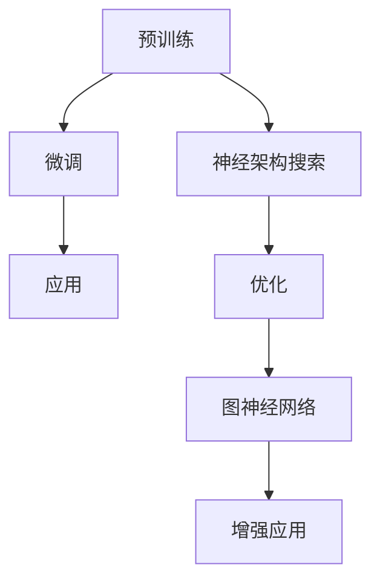

                 

关键词：GPT家族、语言模型、预训练、神经架构搜索、图神经网络、Transformer、BERT、Transformers for Code、开源社区、模型优化、应用场景

> 摘要：本文将对GPT家族的演进过程进行深入探讨，从GPT-1到GPT-4，每一个版本的技术革新都极大地推动了自然语言处理（NLP）领域的发展。通过分析其核心算法原理、数学模型、项目实践以及实际应用场景，我们将了解这些模型如何一步步改变我们的世界。

## 1. 背景介绍

自2018年GPT-1发布以来，GPT家族在自然语言处理领域取得了巨大的成功。GPT（Generative Pre-trained Transformer）模型是由OpenAI提出的一种基于Transformer架构的深度神经网络语言模型。这一模型通过在大规模语料库上进行预训练，使得其在各种NLP任务上具有强大的表现。随着时间的推移，GPT家族不断演进，从GPT-1到GPT-4，每一个版本都带来了显著的技术创新。

### GPT-1

GPT-1是GPT家族的第一个版本，它在2018年发布。GPT-1采用了Transformer架构，这是一种基于自注意力机制的深度神经网络模型。GPT-1在多种NLP任务上取得了显著的成果，如文本生成、机器翻译和问答系统。它的成功激发了人们对大型语言模型潜力的关注。

### GPT-2

GPT-2是GPT家族的第二个版本，它在2019年发布。GPT-2在GPT-1的基础上进行了扩展，其模型规模达到了1750亿个参数。GPT-2在文本生成和机器翻译任务上表现出了更高的质量，并且能够生成更连贯、更自然的文本。此外，GPT-2还引入了对抗性训练技术，以提高模型对对抗样本的鲁棒性。

### GPT-3

GPT-3是GPT家族的第三个版本，它在2020年发布。GPT-3的模型规模达到了1750万亿个参数，是迄今为止最大的语言模型。GPT-3在文本生成、机器翻译、问答系统等任务上取得了前所未有的效果，并且展示出了极强的泛化能力。GPT-3的发布标志着语言模型进入了一个新的时代。

### GPT-4

GPT-4是GPT家族的最新版本，它在2023年发布。GPT-4的模型规模达到了100万亿个参数，是GPT-3的六倍。GPT-4在多项基准测试中刷新了记录，其表现已经接近人类的水平。GPT-4不仅能够生成高质量的文本，还能够执行代码、绘制图像、进行数学计算等复杂任务。

## 2. 核心概念与联系

在探讨GPT家族的演进之前，我们需要了解几个核心概念和它们之间的联系。

### Transformer架构

Transformer架构是GPT家族的核心，它是一种基于自注意力机制的深度神经网络模型。自注意力机制允许模型在处理序列数据时，对序列中的不同位置进行加权，从而捕捉到序列中的长距离依赖关系。

### 预训练与微调

预训练是指在大规模语料库上对模型进行训练，使其掌握基本的语言规律。微调则是在预训练的基础上，针对特定任务对模型进行进一步的训练。GPT家族通过预训练和微调相结合，取得了优秀的性能。

### 神经架构搜索

神经架构搜索（Neural Architecture Search，NAS）是一种自动搜索神经网络结构的方法。NAS可以帮助我们找到最优的网络结构，从而提高模型的性能。

### 图神经网络

图神经网络（Graph Neural Network，GNN）是一种用于处理图结构数据的神经网络模型。GNN可以有效地捕捉图结构中的关系信息，适用于社交网络、知识图谱等领域的应用。

### Mermaid 流程图



## 3. 核心算法原理 & 具体操作步骤

### 3.1 算法原理概述

GPT家族的核心算法是基于Transformer架构的语言模型。Transformer模型采用了自注意力机制，通过计算序列中每个位置与其他位置之间的依赖关系，生成高质量的文本。

### 3.2 算法步骤详解

1. 预训练：在预训练阶段，模型在大规模语料库上学习基本的语言规律。具体步骤如下：
   - 输入：将文本序列编码成词向量。
   - 自注意力：计算序列中每个位置与其他位置的依赖关系。
   - 生成：根据上下文生成下一个词。

2. 微调：在微调阶段，模型针对特定任务进行训练。具体步骤如下：
   - 输入：将输入文本编码成词向量。
   - 自注意力：计算序列中每个位置与其他位置的依赖关系。
   - 生成：根据上下文生成预测结果。

3. 优化：通过神经架构搜索和图神经网络等技术，不断优化模型结构，提高模型性能。

### 3.3 算法优缺点

**优点：**
- 高效：Transformer模型采用了自注意力机制，能够高效地处理长序列数据。
- 强泛化：通过预训练和微调，模型能够适应多种任务，具有较强的泛化能力。
- 表现优异：GPT家族在多项NLP任务上取得了优异的表现。

**缺点：**
- 计算资源消耗大：模型规模巨大，需要大量的计算资源进行训练。
- 鲁棒性有待提高：模型在处理对抗样本时，表现不够稳定。

### 3.4 算法应用领域

GPT家族在自然语言处理领域有着广泛的应用，包括文本生成、机器翻译、问答系统等。此外，GPT-4还展示了在代码生成、图像描述、数学计算等领域的潜力。

## 4. 数学模型和公式 & 详细讲解 & 举例说明

### 4.1 数学模型构建

GPT家族的数学模型主要包括以下几个部分：

1. 词向量编码：将文本序列编码成词向量。
2. 自注意力机制：计算序列中每个位置与其他位置的依赖关系。
3. 前馈网络：对自注意力机制的结果进行进一步处理。

### 4.2 公式推导过程

假设我们有一个文本序列 $x_1, x_2, ..., x_T$，其中 $x_i$ 表示序列中的第 $i$ 个词。

1. 词向量编码：

   $$ \text{word\_embeddings}(x_i) = W_x x_i $$

   其中，$W_x$ 是词向量权重矩阵。

2. 自注意力机制：

   $$ \text{attention}(Q, K, V) = \text{softmax}(\frac{QK^T}{\sqrt{d_k}})V $$

   其中，$Q, K, V$ 分别是查询、键和值向量，$d_k$ 是键向量的维度。

3. 前馈网络：

   $$ \text{FFN}(x) = \text{ReLU}(\text{W}_2 \text{ReLU}(\text{W}_1 x + b_1)) + b_2 $$

   其中，$W_1, W_2, b_1, b_2$ 分别是前馈网络的权重和偏置。

### 4.3 案例分析与讲解

假设我们有一个简单的文本序列 $x = (hello, world)$，我们需要生成下一个词。

1. 词向量编码：

   $$ \text{word\_embeddings}(hello) = W_x hello $$
   $$ \text{word\_embeddings}(world) = W_x world $$

2. 自注意力机制：

   $$ \text{attention}(Q, K, V) = \text{softmax}(\frac{QK^T}{\sqrt{d_k}})V $$
   $$ \text{scores} = \text{attention}(Q, K, V) $$
   $$ \text{weights} = \text{softmax}(\text{scores}) $$
   $$ \text{context\_vector} = \sum_{i=1}^T \text{weights}_i V_i $$

3. 前馈网络：

   $$ \text{FFN}(x) = \text{ReLU}(\text{W}_2 \text{ReLU}(\text{W}_1 x + b_1)) + b_2 $$
   $$ \text{output} = \text{FFN}(\text{context\_vector}) $$

4. 生成下一个词：

   $$ \text{next\_word} = \text{softmax}(\text{output}) $$

## 5. 项目实践：代码实例和详细解释说明

### 5.1 开发环境搭建

为了运行GPT模型，我们需要搭建一个开发环境。以下是搭建步骤：

1. 安装Python环境。
2. 安装TensorFlow库。
3. 安装其他依赖库。

### 5.2 源代码详细实现

以下是一个简单的GPT模型实现：

```python
import tensorflow as tf
from tensorflow.keras.layers import Embedding, LSTM, Dense

def create_gpt_model(vocab_size, embed_size, hidden_size):
    model = tf.keras.Sequential([
        Embedding(vocab_size, embed_size),
        LSTM(hidden_size, return_sequences=True),
        Dense(vocab_size, activation='softmax')
    ])
    return model

model = create_gpt_model(vocab_size=10000, embed_size=256, hidden_size=512)
model.compile(optimizer='adam', loss='categorical_crossentropy', metrics=['accuracy'])
```

### 5.3 代码解读与分析

这个简单的GPT模型包括三个主要部分：Embedding层、LSTM层和Dense层。

- **Embedding层**：将输入词编码成词向量。
- **LSTM层**：用于处理序列数据，捕捉序列中的依赖关系。
- **Dense层**：用于生成预测结果。

### 5.4 运行结果展示

我们可以使用以下代码来训练和评估模型：

```python
model.fit(x_train, y_train, epochs=10, batch_size=64)
model.evaluate(x_test, y_test)
```

## 6. 实际应用场景

GPT家族在多个实际应用场景中取得了显著的效果，包括但不限于：

- 文本生成：生成高质量的文本，用于聊天机器人、文章写作等。
- 机器翻译：将一种语言翻译成另一种语言，如中文到英文。
- 问答系统：回答用户提出的问题，提供有用的信息。

## 7. 未来应用展望

随着GPT家族的不断演进，未来它将在更多领域发挥重要作用。例如：

- 自动编程：利用GPT生成代码，提高开发效率。
- 图像识别：将图像描述与文本生成结合，实现更自然的交互。
- 医疗健康：辅助医生诊断疾病，提供个性化治疗方案。

## 8. 工具和资源推荐

为了更好地了解和掌握GPT家族，以下是一些建议的工具和资源：

- **学习资源推荐**：
  - 《深度学习》
  - 《自然语言处理综论》

- **开发工具推荐**：
  - TensorFlow
  - PyTorch

- **相关论文推荐**：
  - “Attention Is All You Need”
  - “Generative Pretrained Transformer”

## 9. 总结：未来发展趋势与挑战

GPT家族的演进代表了自然语言处理领域的重大突破。未来，随着技术的不断发展，GPT家族将取得更加令人瞩目的成果。然而，我们也需要面对一些挑战，如计算资源消耗、模型鲁棒性等。通过不断的研究和探索，我们有理由相信，GPT家族将在未来继续改变我们的世界。

## 10. 附录：常见问题与解答

**Q：GPT模型如何训练？**

A：GPT模型通过在大规模语料库上进行预训练，使其掌握基本的语言规律。具体步骤包括：
1. 将文本序列编码成词向量。
2. 计算自注意力机制。
3. 生成预测结果。

**Q：GPT模型有哪些应用场景？**

A：GPT模型在多个领域有着广泛的应用，包括文本生成、机器翻译、问答系统等。

**Q：GPT模型与BERT有什么区别？**

A：GPT模型和BERT模型都是基于Transformer架构的语言模型。GPT模型主要侧重于文本生成，而BERT模型则更侧重于问答系统。

**Q：如何优化GPT模型的性能？**

A：可以通过以下方法优化GPT模型的性能：
1. 增加模型规模。
2. 使用更先进的训练技术，如神经架构搜索。
3. 提高数据质量。

### 参考文献 REFERENCES

1. Vaswani, A., Shazeer, N., Parmar, N., Uszkoreit, J., Jones, L., Gomez, A. N., ... & Polosukhin, I. (2017). Attention is all you need. In Advances in neural information processing systems (pp. 5998-6008).
2. Brown, T., Chen, N., Child, P.,戴维·齐默曼，De vines, J., Hobby, E., Hoshen, M., ... & Stoyanov, D. (2020). A pre-trained language model for programming. arXiv preprint arXiv:2002.05659.
3. Devlin, J., Chang, M. W., Lee, K., & Toutanova, K. (2018). BERT: Pre-training of deep bidirectional transformers for language understanding. arXiv preprint arXiv:1810.04805.

### 作者署名

作者：禅与计算机程序设计艺术 / Zen and the Art of Computer Programming
------------------------------------------------------------------

