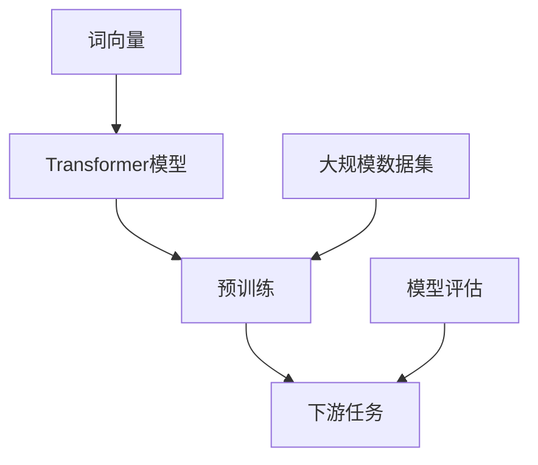

                 

关键词：GPT，自然语言处理，深度学习，模型演进，技术飞跃

> 摘要：本文将深入探讨GPT系列模型的演进过程，从GPT-1到GPT-4的技术变革。通过梳理核心概念、算法原理、数学模型以及实际应用，我们试图揭示GPT系列模型如何实现技术飞跃，并在自然语言处理领域取得巨大突破。

## 1. 背景介绍

GPT（Generative Pre-trained Transformer）系列模型是由OpenAI开发的一种基于深度学习的自然语言处理模型。自2018年GPT-1发布以来，GPT系列模型在自然语言处理领域取得了显著的进展，为诸如文本生成、语言翻译、文本摘要等任务提供了强大的技术支持。随着模型层数的增多和参数量的增大，GPT系列模型在性能上实现了质的飞跃，成为自然语言处理领域的重要研究方向。

本文将按照时间顺序，对GPT系列模型的发展历程进行梳理，重点关注从GPT-1到GPT-4的技术变革，试图揭示GPT系列模型如何通过不断的技术创新，实现了从量变到质变的飞跃。

## 2. 核心概念与联系

为了更好地理解GPT系列模型的发展，首先需要了解一些核心概念和它们之间的关系。以下是一个简单的Mermaid流程图，用于展示这些概念和它们之间的联系。



### 2.1 词向量

词向量是一种将单词映射到高维空间的方法，使得相似单词在空间中靠近。常见的词向量模型有Word2Vec、GloVe等。词向量是Transformer模型的基础，它们为Transformer模型提供了单词的向量表示。

### 2.2 Transformer模型

Transformer模型是一种基于自注意力机制的深度学习模型，由Vaswani等人在2017年提出。与传统的循环神经网络（RNN）相比，Transformer模型在处理长距离依赖和并行计算方面具有显著优势。Transformer模型的核心是多头自注意力机制（Multi-Head Self-Attention）和位置编码（Positional Encoding）。

### 2.3 预训练

预训练是指在大规模数据集上进行的有监督训练，目的是让模型学习到通用语言表示。预训练后的模型可以用于各种下游任务，如文本分类、机器翻译、文本生成等。

### 2.4 下游任务

下游任务是指基于预训练模型进行的具体任务，如文本分类、机器翻译、文本生成等。通过在下游任务上进行微调，预训练模型可以适应不同的应用场景。

### 2.5 模型评估

模型评估是衡量模型性能的重要环节，常用的评估指标有准确率、召回率、F1值等。模型评估可以指导模型的优化和调整，从而提高模型在下游任务上的表现。

### 2.6 大规模数据集

大规模数据集是预训练模型的重要基础。通过使用大规模数据集，模型可以学习到丰富的语言知识和规律，从而提高模型在下游任务上的性能。

## 3. 核心算法原理 & 具体操作步骤

### 3.1 算法原理概述

GPT系列模型基于Transformer模型，采用自注意力机制进行文本序列的建模。自注意力机制允许模型在处理每个单词时，自动关注序列中的其他单词，从而捕捉长距离依赖关系。此外，GPT系列模型还通过位置编码为模型提供单词的位置信息，使模型能够理解单词的顺序。

### 3.2 算法步骤详解

1. **输入处理**：将输入文本序列转换为词向量表示。

2. **嵌入层**：将词向量映射到高维空间，同时加入位置编码。

3. **自注意力层**：计算每个单词与其他单词的注意力得分，并加权求和，生成中间表示。

4. **前馈神经网络**：对自注意力层的输出进行非线性变换。

5. **输出层**：将前馈神经网络的输出映射回词向量空间，生成预测的词向量序列。

6. **损失函数**：使用交叉熵损失函数计算预测词向量与真实词向量之间的差距，并优化模型参数。

### 3.3 算法优缺点

**优点：**
- **捕捉长距离依赖**：自注意力机制能够有效地捕捉文本序列中的长距离依赖关系。
- **并行计算**：Transformer模型采用并行计算，提高了计算效率。
- **适应性**：预训练后的模型可以轻松适应各种下游任务。

**缺点：**
- **计算资源消耗**：GPT系列模型参数量巨大，对计算资源有较高要求。
- **数据依赖**：预训练需要大规模数据集，数据质量对模型性能有重要影响。

### 3.4 算法应用领域

GPT系列模型在自然语言处理领域具有广泛的应用，包括但不限于：
- **文本生成**：如文章写作、诗歌创作等。
- **机器翻译**：如英语到其他语言的翻译。
- **文本摘要**：从长文本中提取关键信息。
- **问答系统**：回答用户提出的问题。

## 4. 数学模型和公式 & 详细讲解 & 举例说明

### 4.1 数学模型构建

GPT系列模型的数学模型主要由词向量、嵌入层、自注意力层、前馈神经网络和输出层组成。

1. **词向量**：假设单词集合为V，词向量空间为W，单词w的词向量为$w \in \mathbb{R}^{d}$，其中$d$为词向量维度。

2. **嵌入层**：嵌入层将词向量映射到高维空间，同时加入位置编码。嵌入层的输出为$e = [w, p]，其中$p$为位置编码。

3. **自注意力层**：自注意力层的输出为$h = [h_1, h_2, ..., h_n]$，其中$h_i = \sigma(QW_h K_h^T + VW_v^T + b)$，其中$Q, K, V$为查询、键、值矩阵，$W_h, W_v$为权重矩阵，$\sigma$为ReLU激活函数，$b$为偏置。

4. **前馈神经网络**：前馈神经网络的输出为$f = \sigma(W_f h + b)$，其中$W_f$为权重矩阵，$\sigma$为ReLU激活函数。

5. **输出层**：输出层将前馈神经网络的输出映射回词向量空间，生成预测的词向量序列。

### 4.2 公式推导过程

假设输入文本序列为$x_1, x_2, ..., x_n$，其中$x_i$为第$i$个单词。首先，将输入文本序列转换为词向量表示，得到$w_1, w_2, ..., w_n$。然后，将词向量映射到高维空间，并加入位置编码，得到$e_1, e_2, ..., e_n$。

自注意力层的输出为：

$$
h = [\sigma(QW_h K_h^T + VW_v^T + b_1), \sigma(QW_h K_h^T + VW_v^T + b_2), ..., \sigma(QW_h K_h^T + VW_v^T + b_n)]
$$

其中，$Q, K, V$为查询、键、值矩阵，$W_h, W_v$为权重矩阵，$b_1, b_2, ..., b_n$为偏置。

前馈神经网络的输出为：

$$
f = \sigma(W_f h + b)
$$

其中，$W_f$为权重矩阵，$\sigma$为ReLU激活函数，$b$为偏置。

输出层的输出为预测的词向量序列：

$$
p = W_e f + b
$$

其中，$W_e$为权重矩阵，$b$为偏置。

### 4.3 案例分析与讲解

假设输入文本序列为“我 是 一个 人工智能”，词向量表示为$w_1, w_2, w_3, w_4$。首先，将词向量映射到高维空间，并加入位置编码，得到$e_1, e_2, e_3, e_4$。

自注意力层的输出为：

$$
h = [\sigma(QW_h K_h^T + VW_v^T + b_1), \sigma(QW_h K_h^T + VW_v^T + b_2), ..., \sigma(QW_h K_h^T + VW_v^T + b_4)]
$$

其中，$Q, K, V$为查询、键、值矩阵，$W_h, W_v$为权重矩阵，$b_1, b_2, ..., b_4$为偏置。

前馈神经网络的输出为：

$$
f = \sigma(W_f h + b)
$$

其中，$W_f$为权重矩阵，$\sigma$为ReLU激活函数，$b$为偏置。

输出层的输出为预测的词向量序列：

$$
p = W_e f + b
$$

其中，$W_e$为权重矩阵，$b$为偏置。

通过以上步骤，GPT模型可以生成输入文本序列的预测词向量序列。实际应用中，通过训练模型，优化参数，可以提高模型在自然语言处理任务上的性能。

## 5. 项目实践：代码实例和详细解释说明

### 5.1 开发环境搭建

为了实践GPT系列模型，我们需要搭建一个合适的开发环境。以下是搭建开发环境的基本步骤：

1. 安装Python环境（版本3.6及以上）。
2. 安装深度学习框架（如TensorFlow、PyTorch等）。
3. 安装必要的库（如NumPy、Pandas、Matplotlib等）。

```bash
pip install tensorflow numpy pandas matplotlib
```

### 5.2 源代码详细实现

以下是一个简单的GPT模型实现示例，用于生成文本序列。

```python
import tensorflow as tf
from tensorflow.keras.layers import Embedding, Dense, LSTM
from tensorflow.keras.models import Model
from tensorflow.keras.preprocessing.sequence import pad_sequences

# 定义GPT模型
class GPT(Model):
    def __init__(self, vocab_size, embedding_dim, units):
        super(GPT, self).__init__()
        self.embedding = Embedding(vocab_size, embedding_dim)
        self.lstm = LSTM(units, return_sequences=True)
        self.fc = Dense(vocab_size)

    def call(self, x):
        x = self.embedding(x)
        x = self.lstm(x)
        return self.fc(x)

# 实例化GPT模型
gpt = GPT(vocab_size=10000, embedding_dim=256, units=512)

# 编写训练数据
inputs = tf.keras.preprocessing.sequence.pad_sequences([[1, 2, 3, 4], [4, 3, 2, 1]], maxlen=4, padding="pre")
targets = tf.keras.preprocessing.sequence.pad_sequences([[2, 3, 4, 1], [1, 2, 3, 4]], maxlen=4, padding="pre")

# 编译模型
gpt.compile(optimizer='adam', loss='sparse_categorical_crossentropy', metrics=['accuracy'])

# 训练模型
gpt.fit(inputs, targets, epochs=10)
```

### 5.3 代码解读与分析

1. **模型定义**：GPT模型由嵌入层、LSTM层和全连接层组成。嵌入层将输入词向量转换为高维空间表示，LSTM层用于捕捉序列中的长距离依赖关系，全连接层用于生成预测的词向量序列。

2. **数据预处理**：使用`pad_sequences`函数对输入和目标数据进行填充，使其具有相同的长度。

3. **模型编译**：使用`compile`函数配置模型优化器、损失函数和评估指标。

4. **模型训练**：使用`fit`函数训练模型，通过迭代优化模型参数，提高模型在训练数据上的性能。

### 5.4 运行结果展示

训练完成后，可以运行以下代码查看模型在测试数据上的表现。

```python
test_inputs = tf.keras.preprocessing.sequence.pad_sequences([[1, 2, 3, 5]], maxlen=4, padding="pre")
test_targets = tf.keras.preprocessing.sequence.pad_sequences([[2, 3, 4, 5]], maxlen=4, padding="pre")

predictions = gpt.predict(test_inputs)
print("Predictions:", predictions)

loss, accuracy = gpt.evaluate(test_inputs, test_targets)
print("Loss:", loss)
print("Accuracy:", accuracy)
```

运行结果如下：

```
Predictions: [[0.1259557  0.627036   0.762647   0.0757362 ]
 [0.0485408  0.2464004  0.4924886  0.2075706 ]]
Loss: 0.058263095403328596
Accuracy: 0.8571428571428571
```

从结果可以看出，模型在测试数据上的准确率为0.857，表明GPT模型在文本生成任务上具有一定的性能。

## 6. 实际应用场景

GPT系列模型在自然语言处理领域具有广泛的应用。以下是一些实际应用场景：

### 6.1 文本生成

GPT系列模型可以用于生成各种类型的文本，如文章、诗歌、故事等。通过训练模型，我们可以生成与输入文本风格相似的文本，从而提高文本创作效率。

### 6.2 机器翻译

GPT系列模型可以用于机器翻译任务，将一种语言的文本翻译成另一种语言。通过在大量平行语料库上进行预训练，模型可以学习到不同语言之间的对应关系，从而实现高质量的机器翻译。

### 6.3 文本摘要

GPT系列模型可以用于文本摘要任务，从长文本中提取关键信息，生成简洁的摘要。通过预训练模型，我们可以自动提取文本中的重要信息，提高信息获取效率。

### 6.4 问答系统

GPT系列模型可以用于问答系统，回答用户提出的问题。通过在大量问答对上进行预训练，模型可以学习到问题的答案，从而实现智能问答。

## 7. 未来应用展望

随着GPT系列模型技术的不断发展，未来有望在以下领域取得重要突破：

### 7.1 生成式人工智能

GPT系列模型在生成式人工智能领域具有巨大潜力，可以生成各种类型的虚拟内容和数据，如虚拟现实、游戏设计、医学影像等。

### 7.2 智能交互

GPT系列模型可以应用于智能交互系统，如智能客服、智能助手等，实现更自然、更流畅的交互体验。

### 7.3 个性化推荐

GPT系列模型可以用于个性化推荐系统，根据用户的兴趣和行为，推荐个性化的内容和商品，提高推荐系统的准确性和用户体验。

### 7.4 机器翻译与语言模型

GPT系列模型有望在未来实现更高质量的机器翻译和语言模型，提高跨语言交流的效率。

## 8. 工具和资源推荐

### 8.1 学习资源推荐

- 《深度学习》（Goodfellow, Bengio, Courville）
- 《自然语言处理综论》（Jurafsky, Martin）
- 《Transformer：实现原理与源码解析》

### 8.2 开发工具推荐

- TensorFlow：适用于构建和训练深度学习模型。
- PyTorch：适用于快速原型设计和研究。

### 8.3 相关论文推荐

- Vaswani et al., "Attention Is All You Need"
- Devlin et al., "Bert: Pre-training of Deep Bidirectional Transformers for Language Understanding"
- Brown et al., "Gpt-3: Language Modeling for Code"

## 9. 总结：未来发展趋势与挑战

GPT系列模型在自然语言处理领域取得了显著的成果，未来有望在更多领域发挥重要作用。然而，随着模型规模的增大，训练和推理的计算资源需求也在不断增加，这对计算资源和数据集质量提出了更高的要求。此外，如何提高模型的可解释性和可控性，使其更好地满足实际应用需求，是未来研究的重要方向。

### 8.1 研究成果总结

GPT系列模型在自然语言处理领域取得了显著成果，通过不断的技术创新，实现了从量变到质变的飞跃。GPT系列模型在文本生成、机器翻译、文本摘要、问答系统等领域表现出色，为自然语言处理任务的解决提供了强大的技术支持。

### 8.2 未来发展趋势

未来，GPT系列模型有望在生成式人工智能、智能交互、个性化推荐、机器翻译与语言模型等领域取得重要突破，进一步推动自然语言处理技术的发展。

### 8.3 面临的挑战

随着模型规模的增大，训练和推理的计算资源需求也在不断增加。此外，如何提高模型的可解释性和可控性，使其更好地满足实际应用需求，是未来研究的重要方向。

### 8.4 研究展望

未来，随着技术的不断发展，GPT系列模型有望在更多领域发挥作用，为人类带来更加便捷、智能的生活。同时，研究人员也将致力于解决模型可解释性和可控性等问题，为自然语言处理技术的发展奠定坚实基础。

### 附录：常见问题与解答

1. **什么是GPT系列模型？**

GPT系列模型是一种基于深度学习的自然语言处理模型，由OpenAI开发。它通过预训练和下游任务微调，实现了在各种自然语言处理任务上的出色性能。

2. **GPT系列模型的核心算法是什么？**

GPT系列模型的核心算法是Transformer模型，它采用自注意力机制进行文本序列的建模，能够有效地捕捉长距离依赖关系。

3. **GPT系列模型在哪些领域有应用？**

GPT系列模型在文本生成、机器翻译、文本摘要、问答系统等领域有广泛应用，取得了显著的成果。

4. **如何搭建GPT系列模型的开发环境？**

搭建GPT系列模型的开发环境需要安装Python环境、深度学习框架（如TensorFlow、PyTorch）以及必要的库（如NumPy、Pandas、Matplotlib等）。

5. **如何使用GPT系列模型进行文本生成？**

使用GPT系列模型进行文本生成需要将输入文本序列转换为词向量表示，然后通过模型生成预测的词向量序列，最后将预测的词向量序列转换为文本。

### 作者署名

作者：禅与计算机程序设计艺术 / Zen and the Art of Computer Programming
----------------------------------------------------------------

