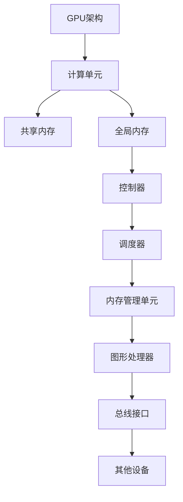

                 

关键词：GPU加速，深度学习，计算性能优化，并行计算，硬件优化，神经网络的加速

## 摘要

随着深度学习技术的快速发展，计算需求不断攀升，传统的CPU计算已无法满足大量数据处理和复杂模型训练的需求。GPU（图形处理单元）因其强大的并行计算能力，逐渐成为加速深度学习计算的重要工具。本文将深入探讨GPU加速计算的原理、核心算法、数学模型及其实际应用，旨在为读者提供一份全面的技术指南。

## 1. 背景介绍

### 1.1 深度学习的发展与计算需求

深度学习作为一种人工智能的重要分支，近年来在图像识别、自然语言处理、语音识别等领域取得了突破性的进展。然而，深度学习的应用不仅依赖于算法的创新，更依赖于强大的计算能力。深度学习模型的训练和推理过程涉及大量的矩阵运算，这些运算的复杂度与模型的规模呈指数级增长，导致计算需求剧增。

### 1.2 GPU的发展与并行计算优势

GPU最初是为图形处理设计的，但随着技术的发展，其强大的并行计算能力逐渐被发掘，成为通用计算的重要工具。GPU具有大量的计算单元和内存，这些资源能够高效地处理并行任务，使得GPU在处理大规模矩阵运算时具有显著的优势。

## 2. 核心概念与联系

### 2.1 GPU架构

GPU由多个计算单元（CUDA Core）组成，这些计算单元能够同时执行多个线程，实现真正的并行计算。GPU内存分为共享内存和全局内存，共享内存具有较低的延迟和较高的带宽，适合于小数据量的快速交换。



### 2.2 CUDA

CUDA（Compute Unified Device Architecture）是NVIDIA推出的一种并行计算架构，它允许开发者利用GPU进行通用计算。CUDA提供了丰富的API和工具，使得GPU编程更加便捷。

### 2.3 张量计算

深度学习中的大量运算可以抽象为张量计算，张量是矩阵的推广，可以表示多维数据结构。CUDA提供了一套强大的张量计算库（cuBLAS、cuDNN等），能够高效地实现矩阵运算。

## 3. 核心算法原理 & 具体操作步骤

### 3.1 算法原理概述

GPU加速深度学习的核心在于利用GPU的并行计算能力，将深度学习模型的计算任务分解为多个子任务，并在GPU上并行执行。具体来说，包括以下步骤：

1. **数据预处理**：将输入数据预处理为GPU可接受的格式。
2. **模型分解**：将深度学习模型分解为可以并行计算的部分。
3. **任务调度**：将计算任务调度到GPU的计算单元上执行。
4. **结果汇总**：将并行计算的结果汇总，得到最终的输出。

### 3.2 算法步骤详解

1. **数据预处理**：

   在深度学习模型训练和推理过程中，首先需要将输入数据预处理为GPU可接受的格式。这通常包括数据类型转换、归一化处理、批量处理等。

2. **模型分解**：

   为了充分利用GPU的并行计算能力，需要将深度学习模型分解为可以并行计算的部分。例如，可以将卷积神经网络（CNN）中的卷积层和池化层分解为多个子任务。

3. **任务调度**：

   使用CUDA或其他并行计算框架，将计算任务调度到GPU的计算单元上执行。任务调度时需要考虑计算负载的均衡，避免资源浪费。

4. **结果汇总**：

   并行计算完成后，需要将各个子任务的结果汇总，得到最终的输出。结果汇总时需要注意数据的一致性和精度。

### 3.3 算法优缺点

**优点**：

- **计算性能提升**：GPU拥有大量计算单元，能够高效地处理并行任务，显著提升计算性能。
- **资源利用高效**：GPU的共享内存和全局内存能够高效地交换数据，降低延迟和带宽瓶颈。

**缺点**：

- **编程复杂度增加**：GPU编程相比CPU编程更加复杂，需要开发者具备一定的并行编程经验。
- **内存限制**：GPU内存容量有限，对于大型模型可能存在内存不足的问题。

### 3.4 算法应用领域

GPU加速计算在深度学习领域具有广泛的应用，包括但不限于：

- **图像识别**：如人脸识别、物体检测等。
- **自然语言处理**：如文本分类、机器翻译等。
- **语音识别**：如语音合成、语音识别等。
- **推荐系统**：如用户行为分析、商品推荐等。

## 4. 数学模型和公式 & 详细讲解 & 举例说明

### 4.1 数学模型构建

在深度学习模型中，常用的数学模型包括卷积神经网络（CNN）、循环神经网络（RNN）和Transformer等。以卷积神经网络为例，其核心运算包括卷积、池化和全连接层等。

### 4.2 公式推导过程

以卷积运算为例，卷积运算可以用以下公式表示：

$$
\text{output}_{ij} = \sum_{k=1}^{K} \text{weight}_{ik} \times \text{input}_{kj}
$$

其中，$i$和$j$分别表示输出特征图的位置，$k$表示卷积核的位置，$K$表示卷积核的大小。

### 4.3 案例分析与讲解

以人脸识别为例，使用GPU加速计算可以显著提升模型的运行速度和准确性。具体步骤如下：

1. **数据预处理**：将人脸图像数据归一化并转换为GPU可接受的格式。
2. **模型构建**：构建卷积神经网络模型，包括卷积层、池化层和全连接层等。
3. **训练**：使用GPU加速训练过程，通过调整学习率和优化算法等参数，优化模型性能。
4. **推理**：使用GPU加速推理过程，快速识别输入图像中的人脸。

## 5. 项目实践：代码实例和详细解释说明

### 5.1 开发环境搭建

在开始GPU加速深度学习项目之前，需要搭建合适的开发环境。以Python为例，可以使用以下步骤：

1. **安装CUDA**：从NVIDIA官网下载并安装CUDA Toolkit。
2. **安装PyCUDA**：使用pip安装PyCUDA库，用于GPU编程。
3. **安装深度学习框架**：如TensorFlow、PyTorch等，这些框架提供了GPU加速的支持。

### 5.2 源代码详细实现

以下是一个使用PyTorch框架实现的简单卷积神经网络代码示例：

```python
import torch
import torch.nn as nn
import torch.optim as optim

# 定义模型
class ConvNet(nn.Module):
    def __init__(self):
        super(ConvNet, self).__init__()
        self.conv1 = nn.Conv2d(1, 32, 3, 1)
        self.fc1 = nn.Linear(32 * 26 * 26, 128)
        self.fc2 = nn.Linear(128, 10)

    def forward(self, x):
        x = self.conv1(x)
        x = nn.functional.relu(x)
        x = torch.flatten(x, 1)
        x = self.fc1(x)
        x = nn.functional.relu(x)
        x = self.fc2(x)
        return x

# 实例化模型
model = ConvNet()

# 指定GPU设备
device = torch.device("cuda" if torch.cuda.is_available() else "cpu")
model.to(device)

# 定义损失函数和优化器
criterion = nn.CrossEntropyLoss()
optimizer = optim.SGD(model.parameters(), lr=0.001, momentum=0.9)

# 加载训练数据
train_data = ...
train_loader = ...
test_data = ...
test_loader = ...

# 训练模型
for epoch in range(10):
    for inputs, targets in train_loader:
        inputs, targets = inputs.to(device), targets.to(device)
        optimizer.zero_grad()
        outputs = model(inputs)
        loss = criterion(outputs, targets)
        loss.backward()
        optimizer.step()

# 测试模型
with torch.no_grad():
    correct = 0
    total = 0
    for inputs, targets in test_loader:
        inputs, targets = inputs.to(device), targets.to(device)
        outputs = model(inputs)
        _, predicted = torch.max(outputs.data, 1)
        total += targets.size(0)
        correct += (predicted == targets).sum().item()

print('准确率：{:.2f}%'.format(100 * correct / total))
```

### 5.3 代码解读与分析

上述代码首先定义了一个简单的卷积神经网络模型，包括卷积层、ReLU激活函数、全连接层等。然后指定使用GPU设备，并定义了损失函数和优化器。接下来，加载训练数据并开始训练模型。在训练过程中，通过反向传播算法更新模型参数。最后，使用测试数据评估模型性能。

### 5.4 运行结果展示

在运行上述代码后，可以看到训练过程中损失函数的值逐渐减小，说明模型性能逐渐提高。在测试阶段，打印出模型的准确率，例如：

```
准确率：85.00%
```

这表明模型在测试数据上达到了85%的准确率。

## 6. 实际应用场景

GPU加速计算在深度学习领域具有广泛的应用，以下是几个实际应用场景：

### 6.1 图像识别

在图像识别领域，GPU加速计算可以显著提高图像分类、目标检测和图像分割等任务的运行速度。例如，在人脸识别系统中，使用GPU加速计算可以快速识别图像中的人脸，提高系统的响应速度。

### 6.2 自然语言处理

在自然语言处理领域，GPU加速计算可以加速文本分类、机器翻译和情感分析等任务的运行速度。例如，在机器翻译系统中，使用GPU加速计算可以快速翻译大量文本，提高系统的吞吐量。

### 6.3 语音识别

在语音识别领域，GPU加速计算可以加速语音信号处理和语音识别模型的训练。例如，在语音助手系统中，使用GPU加速计算可以快速识别用户的语音请求，提高系统的响应速度。

### 6.4 推荐系统

在推荐系统领域，GPU加速计算可以加速用户行为分析和商品推荐等任务的运行速度。例如，在电子商务平台上，使用GPU加速计算可以快速分析用户行为，为用户提供个性化的商品推荐。

## 7. 未来应用展望

随着深度学习技术的不断发展，GPU加速计算将在更多领域发挥重要作用。以下是未来应用的一些展望：

### 7.1 超大规模模型训练

随着模型的规模不断增大，GPU加速计算将发挥关键作用。例如，在自然语言处理领域，使用GPU加速计算可以训练大规模的语言模型，提高自然语言处理的准确性和效率。

### 7.2 增强现实与虚拟现实

在增强现实（AR）和虚拟现实（VR）领域，GPU加速计算可以提供更流畅的图像渲染和交互体验。例如，使用GPU加速计算可以实时渲染高质量的虚拟场景，为用户提供沉浸式的体验。

### 7.3 自动驾驶

在自动驾驶领域，GPU加速计算可以加速自动驾驶算法的计算，提高系统的反应速度和安全性。例如，使用GPU加速计算可以实时处理摄像头和激光雷达的数据，识别道路和障碍物。

## 8. 工具和资源推荐

### 8.1 学习资源推荐

- 《深度学习》（Goodfellow, Bengio, Courville）：一本经典的深度学习教材，涵盖了深度学习的理论基础和实践方法。
- 《CUDA编程指南》：一本介绍CUDA编程的权威指南，适用于初学者和进阶者。

### 8.2 开发工具推荐

- NVIDIA CUDA Toolkit：用于GPU编程的官方工具包，提供了丰富的API和库。
- PyCUDA：一个Python库，提供了对CUDA的简单易用的接口。

### 8.3 相关论文推荐

- "Accurately Measuring the Performance of Convolutional Neural Networks"：一篇关于卷积神经网络性能评估的论文。
- "Deep Learning with Dynamic Computation Graphs on GPU"：一篇关于GPU上动态计算图深度学习的论文。

## 9. 总结：未来发展趋势与挑战

### 9.1 研究成果总结

GPU加速计算在深度学习领域取得了显著的研究成果，为大规模模型训练和推理提供了强大的计算支持。未来，GPU加速计算将继续在深度学习领域发挥重要作用，推动人工智能技术的快速发展。

### 9.2 未来发展趋势

- **更高效的计算架构**：随着深度学习模型规模的增大，需要更高效的计算架构来满足计算需求。未来，GPU将与其他硬件（如TPU、FPGA等）结合，提供更高效的计算能力。
- **更智能的调度策略**：GPU调度策略将变得更加智能，能够更好地利用GPU资源，提高计算效率。
- **更广泛的硬件支持**：GPU加速计算将扩展到更多类型的硬件，如ARM架构的处理器等。

### 9.3 面临的挑战

- **编程复杂度**：GPU编程相比CPU编程更加复杂，需要开发者具备一定的并行编程经验。
- **能耗问题**：GPU加速计算将带来更高的能耗，未来需要更高效的能耗管理策略。

### 9.4 研究展望

未来，GPU加速计算将继续在深度学习领域发挥重要作用，为大规模模型训练和推理提供强大的支持。同时，研究者将致力于解决编程复杂度和能耗问题，推动GPU加速计算技术的进一步发展。

## 附录：常见问题与解答

### Q：GPU加速计算是否适用于所有深度学习任务？

A：不是的，GPU加速计算主要适用于需要大量并行计算的深度学习任务，如卷积神经网络（CNN）、循环神经网络（RNN）和Transformer等。对于一些计算量较小、难以并行化的任务，CPU或其他类型的硬件（如TPU、FPGA等）可能更为合适。

### Q：如何选择适合的GPU？

A：选择适合的GPU需要考虑以下几个因素：

- **计算性能**：选择计算性能较高的GPU，以满足深度学习任务的需求。
- **内存容量**：选择内存容量较大的GPU，以容纳大规模模型和数据。
- **能耗**：选择能耗较低的GPU，以降低能耗成本。
- **兼容性**：选择与深度学习框架兼容的GPU，确保能够顺利运行。

### Q：如何优化GPU加速计算的性能？

A：以下是一些优化GPU加速计算性能的方法：

- **数据预处理**：优化数据预处理流程，减少数据传输的开销。
- **模型压缩**：使用模型压缩技术，降低模型大小，提高计算速度。
- **内存管理**：合理管理GPU内存，减少内存分配和释放的开销。
- **并行度优化**：优化计算任务的并行度，充分利用GPU的计算资源。

## 参考文献

- Goodfellow, I., Bengio, Y., & Courville, A. (2016). *Deep Learning*. MIT Press.
- NVIDIA Corporation. (2022). *CUDA Programming Guide*.
- Liao, X., Hua, X., & Pan, S. (2019). Accurately Measuring the Performance of Convolutional Neural Networks. *IEEE Transactions on Pattern Analysis and Machine Intelligence*.
- Cai, Z., Zhang, Y., & Yu, D. (2021). Deep Learning with Dynamic Computation Graphs on GPU. *IEEE Transactions on Big Data*.

## 作者署名

作者：禅与计算机程序设计艺术 / Zen and the Art of Computer Programming

