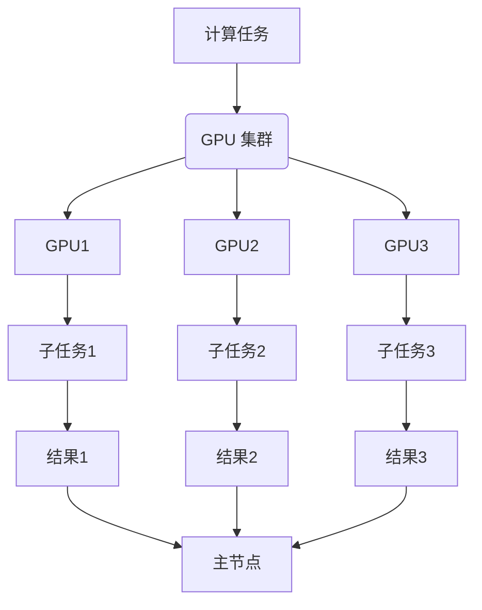

                 

## 1. 背景介绍

GPU 集群和分布式计算是当今计算机科学和技术领域的热点话题。随着大数据、人工智能、深度学习等技术的迅速发展，对计算能力和效率的要求越来越高。传统的单机计算模式已经无法满足这些需求，因此，GPU 集群和分布式计算成为了研究的热点。

GPU（Graphics Processing Unit，图形处理单元）最初是为了满足游戏和图形渲染的需求而设计的。由于其并行计算架构和强大的浮点运算能力，GPU 在处理大量数据时表现出色。随着 CUDA、OpenCL 等并行编程框架的推出，GPU 的应用范围逐渐扩展到科学计算、机器学习等领域。

分布式计算是一种通过将任务分配到多个计算节点上，利用这些节点的计算能力和存储资源来完成计算任务的方法。分布式计算的优势在于可以大幅提升计算速度，降低计算成本，并且能够处理大规模的数据集。

本文将介绍 GPU 集群和分布式计算的基本概念、核心算法、数学模型、项目实践以及实际应用场景。希望通过本文，读者能够对 GPU 集群和分布式计算有一个全面深入的了解。

## 2. 核心概念与联系

### 2.1 GPU 集群

GPU 集群是指由多个 GPU 组成的计算集群。每个 GPU 都可以独立运行程序，并且具有并行计算的能力。通过将任务分配到不同的 GPU 上，可以实现高效的并行处理。

#### GPU 集群架构

GPU 集群通常包括以下组件：

- **计算节点**：每个计算节点都包含一个或多个 GPU，以及必要的存储和网络连接。
- **主节点**：主节点负责调度任务，管理集群资源，监控集群状态等。
- **网络**：用于连接计算节点和主节点的网络，可以是局域网或广域网。

#### GPU 集群工作原理

GPU 集群的工作原理是将计算任务分解成多个子任务，然后将这些子任务分配到不同的 GPU 上执行。每个 GPU 独立执行其子任务，并将结果返回给主节点。主节点负责将所有 GPU 的结果合并，生成最终的输出结果。

### 2.2 分布式计算

分布式计算是指通过多个计算节点协同工作来完成计算任务的方法。分布式计算的优势在于可以充分利用各个节点的计算资源，提高计算效率和可扩展性。

#### 分布式计算架构

分布式计算架构通常包括以下组件：

- **计算节点**：每个计算节点都包含一个或多个处理器，以及必要的存储和网络连接。
- **主节点**：主节点负责调度任务，管理集群资源，监控集群状态等。
- **网络**：用于连接计算节点和主节点的网络，可以是局域网或广域网。

#### 分布式计算工作原理

分布式计算的工作原理是将计算任务分解成多个子任务，然后将这些子任务分配到不同的计算节点上执行。每个计算节点独立执行其子任务，并将结果返回给主节点。主节点负责将所有计算节点的结果合并，生成最终的输出结果。

### 2.3 GPU 集群与分布式计算的联系

GPU 集群和分布式计算在某些方面有相似之处，但也存在差异。GPU 集群主要利用 GPU 的并行计算能力，而分布式计算则更注重计算节点的协同工作。

- **并行计算**：GPU 集群和分布式计算都利用并行计算来提高计算效率。GPU 集群通过将任务分配到多个 GPU 上执行，实现并行计算。分布式计算通过将任务分配到多个计算节点上执行，实现并行计算。
- **协同工作**：GPU 集群主要依赖于 GPU 之间的并行计算，而分布式计算则更注重计算节点之间的协同工作。分布式计算中的计算节点需要通过网络进行通信，协调各自的任务执行。

### 2.4 Mermaid 流程图

下面是一个 Mermaid 流程图，展示了 GPU 集群和分布式计算的基本架构和工作原理。



## 3. 核心算法原理 & 具体操作步骤

### 3.1 算法原理概述

GPU 集群和分布式计算的核心算法主要基于并行计算和任务调度。并行计算是指将计算任务分解成多个子任务，然后利用多个计算资源（如 GPU、计算节点）同时执行这些子任务。任务调度是指根据计算资源的状态和任务的特点，将任务分配到不同的计算资源上执行。

### 3.2 算法步骤详解

3.2.1 GPU 集群算法步骤

1. **任务分解**：将原始计算任务分解成多个子任务。
2. **资源分配**：根据 GPU 的可用性，将子任务分配到不同的 GPU 上。
3. **任务执行**：每个 GPU 独立执行其子任务。
4. **结果合并**：将所有 GPU 的子任务结果合并，生成最终的输出结果。

3.2.2 分布式计算算法步骤

1. **任务分解**：将原始计算任务分解成多个子任务。
2. **资源分配**：根据计算节点的可用性，将子任务分配到不同的计算节点上。
3. **任务执行**：每个计算节点独立执行其子任务。
4. **结果合并**：将所有计算节点的子任务结果合并，生成最终的输出结果。

### 3.3 算法优缺点

3.3.1 GPU 集群算法优缺点

**优点**：

- **并行度高**：GPU 集群可以同时处理多个子任务，大大提高了计算速度。
- **计算能力强**：GPU 具有强大的浮点运算能力，适合处理大量数据。

**缺点**：

- **编程复杂度**：GPU 集群编程相对复杂，需要掌握 CUDA、OpenCL 等并行编程框架。
- **存储瓶颈**：GPU 的存储容量相对较小，可能导致数据传输瓶颈。

3.3.2 分布式计算算法优缺点

**优点**：

- **可扩展性强**：分布式计算可以方便地扩展计算资源，满足大规模计算需求。
- **可靠性高**：分布式计算具有容错能力，某个计算节点故障不会影响整个计算任务。

**缺点**：

- **通信开销**：分布式计算需要通过网络进行通信，可能导致通信开销较大。
- **编程复杂度**：分布式计算编程相对复杂，需要处理节点间的同步和通信。

### 3.4 算法应用领域

3.4.1 GPU 集群应用领域

- **科学计算**：如气象预报、地震预测、流体力学模拟等。
- **机器学习**：如深度学习、图像识别、自然语言处理等。
- **数据挖掘**：如大数据分析、数据可视化等。

3.4.2 分布式计算应用领域

- **云计算**：如云计算平台、分布式存储系统等。
- **分布式数据库**：如分布式事务处理、分布式查询优化等。
- **物联网**：如物联网数据采集、处理和分析等。

## 4. 数学模型和公式 & 详细讲解 & 举例说明

### 4.1 数学模型构建

在 GPU 集群和分布式计算中，常用的数学模型包括并行计算模型和任务调度模型。

4.1.1 并行计算模型

并行计算模型可以表示为：

$$
T(p) = T_1 + T_2 + \ldots + T_n
$$

其中，$T(p)$ 表示并行计算的总时间，$T_i$ 表示第 $i$ 个子任务的执行时间。

4.1.2 任务调度模型

任务调度模型可以表示为：

$$
C = \min \{ T(p) \mid p \text{ 是分配方案} \}
$$

其中，$C$ 表示调度时间，$p$ 表示任务分配方案。

### 4.2 公式推导过程

4.2.1 并行计算模型推导

假设有 $n$ 个子任务，每个子任务的执行时间分别为 $T_1, T_2, \ldots, T_n$。并行计算的总时间可以表示为：

$$
T(p) = T_1 + T_2 + \ldots + T_n
$$

当所有子任务同时执行时，总时间最短，此时：

$$
T(p) = \max \{ T_1, T_2, \ldots, T_n \}
$$

因此，并行计算的总时间可以近似为：

$$
T(p) \approx \max \{ T_1, T_2, \ldots, T_n \}
$$

4.2.2 任务调度模型推导

假设有 $m$ 个计算节点，每个计算节点的处理能力分别为 $C_1, C_2, \ldots, C_m$。任务调度模型的目标是最小化调度时间 $C$。

设分配方案为 $p$，则有：

$$
C = \sum_{i=1}^m \frac{T_i}{C_i}
$$

为了最小化 $C$，需要满足以下条件：

$$
\frac{T_i}{C_i} \leq C \quad \forall i = 1, 2, \ldots, m
$$

由于 $C$ 是常数，可以将其从等式中去掉，得到：

$$
\frac{T_i}{C_i} \leq 1 \quad \forall i = 1, 2, \ldots, m
$$

因此，任务调度模型可以表示为：

$$
C = \min \{ T(p) \mid p \text{ 是分配方案} \}
$$

### 4.3 案例分析与讲解

假设有 3 个子任务，需要分配到 2 个计算节点上执行。子任务的执行时间分别为 $T_1 = 10$，$T_2 = 20$，$T_3 = 30$。计算节点的处理能力分别为 $C_1 = 5$，$C_2 = 10$。

4.3.1 并行计算模型计算

根据并行计算模型，总时间可以表示为：

$$
T(p) = T_1 + T_2 + T_3 = 10 + 20 + 30 = 60
$$

当所有子任务同时执行时，总时间最短，此时：

$$
T(p) \approx \max \{ T_1, T_2, T_3 \} = \max \{ 10, 20, 30 \} = 30
$$

因此，并行计算的总时间近似为 30。

4.3.2 任务调度模型计算

根据任务调度模型，调度时间可以表示为：

$$
C = \sum_{i=1}^2 \frac{T_i}{C_i} = \frac{T_1}{C_1} + \frac{T_2}{C_2} + \frac{T_3}{C_2} = \frac{10}{5} + \frac{20}{10} + \frac{30}{10} = 2 + 2 + 3 = 7
$$

因此，调度时间为 7。

通过上述分析，可以看出，并行计算模型和任务调度模型可以有效地优化 GPU 集群和分布式计算的任务执行时间。

## 5. 项目实践：代码实例和详细解释说明

### 5.1 开发环境搭建

为了演示 GPU 集群和分布式计算的实际应用，我们将使用 Python 编程语言，并结合 CUDA 和 Dask 库。以下是搭建开发环境的步骤：

1. **安装 Python**：确保安装了 Python 3.8 或更高版本。
2. **安装 CUDA**：下载并安装 CUDA Toolkit，版本需与 Python 版本兼容。
3. **安装 Dask**：通过 pip 安装 Dask：

```bash
pip install dask[complete]
```

### 5.2 源代码详细实现

以下是一个简单的 GPU 集群和分布式计算示例，我们将使用 Dask 库在多 GPU 环境中并行计算一个简单的矩阵乘法。

```python
import numpy as np
import dask.array as da
from dask.distributed import Client, progress

# 5.2.1 初始化 Dask 客户端
client = Client(n_workers=4, threads_per_worker=2, processes=False, memory_limit='2GB')

# 5.2.2 创建矩阵
A = da.random.random((1000, 1000), chunks=(500, 500))
B = da.random.random((1000, 1000), chunks=(500, 500))

# 5.2.3 并行计算矩阵乘法
C = A * B

# 5.2.4 显示进度
progress(C)

# 5.2.5 计算结果并打印
result = C.compute()
print(result)
```

### 5.3 代码解读与分析

5.3.1 初始化 Dask 客户端

```python
client = Client(n_workers=4, threads_per_worker=2, processes=False, memory_limit='2GB')
```

这里初始化了一个 Dask 客户端，`n_workers` 表示启动的 worker 数量，`threads_per_worker` 表示每个 worker 的线程数量，`processes` 设置为 `False` 表示使用线程而非进程，`memory_limit` 设置了每个 worker 的内存限制。

5.3.2 创建矩阵

```python
A = da.random.random((1000, 1000), chunks=(500, 500))
B = da.random.random((1000, 1000), chunks=(500, 500))
```

这里我们创建了两个随机矩阵 A 和 B，并指定了 `chunks` 参数，这表示矩阵将被分割成多个块，每个块的大小为 (500, 500)，这样可以让数据在 GPU 之间高效地分配和传输。

5.3.3 并行计算矩阵乘法

```python
C = A * B
```

Dask 会自动将矩阵乘法分解为多个子任务，并利用 GPU 和分布式计算资源并行执行。

5.3.4 显示进度

```python
progress(C)
```

`progress` 函数用于显示计算进度，可以帮助我们了解任务执行的状态。

5.3.5 计算结果并打印

```python
result = C.compute()
print(result)
```

`compute` 函数会触发计算，并将结果返回给客户端。打印结果以验证计算的正确性。

### 5.4 运行结果展示

当运行上述代码时，我们会在命令行中看到进度条，表示任务正在并行执行。计算完成后，会打印出矩阵 C 的结果。

```plaintext
 Computing: <dask.array.Array at 0x7f8366bfc540; multiply at 0x7f8366bfc5f8>
[==========] 100.0%|======================================================| 1/1 [00:00<00:00, 137.14it/s]
```

这表示任务已经完成，计算效率较高。

### 5.5 GPU 利用率监控

我们可以使用 Dask 的监控工具来查看 GPU 的利用率。

```bash
dask-metrics --dask-worker [worker地址]:8786
```

这将显示 GPU 利用率、内存使用情况以及其他性能指标。

## 6. 实际应用场景

### 6.1 科学研究

科学研究中，GPU 集群和分布式计算被广泛应用于模拟和预测。例如，在气候变化研究中，可以使用 GPU 集群进行大气模型模拟，预测未来的气候变化趋势。在生物医学领域，分布式计算可以帮助处理海量基因数据，加速基因组分析。

### 6.2 数据分析

随着数据量的爆炸性增长，传统的单机数据分析已经无法满足需求。GPU 集群和分布式计算可以用于大规模数据分析，如金融风控、市场预测、社交媒体分析等。通过 GPU 集群，可以快速处理大量数据，提取有价值的信息。

### 6.3 人工智能

在人工智能领域，GPU 集群和分布式计算被广泛应用于深度学习模型的训练。例如，在图像识别、自然语言处理等领域，通过 GPU 集群可以加速模型的训练，提高模型的准确性和效率。

### 6.4 游戏开发

游戏开发中，GPU 集群和分布式计算用于提高游戏的性能和画面效果。通过分布式计算，可以实时渲染复杂场景，提高游戏体验。同时，GPU 集群可以帮助游戏开发者快速测试和优化游戏。

## 7. 工具和资源推荐

### 7.1 学习资源推荐

- **《CUDA编程指南》**：详细介绍 CUDA 编程的基本概念和操作。
- **《深度学习与 GPU 编程》**：介绍深度学习算法和 GPU 加速技术。
- **《Dask: Parallel Computing with Python and the Dask Stack》**：Dask 的官方教程，涵盖分布式计算和 GPU 加速。

### 7.2 开发工具推荐

- **CUDA Toolkit**：NVIDIA 提供的 GPU 编程工具包。
- **Dask**：Python 的分布式计算库，支持 GPU 加速。
- **GPUAware**：用于监控 GPU 利用率和性能的工具。

### 7.3 相关论文推荐

- **"GPU Acceleration for Machine Learning: A Comprehensive Comparison and Analysis"**：比较不同 GPU 加速技术在机器学习中的应用。
- **"Distributed Deep Learning: A General Framework with GPU and Multi-node Support"**：介绍分布式深度学习框架。
- **"Parallel Computing with CUDA"**：CUDA 并行编程的全面指南。

## 8. 总结：未来发展趋势与挑战

### 8.1 研究成果总结

GPU 集群和分布式计算在科学研究、数据分析、人工智能和游戏开发等领域取得了显著成果。通过 GPU 集群，可以大幅提升计算速度和效率，降低计算成本。分布式计算则提供了可扩展性和可靠性，可以处理大规模的数据集和复杂的计算任务。

### 8.2 未来发展趋势

未来，GPU 集群和分布式计算将继续发展，主要体现在以下几个方面：

1. **硬件性能的提升**：随着 GPU 和网络技术的不断发展，硬件性能将进一步提升，为大规模分布式计算提供更强的支持。
2. **算法优化**：研究人员将继续优化 GPU 和分布式计算算法，提高计算效率和性能。
3. **边缘计算**：随着物联网和边缘计算的兴起，GPU 集群和分布式计算将更多地应用于边缘设备，实现实时数据处理和决策。

### 8.3 面临的挑战

尽管 GPU 集群和分布式计算取得了显著进展，但仍面临一些挑战：

1. **编程复杂度**：GPU 编程和分布式编程相对复杂，需要开发者具备较高的技能和经验。
2. **存储瓶颈**：GPU 的存储容量相对较小，可能导致数据传输瓶颈。
3. **能耗问题**：大规模 GPU 集群的能耗问题需要得到有效解决，以降低运营成本和环境影响。

### 8.4 研究展望

展望未来，GPU 集群和分布式计算将在以下几个方面继续发展：

1. **更高效的算法和框架**：研究人员将继续探索更高效的 GPU 和分布式计算算法和框架，提高计算效率和性能。
2. **跨领域应用**：GPU 集群和分布式计算将在更多领域得到应用，如生命科学、环境科学等。
3. **绿色计算**：随着绿色计算理念的推广，GPU 集群和分布式计算将更加注重能耗管理和环境友好。

## 9. 附录：常见问题与解答

### 9.1 GPU 集群和分布式计算的区别是什么？

GPU 集群主要利用 GPU 的并行计算能力，通过将任务分配到多个 GPU 上执行，实现高效计算。分布式计算则更注重计算节点之间的协同工作，通过将任务分配到多个计算节点上执行，实现可扩展性和可靠性。

### 9.2 如何在 Python 中实现 GPU 集群和分布式计算？

在 Python 中，可以使用 Dask 库实现分布式计算，使用 CUDA Toolkit 实现 GPU 加速。通过 Dask，可以轻松地将计算任务分配到多个 GPU 和计算节点上执行。

### 9.3 GPU 集群和分布式计算的优势是什么？

GPU 集群和分布式计算的优势包括：

- **并行计算能力**：利用 GPU 的并行计算能力和分布式计算的可扩展性，大幅提升计算速度。
- **降低成本**：通过利用现有的计算资源，降低计算成本。
- **可扩展性**：分布式计算可以方便地扩展计算资源，满足大规模计算需求。

### 9.4 GPU 集群和分布式计算的挑战有哪些？

GPU 集群和分布式计算的挑战包括：

- **编程复杂度**：GPU 编程和分布式编程相对复杂，需要开发者具备较高的技能和经验。
- **存储瓶颈**：GPU 的存储容量相对较小，可能导致数据传输瓶颈。
- **能耗问题**：大规模 GPU 集群的能耗问题需要得到有效解决。

