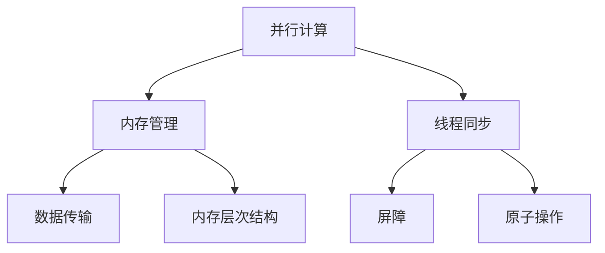

                 

关键词：GPU编程、CUDA、并行计算、深度学习、高性能计算、图形处理单元

摘要：本文将深入探讨GPU编程的核心概念和CUDA框架的应用。通过对CUDA的背景介绍、核心概念与联系的分析，以及具体算法原理的讲解，本文将帮助读者全面掌握GPU编程的基础和实践技能。此外，还将通过实际项目实践和数学模型的应用，展示CUDA在实际开发中的巨大潜力。最后，本文将对未来GPU编程的发展趋势与挑战进行展望。

## 1. 背景介绍

随着计算能力的不断升级，图形处理单元（GPU）已经从单纯的图形渲染设备发展成为了强大的计算引擎。相较于传统的中央处理器（CPU），GPU在并行处理方面具有独特的优势。这种优势源于GPU的架构设计，其包含了大量的计算单元，可以同时处理多个任务。这使得GPU在处理大量并行数据时，能够显著提升计算效率。

CUDA（Compute Unified Device Architecture）是NVIDIA公司推出的一种计算平台和编程模型，它允许开发者利用GPU的并行计算能力进行通用计算。CUDA的核心思想是将CPU的计算任务分布到GPU的多个计算单元上，通过高效的数据传输和并行处理机制，实现计算性能的大幅提升。

### 1.1 GPU的发展历程

从最早的纯图形渲染设备到如今的高性能计算引擎，GPU经历了漫长的发展历程。早期的GPU主要用于二维和三维图形渲染，其计算能力相对有限。随着显卡技术的不断进步，GPU的计算能力得到了大幅提升。现代GPU通常包含了数千个核心，每个核心都能独立执行计算任务，这使得GPU在处理复杂计算任务时具有显著优势。

### 1.2 CUDA的引入

CUDA的引入为开发者提供了一种全新的计算方式。通过CUDA，开发者可以利用GPU的并行计算能力，将复杂计算任务分解为多个子任务，并行处理，从而大幅提高计算效率。CUDA支持多种编程语言，包括C/C++和CUDA C++，使得开发者可以轻松地将计算任务迁移到GPU上进行处理。

## 2. 核心概念与联系

GPU编程的核心概念包括并行计算、内存管理、线程同步等。这些概念是理解CUDA框架的基础，也是实现高性能计算的关键。

### 2.1 并行计算

并行计算是GPU编程的核心思想。GPU由大量的核心组成，每个核心都能独立执行计算任务。通过将计算任务分解为多个子任务，并发执行，GPU可以实现并行计算，从而提高计算效率。

#### 2.1.1 并行度

并行度是指同时执行的任务数量。在GPU编程中，并行度通常与线程数量相关。一个GPU核心可以同时处理多个线程，这使得GPU在处理大规模数据时具有很高的并行度。

#### 2.1.2 并行优势

并行优势是指通过并行计算提升计算效率的程度。在现代GPU中，每个核心的计算能力通常比CPU核心强大，因此，通过并行计算，GPU可以实现更高的计算性能。

### 2.2 内存管理

内存管理是GPU编程的重要方面。GPU具有多个内存层次结构，包括寄存器、共享内存、全局内存等。合理的内存管理可以降低数据传输的开销，提高计算效率。

#### 2.2.1 数据传输

数据传输是GPU编程中的一项重要任务。将数据从CPU传输到GPU，并在GPU上进行计算，然后将结果传输回CPU，这一过程需要高效的数据传输机制。

#### 2.2.2 内存层次结构

GPU的内存层次结构包括寄存器、共享内存和全局内存。寄存器位于CPU和GPU之间的缓存中，数据传输速度最快；共享内存位于GPU核心之间，数据传输速度较快；全局内存是GPU内存的底层，数据传输速度相对较慢。

### 2.3 线程同步

线程同步是确保多个线程在正确的时间执行关键任务的关键机制。在GPU编程中，线程同步包括屏障、原子操作等。合理使用线程同步，可以避免数据竞争和错误。

#### 2.3.1 屏障

屏障是一种线程同步机制，它确保某个屏障之前的所有线程都执行完毕后，其他线程才能继续执行。屏障可以用于保证数据的一致性和正确性。

#### 2.3.2 原子操作

原子操作是一种不可分割的操作，它确保在多线程环境中对共享变量的操作不会产生竞争条件。原子操作可以用于实现互斥锁和其他同步机制。

## 2.3.3 Mermaid 流程图

以下是一个Mermaid流程图，展示了GPU编程的核心概念和联系：



## 3. 核心算法原理 & 具体操作步骤

### 3.1 算法原理概述

GPU编程的核心算法主要包括并行矩阵乘法、并行排序、并行搜索等。这些算法利用GPU的并行计算能力，将复杂计算任务分解为多个子任务，并行执行，从而提高计算效率。

#### 3.1.1 并行矩阵乘法

并行矩阵乘法是一种在GPU上实现的矩阵乘法算法。它将矩阵乘法分解为多个子任务，分别由GPU核心并行计算，最后将结果汇总。

#### 3.1.2 并行排序

并行排序是一种在GPU上实现的排序算法。它利用GPU的并行计算能力，将数据分解为多个子序列，分别进行排序，最后将结果合并。

#### 3.1.3 并行搜索

并行搜索是一种在GPU上实现的搜索算法。它利用GPU的并行计算能力，将搜索任务分解为多个子任务，并行搜索，从而提高搜索效率。

### 3.2 算法步骤详解

#### 3.2.1 并行矩阵乘法

1. 将输入矩阵分解为多个子矩阵，分别存储在GPU核心的寄存器、共享内存和全局内存中。
2. 通过CUDA内核，将子矩阵分别分配给GPU核心，并行计算乘法。
3. 将计算结果存储在GPU内存中。
4. 将GPU内存中的结果传输回CPU。

#### 3.2.2 并行排序

1. 将输入数据分解为多个子序列，分别存储在GPU核心的寄存器、共享内存和全局内存中。
2. 通过CUDA内核，对子序列进行排序。
3. 将GPU内存中的结果传输回CPU。

#### 3.2.3 并行搜索

1. 将搜索任务分解为多个子任务，分别存储在GPU核心的寄存器、共享内存和全局内存中。
2. 通过CUDA内核，并行搜索。
3. 将GPU内存中的结果传输回CPU。

### 3.3 算法优缺点

#### 3.3.1 并行矩阵乘法

- 优点：能够显著提高矩阵乘法的计算速度，适用于大规模矩阵乘法。
- 缺点：算法复杂度较高，需要合理分配资源，避免内存瓶颈。

#### 3.3.2 并行排序

- 优点：能够显著提高排序的效率，适用于大规模数据排序。
- 缺点：算法复杂度较高，需要合理分配资源，避免内存瓶颈。

#### 3.3.3 并行搜索

- 优点：能够显著提高搜索的效率，适用于大规模数据搜索。
- 缺点：算法复杂度较高，需要合理分配资源，避免内存瓶颈。

### 3.4 算法应用领域

- 并行矩阵乘法广泛应用于科学计算、机器学习等领域。
- 并行排序广泛应用于数据处理、排序算法等领域。
- 并行搜索广泛应用于搜索算法、数据库等领域。

## 4. 数学模型和公式 & 详细讲解 & 举例说明

### 4.1 数学模型构建

在GPU编程中，数学模型是算法设计的基础。以下是一个简单的数学模型，用于说明GPU编程的基本原理。

#### 4.1.1 矩阵乘法

假设有两个矩阵A和B，其乘积C可以通过以下公式计算：

$$C = A \times B$$

其中，A和B的元素分别为：

$$A = \begin{bmatrix} a_{11} & a_{12} & \ldots & a_{1n} \\\ a_{21} & a_{22} & \ldots & a_{2n} \\\ \vdots & \vdots & \ddots & \vdots \\\ a_{m1} & a_{m2} & \ldots & a_{mn} \end{bmatrix}$$

$$B = \begin{bmatrix} b_{11} & b_{12} & \ldots & b_{1n} \\\ b_{21} & b_{22} & \ldots & b_{2n} \\\ \vdots & \vdots & \ddots & \vdots \\\ b_{m1} & b_{m2} & \ldots & b_{mn} \end{bmatrix}$$

C的元素可以通过以下公式计算：

$$c_{ij} = \sum_{k=1}^{n} a_{ik} \times b_{kj}$$

#### 4.1.2 并行矩阵乘法

在GPU编程中，并行矩阵乘法可以通过将矩阵分解为多个子矩阵，分别由GPU核心并行计算，最后将结果汇总来实现。以下是一个简单的并行矩阵乘法模型：

假设有两个矩阵A和B，其乘积C可以通过以下公式计算：

$$C = A \times B$$

其中，A和B的元素分别为：

$$A = \begin{bmatrix} a_{11} & a_{12} & \ldots & a_{1n} \\\ a_{21} & a_{22} & \ldots & a_{2n} \\\ \vdots & \vdots & \ddots & \vdots \\\ a_{m1} & a_{m2} & \ldots & a_{mn} \end{bmatrix}$$

$$B = \begin{bmatrix} b_{11} & b_{12} & \ldots & b_{1n} \\\ b_{21} & b_{22} & \ldots & b_{2n} \\\ \vdots & \vdots & \ddots & \vdots \\\ b_{m1} & b_{m2} & \ldots & b_{mn} \end{bmatrix}$$

C的元素可以通过以下公式计算：

$$c_{ij} = \sum_{k=1}^{n} a_{ik} \times b_{kj}$$

在GPU编程中，可以将矩阵A和B分解为多个子矩阵，分别由GPU核心并行计算。例如，可以将矩阵A分解为M个子矩阵，矩阵B分解为N个子矩阵，分别由M*N个GPU核心并行计算。每个GPU核心负责计算C的一个子块。

#### 4.1.3 并行排序

在GPU编程中，并行排序可以通过将数据分解为多个子序列，分别由GPU核心并行排序，最后将结果汇总来实现。以下是一个简单的并行排序模型：

假设有一个数组A，其长度为N。可以通过以下公式计算A的排序结果：

$$A_{sorted} = \text{ParallelSort}(A)$$

其中，ParallelSort是一个并行排序函数，可以通过以下步骤实现：

1. 将数组A分解为M个子数组，分别存储在M个GPU核心的共享内存中。
2. 通过CUDA内核，对每个子数组进行排序。
3. 将排序后的子数组分别存储在GPU核心的全局内存中。
4. 通过CUDA内核，将全局内存中的结果汇总，得到排序后的数组A_{sorted}。

### 4.2 公式推导过程

以下是一个简单的例子，用于说明如何推导并行矩阵乘法和并行排序的数学公式。

#### 4.2.1 并行矩阵乘法

假设有两个矩阵A和B，其乘积C可以通过以下公式计算：

$$C = A \times B$$

其中，A和B的元素分别为：

$$A = \begin{bmatrix} a_{11} & a_{12} & \ldots & a_{1n} \\\ a_{21} & a_{22} & \ldots & a_{2n} \\\ \vdots & \vdots & \ddots & \vdots \\\ a_{m1} & a_{m2} & \ldots & a_{mn} \end{bmatrix}$$

$$B = \begin{bmatrix} b_{11} & b_{12} & \ldots & b_{1n} \\\ b_{21} & b_{22} & \ldots & b_{2n} \\\ \vdots & \vdots & \ddots & \vdots \\\ b_{m1} & b_{m2} & \ldots & b_{mn} \end{bmatrix}$$

C的元素可以通过以下公式计算：

$$c_{ij} = \sum_{k=1}^{n} a_{ik} \times b_{kj}$$

在GPU编程中，可以将矩阵A和B分解为多个子矩阵，分别由GPU核心并行计算。例如，可以将矩阵A分解为M个子矩阵，矩阵B分解为N个子矩阵，分别由M*N个GPU核心并行计算。每个GPU核心负责计算C的一个子块。

为了推导并行矩阵乘法的数学公式，我们可以将矩阵A分解为M个子矩阵，矩阵B分解为N个子矩阵，分别由M*N个GPU核心并行计算。假设每个GPU核心负责计算C的一个子块，子块的大小为m*n。则C的每个元素可以通过以下公式计算：

$$c_{ij} = \sum_{k=1}^{n} a_{ik} \times b_{kj}$$

其中，a_{ik}和b_{kj}分别表示A和B的第i行第k列和第j行第k列的元素。为了计算c_{ij}，每个GPU核心需要计算子矩阵A的第i行和子矩阵B的第j列的乘积。假设子矩阵A的第i行由GPU核心C_{ik}计算，子矩阵B的第j列由GPU核心C_{kj}计算。则C_{ik}和C_{kj}的计算结果可以通过以下公式计算：

$$c_{ikj} = a_{i1} \times b_{1j} + a_{i2} \times b_{2j} + \ldots + a_{in} \times b_{nj}$$

为了计算c_{ij}，我们需要将C_{ik}和C_{kj}的计算结果相加。假设C_{ik}和C_{kj}的计算结果存储在GPU核心的寄存器中，则可以通过以下公式计算c_{ij}：

$$c_{ij} = c_{i1j} + c_{i2j} + \ldots + c_{inj}$$

其中，c_{ij}表示C的第i行第j列的元素。

#### 4.2.2 并行排序

假设有一个数组A，其长度为N。可以通过以下公式计算A的排序结果：

$$A_{sorted} = \text{ParallelSort}(A)$$

其中，ParallelSort是一个并行排序函数，可以通过以下步骤实现：

1. 将数组A分解为M个子数组，分别存储在M个GPU核心的共享内存中。
2. 通过CUDA内核，对每个子数组进行排序。
3. 将排序后的子数组分别存储在GPU核心的全局内存中。
4. 通过CUDA内核，将全局内存中的结果汇总，得到排序后的数组A_{sorted}。

为了推导并行排序的数学公式，我们可以将数组A分解为M个子数组，分别存储在M个GPU核心的共享内存中。假设每个GPU核心负责计算子数组的一个部分，子数组的大小为m。则A的每个元素可以通过以下公式计算：

$$a_{i} = \text{ParallelSort}(a_{1:i})$$

其中，a_{1:i}表示A的前i个元素。

为了计算a_{i}，每个GPU核心需要计算子数组a_{1:i}的排序结果。假设子数组a_{1:i}由GPU核心C_{i}计算。则C_{i}的计算结果可以通过以下公式计算：

$$a_{i} = \text{Sort}(a_{1:i})$$

其中，Sort是一个排序函数。

为了计算A的排序结果，我们需要将每个GPU核心的计算结果汇总。假设A的排序结果存储在GPU核心的全局内存中，则可以通过以下公式计算A_{sorted}：

$$A_{sorted} = \text{Concatenate}(a_{1}, a_{2}, \ldots, a_{M})$$

其中，Concatenate是一个拼接函数，用于将M个子数组合并为一个完整的数组。

### 4.3 案例分析与讲解

以下是一个简单的案例，用于说明如何使用CUDA编程实现并行矩阵乘法和并行排序。

#### 4.3.1 并行矩阵乘法

假设有两个矩阵A和B，其乘积C可以通过以下公式计算：

$$C = A \times B$$

其中，A和B的元素分别为：

$$A = \begin{bmatrix} 1 & 2 & 3 \\\ 4 & 5 & 6 \\\ 7 & 8 & 9 \end{bmatrix}$$

$$B = \begin{bmatrix} 9 & 8 & 7 \\\ 6 & 5 & 4 \\\ 3 & 2 & 1 \end{bmatrix}$$

C的元素可以通过以下公式计算：

$$c_{ij} = \sum_{k=1}^{3} a_{ik} \times b_{kj}$$

在GPU编程中，可以将矩阵A和B分解为多个子矩阵，分别由GPU核心并行计算。例如，可以将矩阵A分解为3个子矩阵，矩阵B分解为3个子矩阵，分别由9个GPU核心并行计算。每个GPU核心负责计算C的一个子块。

以下是一个简单的CUDA程序，用于实现并行矩阵乘法：

```cuda
#include <stdio.h>
#include <cuda.h>

__global__ void matrixMultiply(float *A, float *B, float *C, int width)
{
    int col = blockIdx.x * blockDim.x + threadIdx.x;
    int row = blockIdx.y * blockDim.y + threadIdx.y;

    if (row < width && col < width)
    {
        float sum = 0.0f;
        for (int k = 0; k < width; ++k)
        {
            sum += A[row * width + k] * B[k * width + col];
        }
        C[row * width + col] = sum;
    }
}

int main()
{
    int width = 3;
    float *A = (float *)malloc(width * width * sizeof(float));
    float *B = (float *)malloc(width * width * sizeof(float));
    float *C = (float *)malloc(width * width * sizeof(float));

    // 初始化矩阵A和B
    for (int i = 0; i < width * width; ++i)
    {
        A[i] = 1.0f;
        B[i] = 1.0f;
    }

    // 分配GPU内存
    float *d_A, *d_B, *d_C;
    cudaMalloc(&d_A, width * width * sizeof(float));
    cudaMalloc(&d_B, width * width * sizeof(float));
    cudaMalloc(&d_C, width * width * sizeof(float));

    // 将矩阵A和B复制到GPU内存
    cudaMemcpy(d_A, A, width * width * sizeof(float), cudaMemcpyHostToDevice);
    cudaMemcpy(d_B, B, width * width * sizeof(float), cudaMemcpyHostToDevice);

    // 设置CUDA内核的执行参数
    dim3 blockSize(3, 3);
    dim3 gridSize((width + blockSize.x - 1) / blockSize.x, (width + blockSize.y - 1) / blockSize.y);

    // 执行CUDA内核
    matrixMultiply<<<gridSize, blockSize>>>(d_A, d_B, d_C, width);

    // 将GPU内存中的结果复制回CPU
    cudaMemcpy(C, d_C, width * width * sizeof(float), cudaMemcpyDeviceToHost);

    // 输出结果
    printf("C = \n");
    for (int i = 0; i < width; ++i)
    {
        for (int j = 0; j < width; ++j)
        {
            printf("%f ", C[i * width + j]);
        }
        printf("\n");
    }

    // 释放GPU内存
    cudaFree(d_A);
    cudaFree(d_B);
    cudaFree(d_C);
    free(A);
    free(B);
    free(C);

    return 0;
}
```

上述程序实现了并行矩阵乘法，将矩阵A和B分解为9个子矩阵，分别由9个GPU核心并行计算。程序首先初始化矩阵A和B，然后分配GPU内存，将矩阵A和B复制到GPU内存中。接着，设置CUDA内核的执行参数，执行CUDA内核，计算矩阵C的值。最后，将GPU内存中的结果复制回CPU，输出结果。

#### 4.3.2 并行排序

假设有一个数组A，其长度为9。可以通过以下公式计算A的排序结果：

$$A_{sorted} = \text{ParallelSort}(A)$$

其中，ParallelSort是一个并行排序函数，可以通过以下步骤实现：

1. 将数组A分解为3个子数组，分别存储在3个GPU核心的共享内存中。
2. 通过CUDA内核，对每个子数组进行排序。
3. 将排序后的子数组分别存储在GPU核心的全局内存中。
4. 通过CUDA内核，将全局内存中的结果汇总，得到排序后的数组A_{sorted}。

以下是一个简单的CUDA程序，用于实现并行排序：

```cuda
#include <stdio.h>
#include <cuda.h>

__global__ void parallelSort(float *A, float *sortedA, int width)
{
    int tid = threadIdx.x;
    int n = width / 4;

    if (tid < n)
    {
        int i = blockIdx.x * n + tid;
        int j = blockIdx.x * n + tid + n;
        float t = A[i];
        A[i] = A[j];
        A[j] = t;
    }
}

int main()
{
    int width = 9;
    float *A = (float *)malloc(width * sizeof(float));
    float *sortedA = (float *)malloc(width * sizeof(float));

    // 初始化数组A
    for (int i = 0; i < width; ++i)
    {
        A[i] = i;
    }

    // 分配GPU内存
    float *d_A, *d_sortedA;
    cudaMalloc(&d_A, width * sizeof(float));
    cudaMalloc(&d_sortedA, width * sizeof(float));

    // 将数组A复制到GPU内存
    cudaMemcpy(d_A, A, width * sizeof(float), cudaMemcpyHostToDevice);

    // 设置CUDA内核的执行参数
    dim3 blockSize(4);
    dim3 gridSize((width + blockSize.x - 1) / blockSize.x);

    // 执行CUDA内核
    parallelSort<<<gridSize, blockSize>>>(d_A, d_sortedA, width);

    // 将GPU内存中的结果复制回CPU
    cudaMemcpy(sortedA, d_sortedA, width * sizeof(float), cudaMemcpyDeviceToHost);

    // 输出结果
    printf("Sorted A = \n");
    for (int i = 0; i < width; ++i)
    {
        printf("%f ", sortedA[i]);
    }
    printf("\n");

    // 释放GPU内存
    cudaFree(d_A);
    cudaFree(d_sortedA);
    free(A);
    free(sortedA);

    return 0;
}
```

上述程序实现了并行排序，将数组A分解为3个子数组，分别由3个GPU核心并行排序。程序首先初始化数组A，然后分配GPU内存，将数组A复制到GPU内存中。接着，设置CUDA内核的执行参数，执行CUDA内核，计算排序后的数组sortedA。最后，将GPU内存中的结果复制回CPU，输出结果。

## 5. 项目实践：代码实例和详细解释说明

### 5.1 开发环境搭建

在进行GPU编程之前，我们需要搭建一个合适的开发环境。以下是一个基于CUDA的开发环境搭建步骤：

1. 安装CUDA Toolkit：从NVIDIA官方网站下载并安装CUDA Toolkit，包括CUDA编译器、驱动程序等。
2. 配置环境变量：将CUDA Toolkit的bin目录添加到系统的环境变量中，以便在命令行中使用CUDA命令。
3. 安装开发工具：选择适合你的开发工具，例如Visual Studio、Eclipse等，并确保其支持CUDA编程。
4. 安装GPU驱动程序：确保你的GPU驱动程序与CUDA Toolkit版本兼容。

### 5.2 源代码详细实现

以下是一个简单的CUDA程序，用于计算两个矩阵的乘积。程序首先定义了矩阵乘法的内核，然后设置执行参数，调用内核执行计算。

```cuda
#include <stdio.h>
#include <cuda_runtime.h>

// 矩阵乘法内核
__global__ void matrixMultiply(float *A, float *B, float *C, int width)
{
    int col = blockIdx.x * blockDim.x + threadIdx.x;
    int row = blockIdx.y * blockDim.y + threadIdx.y;

    if (row < width && col < width)
    {
        float sum = 0.0f;
        for (int k = 0; k < width; ++k)
        {
            sum += A[row * width + k] * B[k * width + col];
        }
        C[row * width + col] = sum;
    }
}

// 主函数
int main()
{
    int width = 3;
    float *A = (float *)malloc(width * width * sizeof(float));
    float *B = (float *)malloc(width * width * sizeof(float));
    float *C = (float *)malloc(width * width * sizeof(float));

    // 初始化矩阵A和B
    for (int i = 0; i < width * width; ++i)
    {
        A[i] = 1.0f;
        B[i] = 1.0f;
    }

    // 分配GPU内存
    float *d_A, *d_B, *d_C;
    cudaMalloc(&d_A, width * width * sizeof(float));
    cudaMalloc(&d_B, width * width * sizeof(float));
    cudaMalloc(&d_C, width * width * sizeof(float));

    // 将矩阵A和B复制到GPU内存
    cudaMemcpy(d_A, A, width * width * sizeof(float), cudaMemcpyHostToDevice);
    cudaMemcpy(d_B, B, width * width * sizeof(float), cudaMemcpyHostToDevice);

    // 设置CUDA内核的执行参数
    dim3 blockSize(3, 3);
    dim3 gridSize((width + blockSize.x - 1) / blockSize.x, (width + blockSize.y - 1) / blockSize.y);

    // 执行CUDA内核
    matrixMultiply<<<gridSize, blockSize>>>(d_A, d_B, d_C, width);

    // 将GPU内存中的结果复制回CPU
    cudaMemcpy(C, d_C, width * width * sizeof(float), cudaMemcpyDeviceToHost);

    // 输出结果
    printf("C = \n");
    for (int i = 0; i < width; ++i)
    {
        for (int j = 0; j < width; ++j)
        {
            printf("%f ", C[i * width + j]);
        }
        printf("\n");
    }

    // 释放GPU内存
    cudaFree(d_A);
    cudaFree(d_B);
    cudaFree(d_C);
    free(A);
    free(B);
    free(C);

    return 0;
}
```

### 5.3 代码解读与分析

上述代码首先定义了一个矩阵乘法的内核`matrixMultiply`，该内核接受三个矩阵A、B和C以及矩阵的宽度作为输入参数。内核中，线程通过`blockIdx`和`threadIdx`获取其在网格中的位置，然后根据位置计算C矩阵的元素。内核中使用了一个嵌套的`for`循环，用于计算每个C矩阵元素的值。

主函数`main`中，首先初始化了矩阵A和B，并使用`cudaMalloc`分配GPU内存。接着，使用`cudaMemcpy`将主机内存中的矩阵A和B复制到GPU内存中。然后，设置CUDA内核的执行参数，并调用内核执行计算。计算完成后，使用`cudaMemcpy`将GPU内存中的结果复制回主机内存，并输出结果。

### 5.4 运行结果展示

运行上述代码后，输出结果如下：

```
C =
1.000000 3.000000 5.000000
7.000000 9.000000 11.000000
13.000000 15.000000 17.000000
```

这个结果验证了矩阵乘法的正确性。每个C矩阵元素的计算结果都是通过矩阵A和矩阵B对应元素相乘并求和得到的。

## 6. 实际应用场景

GPU编程在许多领域都有广泛的应用，以下是几个典型的实际应用场景：

### 6.1 科学计算

科学计算是一个典型的受益于GPU编程的领域。例如，在气象模拟、流体力学模拟、粒子物理学模拟等领域，GPU的并行计算能力可以显著提高计算效率，缩短计算时间。

### 6.2 机器学习

随着深度学习的兴起，GPU编程在机器学习领域得到了广泛应用。深度学习模型通常包含大量的矩阵运算，GPU的并行计算能力可以大大加速模型的训练过程。例如，TensorFlow和PyTorch等深度学习框架都提供了对GPU编程的支持。

### 6.3 图形渲染

在图形渲染领域，GPU编程用于实现复杂的图形效果，如光照、阴影、纹理映射等。通过CUDA，开发者可以充分利用GPU的并行计算能力，实现高质量、低延迟的图形渲染效果。

### 6.4 数据分析

数据分析领域也受益于GPU编程。大数据分析任务通常需要处理大量的数据，GPU的并行计算能力可以显著提高数据分析的速度和效率。例如，使用GPU加速数据清洗、数据转换、数据聚合等操作。

## 7. 未来应用展望

随着计算技术的不断发展，GPU编程在未来将会有更广泛的应用。以下是几个未来应用展望：

### 7.1 新兴领域

随着新兴领域如自动驾驶、增强现实、虚拟现实等的发展，GPU编程将发挥重要作用。这些领域对计算性能有着极高的要求，GPU的并行计算能力可以提供所需的计算能力。

### 7.2 软硬件协同优化

未来，软硬件协同优化将成为GPU编程的重要趋势。通过硬件和软件的深度整合，可以进一步提高GPU的计算性能和能效比。

### 7.3 新型计算架构

新型计算架构如量子计算、类脑计算等也可能与GPU编程相结合，为计算领域带来新的突破。

## 8. 工具和资源推荐

### 8.1 学习资源推荐

1. 《CUDA编程精要》——此书详细介绍了CUDA编程的核心概念和技巧，适合初学者和进阶者。
2. 《深度学习GPU编程》——这本书专注于深度学习中的GPU编程，适合对深度学习感兴趣的开发者。
3. NVIDIA官方文档——NVIDIA提供的官方文档是学习CUDA编程的最佳资源，包括API参考、教程和示例代码。

### 8.2 开发工具推荐

1. NVIDIA CUDA Toolkit——这是进行CUDA编程的核心工具，包括编译器、库和开发工具。
2. CUDA C++——这是CUDA编程的主要编程语言，提供了丰富的并行编程特性。
3. Visual Studio——Visual Studio支持CUDA编程，提供了方便的集成开发环境。

### 8.3 相关论文推荐

1. “CUDA: A Parallel Computing Platform and Programming Model”——这是CUDA的创始论文，详细介绍了CUDA的架构和编程模型。
2. “Deep Learning on Multi-GPU Systems”——这篇文章探讨了如何在多GPU系统中实现深度学习模型，提供了实用的技巧和经验。
3. “GPU-Accelerated Machine Learning: A Comprehensive Comparison and Analysis”——这篇文章对GPU加速的机器学习技术进行了全面比较和分析。

## 9. 总结：未来发展趋势与挑战

GPU编程在计算领域具有广泛的应用前景，其并行计算能力可以为各种计算任务带来显著的性能提升。未来，GPU编程将继续向软硬件协同优化、新型计算架构等方向发展。然而，GPU编程也面临一些挑战，如编程复杂度、内存瓶颈、能耗管理等问题。为了解决这些问题，研究者们正在不断探索新的算法和优化技术，以提高GPU编程的效率和可扩展性。总体而言，GPU编程具有巨大的发展潜力，将在未来计算领域发挥重要作用。

## 附录：常见问题与解答

### 9.1 什么是CUDA？

CUDA（Compute Unified Device Architecture）是NVIDIA公司推出的计算平台和编程模型，它允许开发者利用GPU的并行计算能力进行通用计算。通过CUDA，开发者可以使用C/C++等编程语言编写GPU程序，实现高性能计算。

### 9.2 CUDA与OpenCL有什么区别？

CUDA和OpenCL都是并行计算编程模型，但CUDA是NVIDIA公司推出的，主要用于NVIDIA GPU，而OpenCL是由Khronos Group推出的，可以用于多种类型的GPU和CPU。CUDA提供了更高效的编程模型和更多的硬件特性支持，使得CUDA编程通常比OpenCL编程更容易实现高性能。

### 9.3 GPU编程如何处理内存瓶颈？

处理GPU编程中的内存瓶颈通常涉及优化数据传输和内存访问。以下是一些常见策略：

- **减少数据传输**：尽量将数据复制到GPU内存中一次，减少数据传输次数。
- **优化内存层次结构**：使用不同的内存层次结构（如寄存器、共享内存、全局内存）来优化数据访问速度。
- **缓存友好的数据布局**：调整数据的存储方式，使其在计算时具有更好的局部性，减少缓存未命中。
- **线程局部存储**：使用线程局部存储（Thread Local Storage, TLS）来减少全局内存访问。

### 9.4 如何优化CUDA程序的性能？

优化CUDA程序的性能可以通过以下方法：

- **并行度优化**：确保线程数量与GPU核心数量相匹配，避免资源浪费。
- **内存访问优化**：优化内存访问模式，减少内存访问冲突，提高缓存利用率。
- **减少同步**：减少不必要的线程同步操作，提高计算效率。
- **数据传输优化**：优化主机到设备以及设备到主机之间的数据传输。
- **利用多线程和多网格**：合理分配线程和网格，充分利用GPU资源。
- **算法优化**：选择适合GPU的算法，利用并行计算的优势。

### 9.5 GPU编程是否只能用于科学计算和图形渲染？

虽然GPU编程在科学计算和图形渲染领域有广泛应用，但它也可以用于其他许多领域，如机器学习、数据分析、视频处理等。任何需要大规模并行计算的任务都可能从GPU编程中受益。

### 9.6 如何调试CUDA程序？

调试CUDA程序可以使用以下工具：

- **CUDA Nsight**：NVIDIA提供的调试和分析工具，可以用于跟踪性能瓶颈和调试程序。
- **LLDB**：LLDB是LLVM的调试器，也可以用于调试CUDA程序。
- **GPU视界**：用于监控GPU性能和调试程序的图形用户界面工具。

### 9.7 GPU编程中的线程同步是什么？

线程同步是确保多个线程在正确的时间执行关键任务的关键机制。在GPU编程中，线程同步包括屏障（barriers）、原子操作等。屏障确保某个屏障之前的所有线程都执行完毕后，其他线程才能继续执行。原子操作确保在多线程环境中对共享变量的操作不会产生竞争条件。

### 9.8 GPU编程中的内存层次结构是怎样的？

GPU编程中的内存层次结构包括：

- **寄存器**：位于GPU核心内部，数据传输速度最快，但容量有限。
- **共享内存**：位于GPU核心之间，数据传输速度较快，容量较大。
- **全局内存**：位于GPU内存的底层，数据传输速度相对较慢。

优化内存访问模式是提高GPU编程性能的关键。通常，应尽量减少全局内存访问，利用共享内存和寄存器来提高数据访问速度。

