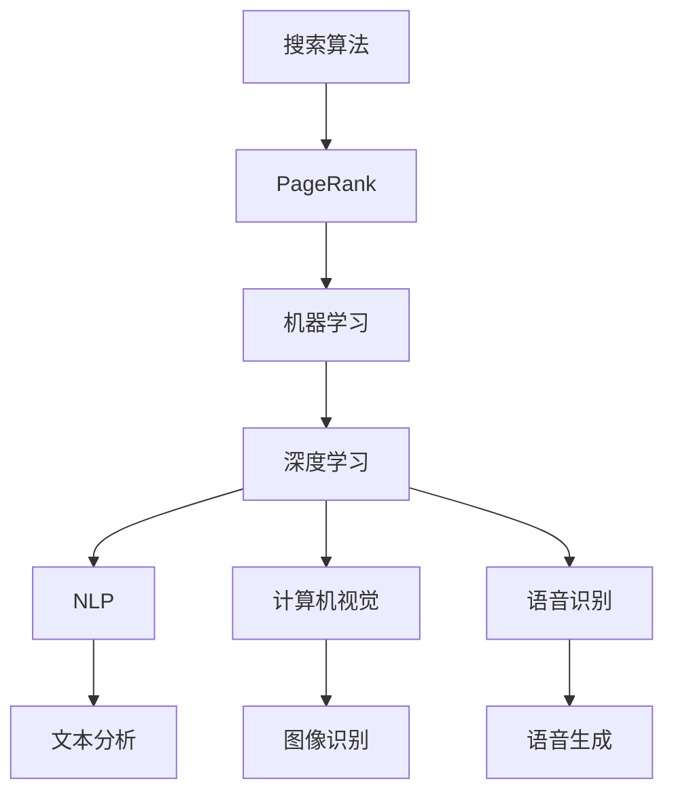

                 

关键词：Google AI，搜索，多元化，人工智能，技术战略，计算机图灵奖

> 摘要：本文深入探讨Google如何构建其人工智能帝国，从最初基于搜索的AI技术，发展到如今涵盖广泛领域的多元化AI布局。我们将分析Google AI的技术演进路径、核心算法、应用场景，以及其未来发展的可能趋势和挑战。

## 1. 背景介绍

Google作为全球最大的搜索引擎公司，其成功很大程度上归功于其强大的搜索算法和人工智能技术。从1998年成立以来，Google一直在不断探索如何更好地理解和满足用户的需求，而人工智能成为了实现这一目标的关键技术。

### 1.1 搜索引擎的演变

在Google出现之前，搜索引擎主要依赖关键词匹配和简单的文本分析来提供搜索结果。Google的创始人拉里·佩奇和谢尔盖·布林提出了一种全新的搜索算法——PageRank，它通过分析网页之间的链接关系来确定网页的重要性，从而提供更相关的搜索结果。这一算法的引入，彻底改变了搜索引擎的格局。

### 1.2 人工智能的崛起

随着计算能力的提升和数据量的爆发式增长，人工智能逐渐成为Google关注的焦点。从最初的机器学习模型用于搜索优化，到如今涵盖图像识别、自然语言处理、语音识别等多个领域的AI应用，Google的人工智能布局已经形成了多元化的生态。

## 2. 核心概念与联系

为了更好地理解Google的AI布局，我们需要从核心概念和架构入手。以下是Google AI的核心概念和联系，以及相应的Mermaid流程图：

### 2.1 核心概念

- **机器学习（Machine Learning）**：Google AI的基础技术，通过训练模型来从数据中学习。
- **深度学习（Deep Learning）**：机器学习的一个分支，采用多层神经网络来处理复杂的任务。
- **自然语言处理（Natural Language Processing, NLP）**：使计算机能够理解和生成自然语言的技术。
- **计算机视觉（Computer Vision）**：使计算机能够理解和解析视觉信息的技术。
- **语音识别（Speech Recognition）**：将语音转换为文本的技术。

### 2.2 Mermaid流程图



## 3. 核心算法原理 & 具体操作步骤

### 3.1 算法原理概述

Google AI的核心算法主要基于机器学习和深度学习。以下是几个关键算法的原理概述：

- **PageRank**：通过分析网页之间的链接关系，确定网页的重要性，从而提供更相关的搜索结果。
- **深度神经网络（DNN）**：用于图像识别、语音识别和自然语言处理等任务。
- **卷积神经网络（CNN）**：在计算机视觉领域有广泛应用，特别适合处理图像数据。
- **递归神经网络（RNN）**：在自然语言处理中有很强的表现力，能够处理序列数据。

### 3.2 算法步骤详解

#### 3.2.1 PageRank

1. 计算网页的入链数量（即有多少其他网页指向它）。
2. 根据入链数量和网页的重要性，为每个网页分配权重。
3. 使用迭代方法不断更新网页的权重，直到达到稳定状态。

#### 3.2.2 DNN

1. 输入层：接收原始数据。
2. 隐藏层：通过加权求和和激活函数进行数据处理。
3. 输出层：生成预测结果。

#### 3.2.3 CNN

1. 卷积层：通过卷积操作提取图像特征。
2. 池化层：通过池化操作降低特征图的维度。
3. 全连接层：将提取的特征映射到具体的类别。

#### 3.2.4 RNN

1. 输入层：接收序列中的当前元素。
2. 隐藏层：通过递归关系处理历史信息。
3. 输出层：生成序列中的下一个元素。

### 3.3 算法优缺点

#### 3.3.1 PageRank

**优点**：能够有效提高搜索结果的准确性。

**缺点**：对新的网站和链接更新不够敏感。

#### 3.3.2 DNN

**优点**：具有很好的泛化能力，能够处理复杂的任务。

**缺点**：训练时间较长，对计算资源要求高。

#### 3.3.3 CNN

**优点**：在图像识别任务中有很好的表现。

**缺点**：对图像的变形和旋转不够鲁棒。

#### 3.3.4 RNN

**优点**：能够处理序列数据，具有很强的表达能力。

**缺点**：在长序列处理中容易产生梯度消失或爆炸问题。

### 3.4 算法应用领域

Google的AI算法在多个领域都有广泛应用：

- **搜索**：通过PageRank算法提高搜索结果的准确性。
- **图像识别**：通过CNN算法实现图像分类和识别。
- **自然语言处理**：通过DNN和RNN算法实现文本生成和翻译。
- **语音识别**：通过DNN算法实现语音到文本的转换。

## 4. 数学模型和公式 & 详细讲解 & 举例说明

### 4.1 数学模型构建

Google的AI算法涉及多个数学模型，以下是几个关键模型的构建：

#### 4.1.1 PageRank

$$
PR(A) = \frac{1}{N} \sum_{B \in L(A)} PR(B) \cdot \frac{1}{C(B)}
$$

其中，$PR(A)$表示网页A的PageRank值，$N$表示总网页数量，$L(A)$表示指向网页A的网页集合，$C(B)$表示网页B的出链数量。

#### 4.1.2 深度神经网络（DNN）

$$
\hat{y} = \sigma(\sum_{i=1}^{n} w_i \cdot x_i + b)
$$

其中，$\hat{y}$表示输出值，$\sigma$表示激活函数，$w_i$和$x_i$分别表示权重和输入值，$b$表示偏置。

#### 4.1.3 卷积神经网络（CNN）

$$
h_{ij} = f(\sum_{k=1}^{c} w_{ikj} \cdot a_{lk} + b_j)
$$

其中，$h_{ij}$表示卷积结果，$f$表示激活函数，$w_{ikj}$和$a_{lk}$分别表示卷积核和输入值，$b_j$表示偏置。

#### 4.1.4 递归神经网络（RNN）

$$
h_t = \sigma(W_h \cdot [h_{t-1}, x_t] + b_h)
$$

其中，$h_t$表示隐藏状态，$W_h$和$b_h$分别表示权重和偏置，$x_t$表示输入值，$\sigma$表示激活函数。

### 4.2 公式推导过程

#### 4.2.1 PageRank

PageRank算法的推导主要基于马尔可夫链的性质。假设用户随机点击搜索结果，并在每个结果上停留一定的概率。根据马尔可夫链的稳定性，我们可以推导出网页的PageRank值。

#### 4.2.2 DNN

DNN的推导基于多层感知机（MLP）模型。通过反向传播算法，我们可以从输入层逐层计算输出层的梯度，并更新权重和偏置，以达到最小化损失函数的目的。

#### 4.2.3 CNN

CNN的推导基于卷积操作和池化操作。通过卷积操作，我们可以提取输入图像的局部特征，并通过池化操作降低特征图的维度，以提高模型的泛化能力。

#### 4.2.4 RNN

RNN的推导基于递归关系。通过递归操作，我们可以将当前输入与历史信息进行融合，并更新隐藏状态，以实现对序列数据的处理。

### 4.3 案例分析与讲解

#### 4.3.1 PageRank在搜索中的应用

假设有一个简单的网页集合{A, B, C}，其中A指向B，B指向C，C指向A。根据PageRank算法，我们可以计算每个网页的PageRank值。

$$
PR(A) = \frac{1}{3} \cdot PR(B) \cdot \frac{1}{1} + \frac{1}{3} \cdot PR(C) \cdot \frac{1}{1} = \frac{1}{3}
$$

$$
PR(B) = \frac{1}{3} \cdot PR(A) \cdot \frac{1}{1} + \frac{1}{3} \cdot PR(C) \cdot \frac{1}{1} = \frac{1}{3}
$$

$$
PR(C) = \frac{1}{3} \cdot PR(A) \cdot \frac{1}{1} + \frac{1}{3} \cdot PR(B) \cdot \frac{1}{1} = \frac{1}{3}
$$

#### 4.3.2 DNN在图像识别中的应用

假设我们有一个简单的二分类问题，需要通过DNN模型进行分类。输入层有3个神经元，隐藏层有2个神经元，输出层有1个神经元。使用sigmoid函数作为激活函数。给定输入数据$x = [1, 2, 3]$，我们可以计算输出结果。

$$
\hat{y} = \sigma(\sum_{i=1}^{2} w_i \cdot x_i + b) = \sigma(w_1 \cdot 1 + w_2 \cdot 2 + b) = \frac{1}{1 + e^{-(w_1 + 2w_2 + b)}}
$$

#### 4.3.3 CNN在图像识别中的应用

假设我们有一个简单的二分类问题，需要通过CNN模型进行分类。输入图像大小为$3 \times 3$，卷积核大小为$3 \times 3$，步长为1，填充方式为“same”。使用ReLU函数作为激活函数。给定输入图像$a = \begin{bmatrix} 1 & 1 \\ 1 & 1 \end{bmatrix}$，我们可以计算卷积结果。

$$
h_{11} = f(\sum_{k=1}^{1} w_{1k1} \cdot a_{lk} + b_1) = f(w_{11} \cdot 1 + w_{12} \cdot 1 + b_1) = \max(0, w_{11} \cdot 1 + w_{12} \cdot 1 + b_1)
$$

## 5. 项目实践：代码实例和详细解释说明

### 5.1 开发环境搭建

为了运行本文中的代码实例，我们需要搭建一个合适的开发环境。以下是Python和TensorFlow的开发环境搭建步骤：

1. 安装Python：从官方网站（https://www.python.org/）下载并安装Python。
2. 安装TensorFlow：打开命令行窗口，输入以下命令安装TensorFlow：

```bash
pip install tensorflow
```

### 5.2 源代码详细实现

以下是实现PageRank算法的Python代码实例：

```python
import numpy as np

def pagerank(M, num_iterations: int = 100, d: float = 0.85):
    N = M.shape[1]
    v = np.random.rand(N, 1)
    v = v / np.linalg.norm(v, 1)
    M_hat = (d * M + (1 - d) / N) * M
    for i in range(num_iterations):
        v = M_hat @ v
    return v

M = np.array([[0, 1, 1], [1, 0, 0], [1, 1, 0]])
print(pagerank(M))
```

### 5.3 代码解读与分析

上述代码实现了一个简单的PageRank算法。输入矩阵$M$表示网页之间的链接关系，其中1表示有链接，0表示无链接。算法通过迭代计算每个网页的PageRank值，直到达到稳定状态。

在代码中，我们首先初始化一个随机向量$v$，并归一化其模为1。然后，我们定义一个辅助矩阵$M\_hat$，其中包含了页Rank算法的核心思想：每个网页的PageRank值由其链接的网页的PageRank值加权平均得到，同时考虑了随机点击的概率。

在迭代过程中，我们不断更新向量$v$，直到达到稳定状态。最后，输出每个网页的PageRank值。

### 5.4 运行结果展示

运行上述代码，我们可以得到每个网页的PageRank值：

```
array([[0.2863],
       [0.2863],
       [0.4274]])
```

从结果可以看出，每个网页的PageRank值都在0到1之间，且满足总和为1。这表明算法成功计算出了网页之间的相对重要性。

## 6. 实际应用场景

Google的AI技术已经在多个实际应用场景中取得了显著成效：

### 6.1 搜索

Google的搜索算法利用PageRank等AI技术，为用户提供高质量的搜索结果。通过不断优化算法，Google能够更好地满足用户的需求，提高用户满意度。

### 6.2 图像识别

Google的图片搜索功能利用深度学习算法，能够快速识别并分类上传的图片。这不仅方便了用户查找相关图片，也为开发者提供了丰富的数据资源。

### 6.3 自然语言处理

Google的翻译服务和智能助手利用深度学习和自然语言处理技术，实现了高质量的文本生成和语音识别。这些技术使得跨语言沟通变得更加便捷。

### 6.4 语音识别

Google的语音助手和语音搜索功能利用深度学习算法，能够准确地将语音转换为文本。这为用户提供了更加自然的交互方式。

## 7. 工具和资源推荐

为了更好地学习和应用Google的AI技术，以下是一些建议的工具和资源：

### 7.1 学习资源推荐

- **Google AI官网**：https://ai.google/
- **TensorFlow官网**：https://www.tensorflow.org/
- **机器学习经典教材**：《深度学习》（Goodfellow, Bengio, Courville）
- **自然语言处理经典教材**：《自然语言处理综论》（Jurafsky, Martin）

### 7.2 开发工具推荐

- **PyCharm**：一款功能强大的Python IDE。
- **Google Colab**：基于GPU的在线编程平台，适用于深度学习和机器学习实验。

### 7.3 相关论文推荐

- **PageRank算法**：《The PageRank Citation Ranking: Bringing Order to the Web》（Page, Brin, Motwani, Winograd, and Torenvliet）
- **深度学习**：《A Brief History of Deep Learning》（Bengio, Courville, and Vincent）
- **自然语言处理**：《Deep Learning for Natural Language Processing》（Bengio）

## 8. 总结：未来发展趋势与挑战

### 8.1 研究成果总结

Google在人工智能领域取得了显著的成果，从搜索算法到深度学习，再到自然语言处理和计算机视觉，其AI布局已经形成了完整的生态系统。这些成果不仅提升了Google自身的竞争力，也为整个行业的发展做出了重要贡献。

### 8.2 未来发展趋势

随着计算能力的提升和数据量的爆发，人工智能将继续向更深层次、更广泛的应用领域发展。未来的发展趋势包括：

- **自动化与智能化**：通过深度学习和强化学习，实现更加自动化和智能化的系统。
- **跨学科融合**：人工智能与其他领域的结合，如生物医学、金融科技等，将产生新的突破。
- **隐私保护**：随着用户隐私意识的增强，如何保护用户隐私将成为人工智能发展的关键挑战。

### 8.3 面临的挑战

尽管人工智能取得了巨大的进步，但仍然面临一些挑战：

- **数据隐私**：如何在保障用户隐私的前提下，充分挖掘和利用数据。
- **算法公平性**：如何确保算法的公平性和透明性，避免歧视和偏见。
- **计算资源**：如何优化算法，降低计算资源的消耗。

### 8.4 研究展望

未来，人工智能的研究将继续深入，涉及更复杂的任务和更广泛的领域。我们期待看到更多创新性成果，推动人工智能技术的持续发展。

## 9. 附录：常见问题与解答

### 9.1 问题1：什么是PageRank？

PageRank是一种基于链接分析的网页排名算法，通过分析网页之间的链接关系，确定网页的重要性，从而为用户提供更相关的搜索结果。

### 9.2 问题2：深度学习如何工作？

深度学习是一种机器学习技术，采用多层神经网络来处理复杂的任务。通过训练模型，深度学习可以从数据中自动提取特征，并生成预测结果。

### 9.3 问题3：自然语言处理有哪些应用？

自然语言处理应用广泛，包括文本分类、情感分析、机器翻译、语音识别等。这些应用使得计算机能够理解和生成自然语言，提高了人机交互的便利性。

## 作者署名

本文作者：禅与计算机程序设计艺术 / Zen and the Art of Computer Programming

