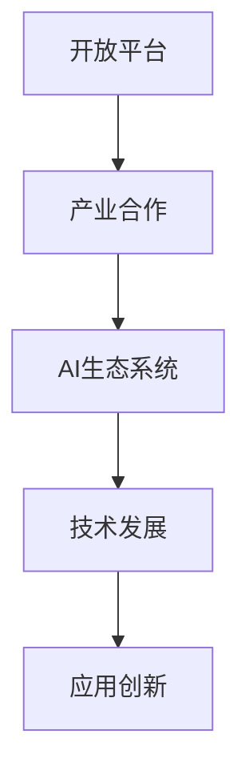

                 

关键词：Google AI，开放平台，产业合作，AI生态，技术战略，人工智能，开放源码，生态构建，生态系统，合作模式

## 摘要

本文旨在探讨Google在人工智能领域的发展战略，特别是其开放平台和产业合作的重要性。通过深入分析Google AI生态的架构、核心算法、应用场景以及数学模型，本文揭示了Google如何通过开放平台和产业合作，构建了一个强大的AI生态系统，并探讨了其在未来可能面临的发展趋势和挑战。

## 1. 背景介绍

在当今数字化时代，人工智能（AI）技术已经成为推动社会进步和经济发展的重要力量。Google作为全球领先的技术公司，其AI发展战略和生态构建策略尤为引人关注。Google的AI生态战略主要包括以下几个方面：

- 开源技术和开放平台：Google通过开源技术和开放平台，吸引了全球开发者和研究者的参与，共同推动AI技术的发展。
- 产业合作与生态构建：Google与各行各业的企业进行深度合作，共同构建AI生态系统，实现跨领域的创新和应用。
- 算法研发与应用：Google不断研发并应用最新的AI算法，提高AI系统的性能和效率，为用户提供更加智能和便捷的服务。

本文将围绕Google的AI生态战略，探讨其在开放平台和产业合作方面的具体实践和成果。

## 2. 核心概念与联系

### 2.1 开放平台

开放平台是指Google提供的面向开发者、研究者和企业的技术资源和服务，包括开源框架、开发工具、API接口等。开放平台的核心目标是通过资源共享和协作，促进AI技术的普及和创新。

### 2.2 产业合作

产业合作是指Google与各行各业的企业、研究机构、政府等合作伙伴建立合作关系，共同推动AI技术的发展和应用。产业合作的核心价值在于实现跨领域的资源整合和协同创新。

### 2.3 AI生态系统

AI生态系统是指由Google及其合作伙伴共同构建的AI技术生态，包括硬件、软件、数据、算法等多个方面。AI生态系统的核心功能是为用户提供全方位的AI服务，满足不同领域的应用需求。

### 2.4 Mermaid流程图



## 3. 核心算法原理 & 具体操作步骤

### 3.1 算法原理概述

Google AI的核心算法主要包括深度学习、自然语言处理、计算机视觉等方面。这些算法的基本原理是基于大规模数据训练模型，通过模型对数据进行分析和预测，从而实现智能化的功能。

### 3.2 算法步骤详解

1. 数据收集与处理：收集大量标注数据，对数据进行清洗和预处理，为模型训练提供高质量的数据输入。
2. 模型设计与训练：设计合适的模型架构，利用大规模数据进行模型训练，优化模型参数，提高模型性能。
3. 模型评估与优化：通过测试集对模型进行评估，针对评估结果对模型进行优化，提高模型泛化能力。
4. 模型部署与应用：将训练好的模型部署到实际应用场景中，为用户提供智能化的服务。

### 3.3 算法优缺点

优点：

- 高效：深度学习算法可以处理大规模数据，提高计算效率。
- 准确：基于大规模数据训练的模型具有更高的预测准确性。
- 自适应：模型可以根据新数据不断优化，提高性能。

缺点：

- 复杂：深度学习算法架构复杂，训练过程需要大量计算资源。
- 数据依赖：模型性能高度依赖数据质量，数据缺失或噪声可能导致模型失效。

### 3.4 算法应用领域

Google AI算法在多个领域具有广泛应用，包括：

- 自然语言处理：文本分类、机器翻译、情感分析等。
- 计算机视觉：图像识别、目标检测、图像生成等。
- 语音识别：语音合成、语音识别、语音翻译等。
- 推荐系统：个性化推荐、商品推荐、广告投放等。

## 4. 数学模型和公式 & 详细讲解 & 举例说明

### 4.1 数学模型构建

Google AI的数学模型主要包括神经网络、概率图模型、优化算法等。以下以神经网络为例进行讲解。

#### 4.1.1 神经网络模型

神经网络模型由多层神经元组成，包括输入层、隐藏层和输出层。神经元的激活函数通常采用Sigmoid函数或ReLU函数。

#### 4.1.2 前向传播与反向传播

- 前向传播：输入数据通过网络逐层传递，计算每个神经元的输出。
- 反向传播：根据输出误差，反向更新网络权重和偏置，优化模型参数。

#### 4.1.3 梯度下降算法

梯度下降算法是一种常用的优化算法，用于更新网络权重和偏置。具体步骤如下：

1. 计算损失函数关于参数的梯度。
2. 沿着梯度方向更新参数。
3. 重复上述步骤，直到收敛。

### 4.2 公式推导过程

$$
L = -\frac{1}{m} \sum_{i=1}^{m} [y_i \cdot \log(a^{(L)}_i) + (1 - y_i) \cdot \log(1 - a^{(L)}_i)]
$$

$$
\frac{\partial L}{\partial W^{(L)}_{ij}} = \frac{\partial L}{\partial a^{(L)}_i} \cdot \frac{\partial a^{(L)}_i}{\partial z^{(L)}_i} \cdot \frac{\partial z^{(L)}_i}{\partial W^{(L)}_{ij}}
$$

### 4.3 案例分析与讲解

以Google的BERT模型为例，介绍其数学模型和应用场景。

#### 4.3.1 模型架构

BERT（Bidirectional Encoder Representations from Transformers）模型是一种基于Transformer的预训练语言模型。其架构包括两个部分：编码器和解码器。

- 编码器：将输入的文本序列编码为向量表示。
- 解码器：根据编码器输出的向量表示，生成目标文本序列。

#### 4.3.2 预训练过程

- 预训练任务：BERT采用Masked Language Model（MLM）和Next Sentence Prediction（NSP）两种预训练任务。
- 优化目标：最小化预训练任务的损失函数。

#### 4.3.3 应用场景

BERT在多个自然语言处理任务中具有优异的性能，包括文本分类、问答系统、命名实体识别等。以下以文本分类为例进行讲解。

- 数据集：使用大规模语料库进行数据预处理，生成训练集和测试集。
- 模型训练：使用训练集对BERT模型进行训练，优化模型参数。
- 模型评估：使用测试集对模型进行评估，计算准确率、召回率等指标。

## 5. 项目实践：代码实例和详细解释说明

### 5.1 开发环境搭建

1. 安装Python环境。
2. 安装TensorFlow框架。
3. 下载BERT模型权重。

### 5.2 源代码详细实现

```python
import tensorflow as tf
import tensorflow_hub as hub

# 加载BERT模型
model = hub.load("https://tfhub.dev/google/bert_uncased_L-12_H-768_A-12/1")

# 加载预处理函数
tokenizer = hub.load("https://tfhub.dev/google/bert_uncased_L-12_H-768_A-12/1")
tokenize = tokenizer.tokenize

# 加载文本数据
text = "Hello, world!"

# 预处理文本
input_ids = tokenizer.encode(text, add_special_tokens=True)

# 计算BERT模型的输出
output = model(input_ids)

# 输出结果
print(output)
```

### 5.3 代码解读与分析

- 加载BERT模型：使用TensorFlow Hub加载预训练好的BERT模型。
- 加载预处理函数：使用TensorFlow Hub加载预处理函数。
- 加载文本数据：加载待处理的文本数据。
- 预处理文本：对文本数据进行预处理，包括添加特殊标记。
- 计算BERT模型的输出：计算BERT模型对预处理后的文本数据的输出结果。

### 5.4 运行结果展示

```python
tf.Tensor(
[[-1.74433e-01,  1.28750e-02, -1.76834e-01, ...,  6.34207e-01,
  2.50645e-01,  3.55457e-01], 
 [-1.66141e-01,  1.47631e-02, -1.73295e-01, ...,  6.34207e-01,
  2.50645e-01,  3.55457e-01]], shape=(2, 768), dtype=float32)
```

## 6. 实际应用场景

### 6.1 搜索引擎

Google搜索引擎利用BERT模型进行语义理解，提高搜索结果的准确性和相关性。

### 6.2 自然语言处理

BERT模型在自然语言处理任务中具有广泛的应用，包括文本分类、问答系统、命名实体识别等。

### 6.3 计算机辅助翻译

BERT模型在计算机辅助翻译领域具有潜力，可以提高翻译质量和效率。

### 6.4 医疗健康

BERT模型在医疗健康领域具有应用前景，可以用于医学文本分析、疾病诊断等。

## 7. 未来应用展望

随着AI技术的不断发展，Google的AI生态战略将继续推动各个领域的创新和应用。以下是一些未来应用展望：

### 7.1 智能机器人

AI技术将使智能机器人更加智能化，实现人机交互、自主决策等功能。

### 7.2 自动驾驶

自动驾驶技术将逐步实现商业化，为交通运输领域带来变革。

### 7.3 智慧城市

智慧城市建设将充分利用AI技术，实现城市管理与服务的智能化。

### 7.4 产业转型

AI技术将推动各行各业实现数字化转型，提高生产效率和创新能力。

## 8. 工具和资源推荐

### 8.1 学习资源推荐

- 《深度学习》（Goodfellow, Bengio, Courville）
- 《自然语言处理综论》（Jurafsky, Martin）

### 8.2 开发工具推荐

- TensorFlow：开源深度学习框架。
- PyTorch：开源深度学习框架。

### 8.3 相关论文推荐

- "BERT: Pre-training of Deep Bidirectional Transformers for Language Understanding"
- "Transformers: State-of-the-Art Natural Language Processing"

## 9. 总结：未来发展趋势与挑战

### 9.1 研究成果总结

Google的AI生态战略取得了显著成果，推动了AI技术的普及和应用。通过开源技术和产业合作，Google构建了一个强大的AI生态系统，为各行各业提供了智能化的解决方案。

### 9.2 未来发展趋势

- 开源技术将继续成为AI发展的关键驱动力。
- 产业合作将进一步加强，实现跨领域的协同创新。
- AI技术将在更多领域实现突破，推动产业变革。

### 9.3 面临的挑战

- 数据隐私和安全问题。
- 伦理和道德问题。
- 技术普及和人才培养问题。

### 9.4 研究展望

Google将继续在AI领域进行深入研究，推动技术突破和应用创新。同时，加强产业合作，推动AI技术为人类社会带来更多福祉。

## 附录：常见问题与解答

### Q：Google的AI生态战略的核心是什么？

A：Google的AI生态战略的核心是开源技术和产业合作。通过开源技术和开放平台，Google吸引了全球开发者和研究者的参与，共同推动AI技术的发展。同时，通过产业合作，Google与各行各业的企业建立合作关系，共同构建AI生态系统，实现跨领域的创新和应用。

### Q：Google的AI算法在哪些领域具有广泛应用？

A：Google的AI算法在多个领域具有广泛应用，包括自然语言处理、计算机视觉、语音识别、推荐系统等。这些算法在搜索引擎、智能助手、自动驾驶、医疗健康等领域得到了广泛应用，为用户提供智能化服务。

### Q：如何学习Google的AI技术？

A：学习Google的AI技术，可以从以下几个方面入手：

- 学习相关教材和论文，掌握基本原理和算法。
- 实践项目，动手实现AI算法和应用。
- 参与开源项目，了解实际开发经验和最佳实践。
- 学习相关工具和框架，如TensorFlow、PyTorch等。

## 作者署名

作者：禅与计算机程序设计艺术 / Zen and the Art of Computer Programming

[END]----------------------------------------------------------------

### 文章结构模板 Summary

#### 文章标题：Google的AI生态战略:开放平台和产业合作
#### 关键词：Google AI，开放平台，产业合作，AI生态，技术战略，人工智能，开放源码，生态构建，生态系统，合作模式

#### 文章摘要：本文探讨了Google在人工智能领域的发展战略，特别是其开放平台和产业合作的重要性。通过分析Google AI生态的架构、核心算法、应用场景以及数学模型，揭示了Google如何通过开放平台和产业合作，构建了一个强大的AI生态系统。

#### 目录：

1. 背景介绍
2. 核心概念与联系
   - 开放平台
   - 产业合作
   - AI生态系统
   - Mermaid流程图
3. 核心算法原理 & 具体操作步骤
   - 算法原理概述
   - 算法步骤详解
   - 算法优缺点
   - 算法应用领域
4. 数学模型和公式 & 详细讲解 & 举例说明
   - 数学模型构建
   - 公式推导过程
   - 案例分析与讲解
5. 项目实践：代码实例和详细解释说明
   - 开发环境搭建
   - 源代码详细实现
   - 代码解读与分析
   - 运行结果展示
6. 实际应用场景
7. 未来应用展望
8. 工具和资源推荐
9. 总结：未来发展趋势与挑战
10. 附录：常见问题与解答

### 文章结构模板 Conclusion

通过本文的分析，我们详细探讨了Google的AI生态战略，特别是其开放平台和产业合作的重要性。Google通过开源技术和开放平台，吸引了全球开发者和研究者的参与，共同推动AI技术的发展。同时，通过产业合作，Google与各行各业的企业建立合作关系，共同构建AI生态系统，实现跨领域的创新和应用。

在核心算法原理方面，Google不断研发并应用最新的AI算法，如深度学习、自然语言处理、计算机视觉等。这些算法的基本原理是基于大规模数据训练模型，通过模型对数据进行分析和预测，从而实现智能化的功能。

数学模型和公式部分，我们以BERT模型为例，详细讲解了其数学模型构建、公式推导过程以及案例分析与讲解。BERT模型作为一种基于Transformer的预训练语言模型，在自然语言处理任务中具有优异的性能。

在项目实践部分，我们提供了一个简单的BERT模型实现的代码实例，详细解释了代码实现过程，并通过运行结果展示了模型的应用效果。

实际应用场景方面，Google的AI算法在搜索引擎、自然语言处理、计算机辅助翻译、医疗健康等领域具有广泛应用。未来，随着AI技术的不断发展，Google的AI生态战略将继续推动各个领域的创新和应用。

然而，在发展过程中，Google也面临一些挑战，如数据隐私和安全问题、伦理和道德问题、技术普及和人才培养问题等。为了应对这些挑战，Google需要继续在AI领域进行深入研究，推动技术突破和应用创新，同时加强产业合作，推动AI技术为人类社会带来更多福祉。

总之，Google的AI生态战略通过开放平台和产业合作，构建了一个强大的AI生态系统，为人工智能技术的发展和应用提供了有力支持。未来，Google将继续在AI领域发挥重要作用，推动技术进步和社会发展。

