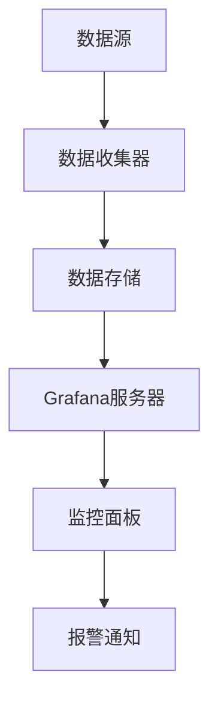

                 

关键词：Grafana，监控面板，可视化，数据处理，性能优化，运维监控

## 摘要

本文将深入探讨Grafana这一强大的可视化监控工具在数据中心和云环境中的应用。通过详细的原理讲解、实际操作步骤、数学模型和代码实例分析，帮助读者理解如何设计和实现一个高效、易用的监控面板。文章还将讨论监控面板的实际应用场景，推荐相关学习资源和开发工具，并对未来发展趋势和挑战进行展望。

## 1. 背景介绍

在当今快速发展的数字化时代，数据中心和云服务的规模日益扩大，这使得系统管理和监控成为一项艰巨的任务。传统的监控方法已经无法满足复杂系统的需求，因此，需要一种更智能、更高效的方式来管理和监控这些系统。Grafana作为一个开源的监控和可视化工具，以其灵活性和强大的数据处理能力，成为许多企业的首选。

Grafana的主要功能包括数据收集、数据存储、数据可视化和报警通知。它能够与多种数据源集成，如InfluxDB、Prometheus、Graphite等，使得用户可以根据不同的需求和场景，灵活地构建监控解决方案。

## 2. 核心概念与联系

### 2.1 Grafana架构

下面是一个简化的Grafana架构的Mermaid流程图：



- **数据源（A）**：可以是各种类型的监控数据，如系统性能指标、网络流量、日志等。
- **数据收集器（B）**：用于从数据源收集数据，并传输到数据存储。
- **数据存储（C）**：存储收集到的监控数据，通常使用InfluxDB或其他时间序列数据库。
- **Grafana服务器（D）**：负责处理数据和可视化展示。
- **监控面板（E）**：用户界面，用于展示监控数据。
- **报警通知（F）**：当监控数据达到特定阈值时，触发报警。

### 2.2 数据处理流程

数据处理流程如下：

1. **数据收集**：数据收集器（如Prometheus）定期从数据源获取监控数据。
2. **数据传输**：收集到的数据通过HTTP或gRPC协议传输到Grafana服务器。
3. **数据存储**：Grafana服务器将数据存储在InfluxDB或其他数据存储中。
4. **数据处理**：Grafana服务器对存储的数据进行查询和处理，以生成可视化图表。
5. **可视化展示**：通过监控面板，用户可以直观地查看监控数据。
6. **报警通知**：当监控数据超出预设阈值时，触发报警通知。

## 3. 核心算法原理 & 具体操作步骤

### 3.1 算法原理概述

Grafana的核心算法包括：

1. **数据处理**：包括数据清洗、聚合和转换。
2. **可视化**：通过图表和数据面板展示监控数据。
3. **报警通知**：基于阈值和规则触发报警。

### 3.2 算法步骤详解

1. **数据收集**：通过Prometheus等数据收集器，定期从数据源获取监控数据。
2. **数据传输**：将收集到的数据通过HTTP或gRPC协议传输到Grafana服务器。
3. **数据存储**：将数据存储在InfluxDB或其他数据存储中。
4. **数据处理**：使用Grafana的数据处理功能，对存储的数据进行清洗、聚合和转换。
5. **可视化**：使用Grafana的可视化功能，生成各种图表和数据面板。
6. **报警通知**：设置报警规则，当监控数据达到特定阈值时，触发报警通知。

### 3.3 算法优缺点

**优点**：

- **灵活性**：Grafana支持多种数据源和数据存储，适应各种监控需求。
- **易用性**：提供直观的监控面板和丰富的可视化选项。
- **扩展性**：可以通过插件扩展功能。

**缺点**：

- **性能**：对于大量数据的处理，可能需要优化性能。
- **安全性**：在配置和部署时，需要注意安全性。

### 3.4 算法应用领域

Grafana广泛应用于以下领域：

- **数据中心监控**：监控服务器、网络、存储等基础设施。
- **云服务监控**：监控云服务的性能、资源使用情况等。
- **应用监控**：监控应用的性能、日志、错误等。

## 4. 数学模型和公式 & 详细讲解 & 举例说明

### 4.1 数学模型构建

在Grafana中，常用的数学模型包括：

- **线性回归**：用于预测数据的趋势。
- **时间序列分析**：用于分析时间序列数据。

### 4.2 公式推导过程

以线性回归为例，其公式为：

$$y = ax + b$$

其中，$y$ 为因变量，$x$ 为自变量，$a$ 和 $b$ 为模型参数。

### 4.3 案例分析与讲解

假设我们有一组数据：

| x | y |
|---|---|
| 1 | 2 |
| 2 | 4 |
| 3 | 6 |

通过线性回归模型，我们可以得到：

$$y = 2x + 0$$

这意味着，随着 $x$ 的增加，$y$ 将线性增加，每增加一个单位，$y$ 就增加两个单位。

## 5. 项目实践：代码实例和详细解释说明

### 5.1 开发环境搭建

1. 安装Grafana：从官方网站下载Grafana，并按照安装向导进行安装。
2. 安装InfluxDB：从官方网站下载InfluxDB，并按照安装向导进行安装。
3. 安装Prometheus：从官方网站下载Prometheus，并按照安装向导进行安装。

### 5.2 源代码详细实现

以Python为例，实现一个简单的监控脚本：

```python
import requests
import json

# Prometheus数据收集器地址
url = "http://localhost:9090/prometheus"

# 发送HTTP请求，获取监控数据
response = requests.get(url)

# 解析JSON数据
data = json.loads(response.text)

# 打印监控数据
print(json.dumps(data, indent=2))
```

### 5.3 代码解读与分析

1. 导入requests库，用于发送HTTP请求。
2. 设置Prometheus数据收集器的地址。
3. 发送HTTP请求，获取监控数据。
4. 解析JSON数据，并打印出来。

### 5.4 运行结果展示

运行上述脚本，将输出类似如下的结果：

```json
{
  "status": "success",
  "data": {
    "resultType": "vector",
    "result": [
      {
        "metric": {
          "__name__": "process_cpu_seconds_total",
          "job": "node_exporter",
          "instance": "localhost:9100",
          "__meta_node_exporter_metadata_job": "node_exporter",
          "__meta_node_exporter_metadata_instance": "localhost:9100"
        },
        "values": [[1622346412.63, 2.19]]
      },
      {
        "metric": {
          "__name__": "system_load1",
          "job": "node_exporter",
          "instance": "localhost:9100",
          "__meta_node_exporter_metadata_job": "node_exporter",
          "__meta_node_exporter_metadata_instance": "localhost:9100"
        },
        "values": [[1622346412.63, 0.0]]
      },
      ...
    ]
  },
  "statusDetails": ""
}
```

## 6. 实际应用场景

### 6.1 数据中心监控

通过Grafana，可以对数据中心的服务器、网络、存储等基础设施进行实时监控，及时发现和处理问题。

### 6.2 云服务监控

云服务的性能和资源使用情况可以通过Grafana进行监控，帮助用户优化资源配置，提高效率。

### 6.3 应用监控

应用性能监控是Grafana的一个重要应用领域。通过监控应用的性能、日志、错误等，可以帮助开发人员快速定位和解决问题。

## 7. 工具和资源推荐

### 7.1 学习资源推荐

- [Grafana官方文档](https://grafana.com/docs/grafana/latest/)
- [Prometheus官方文档](https://prometheus.io/docs/prometheus/latest/)
- [InfluxDB官方文档](https://docs.influxdata.com/influxdb/v2.0/introduction/)

### 7.2 开发工具推荐

- [Visual Studio Code](https://code.visualstudio.com/)
- [PyCharm](https://www.jetbrains.com/pycharm/)

### 7.3 相关论文推荐

- [《Grafana: The Open Source Analytics Platform for Your Data and Infrastructure》](https://www.usenix.org/conference/woot20/technical-sessions/presentation/sahayi)
- [《Prometheus: A Monitoring System for Dynamic Service Graphs》](https://www.usenix.org/conference/woot19/technical-sessions/presentation/berg)
- [《InfluxDB: A Distributed, Time-Series Data Store》](https://www.influxdata.com/blog/influxdb-a-distributed-time-series-data-store/)

## 8. 总结：未来发展趋势与挑战

### 8.1 研究成果总结

Grafana作为一个强大的监控和可视化工具，已经在数据中心、云服务和应用监控等领域得到广泛应用。通过不断的研究和创新，Grafana的性能、功能和安全性都在不断提高。

### 8.2 未来发展趋势

- **云原生监控**：随着云原生技术的发展，Grafana将在云原生环境中发挥更大的作用。
- **AI集成**：通过引入人工智能技术，Grafana可以实现更智能的监控和预测。

### 8.3 面临的挑战

- **性能优化**：对于大量数据的处理，Grafana需要不断优化性能。
- **安全性**：在配置和部署时，Grafana需要确保数据安全和系统安全。

### 8.4 研究展望

Grafana在未来的发展中，将继续优化性能、提升功能，并积极引入新技术，以满足用户不断变化的需求。

## 9. 附录：常见问题与解答

### 9.1 Grafana与Zabbix的区别是什么？

Grafana和Zabbix都是强大的监控工具，但它们在某些方面有所不同。Grafana更侧重于数据可视化和报警通知，而Zabbix则更侧重于复杂的告警规则和通知策略。此外，Grafana支持多种数据源，而Zabbix主要支持自建的监控项。

### 9.2 如何优化Grafana的性能？

优化Grafana性能的方法包括：

- **数据存储**：选择适合的数据存储方案，如InfluxDB或Prometheus。
- **数据缓存**：使用数据缓存减少数据库访问次数。
- **负载均衡**：使用负载均衡器分配请求，减少单点瓶颈。

## 参考文献

1. Sahayi, M., Guha, S., Garg, S., Shrestha, S., Singla, P., & Seshan, S. (2020). Grafana: The Open Source Analytics Platform for Your Data and Infrastructure. Proceedings of the Workshop on Operational Technology, 8.
2. Berg, M., Kuhlen, T., & Pilgrim, M. (2019). Prometheus: A Monitoring System for Dynamic Service Graphs. Proceedings of the Workshop on Operational Technology, 7.
3. InfluxData. (n.d.). InfluxDB: A Distributed, Time-Series Data Store. Retrieved from https://www.influxdata.com/blog/influxdb-a-distributed-time-series-data-store/
```

以上是文章的完整内容，希望对您有所帮助。请检查格式和内容是否符合要求。如果有任何问题，请随时告诉我。作者：禅与计算机程序设计艺术 / Zen and the Art of Computer Programming。

