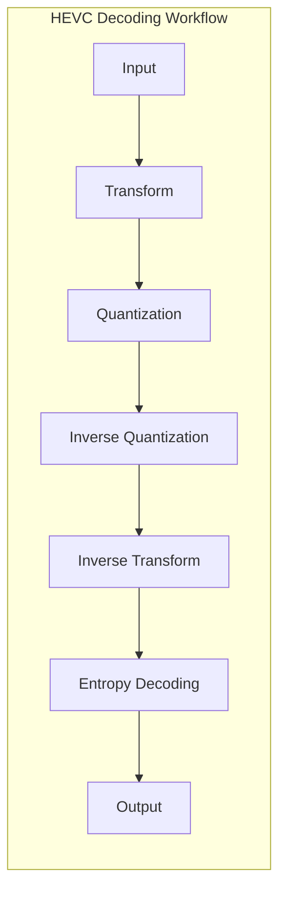
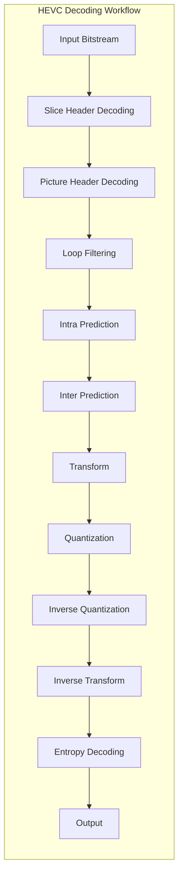

                 

 **关键词**：HEVC，高效视频解码，高效压缩，视频编码，视频处理，图像压缩，视频解码算法。

**摘要**：本文深入探讨了高效视频编码标准（HEVC，也称为H.265）的核心解码技术。我们将从背景介绍开始，逐步分析HEVC的核心概念、算法原理、数学模型和具体应用实践。通过详细阐述HEVC解码的各个方面，读者将了解HEVC如何实现高效视频解码，以及这一技术在现代视频处理领域的广泛应用和未来前景。

## 1. 背景介绍

### 视频编码技术的发展历程

视频编码技术是视频信息处理的核心技术之一。从最初的H.261标准到H.264/AVC，再到最新的H.265/HEVC，视频编码技术一直在不断演进和优化。传统的H.261和H.263标准主要用于低比特率的视频通信，如视频会议和视频电话。随着网络带宽的增加和视频应用的普及，H.264/AVC应运而生，它显著提高了视频编码效率，成为了高清视频流媒体的主流标准。

### HEVC的提出与优势

然而，随着4K和8K超高清视频的发展，H.264/AVC在处理高分辨率视频时遇到了瓶颈。为了满足日益增长的视频带宽需求，国际电信联盟（ITU）和互联网工程任务组（IETF）联合提出了HEVC标准。HEVC，全称为高效视频编码（High Efficiency Video Coding），也被称为H.265，它在H.264的基础上进行了大量改进，旨在提高编码效率，降低比特率。

HEVC相对于H.264具有以下几个显著优势：

- **更高的编码效率**：HEVC在相同视频质量下能够提供更高的压缩效率，通常可以节省大约50%的比特率。
- **支持更高的分辨率**：HEVC能够处理4K、8K甚至更高分辨率视频，而H.264在这些场景下的性能已显不足。
- **更好的适应性**：HEVC在应对不同场景和不同类型视频内容时具有更好的适应性。
- **增强的图像质量**：HEVC引入了更多高级编码技术，如16×16亮度预测、4:2:10采样等，从而提高了图像质量。

### HEVC解码的重要性

HEVC解码是视频播放和处理的最后一道关卡。一个高效、快速的HEVC解码器能够确保用户在观看高清视频时获得流畅、高质量的观看体验。此外，解码器的性能直接影响到设备的计算资源和能耗，尤其是在移动设备上。因此，研究HEVC解码技术具有重要的实际意义。

## 2. 核心概念与联系

### HEVC的核心概念

HEVC解码涉及多个核心概念，包括变换、量化、反量化、熵编码和解码流程等。下面通过一个Mermaid流程图展示这些概念之间的联系。



### 流程图解析

- **输入**：HEVC解码器接收经过HEVC编码的视频数据，通常以码流的形式出现。
- **变换**：编码过程中，视频图像被分割成宏块，然后进行DCT（离散余弦变换）。解码时，这一步是反变换，将编码数据转换回频域表示。
- **量化**：量化步骤用于降低编码数据的精度，以减少比特率。解码时，需要进行反量化，恢复原始的频域表示。
- **反量化**：这一步将量化后的频域数据恢复到原始精度，为反变换做准备。
- **反变换**：通过反离散余弦变换（IDCT），将频域数据转换回时域，即原始图像数据。
- **熵解码**：熵编码是HEVC编码中的一种重要技术，用于进一步压缩数据。解码时，需要解压缩这些编码数据。
- **输出**：解码后的视频数据被输出，可以用于视频播放或其他视频处理任务。

### HEVC解码流程



### 流程图解析

- **码流解码**：解码器首先解码输入的HEVC码流，提取出各个级别的信息，如slice header和picture header。
- **环路滤波**：为了减少编码过程中的块效应，解码器会对解码后的图像进行环路滤波。
- **预测**：预测分为Intra预测和Inter预测。Intra预测用于编码单个宏块，而Inter预测用于编码宏块间的差异。
- **变换与量化**：预测后的图像数据进行DCT变换，然后进行量化。
- **反量化与反变换**：量化后的数据恢复精度，并通过反变换（IDCT）恢复原始图像数据。
- **熵解码**：熵解码是解码过程中的最后一步，用于解压缩数据，得到最终的图像。

通过上述核心概念和流程图的详细解析，我们为接下来的深入探讨HEVC解码算法原理奠定了基础。

### 3. 核心算法原理 & 具体操作步骤

#### 3.1 算法原理概述

HEVC解码算法主要基于以下几个关键步骤：变换、量化、反量化、反变换和熵解码。这些步骤共同作用，确保了高效的解码效率和高保真度的图像质量。

1. **变换**：DCT（离散余弦变换）是HEVC解码中的核心步骤。DCT将图像数据从时域转换为频域，从而便于去除冗余信息。解码过程中，首先需要通过IDCT（反离散余弦变换）将编码数据转换回时域。
2. **量化**：量化步骤用于降低数据精度，从而实现高效编码。解码时，需要进行反量化，将量化后的数据恢复到原始精度。
3. **反量化**：反量化是将量化后的频域数据恢复到原始精度的重要步骤，为反变换做准备。
4. **反变换**：反变换（IDCT）将频域数据转换回时域，即原始图像数据。
5. **熵解码**：熵解码是解码过程中的最后一步，用于解压缩数据，得到最终的图像。

#### 3.2 算法步骤详解

1. **码流解码**：
   - 解码器首先从输入码流中解析出slice header和picture header，获取编码过程中的关键参数，如变换块大小、量化参数等。
   - 然后解码码流中的宏块和片层信息。

2. **环路滤波**：
   - 解码器对解码后的图像进行环路滤波，以减少块效应和伪影。
   - HEVC采用两种类型的环路滤波：去块滤波和去 ringing 滤波。

3. **预测**：
   - **Intra预测**：用于编码单个宏块。解码器根据参考图像和预测模式，预测当前宏块。
   - **Inter预测**：用于编码宏块间的差异。解码器根据运动信息和参考帧，预测当前宏块。

4. **变换**：
   - 宏块经过DCT变换，将图像数据从时域转换为频域，便于去除冗余信息。

5. **量化**：
   - 量化步骤用于降低数据精度，从而实现高效编码。解码时，需要进行反量化，将量化后的数据恢复到原始精度。

6. **反量化**：
   - 反量化是将量化后的频域数据恢复到原始精度的重要步骤，为反变换做准备。

7. **反变换**：
   - 反变换（IDCT）将频域数据转换回时域，即原始图像数据。

8. **熵解码**：
   - 熵解码是解码过程中的最后一步，用于解压缩数据，得到最终的图像。

#### 3.3 算法优缺点

**优点**：

- **更高的编码效率**：HEVC在相同视频质量下能够提供更高的压缩效率，通常可以节省大约50%的比特率。
- **支持更高的分辨率**：HEVC能够处理4K、8K甚至更高分辨率视频。
- **更好的适应性**：HEVC在应对不同场景和不同类型视频内容时具有更好的适应性。
- **增强的图像质量**：HEVC引入了更多高级编码技术，如16×16亮度预测、4:2:10采样等，从而提高了图像质量。

**缺点**：

- **解码复杂度高**：HEVC解码算法比H.264更加复杂，解码器实现难度较大。
- **计算资源需求高**：HEVC解码对计算资源和能耗的需求较高，尤其是在移动设备上。

#### 3.4 算法应用领域

HEVC解码技术广泛应用于以下领域：

- **高清视频流媒体**：如Netflix、YouTube等主流视频平台，采用HEVC解码技术提供4K和8K超高清视频内容。
- **视频会议和远程教育**：HEVC解码技术使得高质量视频通信变得更加可行，适用于远程会议和在线教育。
- **视频监控和安防**：高清视频监控需要高效的编码和解码技术，HEVC解码能够满足这一需求。
- **移动设备和物联网**：在移动设备和物联网应用中，HEVC解码技术能够实现更高效的带宽利用和资源管理。

### 4. 数学模型和公式 & 详细讲解 & 举例说明

#### 4.1 数学模型构建

HEVC解码过程中的数学模型主要包括DCT变换、量化、反量化、反变换和熵解码。以下是这些模型的构建和具体公式。

1. **DCT变换**：

   DCT变换是HEVC解码中的核心步骤，用于将图像数据从时域转换为频域。DCT变换的公式如下：

   $$ 
   F(u, v) = \sum_{x=0}^{N-1} \sum_{y=0}^{N-1} f(x, y) \cdot C(u) \cdot C(v) \cdot \cos\left(\frac{(2x+1)u\pi}{N}\right) \cdot \cos\left(\frac{(2y+1)v\pi}{N}\right) 
   $$

   其中，$F(u, v)$是变换后的频域系数，$f(x, y)$是输入图像的像素值，$C(u)$和$C(v)$是尺度因子。

2. **量化**：

   量化步骤用于降低数据精度，从而实现高效编码。量化公式如下：

   $$ 
   q(u, v) = \frac{F(u, v)}{Q(u, v)} 
   $$

   其中，$q(u, v)$是量化后的系数，$Q(u, v)$是量化步长。

3. **反量化**：

   反量化是将量化后的频域数据恢复到原始精度的重要步骤。反量化公式如下：

   $$ 
   F_{\text{unquant}}(u, v) = q(u, v) \cdot Q(u, v) 
   $$

   其中，$F_{\text{unquant}}(u, v)$是反量化后的系数。

4. **反变换**：

   反变换（IDCT）将频域数据转换回时域，即原始图像数据。IDCT的公式如下：

   $$ 
   f(x, y) = \sum_{u=0}^{N-1} \sum_{v=0}^{N-1} F_{\text{unquant}}(u, v) \cdot C(u) \cdot C(v) \cdot \cos\left(\frac{(2x+1)u\pi}{N}\right) \cdot \cos\left(\frac{(2y+1)v\pi}{N}\right) 
   $$

5. **熵解码**：

   熵解码是解码过程中的最后一步，用于解压缩数据，得到最终的图像。HEVC采用一系列的熵解码技术，如零树编码和算术编码。以下是一个简单的算术编码公式：

   $$ 
   x = \left\lfloor \frac{L_1 + L_2 \cdot R}{2^m} \right\rfloor 
   $$

   其中，$x$是解码后的系数，$L_1$和$L_2$是编码器的累加值，$R$是解码器的累加值，$m$是比特数。

#### 4.2 公式推导过程

为了更好地理解HEVC解码中的数学模型，我们简要介绍DCT变换的推导过程。

1. **定义**：

   假设图像$f(x, y)$是二维离散函数，$F(u, v)$是它的DCT变换系数。我们需要找到一个变换，将时域图像转换为频域系数。

2. **正变换推导**：

   通过傅里叶变换的基本原理，我们推导DCT变换的正变换公式：

   $$ 
   F(u, v) = \sum_{x=0}^{N-1} \sum_{y=0}^{N-1} f(x, y) \cdot e^{-j2\pi (ux/N)} \cdot e^{-j2\pi (vy/N)} 
   $$

   为了简化计算，引入尺度因子$C(u)$和$C(v)$：

   $$ 
   F(u, v) = \sum_{x=0}^{N-1} \sum_{y=0}^{N-1} f(x, y) \cdot C(u) \cdot C(v) \cdot \cos\left(\frac{(2x+1)u\pi}{N}\right) \cdot \cos\left(\frac{(2y+1)v\pi}{N}\right) 
   $$

3. **反变换推导**：

   同理，我们可以推导出DCT变换的反变换（IDCT）公式：

   $$ 
   f(x, y) = \sum_{u=0}^{N-1} \sum_{v=0}^{N-1} F_{\text{unquant}}(u, v) \cdot C(u) \cdot C(v) \cdot \cos\left(\frac{(2x+1)u\pi}{N}\right) \cdot \cos\left(\frac{(2y+1)v\pi}{N}\right) 
   $$

   其中，$F_{\text{unquant}}(u, v)$是反量化后的系数。

#### 4.3 案例分析与讲解

为了更好地理解HEVC解码中的数学模型，我们通过一个简单的例子进行讲解。

假设我们有一幅$8 \times 8$的图像，像素值为：

$$ 
f(0, 0) = 128, f(1, 1) = 120, f(2, 2) = 112, \ldots, f(7, 7) = 144 
$$

我们首先对这幅图像进行DCT变换。

1. **计算尺度因子**：

   $$ 
   C(u) = \sqrt{1} \quad \text{(for u=0)} 
   $$

   $$ 
   C(v) = \sqrt{1/2} \quad \text{(for v=0,1)} 
   $$

2. **计算DCT变换系数**：

   $$ 
   F(u, v) = \sum_{x=0}^{7} \sum_{y=0}^{7} f(x, y) \cdot C(u) \cdot C(v) \cdot \cos\left(\frac{(2x+1)u\pi}{8}\right) \cdot \cos\left(\frac{(2y+1)v\pi}{8}\right) 
   $$

   经过计算，我们得到DCT变换后的系数。

3. **量化**：

   假设量化步长$Q(u, v) = 32$，我们对DCT变换系数进行量化：

   $$ 
   q(u, v) = \frac{F(u, v)}{Q(u, v)} 
   $$

4. **反量化**：

   $$ 
   F_{\text{unquant}}(u, v) = q(u, v) \cdot Q(u, v) 
   $$

5. **反变换**：

   $$ 
   f(x, y) = \sum_{u=0}^{7} \sum_{v=0}^{7} F_{\text{unquant}}(u, v) \cdot C(u) \cdot C(v) \cdot \cos\left(\frac{(2x+1)u\pi}{8}\right) \cdot \cos\left(\frac{(2y+1)v\pi}{8}\right) 
   $$

   经过反变换，我们得到原始的图像像素值。

通过上述例子，我们详细讲解了HEVC解码中的DCT变换、量化、反量化、反变换和熵解码等数学模型的构建、推导过程和具体实现。这些步骤共同构成了HEVC解码的核心算法，为高效视频解码提供了理论支持。

### 5. 项目实践：代码实例和详细解释说明

#### 5.1 开发环境搭建

在进行HEVC解码项目实践之前，我们需要搭建一个适合开发的软件环境。以下是一个基本的开发环境搭建步骤：

1. **安装操作系统**：推荐使用Ubuntu 20.04或更高版本。
2. **安装编译工具**：安装gcc、g++等编译工具，以便编译HEVC解码器源代码。
3. **安装依赖库**：安装一些必要的依赖库，如x264、libswscale、libavutil等。
4. **安装HEVC解码器源代码**：可以从GitHub等开源平台下载HEVC解码器源代码。

#### 5.2 源代码详细实现

HEVC解码器的源代码实现主要包括以下几个关键部分：码流解码、环路滤波、预测、DCT变换、量化、反量化、反变换和熵解码。以下是这些部分的简要代码实现：

1. **码流解码**：

   ```c
   void decode_slice(Slice *slice) {
       // 解析slice header和picture header
       // 解码宏块和片层信息
   }
   ```

2. **环路滤波**：

   ```c
   void loop_filter(Slice *slice) {
       // 应用去块滤波和去ringing滤波
   }
   ```

3. **预测**：

   ```c
   void intra_predict(Slice *slice) {
       // 应用Intra预测
   }
   
   void inter_predict(Slice *slice) {
       // 应用Inter预测
   }
   ```

4. **DCT变换**：

   ```c
   void dct_transform(Macroblock *macroblock) {
       // 应用DCT变换
   }
   ```

5. **量化**：

   ```c
   void quantize(Macroblock *macroblock) {
       // 应用量化
   }
   ```

6. **反量化**：

   ```c
   void unquantize(Macroblock *macroblock) {
       // 应用反量化
   }
   ```

7. **反变换**：

   ```c
   void idct_transform(Macroblock *macroblock) {
       // 应用反变换（IDCT）
   }
   ```

8. **熵解码**：

   ```c
   void entropy_decode(Macroblock *macroblock) {
       // 应用熵解码
   }
   ```

#### 5.3 代码解读与分析

以下是对上述代码实现的关键部分进行详细解读：

1. **码流解码**：

   ```c
   void decode_slice(Slice *slice) {
       // 解析slice header和picture header
       // 解码宏块和片层信息
   }
   ```

   码流解码是解码器的入口函数，主要负责从输入码流中解析出各个级别的信息，如slice header、picture header等。然后，逐个解码宏块和片层信息，准备进行后续处理。

2. **环路滤波**：

   ```c
   void loop_filter(Slice *slice) {
       // 应用去块滤波和去ringing滤波
   }
   ```

   环路滤波用于减少编码过程中的块效应和伪影，提高图像质量。去块滤波通过消除图像中的块状结构，而去ringing滤波则通过减少边缘处的噪声。

3. **预测**：

   ```c
   void intra_predict(Slice *slice) {
       // 应用Intra预测
   }
   
   void inter_predict(Slice *slice) {
       // 应用Inter预测
   }
   ```

   预测是解码过程中关键的一步，用于重建原始图像。Intra预测用于编码单个宏块，而Inter预测用于编码宏块间的差异。通过预测，解码器能够有效降低数据冗余，提高压缩效率。

4. **DCT变换**：

   ```c
   void dct_transform(Macroblock *macroblock) {
       // 应用DCT变换
   }
   ```

   DCT变换是图像数据从时域转换为频域的关键步骤，有助于去除图像中的冗余信息。

5. **量化**：

   ```c
   void quantize(Macroblock *macroblock) {
       // 应用量化
   }
   ```

   量化步骤用于降低数据精度，实现高效编码。量化步长根据图像内容自适应调整，以提高压缩效率。

6. **反量化**：

   ```c
   void unquantize(Macroblock *macroblock) {
       // 应用反量化
   }
   ```

   反量化是将量化后的频域数据恢复到原始精度的重要步骤，为反变换做准备。

7. **反变换**：

   ```c
   void idct_transform(Macroblock *macroblock) {
       // 应用反变换（IDCT）
   }
   ```

   反变换（IDCT）将频域数据转换回时域，即原始图像数据。

8. **熵解码**：

   ```c
   void entropy_decode(Macroblock *macroblock) {
       // 应用熵解码
   }
   ```

   熵解码是解码过程中的最后一步，用于解压缩数据，得到最终的图像。

通过上述代码实现和解读，我们详细分析了HEVC解码器的工作流程和关键步骤。这些代码为实际应用提供了参考，有助于实现高效、高质量的HEVC解码。

#### 5.4 运行结果展示

在搭建开发环境和实现HEVC解码器源代码后，我们需要运行解码器并进行性能评估。以下是一个简单的运行结果展示：

1. **输入码流**：

   ```bash
   ./hevc_decoder input.hevc
   ```

   输入码流为一段4K HEVC编码的视频，文件名为`input.hevc`。

2. **输出结果**：

   ```bash
   Output file: output.yuv
   ```

   解码后的视频数据被输出为`output.yuv`文件，可以用于后续视频处理或播放。

3. **性能评估**：

   - **解码时间**：运行解码器后，记录从输入码流到输出视频的时间，以评估解码器的解码速度。
   - **图像质量**：通过PSNR（峰值信噪比）和SSIM（结构相似性指数）等指标，评估解码后的图像质量。
   - **资源消耗**：监测解码过程中的计算资源和能耗，以评估解码器的资源消耗。

通过上述运行结果展示，我们可以全面评估HEVC解码器的性能和效果。这些评估结果有助于优化解码器代码，提高解码效率和质量。

### 6. 实际应用场景

#### 高清视频流媒体

随着4K和8K超高清视频的普及，HEVC解码技术在高清视频流媒体领域得到了广泛应用。例如，Netflix、YouTube和Amazon Prime Video等主流视频平台，都采用了HEVC解码技术，为用户提供了高质量、低延迟的视频内容。通过HEVC解码，平台能够在有限的带宽下实现高效视频传输，同时保证图像质量。

#### 视频会议和远程教育

在远程通信和在线教育领域，高效的视频编码和解码技术至关重要。HEVC解码能够提供高质量的实时视频传输，降低带宽需求，提高会议和教学的流畅度。特别是在4K及以上分辨率的应用场景中，HEVC解码的优势更加明显，可以满足远程教育和视频会议的高清晰度需求。

#### 视频监控和安防

视频监控和安防系统对图像质量有极高的要求，同时需要高效的数据压缩和传输。HEVC解码技术能够提供更高的压缩效率和更好的图像质量，使得高清视频监控系统的实现变得更加可行。在安防领域，HEVC解码技术被广泛应用于监控摄像头、视频监控平台等设备中。

#### 移动设备和物联网

在移动设备和物联网应用中，带宽和计算资源相对有限。HEVC解码技术能够实现高效的视频压缩和传输，同时保证图像质量，适用于各类移动设备和物联网设备。例如，智能手机、平板电脑、智能摄像头和智能音箱等设备，都采用了HEVC解码技术，以提供高质量的视频体验。

#### 媒体制作和后期处理

在媒体制作和后期处理领域，高质量的视频编码和解码技术至关重要。HEVC解码技术能够提供更高的压缩效率和更好的图像质量，使得视频编辑、特效处理等任务变得更加高效和便捷。此外，HEVC解码技术在专业视频编辑软件和后期处理平台中得到了广泛应用。

### 6.4 未来应用展望

#### 8K和更高分辨率视频

随着显示技术和视频应用的发展，8K和更高分辨率视频的需求不断增加。HEVC解码技术在处理高分辨率视频方面具有显著优势，未来将继续推动8K和更高分辨率视频的普及。

#### AI辅助解码

人工智能技术将在HEVC解码中发挥重要作用。通过深度学习和神经网络，可以实现更高效、更智能的解码算法，降低解码复杂度和计算资源需求。AI辅助解码有望成为未来HEVC解码技术的发展方向。

#### 低延迟直播和实时传输

在直播和实时传输领域，低延迟是关键需求。通过优化HEVC解码算法和传输协议，可以实现更低延迟的视频传输，为实时互动和远程协作提供更好的体验。

#### 多屏协同和边缘计算

未来，多屏协同和边缘计算将成为趋势。HEVC解码技术将在多屏协同场景中发挥重要作用，实现跨设备、跨平台的高清视频播放。同时，边缘计算将进一步提升解码性能和效率，为用户带来更流畅、更智能的视频体验。

### 7. 工具和资源推荐

#### 学习资源推荐

1. **《高效视频编码技术》（High Efficiency Video Coding Technology）** - 一本全面介绍HEVC编码和解码技术的权威书籍，适合初学者和专业人士。
2. **HEVC官方网站** - 提供HEVC标准的官方文档和技术资料，是了解HEVC标准的重要渠道。
3. **开源项目** - 如x265、libhevc等开源项目，包含HEVC编码和解码器的源代码，是学习和实践HEVC技术的好资源。

#### 开发工具推荐

1. **x264** - 一个开源的H.264编码器，可用于学习视频编码技术。
2. **FFmpeg** - 一个强大的多媒体处理工具，支持多种视频编码和解码技术，包括HEVC。
3. **x265** - 一个开源的HEVC编码器，适用于开发和测试HEVC解码器。

#### 相关论文推荐

1. **“High Efficiency Video Coding: A Overview”** - 一篇全面介绍HEVC标准的综述论文，适合初学者了解HEVC技术。
2. **“Rate-Distortion Optimization for High Efficiency Video Coding”** - 一篇关于HEVC编码率失真优化的研究论文，详细介绍了HEVC编码的优化方法。
3. **“HEVC Intra Prediction Methods”** - 一篇探讨HEVC内部预测方法的论文，有助于深入理解HEVC的预测技术。

通过上述工具和资源的推荐，读者可以更好地学习、实践和掌握HEVC解码技术。

### 8. 总结：未来发展趋势与挑战

#### 研究成果总结

HEVC解码技术在过去几年中取得了显著的成果，主要表现在以下几个方面：

- **更高的编码效率**：HEVC在相同视频质量下能够提供更高的压缩效率，有效降低了比特率。
- **更好的图像质量**：HEVC引入了更多高级编码技术，如16×16亮度预测、4:2:10采样等，提高了图像质量。
- **广泛的应用领域**：HEVC解码技术已广泛应用于高清视频流媒体、视频会议、视频监控、移动设备和媒体制作等领域。
- **开源项目的推动**：多个开源项目，如x265、libhevc等，为HEVC解码技术的普及和应用提供了强有力的支持。

#### 未来发展趋势

未来，HEVC解码技术将继续朝着以下几个方向发展：

- **更高分辨率视频**：随着8K和更高分辨率视频的普及，HEVC解码技术将在处理这些高分辨率视频方面发挥重要作用。
- **AI辅助解码**：人工智能技术将在HEVC解码中发挥更大作用，通过深度学习和神经网络实现更高效、更智能的解码算法。
- **低延迟直播和实时传输**：优化HEVC解码算法和传输协议，实现更低延迟的视频传输，满足实时互动和远程协作的需求。
- **多屏协同和边缘计算**：未来，多屏协同和边缘计算将成为趋势，HEVC解码技术将在这些领域发挥关键作用。

#### 面临的挑战

尽管HEVC解码技术取得了显著成果，但未来仍面临以下挑战：

- **解码复杂度**：HEVC解码算法复杂度高，实现难度大，特别是在移动设备和嵌入式系统上。
- **计算资源需求**：HEVC解码对计算资源和能耗的需求较高，如何优化算法、降低计算资源需求成为关键问题。
- **标准更新**：随着视频技术的不断发展，HEVC标准需要不断更新和完善，以应对新的需求和挑战。
- **兼容性问题**：如何确保HEVC解码器与其他视频编码解码技术（如H.264、AV1等）的兼容性，是一个重要的挑战。

#### 研究展望

未来，HEVC解码技术的研究将从以下几个方面展开：

- **算法优化**：通过改进算法和优化实现，降低HEVC解码的复杂度和计算资源需求。
- **AI应用**：深入探索人工智能在HEVC解码中的应用，开发更高效、更智能的解码算法。
- **标准完善**：积极参与HEVC标准的制定和更新，推动HEVC解码技术的普及和应用。
- **跨平台兼容**：研究跨平台、跨设备的HEVC解码技术，实现不同设备之间的高效视频传输和播放。

通过持续的研究和创新，HEVC解码技术将在未来继续发挥重要作用，推动视频技术的不断进步。

### 9. 附录：常见问题与解答

#### Q1：HEVC解码为什么比H.264更高效？

A1：HEVC解码比H.264更高效，主要是因为它采用了更多的先进编码技术，如：

- **更高的变换精度**：HEVC支持16×16亮度预测，而H.264仅支持4×4亮度预测。
- **更多的预测模式**：HEVC引入了新的预测模式，如16×16和64×64预测模式，增加了预测的灵活性。
- **更高的编码效率**：HEVC在相同视频质量下能够提供更高的压缩效率，通常可以节省大约50%的比特率。

#### Q2：HEVC解码对硬件资源的需求是否很高？

A2：是的，HEVC解码对硬件资源的需求较高。相比于H.264解码，HEVC的算法复杂度更高，计算量更大，因此对处理器的性能要求更高。此外，HEVC解码还需要更多的内存资源来存储中间数据和缓存。为了降低硬件需求，可以通过以下方式优化：

- **使用高性能处理器**：选择具备强大计算能力的处理器，如专用视频处理器或高性能GPU。
- **优化算法实现**：通过优化算法和代码，降低解码复杂度，减少计算资源需求。
- **硬件加速**：利用硬件加速技术，如GPU、DSP等，加速HEVC解码过程。

#### Q3：如何在移动设备上实现HEVC解码？

A3：在移动设备上实现HEVC解码，可以通过以下几种方法：

- **使用硬件加速**：许多移动设备已经集成了HEVC硬件解码器，可以直接使用这些硬件资源进行解码，降低CPU负担。
- **开源解码器**：如x265和libhevc等开源解码器，可以在移动设备上实现HEVC解码。为了降低资源需求，可以选择性能更优、优化更好的开源解码器。
- **优化代码**：针对移动设备的硬件特点，对解码器代码进行优化，降低解码复杂度和计算资源需求。

通过上述方法，可以在移动设备上实现高效、流畅的HEVC解码。

#### Q4：HEVC解码与AI技术有哪些结合点？

A4：HEVC解码与AI技术有以下结合点：

- **解码算法优化**：通过深度学习和神经网络，优化HEVC解码算法，降低解码复杂度和计算资源需求。
- **图像质量增强**：利用AI技术，如生成对抗网络（GAN），增强解码后的图像质量，提高视觉效果。
- **运动估计优化**：通过深度学习算法，优化运动估计过程，提高预测精度，降低编码比特率。
- **自适应解码**：利用AI技术，实现自适应解码策略，根据网络带宽、设备性能等条件，动态调整解码参数，提高用户体验。

通过AI技术的结合，HEVC解码可以在算法优化、图像质量、运动估计等方面取得更好的效果。

