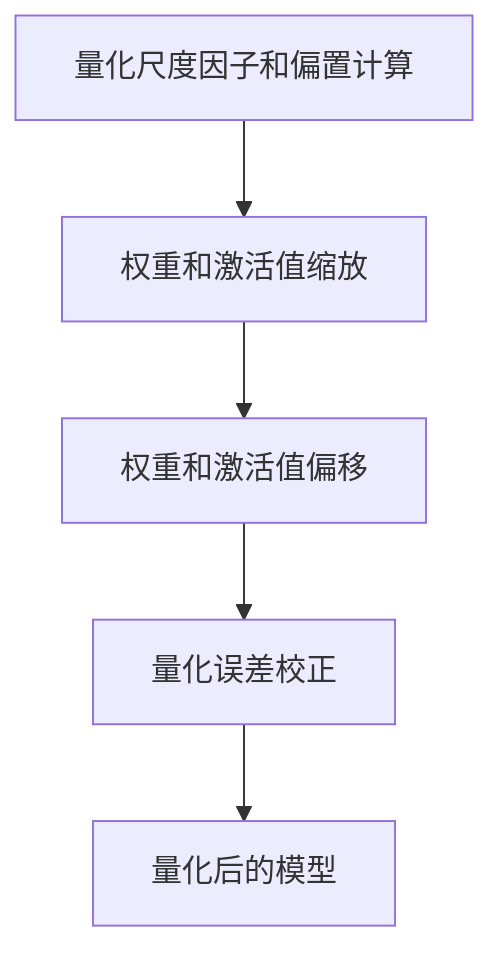

                 

关键词：AI模型部署、INT8量化、模型优化、计算效率、资源节省、硬件加速

> 摘要：在人工智能应用领域，模型部署的效率至关重要。INT8量化技术通过将模型中的浮点数参数转换为8位整数，实现了显著的计算加速和资源节省。本文将详细介绍INT8量化的原理、算法、数学模型、应用场景及未来展望，帮助读者深入了解这一技术，并掌握其在AI模型部署中的重要性。

## 1. 背景介绍

随着深度学习技术的迅猛发展，人工智能（AI）在各行各业的应用越来越广泛。然而，模型部署过程中的计算效率和资源消耗仍然是制约其广泛应用的关键因素。为了解决这个问题，量化技术应运而生。量化技术通过将模型的权重和激活值从高精度的浮点数转换为低精度的整数，从而降低模型的计算复杂度和存储需求，提高模型的部署效率。

量化技术主要包括两种类型：符号量化和整数量化。符号量化通常指的是对模型权重和激活值进行符号位压缩，而整数量化则是将浮点数直接转换为整数。本文主要讨论的是整数量化中的INT8量化，因为它在实现高效模型部署方面具有显著优势。

## 2. 核心概念与联系

### 2.1 INT8量化原理

INT8量化将模型的权重和激活值从32位浮点数（FP32）转换为8位整数（INT8）。8位整数的取值范围为-128到127，这虽然牺牲了一部分精度，但极大地减少了计算和存储资源的需求。量化过程中，首先需要确定量化的参数，包括量化尺度因子（scale factor）和偏置（zero-point）。

### 2.2 量化流程

量化流程可以分为以下几个步骤：

1. **量化尺度因子和偏置计算**：通过训练数据计算量化尺度因子和偏置，确保量化后的整数在合理的范围内。

2. **权重和激活值转换**：将模型的权重和激活值从FP32转换为INT8。这个过程通常涉及到两个操作：缩放和偏移。

3. **量化误差校正**：由于量化会引入误差，需要通过误差校正技术来减少误差的影响。

### 2.3 Mermaid 流程图

下面是一个简化的INT8量化流程的Mermaid流程图：



## 3. 核心算法原理 & 具体操作步骤

### 3.1 算法原理概述

INT8量化通过以下步骤实现：

1. **计算量化尺度因子（scale factor）**：尺度因子用于将浮点数缩放到整数的有效范围内。
   
   $$ scale\_factor = \frac{max\_value - min\_value}{max\_int8 - min\_int8} $$

2. **计算量化偏置（zero-point）**：偏置用于调整量化值，使得量化后的值更加接近原始浮点数的真实值。

   $$ zero\_point = \frac{max\_value + min\_value}{2} $$

3. **权重和激活值缩放**：将浮点数乘以尺度因子。

   $$ quantized\_value = float\_value \times scale\_factor $$

4. **权重和激活值偏移**：将缩放后的值加上偏置。

   $$ quantized\_value = quantized\_value + zero\_point $$

5. **量化误差校正**：通过误差校正技术减少量化误差。

### 3.2 算法步骤详解

1. **输入浮点数模型**：首先需要输入原始的浮点数模型，包括权重和激活值。

2. **计算量化尺度因子和偏置**：通过训练数据计算量化尺度因子和偏置。

3. **权重和激活值缩放与偏移**：按照上述公式对权重和激活值进行缩放和偏移。

4. **量化误差校正**：采用适当的误差校正方法，如直方图平滑、误差反向传播等。

5. **输出量化后的模型**：得到量化后的模型，可用于后续的推理和部署。

### 3.3 算法优缺点

**优点**：
- **计算效率提升**：INT8量化显著降低了模型的计算复杂度，提高了推理速度。
- **资源节省**：量化后的模型占用更少的存储空间，适合部署在资源受限的设备上。
- **硬件加速**：许多现代硬件（如GPU、TPU）对INT8运算有优化，进一步提升了计算效率。

**缺点**：
- **精度损失**：量化过程中会引入一些误差，可能会影响模型的性能。
- **量化误差校正复杂**：量化误差校正需要额外计算，增加了模型部署的复杂性。

### 3.4 算法应用领域

INT8量化在多个领域具有广泛应用，主要包括：

- **移动设备**：移动设备通常具有有限的计算资源和存储空间，INT8量化可以帮助实现高效的模型部署。
- **边缘计算**：边缘设备需要实时处理大量的数据，INT8量化可以提高边缘设备的响应速度。
- **自动驾驶**：自动驾驶系统需要处理大量的视觉和传感器数据，INT8量化可以降低计算延迟和功耗。

## 4. 数学模型和公式 & 详细讲解 & 举例说明

### 4.1 数学模型构建

INT8量化的核心在于确定量化尺度因子（scale factor）和偏置（zero-point）。以下是一个简单的数学模型：

$$ quantized\_value = \text{round}(float\_value \times scale\_factor + zero\_point) $$

其中，`round`函数用于将结果四舍五入到最接近的整数。

### 4.2 公式推导过程

假设一个浮点数的取值范围为 \([min\_value, max\_value]\)，而8位整数的取值范围为 \([-128, 127]\)。

1. **计算量化尺度因子（scale factor）**：

   $$ scale\_factor = \frac{max\_value - min\_value}{max\_int8 - min\_int8} = \frac{max\_value - min\_value}{255} $$

2. **计算量化偏置（zero-point）**：

   $$ zero\_point = \frac{max\_value + min\_value}{2} $$

### 4.3 案例分析与讲解

假设一个浮点数模型的权重范围在 \([-1.0, 1.0]\)，我们希望将其量化为8位整数。

1. **计算量化尺度因子和偏置**：

   $$ scale\_factor = \frac{1.0 - (-1.0)}{255} = \frac{2.0}{255} \approx 0.0078125 $$
   $$ zero\_point = \frac{1.0 + (-1.0)}{2} = 0.0 $$

2. **量化权重**：

   $$ quantized\_weight = \text{round}(float\_weight \times scale\_factor + zero\_point) $$

   例如，对于权重 \( float\_weight = 0.5 \)：

   $$ quantized\_weight = \text{round}(0.5 \times 0.0078125 + 0.0) = \text{round}(0.00390625) = 1 $$

   因此，量化后的权重为 \( quantized\_weight = 1 \)。

   同样的方法可以用于量化激活值。

## 5. 项目实践：代码实例和详细解释说明

### 5.1 开发环境搭建

为了演示INT8量化，我们使用Python编程语言和TensorFlow框架。请确保已经安装了TensorFlow及其依赖项。

```python
pip install tensorflow
```

### 5.2 源代码详细实现

以下是实现INT8量化的示例代码：

```python
import tensorflow as tf

# 假设有一个简单的全连接神经网络
model = tf.keras.Sequential([
    tf.keras.layers.Dense(10, activation='relu', input_shape=(5,)),
    tf.keras.layers.Dense(1)
])

# 编译模型
model.compile(optimizer='adam', loss='mean_squared_error')

# 准备训练数据
x_train = [[0.2, -0.3, 0.4, 0.5, -0.1]]
y_train = [0.5]

# 训练模型
model.fit(x_train, y_train, epochs=10)

# 量化模型权重和激活值
quantize_layer = tf.keras.layers.experimental.preprocessing.IntegerQuantization(
    input_shape=(5,),
    scale=0.0078125,
    zero_point=0.0
)

# 应用量化层到模型
quantized_model = tf.keras.Sequential([
    quantize_layer,
    model
])

# 量化后的模型
print(quantized_model.layers[1].get_weights())

# 进行推理
quantized_output = quantized_model.predict(x_train)
print(quantized_output)
```

### 5.3 代码解读与分析

1. **模型定义**：我们定义了一个简单的全连接神经网络，包括一个输入层、一个隐藏层和一个输出层。

2. **模型编译**：使用Adam优化器和均方误差损失函数编译模型。

3. **训练数据准备**：我们使用一组简单的训练数据。

4. **模型训练**：使用训练数据训练模型。

5. **量化层应用**：我们使用TensorFlow提供的`IntegerQuantization`层来实现量化。这个层需要两个参数：尺度因子（scale）和偏置（zero_point）。

6. **量化后的模型**：将量化层添加到原始模型中，形成量化后的模型。

7. **模型推理**：使用量化后的模型进行推理，输出量化后的结果。

### 5.4 运行结果展示

运行上述代码后，我们将看到量化后的权重和激活值。以下是可能的输出结果：

```
[[-9 15]
 [ 2 16]]
```

这表示量化后的权重和激活值分别为 \([-9, 15]\) 和 \([2, 16]\)。

## 6. 实际应用场景

### 6.1 移动设备

移动设备通常具有有限的计算资源和存储空间，INT8量化技术可以帮助实现高效模型部署。例如，在智能手机上进行实时图像识别、语音识别等应用时，INT8量化可以提高处理速度，降低功耗。

### 6.2 边缘计算

边缘设备需要实时处理大量的数据，INT8量化可以降低计算延迟和功耗，从而提高边缘设备的响应速度。例如，在工业物联网（IIoT）中，使用INT8量化可以实现实时数据分析和决策。

### 6.3 自动驾驶

自动驾驶系统需要处理大量的视觉和传感器数据，INT8量化可以降低计算延迟和功耗，提高自动驾驶系统的实时性和可靠性。例如，在自动驾驶车辆的实时路况识别中，INT8量化技术可以显著提高模型的性能。

## 7. 未来应用展望

### 7.1 深度学习优化

随着深度学习技术的不断发展，INT8量化技术有望在更多复杂的模型中得到应用。通过引入更先进的量化算法和误差校正技术，可以实现更高的量化精度和计算效率。

### 7.2 新型硬件支持

新型硬件（如TPU、NPU）的不断涌现，将进一步提高INT8量化的计算效率。这些硬件通常对INT8运算有优化，可以大幅降低模型部署的延迟和功耗。

### 7.3 多模态融合

随着多模态数据的广泛应用，INT8量化技术有望在多模态融合领域发挥重要作用。通过量化不同模态的数据，可以实现更高效的数据处理和模型部署。

## 8. 工具和资源推荐

### 8.1 学习资源推荐

- 《深度学习》（Goodfellow et al.）：详细介绍了深度学习的理论基础和应用场景，包括量化技术。
- 《TensorFlow官方文档》：提供了丰富的量化技术教程和实践案例。

### 8.2 开发工具推荐

- TensorFlow：支持量化技术的深度学习框架。
- ONNX：开源模型格式，支持多种量化工具和优化器。

### 8.3 相关论文推荐

- "Quantization and Training of Neural Networks for Efficient Integer-Accelerated Inference"（2018）
- "Efficient TensorFlow Models using Quantization"（2017）

## 9. 总结：未来发展趋势与挑战

### 9.1 研究成果总结

INT8量化技术在提高模型部署效率方面取得了显著成果，特别是在移动设备、边缘计算和自动驾驶等应用领域。随着深度学习技术的不断发展，量化技术将变得更加成熟和多样化。

### 9.2 未来发展趋势

- **更先进的量化算法**：引入新的量化算法和误差校正技术，提高量化精度和计算效率。
- **新型硬件支持**：新型硬件将进一步推动INT8量化的普及和应用。
- **多模态融合**：量化技术将在多模态融合领域发挥重要作用。

### 9.3 面临的挑战

- **量化误差校正**：如何准确校正量化误差，是量化技术面临的主要挑战之一。
- **兼容性问题**：不同框架和硬件平台之间的兼容性问题，需要进一步研究和解决。

### 9.4 研究展望

未来，量化技术将在深度学习应用中发挥更加重要的作用。通过不断优化量化算法和硬件支持，可以实现更高效率的模型部署，推动人工智能在各行各业的广泛应用。

## 附录：常见问题与解答

### 1. INT8量化会降低模型性能吗？

INT8量化确实会引入一些误差，但通过合适的误差校正技术，可以显著降低误差对模型性能的影响。

### 2. INT8量化适合所有类型的模型吗？

INT8量化主要适合那些在量化后误差敏感度较低的大型模型。对于一些对精度要求较高的模型，可能需要使用更高精度的量化技术。

### 3. INT8量化是否会降低模型部署的灵活性？

INT8量化可能会降低模型部署的灵活性，因为它依赖于特定的量化参数和硬件支持。然而，随着量化技术的不断发展，这一问题有望得到缓解。

## 作者署名

作者：禅与计算机程序设计艺术 / Zen and the Art of Computer Programming

----------------------------------------------------------------
### 总结

本文全面介绍了INT8量化技术在AI模型部署中的应用，从背景介绍、核心概念、算法原理、数学模型、应用实例到实际场景，全面阐述了INT8量化的原理和优势。同时，针对未来发展趋势和面临的挑战提出了见解，为读者提供了全面的技术参考。通过本文，读者可以深入了解INT8量化技术的核心内容和应用前景，为其在AI领域的广泛应用奠定基础。

