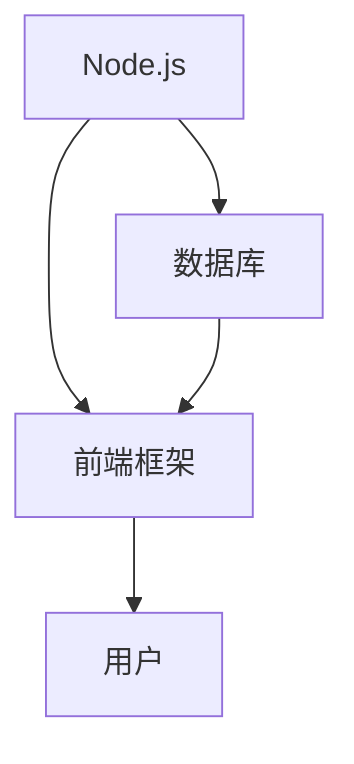

                 

关键词：全栈开发、Node.js、前端框架、全栈开发流程、技术栈整合、全栈架构设计、性能优化、开发经验、未来趋势。

## 摘要

本文将深入探讨JavaScript全栈开发的核心理念和实践方法。我们将重点关注Node.js作为后端服务的优势，以及如何与前端的现代框架（如React、Vue和Angular）无缝集成。通过详细的案例分析和技术讲解，我们将展示如何构建高效、可维护的全栈应用程序。本文还将探讨当前全栈开发的趋势和挑战，并提供相关的学习资源和工具推荐，以帮助开发者更好地掌握这一领域的技能。

## 1. 背景介绍

### 全栈开发的兴起

全栈开发（Full-Stack Development）是一种软件开发方法，要求开发人员具备前端和后端开发的能力。随着互联网技术的发展和用户需求的多样化，全栈开发越来越受到重视。它可以减少开发团队的沟通成本，提高开发效率，使项目能够快速响应市场需求。

### Node.js的崛起

Node.js是一个基于Chrome V8引擎的JavaScript运行环境，它使得JavaScript不仅可以在浏览器中运行，也可以在服务器端执行。Node.js的出现填补了JavaScript在服务器端的空白，为全栈开发提供了强大的支持。

### 前端框架的流行

前端框架，如React、Vue和Angular，极大地提高了前端开发的生产力和代码可维护性。这些框架提供了组件化、虚拟DOM、数据绑定等机制，使得开发者能够更高效地构建复杂的前端应用程序。

## 2. 核心概念与联系

### Node.js与前端框架的联系

Node.js作为服务器端环境，主要负责处理业务逻辑、数据库交互和API路由等功能。而前端框架则负责用户界面的渲染和交互，两者通过API进行数据通信。

### Mermaid流程图



在这个流程图中，Node.js作为核心服务器端，与数据库和前端框架紧密交互，最终呈现给用户。

## 3. 核心算法原理 & 具体操作步骤

### 3.1 算法原理概述

Node.js的核心算法包括事件驱动编程（Event-Driven Programming）和异步I/O（Asynchronous I/O）。事件驱动编程使得Node.js能够高效地处理大量并发请求，而异步I/O则避免了阻塞，提高了服务器的吞吐量。

### 3.2 算法步骤详解

1. **启动Node.js服务**：使用`http`模块创建一个HTTP服务器，并绑定到特定的端口。
2. **处理请求**：每当接收到HTTP请求时，Node.js会触发一个事件，通过回调函数处理请求。
3. **异步I/O操作**：在处理请求时，如果需要进行I/O操作（如数据库查询），Node.js不会等待操作完成，而是继续处理其他请求，提高效率。

### 3.3 算法优缺点

**优点**：
- 高并发处理能力
- 代码简单，易于维护

**缺点**：
- 内存占用较大
- 不适合CPU密集型任务

### 3.4 算法应用领域

Node.js适用于需要高并发、实时通信的应用，如聊天应用、实时游戏和在线协作工具。

## 4. 数学模型和公式 & 详细讲解 & 举例说明

### 4.1 数学模型构建

在Node.js中，事件处理可以看作是一个数学模型，其中事件作为输入，回调函数作为输出。

### 4.2 公式推导过程

事件处理的公式可以表示为：`输出 = 处理器（事件）`

### 4.3 案例分析与讲解

假设有一个简单的登录系统，用户发送登录请求，Node.js通过验证用户名和密码，返回登录结果。

```latex
\text{处理器（登录请求）} = \begin{cases}
\text{成功} & \text{如果用户名和密码正确} \\
\text{失败} & \text{否则}
\end{cases}
```

## 5. 项目实践：代码实例和详细解释说明

### 5.1 开发环境搭建

在开始项目实践之前，需要安装Node.js和所选前端框架（如React）。以下是一个基本的安装步骤：

1. 安装Node.js：从官网下载并安装Node.js。
2. 安装React：使用npm全局安装create-react-app工具。

### 5.2 源代码详细实现

以下是使用React和Node.js实现的一个简单博客系统的源代码：

```jsx
// 前端：React
import React, { useState, useEffect } from 'react';
import axios from 'axios';

function Blog() {
  const [posts, setPosts] = useState([]);

  useEffect(() => {
    async function fetchPosts() {
      const response = await axios.get('/api/posts');
      setPosts(response.data);
    }
    fetchPosts();
  }, []);

  return (
    <div>
      {posts.map(post => (
        <div key={post.id}>
          <h2>{post.title}</h2>
          <p>{post.content}</p>
        </div>
      ))}
    </div>
  );
}

export default Blog;
```

```javascript
// 后端：Node.js
const express = require('express');
const app = express();

app.get('/api/posts', (req, res) => {
  // 模拟从数据库获取数据
  const posts = [
    { id: 1, title: 'First Post', content: 'This is the first post.' },
    { id: 2, title: 'Second Post', content: 'This is the second post.' },
  ];
  res.json(posts);
});

const PORT = process.env.PORT || 3000;
app.listen(PORT, () => {
  console.log(`Server running on port ${PORT}`);
});
```

### 5.3 代码解读与分析

前端部分使用React实现，通过`useEffect`钩子异步获取博客列表。后端部分使用Node.js和Express框架，提供简单的API接口。

### 5.4 运行结果展示

运行前端React应用，访问`http://localhost:3000`，可以看到从Node.js后端获取的博客列表。

## 6. 实际应用场景

### 6.1 社交媒体平台

社交媒体平台如Twitter、Facebook等，需要处理大量的实时数据流，Node.js的高并发处理能力使其成为理想的选择。

### 6.2 在线教育平台

在线教育平台需要提供实时课程直播、互动讨论等功能，Node.js和前端框架的结合可以构建出高效、互动的学习环境。

### 6.3 物流跟踪系统

物流跟踪系统需要实时更新包裹状态，Node.js可以高效地处理大量的并发请求，确保系统的高可用性。

## 7. 工具和资源推荐

### 7.1 学习资源推荐

- 《Node.js官方文档》
- 《React官方文档》
- 《Vue官方文档》
- 《Angular官方文档》

### 7.2 开发工具推荐

- Visual Studio Code
- IntelliJ IDEA
- WebStorm

### 7.3 相关论文推荐

- "Node.js: Single-Process Server Design" by Ryan Dahl
- "React: A Flexible UI Library for Modern Web Apps" by Jordan Walke
- "Vue.js: The Progressive Framework" by Evan You
- "Angular: What's New in Angular 9" by the Angular Team

## 8. 总结：未来发展趋势与挑战

### 8.1 研究成果总结

Node.js和前端框架的结合在提高开发效率、降低沟通成本等方面取得了显著成果。未来，随着技术的不断发展，全栈开发将继续发挥其优势，成为主流开发模式。

### 8.2 未来发展趋势

- 服务端渲染（SSR）和静态站点生成器（SSG）的普及
- 跨平台开发工具的发展，如Electron和React Native
- 低代码平台的发展，减少开发者的编程负担

### 8.3 面临的挑战

- 内存管理和性能优化
- 安全性问题
- 代码复杂度和维护成本

### 8.4 研究展望

随着5G、物联网和云计算等技术的发展，全栈开发将面临新的机遇和挑战。开发者需要不断学习和适应新技术，以应对未来的挑战。

## 9. 附录：常见问题与解答

### 问题1：如何优化Node.js性能？

**解答**：优化Node.js性能可以从以下几个方面入手：

- 减少同步操作，使用异步I/O
- 使用负载均衡器，提高服务器处理能力
- 优化数据库查询，减少响应时间
- 定期更新Node.js版本，利用最新的性能优化

### 问题2：如何选择合适的前端框架？

**解答**：选择前端框架需要考虑以下因素：

- 项目需求：如果项目需要高度可定制性和丰富的组件库，可以考虑Angular；如果项目需要快速开发和小型团队，可以考虑Vue或React。

- 团队技能：团队熟悉哪个框架，可以更高效地进行开发。

- 生态圈：框架的社区支持和生态系统是否丰富。

## 结束语

JavaScript全栈开发是一项充满挑战和机遇的任务。通过Node.js和前端框架的结合，开发者可以构建出高效、可维护的全栈应用程序。本文希望为读者提供实用的指导和建议，帮助您在JavaScript全栈开发的道路上越走越远。

---

**作者：禅与计算机程序设计艺术 / Zen and the Art of Computer Programming**

