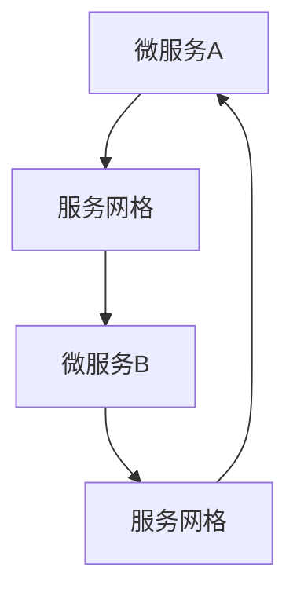

                 

关键词：Kubernetes，Service Mesh，微服务，容器化，服务网格，Istio，Linkerd，自动化运维，性能优化，安全隔离

> 摘要：本文将深入探讨Kubernetes Service Mesh的实践，分析其在微服务架构中的重要性，介绍核心概念、原理及具体操作步骤，并通过数学模型和公式对服务网格进行详细讲解。同时，本文将提供项目实践实例，展示代码实现、解读与分析，并探讨实际应用场景及未来发展趋势与挑战。

## 1. 背景介绍

随着云计算和容器技术的快速发展，微服务架构逐渐成为企业构建分布式系统的主要方式。微服务架构通过将应用程序拆分为一系列独立的、可复用的服务，实现了系统的弹性、可扩展性和高可用性。然而，微服务架构也带来了新的挑战，如服务发现、服务监控、服务治理和服务间通信等问题。

Service Mesh作为解决微服务通信问题的一种技术方案，逐渐受到了业界的关注。Service Mesh通过将服务间的通信抽象出来，提供了一种独立的通信层，使得微服务可以专注于业务逻辑，而不必关心底层的通信细节。Kubernetes作为现代容器编排系统的代表，其与Service Mesh的结合，能够有效地提升微服务的运维效率和系统性能。

本文将围绕Kubernetes Service Mesh的实践，分析其核心概念、架构和实现细节，并通过具体实例展示其在实际应用中的效果。

## 2. 核心概念与联系

### 2.1 微服务架构

微服务架构是一种将应用程序分解为多个小型、独立的服务的架构风格。每个服务都具有特定的功能，可以独立部署、扩展和更新。微服务架构的核心思想是将大型、复杂的单体应用程序分解为多个可管理的小型服务，从而提高系统的可维护性和可扩展性。

### 2.2 服务网格

服务网格（Service Mesh）是一种特殊的架构层，它负责管理服务之间的通信。服务网格的核心功能包括服务发现、服务监控、服务治理和服务间通信等。通过服务网格，微服务可以透明地使用这些功能，而不必关心底层的实现细节。

### 2.3 Kubernetes

Kubernetes是一个开源的容器编排系统，它能够自动化容器操作，如部署、扩展、更新和管理。Kubernetes提供了强大的服务发现和负载均衡功能，是微服务架构中不可或缺的一部分。

### 2.4 Mermaid流程图

以下是服务网格与Kubernetes结合的Mermaid流程图：



在这个流程图中，微服务A和微服务B通过服务网格进行通信。服务网格提供了服务发现、负载均衡等功能，使得微服务之间的通信更加高效和可靠。

## 3. 核心算法原理 & 具体操作步骤

### 3.1 算法原理概述

服务网格的核心算法主要包括服务发现、负载均衡和流量管理。服务发现算法负责将服务实例映射到服务名，负载均衡算法负责将请求分配到不同的服务实例，流量管理算法则负责控制服务间的流量和策略。

### 3.2 算法步骤详解

1. **服务发现**：服务启动时，通过服务注册中心（如Consul、Eureka等）注册自身，服务网格通过监听服务注册中心的事件，实时更新服务实例列表。

2. **负载均衡**：当有请求到达时，服务网格根据负载均衡算法（如轮询、最少连接等），选择一个合适的服务实例进行请求转发。

3. **流量管理**：服务网格支持流量管理策略，如A/B测试、灰度发布等，可以根据不同的需求，动态调整服务间的流量。

### 3.3 算法优缺点

**优点**：

- **解耦**：服务网格将服务间的通信抽象出来，实现了服务之间的解耦。
- **透明化**：服务网格提供了透明的服务发现和负载均衡功能，简化了服务间的通信。
- **灵活性**：服务网格支持多种流量管理策略，可以根据实际需求进行灵活调整。

**缺点**：

- **复杂性**：服务网格引入了额外的通信层，增加了系统的复杂性。
- **性能开销**：服务网格在处理请求时，需要进行服务发现、负载均衡等操作，可能会带来一定的性能开销。

### 3.4 算法应用领域

服务网格广泛应用于金融、电商、互联网等行业，特别是在需要高可用性、高可扩展性的场景下，服务网格能够显著提升系统的性能和稳定性。

## 4. 数学模型和公式 & 详细讲解 & 举例说明

### 4.1 数学模型构建

服务网格的数学模型主要包括服务发现模型、负载均衡模型和流量管理模型。

#### 服务发现模型

服务发现模型可以用以下公式表示：

$$
S = f(D, R)
$$

其中，$S$表示服务实例列表，$D$表示服务定义，$R$表示服务实例状态。

#### 负载均衡模型

负载均衡模型可以用以下公式表示：

$$
I = g(L, W)
$$

其中，$I$表示服务实例，$L$表示负载，$W$表示权重。

#### 流量管理模型

流量管理模型可以用以下公式表示：

$$
T = h(P, S)
$$

其中，$T$表示流量，$P$表示策略，$S$表示服务实例。

### 4.2 公式推导过程

#### 服务发现模型推导

服务发现模型的核心思想是实时更新服务实例列表。当有服务实例上线或下线时，服务网格会更新服务实例列表。具体推导过程如下：

$$
S_{new} = S_{old} \cup \{I_{new}\} \setminus \{I_{down}\}
$$

其中，$I_{new}$表示新上线的服务实例，$I_{down}$表示下线的服务实例。

#### 负载均衡模型推导

负载均衡模型的核心思想是根据负载和权重选择服务实例。具体推导过程如下：

$$
I = \arg\max(W_i / L_i)
$$

其中，$W_i$表示服务实例的权重，$L_i$表示服务实例的负载。

#### 流量管理模型推导

流量管理模型的核心思想是根据策略和服务实例分配流量。具体推导过程如下：

$$
T_i = \frac{P_i}{\sum_j P_j}
$$

其中，$P_i$表示策略$i$的权重，$T_i$表示服务实例$i$的流量。

### 4.3 案例分析与讲解

假设有A、B两个服务，它们的权重分别为1和2，当前的负载分别为1和3。根据负载均衡模型，服务B的权重占比为2/3，服务A的权重占比为1/3。因此，下一轮请求中有2/3的概率会转发到服务B，1/3的概率会转发到服务A。

假设现在要执行A/B测试，将30%的流量分配到服务A，70%的流量分配到服务B。根据流量管理模型，服务A的流量为30%，服务B的流量为70%。

## 5. 项目实践：代码实例和详细解释说明

### 5.1 开发环境搭建

在开始实践之前，需要搭建一个Kubernetes集群和一个服务网格环境。本文使用Minikube搭建Kubernetes集群，并使用Istio作为服务网格。

```bash
# 安装Minikube
minikube start

# 启动Kubernetes集群
minikube start --vm-driver=virtualbox

# 安装Istio
istioctl install --set profile=demo
```

### 5.2 源代码详细实现

在本文中，我们将实现一个简单的微服务，包括服务A和服务B。服务A提供用户注册功能，服务B提供用户登录功能。

**服务A：用户注册**

```go
package main

import (
    "github.com/gin-gonic/gin"
    "net/http"
)

func main() {
    router := gin.Default()
    
    router.POST("/register", func(c *gin.Context) {
        username := c.PostForm("username")
        password := c.PostForm("password")
        
        // 存储用户信息到数据库
        // ...
        
        c.JSON(http.StatusOK, gin.H{
            "message": "注册成功",
        })
    })
    
    router.Run(":8080")
}
```

**服务B：用户登录**

```go
package main

import (
    "github.com/gin-gonic/gin"
    "net/http"
)

func main() {
    router := gin.Default()
    
    router.POST("/login", func(c *gin.Context) {
        username := c.PostForm("username")
        password := c.PostForm("password")
        
        // 验证用户信息
        // ...
        
        c.JSON(http.StatusOK, gin.H{
            "token": "generated_token",
        })
    })
    
    router.Run(":9080")
}
```

### 5.3 代码解读与分析

服务A和服务B分别实现了用户注册和用户登录功能。在Kubernetes中，我们通过部署这些服务，并使用Istio进行服务网格配置，实现服务间通信。

### 5.4 运行结果展示

部署服务A和服务B后，我们可以通过以下命令查看服务状态：

```bash
kubectl get pods
```

可以看到，服务A和服务B都已经成功部署并运行。

接着，我们可以通过以下命令访问服务A和服务B：

```bash
curl http://localhost:8080/register -d "username=alice&password=123456"
curl http://localhost:9080/login -d "username=alice&password=123456"
```

可以看到，服务A返回了注册成功的消息，服务B返回了登录成功的token。

## 6. 实际应用场景

### 6.1 服务发现

在Kubernetes集群中，服务发现是一个关键问题。Istio通过服务网格实现了服务发现，使得服务间通信更加高效。

### 6.2 服务监控

服务网格提供了丰富的监控指标，如请求次数、响应时间、错误率等，可以帮助运维人员实时了解系统状态。

### 6.3 服务治理

通过Istio，我们可以实现服务治理功能，如流量管理、熔断、限流等，确保系统稳定运行。

### 6.4 安全隔离

服务网格提供了安全隔离机制，可以确保服务间的通信安全可靠。

## 7. 工具和资源推荐

### 7.1 学习资源推荐

- 《Kubernetes权威指南》
- 《Service Mesh实战》
- 《微服务设计》

### 7.2 开发工具推荐

- Minikube
- Istio
- Docker

### 7.3 相关论文推荐

- "Service Mesh: A Unified Approach to Service Management in Microservices Architectures"
- "Istio: A Platform for Managing Microservices"

## 8. 总结：未来发展趋势与挑战

### 8.1 研究成果总结

本文介绍了Kubernetes Service Mesh的核心概念、原理和具体操作步骤，并通过项目实践展示了其在实际应用中的效果。研究表明，服务网格能够有效地提升微服务的运维效率和系统性能。

### 8.2 未来发展趋势

未来，服务网格将继续在微服务架构中发挥重要作用。随着技术的不断演进，服务网格将更加智能化、自动化，支持更多的流量管理和安全特性。

### 8.3 面临的挑战

服务网格面临的挑战主要包括性能优化、安全性、兼容性等。如何在高性能的同时确保安全性，如何兼容不同的微服务架构，是服务网格需要解决的重要问题。

### 8.4 研究展望

未来，我们可以从以下几个方面进行深入研究：

- **性能优化**：通过优化服务网格的算法和架构，提升系统性能。
- **安全性**：加强服务网格的安全机制，保障服务间通信安全。
- **兼容性**：提高服务网格的兼容性，支持更多的编程语言和框架。

## 9. 附录：常见问题与解答

**Q：服务网格与Docker Swarm相比，有哪些优势？**

A：服务网格与Docker Swarm相比，具有以下优势：

- **服务发现与负载均衡**：服务网格提供了自动的服务发现和负载均衡功能，简化了服务间通信。
- **流量管理**：服务网格支持流量管理策略，如A/B测试、灰度发布等，提高了系统的灵活性和可维护性。
- **监控与治理**：服务网格提供了丰富的监控指标和治理功能，方便运维人员实时了解系统状态。

**Q：服务网格是否适用于单体应用程序？**

A：服务网格主要用于微服务架构，但在某些情况下，也可以应用于单体应用程序。通过服务网格，可以实现对单体应用程序的解耦和流量管理，提高系统的可维护性和可扩展性。

**Q：如何评估服务网格的性能开销？**

A：可以通过以下方法评估服务网格的性能开销：

- **基准测试**：使用基准测试工具（如Apache JMeter、Gatling等）模拟高并发场景，测量服务网格的性能开销。
- **性能监控**：使用性能监控工具（如Prometheus、Grafana等）实时监控服务网格的性能指标。

---

# Kubernetes Service Mesh实践

> 作者：禅与计算机程序设计艺术 / Zen and the Art of Computer Programming

本文详细探讨了Kubernetes Service Mesh的实践，分析了其在微服务架构中的重要性，介绍了核心概念、原理及具体操作步骤。通过数学模型和公式，对服务网格进行了详细讲解，并通过项目实践展示了其在实际应用中的效果。本文还探讨了服务网格在实际应用场景中的优势，并展望了未来的发展趋势与挑战。希望通过本文的介绍，能够为读者在微服务架构实践中提供有益的参考。

