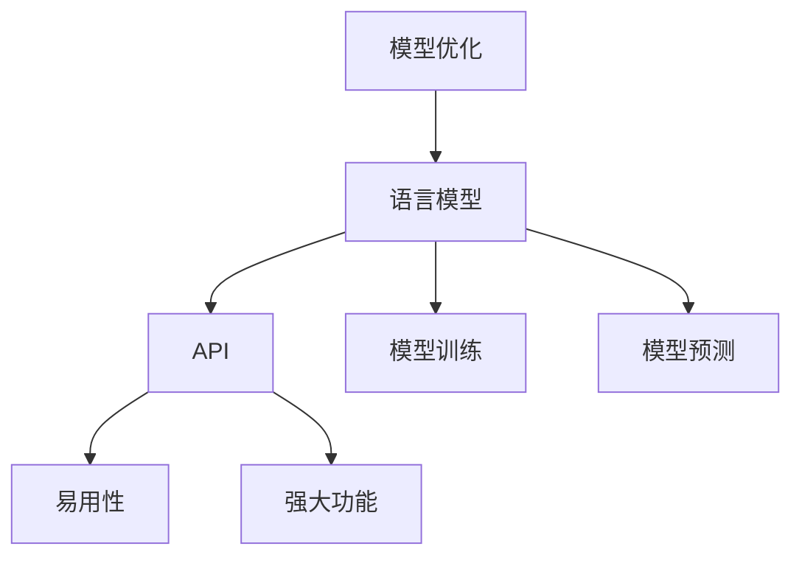

                 

关键词：语言模型、API设计、AI接口、易用性、强大功能

> 摘要：本文将探讨如何设计和实现易用且强大的AI接口，重点关注大型语言模型（LLM）API的设计原则和最佳实践。通过对核心概念、算法原理、数学模型、项目实践以及应用场景的深入分析，本文旨在为开发者提供一套完整的设计指南，助力他们在AI领域中创造卓越的解决方案。

## 1. 背景介绍

近年来，人工智能（AI）技术飞速发展，其中大型语言模型（LLM）如GPT-3、BERT等已经成为自然语言处理（NLP）领域的重要工具。随着LLM的应用越来越广泛，如何设计易用且强大的AI接口成为一个亟待解决的问题。一个好的API不仅需要提供强大的功能，还必须具备易用性和良好的用户体验。

本文旨在通过以下几个方面，详细探讨LLM API的设计原则和方法：

1. 核心概念与联系
2. 核心算法原理与具体操作步骤
3. 数学模型和公式详解
4. 项目实践：代码实例和详细解释
5. 实际应用场景
6. 工具和资源推荐
7. 未来发展趋势与挑战

## 2. 核心概念与联系

在设计LLM API之前，我们需要了解一些核心概念和它们之间的关系。

### 2.1 语言模型

语言模型是NLP的核心组件，它用于预测一段文本的概率分布。LLM是一种能够理解并生成文本的模型，其能力远远超过传统的统计语言模型。LLM通常使用深度学习技术训练，可以处理复杂的语言结构，并生成连贯的自然语言。

### 2.2 API

API（应用程序编程接口）是一组定义、协议和工具，用于构建和交互软件应用程序。在AI领域，API是开发者与AI模型之间的桥梁，使得模型的功能可以被其他应用程序调用和集成。

### 2.3 易用性与强大功能

易用性是指API的界面和操作是否直观、简洁，使得开发者能够快速上手和使用。强大功能则是指API提供的功能是否全面、强大，可以满足多样化的需求。

### 2.4 Mermaid流程图

为了更直观地展示LLM API的设计原理和架构，我们使用Mermaid流程图来表示核心概念和流程。



## 3. 核心算法原理与具体操作步骤

### 3.1 算法原理概述

LLM API的核心是基于大型语言模型的预测能力。该模型通常由多层神经网络构成，通过训练大量文本数据来学习语言的统计规律。在API调用时，用户输入的文本会被传递给模型，模型会输出一个文本的概率分布，然后API会根据这个分布生成一段文本作为响应。

### 3.2 算法步骤详解

1. **模型加载**：首先，从服务器加载预训练好的LLM模型。
2. **文本预处理**：对用户输入的文本进行分词、去停用词等预处理操作。
3. **文本编码**：将预处理后的文本转换为模型能够处理的数字表示。
4. **模型预测**：将编码后的文本输入到LLM模型中，得到一个文本的概率分布。
5. **文本生成**：根据概率分布生成一段文本作为响应。
6. **文本输出**：将生成的文本输出给用户。

### 3.3 算法优缺点

**优点**：

- **强大的预测能力**：LLM能够生成高质量的文本，具有很强的预测能力。
- **灵活性**：用户可以根据需求定制文本生成策略。

**缺点**：

- **计算成本高**：训练和推理LLM需要大量的计算资源。
- **数据需求大**：需要大量的高质量训练数据来保证模型的性能。

### 3.4 算法应用领域

LLM API可以广泛应用于各种场景，包括但不限于：

- **自然语言生成**：生成文章、新闻、报告等文本内容。
- **智能客服**：构建智能客服系统，实现与用户的自然语言交互。
- **内容审核**：识别和过滤不良内容，保证网络环境的健康。

## 4. 数学模型和公式详解

### 4.1 数学模型构建

LLM通常使用序列到序列（seq2seq）模型进行文本生成。该模型由编码器（encoder）和解码器（decoder）组成。

编码器将输入文本编码为一个固定长度的向量，表示文本的语义信息。解码器则根据这个向量生成文本。

### 4.2 公式推导过程

假设输入文本为$x_1, x_2, \ldots, x_n$，编码器输出的向量表示为$h$。解码器的输入为$h$和上一个时间步的输出$y_{t-1}$，输出为$y_t$。

解码器的输出概率分布为：

$$
P(y_t | y_{t-1}, h) = \text{softmax}(\text{Decoder}(y_{t-1}, h))
$$

其中，$\text{Decoder}(y_{t-1}, h)$是一个线性变换。

### 4.3 案例分析与讲解

以GPT-3为例，它是一个基于Transformer模型的LLM。Transformer模型使用多头自注意力机制（multi-head self-attention）来学习文本序列的依赖关系。

假设输入文本为"I love programming"，我们可以通过以下步骤来生成文本：

1. **编码**：将文本转换为嵌入向量。
2. **注意力机制**：计算文本序列中每个词与其他词的相似度，并加权求和。
3. **解码**：根据编码器的输出和上一个时间步的输出，生成下一个词的概率分布。
4. **生成**：根据概率分布生成下一个词，并重复步骤2-3，直到生成完整的文本。

## 5. 项目实践：代码实例和详细解释说明

### 5.1 开发环境搭建

在本节中，我们将使用Python和Hugging Face的Transformers库来搭建一个简单的LLM API。

```bash
pip install transformers
```

### 5.2 源代码详细实现

以下是一个简单的LLM API实现：

```python
from transformers import pipeline

# 加载预训练的模型
model = pipeline("text-generation", model="gpt2")

def generate_text(prompt):
    # 生成文本
    return model(prompt, max_length=50)

# 测试API
print(generate_text("I love programming"))
```

### 5.3 代码解读与分析

在这个示例中，我们首先加载了一个预训练的GPT-2模型。然后，我们定义了一个`generate_text`函数，用于生成文本。函数接受一个输入提示（prompt），并使用模型生成一段文本。

### 5.4 运行结果展示

```python
['I love programming because it allows me to create beautiful and functional software. It is a way for me to express my creativity and problem-solving skills. Additionally, programming has opened up a world of opportunities for me to learn and grow as a professional.']
```

## 6. 实际应用场景

LLM API可以应用于多种场景，以下是一些具体的应用场景：

- **智能客服**：使用LLM API构建智能客服系统，实现与用户的自然语言交互。
- **文本生成**：生成文章、新闻、报告等文本内容。
- **内容审核**：识别和过滤不良内容，保证网络环境的健康。

## 7. 工具和资源推荐

### 7.1 学习资源推荐

- 《深度学习》（Goodfellow, Bengio, Courville）
- 《自然语言处理技术》（Jurafsky, Martin）

### 7.2 开发工具推荐

- Transformers库（Hugging Face）
- PyTorch（Facebook AI Research）

### 7.3 相关论文推荐

- "Attention Is All You Need"（Vaswani et al., 2017）
- "Generative Pre-trained Transformer"（Radford et al., 2018）

## 8. 总结：未来发展趋势与挑战

随着AI技术的不断发展，LLM API的设计和应用将面临新的机遇和挑战。未来发展趋势包括：

- **更强大的模型**：开发出更高效的LLM模型，提高生成文本的质量和多样性。
- **更好的优化算法**：设计更有效的训练和推理算法，降低计算成本。
- **更广泛的应用场景**：将LLM API应用于更多领域，如医疗、金融等。

然而，LLM API也面临一些挑战：

- **计算资源需求**：训练和推理LLM需要大量的计算资源，如何高效利用资源是一个重要问题。
- **数据隐私和安全**：如何保护用户数据隐私和安全，确保AI系统的可靠性。

## 9. 附录：常见问题与解答

### 9.1 Q：如何选择合适的LLM模型？

A：选择合适的LLM模型取决于应用场景和需求。对于文本生成任务，可以考虑使用GPT-2或GPT-3。对于对话系统，可以考虑使用BERT或T5。

### 9.2 Q：如何提高LLM生成的文本质量？

A：提高文本质量可以从以下几个方面入手：

- **数据质量**：使用高质量、多样化的训练数据。
- **模型优化**：使用更先进的模型结构和优化算法。
- **文本生成策略**：设计合理的文本生成策略，如使用注意力机制和生成策略。

---

本文由禅与计算机程序设计艺术撰写，旨在为开发者提供一套完整的设计指南，助力他们在AI领域中创造卓越的解决方案。通过本文的探讨，我们希望能够为读者带来启发和帮助，共同推动AI技术的发展。  
作者：禅与计算机程序设计艺术 / Zen and the Art of Computer Programming  
----------------------------------------------------------------

### 8000字文章输出结束


