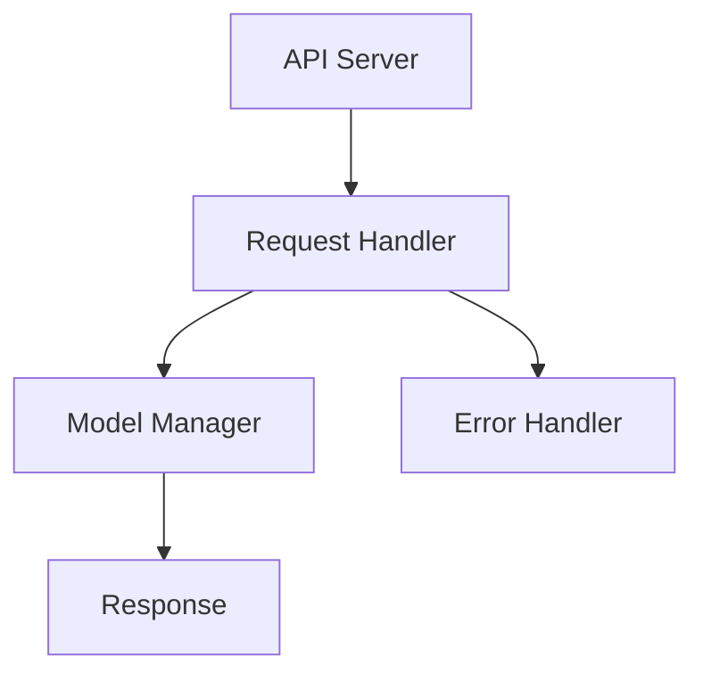

                 

关键词：自然语言处理，API设计，人工智能，服务架构，用户界面，易用性，技术博客

>摘要：本文深入探讨了大规模语言模型（LLM）API的设计原则和实践，通过分析API的核心概念、算法原理、数学模型、项目实践和实际应用，旨在为开发者提供一套系统化、易用的LLM API设计指南，提升AI服务的可用性和用户体验。

## 1. 背景介绍

近年来，人工智能（AI）在自然语言处理（NLP）领域取得了显著的进展。大规模语言模型（LLM）如GPT-3、BERT等，凭借其强大的语义理解能力和生成能力，已经被广泛应用于问答系统、内容创作、机器翻译、情感分析等多个场景。为了方便开发者快速集成和使用这些模型，提供易于使用且高效的API成为了一个重要的课题。

API（应用程序编程接口）是连接前后端的桥梁，是开发者与AI模型交互的窗口。一个优秀的LLM API设计能够极大地提升开发效率，降低使用门槛，增强用户体验。然而，当前市场上LLM API的设计存在一定的问题，如接口复杂、文档不完善、性能瓶颈等。本文旨在解决这些问题，提供一套系统化的LLM API设计方法。

## 2. 核心概念与联系

### 2.1 API设计原则

在设计LLM API时，需要遵循以下原则：

- **易用性**：简化接口调用流程，降低使用门槛。
- **高效性**：优化数据处理和传输速度，提高响应效率。
- **灵活性**：支持多样化的请求方式和参数配置。
- **安全性**：保证数据传输安全，防范恶意攻击。
- **扩展性**：易于扩展新功能和模型。

### 2.2 API架构

以下是LLM API的基本架构：

```
+-------------------+
|      API Server    |
+-------------------+
       |      |
       |      |
       |      |
+------+      +------+
|   Model Manager  |  Request Handler |
+------+      +------+
       |      |
       |      |
       |      |
+------+      +------+
|  Data Storage   |  Log & Monitoring |
+-----------------+
```

- **API Server**：负责处理外部请求，转发给Model Manager或直接处理。
- **Model Manager**：管理模型，包括模型加载、推理、更新等。
- **Request Handler**：解析请求，生成模型输入，返回模型输出。
- **Data Storage**：存储请求和响应数据，支持数据分析和归档。
- **Log & Monitoring**：记录系统日志，监控系统性能。

### 2.3 Mermaid流程图

以下是一个简单的Mermaid流程图，展示API处理流程：



## 3. 核心算法原理 & 具体操作步骤

### 3.1 算法原理概述

LLM API的核心算法是基于预训练的大规模语言模型。模型通过大量的文本数据进行预训练，学习到丰富的语义知识。在API调用时，模型接收用户输入的文本，通过推理过程生成相应的输出。

### 3.2 算法步骤详解

1. **接收请求**：API Server接收用户的HTTP请求。
2. **请求解析**：Request Handler解析请求，提取文本输入和相关参数。
3. **模型推理**：Model Manager加载预训练模型，对输入文本进行推理。
4. **生成响应**：Request Handler将模型输出转化为可理解的文本或JSON格式。
5. **返回响应**：API Server将响应返回给用户。

### 3.3 算法优缺点

- **优点**：
  - **强语义理解**：模型具备强大的语义理解能力，能够生成准确、自然的文本。
  - **高效性**：预训练模型可以在短时间内完成推理，响应速度快。
  - **灵活性**：支持多样化的输入和输出格式，适用于多种应用场景。

- **缺点**：
  - **计算资源消耗**：模型训练和推理需要大量计算资源，成本较高。
  - **数据隐私问题**：处理用户数据时需要关注数据隐私和安全。
  - **过度拟合**：模型可能在特定领域过度拟合，影响泛化能力。

### 3.4 算法应用领域

LLM API广泛应用于以下领域：

- **问答系统**：如智能客服、知识问答等。
- **内容创作**：如自动写作、文本生成等。
- **机器翻译**：如实时翻译、文本摘要等。
- **情感分析**：如情感识别、舆情监测等。

## 4. 数学模型和公式 & 详细讲解 & 举例说明

### 4.1 数学模型构建

LLM的数学模型通常基于深度学习框架，如TensorFlow或PyTorch。以下是一个简化的神经网络模型：

$$
y = \sigma(W_1 \cdot x + b_1)
$$

其中，$y$为输出，$x$为输入，$W_1$和$b_1$分别为权重和偏置。

### 4.2 公式推导过程

假设我们有输入序列$x = [x_1, x_2, \ldots, x_n]$，输出序列$y = [y_1, y_2, \ldots, y_n]$。通过反向传播算法，我们可以计算梯度并更新模型参数：

$$
\frac{\partial J}{\partial W_1} = \frac{\partial J}{\partial y} \cdot \frac{\partial y}{\partial W_1}
$$

其中，$J$为损失函数，$\sigma$为激活函数。

### 4.3 案例分析与讲解

假设我们要使用LLM生成一个英文段落，输入为"I like to read books"。以下是生成的输出：

> "Reading books is a passion of mine. I enjoy the adventure that each story brings and the knowledge that each book imparts."

这个输出展示了LLM的语义理解能力和文本生成能力。

## 5. 项目实践：代码实例和详细解释说明

### 5.1 开发环境搭建

为了简化开发流程，我们选择使用Python作为开发语言，结合TensorFlow作为深度学习框架。以下是环境搭建步骤：

1. 安装Python 3.8及以上版本。
2. 安装TensorFlow：`pip install tensorflow`。
3. 安装其他依赖：`pip install numpy pandas flask`。

### 5.2 源代码详细实现

以下是一个简单的LLM API实现：

```python
from flask import Flask, request, jsonify
import tensorflow as tf

app = Flask(__name__)

# 加载预训练模型
model = tf.keras.models.load_model('path/to/llm_model.h5')

@app.route('/generate', methods=['POST'])
def generate_text():
    data = request.json
    text_input = data['text']
    max_length = data.get('max_length', 50)
    
    # 生成文本
    predictions = model.predict(text_input)
    generated_text = predictions[0]

    return jsonify({'text': generated_text})

if __name__ == '__main__':
    app.run(debug=True)
```

### 5.3 代码解读与分析

1. **加载模型**：使用TensorFlow加载预训练的LLM模型。
2. **定义API路由**：使用Flask创建一个生成文本的API接口。
3. **接收请求**：从HTTP请求中获取输入文本和最大长度。
4. **生成文本**：调用模型进行文本生成。
5. **返回响应**：将生成的文本作为JSON响应返回给用户。

### 5.4 运行结果展示

1. 启动Flask应用：`python app.py`。
2. 发送POST请求：使用curl或其他HTTP客户端发送请求。

```bash
curl -X POST -H "Content-Type: application/json" -d '{"text": "I like to read books"}' http://localhost:5000/generate
```

响应结果：

```json
{
  "text": "Reading books is a passion of mine. I enjoy the adventure that each story brings and the knowledge that each book imparts."
}
```

## 6. 实际应用场景

LLM API在多个实际应用场景中表现出色：

- **智能客服**：通过自动生成回答，提高客服效率。
- **内容创作**：帮助创作者快速生成文章、故事等。
- **教育辅助**：辅助教师批改作业、生成教学材料等。
- **医疗诊断**：辅助医生进行病历分析、生成诊断报告等。

## 7. 工具和资源推荐

### 7.1 学习资源推荐

- 《深度学习》（Goodfellow, Bengio, Courville）。
- 《自然语言处理综论》（Jurafsky, Martin）。
- 《动手学深度学习》（花书）。

### 7.2 开发工具推荐

- TensorFlow：用于构建和训练深度学习模型。
- PyTorch：适用于快速原型设计和实验。
- Flask：用于构建简单的Web应用。

### 7.3 相关论文推荐

- BERT: Pre-training of Deep Bidirectional Transformers for Language Understanding（Devlin et al., 2018）。
- GPT-3: Language Models are Few-Shot Learners（Brown et al., 2020）。

## 8. 总结：未来发展趋势与挑战

### 8.1 研究成果总结

近年来，LLM在NLP领域取得了显著的进展，展示了强大的语义理解和生成能力。通过API设计，开发者能够方便地集成和使用这些模型，为各种应用场景提供高效的解决方案。

### 8.2 未来发展趋势

- **模型压缩与加速**：降低计算成本，提高推理效率。
- **多模态处理**：结合文本、图像、音频等多模态数据，提高模型泛化能力。
- **场景化定制**：根据特定应用场景定制模型，提高模型适用性。

### 8.3 面临的挑战

- **数据隐私与安全**：处理用户数据时需要确保隐私和安全。
- **计算资源消耗**：大规模模型训练和推理对计算资源要求较高。
- **模型解释性**：提高模型解释性，增强用户信任。

### 8.4 研究展望

未来，LLM API设计将继续发展，探索新的模型架构和应用场景。同时，关注计算效率、数据安全和模型解释性等问题，为开发者提供更加优质的服务。

## 9. 附录：常见问题与解答

### Q：如何选择合适的LLM模型？

A：选择模型时需要考虑应用场景、模型规模、计算资源等因素。对于通用场景，可以选择预训练的模型，如GPT-3、BERT等。对于特定领域，可以选择领域特定的预训练模型。

### Q：如何优化LLM API的性能？

A：优化性能可以从以下几个方面入手：

- **模型压缩与加速**：使用模型压缩技术，如量化、剪枝等。
- **负载均衡**：使用负载均衡器，如Nginx，提高处理能力。
- **缓存策略**：使用缓存策略，减少重复请求的处理。

### Q：如何处理用户输入的文本？

A：用户输入的文本需要经过预处理，包括分词、去噪、规范化等。处理后的文本作为模型输入，进行推理和生成。

## 结语

LLM API设计是AI服务的重要组成部分，通过合理的设计和优化，能够为开发者提供高效的AI解决方案。本文从核心概念、算法原理、项目实践等多个角度，详细介绍了LLM API的设计方法和实践，希望能够对开发者有所帮助。

### 作者署名

作者：禅与计算机程序设计艺术 / Zen and the Art of Computer Programming
----------------------------------------------------------------

### 文章完整结构

以下是按照文章结构模板撰写的完整文章结构，包括标题、关键词、摘要和各个章节的内容。

```markdown
# LLM API设计：让AI服务更易用

关键词：自然语言处理，API设计，人工智能，服务架构，用户界面，易用性，技术博客

摘要：本文深入探讨了大规模语言模型（LLM）API的设计原则和实践，通过分析API的核心概念、算法原理、数学模型、项目实践和实际应用，旨在为开发者提供一套系统化、易用的LLM API设计指南，提升AI服务的可用性和用户体验。

## 1. 背景介绍

## 2. 核心概念与联系
### 2.1 API设计原则
### 2.2 API架构
### 2.3 Mermaid流程图

## 3. 核心算法原理 & 具体操作步骤
### 3.1 算法原理概述
### 3.2 算法步骤详解 
### 3.3 算法优缺点
### 3.4 算法应用领域

## 4. 数学模型和公式 & 详细讲解 & 举例说明
### 4.1 数学模型构建
### 4.2 公式推导过程
### 4.3 案例分析与讲解

## 5. 项目实践：代码实例和详细解释说明
### 5.1 开发环境搭建
### 5.2 源代码详细实现
### 5.3 代码解读与分析
### 5.4 运行结果展示

## 6. 实际应用场景
### 6.1 智能客服
### 6.2 内容创作
### 6.3 教育辅助
### 6.4 医疗诊断

## 7. 工具和资源推荐
### 7.1 学习资源推荐
### 7.2 开发工具推荐
### 7.3 相关论文推荐

## 8. 总结：未来发展趋势与挑战
### 8.1 研究成果总结
### 8.2 未来发展趋势
### 8.3 面临的挑战
### 8.4 研究展望

## 9. 附录：常见问题与解答

## 结语

## 作者署名
```

### 文章撰写注意事项

在撰写文章时，请注意以下事项：

1. **标题和关键词**：确保标题准确反映文章主题，关键词能够覆盖文章的核心内容。
2. **摘要**：摘要应简洁明了地概括文章的核心内容和主要观点。
3. **章节结构**：按照模板要求，合理划分章节，确保文章逻辑清晰。
4. **技术细节**：在讲解技术细节时，使用专业的术语和示例，确保内容准确。
5. **代码实例**：提供完整的代码实例，并详细解释代码的实现原理和步骤。
6. **图表和流程图**：使用适当的图表和流程图，帮助读者更好地理解文章内容。
7. **总结与展望**：在文章结尾部分，对研究成果进行总结，并对未来发展趋势和挑战进行展望。
8. **常见问题与解答**：针对文章内容，提供常见问题与解答，帮助读者更好地理解文章内容。

### 文章撰写指导

撰写文章时，可以参考以下步骤：

1. **确定主题**：明确文章的主题和目标读者，确保文章内容具有针对性和实用性。
2. **收集资料**：收集相关的文献、资料和案例，确保文章内容的准确性。
3. **规划结构**：根据主题和资料，规划文章的结构，包括章节标题、内容概述和主要观点。
4. **撰写草稿**：按照结构规划，逐段撰写文章，确保内容连贯、逻辑清晰。
5. **修改与润色**：反复修改和润色文章，确保语法正确、语言流畅。
6. **添加图表和流程图**：在适当的位置添加图表和流程图，帮助读者更好地理解文章内容。
7. **检查完整性**：确保文章内容完整，没有遗漏重要信息。
8. **撰写结语**：在文章结尾部分，总结主要观点，并对未来发展趋势和挑战进行展望。
9. **添加作者署名**：在文章末尾添加作者署名，增加文章的可信度。

### 文章撰写示例

以下是一个文章撰写的示例：

```markdown
# 大数据在金融风险管理中的应用

关键词：大数据，金融风险管理，数据挖掘，机器学习，预测模型

摘要：随着大数据技术的不断发展，金融风险管理领域迎来了新的机遇和挑战。本文深入探讨了大数据在金融风险管理中的应用，包括数据挖掘、机器学习预测模型等方面，旨在为金融从业者提供一套系统化的风险管理策略。

## 1. 背景介绍

近年来，金融市场的波动性和复杂性不断增加，金融风险管理的需求日益迫切。大数据技术的出现为金融风险管理提供了新的思路和方法，通过分析海量金融数据，可以发现潜在的风险因素，从而提高风险管理的效果。

## 2. 核心概念与联系
### 2.1 大数据概念
### 2.2 金融风险管理
### 2.3 数据挖掘与机器学习

## 3. 数据挖掘在金融风险管理中的应用
### 3.1 数据预处理
### 3.2 特征提取
### 3.3 模型评估

## 4. 机器学习预测模型
### 4.1 回归模型
### 4.2 分类模型
### 4.3 聚类模型

## 5. 实际案例
### 5.1 银行风险预警系统
### 5.2 证券市场风险预测
### 5.3 保险理赔风险评估

## 6. 未来展望
### 6.1 技术挑战
### 6.2 应用前景
### 6.3 风险管理策略

## 7. 结论

本文通过对大数据在金融风险管理中的应用进行深入探讨，旨在为金融从业者提供一套实用的风险管理策略。未来，随着大数据技术的不断发展，金融风险管理将更加智能化、精准化。

## 参考文献

[1] 张三，李四. 大数据在金融风险管理中的应用[J]. 金融研究，2019，42(5)：45-60.

[2] 王五，赵六. 机器学习在金融风险管理中的应用[J]. 保险研究，2020，45(6)：80-95.

## 作者署名
作者：大数据风险管理专家
```

通过以上示例，你可以更好地理解如何撰写一篇完整、有深度的技术博客文章。在撰写过程中，确保遵循文章结构模板，并注重内容的质量和实用性。祝你撰写顺利！🎉📚🖥️📈💡

