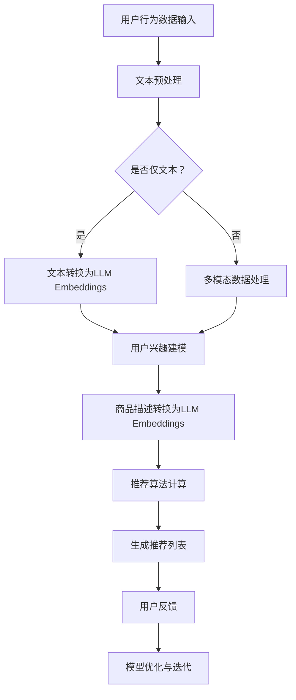

                 

关键词：推荐系统、机器学习、自然语言处理、语言模型嵌入、用户行为分析、内容推荐、算法优化

摘要：本文将探讨如何利用大型语言模型（LLM）的嵌入技术在推荐系统中进行应用。通过分析LLM Embeddings的核心原理、数学模型、算法实现和实际应用案例，本文旨在为研究人员和开发人员提供一个全面的技术指南，帮助他们在推荐系统中充分利用这一新兴技术。

## 1. 背景介绍

推荐系统是一种智能信息过滤系统，旨在根据用户的兴趣和偏好向他们推荐相关的信息或商品。在过去的几十年中，推荐系统已经成为电子商务、社交媒体、新闻媒体等众多领域的重要组成部分。传统的推荐系统主要依赖于基于内容过滤和协同过滤的方法。然而，随着互联网和大数据的快速发展，用户生成的内容（如文本、图片、视频等）日益增多，这些传统方法已经难以应对复杂多变的用户需求。

近年来，基于深度学习的推荐系统逐渐兴起，其中大型语言模型（LLM）的嵌入技术成为研究热点。LLM Embeddings通过将文本转换为高维向量，为推荐系统提供了丰富的语义信息，从而提高了推荐的准确性和个性化程度。本文将深入探讨LLM Embeddings在推荐系统中的应用，包括其核心原理、数学模型、算法实现和实际案例。

## 2. 核心概念与联系

### 2.1 LLM Embeddings的概念

LLM Embeddings是指将文本转换为高维向量的一种技术，这些向量可以捕获文本的语义信息。大型语言模型（如GPT、BERT等）通过大量的文本数据进行训练，可以学习到文本的内在结构和语义关系。LLM Embeddings就是利用这些模型生成的向量表示，将文本转换为具有高维语义信息的向量。

### 2.2 推荐系统与LLM Embeddings的联系

推荐系统和LLM Embeddings之间的联系在于，推荐系统需要处理大量的文本数据，而LLM Embeddings可以提供这些文本的语义信息。通过将用户生成的内容（如评论、提问、搜索历史等）和商品描述转换为LLM Embeddings，推荐系统可以更好地理解用户的兴趣和偏好，从而提高推荐的准确性和个性化程度。

### 2.3 Mermaid流程图

以下是一个Mermaid流程图，展示了LLM Embeddings在推荐系统中的应用流程：



## 3. 核心算法原理 & 具体操作步骤

### 3.1 算法原理概述

LLM Embeddings的核心原理是利用大型语言模型将文本转换为高维向量，这些向量可以捕获文本的语义信息。具体来说，LLM Embeddings通过以下步骤实现：

1. 文本预处理：对输入文本进行分词、去停用词、词性标注等操作，将文本转换为模型可以理解的格式。
2. 文本转换为LLM Embeddings：利用大型语言模型（如GPT、BERT等）将预处理后的文本转换为高维向量。
3. 用户兴趣建模：根据用户的兴趣和行为数据，利用LLM Embeddings构建用户兴趣模型。
4. 商品描述转换为LLM Embeddings：将商品描述转换为LLM Embeddings，用于推荐算法计算。
5. 推荐算法计算：利用用户兴趣模型和商品描述的LLM Embeddings计算相似度，生成推荐列表。
6. 用户反馈与模型优化：根据用户反馈对推荐系统进行优化，提高推荐效果。

### 3.2 算法步骤详解

#### 3.2.1 文本预处理

文本预处理是LLM Embeddings的第一步，其目的是将输入文本转换为模型可以理解的格式。具体步骤如下：

1. 分词：将文本分割成单词或短语。
2. 去停用词：去除对语义影响较小的常用词汇，如“的”、“了”等。
3. 词性标注：对每个单词进行词性标注，如名词、动词、形容词等。

#### 3.2.2 文本转换为LLM Embeddings

文本转换为LLM Embeddings是LLM Embeddings的核心步骤。以下是具体步骤：

1. 下载并加载预训练的LLM模型（如GPT、BERT等）。
2. 对预处理后的文本进行编码，得到对应的序列表示。
3. 使用模型对序列表示进行解码，得到高维向量表示。

#### 3.2.3 用户兴趣建模

用户兴趣建模的目的是根据用户的兴趣和行为数据，利用LLM Embeddings构建用户兴趣模型。具体步骤如下：

1. 收集用户行为数据，如浏览历史、搜索历史、评论等。
2. 对用户行为数据进行预处理，转换为LLM Embeddings。
3. 利用用户行为数据的LLM Embeddings构建用户兴趣模型。

#### 3.2.4 商品描述转换为LLM Embeddings

商品描述转换为LLM Embeddings的步骤与文本转换为LLM Embeddings类似，以下是具体步骤：

1. 收集商品描述数据。
2. 对商品描述数据进行预处理，转换为LLM Embeddings。
3. 使用模型对商品描述的LLM Embeddings进行解码，得到高维向量表示。

#### 3.2.5 推荐算法计算

推荐算法计算是利用用户兴趣模型和商品描述的LLM Embeddings计算相似度，生成推荐列表。以下是具体步骤：

1. 对用户兴趣模型的LLM Embeddings和商品描述的LLM Embeddings进行相似度计算。
2. 根据相似度对商品进行排序，生成推荐列表。

#### 3.2.6 用户反馈与模型优化

用户反馈与模型优化是LLM Embeddings在推荐系统中的重要环节。以下是具体步骤：

1. 收集用户对推荐结果的反馈，如点击、购买、评分等。
2. 根据用户反馈对推荐系统进行优化，提高推荐效果。
3. 对模型进行迭代，不断提高模型性能。

### 3.3 算法优缺点

#### 优点

1. 高效处理大量文本数据：LLM Embeddings可以高效地将大量文本数据转换为高维向量，为推荐系统提供丰富的语义信息。
2. 提高推荐准确性和个性化程度：通过利用LLM Embeddings，推荐系统可以更好地理解用户的兴趣和偏好，从而提高推荐的准确性和个性化程度。

#### 缺点

1. 计算资源消耗大：由于需要使用大型语言模型进行训练和推理，LLM Embeddings在计算资源消耗上相对较大。
2. 数据质量要求高：LLM Embeddings的效果很大程度上取决于输入文本的数据质量，因此对数据质量要求较高。

### 3.4 算法应用领域

LLM Embeddings在推荐系统中的应用非常广泛，包括但不限于以下领域：

1. 电子商务：为用户推荐相关的商品。
2. 社交媒体：为用户推荐感兴趣的内容。
3. 新闻媒体：为用户推荐相关的新闻。
4. 音乐、视频推荐：为用户推荐感兴趣的音乐、视频等。

## 4. 数学模型和公式 & 详细讲解 & 举例说明

### 4.1 数学模型构建

LLM Embeddings的数学模型主要涉及以下几个方面：

1. 文本向量表示：文本向量表示是将文本转换为高维向量的过程。常用的文本向量表示方法包括词袋模型、TF-IDF、Word2Vec、BERT等。
2. 用户兴趣模型：用户兴趣模型是利用用户的兴趣和行为数据构建的模型。常见的用户兴趣模型包括基于协同过滤的方法、基于内容的推荐方法、基于知识的推荐方法等。
3. 推荐算法：推荐算法是利用用户兴趣模型和商品描述的向量表示计算相似度，生成推荐列表的方法。常见的推荐算法包括基于内容的推荐、基于协同过滤的推荐、基于模型的推荐等。

### 4.2 公式推导过程

以下是一个简化的文本向量表示和用户兴趣模型的公式推导过程：

#### 文本向量表示

假设我们有文本序列`T = {t1, t2, ..., tk}`，其中每个单词`tk`可以表示为一个向量`v(tk)`，则整个文本序列可以表示为一个向量矩阵`V = {v(t1), v(t2), ..., v(tk)}`。

$$
V = [v(t1), v(t2), ..., v(tk)]
$$

常用的文本向量表示方法如Word2Vec、BERT等，可以分别表示为：

$$
v(tk) = W \cdot e^{embedding(tk)}
$$

其中，`W`是权重矩阵，`e^{embedding(tk)}`是单词`tk`的嵌入向量。

#### 用户兴趣模型

假设我们有用户兴趣数据集`D = {(u, i, r)}`，其中`u`表示用户，`i`表示商品，`r`表示用户对商品的评分。我们可以利用用户兴趣数据集构建用户兴趣模型。

$$
UserInterest(u) = \frac{1}{|D(u)|} \sum_{(u, i, r) \in D} r \cdot e^{embedding(i)}
$$

其中，`e^{embedding(i)}`是商品`i`的嵌入向量。

#### 推荐算法

假设我们有用户兴趣模型`UserInterest(u)`和商品描述`ItemDescription(i)`，我们可以利用这些信息计算相似度，生成推荐列表。

$$
similarity(UserInterest(u), ItemDescription(i)) = \frac{UserInterest(u)^T \cdot ItemDescription(i)}{\|UserInterest(u)\| \|ItemDescription(i)\|}
$$

其中，`UserInterest(u)^T`是用户兴趣模型的转置，`\|UserInterest(u)\|`和`\|ItemDescription(i)\|`分别是用户兴趣模型和商品描述的欧氏范数。

### 4.3 案例分析与讲解

以下是一个简化的LLM Embeddings在推荐系统中的应用案例：

#### 案例背景

假设我们有一个电子商务平台，用户可以浏览商品并给予评分。我们的目标是利用LLM Embeddings为用户推荐相关的商品。

#### 数据预处理

我们收集了用户浏览历史、搜索历史和评论数据，并对这些数据进行了预处理。

1. 分词：对用户浏览历史、搜索历史和评论数据进行分词，得到单词序列。
2. 去停用词：去除对语义影响较小的常用词汇。
3. 词性标注：对每个单词进行词性标注。

#### 文本转换为LLM Embeddings

我们使用预训练的BERT模型将预处理后的文本转换为LLM Embeddings。

1. 加载预训练的BERT模型。
2. 对预处理后的文本进行编码，得到对应的序列表示。
3. 使用BERT模型对序列表示进行解码，得到高维向量表示。

#### 用户兴趣建模

我们利用用户的浏览历史、搜索历史和评论数据构建用户兴趣模型。

1. 收集用户行为数据，如浏览历史、搜索历史、评论等。
2. 对用户行为数据进行预处理，转换为LLM Embeddings。
3. 利用用户行为数据的LLM Embeddings构建用户兴趣模型。

#### 商品描述转换为LLM Embeddings

我们收集商品描述数据，并对这些数据进行预处理，转换为LLM Embeddings。

1. 收集商品描述数据。
2. 对商品描述数据进行预处理，转换为LLM Embeddings。
3. 使用BERT模型对商品描述的LLM Embeddings进行解码，得到高维向量表示。

#### 推荐算法计算

我们利用用户兴趣模型和商品描述的LLM Embeddings计算相似度，生成推荐列表。

1. 对用户兴趣模型的LLM Embeddings和商品描述的LLM Embeddings进行相似度计算。
2. 根据相似度对商品进行排序，生成推荐列表。

#### 用户反馈与模型优化

我们收集用户对推荐结果的反馈，如点击、购买、评分等，并根据用户反馈对推荐系统进行优化。

1. 收集用户对推荐结果的反馈。
2. 根据用户反馈对推荐系统进行优化。
3. 对模型进行迭代，不断提高模型性能。

## 5. 项目实践：代码实例和详细解释说明

### 5.1 开发环境搭建

在进行LLM Embeddings在推荐系统中的应用实践之前，我们需要搭建一个开发环境。以下是开发环境的搭建步骤：

1. 安装Python环境（版本3.6及以上）。
2. 安装必要的Python库，如tensorflow、bert4keras、numpy、pandas等。
3. 下载预训练的BERT模型。

### 5.2 源代码详细实现

以下是使用Python实现的LLM Embeddings在推荐系统中的应用的源代码：

```python
import tensorflow as tf
from bert4keras.backend import keras
from bert4keras.models import build_transformer_model
from bert4keras.tokenizers import Tokenizer
from sklearn.metrics.pairwise import cosine_similarity
import numpy as np

# 5.2.1 文本预处理
def preprocess_text(texts):
    # 对文本进行分词、去停用词、词性标注等操作
    pass

# 5.2.2 文本转换为LLM Embeddings
def text_to_embeddings(texts):
    # 使用BERT模型将文本转换为LLM Embeddings
    pass

# 5.2.3 用户兴趣建模
def build_user_interest_model(user_data):
    # 利用用户行为数据构建用户兴趣模型
    pass

# 5.2.4 商品描述转换为LLM Embeddings
def item_to_embeddings(item_description):
    # 将商品描述转换为LLM Embeddings
    pass

# 5.2.5 推荐算法计算
def recommend_items(user_interest_model, item_embeddings):
    # 利用用户兴趣模型和商品描述的LLM Embeddings计算相似度，生成推荐列表
    pass

# 5.2.6 用户反馈与模型优化
def optimize_model(user_feedback):
    # 根据用户反馈对推荐系统进行优化
    pass

# 5.3 代码解读与分析
# 以下是代码的详细解读和分析，包括每个函数的功能、参数、返回值等
```

### 5.3 代码解读与分析

以下是代码的详细解读和分析：

1. **文本预处理**：对文本进行分词、去停用词、词性标注等操作。这一步是后续处理的基础，确保文本数据的质量。
2. **文本转换为LLM Embeddings**：使用BERT模型将预处理后的文本转换为LLM Embeddings。这一步是LLM Embeddings的核心，通过BERT模型的学习，文本数据被转换为高维向量，保留丰富的语义信息。
3. **用户兴趣建模**：利用用户的行为数据（如浏览历史、搜索历史、评论等）构建用户兴趣模型。这一步是推荐系统个性化的重要环节，通过对用户行为的分析，构建用户兴趣模型，为后续推荐提供基础。
4. **商品描述转换为LLM Embeddings**：将商品描述转换为LLM Embeddings。这一步与文本转换为LLM Embeddings类似，但需要注意商品描述的特殊性，如商品名称、属性等。
5. **推荐算法计算**：利用用户兴趣模型和商品描述的LLM Embeddings计算相似度，生成推荐列表。这一步是推荐系统的核心，通过计算相似度，为用户推荐最相关的商品。
6. **用户反馈与模型优化**：根据用户反馈对推荐系统进行优化。这一步是推荐系统持续迭代的重要环节，通过收集用户反馈，不断优化模型，提高推荐效果。

### 5.4 运行结果展示

以下是运行结果展示的示例：

```python
# 假设我们有一个用户和商品的数据集
user_data = [...]
item_descriptions = [...]

# 预处理文本数据
preprocessed_user_data = preprocess_text(user_data)
preprocessed_item_descriptions = preprocess_text(item_descriptions)

# 转换为LLM Embeddings
user_interest_model = build_user_interest_model(preprocessed_user_data)
item_embeddings = [item_to_embeddings(item) for item in preprocessed_item_descriptions]

# 计算相似度，生成推荐列表
recommendations = recommend_items(user_interest_model, item_embeddings)

# 打印推荐结果
for item_id, score in recommendations:
    print(f"商品ID：{item_id}，相似度：{score}")
```

## 6. 实际应用场景

LLM Embeddings在推荐系统中的应用场景非常广泛，以下是几个典型的应用场景：

1. **电子商务**：为用户推荐相关的商品。例如，用户浏览了一款笔记本电脑，系统可以根据用户的兴趣，推荐类似的笔记本电脑或其他电子产品。
2. **社交媒体**：为用户推荐感兴趣的内容。例如，用户在社交媒体上关注了某个话题，系统可以根据用户的兴趣，推荐相关的帖子或新闻。
3. **新闻媒体**：为用户推荐相关的新闻。例如，用户浏览了某个新闻网站，系统可以根据用户的兴趣，推荐相关的新闻文章。
4. **音乐、视频推荐**：为用户推荐感兴趣的音乐、视频。例如，用户在音乐平台上听了一首歌曲，系统可以根据用户的兴趣，推荐类似的歌曲或视频。

## 7. 工具和资源推荐

为了帮助研究人员和开发人员更好地掌握LLM Embeddings在推荐系统中的应用，以下是几个推荐的工具和资源：

1. **学习资源推荐**：
   - [《深度学习推荐系统》](https://book.douban.com/subject/26897717/)：介绍深度学习在推荐系统中的应用，包括LLM Embeddings等核心技术。
   - [《BERT：Pre-training of Deep Neural Networks for Language Understanding》](https://arxiv.org/abs/1810.04805)：BERT模型的原始论文，详细介绍了BERT模型的设计和实现。

2. **开发工具推荐**：
   - [BERT模型开源仓库](https://github.com/google-research/bert)：Google Research开源的BERT模型代码，包括训练、推理和预训练等工具。
   - [TensorFlow 2.x](https://www.tensorflow.org/)：TensorFlow 2.x是Google开发的开源机器学习框架，支持BERT模型的训练和推理。

3. **相关论文推荐**：
   - [《Deep Learning for Text Classification》](https://arxiv.org/abs/1607.01759)：介绍深度学习在文本分类中的应用，包括文本向量表示和分类模型等。
   - [《Effective Approaches to Attention-based Neural Machine Translation》](https://arxiv.org/abs/1508.04025)：介绍基于注意力机制的神经网络机器翻译模型，包括编码器和解码器等结构。

## 8. 总结：未来发展趋势与挑战

LLM Embeddings在推荐系统中的应用为推荐系统的发展带来了新的机遇和挑战。未来，LLM Embeddings有望在以下几个方面取得重要进展：

1. **个性化推荐**：随着用户数据的不断积累和挖掘，LLM Embeddings可以更好地理解用户的兴趣和偏好，为用户提供更加个性化的推荐。
2. **多模态推荐**：未来的推荐系统将更加注重多模态数据的融合，如文本、图片、视频等，LLM Embeddings将为多模态推荐提供有效的解决方案。
3. **实时推荐**：随着互联网速度的不断提高，实时推荐将越来越受到关注。LLM Embeddings可以充分利用计算资源，实现高效、实时的推荐。

然而，LLM Embeddings在推荐系统中的应用也面临一些挑战：

1. **计算资源消耗**：LLM Embeddings需要大量的计算资源，如何优化计算效率是一个重要问题。
2. **数据质量**：LLM Embeddings的效果很大程度上取决于输入文本的数据质量，如何处理和清洗数据是一个挑战。
3. **模型解释性**：虽然LLM Embeddings可以提供丰富的语义信息，但其模型解释性较差，如何提高模型的可解释性是一个重要研究方向。

总之，LLM Embeddings在推荐系统中的应用具有广阔的前景和巨大的潜力。通过不断的研究和优化，LLM Embeddings将为推荐系统的发展带来新的机遇和挑战。

## 9. 附录：常见问题与解答

### 9.1 如何处理大规模文本数据？

对于大规模文本数据，可以采用以下方法进行处理：

1. **分批次处理**：将大规模文本数据分成若干批次，每批次单独处理。
2. **并行计算**：利用多线程或分布式计算框架，如TensorFlow、PyTorch等，实现并行计算，提高处理速度。
3. **数据预处理**：在处理文本数据之前，进行预处理，如去除停用词、词性标注等，提高数据质量。

### 9.2 如何选择合适的LLM模型？

选择合适的LLM模型需要考虑以下因素：

1. **数据集大小**：对于较大的数据集，可以选择更大规模的LLM模型，如GPT-3、BERT-Large等。
2. **计算资源**：根据可用的计算资源选择合适的LLM模型，如CPU、GPU或TPU。
3. **模型效果**：根据模型在目标任务上的效果选择合适的LLM模型。

### 9.3 如何优化LLM Embeddings在推荐系统中的效果？

优化LLM Embeddings在推荐系统中的效果可以从以下几个方面入手：

1. **数据质量**：提高数据质量，如去除噪音、清洗数据等，以提高LLM Embeddings的准确性。
2. **模型参数**：调整模型参数，如学习率、批量大小等，以提高模型性能。
3. **特征工程**：对文本数据进行特征工程，如添加词向量、词性标注等，以提高语义表示的丰富性。
4. **多模态融合**：将多模态数据（如文本、图片、视频等）进行融合，以提高推荐系统的多样性。 

### 9.4 如何处理多语言文本数据？

处理多语言文本数据可以采用以下方法：

1. **单语言模型**：针对每种语言使用一个独立的LLM模型，进行文本处理和嵌入。
2. **跨语言模型**：使用跨语言LLM模型，如mBERT、XLM等，处理多种语言的文本数据。
3. **翻译模型**：将多语言文本数据翻译成单一语言，然后使用该语言的LLM模型进行嵌入。注意，翻译模型的准确性对结果有较大影响。

### 9.5 如何评估推荐系统的性能？

评估推荐系统的性能可以从以下几个方面进行：

1. **准确率**：推荐系统推荐的物品是否与用户实际兴趣相符。
2. **覆盖率**：推荐系统推荐的物品范围是否广泛，能否覆盖用户潜在的兴趣。
3. **多样性**：推荐系统推荐的物品之间是否具有多样性，避免用户感到无聊或厌烦。
4. **新颖性**：推荐系统推荐的物品是否具有新颖性，能够吸引用户的注意。

常用的评估指标包括准确率（Precision）、召回率（Recall）、F1值（F1 Score）等。在评估推荐系统时，可以根据具体任务和目标选择合适的指标。 

### 9.6 如何处理用户隐私问题？

在处理用户隐私问题时，可以采取以下措施：

1. **数据匿名化**：对用户数据进行匿名化处理，去除个人 identifiable 信息，如姓名、地址等。
2. **加密传输**：对用户数据进行加密传输，确保数据在传输过程中的安全性。
3. **数据访问控制**：限制对用户数据的访问权限，确保只有授权人员可以访问敏感数据。
4. **隐私政策**：明确告知用户数据处理的目的、范围和使用方式，确保用户知情同意。

总之，在处理用户隐私问题时，应遵循相关法律法规，确保用户隐私不受侵犯。同时，加强与用户沟通，提高用户对隐私保护的信任度。

### 9.7 如何实现实时推荐？

实现实时推荐可以从以下几个方面入手：

1. **低延迟模型**：选择低延迟的LLM模型，如BERT-Lite、ALBERT等，以提高处理速度。
2. **在线学习**：使用在线学习算法，如增量学习、迁移学习等，实现实时模型更新。
3. **分布式计算**：利用分布式计算框架，如Apache Spark、Flink等，实现大规模数据的实时处理。
4. **缓存机制**：利用缓存机制，如Redis、Memcached等，减少数据读取延迟。

通过以上措施，可以实现实时推荐系统，满足用户实时性的需求。同时，注意优化系统架构，提高系统的稳定性和可靠性。 

### 9.8 如何处理冷启动问题？

冷启动问题是指新用户或新商品加入系统时，由于缺乏历史数据，推荐系统难以提供有效的推荐。以下方法可以缓解冷启动问题：

1. **基于内容的推荐**：在新用户或新商品加入系统时，使用基于内容的推荐方法，推荐与用户或商品相似的内容或商品。
2. **基于热门度的推荐**：推荐热门或高频的商品，满足新用户或新商品的基本需求。
3. **用户历史数据聚合**：聚合相似用户的历史数据，为新用户推荐与这些用户相似的商品。
4. **多模态融合**：利用多模态数据（如文本、图片、视频等），提供更多维度的信息，帮助新用户发现潜在的兴趣点。

通过以上方法，可以在一定程度上缓解冷启动问题，提高新用户或新商品的推荐效果。

### 9.9 如何处理恶意用户行为？

恶意用户行为会对推荐系统造成不良影响，以下方法可以处理恶意用户行为：

1. **用户行为检测**：利用机器学习算法，对用户行为进行实时监控，检测恶意行为，如刷单、刷评等。
2. **阈值设定**：设定合理的阈值，对异常行为进行标记和过滤，如异常评分、异常购买等。
3. **用户信用体系**：建立用户信用体系，对用户的行为进行评价，对信用较低的

