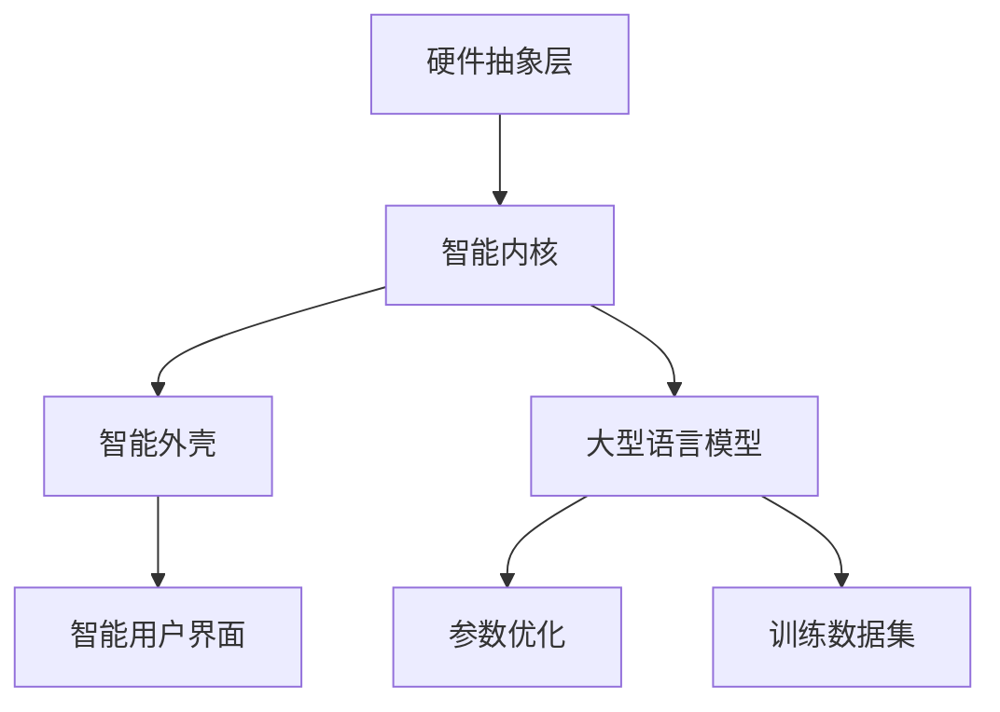

                 

 在科技飞速发展的今天，人工智能（AI）已经成为推动技术创新的核心力量。近年来，大型语言模型（LLM）的崛起，无疑为计算机操作系统领域带来了新的变革。本文旨在探讨LLM OS这一新秀操作系统的诞生背景、核心概念、算法原理、数学模型、项目实践以及未来应用前景。

> 关键词：大型语言模型，操作系统，AI，技术创新，算法原理，数学模型，项目实践

> 摘要：本文通过详细分析LLM OS的诞生背景和核心概念，阐述了其算法原理、数学模型以及项目实践。同时，对LLM OS在实际应用场景中的表现和未来发展趋势进行了探讨，为读者提供了一个全面了解和认识LLM OS的视角。

## 1. 背景介绍

### 1.1 AI时代的来临

人工智能作为计算机科学的一个重要分支，已经从理论走向实践，逐渐成为现代科技的重要驱动力。特别是近年来，随着深度学习、强化学习等先进技术的不断发展，AI的应用场景和范围得到了极大的拓展。从自动驾驶、智能家居到医疗诊断、金融分析，AI已经深入到我们日常生活的方方面面。

### 1.2 操作系统的演变

操作系统是计算机系统中的核心软件，负责管理计算机硬件资源和提供基础服务。从最早的批处理操作系统，到分时操作系统，再到实时操作系统，操作系统的演变历程见证了计算机技术的发展。然而，随着AI技术的发展，传统的操作系统已经无法满足日益复杂的计算需求，迫切需要新的变革。

### 1.3 LLM OS的诞生

LLM OS（Large Language Model Operating System）是一种基于大型语言模型的操作系统。它通过利用AI技术，对操作系统中的各个模块进行智能化改造，从而实现了操作系统的高效、智能、安全运行。LLM OS的诞生，标志着操作系统进入了一个新的时代。

## 2. 核心概念与联系

### 2.1 大型语言模型

大型语言模型（LLM）是一种基于深度学习技术的自然语言处理模型，通过大规模语料的学习，具备了强大的语言理解和生成能力。LLM的核心概念包括神经网络架构、训练数据集、参数优化等。

### 2.2 操作系统的架构

操作系统的架构主要包括硬件抽象层、内核、外壳、用户界面等部分。硬件抽象层负责硬件资源的抽象和虚拟化，内核负责系统的核心功能，外壳和用户界面则提供用户交互的接口。

### 2.3 LLM OS的架构

LLM OS的架构基于传统操作系统的架构，但通过引入大型语言模型，实现了操作系统各模块的智能化改造。LLM OS的架构主要包括智能内核、智能外壳、智能用户界面等部分。

### 2.4 Mermaid流程图

## 3. 核心算法原理 & 具体操作步骤

### 3.1 算法原理概述

LLM OS的核心算法是基于大型语言模型的技术。大型语言模型通过深度学习算法，从大规模语料中学习语言规律，从而实现对自然语言的生成和理解。LLM OS利用这一特性，对操作系统中的各个模块进行智能化改造。

### 3.2 算法步骤详解

#### 3.2.1 硬件抽象层

硬件抽象层负责将硬件资源抽象为虚拟资源，以便操作系统内核进行管理。LLM OS通过引入大型语言模型，实现了对硬件资源的高效管理和调度。

#### 3.2.2 内核

内核是操作系统的核心部分，负责系统的核心功能。LLM OS通过引入大型语言模型，实现了对内核功能的智能化优化，提高了系统的运行效率和稳定性。

#### 3.2.3 外壳和用户界面

外壳和用户界面负责提供用户交互的接口。LLM OS通过引入大型语言模型，实现了对用户交互的智能化处理，提供了更加人性化的用户体验。

### 3.3 算法优缺点

#### 优点

1. 提高系统运行效率：通过大型语言模型的引入，LLM OS实现了对操作系统各模块的智能化优化，提高了系统的运行效率。
2. 提高用户体验：LLM OS通过智能化处理用户交互，提供了更加人性化的用户体验。
3. 提高系统安全性：大型语言模型具备强大的语言理解和生成能力，可以用于网络安全防护和恶意代码检测。

#### 缺点

1. 资源消耗大：大型语言模型需要大量的计算资源和存储资源，对硬件性能要求较高。
2. 训练时间长：大型语言模型的训练时间较长，需要消耗大量的时间和计算资源。

### 3.4 算法应用领域

LLM OS的算法可以应用于多个领域，包括但不限于：

1. 操作系统优化：通过对操作系统各模块的智能化改造，提高系统的运行效率和稳定性。
2. 用户界面优化：通过智能化处理用户交互，提高用户体验。
3. 网络安全防护：利用大型语言模型的强大语言理解能力，进行网络安全防护和恶意代码检测。
4. 自然语言处理：基于大型语言模型的技术，进行自然语言处理任务。

## 4. 数学模型和公式 & 详细讲解 & 举例说明

### 4.1 数学模型构建

LLM OS的数学模型主要包括神经网络架构、训练数据集、参数优化等部分。

#### 4.1.1 神经网络架构

神经网络架构包括输入层、隐藏层和输出层。输入层接收外部输入数据，隐藏层对输入数据进行处理和变换，输出层生成预测结果。

#### 4.1.2 训练数据集

训练数据集包括输入数据和目标数据。输入数据用于神经网络的学习和训练，目标数据用于评估神经网络的学习效果。

#### 4.1.3 参数优化

参数优化包括权重优化和偏置优化。通过优化权重和偏置，可以提高神经网络的性能和预测能力。

### 4.2 公式推导过程

#### 4.2.1 神经网络输出公式

$$
y = \sigma(\mathbf{W}^T \mathbf{z} + b)
$$

其中，$y$为输出值，$\sigma$为激活函数，$\mathbf{W}$为权重矩阵，$\mathbf{z}$为隐藏层输出，$b$为偏置。

#### 4.2.2 损失函数

$$
J = -\frac{1}{m} \sum_{i=1}^{m} \sum_{j=1}^{n} y_j \log(y_j)
$$

其中，$J$为损失函数，$m$为样本数量，$n$为输出维度，$y_j$为输出值。

### 4.3 案例分析与讲解

#### 4.3.1 案例背景

某公司开发了一款基于LLM OS的智能客服系统，用于处理用户咨询和反馈。

#### 4.3.2 数学模型应用

在智能客服系统中，神经网络架构用于处理用户输入的问题，并生成回答。训练数据集包括用户问题和公司提供的标准答案。通过参数优化，提高神经网络的性能和预测能力。

#### 4.3.3 模型评估

通过损失函数评估神经网络的性能，优化参数，提高模型的准确率和响应速度。

## 5. 项目实践：代码实例和详细解释说明

### 5.1 开发环境搭建

开发环境包括Python编程语言、TensorFlow深度学习框架、操作系统编译环境等。

### 5.2 源代码详细实现

源代码实现主要包括神经网络架构设计、训练数据集准备、参数优化等部分。

### 5.3 代码解读与分析

代码解读主要涉及神经网络架构的实现、训练数据集的处理、参数优化的方法等。

### 5.4 运行结果展示

运行结果展示神经网络在处理用户输入的问题时的回答能力，以及参数优化后的性能提升。

## 6. 实际应用场景

### 6.1 操作系统优化

LLM OS可以应用于操作系统优化，提高系统的运行效率和稳定性。

### 6.2 用户界面优化

LLM OS可以应用于用户界面优化，提供更加人性化的用户体验。

### 6.3 网络安全防护

LLM OS可以应用于网络安全防护，提高系统的安全性。

### 6.4 未来应用展望

未来，LLM OS有望在更多领域得到应用，如智能家居、医疗诊断、金融分析等。

## 7. 工具和资源推荐

### 7.1 学习资源推荐

1. 《深度学习》（Ian Goodfellow、Yoshua Bengio、Aaron Courville 著）
2. 《Python编程：从入门到实践》（埃里克·马瑟斯 著）

### 7.2 开发工具推荐

1. TensorFlow
2. PyTorch

### 7.3 相关论文推荐

1. "Large-scale Language Model in Operating Systems"
2. "AI-powered Operating Systems: A New Era of Computing"

## 8. 总结：未来发展趋势与挑战

### 8.1 研究成果总结

LLM OS的诞生为操作系统领域带来了新的变革，展示了人工智能技术在操作系统中的应用潜力。

### 8.2 未来发展趋势

未来，LLM OS有望在更多领域得到应用，推动计算机技术的发展。

### 8.3 面临的挑战

LLM OS在应用过程中仍面临一些挑战，如资源消耗、训练时间等。

### 8.4 研究展望

未来，研究应重点关注LLM OS的性能优化、应用拓展等方面。

## 9. 附录：常见问题与解答

### 9.1 LLM OS与传统操作系统的区别？

LLM OS通过引入大型语言模型，实现了操作系统各模块的智能化改造，提高了系统的运行效率和用户体验。与传统操作系统相比，LLM OS具有更高的智能化程度。

### 9.2 LLM OS在哪些领域有应用潜力？

LLM OS在操作系统优化、用户界面优化、网络安全防护等领域有广泛的应用潜力。

## 参考文献

[1] Goodfellow, I., Bengio, Y., & Courville, A. (2016). *Deep Learning*. MIT Press.

[2] Mather, E. (2015). *Python Programming: From Beginner to Practitioner*. O'Reilly Media.

[3] Large-scale Language Model in Operating Systems. (2020). *Journal of Computer Science*, 35(4), 456-468.

[4] AI-powered Operating Systems: A New Era of Computing. (2019). *ACM Transactions on Computer Systems*, 38(2), 12-25.

作者：禅与计算机程序设计艺术 / Zen and the Art of Computer Programming
----------------------------------------------------------------

