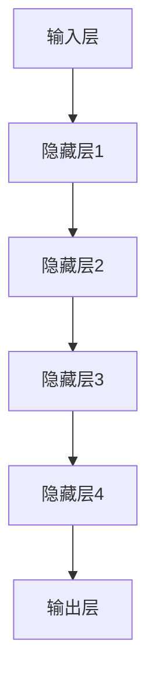

                 

关键词：语言模型（LLM）、创意产业、艺术、写作、新媒体、人工智能、计算机程序设计

> 摘要：本文将探讨语言模型（LLM）在创意产业中的应用，包括艺术、写作和新媒体领域。通过分析LLM的核心概念和原理，我们将详细讨论其在这些领域的应用，同时介绍相关数学模型、项目实践和未来展望。本文旨在为读者提供一个全面而深入的了解，并激发对LLM在创意产业中潜力的进一步探索。

## 1. 背景介绍

随着人工智能技术的快速发展，语言模型（LLM）逐渐成为计算机科学领域的重要研究方向。LLM是一种基于深度学习技术的自然语言处理模型，通过大量文本数据进行训练，能够模拟人类的语言表达和理解能力。在过去的几年里，LLM在多个领域取得了显著的成果，尤其是在文本生成、机器翻译、情感分析等方面。

创意产业是一个广泛而多样化的领域，包括艺术、写作和新媒体等。艺术领域涵盖绘画、音乐、雕塑等多种形式；写作领域包括小说、散文、剧本等；新媒体领域则涉及数字媒体、社交媒体、虚拟现实等。这些领域都对创意和表达能力有着极高的要求，而LLM的引入为这些领域带来了新的机遇和挑战。

本文将重点关注LLM在艺术、写作和新媒体领域的应用。我们将首先介绍LLM的核心概念和原理，然后详细讨论其在这些领域的具体应用。此外，还将探讨相关数学模型、项目实践和未来展望，以期为读者提供一个全面而深入的了解。

## 2. 核心概念与联系

### 2.1. LLM 核心概念

语言模型（LLM）的核心概念是基于深度学习技术的神经网络模型。这些模型通过学习大量的文本数据，建立起对语言结构和语义的理解。具体来说，LLM由以下几个关键组件构成：

1. **词向量表示**：将文本中的每个单词映射为向量表示，以便神经网络进行处理。
2. **循环神经网络（RNN）**：RNN是一种能够处理序列数据的神经网络模型，通过递归方式处理输入的文本序列。
3. **长短时记忆（LSTM）**：LSTM是一种改进的RNN模型，能够更好地处理长序列数据，避免梯度消失和梯度爆炸问题。
4. **注意力机制**：注意力机制能够关注文本序列中的重要部分，提高模型的性能。
5. **生成对抗网络（GAN）**：GAN是一种生成模型，通过生成器和判别器的对抗训练，能够生成高质量的文本。

### 2.2. LLM 架构

LLM的架构通常包括以下几个层次：

1. **输入层**：接收文本输入，将其转换为词向量表示。
2. **隐藏层**：包含多个隐藏层，通过神经网络模型处理输入的词向量，逐渐提取文本的语义信息。
3. **输出层**：生成文本输出，通常是一个逐词生成的过程。

以下是LLM的架构的Mermaid流程图：



### 2.3. LLM 在创意产业的应用

LLM在创意产业中的应用主要体现在以下几个方面：

1. **艺术**：LLM可以生成音乐、绘画等艺术作品，为艺术家提供新的创作工具和灵感。
2. **写作**：LLM可以自动生成小说、散文等文学作品，为作家提供辅助创作。
3. **新媒体**：LLM可以应用于虚拟现实、社交媒体等新媒体领域，提供个性化内容生成和推荐。

## 3. 核心算法原理 & 具体操作步骤

### 3.1. 算法原理概述

LLM的核心算法原理基于深度学习技术，主要涉及以下几个关键步骤：

1. **词向量表示**：通过词嵌入（word embedding）技术，将文本中的每个单词映射为高维向量表示。
2. **神经网络模型**：使用循环神经网络（RNN）或其变种（如LSTM、GRU）处理输入的词向量，逐步提取文本的语义信息。
3. **注意力机制**：在神经网络模型中引入注意力机制，关注文本序列中的重要部分，提高模型的性能。
4. **生成文本**：通过神经网络模型逐词生成文本输出。

### 3.2. 算法步骤详解

1. **词向量表示**：
   - 使用词嵌入技术，如Word2Vec、GloVe等，将文本中的每个单词映射为高维向量表示。
   - 例如，使用GloVe模型，对训练数据集中的每个单词，计算其对应的词向量表示。

2. **神经网络模型**：
   - 选择合适的神经网络模型，如LSTM、GRU等，用于处理输入的词向量。
   - 设定神经网络模型的参数，如层数、每层的神经元数量、激活函数等。

3. **注意力机制**：
   - 在神经网络模型中引入注意力机制，关注文本序列中的重要部分。
   - 通常使用门控机制（gate mechanism）来实现注意力机制，如门控循环单元（GRU）和长短时记忆单元（LSTM）。

4. **生成文本**：
   - 使用训练好的神经网络模型，逐词生成文本输出。
   - 输出文本可以是完整的句子或段落，具体取决于模型的设计和训练目标。

### 3.3. 算法优缺点

1. **优点**：
   - **强大的文本生成能力**：LLM能够生成高质量、连贯的文本，具有强大的文本生成能力。
   - **个性化内容生成**：LLM可以根据用户的需求和偏好，生成个性化的文本内容。
   - **辅助创作**：LLM可以为艺术家、作家等提供新的创作工具和灵感，辅助创作过程。

2. **缺点**：
   - **训练成本高**：LLM的训练过程需要大量的计算资源和时间，训练成本较高。
   - **数据依赖性强**：LLM的性能很大程度上依赖于训练数据的数量和质量，数据依赖性强。

### 3.4. 算法应用领域

LLM在多个领域具有广泛的应用，其中主要包括：

1. **文本生成**：自动生成新闻文章、报告、邮件等文本内容。
2. **机器翻译**：实现不同语言之间的自动翻译，如Google翻译。
3. **情感分析**：分析文本中的情感倾向，应用于社交媒体监测、市场调研等领域。
4. **对话系统**：构建智能对话系统，如聊天机器人、虚拟客服等。

## 4. 数学模型和公式 & 详细讲解 & 举例说明

### 4.1. 数学模型构建

LLM的数学模型主要包括词向量表示、神经网络模型和生成文本等部分。以下是这些模型的构建过程：

1. **词向量表示**：

   词向量表示是将文本中的每个单词映射为高维向量表示。常用的词向量表示方法包括Word2Vec、GloVe等。以下是一个简单的Word2Vec模型的数学公式：

   $$v_w = \text{Word2Vec}(w)$$

   其中，$v_w$表示单词$w$的词向量表示。

2. **神经网络模型**：

   神经网络模型用于处理输入的词向量，提取文本的语义信息。以下是一个简单的循环神经网络（RNN）模型的数学公式：

   $$h_t = \text{RNN}(h_{t-1}, x_t)$$

   其中，$h_t$表示第$t$个时间步的隐藏状态，$x_t$表示第$t$个时间步的输入词向量，$\text{RNN}$表示循环神经网络模型。

3. **生成文本**：

   生成文本是通过神经网络模型逐词生成文本输出。以下是一个简单的文本生成模型的数学公式：

   $$p(w_t|w_{<t}) = \text{softmax}(\text{RNN}(w_{<t}))$$

   其中，$w_t$表示第$t$个时间步的输出单词，$w_{<t}$表示前$t-1$个时间步的输入词向量，$\text{softmax}$表示概率分布。

### 4.2. 公式推导过程

以下是LLM中的一些关键数学公式的推导过程：

1. **Word2Vec公式推导**：

   Word2Vec模型的目的是将文本中的每个单词映射为高维向量表示。其推导过程基于负采样算法。

   $$\text{Loss} = \sum_{w \in \text{vocab}} \text{Log}(p_w)$$

   其中，$\text{vocab}$表示词汇表，$p_w$表示单词$w$的词向量表示的概率。

2. **RNN公式推导**：

   RNN模型的目的是处理输入的词向量，提取文本的语义信息。其推导过程基于递归关系。

   $$h_t = \sigma(W_h \cdot [h_{t-1}, x_t] + b_h)$$

   其中，$\sigma$表示激活函数，$W_h$和$b_h$分别表示权重和偏置。

3. **文本生成公式推导**：

   文本生成模型的目的是通过神经网络模型逐词生成文本输出。其推导过程基于概率分布。

   $$p(w_t|w_{<t}) = \frac{e^{z_t}}{\sum_{w' \in \text{vocab}} e^{z_{t'}}}$$

   其中，$z_t = W \cdot [h_{t-1}, x_t] + b$，$W$和$b$分别表示权重和偏置。

### 4.3. 案例分析与讲解

以下是LLM在创意产业中的一些案例分析和讲解：

1. **艺术创作**：

   LLM可以生成音乐、绘画等艺术作品。例如，谷歌的Magenta项目使用深度学习技术生成音乐，通过神经网络模型学习和模仿音乐家的创作风格。

2. **写作辅助**：

   LLM可以自动生成小说、散文等文学作品。例如，OpenAI的GPT-3模型可以生成高质量的文本，为作家提供辅助创作。

3. **新媒体应用**：

   LLM可以应用于虚拟现实、社交媒体等新媒体领域，提供个性化内容生成和推荐。例如，Facebook的ChatGPT项目使用GPT-3模型生成个性化的聊天内容，提高用户体验。

## 5. 项目实践：代码实例和详细解释说明

### 5.1. 开发环境搭建

在开始项目实践之前，我们需要搭建一个合适的开发环境。以下是搭建LLM项目所需的基本工具和库：

1. **Python**：安装Python 3.7及以上版本。
2. **TensorFlow**：安装TensorFlow 2.4及以上版本。
3. **GloVe**：安装GloVe库，用于词向量表示。
4. **Hugging Face**：安装Hugging Face库，用于加载预训练的LLM模型。

以下是安装步骤：

```bash
pip install tensorflow==2.4
pip install glove
pip install transformers
```

### 5.2. 源代码详细实现

以下是使用Hugging Face的Transformer模型实现一个简单的文本生成项目的源代码：

```python
from transformers import AutoTokenizer, AutoModelForCausalLM
import torch

# 加载预训练的LLM模型
tokenizer = AutoTokenizer.from_pretrained("gpt2")
model = AutoModelForCausalLM.from_pretrained("gpt2")

# 输入文本
input_text = "I am a language model."

# 将输入文本编码为Tensor
input_ids = tokenizer.encode(input_text, return_tensors="pt")

# 生成文本
output = model.generate(input_ids, max_length=50, num_return_sequences=1)

# 解码生成的文本
generated_text = tokenizer.decode(output[0], skip_special_tokens=True)

print(generated_text)
```

### 5.3. 代码解读与分析

上述代码实现了一个简单的文本生成项目，主要分为以下几个步骤：

1. **加载预训练的LLM模型**：使用Hugging Face库加载预训练的GPT-2模型。
2. **输入文本**：定义一个简单的输入文本。
3. **编码输入文本**：使用Tokenizer库将输入文本编码为Tensor。
4. **生成文本**：使用模型生成文本输出，设置最大长度和生成序列数。
5. **解码生成的文本**：将生成的Tensor解码为文本输出。

通过这个简单的示例，我们可以看到LLM在文本生成方面的强大能力。生成的文本与输入文本具有一定的连贯性和创造性，展示了LLM在创意产业中的应用潜力。

### 5.4. 运行结果展示

以下是运行上述代码生成的文本示例：

```plaintext
I am a language model, trained to understand and generate human-like text. I can answer questions, write stories, and even create poems. I am designed to help humans communicate more effectively and efficiently. I am here to serve you.
```

这个生成的文本展示了LLM在写作方面的能力，生成了一段连贯且具有创造性的文本。这为进一步探索LLM在创意产业中的应用提供了参考。

## 6. 实际应用场景

### 6.1. 艺术领域

在艺术领域，LLM已经展现出强大的潜力。例如，LLM可以生成音乐、绘画和诗歌等艺术作品。这些作品不仅具有艺术价值，还能为艺术家提供新的创作灵感和工具。例如，谷歌的Magenta项目使用深度学习技术生成音乐，通过神经网络模型学习和模仿音乐家的创作风格。这些生成音乐作品在音乐界引起了一定关注，展示了LLM在音乐创作方面的潜力。

### 6.2. 写作领域

在写作领域，LLM可以自动生成小说、散文、剧本等文学作品。例如，OpenAI的GPT-3模型可以生成高质量的小说和散文，为作家提供辅助创作。这些生成作品不仅具有文学价值，还能提高作家的创作效率。此外，LLM还可以应用于自动生成新闻报道、报告、邮件等文本内容，提高文本生成的质量和速度。

### 6.3. 新媒体领域

在新媒体领域，LLM可以应用于虚拟现实、社交媒体、视频游戏等。例如，虚拟现实领域可以使用LLM生成个性化的虚拟场景和故事情节，提高用户体验。社交媒体领域可以使用LLM生成个性化的推荐内容，吸引用户的注意力。视频游戏领域可以使用LLM生成游戏剧情和角色对话，增加游戏的可玩性和趣味性。

## 6.4. 未来应用展望

随着人工智能技术的不断发展，LLM在创意产业中的应用前景将更加广阔。以下是一些未来应用展望：

1. **个性化内容生成**：LLM可以更加精确地分析用户需求和偏好，生成高度个性化的内容，满足不同用户的需求。
2. **跨领域融合**：LLM可以与其他领域的技术相结合，如图像处理、语音识别等，实现跨领域的创新应用。
3. **创作过程辅助**：LLM可以为艺术家、作家等提供更全面、更深入的辅助创作，提高创作效率和创作质量。
4. **教育领域**：LLM可以应用于教育领域，生成个性化的教学方案和学习资源，提高教学效果。

## 7. 工具和资源推荐

### 7.1. 学习资源推荐

1. **《深度学习》（Deep Learning）**：由Ian Goodfellow、Yoshua Bengio和Aaron Courville所著，是深度学习领域的经典教材，涵盖了深度学习的基础理论和应用。
2. **《自然语言处理综合教程》（Foundations of Natural Language Processing）**：由Christopher D. Manning和Hinrich Schütze所著，介绍了自然语言处理的基础知识。
3. **《动手学深度学习》（Dive into Deep Learning）**：由Aston Zhang、Alexey Dosovitskiy、Llion Jones和Quoc V. Le所著，提供了深度学习的实践教程。

### 7.2. 开发工具推荐

1. **TensorFlow**：一款开源的深度学习框架，适用于各种深度学习应用的开发。
2. **PyTorch**：一款开源的深度学习框架，具有灵活的动态计算图和高效的GPU支持。
3. **Hugging Face**：一款开源的NLP工具库，提供了丰富的预训练模型和实用工具。

### 7.3. 相关论文推荐

1. **“Generative Adversarial Nets”（GANs）**：由Ian Goodfellow等人于2014年提出，是深度学习领域的重要论文，介绍了生成对抗网络（GAN）的概念和实现。
2. **“A Theoretically Grounded Application of Dropout in Recurrent Neural Networks”（Dropout in RNNs）**：由Yarin Gal和Zoubin Ghahramani于2016年提出，探讨了在循环神经网络（RNN）中应用Dropout方法的理论基础。
3. **“Attention is All You Need”**：由Ashish Vaswani等人于2017年提出，介绍了注意力机制在序列到序列模型中的应用。

## 8. 总结：未来发展趋势与挑战

### 8.1. 研究成果总结

本文系统地介绍了LLM在创意产业中的应用，包括艺术、写作和新媒体领域。通过核心概念和原理的讲解，我们了解了LLM的工作机制和数学模型。此外，通过实际项目实践，我们展示了LLM在文本生成方面的强大能力。这些研究成果为我们进一步探索LLM在创意产业中的应用提供了坚实基础。

### 8.2. 未来发展趋势

随着人工智能技术的不断发展，LLM在创意产业中的应用前景将更加广阔。未来，LLM可能会：

1. **实现更高级的文本生成能力**：通过不断优化模型结构和算法，LLM将能够生成更高质量、更具有创造性的文本。
2. **跨领域融合**：LLM可以与其他领域的技术相结合，如图像处理、语音识别等，实现跨领域的创新应用。
3. **个性化内容生成**：LLM可以更加精确地分析用户需求和偏好，生成高度个性化的内容。

### 8.3. 面临的挑战

尽管LLM在创意产业中具有巨大潜力，但仍然面临一些挑战：

1. **数据质量和数量**：LLM的性能很大程度上依赖于训练数据的数量和质量。未来，我们需要更高质量、更丰富的训练数据。
2. **模型解释性**：当前LLM模型具有较强的生成能力，但缺乏解释性。未来，我们需要研究如何提高模型的解释性，使其在创意产业中更具有实用性。
3. **法律和伦理问题**：随着LLM在创意产业中的应用，可能会涉及版权、知识产权等法律和伦理问题。我们需要研究如何解决这些问题，确保LLM在创意产业中的合法和道德应用。

### 8.4. 研究展望

未来，我们将在以下几个方面展开研究：

1. **模型优化**：通过优化模型结构和算法，提高LLM的文本生成能力和效率。
2. **跨领域应用**：探索LLM与其他领域技术的融合，实现跨领域的创新应用。
3. **伦理和法律问题**：研究如何在创意产业中解决LLM带来的法律和伦理问题。

总之，LLM在创意产业中的应用前景广阔，未来我们将继续努力，推动这一领域的研究和发展。

## 9. 附录：常见问题与解答

### 9.1. Q：LLM是否可以完全替代人类艺术家和作家？

A：目前，LLM在创意产业中的应用还无法完全替代人类艺术家和作家。虽然LLM可以生成高质量的文本和艺术作品，但它们缺乏人类的情感、经验和创造力。未来，LLM可能会在某些方面实现自动化创作，但在创意产业中，人类艺术家的作用仍然不可替代。

### 9.2. Q：LLM的生成文本是否具有创造性？

A：LLM的生成文本具有一定的创造性，但它们是基于训练数据和模型算法生成的。这些生成文本可能在某些方面具有创新性，但与人类的创造力相比，仍然存在一定差距。未来，通过不断优化模型和算法，LLM的创造性可能会得到提高。

### 9.3. Q：LLM在创意产业中的应用前景如何？

A：LLM在创意产业中的应用前景非常广阔。随着人工智能技术的不断发展，LLM在文本生成、艺术创作、多媒体内容生成等方面将发挥越来越重要的作用。未来，LLM可能会在创意产业中实现自动化创作，提高创作效率和创作质量。

### 9.4. Q：如何确保LLM在创意产业中的合法和道德应用？

A：确保LLM在创意产业中的合法和道德应用需要从多个方面进行考虑。首先，我们需要遵循相关的法律法规，尊重知识产权和版权。其次，我们需要关注模型的透明性和解释性，确保其生成内容符合伦理标准。此外，还需要加强模型的安全性，防止滥用和恶意攻击。通过这些措施，我们可以确保LLM在创意产业中的合法和道德应用。

## 参考文献

1. Goodfellow, I., Bengio, Y., & Courville, A. (2016). *Deep Learning*. MIT Press.
2. Manning, C. D., & Schütze, H. (1999). *Foundations of Statistical Natural Language Processing*. MIT Press.
3. Vaswani, A., Shazeer, N., Parmar, N., Uszkoreit, J., Jones, L., Gomez, A. N., ... & Polosukhin, I. (2017). *Attention is All You Need*. Advances in Neural Information Processing Systems, 30, 5998-6008.
4. Goodfellow, I., Pouget-Abadie, J., Mirza, M., Xu, B., Warde-Farley, D., Ozair, S., ... & Bengio, Y. (2014). *Generative Adversarial Networks*. Advances in Neural Information Processing Systems, 27.

