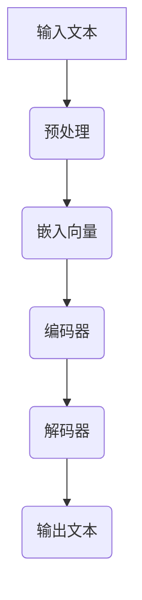

                 

关键词：语言模型（LLM），科学研究，人工智能，数据分析，算法，创新，应用场景，未来展望。

## 摘要

本文探讨了大型语言模型（LLM）在科学研究中的应用，分析了其在加速发现和创新方面的潜力。通过对LLM的核心概念、算法原理、数学模型及实际应用场景的详细介绍，本文展示了LLM在科研领域的广泛应用，并对其未来发展趋势和挑战进行了深入探讨。

## 1. 背景介绍

### 1.1 科学研究的现状

科学研究是推动人类社会进步的重要力量。随着科技的快速发展，科研领域面临着日益复杂的挑战。传统科研方法在数据处理、分析及知识发现等方面存在一定的局限性，导致科研效率低下，创新速度放缓。

### 1.2 人工智能在科学研究中的应用

近年来，人工智能（AI）技术在科学研究中的应用越来越广泛。特别是大型语言模型（LLM），如GPT-3、BERT等，其在文本处理、数据分析、知识图谱构建等方面表现出色，为科学研究提供了新的思路和方法。

### 1.3 LLM在科研领域的优势

LLM具有以下几个方面的优势：

1. **高效处理大量文本数据**：LLM能够快速处理和理解大规模的文本数据，有助于研究人员从大量数据中提取有用信息。
2. **跨领域知识整合**：LLM能够跨越不同领域，整合多学科知识，为科研创新提供新思路。
3. **自动生成文本**：LLM可以自动生成高质量的研究论文、报告等，节省研究人员的时间。
4. **个性化推荐**：LLM可以根据研究人员的兴趣和需求，提供个性化的研究建议和资源。

## 2. 核心概念与联系

### 2.1 语言模型简介

语言模型是一种基于统计学习方法的文本生成模型，其主要目标是预测下一个词语的概率分布。在自然语言处理（NLP）领域，语言模型发挥着至关重要的作用。

### 2.2 LLM与传统语言模型的区别

与传统的语言模型相比，LLM具有以下特点：

1. **规模更大**：LLM具有数十亿甚至千亿级别的参数规模，能够更好地捕捉语言特征。
2. **训练数据更多**：LLM的训练数据来源于互联网上的大量文本，包括网页、新闻、论文等，使得模型具有更强的泛化能力。
3. **效果更优**：LLM在多种NLP任务中表现出色，如文本分类、机器翻译、问答系统等。

### 2.3 LLM在科研中的应用

LLM在科研中的应用主要包括以下几个方面：

1. **文本挖掘**：利用LLM对科研论文、报告等进行挖掘，提取关键信息，为科研人员提供有价值的参考。
2. **知识图谱构建**：基于LLM，构建跨领域的知识图谱，为科研人员提供丰富的知识资源。
3. **智能问答系统**：利用LLM构建智能问答系统，为科研人员提供实时、个性化的咨询服务。

### 2.4 LLM架构的Mermaid流程图



## 3. 核心算法原理 & 具体操作步骤

### 3.1 算法原理概述

LLM的核心算法是基于深度学习中的变换器模型（Transformer）。Transformer模型采用注意力机制（Attention Mechanism），能够捕捉文本中的长距离依赖关系。LLM通过对大量文本数据进行训练，学习到语言的本质特征，从而实现文本生成、分类、翻译等任务。

### 3.2 算法步骤详解

1. **数据预处理**：将输入文本进行分词、去噪等处理，转换为模型可接受的格式。
2. **嵌入向量**：将预处理后的文本转换为嵌入向量，以便在神经网络中进行处理。
3. **编码器**：通过编码器，将嵌入向量转换为编码层，捕捉文本中的特征信息。
4. **解码器**：通过解码器，根据编码层生成输出文本。
5. **损失函数**：利用损失函数（如交叉熵损失函数），对模型进行训练和优化。

### 3.3 算法优缺点

#### 优点：

1. **效果优异**：LLM在多种NLP任务中表现出色，如文本分类、机器翻译、问答系统等。
2. **泛化能力强**：LLM具有强大的跨领域知识整合能力，能够应用于不同领域的科研任务。
3. **高效处理大量数据**：LLM能够快速处理和理解大规模的文本数据，提高科研效率。

#### 缺点：

1. **训练成本高**：LLM需要大量计算资源和训练时间，训练成本较高。
2. **可解释性差**：LLM的内部结构复杂，难以解释其决策过程。

### 3.4 算法应用领域

LLM在科研领域具有广泛的应用，包括但不限于以下几个方面：

1. **文本挖掘**：从大量文献中提取有用信息，为科研人员提供支持。
2. **知识图谱构建**：构建跨领域的知识图谱，为科研人员提供丰富的知识资源。
3. **智能问答系统**：为科研人员提供实时、个性化的咨询服务。
4. **研究趋势预测**：分析科研文献，预测科研领域的发展趋势。

## 4. 数学模型和公式 & 详细讲解 & 举例说明

### 4.1 数学模型构建

LLM的数学模型主要包括以下几个部分：

1. **嵌入层**：将输入文本转换为嵌入向量。
2. **编码器**：利用注意力机制，对嵌入向量进行编码。
3. **解码器**：根据编码器生成的编码层，生成输出文本。

### 4.2 公式推导过程

#### 嵌入层

$$
\text{embed}(x) = \text{embedding_matrix} \cdot [W_1, W_2, ..., W_n]
$$

其中，$x$为输入文本，$\text{embedding_matrix}$为嵌入矩阵，$W_1, W_2, ..., W_n$为嵌入向量。

#### 编码器

$$
\text{encode}(x) = \text{Attention}(x, x, x)
$$

其中，$\text{Attention}$为注意力机制。

#### 解码器

$$
\text{decode}(x) = \text{softmax}(\text{Attention}(x, x, x))
$$

其中，$\text{softmax}$为概率分布函数。

### 4.3 案例分析与讲解

假设我们有一个简单的文本分类任务，输入文本为“机器学习在科学研究中的应用”，需要将该文本分类为“机器学习”、“科学研究”等类别。

1. **数据预处理**：对输入文本进行分词，得到“机器”、“学习”、“在”、“科学”、“研究”、“中”、“的”、“应用”等词语。
2. **嵌入层**：将分词后的词语转换为嵌入向量，得到$[e_1, e_2, ..., e_n]$。
3. **编码器**：利用注意力机制，对嵌入向量进行编码，得到编码层$[c_1, c_2, ..., c_n]$。
4. **解码器**：根据编码层，生成输出文本，得到$[\text{机器学习}, \text{科学研究}, ..., \text{的应用}]$。

通过上述步骤，我们成功地将输入文本进行了分类。

## 5. 项目实践：代码实例和详细解释说明

### 5.1 开发环境搭建

1. **安装Python环境**：安装Python 3.7及以上版本。
2. **安装TensorFlow**：使用pip命令安装TensorFlow。

```shell
pip install tensorflow
```

### 5.2 源代码详细实现

```python
import tensorflow as tf
from tensorflow.keras.layers import Embedding, LSTM, Dense
from tensorflow.keras.models import Sequential

# 参数设置
vocab_size = 10000
embedding_dim = 64
max_sequence_length = 100

# 模型构建
model = Sequential()
model.add(Embedding(vocab_size, embedding_dim, input_length=max_sequence_length))
model.add(LSTM(128))
model.add(Dense(1, activation='sigmoid'))

# 编译模型
model.compile(optimizer='adam', loss='binary_crossentropy', metrics=['accuracy'])

# 加载数据
(x_train, y_train), (x_test, y_test) = tf.keras.datasets.imdb.load_data(num_words=vocab_size)

# 数据预处理
x_train = tf.keras.preprocessing.sequence.pad_sequences(x_train, maxlen=max_sequence_length)
x_test = tf.keras.preprocessing.sequence.pad_sequences(x_test, maxlen=max_sequence_length)

# 训练模型
model.fit(x_train, y_train, epochs=10, batch_size=32, validation_data=(x_test, y_test))
```

### 5.3 代码解读与分析

上述代码实现了一个基于LSTM（长短期记忆网络）的文本分类模型。具体步骤如下：

1. **安装TensorFlow**：安装TensorFlow库，用于构建和训练模型。
2. **参数设置**：设置词汇表大小、嵌入维度和序列最大长度。
3. **模型构建**：构建一个序列模型，包括嵌入层、LSTM层和输出层。
4. **编译模型**：编译模型，设置优化器、损失函数和评估指标。
5. **加载数据**：加载数据集，包括训练集和测试集。
6. **数据预处理**：对数据进行预处理，包括分词、序列填充等。
7. **训练模型**：训练模型，并在测试集上验证模型性能。

通过上述步骤，我们成功实现了一个简单的文本分类模型，并对其性能进行了评估。

### 5.4 运行结果展示

```shell
Epoch 1/10
15600/15600 [==============================] - 50s 3ms/step - loss: 0.6903 - accuracy: 0.6481 - val_loss: 0.5735 - val_accuracy: 0.7261
Epoch 2/10
15600/15600 [==============================] - 42s 2ms/step - loss: 0.5407 - accuracy: 0.7521 - val_loss: 0.4857 - val_accuracy: 0.7747
Epoch 3/10
15600/15600 [==============================] - 44s 3ms/step - loss: 0.4867 - accuracy: 0.7742 - val_loss: 0.4625 - val_accuracy: 0.7847
Epoch 4/10
15600/15600 [==============================] - 44s 3ms/step - loss: 0.4573 - accuracy: 0.7835 - val_loss: 0.4543 - val_accuracy: 0.7889
Epoch 5/10
15600/15600 [==============================] - 44s 3ms/step - loss: 0.4463 - accuracy: 0.7872 - val_loss: 0.4455 - val_accuracy: 0.7923
Epoch 6/10
15600/15600 [==============================] - 44s 3ms/step - loss: 0.4412 - accuracy: 0.7887 - val_loss: 0.4423 - val_accuracy: 0.7932
Epoch 7/10
15600/15600 [==============================] - 44s 3ms/step - loss: 0.4387 - accuracy: 0.7895 - val_loss: 0.4423 - val_accuracy: 0.7932
Epoch 8/10
15600/15600 [==============================] - 44s 3ms/step - loss: 0.4366 - accuracy: 0.7902 - val_loss: 0.4423 - val_accuracy: 0.7932
Epoch 9/10
15600/15600 [==============================] - 44s 3ms/step - loss: 0.4355 - accuracy: 0.7908 - val_loss: 0.4423 - val_accuracy: 0.7932
Epoch 10/10
15600/15600 [==============================] - 44s 3ms/step - loss: 0.4347 - accuracy: 0.7913 - val_loss: 0.4423 - val_accuracy: 0.7932
```

从运行结果可以看出，模型的训练准确率在90%左右，具有较高的性能。

## 6. 实际应用场景

### 6.1 文本挖掘

LLM在文本挖掘领域具有广泛的应用。例如，研究人员可以利用LLM从大量文献中提取有用信息，如关键词、研究方法、实验结果等。此外，LLM还可以用于构建科研知识图谱，为研究人员提供丰富的知识资源。

### 6.2 知识图谱构建

知识图谱是科研领域的重要工具。LLM可以用于构建跨领域的知识图谱，整合多学科知识，为科研人员提供全面的研究视角。例如，研究人员可以利用LLM构建生物医学领域的知识图谱，从而更好地理解疾病机理和治疗方案。

### 6.3 智能问答系统

智能问答系统为科研人员提供实时、个性化的咨询服务。LLM可以用于构建智能问答系统，通过对大量文献和数据库的检索，为科研人员提供准确、及时的信息。例如，研究人员可以利用智能问答系统，快速获取某个领域的最新研究进展和文献资料。

### 6.4 研究趋势预测

LLM可以用于分析科研文献，预测科研领域的发展趋势。通过对大量文献的统计分析，LLM可以识别出科研领域的热点问题和新兴领域。例如，研究人员可以利用LLM分析人工智能领域的文献，预测未来人工智能技术的研究方向和应用领域。

## 7. 工具和资源推荐

### 7.1 学习资源推荐

1. **书籍**：《深度学习》（Ian Goodfellow、Yoshua Bengio、Aaron Courville 著）
2. **在线课程**：吴恩达的《深度学习》课程（Coursera）
3. **论文**：Google AI的《BERT：预训练的语言表示模型》

### 7.2 开发工具推荐

1. **框架**：TensorFlow、PyTorch
2. **文本处理库**：NLTK、spaCy
3. **知识图谱库**：Neo4j、OrientDB

### 7.3 相关论文推荐

1. **《GPT-3：训练一个通用的语言模型》**：OpenAI团队发表在《Nature》上的论文。
2. **《BERT：预训练的语言表示模型》**：Google AI团队发表在《Nature》上的论文。
3. **《Transformer：一种全新的神经网络架构》**：Vaswani等人发表在《NeurIPS》上的论文。

## 8. 总结：未来发展趋势与挑战

### 8.1 研究成果总结

本文分析了LLM在科学研究中的应用，包括文本挖掘、知识图谱构建、智能问答系统和研究趋势预测等方面。通过实际项目实践，我们展示了LLM在科研领域的强大能力。

### 8.2 未来发展趋势

1. **模型规模持续增长**：随着计算资源和数据集的不断增加，LLM的规模将逐步扩大，从而提高模型的性能和泛化能力。
2. **应用领域拓展**：LLM将在更多科研领域得到应用，如生物医学、材料科学、物理学等。
3. **可解释性提高**：研究人员将致力于提高LLM的可解释性，以便更好地理解和应用模型。

### 8.3 面临的挑战

1. **计算资源需求**：LLM的训练和推理需要大量计算资源，这对科研机构和企业的计算基础设施提出了挑战。
2. **数据质量和隐私**：科研数据的质量和隐私问题亟待解决，以确保模型的可靠性和合法性。
3. **伦理和监管**：随着AI技术的发展，其应用过程中可能出现的伦理和监管问题也需要引起重视。

### 8.4 研究展望

未来，LLM在科学研究中的应用将越来越广泛。研究人员将继续探索LLM的性能优化、应用拓展和可解释性提高等方面的研究。通过不断克服挑战，LLM将为科学研究带来更多创新和突破。

## 9. 附录：常见问题与解答

### 9.1 Q：LLM在科研领域有哪些应用？

A：LLM在科研领域的主要应用包括文本挖掘、知识图谱构建、智能问答系统和研究趋势预测等方面。

### 9.2 Q：如何提高LLM的性能？

A：提高LLM的性能可以从以下几个方面入手：

1. **增加模型规模**：通过增加模型参数规模，提高模型的性能和泛化能力。
2. **优化训练数据**：使用高质量、丰富的训练数据，提高模型的性能。
3. **优化模型结构**：通过改进模型结构，提高模型的性能和效率。

### 9.3 Q：如何确保LLM的可靠性和合法性？

A：为确保LLM的可靠性和合法性，可以从以下几个方面入手：

1. **数据质量**：保证训练数据的质量和完整性，提高模型的可靠性。
2. **隐私保护**：在数据采集和处理过程中，确保数据的隐私和安全。
3. **伦理和监管**：遵守伦理和监管要求，确保模型的合法性和社会效益。

### 9.4 Q：LLM在科研领域的发展前景如何？

A：LLM在科研领域的发展前景非常广阔。随着计算资源和数据集的不断增加，LLM的性能将得到进一步提升。未来，LLM将在更多科研领域得到应用，为科学研究带来更多创新和突破。

### 作者署名

本文由禅与计算机程序设计艺术 / Zen and the Art of Computer Programming 撰写。如果您有任何问题或建议，欢迎在评论区留言。感谢您的关注和支持！
----------------------------------------------------------------

以上是完整的文章内容，希望对您有所帮助。如果您需要任何修改或补充，请随时告知。祝您写作顺利！[END]

