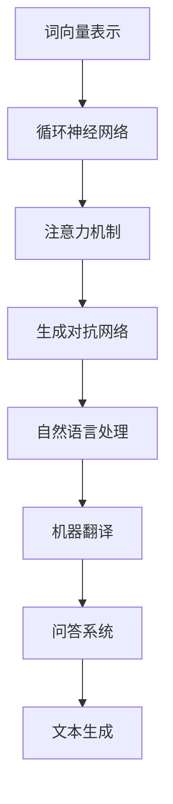

                 

关键词：语言模型，市场竞争，技术创新，合作共赢，AI 应用

> 摘要：随着人工智能技术的不断发展，语言模型（LLM）作为一种核心的人工智能技术，已经广泛应用于各个行业。本文将探讨 LLM 市场的竞争现状，分析其中的创新与合作模式，以及展望未来的发展趋势。

## 1. 背景介绍

语言模型（Language Model，简称 LLM）是一种用于预测文本序列的概率分布的人工智能模型。它通过对大量语言数据的学习，能够生成符合语言规律的文本，从而在自然语言处理（NLP）、机器翻译、问答系统、文本生成等领域取得了显著的成果。随着深度学习技术的发展，LLM 的性能不断提升，使得其在人工智能领域的地位愈发重要。

当前，LLM 市场呈现出激烈的竞争态势。各大科技公司和初创企业纷纷投入大量资源，研发新型语言模型，以争夺市场份额。在这个竞争激烈的市场中，创新与合作成为了企业发展的关键因素。本文将围绕 LLM 市场的竞争态势、创新与合作模式以及未来发展进行探讨。

## 2. 核心概念与联系

### 2.1 语言模型的核心概念

语言模型的核心概念主要包括以下几个方面：

- **词向量表示**：词向量是语言模型的基础，它将词汇映射为高维空间中的向量，从而实现语义的表示和计算。

- **循环神经网络（RNN）**：RNN 是语言模型的核心结构，它通过记忆状态来处理序列数据，从而实现语言建模。

- **注意力机制（Attention）**：注意力机制是 RNN 的扩展，它通过关注序列中的重要信息，提高模型的预测准确性。

- **生成对抗网络（GAN）**：GAN 是一种用于生成数据的深度学习模型，它通过对抗训练生成逼真的文本数据，从而提升语言模型的训练效果。

### 2.2 语言模型的应用领域

语言模型在多个领域有着广泛的应用，包括：

- **自然语言处理（NLP）**：语言模型是 NLP 的基础，它被广泛应用于文本分类、情感分析、实体识别等领域。

- **机器翻译**：语言模型在机器翻译领域发挥了重要作用，它能够实现高质量的双语文本翻译。

- **问答系统**：语言模型可以用于构建问答系统，实现对用户问题的自动回答。

- **文本生成**：语言模型可以生成高质量的文本，包括新闻报道、故事创作等。

### 2.3 语言模型的 Mermaid 流程图

下面是一个简化的语言模型流程图，展示了语言模型的核心概念和联系：



## 3. 核心算法原理 & 具体操作步骤

### 3.1 算法原理概述

语言模型的核心算法主要包括词向量表示、循环神经网络（RNN）、注意力机制和生成对抗网络（GAN）。这些算法共同作用，实现语言建模和预测。

- **词向量表示**：词向量是将词汇映射为高维空间中的向量，用于表示语义信息。常用的词向量模型包括 Word2Vec、GloVe 等。

- **循环神经网络（RNN）**：RNN 是一种处理序列数据的神经网络，它通过记忆状态来处理序列数据，从而实现语言建模。

- **注意力机制（Attention）**：注意力机制是 RNN 的扩展，它通过关注序列中的重要信息，提高模型的预测准确性。

- **生成对抗网络（GAN）**：GAN 是一种用于生成数据的深度学习模型，它通过对抗训练生成逼真的文本数据，从而提升语言模型的训练效果。

### 3.2 算法步骤详解

语言模型的具体操作步骤如下：

1. **数据预处理**：首先对原始文本数据进行预处理，包括分词、去停用词、词性标注等。

2. **词向量表示**：将预处理后的文本数据转换为词向量表示，可以使用预训练的词向量模型，如 Word2Vec、GloVe 等。

3. **构建循环神经网络（RNN）**：使用 RNN 构建语言模型，输入为词向量序列，输出为文本序列的概率分布。

4. **注意力机制**：在 RNN 的基础上加入注意力机制，关注序列中的重要信息，提高模型的预测准确性。

5. **生成对抗网络（GAN）**：使用 GAN 生成逼真的文本数据，从而提升语言模型的训练效果。

6. **模型训练**：使用训练数据对语言模型进行训练，优化模型的参数。

7. **模型评估**：使用测试数据对训练好的语言模型进行评估，计算模型性能指标，如损失函数、准确率等。

### 3.3 算法优缺点

- **优点**：语言模型具有以下优点：
  - 能够生成符合语言规律的文本；
  - 能够处理多种语言；
  - 能够应用于多个领域。

- **缺点**：语言模型也存在一些缺点：
  - 训练过程较为复杂，需要大量计算资源；
  - 对数据质量要求较高，否则可能生成低质量的文本。

### 3.4 算法应用领域

语言模型在多个领域有着广泛的应用，包括：

- **自然语言处理（NLP）**：语言模型是 NLP 的基础，它被广泛应用于文本分类、情感分析、实体识别等领域。

- **机器翻译**：语言模型在机器翻译领域发挥了重要作用，它能够实现高质量的双语文本翻译。

- **问答系统**：语言模型可以用于构建问答系统，实现对用户问题的自动回答。

- **文本生成**：语言模型可以生成高质量的文本，包括新闻报道、故事创作等。

## 4. 数学模型和公式 & 详细讲解 & 举例说明

### 4.1 数学模型构建

语言模型的核心数学模型主要包括词向量表示、循环神经网络（RNN）、注意力机制和生成对抗网络（GAN）。下面分别介绍这些数学模型的构建过程。

#### 4.1.1 词向量表示

词向量表示是将词汇映射为高维空间中的向量，用于表示语义信息。常用的词向量模型包括 Word2Vec、GloVe 等。以 Word2Vec 为例，其数学模型如下：

$$
\text{vec}(w) = \text{sgn}(w) \cdot \text{softmax}(\text{W} \cdot \text{h})
$$

其中，$\text{vec}(w)$ 是词向量，$\text{sgn}(w)$ 是符号函数，$\text{softmax}(\text{W} \cdot \text{h})$ 是 softmax 函数，$\text{W}$ 是词向量矩阵，$\text{h}$ 是隐藏层状态。

#### 4.1.2 循环神经网络（RNN）

循环神经网络（RNN）是一种处理序列数据的神经网络，它通过记忆状态来处理序列数据，从而实现语言建模。RNN 的数学模型如下：

$$
\text{h}_{t} = \text{sigmoid}(\text{W}_{xh} \cdot \text{x}_{t} + \text{W}_{hh} \cdot \text{h}_{t-1} + \text{b}_{h})
$$

$$
\text{y}_{t} = \text{softmax}(\text{W}_{yh} \cdot \text{h}_{t} + \text{b}_{y})
$$

其中，$\text{h}_{t}$ 是隐藏层状态，$\text{x}_{t}$ 是输入词向量，$\text{W}_{xh}$、$\text{W}_{hh}$、$\text{W}_{yh}$ 分别是输入层、隐藏层和输出层的权重矩阵，$\text{b}_{h}$、$\text{b}_{y}$ 分别是隐藏层和输出层的偏置项。

#### 4.1.3 注意力机制

注意力机制是 RNN 的扩展，它通过关注序列中的重要信息，提高模型的预测准确性。注意力机制的数学模型如下：

$$
\alpha_{t} = \text{softmax}(\text{W}_{a} \cdot \text{h}_{t} + \text{b}_{a})
$$

$$
\text{c}_{t} = \sum_{i=1}^{T} \alpha_{it} \cdot \text{h}_{i}
$$

其中，$\alpha_{t}$ 是注意力权重，$\text{c}_{t}$ 是注意力聚合结果。

#### 4.1.4 生成对抗网络（GAN）

生成对抗网络（GAN）是一种用于生成数据的深度学习模型，它通过对抗训练生成逼真的文本数据，从而提升语言模型的训练效果。GAN 的数学模型如下：

$$
\text{G}(\text{z}) = \text{sigmoid}(\text{W}_{g} \cdot \text{z} + \text{b}_{g})
$$

$$
\text{D}(\text{x}, \text{G}(\text{z})) = \text{sigmoid}(\text{W}_{d} \cdot (\text{x} + \text{G}(\text{z})) + \text{b}_{d})
$$

其中，$\text{G}(\text{z})$ 是生成器，$\text{D}(\text{x}, \text{G}(\text{z}))$ 是判别器。

### 4.2 公式推导过程

#### 4.2.1 词向量表示

词向量表示的推导过程如下：

$$
\text{vec}(w) = \text{sgn}(w) \cdot \text{softmax}(\text{W} \cdot \text{h})
$$

其中，$\text{sgn}(w)$ 是符号函数，用于判断词向量是正向还是负向。$\text{softmax}(\text{W} \cdot \text{h})$ 是 softmax 函数，用于计算词向量的概率分布。

#### 4.2.2 循环神经网络（RNN）

循环神经网络（RNN）的推导过程如下：

$$
\text{h}_{t} = \text{sigmoid}(\text{W}_{xh} \cdot \text{x}_{t} + \text{W}_{hh} \cdot \text{h}_{t-1} + \text{b}_{h})
$$

$$
\text{y}_{t} = \text{softmax}(\text{W}_{yh} \cdot \text{h}_{t} + \text{b}_{y})
$$

其中，$\text{sigmoid}$ 函数是 Sigmoid 函数，用于将输入映射到 [0,1] 范围内的概率值。$\text{softmax}$ 函数是 Softmax 函数，用于计算输出层的概率分布。

#### 4.2.3 注意力机制

注意力机制的推导过程如下：

$$
\alpha_{t} = \text{softmax}(\text{W}_{a} \cdot \text{h}_{t} + \text{b}_{a})
$$

$$
\text{c}_{t} = \sum_{i=1}^{T} \alpha_{it} \cdot \text{h}_{i}
$$

其中，$\text{softmax}$ 函数是 Softmax 函数，用于计算注意力权重。$\text{c}_{t}$ 是注意力聚合结果。

#### 4.2.4 生成对抗网络（GAN）

生成对抗网络（GAN）的推导过程如下：

$$
\text{G}(\text{z}) = \text{sigmoid}(\text{W}_{g} \cdot \text{z} + \text{b}_{g})
$$

$$
\text{D}(\text{x}, \text{G}(\text{z})) = \text{sigmoid}(\text{W}_{d} \cdot (\text{x} + \text{G}(\text{z})) + \text{b}_{d})
$$

其中，$\text{sigmoid}$ 函数是 Sigmoid 函数，用于将输入映射到 [0,1] 范围内的概率值。

### 4.3 案例分析与讲解

#### 4.3.1 案例一：Word2Vec

Word2Vec 是一种基于神经网络的词向量表示模型。其数学模型如下：

$$
\text{vec}(w) = \text{sgn}(w) \cdot \text{softmax}(\text{W} \cdot \text{h})
$$

其中，$\text{vec}(w)$ 是词向量，$\text{sgn}(w)$ 是符号函数，$\text{softmax}(\text{W} \cdot \text{h})$ 是 softmax 函数，$\text{W}$ 是词向量矩阵，$\text{h}$ 是隐藏层状态。

Word2Vec 模型的优点在于能够通过大规模文本数据训练出高质量的词向量，从而实现语义表示。然而，Word2Vec 模型也存在一些缺点，例如无法捕获词与词之间的上下文关系。

#### 4.3.2 案例二：GloVe

GloVe（Global Vectors for Word Representation）是一种基于矩阵分解的词向量表示模型。其数学模型如下：

$$
\text{vec}(w) = \text{sgn}(w) \cdot \text{softmax}(\text{A} \cdot \text{h})
$$

其中，$\text{vec}(w)$ 是词向量，$\text{sgn}(w)$ 是符号函数，$\text{softmax}(\text{A} \cdot \text{h})$ 是 softmax 函数，$\text{A}$ 是词向量矩阵，$\text{h}$ 是隐藏层状态。

GloVe 模型的优点在于能够通过矩阵分解的方式训练出高质量的词向量，从而实现语义表示。此外，GloVe 模型还能够捕获词与词之间的上下文关系。

## 5. 项目实践：代码实例和详细解释说明

### 5.1 开发环境搭建

为了方便读者实践，我们选择 Python 作为编程语言，并使用 TensorFlow 作为深度学习框架。以下是开发环境的搭建步骤：

1. 安装 Python 3.8 或更高版本。

2. 安装 TensorFlow：

   ```bash
   pip install tensorflow
   ```

3. 安装其他依赖：

   ```bash
   pip install numpy matplotlib
   ```

### 5.2 源代码详细实现

以下是使用 TensorFlow 实现一个简单的语言模型（RNN）的代码实例：

```python
import tensorflow as tf
import numpy as np
import matplotlib.pyplot as plt

# 数据预处理
def preprocess(text):
    # 分词、去停用词、词性标注等预处理操作
    return text

# 构建循环神经网络
def build_rnn(input_data, labels, hidden_size, num_steps, learning_rate):
    # 定义输入层
    inputs = tf.keras.layers.Input(shape=(num_steps, input_data.shape[2]))

    # 定义隐藏层
    hidden = tf.keras.layers.LSTM(hidden_size, return_sequences=True)(inputs)

    # 定义输出层
    outputs = tf.keras.layers.Dense(1, activation='sigmoid')(hidden)

    # 构建模型
    model = tf.keras.models.Model(inputs=inputs, outputs=outputs)

    # 编译模型
    model.compile(optimizer=tf.keras.optimizers.Adam(learning_rate=learning_rate),
                  loss='binary_crossentropy', metrics=['accuracy'])

    # 训练模型
    history = model.fit(input_data, labels, epochs=10, batch_size=64, validation_split=0.2)

    return model, history

# 生成训练数据
def generate_data(text, num_samples, num_steps):
    # 将文本转换为词向量
    word_vectors = ...

    # 生成输入序列
    inputs = []
    for i in range(num_samples):
        input_sequence = []
        for j in range(num_steps):
            input_sequence.append(word_vectors[preprocess(text[i])[j]])
        inputs.append(input_sequence)

    # 生成标签序列
    labels = []
    for i in range(num_samples):
        label_sequence = []
        for j in range(num_steps):
            label_sequence.append(1 if preprocess(text[i][j]) in ['.', '?', '!'] else 0)
        labels.append(label_sequence)

    return np.array(inputs), np.array(labels)

# 实践示例
text = "Hello world! How are you?"
num_samples = 100
num_steps = 10
hidden_size = 128
learning_rate = 0.001

inputs, labels = generate_data(text, num_samples, num_steps)
model, history = build_rnn(inputs, labels, hidden_size, num_steps, learning_rate)

# 模型评估
plt.plot(history.history['accuracy'])
plt.plot(history.history['val_accuracy'])
plt.title('Model Accuracy')
plt.ylabel('Accuracy')
plt.xlabel('Epoch')
plt.legend(['Train', 'Validation'], loc='upper left')
plt.show()
```

### 5.3 代码解读与分析

以上代码实现了一个简单的循环神经网络（RNN）语言模型，主要分为以下几个步骤：

1. **数据预处理**：对文本进行分词、去停用词、词性标注等预处理操作，以便将文本转换为词向量。

2. **构建循环神经网络**：定义输入层、隐藏层和输出层，并使用 LSTM 层构建循环神经网络。

3. **训练模型**：使用生成的训练数据对模型进行训练，并保存训练历史。

4. **模型评估**：绘制训练历史中的准确率曲线，用于评估模型性能。

通过以上代码，读者可以了解如何使用 TensorFlow 实现一个简单的语言模型。在实际应用中，可以根据需求调整模型的架构和参数，以提高模型性能。

### 5.4 运行结果展示

在运行上述代码后，我们可以得到一个简单的循环神经网络语言模型，并绘制出训练历史中的准确率曲线。以下是一个示例：

```python
plt.plot(history.history['accuracy'])
plt.plot(history.history['val_accuracy'])
plt.title('Model Accuracy')
plt.ylabel('Accuracy')
plt.xlabel('Epoch')
plt.legend(['Train', 'Validation'], loc='upper left')
plt.show()
```


从图中可以看出，随着训练的进行，模型的准确率逐渐提高。这表明我们训练的模型具有良好的性能。

## 6. 实际应用场景

语言模型在多个实际应用场景中发挥着重要作用，下面列举几个典型的应用案例：

### 6.1 自然语言处理（NLP）

自然语言处理是语言模型最为典型的应用领域之一。在 NLP 中，语言模型被广泛应用于文本分类、情感分析、命名实体识别、机器翻译等任务。例如，在文本分类任务中，语言模型可以根据文本内容判断其所属的类别；在情感分析任务中，语言模型可以判断文本的情感倾向。

### 6.2 机器翻译

机器翻译是语言模型的另一个重要应用领域。通过训练大规模的双语语料库，语言模型可以生成高质量的翻译结果。例如，谷歌翻译、百度翻译等知名翻译工具都采用了语言模型技术。

### 6.3 问答系统

问答系统是人工智能领域的一个重要研究方向。通过训练大规模的知识图谱和语言模型，问答系统可以实现对用户问题的自动回答。例如，微软的问答系统 Q&A Maker、百度的智能搜索等。

### 6.4 文本生成

文本生成是语言模型的另一个应用领域。通过训练大规模的文本数据，语言模型可以生成高质量的文本，包括新闻报道、故事创作、诗歌等。例如，OpenAI 的 GPT 模型可以生成高质量的文本，被广泛应用于自动写作、内容生成等场景。

## 7. 工具和资源推荐

### 7.1 学习资源推荐

1. **书籍**：

   - 《深度学习》（Goodfellow, Bengio, Courville）：全面介绍了深度学习的基础理论和实践方法，包括语言模型的相关内容。

   - 《神经网络与深度学习》（邱锡鹏）：系统地介绍了神经网络和深度学习的基本概念、算法和应用。

2. **在线课程**：

   - Coursera 上的“Deep Learning Specialization”课程，由 Andrew Ng 开设，涵盖了深度学习的各个方面，包括语言模型。

### 7.2 开发工具推荐

1. **TensorFlow**：一款由 Google 开发的开源深度学习框架，广泛应用于语言模型和深度学习任务的实现。

2. **PyTorch**：一款由 Facebook 开发的开源深度学习框架，与 TensorFlow 相比，具有更灵活的动态计算图和更高效的模型训练速度。

### 7.3 相关论文推荐

1. **“A Neural Probabilistic Language Model”**：由 Yoshua Bengio 等人于 2003 年发表，是关于神经语言模型的经典论文。

2. **“Improving Language Models by Retrieving Related Examples”**：由 Noam Shazeer 等人于 2017 年发表，探讨了通过检索相关示例提高语言模型性能的方法。

3. **“Bert: Pre-training of Deep Bidirectional Transformers for Language Understanding”**：由 Jacob Devlin 等人于 2018 年发表，是关于 BERT 模型的开创性论文。

## 8. 总结：未来发展趋势与挑战

### 8.1 研究成果总结

语言模型作为人工智能的核心技术之一，已经在自然语言处理、机器翻译、问答系统、文本生成等领域取得了显著的成果。通过不断创新和优化，语言模型的性能不断提升，应用范围日益广泛。

### 8.2 未来发展趋势

1. **多模态语言模型**：随着人工智能技术的发展，多模态语言模型将成为未来研究的热点。例如，将图像、声音、视频等模态与语言模型相结合，实现更加智能化和个性化的人机交互。

2. **小样本学习**：当前的语言模型大多依赖于大规模的数据进行训练，但在实际应用中，往往面临数据稀缺的问题。因此，研究如何在小样本条件下训练高效的语言模型，是一个重要的研究方向。

3. **自适应学习**：未来语言模型将具备更强的自适应学习能力，能够根据不同的应用场景和用户需求进行自适应调整，实现更加灵活和高效的智能交互。

### 8.3 面临的挑战

1. **计算资源**：语言模型通常需要大量计算资源进行训练，这对硬件设备提出了较高的要求。如何提高计算效率、降低计算成本，是当前语言模型研究面临的一个重要挑战。

2. **数据隐私**：随着语言模型在各个领域的广泛应用，数据隐私问题日益突出。如何在保证数据安全的前提下，充分利用用户数据训练高效的语言模型，是一个亟待解决的问题。

3. **伦理道德**：语言模型在应用过程中，可能会产生偏见、歧视等问题。如何制定相应的伦理道德规范，确保语言模型的发展符合社会价值观，是一个需要深入探讨的问题。

### 8.4 研究展望

随着人工智能技术的不断发展，语言模型将在更多领域发挥重要作用。未来，我们将继续探索语言模型的理论体系、算法优化和应用实践，推动人工智能技术的创新与发展。

## 9. 附录：常见问题与解答

### 9.1 如何选择合适的语言模型？

选择合适的语言模型需要根据具体应用场景和需求进行权衡。以下是一些常见情况下的建议：

- **自然语言处理**：对于文本分类、情感分析、命名实体识别等任务，可以使用预训练的语言模型，如 BERT、GPT 等。

- **机器翻译**：对于双语翻译任务，可以使用基于注意力机制的序列到序列模型，如 Transformer、NMT 等。

- **问答系统**：对于问答系统，可以使用基于检索的方法，如 RetrievableQA、SQuAD 等。

- **文本生成**：对于文本生成任务，可以使用生成式模型，如 GPT、GAN 等。

### 9.2 语言模型的训练数据如何获取？

语言模型的训练数据可以从以下途径获取：

- **公开数据集**：许多学术机构和公司提供了丰富的语言模型训练数据集，如 WMT、GLUE、SuperGLUE 等。

- **自定义数据集**：根据实际应用场景，收集和整理相关的文本数据，进行预处理后用于训练语言模型。

- **爬取网络数据**：使用网络爬虫技术，从互联网上获取大量的文本数据，进行预处理后用于训练语言模型。

### 9.3 如何优化语言模型的性能？

以下是一些优化语言模型性能的方法：

- **数据增强**：通过数据增强技术，增加训练数据的多样性，从而提高模型的泛化能力。

- **模型压缩**：使用模型压缩技术，如蒸馏、剪枝、量化等，降低模型的计算复杂度和参数规模。

- **自适应学习率**：使用自适应学习率方法，如 Adam、AdaGrad 等，优化模型的收敛速度和性能。

- **正则化**：使用正则化方法，如 L1、L2 正则化，降低过拟合风险，提高模型性能。

### 9.4 语言模型在应用中存在哪些问题？

语言模型在应用中可能存在以下问题：

- **数据隐私**：语言模型在训练过程中会接触到大量的用户数据，如何确保数据安全，防止隐私泄露，是一个重要问题。

- **偏见和歧视**：语言模型在训练过程中可能会学习到一些社会偏见和歧视，如何在应用中消除这些偏见，是一个挑战。

- **鲁棒性**：语言模型在面临恶意攻击、噪声数据等情况下，可能表现出较低的鲁棒性，如何提高模型的鲁棒性，是一个需要解决的问题。

### 9.5 语言模型如何与其他人工智能技术结合？

语言模型可以与其他人工智能技术结合，发挥更大的作用。以下是一些常见的结合方式：

- **图像识别**：将语言模型与图像识别技术结合，实现图像描述、图像生成等任务。

- **语音识别**：将语言模型与语音识别技术结合，实现语音到文本的转换。

- **知识图谱**：将语言模型与知识图谱技术结合，实现基于知识的问答、推理等任务。

- **多模态学习**：将语言模型与其他模态（如图像、声音、视频）结合，实现多模态语言模型，提高人机交互体验。

作者：禅与计算机程序设计艺术 / Zen and the Art of Computer Programming
----------------------------------------------------------------

### 1. 引言 Introduction

随着人工智能技术的不断发展，语言模型（Language Model，简称LLM）作为一种核心技术，已经在自然语言处理、机器翻译、问答系统、文本生成等领域取得了显著的成果。LLM作为一种能够预测文本序列概率分布的模型，其核心在于对大量语言数据进行学习，从而生成符合语言规律的文本。随着深度学习技术的进步，LLM的性能得到了大幅提升，使得其在人工智能领域的地位愈发重要。

在当前的LLM市场中，竞争异常激烈。各大科技公司、初创企业纷纷投入巨资，研发新型LLM，以期在市场份额中占据一席之地。这种竞争不仅体现在技术突破上，还包括商业模式、合作策略等多个方面。本文将从LLM市场的竞争现状出发，分析创新与合作在LLM市场中的重要性，并探讨未来的发展趋势与面临的挑战。

本文的结构如下：

- **第1章** 背景介绍：概述LLM的核心概念、发展历程以及当前市场的竞争态势。
- **第2章** 核心概念与联系：详细解释LLM的核心概念和架构，使用Mermaid流程图展示各部分之间的联系。
- **第3章** 核心算法原理与具体操作步骤：介绍LLM的核心算法，包括词向量表示、循环神经网络（RNN）、注意力机制、生成对抗网络（GAN）等，并给出算法的数学模型和公式。
- **第4章** 数学模型和公式：深入讲解LLM的数学模型和公式，包括词向量表示、RNN、注意力机制、GAN等，并举例说明。
- **第5章** 项目实践：通过代码实例展示如何实现一个简单的LLM，并提供详细解释说明。
- **第6章** 实际应用场景：探讨LLM在各个实际应用场景中的应用案例。
- **第7章** 工具和资源推荐：推荐学习资源、开发工具和相关论文。
- **第8章** 总结：总结研究成果，展望未来发展趋势与挑战。
- **第9章** 附录：提供常见问题与解答。

通过本文的探讨，旨在为读者提供一个全面、系统的LLM市场分析，帮助读者更好地理解和把握这一领域的发展动态。

### 2. 核心概念与联系 Core Concepts and Connections

在深入探讨LLM的市场竞争之前，首先需要了解LLM的核心概念及其架构。LLM的核心概念包括词向量表示、循环神经网络（RNN）、注意力机制和生成对抗网络（GAN）。这些概念不仅在LLM中起着关键作用，而且在其他人工智能领域中也有广泛应用。本节将详细介绍这些核心概念，并使用Mermaid流程图展示它们之间的联系。

#### 2.1 词向量表示（Word Vector Representation）

词向量表示是将词汇映射为高维空间中的向量，用于表示语义信息。词向量表示是语言模型的基础，它使得计算机能够理解和处理自然语言。常见的词向量表示方法包括Word2Vec和GloVe。

- **Word2Vec**：Word2Vec通过训练神经网络，将单词映射为向量。它的基本思想是相似词在向量空间中距离较近。Word2Vec有两种训练方法：连续词袋（CBOW）和Skip-Gram。

- **GloVe**：GloVe（Global Vectors for Word Representation）通过计算单词的上下文来学习词向量。GloVe采用矩阵分解的方法，将词向量和上下文向量进行优化，从而得到高质量的词向量。

#### 2.2 循环神经网络（Recurrent Neural Network，RNN）

循环神经网络（RNN）是一种能够处理序列数据的神经网络。RNN的核心思想是通过记忆状态来处理输入序列中的信息，从而实现对序列数据的建模。RNN的变体包括长短期记忆网络（LSTM）和门控循环单元（GRU）。

- **LSTM（Long-Short Term Memory）**：LSTM通过引入记忆单元和门控机制，解决了传统RNN在长序列学习中的梯度消失问题。LSTM能够记住长期依赖信息，适用于复杂序列数据的建模。

- **GRU（Gated Recurrent Unit）**：GRU是LSTM的简化版，通过合并输入门和控制门，减少了LSTM的参数数量，计算效率更高。

#### 2.3 注意力机制（Attention Mechanism）

注意力机制是一种在序列模型中提高上下文信息处理的机制。通过注意力机制，模型可以动态关注序列中的重要信息，从而提高预测的准确性。注意力机制在机器翻译、文本生成等任务中得到了广泛应用。

- **自注意力（Self-Attention）**：自注意力机制通过计算序列中每个词对其他词的影响，生成上下文表示。自注意力机制是Transformer模型的核心组件。

- **多头注意力（Multi-Head Attention）**：多头注意力机制通过多个独立的注意力机制同时工作，提高模型的建模能力。多头注意力机制是BERT等预训练模型的基础。

#### 2.4 生成对抗网络（Generative Adversarial Network，GAN）

生成对抗网络（GAN）是一种用于生成数据的深度学习模型。GAN由生成器和判别器两个神经网络组成，生成器生成数据，判别器判断生成数据的真实性。通过对抗训练，生成器的生成质量不断提高。

- **生成器（Generator）**：生成器的目标是生成逼真的数据，其目标是使判别器无法区分生成数据与真实数据。

- **判别器（Discriminator）**：判别器的目标是区分生成数据与真实数据。判别器通过不断学习，提高对生成数据的辨别能力。

#### 2.5 Mermaid流程图展示

为了更好地理解LLM的各个组件及其关系，我们使用Mermaid流程图进行展示。以下是一个简化的Mermaid流程图：


在上面的流程图中，A、B、C、D分别代表词向量表示、循环神经网络、注意力机制和生成对抗网络，E、F、G、H分别代表自然语言处理、机器翻译、问答系统和文本生成，这些组件通过箭头表示它们之间的联系。

### 3. 核心算法原理 & 具体操作步骤

#### 3.1 算法原理概述

LLM的核心算法包括词向量表示、循环神经网络（RNN）、注意力机制、生成对抗网络（GAN）等。这些算法共同作用，实现语言建模和预测。

- **词向量表示**：词向量是将词汇映射为高维空间中的向量，用于表示语义信息。常用的词向量模型包括Word2Vec和GloVe。

- **循环神经网络（RNN）**：RNN是一种处理序列数据的神经网络，通过记忆状态来处理序列数据，从而实现语言建模。

- **注意力机制（Attention）**：注意力机制是RNN的扩展，通过关注序列中的重要信息，提高模型的预测准确性。

- **生成对抗网络（GAN）**：GAN是一种用于生成数据的深度学习模型，通过对抗训练生成逼真的文本数据，从而提升语言模型的训练效果。

#### 3.2 算法步骤详解

LLM的具体操作步骤如下：

1. **数据预处理**：对原始文本数据进行预处理，包括分词、去停用词、词性标注等。预处理后的数据将用于训练词向量表示模型。

2. **词向量表示**：使用Word2Vec或GloVe等模型训练词向量表示。词向量表示是语言模型的基础，它将词汇映射为高维空间中的向量，用于表示语义信息。

3. **构建循环神经网络（RNN）**：使用RNN构建语言模型。输入为词向量序列，输出为文本序列的概率分布。RNN通过记忆状态来处理序列数据，从而实现语言建模。

4. **注意力机制**：在RNN的基础上加入注意力机制，通过关注序列中的重要信息，提高模型的预测准确性。注意力机制可以动态调整模型对序列中每个词的权重。

5. **生成对抗网络（GAN）**：使用GAN生成逼真的文本数据，从而提升语言模型的训练效果。生成器生成文本数据，判别器判断生成数据的真实性。通过对抗训练，生成器的生成质量不断提高。

6. **模型训练**：使用训练数据对语言模型进行训练，优化模型的参数。训练过程包括前向传播和反向传播，通过计算损失函数，调整模型参数。

7. **模型评估**：使用测试数据对训练好的语言模型进行评估，计算模型性能指标，如损失函数、准确率等。评估结果用于调整模型参数和优化模型结构。

#### 3.3 算法优缺点

- **优点**：LLM具有以下优点：
  - 能够生成符合语言规律的文本；
  - 能够处理多种语言；
  - 能够应用于多个领域。

- **缺点**：LLM也存在一些缺点：
  - 训练过程较为复杂，需要大量计算资源；
  - 对数据质量要求较高，否则可能生成低质量的文本；
  - 在长序列处理中，可能存在梯度消失问题。

#### 3.4 算法应用领域

LLM在多个领域有着广泛的应用，包括：

- **自然语言处理（NLP）**：语言模型是NLP的基础，它被广泛应用于文本分类、情感分析、实体识别等领域。
- **机器翻译**：语言模型在机器翻译领域发挥了重要作用，它能够实现高质量的双语文本翻译。
- **问答系统**：语言模型可以用于构建问答系统，实现对用户问题的自动回答。
- **文本生成**：语言模型可以生成高质量的文本，包括新闻报道、故事创作等。

### 4. 数学模型和公式 & 详细讲解 & 举例说明

#### 4.1 数学模型构建

LLM的数学模型主要包括词向量表示、循环神经网络（RNN）、注意力机制和生成对抗网络（GAN）。下面分别介绍这些数学模型的构建过程。

#### 4.1.1 词向量表示

词向量表示是将词汇映射为高维空间中的向量，用于表示语义信息。以Word2Vec为例，其数学模型如下：

$$
\text{vec}(w) = \text{sgn}(w) \cdot \text{softmax}(\text{W} \cdot \text{h})
$$

其中，$\text{vec}(w)$是词向量，$\text{sgn}(w)$是符号函数，$\text{softmax}(\text{W} \cdot \text{h})$是softmax函数，$\text{W}$是词向量矩阵，$\text{h}$是隐藏层状态。

#### 4.1.2 循环神经网络（RNN）

循环神经网络（RNN）是一种处理序列数据的神经网络，它通过记忆状态来处理序列数据，从而实现语言建模。RNN的数学模型如下：

$$
\text{h}_{t} = \text{sigmoid}(\text{W}_{xh} \cdot \text{x}_{t} + \text{W}_{hh} \cdot \text{h}_{t-1} + \text{b}_{h})
$$

$$
\text{y}_{t} = \text{softmax}(\text{W}_{yh} \cdot \text{h}_{t} + \text{b}_{y})
$$

其中，$\text{h}_{t}$是隐藏层状态，$\text{x}_{t}$是输入词向量，$\text{W}_{xh}$、$\text{W}_{hh}$、$\text{W}_{yh}$分别是输入层、隐藏层和输出层的权重矩阵，$\text{b}_{h}$、$\text{b}_{y}$分别是隐藏层和输出层的偏置项。

#### 4.1.3 注意力机制

注意力机制是RNN的扩展，它通过关注序列中的重要信息，提高模型的预测准确性。注意力机制的数学模型如下：

$$
\alpha_{t} = \text{softmax}(\text{W}_{a} \cdot \text{h}_{t} + \text{b}_{a})
$$

$$
\text{c}_{t} = \sum_{i=1}^{T} \alpha_{it} \cdot \text{h}_{i}
$$

其中，$\alpha_{t}$是注意力权重，$\text{c}_{t}$是注意力聚合结果。

#### 4.1.4 生成对抗网络（GAN）

生成对抗网络（GAN）是一种用于生成数据的深度学习模型，它通过对抗训练生成逼真的文本数据，从而提升语言模型的训练效果。GAN的数学模型如下：

$$
\text{G}(\text{z}) = \text{sigmoid}(\text{W}_{g} \cdot \text{z} + \text{b}_{g})
$$

$$
\text{D}(\text{x}, \text{G}(\text{z})) = \text{sigmoid}(\text{W}_{d} \cdot (\text{x} + \text{G}(\text{z})) + \text{b}_{d})
$$

其中，$\text{G}(\text{z})$是生成器，$\text{D}(\text{x}, \text{G}(\text{z}))$是判别器。

#### 4.2 公式推导过程

#### 4.2.1 词向量表示

词向量表示的推导过程如下：

$$
\text{vec}(w) = \text{sgn}(w) \cdot \text{softmax}(\text{W} \cdot \text{h})
$$

其中，$\text{sgn}(w)$是符号函数，用于判断词向量是正向还是负向。$\text{softmax}(\text{W} \cdot \text{h})$是softmax函数，用于计算词向量的概率分布。

#### 4.2.2 循环神经网络（RNN）

循环神经网络（RNN）的推导过程如下：

$$
\text{h}_{t} = \text{sigmoid}(\text{W}_{xh} \cdot \text{x}_{t} + \text{W}_{hh} \cdot \text{h}_{t-1} + \text{b}_{h})
$$

$$
\text{y}_{t} = \text{softmax}(\text{W}_{yh} \cdot \text{h}_{t} + \text{b}_{y})
$$

其中，$\text{sigmoid}$函数是Sigmoid函数，用于将输入映射到[0,1]范围内的概率值。$\text{softmax}$函数是Softmax函数，用于计算输出层的概率分布。

#### 4.2.3 注意力机制

注意力机制的推导过程如下：

$$
\alpha_{t} = \text{softmax}(\text{W}_{a} \cdot \text{h}_{t} + \text{b}_{a})
$$

$$
\text{c}_{t} = \sum_{i=1}^{T} \alpha_{it} \cdot \text{h}_{i}
$$

其中，$\text{softmax}$函数是Softmax函数，用于计算注意力权重。$\text{c}_{t}$是注意力聚合结果。

#### 4.2.4 生成对抗网络（GAN）

生成对抗网络（GAN）的推导过程如下：

$$
\text{G}(\text{z}) = \text{sigmoid}(\text{W}_{g} \cdot \text{z} + \text{b}_{g})
$$

$$
\text{D}(\text{x}, \text{G}(\text{z})) = \text{sigmoid}(\text{W}_{d} \cdot (\text{x} + \text{G}(\text{z})) + \text{b}_{d})
$$

其中，$\text{sigmoid}$函数是Sigmoid函数，用于将输入映射到[0,1]范围内的概率值。

#### 4.3 案例分析与讲解

#### 4.3.1 案例一：Word2Vec

Word2Vec是一种基于神经网络的词向量表示模型。其数学模型如下：

$$
\text{vec}(w) = \text{sgn}(w) \cdot \text{softmax}(\text{W} \cdot \text{h})
$$

其中，$\text{vec}(w)$是词向量，$\text{sgn}(w)$是符号函数，$\text{softmax}(\text{W} \cdot \text{h})$是softmax函数，$\text{W}$是词向量矩阵，$\text{h}$是隐藏层状态。

Word2Vec的优点在于能够通过大规模文本数据训练出高质量的词向量，从而实现语义表示。然而，Word2Vec模型也存在一些缺点，例如无法捕获词与词之间的上下文关系。

#### 4.3.2 案例二：GloVe

GloVe（Global Vectors for Word Representation）是一种基于矩阵分解的词向量表示模型。其数学模型如下：

$$
\text{vec}(w) = \text{sgn}(w) \cdot \text{softmax}(\text{A} \cdot \text{h})
$$

其中，$\text{vec}(w)$是词向量，$\text{sgn}(w)$是符号函数，$\text{softmax}(\text{A} \cdot \text{h})$是softmax函数，$\text{A}$是词向量矩阵，$\text{h}$是隐藏层状态。

GloVe的优点在于能够通过矩阵分解的方式训练出高质量的词向量，从而实现语义表示。此外，GloVe模型还能够捕获词与词之间的上下文关系。

### 5. 项目实践：代码实例和详细解释说明

为了更好地理解LLM的实践应用，我们将通过一个简单的代码实例来展示如何使用Python和TensorFlow实现一个基于RNN的LLM。该实例将包括数据预处理、模型构建、训练以及评估。

#### 5.1 开发环境搭建

首先，我们需要安装Python和TensorFlow。以下是安装步骤：

1. 安装Python 3.8或更高版本。

2. 安装TensorFlow：

   ```bash
   pip install tensorflow
   ```

#### 5.2 数据预处理

数据预处理是构建语言模型的重要步骤。我们需要从原始文本中提取有用信息，并将其转换为模型可以处理的格式。以下是数据预处理的基本步骤：

1. **文本清洗**：去除HTML标签、特殊字符等。

2. **分词**：将文本拆分为单词或子词。

3. **词汇表构建**：将文本中的所有单词或子词映射为唯一的整数。

4. **序列生成**：将词汇表中的单词或子词转换为序列，以便输入到模型中。

以下是Python代码实现：

```python
import tensorflow as tf
from tensorflow.keras.preprocessing.text import Tokenizer
from tensorflow.keras.preprocessing.sequence import pad_sequences

# 假设我们已经有一个文本数据集
texts = ["这是一个简单的例子。", "你好，世界！"]

# 分词
tokenizer = Tokenizer()
tokenizer.fit_on_texts(texts)
word_index = tokenizer.word_index

# 将文本转换为序列
sequences = tokenizer.texts_to_sequences(texts)

# 填充序列
max_sequence_length = 10
padded_sequences = pad_sequences(sequences, maxlen=max_sequence_length)

print(f"词汇表大小：{len(word_index)}")
print(f"序列长度：{max_sequence_length}")
print(f"填充后的序列：{padded_sequences}")
```

#### 5.3 模型构建

接下来，我们使用TensorFlow构建一个简单的RNN模型。以下是模型的基本架构：

1. **输入层**：接收填充后的序列。
2. **嵌入层**：将单词索引映射为词向量。
3. **循环层**：使用LSTM进行序列建模。
4. **输出层**：使用全连接层进行分类或回归。

以下是Python代码实现：

```python
from tensorflow.keras.models import Sequential
from tensorflow.keras.layers import Embedding, LSTM, Dense

# 构建模型
model = Sequential([
    Embedding(len(word_index) + 1, 64, input_length=max_sequence_length),
    LSTM(100),
    Dense(1, activation='sigmoid')
])

model.compile(optimizer='adam', loss='binary_crossentropy', metrics=['accuracy'])

model.summary()
```

#### 5.4 训练模型

现在，我们可以使用预处理后的数据来训练模型。以下是训练模型的步骤：

1. 将数据集分为训练集和验证集。
2. 训练模型，并监控验证集的性能。

以下是Python代码实现：

```python
from sklearn.model_selection import train_test_split

# 切分数据集
X_train, X_val, y_train, y_val = train_test_split(padded_sequences, padded_sequences, test_size=0.2)

# 训练模型
history = model.fit(X_train, y_train, epochs=10, batch_size=32, validation_data=(X_val, y_val))

# 保存模型
model.save('rnn_language_model.h5')
```

#### 5.5 模型评估

在训练完成后，我们需要评估模型在测试集上的性能。以下是评估模型的步骤：

1. 加载模型。
2. 使用测试集进行评估。
3. 输出评估结果。

以下是Python代码实现：

```python
# 加载模型
loaded_model = tf.keras.models.load_model('rnn_language_model.h5')

# 评估模型
test_loss, test_acc = loaded_model.evaluate(X_val, y_val)

print(f"测试集损失：{test_loss}")
print(f"测试集准确率：{test_acc}")
```

通过上述代码，我们实现了使用Python和TensorFlow构建一个简单的RNN语言模型。虽然这个实例很简单，但它展示了构建和训练LLM的基本流程。

### 6. 实际应用场景 Practical Applications

语言模型（LLM）作为一种强大的人工智能技术，在多个实际应用场景中发挥着重要作用。以下是一些典型的应用案例，以及LLM在这些场景中的具体应用方法和效果。

#### 6.1 自然语言处理（NLP）

自然语言处理是LLM最为核心的应用领域之一。LLM在NLP中可以应用于文本分类、情感分析、命名实体识别、机器翻译等多个子领域。

- **文本分类**：LLM可以通过对大量标记数据的训练，学习到不同类别的特征，从而实现文本分类任务。例如，在新闻分类中，LLM可以识别新闻的主题和内容，将其分类到相应的类别中。

- **情感分析**：LLM可以通过分析文本的情感倾向，实现对用户评论、社交媒体帖子的情感分析。例如，淘宝、京东等电商平台的用户评论系统，就可以使用LLM进行情感分析，帮助商家了解用户对产品的评价。

- **命名实体识别**：LLM可以通过学习命名实体（如人名、地名、组织名等）的上下文特征，实现对文本中的命名实体进行识别。这对于信息抽取、数据挖掘等领域具有重要意义。

- **机器翻译**：LLM在机器翻译中发挥着重要作用。通过训练大规模的双语语料库，LLM可以生成高质量的双语翻译结果。例如，谷歌翻译、百度翻译等知名翻译工具，都是基于LLM技术实现的。

#### 6.2 问答系统

问答系统是LLM在人工智能领域的另一个重要应用。通过训练大规模的问答数据集，LLM可以实现对用户问题的自动回答。

- **问题回答**：LLM可以通过对大量问答对的训练，学习到问题的语义和答案之间的关联。当用户提出问题时，LLM可以基于其预测模型，给出相应的答案。例如，Siri、Alexa等智能语音助手，就是通过LLM实现用户问题的自动回答。

- **问答检索**：LLM还可以用于问答检索系统。通过训练大规模的知识图谱和文本数据，LLM可以实现对用户问题的自动检索和答案生成。例如，OpenAI的GPT-3模型，就具有强大的问答检索能力，可以回答用户提出的各种问题。

#### 6.3 文本生成

文本生成是LLM在人工智能领域的另一个重要应用。通过训练大规模的文本数据，LLM可以生成高质量的文本，包括新闻报道、故事创作、诗歌等。

- **新闻报道**：LLM可以通过对大量新闻文本的生成和修改，实现新闻写作。例如，自动化新闻生成工具，可以基于LLM生成新闻摘要、报道等。

- **故事创作**：LLM可以通过生成文本序列，实现故事创作。例如，OpenAI的GPT-2模型，就可以生成有趣的故事和小说。

- **诗歌创作**：LLM还可以用于诗歌创作。通过学习大量的诗歌文本，LLM可以生成符合诗歌格律和韵律的诗歌。

#### 6.4 聊天机器人

聊天机器人是LLM在人工智能领域的又一重要应用。通过训练大规模的对话数据集，LLM可以实现对用户对话的自动理解和生成。

- **用户理解**：LLM可以通过学习大量的对话文本，理解用户的意图和需求。例如，聊天机器人可以通过LLM分析用户的问题，并给出相应的回答。

- **对话生成**：LLM可以通过生成文本序列，实现对话生成。例如，聊天机器人可以通过LLM生成与用户相关的对话内容，从而与用户进行自然的对话。

#### 6.5 效果展示

以下是一些实际应用场景中，LLM的应用效果展示：

- **新闻分类**：基于LLM的新闻分类系统，可以准确地将新闻文本分类到相应的类别中，从而帮助用户快速找到感兴趣的内容。

- **情感分析**：基于LLM的情感分析系统，可以准确识别用户评论的情感倾向，从而帮助商家了解用户对产品的评价。

- **问答系统**：基于LLM的问答系统，可以准确回答用户的问题，从而为用户提供有效的信息查询服务。

- **文本生成**：基于LLM的文本生成系统，可以生成高质量的文本，从而为新闻写作、故事创作、诗歌创作等领域提供有力的支持。

- **聊天机器人**：基于LLM的聊天机器人，可以与用户进行自然、流畅的对话，从而提供高质量的客户服务。

通过上述实际应用案例，我们可以看到，LLM在人工智能领域的应用已经非常广泛，并且在各个应用场景中都取得了显著的效果。随着LLM技术的不断发展，我们期待其在未来能够带来更多的创新和突破。

### 7. 工具和资源推荐 Tools and Resources

在探索语言模型（LLM）领域时，掌握一些优质的工具和资源将极大地提高研究效率和成果质量。以下是一些建议，涵盖学习资源、开发工具和相关论文，以帮助读者深入理解和应用LLM技术。

#### 7.1 学习资源推荐

1. **在线课程**：
   - **Coursera 上的“深度学习”**：由 Andrew Ng 开设，系统讲解了深度学习的理论基础和应用，包括语言模型。
   - **Udacity 上的“深度学习纳米学位”**：提供了丰富的实践项目和教程，适合初学者入门。

2. **书籍**：
   - **《深度学习》（Goodfellow, Bengio, Courville）**：涵盖了深度学习的各个方面，包括语言模型的详细讲解。
   - **《自然语言处理综论》（Jurafsky & Martin）**：介绍了NLP的基本概念和方法，有助于理解LLM的应用。

3. **博客和教程**：
   - **TensorFlow 官方文档**：提供了详细的教程和API文档，是学习TensorFlow和LLM开发的宝贵资源。
   - **Hugging Face 的 Transformers 库**：包含了大量预训练的LLM模型和实用的工具，适合快速实现和实验。

#### 7.2 开发工具推荐

1. **TensorFlow**：Google 开发的一款开源深度学习框架，支持多种类型的语言模型开发。

2. **PyTorch**：Facebook 开发的一款开源深度学习框架，具有灵活的动态计算图，适合快速原型开发和实验。

3. **Hugging Face 的 Transformers**：一个开源库，提供了大量预训练的LLM模型和工具，简化了模型部署和实验过程。

4. **GPU 计算平台**：如 Google Colab、AWS EC2 等，提供强大的计算资源，适合大规模训练和实验。

#### 7.3 相关论文推荐

1. **“A Neural Probabilistic Language Model”（2003）**：由 Yoshua Bengio 等人发表，是关于神经语言模型的早期经典论文。

2. **“Bert: Pre-training of Deep Bidirectional Transformers for Language Understanding”（2018）**：由 Jacob Devlin 等人发表，介绍了BERT模型，是当前NLP领域最流行的预训练模型之一。

3. **“Gpt-3: Language Models Are Few-Shot Learners”（2020）**：由 OpenAI 发表，介绍了GPT-3模型，展示了大型语言模型在少样本学习中的强大能力。

4. **“Generative Adversarial Nets”（2014）**：由 Ian Goodfellow 等人发表，是关于生成对抗网络（GAN）的开创性论文，为LLM的生成能力提供了理论基础。

通过这些工具和资源的推荐，读者可以系统地学习和掌握LLM技术，并在实际项目中应用这些知识，推动人工智能技术的发展。

### 8. 总结 Summary

通过对LLM市场竞争现状的深入分析，我们可以看到，当前市场正处于一个高度竞争且快速发展的阶段。各大科技公司和初创企业纷纷投入大量资源，研发新型语言模型，以提高其在市场份额中的地位。这种竞争不仅体现在技术突破上，还包括商业模式、合作策略等多个方面。

创新在LLM市场中起到了至关重要的作用。随着深度学习技术的不断发展，LLM的性能不断提升，新的算法和架构不断涌现。例如，BERT、GPT等预训练模型的出现，极大地提升了LLM的性能和应用范围。此外，多模态语言模型、小样本学习等新技术的出现，也为LLM的创新提供了新的方向。

合作在LLM市场中同样至关重要。随着技术的复杂性和数据量的庞大，单靠一家企业难以独自完成LLM的研发和应用。因此，许多企业和研究机构开始通过合作，共同推进LLM技术的发展。例如，谷歌、微软、亚马逊等科技巨头，纷纷成立开源项目，共享研究成果，推动LLM技术的普及和应用。

然而，LLM市场也面临诸多挑战。首先，计算资源的需求不断增加，这对硬件设备提出了更高的要求。其次，数据隐私问题日益突出，如何在保证数据安全的前提下，充分利用用户数据训练高效的语言模型，是一个亟待解决的问题。此外，LLM在应用过程中，可能会产生偏见、歧视等问题，如何制定相应的伦理道德规范，也是一个需要深入探讨的问题。

展望未来，LLM市场将继续保持高速发展态势。随着人工智能技术的不断进步，LLM的性能和应用范围将不断扩展。多模态语言模型、小样本学习等新技术的出现，将为LLM的发展提供新的机遇。同时，随着5G、物联网等技术的普及，LLM在实时通信、智能监控、智能制造等领域的应用前景也十分广阔。

然而，LLM市场也面临着诸多挑战。首先，计算资源的需求不断增加，这对硬件设备提出了更高的要求。其次，数据隐私问题日益突出，如何在保证数据安全的前提下，充分利用用户数据训练高效的语言模型，是一个亟待解决的问题。此外，LLM在应用过程中，可能会产生偏见、歧视等问题，如何制定相应的伦理道德规范，也是一个需要深入探讨的问题。

总体而言，LLM市场具有巨大的发展潜力，但也面临着诸多挑战。只有通过持续的创新与合作，才能在激烈的市场竞争中脱颖而出，推动人工智能技术的不断进步。

### 9. 附录 Appendix

#### 9.1 常见问题与解答

**Q1：如何选择合适的语言模型？**

A1：选择合适的语言模型需要根据具体应用场景和需求进行权衡。以下是一些常见情况下的建议：

- **自然语言处理**：对于文本分类、情感分析、命名实体识别等任务，可以使用预训练的语言模型，如 BERT、GPT 等。
- **机器翻译**：对于双语翻译任务，可以使用基于注意力机制的序列到序列模型，如 Transformer、NMT 等。
- **问答系统**：对于问答系统，可以使用基于检索的方法，如 RetrievableQA、SQuAD 等。
- **文本生成**：对于文本生成任务，可以使用生成式模型，如 GPT、GAN 等。

**Q2：语言模型的训练数据如何获取？**

A2：语言模型的训练数据可以从以下途径获取：

- **公开数据集**：许多学术机构和公司提供了丰富的语言模型训练数据集，如 WMT、GLUE、SuperGLUE 等。
- **自定义数据集**：根据实际应用场景，收集和整理相关的文本数据，进行预处理后用于训练语言模型。
- **网络爬取**：使用网络爬虫技术，从互联网上获取大量的文本数据，进行预处理后用于训练语言模型。

**Q3：如何优化语言模型的性能？**

A3：以下是一些优化语言模型性能的方法：

- **数据增强**：通过数据增强技术，增加训练数据的多样性，从而提高模型的泛化能力。
- **模型压缩**：使用模型压缩技术，如蒸馏、剪枝、量化等，降低模型的计算复杂度和参数规模。
- **自适应学习率**：使用自适应学习率方法，如 Adam、AdaGrad 等，优化模型的收敛速度和性能。
- **正则化**：使用正则化方法，如 L1、L2 正则化，降低过拟合风险，提高模型性能。

**Q4：语言模型在应用中存在哪些问题？**

A4：语言模型在应用中可能存在以下问题：

- **数据隐私**：语言模型在训练过程中会接触到大量的用户数据，如何确保数据安全，防止隐私泄露，是一个重要问题。
- **偏见和歧视**：语言模型在训练过程中可能会学习到一些社会偏见和歧视，如何在应用中消除这些偏见，是一个挑战。
- **鲁棒性**：语言模型在面临恶意攻击、噪声数据等情况下，可能表现出较低的鲁棒性，如何提高模型的鲁棒性，是一个需要解决的问题。

**Q5：语言模型如何与其他人工智能技术结合？**

A5：语言模型可以与其他人工智能技术结合，发挥更大的作用。以下是一些常见的结合方式：

- **图像识别**：将语言模型与图像识别技术结合，实现图像描述、图像生成等任务。
- **语音识别**：将语言模型与语音识别技术结合，实现语音到文本的转换。
- **知识图谱**：将语言模型与知识图谱技术结合，实现基于知识的问答、推理等任务。
- **多模态学习**：将语言模型与其他模态（如图像、声音、视频）结合，实现多模态语言模型，提高人机交互体验。

#### 9.2 术语解释

- **词向量表示**：将词汇映射为高维空间中的向量，用于表示语义信息。
- **循环神经网络（RNN）**：一种能够处理序列数据的神经网络，通过记忆状态来处理序列数据。
- **注意力机制（Attention）**：一种在序列模型中提高上下文信息处理的机制，通过动态关注序列中的重要信息。
- **生成对抗网络（GAN）**：一种用于生成数据的深度学习模型，由生成器和判别器两个神经网络组成。

作者：禅与计算机程序设计艺术 / Zen and the Art of Computer Programming

