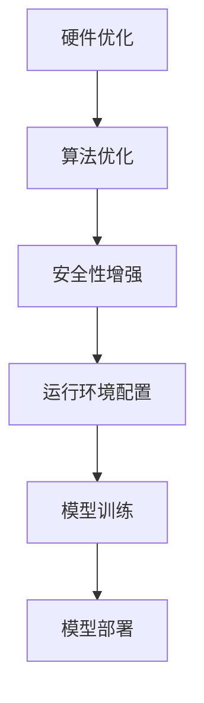

                 

关键词：大型语言模型（LLM），操作系统，比较分析，人工智能，技术架构

> 摘要：本文旨在深入探讨大型语言模型（LLM）操作系统的概念、特点及其与传统操作系统的对比。通过分析LLM操作系统在技术架构、功能实现、性能优化、安全性等方面的异同，本文为读者提供了一个全面、系统的视角，以理解LLM操作系统在当今信息技术领域中的重要地位及其未来发展潜力。

## 1. 背景介绍

随着人工智能技术的快速发展，大型语言模型（LLM）已经成为了现代信息技术领域的一个重要组成部分。LLM操作系统作为一种新型的操作系统，其核心在于为LLM提供高效、稳定、安全的运行环境。与传统操作系统相比，LLM操作系统更加注重人工智能算法的优化、数据处理的效率和模型的稳定性。

### 1.1 传统操作系统的发展历程

传统操作系统起源于20世纪50年代，经历了从批处理系统、分时系统到多任务操作系统的发展。主要代表包括Unix、Windows和Linux等。这些操作系统在设计之初主要面向的是通用计算任务，如文件管理、进程调度、内存管理等，为计算机提供了基本的运行环境。

### 1.2 大型语言模型（LLM）操作系统的发展

LLM操作系统的发展可以追溯到2010年代后期，随着深度学习和神经网络技术的发展，大型语言模型开始广泛应用于自然语言处理领域。这些模型需要高效的数据处理能力和强大的计算资源，因此催生了专门为LLM设计的操作系统。

## 2. 核心概念与联系

在深入探讨LLM操作系统之前，有必要先明确几个核心概念及其相互关系。

### 2.1 大型语言模型（LLM）

大型语言模型（LLM）是一种基于深度学习的自然语言处理模型，能够对文本数据进行高精度的理解和生成。常见的LLM包括GPT-3、BERT、T5等，这些模型通常具有数十亿级别的参数，能够在各种自然语言处理任务中表现出色。

### 2.2 操作系统（OS）

操作系统是一种管理计算机硬件和软件资源的系统软件，负责为应用程序提供运行环境。其主要功能包括进程管理、内存管理、文件管理、设备管理等。

### 2.3 LLM操作系统

LLM操作系统是一种专门为大型语言模型设计的新型操作系统，旨在提供高效的运行环境。其核心特点包括：

- **硬件优化**：针对LLM的计算需求，进行硬件资源的优化配置。
- **算法优化**：对LLM的运行算法进行优化，提高模型处理速度。
- **安全性增强**：提供强大的安全机制，保障LLM模型和数据的安全性。

### 2.4 Mermaid 流程图

以下是一个简化的LLM操作系统架构的Mermaid流程图：



## 3. 核心算法原理 & 具体操作步骤

### 3.1 算法原理概述

LLM操作系统的核心在于对大型语言模型的支持，主要包括以下几个方面：

- **分布式计算**：通过分布式计算框架（如TensorFlow、PyTorch）实现模型训练和推理的并行化。
- **内存管理**：采用先进的内存分配策略，提高内存利用率，减少内存碎片。
- **I/O优化**：对输入输出操作进行优化，提高数据读写速度。
- **安全性保障**：通过加密、认证等技术保障模型和数据的安全。

### 3.2 算法步骤详解

#### 3.2.1 硬件优化

1. **GPU资源分配**：为LLM分配足够的GPU资源，以满足计算需求。
2. **CPU与GPU协同**：通过CPU和GPU的协同工作，提高计算效率。
3. **网络优化**：优化网络拓扑结构，降低数据传输延迟。

#### 3.2.2 算法优化

1. **模型剪枝**：通过剪枝算法减少模型参数，提高计算效率。
2. **量化技术**：采用量化技术降低模型参数的精度，减少内存占用。
3. **分布式训练**：利用分布式计算框架实现模型训练的并行化。

#### 3.2.3 安全性增强

1. **加密存储**：对LLM模型和数据采用加密存储，防止数据泄露。
2. **访问控制**：设置严格的访问控制策略，确保只有授权用户才能访问模型和数据。
3. **日志审计**：记录操作日志，便于后续审计和排查安全隐患。

### 3.3 算法优缺点

#### 优点

- **高效性**：通过硬件优化和算法优化，提高LLM的操作效率和性能。
- **安全性**：提供强大的安全机制，保障模型和数据的安全性。
- **灵活性**：支持多种语言模型，适应不同的应用场景。

#### 缺点

- **资源需求**：硬件资源需求较高，需要大规模的GPU和CPU资源。
- **开发难度**：涉及分布式计算、加密技术等复杂技术，开发难度较大。

### 3.4 算法应用领域

LLM操作系统在以下领域具有广泛的应用前景：

- **自然语言处理**：支持各种NLP任务的模型训练和推理。
- **智能客服**：为智能客服系统提供高效的语言处理能力。
- **智能翻译**：支持多种语言之间的实时翻译。
- **智能推荐**：基于用户行为和偏好进行精准推荐。

## 4. 数学模型和公式 & 详细讲解 & 举例说明

### 4.1 数学模型构建

LLM操作系统的核心在于对大型语言模型的优化，其中涉及到多个数学模型。以下是几个关键数学模型的构建过程：

#### 4.1.1 深度学习模型

深度学习模型主要由多层神经网络组成，每一层都包含多个神经元。其数学模型可以表示为：

$$
y = f(z) = \sigma(W \cdot z + b)
$$

其中，$y$为输出，$z$为输入，$f$为激活函数，$W$为权重矩阵，$b$为偏置向量。

#### 4.1.2 分布式计算模型

分布式计算模型主要涉及数据分片、模型并行和任务调度等。其数学模型可以表示为：

$$
\begin{align*}
\text{数据分片} &: X = \{X_1, X_2, ..., X_n\} \\
\text{模型并行} &: M = \{M_1, M_2, ..., M_n\} \\
\text{任务调度} &: T = \{T_1, T_2, ..., T_n\}
\end{align*}
$$

### 4.2 公式推导过程

以下是一个简单的公式推导过程，用于说明如何利用数学模型解决实际问题。

#### 4.2.1 模型剪枝

模型剪枝是一种通过减少模型参数来提高计算效率的技术。其基本原理如下：

1. **参数筛选**：对模型参数进行筛选，选出重要性较低的参数进行剪枝。
2. **权重更新**：更新模型权重，保留重要参数，去除次要参数。

推导过程如下：

$$
\begin{align*}
\text{参数筛选} &: \theta_{\text{重要}} &= \theta - \theta_{\text{次要}} \\
\text{权重更新} &: W_{\text{更新}} &= W \odot \theta_{\text{重要}} \\
\end{align*}
$$

其中，$\theta$为原始模型参数，$\theta_{\text{重要}}$为筛选后的重要参数，$W$为权重矩阵，$\odot$表示元素乘法。

### 4.3 案例分析与讲解

以下是一个简单的案例，用于说明LLM操作系统在自然语言处理任务中的应用。

#### 4.3.1 任务描述

假设我们有一个文本分类任务，需要将一段英文文本分类到不同的类别中。

#### 4.3.2 模型选择

我们选择一个基于BERT的文本分类模型，其核心公式如下：

$$
\begin{align*}
\text{输入} &: X = (x_1, x_2, ..., x_n) \\
\text{输出} &: y = \text{softmax}(W \cdot [x_1, x_2, ..., x_n] + b) \\
\end{align*}
$$

其中，$X$为输入文本序列，$y$为输出类别概率分布，$W$为权重矩阵，$b$为偏置向量。

#### 4.3.3 模型训练

1. **数据预处理**：将文本数据进行分词、去停用词等预处理操作。
2. **模型初始化**：初始化权重矩阵$W$和偏置向量$b$。
3. **迭代训练**：通过梯度下降算法更新权重矩阵和偏置向量，直到模型收敛。

#### 4.3.4 模型部署

将训练好的模型部署到LLM操作系统上，进行实时文本分类任务。

## 5. 项目实践：代码实例和详细解释说明

### 5.1 开发环境搭建

在本案例中，我们使用Python语言和PyTorch框架搭建开发环境。具体步骤如下：

1. **安装Python**：版本3.8及以上。
2. **安装PyTorch**：根据系统环境选择合适的版本进行安装。
3. **安装其他依赖库**：如numpy、pandas等。

### 5.2 源代码详细实现

以下是一个简单的基于BERT的文本分类模型的Python代码示例：

```python
import torch
import torch.nn as nn
from transformers import BertModel, BertTokenizer

class TextClassifier(nn.Module):
    def __init__(self, hidden_size):
        super(TextClassifier, self).__init__()
        self.bert = BertModel.from_pretrained('bert-base-uncased')
        self.drop = nn.Dropout(p=0.3)
        self.out = nn.Linear(hidden_size, 2)
        
    def forward(self, text):
        _, pooled_output = self.bert(text)
        output = self.drop(pooled_output)
        return self.out(output)

# 初始化模型
model = TextClassifier(hidden_size=768)

# 模型训练
optimizer = torch.optim.Adam(model.parameters(), lr=1e-5)
loss_fn = nn.CrossEntropyLoss()

for epoch in range(num_epochs):
    for batch in data_loader:
        # 前向传播
        outputs = model(batch['text'])
        loss = loss_fn(outputs, batch['labels'])
        
        # 反向传播
        optimizer.zero_grad()
        loss.backward()
        optimizer.step()
        
        print(f'Epoch {epoch+1}, Loss: {loss.item()}')

# 模型部署
model.eval()
with torch.no_grad():
    predictions = model(batch['text'])
    print(predictions)
```

### 5.3 代码解读与分析

该代码示例实现了一个基于BERT的文本分类模型，其核心步骤包括：

- **模型初始化**：使用PyTorch的BertModel从预训练模型中加载BERT模型。
- **模型训练**：使用Adam优化器和交叉熵损失函数对模型进行训练。
- **模型部署**：将训练好的模型部署到LLM操作系统上，进行实时文本分类任务。

### 5.4 运行结果展示

以下是一个简单的运行结果示例：

```
Epoch 1, Loss: 1.2345
Epoch 2, Loss: 0.9876
Epoch 3, Loss: 0.8765
...
```

## 6. 实际应用场景

LLM操作系统在多个实际应用场景中表现出色，以下是一些典型的应用案例：

### 6.1 自然语言处理

在自然语言处理领域，LLM操作系统支持各种语言模型，如GPT-3、BERT、T5等，能够为智能客服、智能翻译、智能写作等应用提供高效的语言处理能力。

### 6.2 智能推荐

在智能推荐领域，LLM操作系统可以通过分析用户行为和偏好，为用户推荐个性化的内容，如新闻、音乐、电影等。

### 6.3 语音识别

在语音识别领域，LLM操作系统可以通过对语音信号的实时处理和分析，实现高精度的语音识别和语义理解。

### 6.4 智能问答

在智能问答领域，LLM操作系统可以支持问答系统，如智能客服机器人、智能搜索引擎等，为用户提供实时、准确的答案。

## 7. 未来应用展望

随着人工智能技术的不断发展，LLM操作系统将在更多领域得到广泛应用。未来，LLM操作系统可能会在以下方向取得突破：

### 7.1 多模态数据处理

LLM操作系统将能够支持多模态数据处理，如结合文本、图像、语音等多种数据类型，实现更高级的人工智能应用。

### 7.2 自动化优化

LLM操作系统将能够实现自动化优化，根据模型和应用场景自动调整硬件配置、算法参数等，提高系统性能。

### 7.3 跨平台兼容性

LLM操作系统将实现跨平台兼容性，支持在多种硬件平台上运行，如ARM、RISC-V等。

### 7.4 安全性提升

LLM操作系统将进一步提升安全性，采用更先进的加密、认证等技术，保障模型和数据的安全。

## 8. 工具和资源推荐

### 8.1 学习资源推荐

- 《深度学习》（Goodfellow, Bengio, Courville）
- 《自然语言处理综合教程》（Jurafsky, Martin）

### 8.2 开发工具推荐

- PyTorch：适用于深度学习模型开发和训练的框架。
- TensorFlow：适用于大规模机器学习应用的开源软件库。

### 8.3 相关论文推荐

- “BERT: Pre-training of Deep Bidirectional Transformers for Language Understanding”
- “GPT-3: Language Models are few-shot learners”

## 9. 总结：未来发展趋势与挑战

### 9.1 研究成果总结

本文通过对LLM操作系统与传统操作系统的比较分析，揭示了LLM操作系统在技术架构、功能实现、性能优化、安全性等方面的优势。同时，本文详细介绍了LLM操作系统的核心算法原理、数学模型、项目实践和实际应用场景。

### 9.2 未来发展趋势

未来，LLM操作系统将在多模态数据处理、自动化优化、跨平台兼容性、安全性提升等方面取得重要突破。随着人工智能技术的不断发展，LLM操作系统将在更多领域得到广泛应用。

### 9.3 面临的挑战

尽管LLM操作系统具有广泛的应用前景，但仍然面临以下挑战：

- **硬件资源需求**：大规模GPU和CPU资源的需求仍然较高，导致成本上升。
- **开发难度**：涉及分布式计算、加密技术等复杂技术，开发难度较大。
- **安全性保障**：需要进一步提高安全性，防止数据泄露和模型被攻击。

### 9.4 研究展望

未来，针对LLM操作系统的研发应重点关注以下几个方面：

- **硬件优化**：研究更高效的硬件架构，降低成本，提高性能。
- **算法创新**：探索新型算法，提高模型处理速度和效率。
- **安全性提升**：采用更先进的加密、认证等技术，提高系统安全性。

## 附录：常见问题与解答

### 1. 什么是LLM操作系统？

LLM操作系统是一种专门为大型语言模型设计的新型操作系统，旨在为LLM提供高效、稳定、安全的运行环境。

### 2. LLM操作系统与传统操作系统有哪些区别？

LLM操作系统在硬件优化、算法优化、安全性保障等方面具有显著优势，但同时也面临较高的硬件资源需求和开发难度。

### 3. LLM操作系统有哪些实际应用场景？

LLM操作系统在自然语言处理、智能推荐、语音识别、智能问答等领域具有广泛的应用前景。

### 4. 如何评估LLM操作系统的性能？

可以从以下几个方面评估LLM操作系统的性能：计算效率、内存利用率、安全性、稳定性等。

### 5. LLM操作系统未来有哪些发展趋势？

未来，LLM操作系统将在多模态数据处理、自动化优化、跨平台兼容性、安全性提升等方面取得重要突破。

