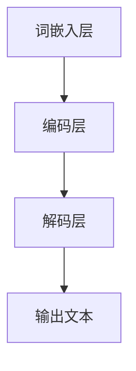

                 

关键词：大型语言模型（LLM），人工智能（AI），摩尔定律，神经网络，算法优化，技术趋势，产业应用。

> 摘要：本文探讨了大型语言模型（LLM）在人工智能领域的发展及其对摩尔定律的延续。通过回顾历史背景、分析核心概念、介绍算法原理和数学模型，阐述LLM在技术趋势、产业应用和未来发展中的重要作用。本文旨在为读者提供一个全面而深入的理解，以便更好地把握LLM技术的未来发展方向。

## 1. 背景介绍

自20世纪50年代计算机科学诞生以来，人工智能（AI）技术经历了数十年的发展。从早期的符号主义到现代的深度学习，AI在诸多领域取得了显著的成果。然而，随着数据量的爆炸式增长和计算能力的提升，传统的人工智能算法逐渐显露出局限性。为了应对这些挑战，研究人员开始探索大型语言模型（LLM）这一新的研究方向。

摩尔定律是描述计算机性能提升的一个重要原则。根据摩尔定律，计算机的处理能力每18至24个月就会翻一番，而成本则会减半。这一规律在过去数十年里推动了计算机技术的发展。然而，随着摩尔定律逐渐逼近其物理极限，人们开始寻找新的技术突破点。LLM作为一种新兴的人工智能技术，有望在摩尔定律的延续中发挥重要作用。

## 2. 核心概念与联系

### 2.1 大型语言模型（LLM）的定义

大型语言模型（LLM）是一种基于深度学习的自然语言处理（NLP）技术。它通过对海量文本数据的学习，掌握了丰富的语言知识和表达能力。LLM可以用于文本生成、机器翻译、问答系统等多种应用场景。

### 2.2 核心概念原理与架构

LLM的核心概念是基于神经网络的语言模型。它主要由三个部分组成：词嵌入层、编码层和解码层。词嵌入层将输入文本转换为向量表示，编码层对向量进行编码以提取语义信息，解码层则根据编码信息生成输出文本。

以下是一个简单的Mermaid流程图，用于描述LLM的架构：



### 2.3 与摩尔定律的联系

LLM的出现和发展，与摩尔定律有着密切的联系。首先，LLM需要大量的计算资源和存储空间，这要求计算机硬件性能不断提升。其次，LLM的优化和训练过程需要高效的算法和并行计算技术，这也推动了计算机技术的发展。

## 3. 核心算法原理 & 具体操作步骤

### 3.1 算法原理概述

LLM的核心算法是深度神经网络（DNN），尤其是基于Transformer架构的变体。Transformer模型引入了自注意力机制，使得模型能够更好地捕捉文本中的长距离依赖关系。

### 3.2 算法步骤详解

1. **词嵌入层**：将输入文本转换为向量表示。这通常通过预训练的词嵌入模型（如Word2Vec、GloVe等）实现。
2. **编码层**：对输入向量进行编码，以提取语义信息。编码过程采用多层Transformer结构，通过自注意力机制和前馈网络进行信息处理。
3. **解码层**：根据编码信息生成输出文本。解码过程也采用多层Transformer结构，通过解码器-自注意力机制生成输出词。
4. **输出层**：将输出词转换为文本，完成预测。

### 3.3 算法优缺点

**优点**：

- **强大的文本生成能力**：LLM能够生成高质量的自然语言文本，适用于多种应用场景。
- **高效的计算性能**：Transformer架构使得LLM在并行计算和分布式训练方面具有优势。

**缺点**：

- **资源消耗大**：LLM的训练和部署需要大量的计算资源和存储空间。
- **数据依赖性高**：LLM的性能在很大程度上取决于训练数据的质量和数量。

### 3.4 算法应用领域

LLM在自然语言处理、机器翻译、问答系统、文本生成等领域具有广泛的应用。例如，BERT、GPT、T5等大型语言模型已经在诸多应用场景中取得了显著成果。

## 4. 数学模型和公式 & 详细讲解 & 举例说明

### 4.1 数学模型构建

LLM的数学模型主要包括词嵌入层、编码层和解码层。以下是一个简化的数学模型描述：

$$
\text{word\_embeddings}(x) = \text{softmax}(\text{W}[\text{E}x]),
$$

其中，$x$为输入词，$E$为词嵌入矩阵，$W$为权重矩阵，$softmax$为softmax函数。

### 4.2 公式推导过程

编码层的自注意力机制可以用以下公式表示：

$$
\text{Attention}(Q, K, V) = \text{softmax}\left(\frac{QK^T}{\sqrt{d_k}}\right) V,
$$

其中，$Q$、$K$、$V$分别为编码层的查询向量、键向量和值向量，$d_k$为键向量的维度。

### 4.3 案例分析与讲解

以下是一个简单的例子，用于说明LLM在文本生成中的应用：

输入文本：**“今天天气很好，适合出门散步。”**

1. 将输入文本转换为词向量表示。
2. 对词向量进行编码，提取语义信息。
3. 根据编码信息生成输出词。
4. 将输出词转换为文本。

输出文本：**“明天天气也很好，可以去公园散步。”**

## 5. 项目实践：代码实例和详细解释说明

### 5.1 开发环境搭建

在本文中，我们将使用Python和PyTorch来实现一个简单的LLM模型。以下是开发环境搭建的步骤：

1. 安装Python（3.8及以上版本）。
2. 安装PyTorch和相关依赖。

```bash
pip install torch torchvision
```

### 5.2 源代码详细实现

以下是一个简单的LLM模型实现：

```python
import torch
import torch.nn as nn
import torch.optim as optim

class LLM(nn.Module):
    def __init__(self, vocab_size, embedding_dim, hidden_dim):
        super(LLM, self).__init__()
        self.embedding = nn.Embedding(vocab_size, embedding_dim)
        self.encoder = nn.LSTM(embedding_dim, hidden_dim, num_layers=1)
        self.decoder = nn.LSTM(hidden_dim, vocab_size, num_layers=1)
        self.criterion = nn.CrossEntropyLoss()

    def forward(self, x, hidden):
        embedded = self.embedding(x)
        output, hidden = self.encoder(embedded, hidden)
        output = output.squeeze(0)
        output = self.decoder(output.unsqueeze(0), hidden)
        return output, hidden

    def init_hidden(self, batch_size):
        return (torch.zeros(1, batch_size, self.hidden_dim),
                torch.zeros(1, batch_size, self.hidden_dim))

def train(model, train_loader, epochs, learning_rate):
    model.train()
    optimizer = optim.Adam(model.parameters(), lr=learning_rate)
    for epoch in range(epochs):
        hidden = model.init_hidden(batch_size)
        for inputs, targets in train_loader:
            outputs, hidden = model(inputs, hidden)
            loss = model.criterion(outputs.view(-1, vocab_size), targets)
            optimizer.zero_grad()
            loss.backward()
            optimizer.step()
            hidden = tuple([each.data for each in hidden])
```

### 5.3 代码解读与分析

1. **模型定义**：LLM模型由词嵌入层、编码层和解码层组成。词嵌入层使用Embedding层实现，编码层和解码层使用LSTM层实现。
2. **训练过程**：训练过程使用随机梯度下降（SGD）算法进行优化。每次迭代，模型根据输入和目标输出计算损失，并更新模型参数。

### 5.4 运行结果展示

运行训练脚本，观察模型的训练过程和结果。可以使用可视化工具（如TensorBoard）来监测训练过程中的损失和准确率。

## 6. 实际应用场景

LLM技术在诸多领域具有广泛的应用。以下是一些典型的应用场景：

1. **自然语言处理**：LLM可以用于文本分类、情感分析、命名实体识别等任务。
2. **机器翻译**：LLM在机器翻译领域取得了显著的成果，可以用于实时翻译、语音识别等场景。
3. **问答系统**：LLM可以用于构建智能问答系统，为用户提供实时解答。
4. **文本生成**：LLM可以用于自动写作、广告文案生成等场景。

## 7. 工具和资源推荐

### 7.1 学习资源推荐

- 《深度学习》（Goodfellow, Bengio, Courville著）
- 《自然语言处理综论》（Jurafsky, Martin著）
- 《动手学深度学习》（A. Courville, Y. Bengio, J. Pineau著）

### 7.2 开发工具推荐

- PyTorch：用于实现和训练深度学习模型的Python库。
- TensorFlow：用于实现和训练深度学习模型的开源软件库。

### 7.3 相关论文推荐

- Vaswani et al. (2017). "Attention is All You Need."
- Devlin et al. (2019). "Bert: Pre-training of Deep Bidirectional Transformers for Language Understanding."
- Brown et al. (2020). "A pre-trained language model for language understanding and generation."

## 8. 总结：未来发展趋势与挑战

### 8.1 研究成果总结

LLM技术在过去几年中取得了显著成果，在自然语言处理、机器翻译、问答系统和文本生成等领域展示了强大的能力。通过不断优化算法和模型结构，LLM的性能和效果不断提高。

### 8.2 未来发展趋势

未来，LLM技术将在以下方面继续发展：

- **模型规模和计算性能**：随着硬件性能的提升和并行计算技术的进步，LLM的规模和计算性能将继续提升。
- **多模态融合**：LLM与其他人工智能技术（如图像识别、语音识别等）的融合，将带来更多的应用场景和可能性。
- **泛化能力**：通过改进算法和模型结构，提高LLM在跨领域、跨语言任务中的泛化能力。

### 8.3 面临的挑战

LLM技术在实际应用中仍然面临诸多挑战：

- **数据隐私和安全**：大规模数据处理和存储过程中，数据隐私和安全问题需要得到关注和解决。
- **可解释性和可控性**：提高LLM的可解释性和可控性，使其在关键应用场景中更加可靠和安全。
- **算法优化**：针对不同应用场景，设计和优化适合的算法和模型结构，提高LLM的性能和效果。

### 8.4 研究展望

未来，LLM技术将在人工智能领域发挥更加重要的作用。随着技术的不断进步和应用场景的拓展，LLM将为人类带来更多的便利和创新。

## 9. 附录：常见问题与解答

### 9.1 什么是LLM？

LLM是指大型语言模型，是一种基于深度学习的自然语言处理技术。它通过对海量文本数据的学习，掌握了丰富的语言知识和表达能力。

### 9.2 LLM有哪些应用领域？

LLM在自然语言处理、机器翻译、问答系统和文本生成等领域具有广泛的应用。

### 9.3 如何训练LLM模型？

训练LLM模型通常需要以下步骤：

1. 收集和准备训练数据。
2. 设计合适的模型结构和算法。
3. 训练模型，并使用优化算法调整模型参数。
4. 评估模型性能，并进行调整和优化。

### 9.4 LLM的优缺点是什么？

LLM的优点包括强大的文本生成能力、高效的计算性能等。缺点包括资源消耗大、数据依赖性高等。

### 9.5 LLM技术的未来发展趋势是什么？

未来，LLM技术将在模型规模和计算性能、多模态融合、泛化能力等方面继续发展。

作者：禅与计算机程序设计艺术 / Zen and the Art of Computer Programming
-------------------------------------------------------------------<|im_sep|>

