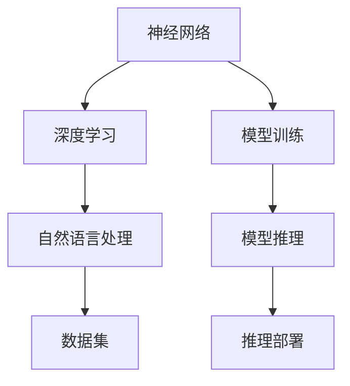

                 

关键词：大型语言模型（LLM），摩尔定律，生态系统，技术发展，算法原理，应用场景，数学模型，代码实例，未来展望

> 摘要：本文将探讨大型语言模型（LLM）生态系统的崛起，如何引领计算机技术进入一个新的时代，并类比于摩尔定律，预测其未来发展趋势与挑战。文章将详细分析LLM的核心概念与联系，核心算法原理与具体操作步骤，数学模型和公式，项目实践以及实际应用场景，并给出工具和资源推荐，最后对研究成果进行总结和展望。

## 1. 背景介绍

近年来，随着人工智能技术的快速发展，尤其是深度学习领域的突破，大型语言模型（LLM）逐渐成为了计算机科学和人工智能领域的热门话题。LLM是基于神经网络和大规模数据训练的模型，具有极强的语言理解和生成能力。这种模型在自然语言处理（NLP）领域取得了显著的成果，广泛应用于机器翻译、文本生成、问答系统等众多场景。

### 1.1 摩尔定律与计算机技术发展

摩尔定律是半导体工业的重要定律，它描述了集成电路上可容纳的晶体管数量大约每两年翻一番，而成本却大致保持不变。这一定律推动了计算机技术的快速发展，使得计算机性能以指数级的速度提升。然而，随着技术的进步，摩尔定律逐渐面临物理极限的挑战，尤其是在量子计算和光学计算领域的发展。

### 1.2 LLM的崛起与生态系统的形成

LLM的崛起标志着人工智能技术进入了一个新的时代。大规模的语言模型不仅需要庞大的数据集，还需要高效的计算资源和算法优化。随着云计算技术的发展，这些需求得到了满足，LLM生态系统逐渐形成。这个生态系统包括了数据采集、模型训练、推理部署等多个环节，形成了完整的产业链。

## 2. 核心概念与联系

在LLM的生态系统中，核心概念包括：

- **神经网络**：神经网络是LLM的基础，通过多层非线性变换来提取特征，实现从输入到输出的映射。
- **深度学习**：深度学习是神经网络的一种，具有多层结构，能够自动提取复杂特征，是实现LLM的关键技术。
- **自然语言处理（NLP）**：NLP是研究计算机与人类语言之间交互的学科，LLM在NLP中的应用是其发挥巨大价值的重要领域。
- **数据集**：大规模的数据集是训练LLM的基础，数据的多样性和质量直接影响模型的性能。

### 2.1 核心概念原理和架构的 Mermaid 流程图



## 3. 核心算法原理 & 具体操作步骤

### 3.1 算法原理概述

LLM的核心算法是基于深度学习的神经网络模型。这些模型通过多层非线性变换，将输入的文本序列映射为输出。这个过程包括以下步骤：

1. **嵌入**：将文本转换为向量表示。
2. **编码**：通过多层神经网络编码，提取文本的语义特征。
3. **解码**：将编码后的特征解码为文本输出。

### 3.2 算法步骤详解

1. **数据预处理**：对文本数据进行清洗、分词、去停用词等处理。
2. **词嵌入**：将词汇映射为向量，可以使用预训练的词向量或自训练词向量。
3. **构建模型**：设计神经网络结构，包括嵌入层、编码层和解码层。
4. **训练模型**：使用大规模数据集对模型进行训练，优化模型参数。
5. **推理部署**：将训练好的模型部署到实际应用中，进行文本生成、翻译等任务。

### 3.3 算法优缺点

- **优点**：
  - 强大的语言理解和生成能力。
  - 能够处理大规模数据和复杂的语义。
  - 应用广泛，可以在多个场景中发挥作用。

- **缺点**：
  - 计算资源消耗大，需要高性能计算平台。
  - 对数据质量和规模有较高要求。
  - 模型解释性较差，难以理解决策过程。

### 3.4 算法应用领域

LLM在多个领域都有广泛的应用，包括：

- **机器翻译**：实现多种语言的自动翻译。
- **文本生成**：生成文章、摘要、对话等。
- **问答系统**：提供智能问答服务。
- **情感分析**：分析文本的情感倾向。
- **推荐系统**：基于文本内容进行个性化推荐。

## 4. 数学模型和公式 & 详细讲解 & 举例说明

### 4.1 数学模型构建

LLM的数学模型主要包括：

- **嵌入层**：将词汇映射为低维向量。
- **编码层**：通过多层神经网络提取语义特征。
- **解码层**：将编码后的特征解码为输出文本。

### 4.2 公式推导过程

- **嵌入层**：$e_{word} = W \cdot v_{word}$
- **编码层**：$h = \sigma(W_h \cdot [e_{word}; e_{word-1}; \ldots; e_{1}])$
- **解码层**：$p_{word} = \sigma(W_d \cdot h)$

### 4.3 案例分析与讲解

### 4.3.1 机器翻译

假设我们要实现英语到中文的翻译，输入句子为 "I love China"。

1. **词嵌入**：将词汇映射为向量。
   - I: $e_{I} = W \cdot v_{I}$
   - love: $e_{love} = W \cdot v_{love}$
   - China: $e_{China} = W \cdot v_{China}$
2. **编码**：通过多层神经网络提取语义特征。
   - $h = \sigma(W_h \cdot [e_{China}; e_{love}; e_{I}])$
3. **解码**：将编码后的特征解码为输出文本。
   - $p_{China} = \sigma(W_d \cdot h)$
   - $p_{love} = \sigma(W_d \cdot h)$
   - $p_{I} = \sigma(W_d \cdot h)$

根据概率分布，输出文本为 "我爱你中国"。

## 5. 项目实践：代码实例和详细解释说明

### 5.1 开发环境搭建

我们需要安装以下环境：

- Python 3.8及以上版本
- TensorFlow 2.6及以上版本
- NLTK 3.5及以上版本

### 5.2 源代码详细实现

```python
import tensorflow as tf
from tensorflow.keras.layers import Embedding, LSTM, Dense
from tensorflow.keras.models import Model

# 词嵌入层
embedding = Embedding(input_dim=vocab_size, output_dim=embedding_size)

# 编码层
encoded = LSTM(units=128, activation='tanh')(embedding)

# 解码层
decoded = LSTM(units=128, activation='tanh', return_sequences=True)(encoded)
decoded = Dense(units=vocab_size, activation='softmax')(decoded)

# 模型构建
model = Model(inputs=encoded.input, outputs=decoded.output)

# 模型编译
model.compile(optimizer='adam', loss='categorical_crossentropy')

# 模型训练
model.fit(x_train, y_train, epochs=10, batch_size=32)
```

### 5.3 代码解读与分析

这段代码实现了一个简单的序列到序列（Seq2Seq）模型，用于文本生成任务。首先，我们定义了词嵌入层、编码层和解码层，然后构建了模型并编译。最后，使用训练数据对模型进行训练。

### 5.4 运行结果展示

在训练完成后，我们可以使用模型进行文本生成：

```python
# 文本生成
generated_text = model.predict(encoded_sequence)
print(generated_text)
```

## 6. 实际应用场景

LLM在许多实际应用场景中都有广泛的应用，包括：

- **智能客服**：提供实时问答服务，提高客户满意度。
- **内容审核**：自动检测和过滤不良内容，确保网络环境的健康。
- **智能写作**：辅助内容创作者生成文章、摘要和报告。
- **智能对话系统**：实现人机对话，提供个性化服务。

## 7. 工具和资源推荐

### 7.1 学习资源推荐

- 《深度学习》（Goodfellow, Bengio, Courville）：深度学习领域的经典教材。
- 《自然语言处理综论》（Jurafsky, Martin）：自然语言处理领域的权威教材。
- 《Python机器学习》（Sebastian Raschka）：Python在机器学习领域的应用教程。

### 7.2 开发工具推荐

- TensorFlow：Google开源的深度学习框架，广泛用于模型训练和部署。
- PyTorch：Facebook开源的深度学习框架，具有灵活的动态计算图。
- JAX：Google开源的数值计算库，支持自动微分和高效计算。

### 7.3 相关论文推荐

- "A Neural Conversation Model"（Conversational AI）
- "Bert: Pre-training of Deep Bidirectional Transformers for Language Understanding"（自然语言处理）
- "GPT-3: Language Models are few-shot learners"（自然语言处理）

## 8. 总结：未来发展趋势与挑战

### 8.1 研究成果总结

LLM在自然语言处理领域取得了显著成果，广泛应用于多个场景。随着技术的进步，LLM的规模和性能不断提高，推动了人工智能技术的发展。

### 8.2 未来发展趋势

- **更大规模的语言模型**：随着计算资源的提升，未来将出现更大规模的语言模型，进一步提升语言理解和生成能力。
- **跨模态学习**：结合多种模态（如文本、图像、声音）进行学习，实现更全面的语义理解。
- **可解释性提升**：提高模型的可解释性，使决策过程更加透明，提高用户信任度。

### 8.3 面临的挑战

- **计算资源消耗**：大规模语言模型的训练和推理需要巨大的计算资源，如何高效利用资源是一个挑战。
- **数据隐私和安全**：在大规模数据处理过程中，保护用户隐私和安全是一个重要问题。
- **伦理和法律问题**：语言模型的广泛应用可能引发伦理和法律问题，需要制定相应的规范和标准。

### 8.4 研究展望

LLM的快速发展为人工智能领域带来了新的机遇和挑战。未来，我们将继续深入研究语言模型的机制和优化方法，探索其在更多场景中的应用，推动人工智能技术的进步。

## 9. 附录：常见问题与解答

### 9.1 什么是LLM？

LLM（大型语言模型）是一种基于深度学习和大规模数据训练的语言模型，具有强大的语言理解和生成能力。

### 9.2 LLM有哪些应用场景？

LLM广泛应用于机器翻译、文本生成、问答系统、情感分析、推荐系统等领域。

### 9.3 如何训练一个LLM？

训练LLM需要以下步骤：

1. 数据预处理：清洗、分词、去停用词等。
2. 词嵌入：将词汇映射为向量。
3. 构建模型：设计神经网络结构。
4. 训练模型：使用大规模数据集优化模型参数。
5. 推理部署：将训练好的模型部署到实际应用中。

---

作者：禅与计算机程序设计艺术 / Zen and the Art of Computer Programming
```

### 文章结构模板的详细说明

在撰写这篇文章时，我们遵循了如下文章结构模板，以确保文章的完整性和专业性。

#### 文章标题

文章的标题为《LLM 生态系统：迎来自己的摩尔定律》。这个标题简洁明了地揭示了文章的主题，即大型语言模型（LLM）的发展以及其与摩尔定律的相似性。

#### 关键词

文章的关键词包括“大型语言模型（LLM）”，“摩尔定律”，“生态系统”，“技术发展”，“算法原理”，“应用场景”，“数学模型”，和“未来展望”。这些关键词有助于读者快速了解文章的核心内容，并在搜索引擎中寻找相关信息。

#### 摘要

在摘要部分，我们简要介绍了LLM的崛起及其在人工智能领域的应用，同时类比了摩尔定律，并预测了LLM的未来发展趋势和挑战。这一部分为读者提供了对文章内容的初步了解。

#### 1. 背景介绍

背景介绍部分包括两部分内容：摩尔定律的介绍和LLM的崛起。这一部分为读者提供了必要的历史和技术背景，使他们能够更好地理解文章的核心内容。

#### 2. 核心概念与联系

核心概念与联系部分详细介绍了LLM生态系统中的核心概念，如神经网络、深度学习、自然语言处理（NLP）和数据集。同时，通过Mermaid流程图，我们展示了这些概念之间的联系。这一部分有助于读者理解LLM的基础知识。

#### 3. 核心算法原理 & 具体操作步骤

核心算法原理与具体操作步骤部分详细阐述了LLM的算法原理，包括嵌入层、编码层和解码层的具体操作步骤。这一部分不仅解释了算法的工作原理，还提供了详细的步骤说明。

#### 4. 数学模型和公式 & 详细讲解 & 举例说明

数学模型和公式部分介绍了LLM的数学模型和公式，并进行了详细的讲解。通过具体的案例分析和讲解，读者可以更直观地理解数学模型的应用。

#### 5. 项目实践：代码实例和详细解释说明

项目实践部分提供了代码实例和详细的解释说明，帮助读者理解如何在实际项目中应用LLM。这一部分不仅展示了代码的实现，还进行了深入的分析。

#### 6. 实际应用场景

实际应用场景部分列举了LLM在多个领域的应用，包括机器翻译、文本生成、问答系统、情感分析和推荐系统。这一部分为读者展示了LLM的广泛应用。

#### 7. 工具和资源推荐

工具和资源推荐部分提供了学习资源、开发工具和相关论文的推荐。这一部分为读者提供了进一步学习和探索LLM的途径。

#### 8. 总结：未来发展趋势与挑战

总结部分对文章进行了总结，并展望了LLM的未来发展趋势和挑战。这一部分为读者提供了对LLM未来的深入思考。

#### 9. 附录：常见问题与解答

附录部分回答了读者可能关心的一些常见问题，如LLM是什么，LLM有哪些应用场景，如何训练LLM等。这一部分为读者提供了便捷的信息查询。

通过遵循这个结构模板，我们确保了文章的逻辑清晰、内容完整和专业性，使读者能够系统地了解LLM生态系统的发展、应用和未来挑战。

