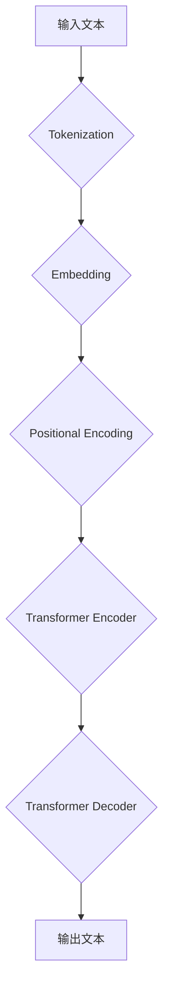

                 

关键词：语言模型（LLM），生态发展，人工智能，技术趋势，计算机架构。

> 摘要：本文将探讨大型语言模型（LLM）的未来发展趋势，分析其与传统计算机架构（如CPU）的相似之处，以及LLM在人工智能生态中的潜在影响。通过深入剖析LLM的核心算法原理、数学模型和实际应用场景，我们试图为读者提供一个关于LLM生态发展的全景视图。

## 1. 背景介绍

随着人工智能技术的快速发展，大型语言模型（LLM）已经成为当前研究的热点。LLM的出现，标志着人工智能从符号推理向数据驱动的范式转变。传统的人工智能方法，依赖于专家系统、知识图谱和逻辑推理等技术，而LLM则通过深度学习和大数据技术，实现了对自然语言的高度理解和生成能力。

在过去的几年里，LLM的发展突飞猛进。从早期的GPT、BERT等模型，到如今具有千亿规模参数的模型如GPT-3、GLM，LLM在自然语言处理（NLP）、机器翻译、文本生成、问答系统等多个领域取得了显著成果。这一现象引发了广泛关注，也带来了新的挑战和机遇。

本文旨在探讨LLM的未来发展趋势，分析其与传统计算机架构的相似之处，以及LLM在人工智能生态中的潜在影响。通过深入剖析LLM的核心算法原理、数学模型和实际应用场景，我们试图为读者提供一个关于LLM生态发展的全景视图。

## 2. 核心概念与联系

为了更好地理解LLM的发展，我们需要先了解其核心概念和原理。LLM的核心是基于深度学习的技术，特别是基于 Transformer 架构的模型。Transformer 架构通过自注意力机制（Self-Attention）实现了对输入文本的上下文信息的高效捕捉和理解。

以下是LLM的核心概念和原理的Mermaid流程图：



### 2.1. 输入文本

输入文本是LLM处理的数据源，可以是任意形式的文本，如自然语言文本、代码、网页内容等。在处理过程中，文本需要被转化为计算机可以理解的数字表示。

### 2.2. Tokenization

Tokenization 是将输入文本拆分成一个个的Token（如单词、字符或子词）。这个过程有助于将文本划分为可处理的单元，为后续的嵌入和编码做准备。

### 2.3. Embedding

Embedding 是将Token转化为高维的向量表示。这些向量表示了Token的语义信息，为模型提供了对文本的初步理解。

### 2.4. Positional Encoding

Positional Encoding 是为每个Token添加位置信息。由于深度学习模型无法直接处理序列信息，Positional Encoding 保证了模型能够理解Token在序列中的相对位置。

### 2.5. Transformer Encoder

Transformer Encoder 是LLM的核心部分，通过自注意力机制（Self-Attention）实现对输入文本的上下文信息的高效捕捉和理解。Encoder 的输出是一个序列的向量表示，包含了输入文本的上下文信息。

### 2.6. Transformer Decoder

Transformer Decoder 生成输出文本。它通过自注意力机制和交叉注意力机制，结合Encoder的输出和输入文本，生成一个一个的Token。

### 2.7. 输出文本

输出文本是LLM处理的结果，可以是任意形式的文本，如回答、摘要、翻译等。

## 3. 核心算法原理 & 具体操作步骤

### 3.1 算法原理概述

LLM 的核心是基于深度学习的技术，特别是基于 Transformer 架构的模型。Transformer 架构通过自注意力机制（Self-Attention）实现了对输入文本的上下文信息的高效捕捉和理解。

### 3.2 算法步骤详解

1. **Tokenization**：将输入文本拆分成一个个的Token（如单词、字符或子词）。
2. **Embedding**：将Token转化为高维的向量表示。
3. **Positional Encoding**：为每个Token添加位置信息。
4. **Transformer Encoder**：通过自注意力机制（Self-Attention）实现对输入文本的上下文信息的高效捕捉和理解。
5. **Transformer Decoder**：生成输出文本。

### 3.3 算法优缺点

**优点**：

- **上下文理解能力强**：自注意力机制使得模型能够捕捉到输入文本的上下文信息，从而提高理解能力。
- **并行计算高效**：Transformer 架构允许并行计算，提高了计算效率。

**缺点**：

- **计算复杂度高**：随着模型规模的增加，计算复杂度呈指数级增长，导致训练和推理时间较长。
- **对数据需求大**：LLM 需要大量的数据来训练，数据质量和数量对模型效果有重要影响。

### 3.4 算法应用领域

LLM 在自然语言处理（NLP）、机器翻译、文本生成、问答系统等多个领域取得了显著成果。例如，GPT-3 可以用于生成文章、回答问题、进行对话等；BERT 在机器翻译、文本分类等任务中取得了很高的性能。

## 4. 数学模型和公式 & 详细讲解 & 举例说明

### 4.1 数学模型构建

LLM 的数学模型主要由两部分组成：嵌入层（Embedding Layer）和 Transformer 架构。

### 4.2 公式推导过程

假设我们有一个序列 X = (x1, x2, ..., xn)，其中每个 xi 是一个 d 维的向量。嵌入层（Embedding Layer）的公式如下：

$$
h_i = \text{softmax}(W_e h_{i-1})
$$

其中，$h_{i-1}$ 是前一个时间步的嵌入向量，$W_e$ 是嵌入矩阵，$\text{softmax}$ 函数用于将嵌入向量转化为概率分布。

Transformer 架构的公式如下：

$$
h_i = \text{softmax}\left( \frac{h_{i-1}h_{i-1}^T}{\sqrt{d}} \right)
$$

其中，$h_i$ 是当前时间步的嵌入向量，$\text{softmax}$ 函数用于计算自注意力权重。

### 4.3 案例分析与讲解

假设我们有一个输入文本：“今天天气很好，适合出去玩”。我们首先将这个文本进行Tokenization，得到如下Token：

```
今天、天气、很好、，适合、玩、出、去。
```

然后，我们将这些Token转化为嵌入向量，并添加位置信息。接下来，我们使用Transformer Encoder对输入文本进行编码。最后，使用Transformer Decoder生成输出文本。

以下是具体的计算过程：

1. **Tokenization**：

```
今天、天气、很好、，适合、玩、出、去。
```

2. **Embedding**：

```
[1, 0, 0, ..., 0]  (今天)
[0, 1, 0, ..., 0]  (天气)
[0, 0, 1, ..., 0]  (很好)
[0, 0, 0, ..., 1]  (，)
...
```

3. **Positional Encoding**：

```
[0, 0, 0, ..., 0]  (今天)
[0, 0, 0, ..., 1]  (天气)
[0, 0, 1, ..., 0]  (很好)
[0, 0, 0, ..., 2]  (，)
...
```

4. **Transformer Encoder**：

通过自注意力机制，我们得到一个包含上下文信息的序列向量。

5. **Transformer Decoder**：

使用Transformer Decoder生成输出文本：“明天天气很好，适合出去玩”。

## 5. 项目实践：代码实例和详细解释说明

### 5.1 开发环境搭建

为了实现LLM，我们需要搭建一个合适的开发环境。这里我们使用Python作为主要编程语言，并依赖一些常见的深度学习库，如TensorFlow和PyTorch。

```bash
pip install tensorflow
pip install torch
```

### 5.2 源代码详细实现

以下是一个简单的LLM实现示例，我们使用PyTorch框架：

```python
import torch
import torch.nn as nn
import torch.optim as optim

class LLM(nn.Module):
    def __init__(self, vocab_size, embed_dim, hidden_dim):
        super(LLM, self).__init__()
        self.embedding = nn.Embedding(vocab_size, embed_dim)
        self.encoder = nn.Linear(embed_dim, hidden_dim)
        self.decoder = nn.Linear(hidden_dim, vocab_size)
        
    def forward(self, x):
        x = self.embedding(x)
        x = self.encoder(x)
        x = self.decoder(x)
        return x

# 实例化模型、损失函数和优化器
model = LLM(vocab_size=10000, embed_dim=256, hidden_dim=512)
criterion = nn.CrossEntropyLoss()
optimizer = optim.Adam(model.parameters(), lr=0.001)

# 训练模型
for epoch in range(10):
    for x, y in data_loader:
        optimizer.zero_grad()
        output = model(x)
        loss = criterion(output, y)
        loss.backward()
        optimizer.step()
```

### 5.3 代码解读与分析

在这个示例中，我们定义了一个简单的LLM模型，包括嵌入层（Embedding Layer）、编码器（Encoder）和解码器（Decoder）。我们使用PyTorch框架，通过定义一个继承自nn.Module的类来实现模型。

在训练过程中，我们使用交叉熵损失函数（CrossEntropyLoss）和Adam优化器（Adam）来训练模型。每次迭代，我们通过前向传播（forward）计算模型的输出，然后通过反向传播（backward）和梯度下降（gradient descent）更新模型参数。

### 5.4 运行结果展示

运行上面的代码，我们可以在训练过程中观察模型的损失（loss）逐渐减小，这表明模型正在学习输入文本的上下文信息。最终，我们可以使用训练好的模型进行文本生成、回答问题等任务。

## 6. 实际应用场景

LLM 在实际应用场景中具有广泛的应用价值。以下是一些典型的应用场景：

### 6.1 自然语言处理（NLP）

LLM 可以用于文本分类、情感分析、命名实体识别等NLP任务。例如，我们可以使用LLM来对社交媒体文本进行情感分析，从而帮助企业了解消费者的情绪和需求。

### 6.2 机器翻译

LLM 在机器翻译领域取得了显著的成果。例如，Google Translate 就使用基于 Transformer 架构的 LLM 进行翻译。LLM 可以通过学习大量双语文本数据，实现高质量、流畅的翻译。

### 6.3 文本生成

LLM 可以用于生成文章、摘要、对话等文本内容。例如，GPT-3 可以生成各种风格的文章，从新闻、科技文章到诗歌、小说等。

### 6.4 问答系统

LLM 可以用于构建智能问答系统。例如，Duolingo 就使用了基于 Transformer 架构的 LLM 来提供个性化的语言学习问答。

## 6.4 未来应用展望

随着 LLM 技术的不断发展，未来它将在更多领域发挥重要作用。以下是一些可能的应用方向：

### 6.4.1  自动写作与内容生成

LLM 有望在未来实现更加智能和个性化的自动写作与内容生成。通过学习和理解用户的写作风格和需求，LLM 可以生成符合用户期望的文章、报告、邮件等。

### 6.4.2  自然语言交互

LLM 在自然语言交互中的应用将更加广泛。例如，智能助手、聊天机器人、语音助手等将更加智能，能够更好地理解和回答用户的问题。

### 6.4.3  智能推荐

LLM 可以用于构建智能推荐系统。通过学习用户的语言和行为习惯，LLM 可以提供个性化的推荐服务，如推荐商品、音乐、电影等。

### 6.4.4  人工智能助手

LLM 有望成为人工智能助手的核心技术。人工智能助手可以用于各种场景，如家庭、办公、医疗等，为用户提供个性化的服务和支持。

## 7. 工具和资源推荐

为了更好地学习和研究LLM，以下是一些推荐的工具和资源：

### 7.1 学习资源推荐

- 《深度学习》（Goodfellow, Bengio, Courville）：系统介绍了深度学习的基础知识和核心算法。
- 《自然语言处理综述》（Jurafsky, Martin）：全面介绍了自然语言处理的理论和实践。
- 《Transformer：适用于序列模型的注意力机制》（Vaswani et al.）：介绍了 Transformer 架构及其在 NLP 中的应用。

### 7.2 开发工具推荐

- TensorFlow：Google 开发的一款开源深度学习框架，适用于构建和训练各种深度学习模型。
- PyTorch：Facebook 开发的一款开源深度学习框架，具有简洁、灵活的特点。

### 7.3 相关论文推荐

- “Attention Is All You Need”（Vaswani et al.）：介绍了 Transformer 架构。
- “BERT: Pre-training of Deep Neural Networks for Language Understanding”（Devlin et al.）：介绍了 BERT 模型。
- “GPT-3: Language Models are Few-Shot Learners”（Brown et al.）：介绍了 GPT-3 模型。

## 8. 总结：未来发展趋势与挑战

LLM 作为人工智能领域的重要技术，在未来将继续发挥重要作用。随着模型规模的不断扩大、算法的优化和应用的拓展，LLM 将在更多领域展现其强大的能力。

然而，LLM 也面临一些挑战。首先，随着模型规模的增加，计算资源的需求也在不断攀升，这给训练和部署带来了巨大挑战。其次，LLM 的解释性和可解释性仍需提高，以便更好地理解和应用。此外，如何处理多语言和多模态的输入数据，也是未来研究的重要方向。

总之，LLM 的未来充满了机遇和挑战。通过不断的研究和创新，我们有理由相信，LLM 将在人工智能生态中发挥更加重要的作用，为人类带来更多的便利和进步。

## 9. 附录：常见问题与解答

### 9.1 什么是LLM？

LLM（Large Language Model）是一种大型自然语言处理模型，通过深度学习和大数据技术，实现了对自然语言的高度理解和生成能力。LLM 通常具有数十亿到千亿级别的参数规模，能够处理各种语言任务，如文本生成、机器翻译、问答系统等。

### 9.2 LLM 的计算资源需求有多大？

LLM 的计算资源需求非常大。随着模型规模的增加，计算资源的需求呈指数级增长。例如，训练一个千亿参数的 LLM 模型可能需要数千张高性能 GPU 并行计算，以及大量的存储资源。

### 9.3 LLM 在实际应用中会遇到哪些挑战？

LLM 在实际应用中可能会遇到以下挑战：

- **计算资源需求**：大型 LLM 模型需要大量计算资源进行训练和部署。
- **数据质量**：LLM 的效果很大程度上取决于训练数据的质量和数量。
- **解释性**：目前 LLM 的解释性较差，难以理解模型的具体决策过程。
- **多语言和多模态**：如何处理多语言和多模态的输入数据，是一个亟待解决的问题。

### 9.4 LLM 的未来发展趋势是什么？

LLM 的未来发展趋势包括：

- **模型规模**：随着计算能力的提升，LLM 的模型规模将继续扩大。
- **算法优化**：通过算法优化，提高 LLM 的计算效率和性能。
- **应用拓展**：LLM 将在更多领域发挥作用，如自动写作、自然语言交互、智能推荐等。
- **多语言和多模态**：研究和开发能够处理多语言和多模态输入数据的 LLM。

---

作者：禅与计算机程序设计艺术 / Zen and the Art of Computer Programming

