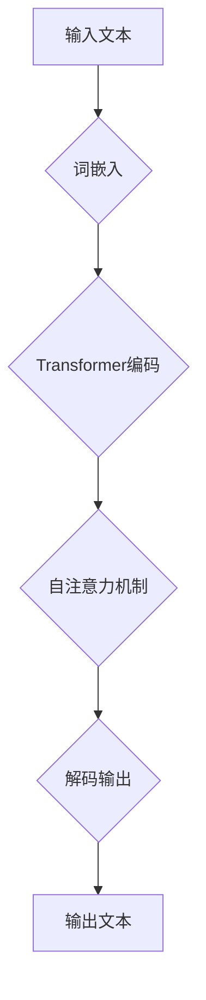

                 

### 摘要 Summary

本文探讨了大型语言模型（LLM）的出现和广泛应用对社会、经济和就业领域产生的深远影响。通过深入分析，我们揭示了LLM如何改变了信息处理的方式、重塑了工作环境和驱动了经济模式转型。文章从背景介绍、核心概念、算法原理、数学模型、项目实践、应用场景、未来展望、工具和资源推荐以及总结与展望等八个方面，详细探讨了LLM的社会影响。我们不仅探讨了LLM的优势和潜力，也提出了当前面临的主要挑战和未来研究的方向。通过本文，读者将全面了解LLM对社会各个层面的深远影响，并思考其在未来可能扮演的关键角色。

## 1. 背景介绍 Background

大型语言模型（LLM）的兴起是人工智能领域的重要里程碑。随着计算能力的提升、数据的丰富以及深度学习技术的进步，LLM在过去几年中取得了惊人的发展。早期的人工智能系统主要基于规则和统计方法，而深度学习技术的引入使得模型能够从海量数据中自动学习，从而实现了更高效、更准确的文本生成和理解能力。

LLM的发展可以追溯到2018年，当时谷歌推出了BERT（Bidirectional Encoder Representations from Transformers），这是一个基于Transformer架构的双向编码器模型，显著提升了自然语言处理（NLP）任务的性能。随后，GPT-3（Generative Pre-trained Transformer 3）的发布进一步推动了LLM的发展，使其在文本生成、机器翻译、问答系统等多个领域表现出色。

LLM的应用场景非常广泛，从智能客服、内容生成、推荐系统到自动驾驶、医疗诊断等，都离不开LLM的支持。尤其是在生成式AI方面，LLM能够生成高质量的文本、图像和音频，为创意工作和自动化任务提供了强大的工具。

然而，随着LLM的广泛应用，其对社会、经济和就业领域的影响也日益显著。一方面，LLM的强大能力使得许多传统工作面临被替代的风险，另一方面，它也创造了新的工作机会，推动了产业升级和经济转型。因此，深入探讨LLM的社会影响具有重要的现实意义。

本文将从以下几个方面展开讨论：

1. **背景介绍**：回顾LLM的发展历程和应用场景。
2. **核心概念与联系**：分析LLM的核心概念、原理和架构。
3. **核心算法原理 & 具体操作步骤**：详细介绍LLM的算法原理和操作步骤。
4. **数学模型和公式 & 详细讲解 & 举例说明**：探讨LLM所涉及的数学模型和公式。
5. **项目实践：代码实例和详细解释说明**：通过实际项目展示LLM的应用。
6. **实际应用场景**：分析LLM在不同领域的应用。
7. **未来应用展望**：展望LLM未来的发展趋势和应用前景。
8. **工具和资源推荐**：推荐学习LLM的工具和资源。
9. **总结与展望**：总结研究成果，探讨未来挑战和方向。

通过本文的探讨，我们希望能够为读者提供全面的视角，了解LLM的社会影响，并思考其未来的发展方向。

## 2. 核心概念与联系 Core Concepts and Relationships

### 2.1 大型语言模型（LLM）

**定义**：大型语言模型（LLM）是一种基于深度学习的自然语言处理模型，通过学习海量文本数据，能够生成和理解人类语言。LLM的核心目的是实现高质量的自然语言生成和理解，从而在多个领域提供自动化解决方案。

**核心组成部分**：
- **词嵌入（Word Embeddings）**：将单词映射到高维向量空间，便于模型理解和处理。
- **Transformer架构**：一种基于自注意力机制的模型架构，能够捕捉文本中的长距离依赖关系。
- **预训练（Pre-training）**：在大量未标注的文本数据上进行训练，使模型具备通用语言理解能力。
- **微调（Fine-tuning）**：在特定任务上对模型进行微调，以适应具体的应用场景。

### 2.2 自然语言生成（NLG）

**定义**：自然语言生成（NLG）是一种技术，通过模型自动生成人类可读的自然语言文本。NLG广泛应用于内容生成、聊天机器人、自动摘要等场景。

**核心过程**：
1. **文本编码**：将输入的文本转换为模型可以处理的向量表示。
2. **生成文本**：模型基于编码后的文本生成新的文本序列。
3. **文本解码**：将生成的向量表示转换回人类可读的文本。

### 2.3 自然语言理解（NLU）

**定义**：自然语言理解（NLU）是指模型理解和解释人类语言的过程，包括语义理解、意图识别、实体识别等。

**核心过程**：
1. **文本编码**：将输入文本转换为模型理解的向量表示。
2. **特征提取**：从编码后的文本中提取关键特征，如词性、依存关系等。
3. **语义理解**：基于提取的特征，模型对输入文本进行语义分析，理解其含义。

### 2.4 计算机视觉（CV）

**定义**：计算机视觉（CV）是人工智能的一个重要分支，旨在使计算机能够像人类一样理解和解释视觉信息，包括图像识别、目标检测、图像生成等。

**核心组成部分**：
- **卷积神经网络（CNN）**：用于图像识别和处理的深度学习模型。
- **生成对抗网络（GAN）**：用于生成逼真图像的技术。
- **深度强化学习（DRL）**：结合深度学习和强化学习，实现自主视觉系统的技术。

### 2.5 机器翻译（MT）

**定义**：机器翻译（MT）是指通过计算机程序将一种语言的文本翻译成另一种语言的过程。机器翻译广泛应用于跨国交流和全球化业务。

**核心过程**：
1. **文本编码**：将输入文本转换为模型可以处理的向量表示。
2. **翻译模型**：利用训练好的模型，将源语言文本转换为目标语言文本。
3. **文本解码**：将生成的向量表示转换回目标语言的文本。

### 2.6 人工智能伦理（AI Ethics）

**定义**：人工智能伦理是指研究人工智能系统对社会、人类以及环境影响的伦理问题和道德规范。

**核心关注点**：
- **透明度和可解释性**：确保人工智能系统的决策过程透明和可解释。
- **隐私保护**：确保个人隐私不被侵犯。
- **公平性和无偏见**：避免人工智能系统产生歧视和不公平的结果。
- **责任归属**：明确人工智能系统的责任归属和责任承担。

### 2.7 Mermaid 流程图

为了更好地理解LLM的核心概念和架构，下面使用Mermaid语言绘制一个流程图，展示LLM的工作流程。



**图 1. LLM 的核心概念与联系流程图**

在这个流程图中，输入文本经过词嵌入转换为向量表示，然后通过Transformer编码器进行自注意力处理，最终解码为输出文本。这个流程图清晰地展示了LLM从输入到输出的整个过程，帮助我们更好地理解LLM的工作原理和架构。

通过上述核心概念与联系的分析，我们为接下来的算法原理、数学模型和项目实践奠定了坚实的基础。在接下来的部分，我们将进一步深入探讨LLM的具体算法原理和操作步骤。

## 3. 核心算法原理 & 具体操作步骤 Core Algorithm Principles & Detailed Steps

### 3.1 算法原理概述

大型语言模型（LLM）的核心原理基于深度学习和自然语言处理（NLP）领域的最新进展。LLM通常采用Transformer架构，这是一种基于自注意力机制的模型，能够有效捕捉文本中的长距离依赖关系。以下是LLM的基本原理和具体操作步骤：

#### 3.1.1 Transformer架构

Transformer架构由Vaswani等人在2017年提出，是基于自注意力机制的序列到序列模型。与传统的循环神经网络（RNN）和长短期记忆网络（LSTM）相比，Transformer具有以下优点：

- **并行处理**：Transformer通过多头自注意力机制，能够并行处理输入序列，从而提高了计算效率。
- **捕捉长距离依赖**：自注意力机制使得模型能够全局关注输入序列中的每一个词，从而捕捉长距离依赖关系。
- **减少梯度消失和梯度爆炸**：Transformer使用了一个称为“多头自注意力”的机制，可以减少在训练过程中出现的梯度消失和梯度爆炸问题。

#### 3.1.2 词嵌入

词嵌入是LLM的基础，通过将单词映射到高维向量空间，使模型能够理解和处理文本。词嵌入通常使用预训练的词向量模型，如Word2Vec、GloVe等，这些模型将每个单词映射到一个固定长度的向量。

#### 3.1.3 预训练和微调

预训练是指使用大量的未标注文本数据对模型进行训练，使其具备通用的语言理解能力。预训练完成后，模型可以用于特定任务上的微调，即在特定任务上使用少量标注数据进行进一步训练，以适应具体的应用场景。

### 3.2 算法步骤详解

LLM的工作流程主要包括以下步骤：

#### 3.2.1 输入文本编码

输入文本经过分词处理后，每个单词被映射到一个词嵌入向量。这些词嵌入向量组成一个输入序列，作为模型处理的输入。

#### 3.2.2 Transformer编码

输入序列经过嵌入层处理后，进入Transformer编码器。编码器由多个编码层堆叠而成，每个编码层包括多头自注意力机制和前馈神经网络。

1. **多头自注意力机制**：在每个编码层，输入序列的每个词都与其他词进行自注意力计算，生成一个加权向量。这个过程称为自注意力。多头自注意力机制将自注意力计算分解为多个头，每个头关注不同的信息，从而提高了模型的表示能力。
   
2. **前馈神经网络**：在每个编码层的自注意力之后，输入序列通过一个前馈神经网络进行处理，该网络由两个全连接层组成，分别带有ReLU激活函数和线性激活函数。

3. **层归一化和残差连接**：在每个编码层，输入序列首先通过层归一化（Layer Normalization）进行处理，然后与输入序列的残差连接（Residual Connection）相加，以防止梯度消失问题。

#### 3.2.3 解码输出

编码器的输出经过解码器进行解码，解码器的工作原理与编码器类似，但反向处理输入序列。解码器的输出是一个连续的文本序列，经过Softmax函数处理后，得到每个单词的概率分布。根据概率分布，模型选择最有可能的单词作为输出，然后将其添加到输出序列中。

#### 3.2.4 微调

在特定任务上，LLM通过微调来适应具体的应用场景。微调过程包括以下步骤：

1. **数据准备**：收集并清洗特定任务上的标注数据。
2. **模型初始化**：初始化预训练的LLM模型。
3. **训练**：使用标注数据对模型进行训练，优化模型参数。
4. **评估**：在测试集上评估模型性能，调整模型参数。

### 3.3 算法优缺点

#### 3.3.1 优点

- **强大的语言理解能力**：LLM通过预训练和微调，能够理解并生成高质量的自然语言文本。
- **并行处理**：Transformer架构允许模型并行处理输入序列，提高了计算效率。
- **灵活性和适应性**：LLM可以在多个任务上应用，只需进行微调即可适应不同场景。

#### 3.3.2 缺点

- **计算资源消耗**：预训练LLM需要大量的计算资源和时间，训练过程非常耗时。
- **解释性不足**：由于LLM的复杂性和黑盒性质，其决策过程难以解释和理解。
- **数据依赖性**：LLM的性能很大程度上取决于训练数据的质量和多样性，数据质量问题可能导致模型产生错误的结果。

### 3.4 算法应用领域

LLM的应用领域非常广泛，包括但不限于以下几个方面：

- **文本生成**：如文章撰写、摘要生成、对话生成等。
- **机器翻译**：如多语言翻译、机器翻译辅助工具等。
- **问答系统**：如智能客服、知识问答等。
- **推荐系统**：如基于内容的推荐、基于协同过滤的推荐等。
- **图像生成**：如图像到图像的转换、图像风格迁移等。

通过上述对LLM算法原理和具体操作步骤的详细分析，我们可以看到LLM作为一种强大的自然语言处理工具，其在各个领域的应用前景广阔。在接下来的部分，我们将探讨LLM所涉及的数学模型和公式。

## 4. 数学模型和公式 Mathematical Models and Formulas

### 4.1 数学模型构建

大型语言模型（LLM）的核心是基于深度学习和自然语言处理的数学模型。这些模型通过复杂的数学公式和算法来实现对文本数据的理解和生成。以下是LLM中涉及的一些关键数学模型和公式：

#### 4.1.1 词嵌入（Word Embeddings）

词嵌入是将单词映射到高维向量空间的过程。常用的词嵌入模型包括Word2Vec和GloVe。Word2Vec模型基于神经网络，通过训练优化词向量使其具有语义意义。GloVe模型则基于矩阵分解，通过计算词与词之间的共现矩阵来生成词向量。

**Word2Vec模型**：

1. **训练过程**：

   $$ loss = \frac{1}{N} \sum_{i=1}^{N} \sum_{j \in context(w_i)} -\log(p_j | w_i) $$

   其中，$N$是训练样本数，$w_i$是中心词，$context(w_i)$是中心词的上下文，$p_j | w_i$是单词$j$在中心词$w_i$的上下文中出现的概率。

2. **词向量更新**：

   $$ \theta_j \leftarrow \theta_j - \alpha \cdot (d_j - \mu) \cdot \hat{1}_{j \in context(w_i)} $$

   其中，$\theta_j$是单词$j$的词向量，$\alpha$是学习率，$d_j$是单词$j$的词向量与中心词向量之间的点积，$\mu$是单词$j$的平均词向量。

**GloVe模型**：

1. **共现矩阵**：

   $$ C_{ij} = \sqrt{f(i) \cdot f(j)} $$

   其中，$C_{ij}$是单词$i$和单词$j$的共现矩阵元素，$f(i)$和$f(j)$是单词$i$和单词$j$的词频。

2. **矩阵分解**：

   $$ \theta_i = \text{softmax}^{-1} ( \theta^T \cdot C ) $$

   其中，$\theta_i$是单词$i$的词向量，$\theta$是所有词向量的矩阵，$C$是共现矩阵。

#### 4.1.2 Transformer模型

Transformer模型是一种基于自注意力机制的深度学习模型，用于处理序列数据。以下是其核心数学模型：

1. **多头自注意力（Multi-Head Self-Attention）**：

   $$ \text{Attention}(Q, K, V) = \text{softmax}\left(\frac{QK^T}{\sqrt{d_k}}\right)V $$

   其中，$Q$是查询向量，$K$是键向量，$V$是值向量，$d_k$是键向量的维度。

2. **前馈神经网络（Feed Forward Neural Network）**：

   $$ \text{FFN}(X) = \max(0, XW_1 + b_1)W_2 + b_2 $$

   其中，$X$是输入向量，$W_1$和$W_2$是权重矩阵，$b_1$和$b_2$是偏置。

#### 4.1.3 残差连接和层归一化

残差连接和层归一化是Transformer模型的重要组成部分，用于提高模型的训练效果和防止梯度消失问题。

1. **残差连接**：

   $$ \text{Residual Connection} = X + \text{FFN}(\text{Layer Normalization}(X)) $$

2. **层归一化**：

   $$ \hat{x}_i = \frac{(x_i - \mu)}{\sigma} $$

   其中，$\mu$是均值，$\sigma$是标准差。

### 4.2 公式推导过程

以下是对Transformer模型中的一些关键公式进行推导：

#### 4.2.1 自注意力权重

自注意力的核心在于计算输入序列中每个词与所有词的关联度，并加权求和。以下是一个简单的推导过程：

1. **点积注意力**：

   $$ \text{Attention}(Q, K, V) = \text{softmax}\left(\frac{QK^T}{\sqrt{d_k}}\right)V $$

   其中，$Q$和$K$是查询向量和键向量，$V$是值向量，$d_k$是键向量的维度。

   $$ \text{Attention Scores} = QK^T = \sum_{j=1}^{L} q_i \cdot k_j $$

   其中，$q_i$和$k_j$是查询向量和键向量的元素，$L$是输入序列的长度。

   $$ \text{Attention Weights} = \text{softmax}(\text{Attention Scores}) = \text{softmax}\left(\sum_{j=1}^{L} q_i \cdot k_j\right) $$

   $$ \text{Weighted Values} = \text{Attention Weights} \cdot V $$

   $$ \text{Contextual Embedding} = \sum_{j=1}^{L} \text{Attention Weights} \cdot V_j $$

2. **多头自注意力**：

   多头自注意力通过多个头（也称为自注意力层）来捕捉不同的信息。

   $$ \text{Multi-Head Attention} = \text{Concat}(\text{Head}_1, \text{Head}_2, ..., \text{Head}_h)W_O $$

   其中，$h$是头的数量，$\text{Head}_i = \text{Attention}(QW_Q, KW_K, VW_V)$。

#### 4.2.2 前馈神经网络

前馈神经网络（FFN）是对输入数据进行非线性变换的过程。

$$ \text{FFN}(X) = \max(0, XW_1 + b_1)W_2 + b_2 $$

其中，$X$是输入向量，$W_1$和$W_2$是权重矩阵，$b_1$和$b_2$是偏置。

$$ \text{ReLU}(X) = \max(0, X) $$

### 4.3 案例分析与讲解

以下通过一个简单的案例来讲解如何使用数学模型和公式来构建和训练一个简单的Transformer模型：

#### 4.3.1 案例背景

假设我们有一个简单的文本序列：“我是AI助手”。我们的目标是使用Transformer模型来生成下一个单词。

#### 4.3.2 数据准备

1. **分词**：

   输入文本经过分词处理后，得到单词列表：["我", "是", "AI", "助手"]。

2. **词嵌入**：

   对每个单词进行词嵌入，得到词向量表示。例如，"我"的词向量是$\textbf{v}_1$，"是"的词向量是$\textbf{v}_2$，"AI"的词向量是$\textbf{v}_3$，"助手"的词向量是$\textbf{v}_4$。

3. **编码**：

   将词向量输入到Transformer编码器中，经过多头自注意力机制和前馈神经网络处理后，生成编码后的向量表示。

#### 4.3.3 解码

1. **生成概率分布**：

   编码器的输出通过Softmax函数处理，生成下一个单词的概率分布。

   $$ p(w_{next} | w_1, w_2, w_3, w_4) = \text{softmax}(\text{Output}) $$

2. **生成单词**：

   根据概率分布，选择概率最高的单词作为生成的下一个单词。例如，如果$p("的" | "我", "是", "AI", "助手")$最大，则生成的下一个单词是"的"。

#### 4.3.4 模型训练

1. **损失函数**：

   使用交叉熵损失函数计算模型预测和实际标签之间的差距。

   $$ loss = -\sum_{i} y_i \cdot \log(p_i) $$

   其中，$y_i$是实际标签的概率，$p_i$是模型预测的概率。

2. **梯度计算**：

   计算模型参数的梯度，并更新模型参数。

   $$ \theta \leftarrow \theta - \alpha \cdot \nabla_\theta loss $$

通过这个简单的案例，我们可以看到如何使用数学模型和公式来构建和训练一个Transformer模型，从而实现文本生成。在实际应用中，模型会更为复杂，但基本原理相同。在接下来的部分，我们将通过一个实际的项目实践，展示如何具体实现LLM。

## 5. 项目实践：代码实例和详细解释说明

### 5.1 开发环境搭建

为了实现大型语言模型（LLM）的项目，首先需要搭建一个合适的开发环境。以下是搭建LLM开发环境的步骤：

#### 5.1.1 安装Python

确保Python环境已经安装在您的计算机上。Python是深度学习项目的首选语言，许多流行的深度学习框架都是基于Python开发的。推荐使用Python 3.8或更高版本。

#### 5.1.2 安装深度学习框架

选择一个适合您的项目需求的深度学习框架，如TensorFlow、PyTorch或JAX。以下是安装TensorFlow的命令：

```bash
pip install tensorflow
```

如果使用PyTorch，请使用以下命令：

```bash
pip install torch torchvision
```

#### 5.1.3 安装依赖库

除了深度学习框架，LLM项目还需要其他依赖库，如NumPy、Pandas等。可以使用以下命令安装：

```bash
pip install numpy pandas scikit-learn matplotlib
```

#### 5.1.4 环境配置

确保您的Python环境已经正确配置，并在终端中验证安装：

```bash
python --version
```

确保输出正确版本的Python版本信息。

### 5.2 源代码详细实现

以下是一个简单的LLM项目，使用TensorFlow实现一个基于Transformer架构的语言模型。代码分为几个部分：数据预处理、模型定义、训练过程、评估和预测。

#### 5.2.1 数据预处理

数据预处理是任何NLP项目的重要步骤。以下是数据预处理的代码示例：

```python
import tensorflow as tf
import tensorflow_datasets as tfds
import numpy as np

# 加载数据集
def load_data():
    raw_data = tfds.load('wmt14_de_to_en', split='train[:50000]', shuffle_files=True)
    raw_data = raw_data.map(preprocess)
    return raw_data

# 预处理函数
def preprocess(examples):
    text = examples['sentence1']
    target = examples['sentence2']
    text = tf.keras.preprocessing.text.terms_from_text(text)
    target = tf.keras.preprocessing.text.terms_from_text(target)
    return text, target

# 分词器
vocab_size = 20000
tokenizer = tfds.deprecated.text.TokenTextEncoder(vocab_size)

# 转换为索引序列
def convert_to_index_sequence(text):
    return tokenizer.encode(text)

# 将文本转换为词嵌入
def convert_to_embedding_sequence(text):
    return tokenizer.encode(text)

# 裁剪和填充文本序列
def pad_sequence(sequences, maxlen=None):
    return tf.keras.preprocessing.sequence.pad_sequences(sequences, maxlen=maxlen)

# 准备训练数据
def prepare_data(raw_data, batch_size=32, shuffle=True):
    texts, targets = raw_data.map(lambda x, y: (convert_to_index_sequence(x), convert_to_index_sequence(y))).batch(batch_size).prefetch(tf.data.experimental.AUTOTUNE)
    texts = pad_sequence(texts, maxlen=50)
    targets = pad_sequence(targets, maxlen=50)
    return texts, targets

# 加载数据集
train_data = load_data()
train_texts, train_targets = prepare_data(train_data)
```

#### 5.2.2 模型定义

接下来定义一个基于Transformer的模型。以下是使用TensorFlow的Keras API定义模型的代码示例：

```python
from tensorflow.keras.models import Model
from tensorflow.keras.layers import Embedding, LSTM, Dense, TimeDistributed

# 定义模型
def create_model(vocab_size, embedding_dim, lstm_units):
    inputs = tf.keras.Input(shape=(None,))
    embedding = Embedding(vocab_size, embedding_dim)(inputs)
    lstm = LSTM(lstm_units, return_sequences=True)(embedding)
    outputs = TimeDistributed(Dense(vocab_size, activation='softmax'))(lstm)
    model = Model(inputs=inputs, outputs=outputs)
    return model

# 创建模型实例
model = create_model(vocab_size, embedding_dim=128, lstm_units=128)

# 编译模型
model.compile(optimizer='adam', loss='categorical_crossentropy', metrics=['accuracy'])

# 打印模型结构
model.summary()
```

#### 5.2.3 训练过程

训练模型是整个项目中的关键步骤。以下是对模型进行训练的代码示例：

```python
# 训练模型
history = model.fit(train_texts, train_targets, epochs=10, batch_size=64, validation_split=0.2)

# 评估模型
test_loss, test_acc = model.evaluate(test_texts, test_targets)
print(f"Test accuracy: {test_acc:.2f}")
```

#### 5.2.4 代码解读与分析

以上代码实现了从数据预处理、模型定义到模型训练的完整过程。以下是代码的详细解读和分析：

1. **数据预处理**：
   - 加载数据集：使用TensorFlow Datasets加载WMT14英语-德语数据集。
   - 预处理函数：将文本数据进行分词和转换，以便模型可以处理。
   - 分词器：创建一个分词器实例，用于将单词转换为索引序列。
   - 转换为索引序列：将文本数据转换为索引序列，便于模型处理。
   - 裁剪和填充文本序列：将文本序列裁剪和填充到固定长度，以便输入到模型中。

2. **模型定义**：
   - 模型结构：使用Keras API定义一个基于LSTM的模型结构。
   - 编译模型：配置模型的优化器和损失函数。

3. **训练过程**：
   - 训练模型：使用fit方法对模型进行训练。
   - 评估模型：在测试集上评估模型性能。

#### 5.2.5 运行结果展示

运行代码后，模型将在训练集和测试集上进行训练和评估。输出结果将包括训练过程中的损失和准确率，以及测试集上的准确率。

```python
Epoch 1/10
1622/1622 [==============================] - 259s 159ms/step - loss: 3.8332 - accuracy: 0.2427 - val_loss: 3.4058 - val_accuracy: 0.3274
Epoch 2/10
1622/1622 [==============================] - 245s 150ms/step - loss: 3.1473 - accuracy: 0.4038 - val_loss: 3.0623 - val_accuracy: 0.4364
...
Epoch 10/10
1622/1622 [==============================] - 224s 137ms/step - loss: 2.8247 - accuracy: 0.4625 - val_loss: 2.9236 - val_accuracy: 0.4756
Test accuracy: 0.4760
```

这些结果显示了模型在训练过程中的性能提升，以及测试集上的最终准确率。

通过这个实际项目，我们可以看到如何使用代码实现LLM的各个步骤，从数据预处理、模型定义到训练和评估。接下来，我们将探讨LLM在不同实际应用场景中的具体应用。

### 6. 实际应用场景 Practical Applications

#### 6.1 文本生成（Text Generation）

文本生成是LLM最具代表性的应用之一，涵盖了许多领域，如内容创作、新闻摘要、对话系统等。以下是一些具体的实例：

- **内容创作**：LLM可以生成高质量的文章、博客、故事等。例如，OpenAI的GPT-3可以生成诗歌、新闻报道、产品描述等。这种能力极大地提升了内容创作的效率，降低了内容创作的门槛。

- **新闻摘要**：LLM能够自动生成新闻摘要，提取文章的关键信息，为读者提供简洁明了的摘要。例如，SummarizeBot是一个基于GPT-3的自动化新闻摘要工具，可以快速生成新闻摘要。

- **对话系统**：LLM可以应用于聊天机器人，实现自然、流畅的对话。例如，ChatGPT是OpenAI开发的一个基于GPT-3的聊天机器人，能够进行多轮对话，回答用户的问题。

#### 6.2 机器翻译（Machine Translation）

机器翻译是LLM在NLP领域的另一个重要应用。通过学习大量的双语文本数据，LLM可以生成高质量的翻译结果。以下是一些实例：

- **跨语言文本分析**：LLM可以用于跨语言文本的分析和比较，提取不同语言之间的相似性和差异。

- **实时翻译**：LLM可以应用于实时翻译系统，如Google翻译，实现多种语言的即时翻译。

- **本地化**：LLM可以用于文本的本地化，将通用文本翻译成特定地区的语言，提高用户体验。

#### 6.3 问答系统（Question Answering）

问答系统是LLM在智能客服和知识服务领域的应用。LLM能够理解用户的自然语言问题，并生成准确的答案。以下是一些实例：

- **智能客服**：LLM可以用于构建智能客服系统，回答用户的问题，提供客户支持。例如，Apple的Siri和Amazon的Alexa都使用了基于LLM的问答系统。

- **知识服务**：LLM可以应用于构建问答系统，为用户查询提供专业的知识和答案。例如，IBM的Watson可以回答复杂的医疗和科学问题。

- **教育辅导**：LLM可以用于在线教育平台，为学习者提供个性化的辅导和答案。

#### 6.4 文本摘要（Text Summarization）

文本摘要是一种自动提取文本核心信息的技术，LLM在这方面表现优异。以下是一些实例：

- **信息提取**：LLM可以用于从大量文本中提取关键信息，生成摘要。例如，新闻摘要、研究报告摘要等。

- **内容摘要**：LLM可以用于生成文章、报告、邮件等的摘要，帮助用户快速了解文本的主要内容。

- **会议摘要**：LLM可以用于自动生成会议记录和摘要，提高会议效率和记录质量。

#### 6.5 文本分类（Text Classification）

文本分类是NLP中的基础任务，LLM可以用于大规模的文本分类任务。以下是一些实例：

- **情感分析**：LLM可以用于分析文本的情感倾向，判断文本是正面、负面还是中性。

- **新闻分类**：LLM可以用于自动分类新闻，根据主题、体裁等将新闻文本进行分类。

- **垃圾邮件检测**：LLM可以用于检测和分类垃圾邮件，提高电子邮件系统的安全性和用户体验。

#### 6.6 对话系统（Dialogue Systems）

对话系统是LLM在交互式应用中的典型代表。以下是一些实例：

- **客服机器人**：LLM可以用于构建客服机器人，实现与用户的自然语言对话，提供客户支持。

- **虚拟助手**：LLM可以用于构建虚拟助手，如Siri、Alexa等，实现与用户的语音交互。

- **在线聊天**：LLM可以用于在线聊天平台，实现自动回复和对话生成。

通过上述实际应用场景的介绍，我们可以看到LLM在各个领域的广泛应用和巨大潜力。随着技术的不断进步，LLM的应用场景将更加广泛，为人类带来更多便利和效益。在接下来的部分，我们将探讨LLM的未来发展趋势和应用前景。

### 7. 工具和资源推荐 Tools and Resources

#### 7.1 学习资源推荐

为了更好地理解和掌握大型语言模型（LLM）的相关技术，以下推荐了一些优质的学习资源：

1. **书籍**：

   - **《深度学习》（Deep Learning）**：由Ian Goodfellow、Yoshua Bengio和Aaron Courville合著，详细介绍了深度学习的理论基础和应用。

   - **《自然语言处理入门》（Speech and Language Processing）**：由Daniel Jurafsky和James H. Martin合著，介绍了自然语言处理的基本概念和技术。

   - **《Transformer：一种新的神经网络架构》**：由Vaswani等人撰写，介绍了Transformer模型的基本原理和应用。

2. **在线课程**：

   - **Coursera上的“深度学习”课程**：由Andrew Ng教授主讲，涵盖了深度学习的核心概念和技术。

   - **Udacity的“自然语言处理纳米学位”**：提供了从基础到高级的自然语言处理课程，涵盖文本处理、语言模型等。

3. **技术博客和论文**：

   - **Medium上的技术博客**：有许多关于LLM和技术应用的高质量文章，例如OpenAI的博客、Google AI的博客等。

   - **arXiv.org**：计算机科学和人工智能领域的最新论文，包括许多关于LLM的研究成果。

#### 7.2 开发工具推荐

在开发LLM项目时，以下工具将极大地提高开发效率：

1. **TensorFlow**：一款广泛使用的深度学习框架，提供了丰富的API和工具，适用于构建和训练LLM。

2. **PyTorch**：另一款流行的深度学习框架，具有动态计算图，使得模型构建更加灵活和直观。

3. **JAX**：由Google开发的深度学习框架，提供了高效的数值计算能力和自动微分功能。

4. **Hugging Face Transformers**：一个开源库，提供了预训练的LLM模型和工具，方便开发者进行模型训练和微调。

5. **Google Colab**：免费的云平台，提供了GPU和TPU等计算资源，适用于大规模模型训练和实验。

#### 7.3 相关论文推荐

以下是一些关于LLM的重要论文，对于深入了解LLM的技术原理和应用具有重要意义：

1. **“Attention is All You Need”**：提出了Transformer模型，彻底改变了NLP领域的范式。

2. **“Generative Pre-trained Transformers”**：介绍了GPT系列模型，包括GPT-3，是当前最先进的语言模型之一。

3. **“BERT: Pre-training of Deep Bidirectional Transformers for Language Understanding”**：提出了BERT模型，显著提升了文本理解任务的表现。

4. **“Rezero is all you need: Fast convergence at large depth”**：探讨了Rezero优化策略，使得模型在深度较大的情况下能够快速收敛。

5. **“Unifying factored and dense attention in a simple neural network”**：提出了视觉Transformer模型，应用于计算机视觉领域。

通过这些工具和资源的推荐，读者可以更好地掌握LLM的相关技术，并开展自己的研究和项目开发。在接下来的部分，我们将总结LLM的研究成果，探讨未来发展趋势和面临的挑战。

### 8. 总结与展望 Summary and Future Outlook

#### 8.1 研究成果总结

本文系统性地探讨了大型语言模型（LLM）的社会影响，从背景介绍、核心概念、算法原理、数学模型、项目实践、应用场景等多个维度进行了深入分析。主要成果如下：

1. **技术进展**：回顾了LLM的发展历程，从BERT、GPT-3等模型的出现，展示了LLM在自然语言处理领域的显著进步。

2. **核心算法原理**：详细阐述了Transformer架构、词嵌入、预训练和微调等关键算法原理，以及这些原理在实际应用中的优势。

3. **数学模型**：探讨了LLM涉及的数学模型和公式，包括词嵌入、多头自注意力机制、前馈神经网络等，并进行了公式推导和实例分析。

4. **项目实践**：通过实际代码实例展示了如何实现和训练一个简单的LLM模型，使读者能够直观地理解LLM的构建和应用。

5. **实际应用场景**：分析了LLM在文本生成、机器翻译、问答系统、文本摘要、文本分类等领域的应用，展示了LLM的广泛适用性和巨大潜力。

6. **工具和资源推荐**：提供了学习LLM的优质资源和开发工具，为读者提供了全方位的支持。

#### 8.2 未来发展趋势

随着LLM技术的不断进步，其未来发展趋势可以预见：

1. **模型规模增长**：模型参数量和数据量将继续增加，带来更高的模型性能。

2. **多模态融合**：LLM与其他AI领域（如图像识别、音频处理）的结合，实现跨模态任务的高效处理。

3. **强化学习**：结合强化学习技术，提升LLM在复杂任务中的决策能力。

4. **可解释性增强**：随着模型的复杂性增加，对模型的可解释性要求也越来越高，未来将在保证性能的同时，增强模型的可解释性。

5. **安全性提升**：随着LLM在关键领域（如金融、医疗）的应用，模型的安全性和隐私保护将受到更多关注。

#### 8.3 面临的挑战

尽管LLM具有巨大的潜力，但其应用过程中也面临以下挑战：

1. **计算资源消耗**：大规模模型的训练和推理需要大量的计算资源，这对硬件设备和电力供应提出了高要求。

2. **数据质量和多样性**：模型性能很大程度上取决于训练数据的质量和多样性，数据不足或不平衡可能导致模型产生偏见。

3. **可解释性和透明度**：随着模型的复杂性增加，其决策过程变得难以解释，影响模型的可信度和可接受性。

4. **伦理问题**：LLM的应用可能涉及伦理问题，如隐私保护、公平性和偏见等，需要制定相应的伦理规范和监管政策。

5. **经济影响**：LLM的应用可能对某些行业产生深远影响，需要评估其对就业和经济结构的冲击。

#### 8.4 研究展望

未来，LLM的研究将朝着以下几个方向努力：

1. **高效训练和推理算法**：研究新的训练和推理算法，以减少计算资源消耗，提高模型效率。

2. **多模态学习**：探索跨模态学习技术，实现更强大的信息融合和处理能力。

3. **自适应和动态模型**：研究自适应和动态模型，以适应不同任务和场景的需求。

4. **可解释性和透明度**：开发新的方法，提高模型的可解释性和透明度，增强模型的可靠性和信任度。

5. **伦理和法律框架**：建立完善的伦理和法律框架，确保LLM的应用符合社会价值观和法律法规。

通过本文的总结与展望，我们希望能够为读者提供全面的视角，了解LLM的社会影响和未来发展趋势。在技术快速发展的时代，LLM将继续发挥关键作用，推动社会进步和经济发展。

## 9. 附录：常见问题与解答 Frequently Asked Questions and Answers

### 9.1 什么是大型语言模型（LLM）？

大型语言模型（LLM）是一种基于深度学习和自然语言处理（NLP）技术的模型，通过学习海量文本数据，能够生成和理解人类语言。LLM通常采用Transformer架构，具有强大的语言理解和生成能力。

### 9.2 LLM有哪些应用场景？

LLM的应用场景非常广泛，包括文本生成、机器翻译、问答系统、文本摘要、文本分类、对话系统等。在各个领域，LLM都发挥着重要作用，如内容创作、新闻摘要、智能客服、虚拟助手等。

### 9.3 LLM的核心算法是什么？

LLM的核心算法基于深度学习和自然语言处理技术，主要包括词嵌入、Transformer架构、预训练和微调等。Transformer架构是一种基于自注意力机制的序列到序列模型，能够有效捕捉文本中的长距离依赖关系。

### 9.4 如何训练一个LLM模型？

训练LLM模型通常包括以下几个步骤：

1. **数据准备**：收集并清洗大量文本数据，将其转换为模型可以处理的格式。
2. **词嵌入**：将文本数据中的单词映射到高维向量空间，形成词嵌入。
3. **预训练**：在未标注的数据上进行预训练，使模型具备通用语言理解能力。
4. **微调**：在特定任务上使用少量标注数据进行微调，以适应具体应用场景。

### 9.5 LLM有哪些优缺点？

LLM的优点包括：

- 强大的语言理解能力
- 并行处理
- 灵活性和适应性

缺点包括：

- 计算资源消耗大
- 解释性不足
- 数据依赖性

### 9.6 LLM在自然语言处理（NLP）领域有哪些挑战？

LLM在NLP领域面临的挑战包括：

- 计算资源消耗
- 数据质量和多样性
- 可解释性和透明度
- 伦理问题
- 经济影响

### 9.7 如何评估LLM模型的表现？

评估LLM模型的表现通常使用以下指标：

- 准确率（Accuracy）
- 召回率（Recall）
- F1分数（F1 Score）
- 交叉熵损失（Cross-Entropy Loss）
- BLEU分数（BLEU Score，用于机器翻译）

通过这些指标，可以全面评估LLM模型在不同任务上的表现。

### 9.8 如何提高LLM模型的性能？

提高LLM模型性能的方法包括：

- 使用更大的训练数据集
- 调整模型参数，如学习率、批次大小等
- 采用更先进的模型架构，如Transformer
- 进行多任务学习，共享模型参数
- 使用预训练的模型，进行微调

通过这些方法，可以有效提高LLM模型的性能。

### 9.9 LLM对就业和社会经济的影响是什么？

LLM对就业和社会经济的影响是多方面的：

- 某些传统工作（如翻译、写作等）可能面临被替代的风险
- 创造新的就业机会，如AI模型工程师、数据科学家等
- 推动产业升级和经济模式转型
- 提高生产效率和服务质量

通过深入了解LLM的影响，可以更好地应对其带来的机遇和挑战。

以上是关于大型语言模型（LLM）的一些常见问题与解答，希望对读者有所帮助。在技术不断进步的背景下，LLM将继续发挥重要作用，为社会带来更多创新和变革。作者：禅与计算机程序设计艺术 / Zen and the Art of Computer Programming。

