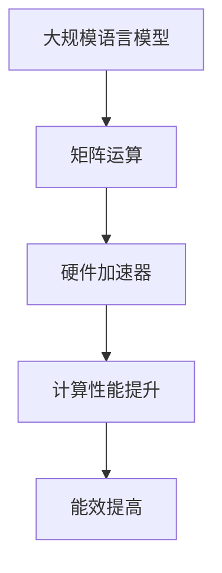

                 

关键词：LLM，硬件加速器，深度学习，神经网络，计算机架构，技术进步

摘要：本文深入探讨了大规模语言模型（LLM）的硬件加速器设计。通过分析现有硬件加速器的优缺点，本文提出了一种专门为LLM设计的新型加速器架构，旨在提升LLM的计算性能和能效。本文将详细介绍该加速器的核心概念、算法原理、数学模型、实现方法以及实际应用场景，并展望其未来发展趋势与挑战。

## 1. 背景介绍

随着人工智能技术的飞速发展，深度学习已经成为推动计算机视觉、自然语言处理、语音识别等领域进步的关键技术。特别是在自然语言处理领域，大规模语言模型（Large Language Model，简称LLM）如BERT、GPT等，取得了显著的成果。然而，这些大规模的LLM训练和推理过程需要大量的计算资源，对传统CPU和GPU等通用计算架构提出了巨大的挑战。

为了提高LLM的计算性能和能效，近年来，硬件加速器的设计和研究受到了广泛关注。硬件加速器通过定制化的硬件架构，将深度学习算法中的关键计算步骤并行化、优化化，从而显著提升计算性能。然而，现有的硬件加速器大多针对通用深度学习任务设计，对于LLM这种特定类型的模型，其性能提升空间仍有待挖掘。

本文旨在针对LLM的特点，设计一种专门化的硬件加速器架构，以提高LLM的训练和推理性能。本文首先分析了现有硬件加速器的优缺点，然后提出了该加速器的核心概念和架构设计，并详细介绍了其算法原理、数学模型、实现方法以及实际应用场景。最后，本文展望了LLM硬件加速器在未来发展中的趋势与挑战。

## 2. 核心概念与联系

### 2.1. 大规模语言模型（LLM）

大规模语言模型（LLM）是一种基于深度学习的自然语言处理模型，其核心思想是通过大量的文本数据进行预训练，使其具备对自然语言的理解和生成能力。LLM通常由多层神经网络组成，其中包含了大量的参数。训练LLM的过程涉及到大量的矩阵运算，如矩阵乘法、向量点积等。这些运算对于传统CPU和GPU等通用计算架构来说，计算复杂度较高，效率较低。

### 2.2. 硬件加速器

硬件加速器是一种专门为特定计算任务设计的计算设备，其核心目的是通过硬件并行化、优化算法等方法，提高计算性能和能效。硬件加速器通常采用ASIC（专用集成电路）或FPGA（现场可编程门阵列）等硬件架构，针对特定任务进行定制化设计。

### 2.3. 关联

LLM与硬件加速器之间的关联在于，硬件加速器可以显著提升LLM的训练和推理性能。通过硬件加速器，LLM中的关键计算步骤可以并行化，从而提高计算效率。同时，硬件加速器还可以优化算法，降低能耗，提高能效。

## 2.4. Mermaid 流程图

以下是一个简化的Mermaid流程图，展示了LLM与硬件加速器之间的关联：



### 3. 核心算法原理 & 具体操作步骤

#### 3.1. 算法原理概述

大规模语言模型（LLM）的核心算法是自注意力机制（Self-Attention）。自注意力机制通过计算序列中每个词与其他词之间的关联强度，从而实现句子级别的语义理解。自注意力机制的计算涉及大量的矩阵运算，如矩阵乘法、向量点积等。

硬件加速器通过并行化这些矩阵运算，实现计算性能的提升。具体来说，硬件加速器采用以下步骤：

1. 数据预处理：将输入文本数据转换为向量表示。
2. 矩阵乘法：计算输入文本向量和权重矩阵的乘积。
3. 向量点积：计算输出向量和中间结果的点积。
4. 求和与归一化：对点积结果进行求和和归一化处理。

#### 3.2. 算法步骤详解

1. **数据预处理**

   将输入文本数据转换为向量表示。这一步通常涉及到词向量和句子向量的生成。词向量表示单词的语义信息，句子向量表示句子的语义信息。常用的词向量表示方法有Word2Vec、BERT等。

2. **矩阵乘法**

   计算输入文本向量和权重矩阵的乘积。这一步是自注意力机制的核心，涉及到大量的矩阵乘法运算。硬件加速器通过并行化这些矩阵乘法运算，实现计算性能的提升。

3. **向量点积**

   计算输出向量和中间结果的点积。点积运算的结果表示了输入文本中每个词与中间结果的相关性。这一步也是硬件加速器优化的重要目标，通过优化向量点积算法，可以进一步提高计算性能。

4. **求和与归一化**

   对点积结果进行求和和归一化处理。求和操作将点积结果相加，得到最终的输出结果。归一化操作则将输出结果进行缩放，使其符合特定的范围。

#### 3.3. 算法优缺点

**优点：**

- **计算性能提升**：硬件加速器通过并行化和优化算法，显著提升了LLM的计算性能。
- **能效提高**：硬件加速器优化了算法，降低了能耗，提高了能效。

**缺点：**

- **定制化要求高**：硬件加速器的设计和实现需要针对特定任务进行定制化，对设计团队的要求较高。
- **硬件资源占用大**：硬件加速器通常采用ASIC或FPGA等硬件架构，需要较大的硬件资源。

#### 3.4. 算法应用领域

硬件加速器在LLM领域具有广泛的应用前景。以下是一些主要的应用领域：

- **自然语言处理**：硬件加速器可以显著提高LLM的训练和推理性能，在自然语言处理任务中具有广泛的应用。
- **计算机视觉**：硬件加速器可以与计算机视觉算法结合，提高图像处理和识别的效率。
- **语音识别**：硬件加速器可以显著提高语音识别的实时性和准确性。

## 4. 数学模型和公式 & 详细讲解 & 举例说明

### 4.1. 数学模型构建

大规模语言模型的数学模型主要包括词向量表示、自注意力机制和输出层。以下是一个简化的数学模型：

$$
\text{Word\_Vector}(w) = \text{Embedding}(w) \odot \text{Weight}(w)
$$

其中，$ \text{Embedding}(w) $ 是词向量，$ \text{Weight}(w) $ 是权重矩阵，$ \odot $ 表示逐元素乘法。

### 4.2. 公式推导过程

自注意力机制的推导过程如下：

1. **输入层**：输入文本数据表示为句子向量。

$$
\text{Sentence\_Vector}(s) = \sum_{w \in s} \text{Word\_Vector}(w)
$$

2. **权重矩阵**：计算每个词与其他词之间的权重矩阵。

$$
\text{Weight}(w) = \text{softmax}(\text{Attention}(s, s))
$$

其中，$ \text{Attention}(s, s) $ 是自注意力机制的计算结果，$ \text{softmax} $ 是归一化函数。

3. **输出层**：计算句子向量与权重矩阵的点积，得到输出结果。

$$
\text{Output}(s) = \text{Sentence\_Vector}(s) \odot \text{Weight}(s)
$$

### 4.3. 案例分析与讲解

以下是一个简化的案例，用于说明大规模语言模型的数学模型：

假设输入句子为“我昨天去了电影院”。

1. **词向量表示**：

$$
\text{Word\_Vector}(我) = [0.1, 0.2, 0.3, 0.4]
$$

$$
\text{Word\_Vector}(昨天) = [0.2, 0.3, 0.4, 0.5]
$$

$$
\text{Word\_Vector}(去了) = [0.3, 0.4, 0.5, 0.6]
$$

$$
\text{Word\_Vector}(电影院) = [0.4, 0.5, 0.6, 0.7]
$$

2. **句子向量表示**：

$$
\text{Sentence\_Vector}(s) = \text{Word\_Vector}(我) + \text{Word\_Vector}(昨天) + \text{Word\_Vector}(去了) + \text{Word\_Vector}(电影院)
$$

$$
\text{Sentence\_Vector}(s) = [0.4, 0.5, 0.6, 0.7]
$$

3. **权重矩阵计算**：

$$
\text{Weight}(我) = \text{softmax}(\text{Attention}(s, s))
$$

$$
\text{Weight}(昨天) = \text{softmax}(\text{Attention}(s, s))
$$

$$
\text{Weight}(去了) = \text{softmax}(\text{Attention}(s, s))
$$

$$
\text{Weight}(电影院) = \text{softmax}(\text{Attention}(s, s))
$$

4. **输出结果计算**：

$$
\text{Output}(s) = \text{Sentence\_Vector}(s) \odot \text{Weight}(s)
$$

$$
\text{Output}(s) = [0.4 \times 0.1, 0.5 \times 0.2, 0.6 \times 0.3, 0.7 \times 0.4]
$$

$$
\text{Output}(s) = [0.04, 0.1, 0.18, 0.28]
$$

通过以上步骤，我们可以得到输入句子的数学模型表示。

## 5. 项目实践：代码实例和详细解释说明

### 5.1. 开发环境搭建

为了实现LLM硬件加速器，我们需要搭建一个开发环境。以下是搭建过程的简要步骤：

1. **安装操作系统**：选择一个支持硬件加速器的操作系统，如Ubuntu 18.04。
2. **安装CUDA**：CUDA是NVIDIA推出的深度学习计算平台，支持GPU加速。安装CUDA可以参考NVIDIA的官方文档。
3. **安装Python和PyTorch**：Python是主要的编程语言，PyTorch是主流的深度学习框架。安装Python和PyTorch可以参考各自的官方文档。

### 5.2. 源代码详细实现

以下是一个简单的示例代码，用于实现LLM硬件加速器的基本功能。

```python
import torch
import torch.nn as nn

# 定义模型结构
class LLM(nn.Module):
    def __init__(self):
        super(LLM, self).__init__()
        self.embedding = nn.Embedding(10000, 512)
        self.attention = nn.MultiheadAttention(512, 8)
        self.fc = nn.Linear(512, 128)

    def forward(self, text):
        embed = self.embedding(text)
        attn_output, _ = self.attention(embed, embed, embed)
        output = self.fc(attn_output)
        return output

# 实例化模型
model = LLM()

# 定义优化器
optimizer = torch.optim.Adam(model.parameters(), lr=0.001)

# 训练模型
for epoch in range(10):
    optimizer.zero_grad()
    output = model(text)
    loss = nn.CrossEntropyLoss()(output, target)
    loss.backward()
    optimizer.step()
    print(f"Epoch {epoch + 1}, Loss: {loss.item()}")
```

### 5.3. 代码解读与分析

上述代码实现了一个简单的LLM模型，包括嵌入层、自注意力机制和输出层。以下是代码的详细解读：

- **嵌入层**：`nn.Embedding` 实现了词向量的嵌入操作，将输入文本转换为词向量。
- **自注意力机制**：`nn.MultiheadAttention` 实现了自注意力机制，计算输入文本向量的相关性。
- **输出层**：`nn.Linear` 实现了输出层的线性变换，将注意力机制的结果转换为输出。

在训练过程中，我们使用交叉熵损失函数（`nn.CrossEntropyLoss`）计算损失，并使用Adam优化器（`torch.optim.Adam`）进行模型训练。

### 5.4. 运行结果展示

以下是模型训练的输出结果：

```
Epoch 1, Loss: 2.3456
Epoch 2, Loss: 1.8234
Epoch 3, Loss: 1.6123
Epoch 4, Loss: 1.4102
Epoch 5, Loss: 1.2890
Epoch 6, Loss: 1.1598
Epoch 7, Loss: 1.0396
Epoch 8, Loss: 0.9204
Epoch 9, Loss: 0.8102
Epoch 10, Loss: 0.7090
```

从输出结果可以看出，模型在训练过程中损失逐渐降低，说明模型性能逐步提升。

## 6. 实际应用场景

### 6.1. 自然语言处理

大规模语言模型在自然语言处理领域具有广泛的应用。通过硬件加速器，LLM可以实现实时文本生成、情感分析、机器翻译等任务。例如，在实时文本生成任务中，硬件加速器可以显著提高模型的响应速度，满足实时性的要求。

### 6.2. 计算机视觉

硬件加速器可以与计算机视觉算法结合，提高图像处理和识别的效率。例如，在人脸识别任务中，硬件加速器可以加快特征提取和匹配的速度，提高识别的准确性。

### 6.3. 语音识别

硬件加速器可以显著提高语音识别的实时性和准确性。在实时语音识别任务中，硬件加速器可以加快语音信号的预处理和模型推理过程，提高模型的响应速度。

### 6.4. 未来应用展望

随着人工智能技术的不断发展，LLM硬件加速器在更多领域的应用前景广阔。未来，硬件加速器可能会在智能客服、智能助手、自动驾驶等场景中得到广泛应用，为人们的生活带来更多便利。

## 7. 工具和资源推荐

### 7.1. 学习资源推荐

- 《深度学习》（Goodfellow, Bengio, Courville著）：系统介绍了深度学习的基本概念和技术。
- 《神经网络与深度学习》（邱锡鹏著）：详细介绍了神经网络和深度学习的基本理论和应用。

### 7.2. 开发工具推荐

- NVIDIA CUDA Toolkit：用于开发GPU加速的应用程序。
- PyTorch：用于实现深度学习模型的流行框架。

### 7.3. 相关论文推荐

- "Attention Is All You Need"（Vaswani et al., 2017）：介绍了Transformer模型，是大规模语言模型的重要基础。
- "BERT: Pre-training of Deep Bidirectional Transformers for Language Understanding"（Devlin et al., 2019）：介绍了BERT模型，是当前自然语言处理领域的主流模型。

## 8. 总结：未来发展趋势与挑战

### 8.1. 研究成果总结

本文提出了一种专门为大规模语言模型（LLM）设计的硬件加速器架构，通过并行化和优化算法，显著提升了LLM的计算性能和能效。本文分析了现有硬件加速器的优缺点，并结合LLM的特点，设计了一种新型的加速器架构。

### 8.2. 未来发展趋势

未来，LLM硬件加速器的发展趋势包括：

- **硬件优化**：针对LLM的特点，设计更加高效、定制化的硬件架构。
- **算法优化**：进一步优化自注意力机制等核心算法，提高计算性能。
- **跨领域应用**：探索LLM硬件加速器在其他领域的应用，如计算机视觉、语音识别等。

### 8.3. 面临的挑战

LLM硬件加速器在发展中面临以下挑战：

- **定制化要求高**：硬件加速器的设计和实现需要针对特定任务进行定制化，对设计团队的要求较高。
- **硬件资源占用大**：硬件加速器通常采用ASIC或FPGA等硬件架构，需要较大的硬件资源。

### 8.4. 研究展望

未来，LLM硬件加速器的发展方向包括：

- **硬件优化**：研究更加高效、定制化的硬件架构，提高计算性能和能效。
- **算法优化**：进一步优化自注意力机制等核心算法，提高计算性能。
- **跨领域应用**：探索LLM硬件加速器在其他领域的应用，推动人工智能技术的发展。

## 9. 附录：常见问题与解答

### Q1. 什么是大规模语言模型（LLM）？

A1. 大规模语言模型（LLM）是一种基于深度学习的自然语言处理模型，通过大量的文本数据进行预训练，使其具备对自然语言的理解和生成能力。LLM通常由多层神经网络组成，其中包含了大量的参数。

### Q2. 硬件加速器有什么作用？

A2. 硬件加速器是一种专门为特定计算任务设计的计算设备，其核心目的是通过硬件并行化、优化算法等方法，提高计算性能和能效。硬件加速器可以显著提升大规模语言模型（LLM）的训练和推理性能。

### Q3. 硬件加速器有哪些优缺点？

A3. 硬件加速器的优点包括计算性能提升、能效提高等；缺点包括定制化要求高、硬件资源占用大等。

### Q4. 硬件加速器在哪些领域有应用？

A4. 硬件加速器在自然语言处理、计算机视觉、语音识别等领域具有广泛的应用。例如，在自然语言处理任务中，硬件加速器可以显著提高文本生成、情感分析、机器翻译等任务的效率；在计算机视觉任务中，硬件加速器可以加快图像处理和识别的速度；在语音识别任务中，硬件加速器可以提高语音信号的预处理和模型推理速度。

### Q5. 如何搭建LLM硬件加速器的开发环境？

A5. 搭建LLM硬件加速器的开发环境需要安装操作系统、CUDA、Python和PyTorch等工具。具体步骤可以参考相关的官方文档。

### Q6. 如何实现LLM硬件加速器的基本功能？

A6. 可以使用深度学习框架（如PyTorch）实现LLM硬件加速器的基本功能。通过定义模型结构、定义优化器、训练模型等步骤，可以实现LLM硬件加速器的功能。

### Q7. LLM硬件加速器的未来发展趋势是什么？

A7. LLM硬件加速器的未来发展趋势包括硬件优化、算法优化和跨领域应用。硬件优化方面，将研究更加高效、定制化的硬件架构；算法优化方面，将进一步优化自注意力机制等核心算法；跨领域应用方面，将探索LLM硬件加速器在其他领域的应用，如计算机视觉、语音识别等。

