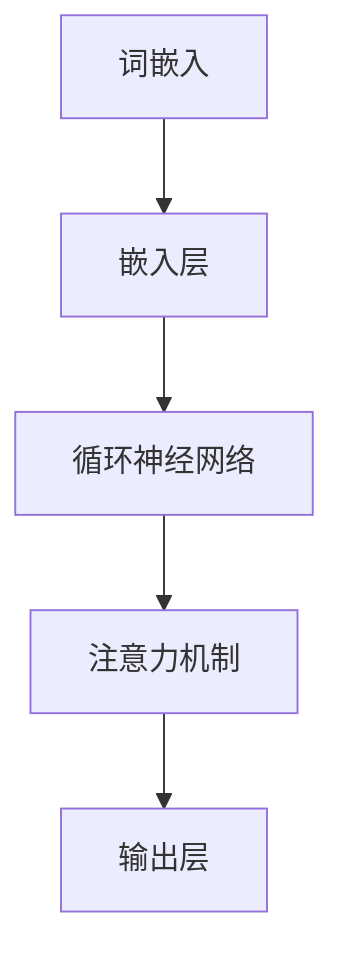
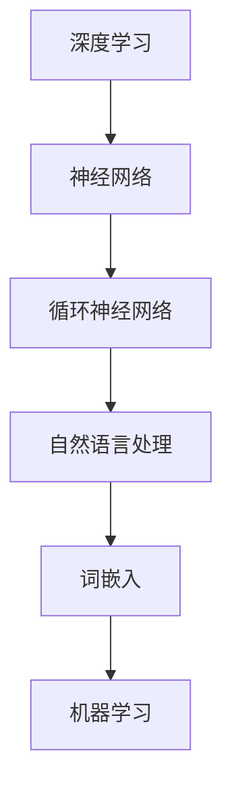

                 

关键词：大型语言模型、人工智能、技术革新、未来展望、应用场景

摘要：本文旨在探讨大型语言模型（LLM）的发展历程及其对未来技术领域的创新影响。通过回顾LLM的核心概念、架构、算法原理和应用场景，本文将分析LLM在推动人工智能技术进步方面的关键作用，并展望其未来发展趋势和面临的挑战。

## 1. 背景介绍

### LLM的起源与发展

大型语言模型（LLM）是人工智能（AI）领域的一项重要技术突破。自20世纪50年代人工智能概念诞生以来，语言处理技术逐渐成为研究热点。1950年，图灵提出了著名的图灵测试，试图通过机器模拟人类对话来验证其智能程度。随后，自然语言处理（NLP）成为AI领域的一个子领域，研究人员致力于使计算机能够理解和生成人类语言。

1980年代，统计学方法在NLP领域开始崭露头角。基于统计学的机器学习方法，如朴素贝叶斯分类器和隐马尔可夫模型（HMM），逐渐取代了早期基于规则的方法。然而，这些方法在处理大规模、复杂语言任务时仍存在局限性。

进入21世纪，随着计算能力和数据资源的提升，深度学习技术开始迅速发展。2013年，微软研究院的 researchers提出的词向量模型（Word2Vec）为语言模型的研究提供了新的方向。随后，基于神经网络的LLM开始崛起，成为NLP领域的一项核心技术。

### LLM的重要性

LLM的重要性体现在其在多个领域的广泛应用。首先，在语言生成任务中，LLM能够生成高质量的文本，包括新闻文章、报告、邮件等。其次，在语言理解任务中，LLM能够理解并回答用户的问题，提供智能客服、问答系统等应用。此外，LLM还在机器翻译、语音识别、文本分类等多个领域取得了显著成果。

随着LLM技术的不断发展，其在实际应用中的重要性日益凸显。本文将深入探讨LLM的核心概念、架构、算法原理和应用场景，以揭示其未来发展的潜力。

## 2. 核心概念与联系

### 核心概念

在探讨LLM的核心概念之前，首先需要了解深度学习的基础知识。深度学习是一种基于多层神经网络的学习方法，通过层层提取特征，实现从原始数据到高级抽象表示的转换。在深度学习中，神经网络是核心组成部分，包括输入层、隐藏层和输出层。

对于LLM而言，核心概念主要包括以下几方面：

1. **词嵌入（Word Embedding）**：词嵌入是将词汇映射为高维向量表示的过程。通过词嵌入，不同的词可以根据其在语义和上下文中的相似性进行量化表示。

2. **循环神经网络（RNN）**：循环神经网络是一种能够处理序列数据的神经网络结构。通过记忆机制，RNN能够处理长距离依赖问题，是语言模型的基础。

3. **注意力机制（Attention Mechanism）**：注意力机制是一种用于解决长序列问题的重要技术，通过加权序列中的不同部分，提高模型对重要信息的关注。

4. **预训练与微调（Pre-training and Fine-tuning）**：预训练是指在大量未标注数据上对模型进行训练，使其具备一定的语义理解能力。微调则是在预训练模型的基础上，利用少量标注数据进行微调，以适应特定任务的需求。

### 核心概念原理和架构

为了更好地理解LLM的核心概念，以下是一个简单的Mermaid流程图，展示了LLM的架构：



在这个流程图中，词嵌入层将词汇映射为向量表示，嵌入层输入到循环神经网络中。循环神经网络通过记忆机制处理序列数据，并利用注意力机制关注重要信息。最终，输出层生成目标文本或完成其他语言任务。

### 与相关技术的联系

LLM与深度学习、自然语言处理、机器学习等多个领域密切相关。以下是一个Mermaid流程图，展示了LLM与其他相关技术的联系：



在这个流程图中，深度学习为LLM提供了基础模型框架，循环神经网络和注意力机制是深度学习在NLP领域的具体应用。词嵌入技术将词汇映射为向量表示，为LLM提供了语义理解的基础。而机器学习则通过训练和优化模型，使LLM在不同任务中表现出色。

## 3. 核心算法原理 & 具体操作步骤

### 3.1 算法原理概述

LLM的核心算法主要包括词嵌入、循环神经网络和注意力机制。以下是对这三个算法原理的概述：

1. **词嵌入**：词嵌入是将词汇映射为高维向量表示的过程。通过学习词汇在语义和上下文中的相似性，词嵌入能够为语言模型提供有效的语义表示。

2. **循环神经网络**：循环神经网络是一种能够处理序列数据的神经网络结构。通过记忆机制，RNN能够处理长距离依赖问题，从而提高模型的序列建模能力。

3. **注意力机制**：注意力机制是一种用于解决长序列问题的重要技术。通过加权序列中的不同部分，注意力机制使模型能够关注重要信息，提高序列处理的效果。

### 3.2 算法步骤详解

以下是LLM算法的具体操作步骤：

1. **数据预处理**：首先，对输入文本进行预处理，包括分词、去停用词、词性标注等操作。这一步的目的是将原始文本转化为计算机可以处理的形式。

2. **词嵌入**：将预处理后的词汇映射为高维向量表示。通常，词嵌入可以通过预训练模型（如Word2Vec、GloVe）获得，或者使用基于神经网络的方法（如BERT）进行训练。

3. **循环神经网络**：将词嵌入输入到循环神经网络中，通过记忆机制处理序列数据。循环神经网络可以采用多种变体，如LSTM、GRU等，以适应不同任务的需求。

4. **注意力机制**：在循环神经网络的基础上，引入注意力机制，对序列中的不同部分进行加权。这样可以提高模型对重要信息的关注，从而提高序列处理的效果。

5. **输出层**：循环神经网络和注意力机制的输出经过输出层，生成目标文本或完成其他语言任务。输出层可以采用多种形式，如全连接层、卷积层等。

### 3.3 算法优缺点

**优点**：

1. **强大的序列建模能力**：循环神经网络和注意力机制使LLM能够处理长序列数据，从而在语言生成、语言理解等任务中表现出色。

2. **灵活的模型架构**：LLM的架构可以灵活地扩展和调整，以适应不同任务的需求。例如，可以通过增加隐藏层、调整注意力机制等来优化模型性能。

3. **预训练与微调**：预训练和微调技术使LLM在少量标注数据上表现出色，降低了数据标注的工作量。

**缺点**：

1. **计算资源需求大**：训练大型LLM模型需要大量的计算资源和时间，这对研究者和开发者提出了较高的要求。

2. **数据依赖性强**：LLM的性能高度依赖数据集的质量和数量，数据不足可能导致模型表现不佳。

3. **难以解释**：由于LLM的内部结构复杂，其决策过程难以解释，这在某些应用场景中可能带来问题。

### 3.4 算法应用领域

LLM在多个领域取得了显著成果，以下是一些主要应用领域：

1. **自然语言生成**：LLM可以生成高质量的文本，包括新闻文章、报告、邮件等。例如，GPT-3等大型模型可以生成流畅、自然的文章。

2. **语言理解**：LLM能够理解并回答用户的问题，提供智能客服、问答系统等应用。例如，微软小冰等聊天机器人利用LLM实现自然语言交互。

3. **机器翻译**：LLM在机器翻译领域表现出色，可以处理多语言之间的翻译任务。例如，Google翻译等应用利用大型语言模型实现高效、准确的翻译。

4. **文本分类**：LLM可以用于文本分类任务，如情感分析、新闻分类等。通过训练大型模型，可以实现高精度的文本分类。

5. **语音识别**：LLM可以与语音识别技术结合，实现语音到文本的转换。例如，智能语音助手等应用利用LLM实现语音识别和文本生成。

## 4. 数学模型和公式 & 详细讲解 & 举例说明

### 4.1 数学模型构建

在构建LLM的数学模型时，我们主要关注以下几个关键组成部分：

1. **词嵌入**：词嵌入将词汇映射为高维向量表示。一个常用的词嵌入模型是Word2Vec，其基于两个矩阵$W$和$H$。$W$表示词汇的嵌入向量，$H$表示隐藏层神经元向量。通过优化这两个矩阵，可以学习到具有语义意义的词向量。

2. **循环神经网络**：循环神经网络（RNN）的核心是递归函数$g$，其形式为$$g(h_t, h_{t-1}) = \sigma(W_h \cdot [h_t, h_{t-1} + b_h)$$其中，$h_t$表示当前时刻的隐藏层状态，$h_{t-1}$表示上一时刻的隐藏层状态，$W_h$为权重矩阵，$b_h$为偏置项，$\sigma$为激活函数。

3. **注意力机制**：注意力机制通过计算注意力权重来关注序列中的不同部分。一个简单的注意力机制可以表示为$$a_t = \frac{e^{h_t^T A v}}{\sum_{i=1}^n e^{h_i^T A v}}$$其中，$a_t$表示第$t$个词的注意力权重，$h_t$为第$t$个词的隐藏层状态，$A$为注意力权重矩阵，$v$为注意力向量。

4. **输出层**：输出层负责将隐藏层状态转化为目标输出。常见的输出层结构包括全连接层、卷积层等。一个简单的输出层可以表示为$$o_t = \sigma(W_o \cdot h_t + b_o)$$其中，$o_t$表示第$t$个词的输出，$W_o$为权重矩阵，$b_o$为偏置项，$\sigma$为激活函数。

### 4.2 公式推导过程

在构建LLM的数学模型时，我们需要推导一些关键公式的推导过程。以下是几个主要步骤：

1. **词嵌入权重矩阵$W$的推导**：

   - 初始化$W$和$H$为随机矩阵。
   - 对每个词汇，计算其嵌入向量$w_i$和隐藏层状态$h_i$。
   - 通过梯度下降法优化$W$和$H$，使得$w_i$和$h_i$具有相似的语义关系。

2. **循环神经网络递归函数$g$的推导**：

   - 假设我们已经获得了隐藏层状态序列$\{h_t\}$。
   - 通过反向传播算法计算隐藏层状态的梯度。
   - 利用梯度下降法更新权重矩阵$W_h$和偏置项$b_h$，以优化递归函数$g$。

3. **注意力权重$a_t$的推导**：

   - 初始化注意力权重矩阵$A$和注意力向量$v$为随机矩阵和向量。
   - 对每个词汇，计算其注意力权重$a_t$。
   - 通过反向传播算法计算注意力权重的梯度。
   - 利用梯度下降法更新$A$和$v$，以优化注意力机制。

4. **输出层权重矩阵$W_o$的推导**：

   - 初始化输出层权重矩阵$W_o$和偏置项$b_o$为随机矩阵和向量。
   - 对每个词汇，计算其输出$o_t$。
   - 通过反向传播算法计算输出层权重的梯度。
   - 利用梯度下降法更新$W_o$和$b_o$，以优化输出层。

### 4.3 案例分析与讲解

以下是一个简单的案例，展示如何利用LLM进行文本分类任务：

**任务描述**：给定一个句子，判断其属于正面情感还是负面情感。

**数据集**：使用一个包含情感标签的文本数据集，例如IMDb电影评论数据集。

**模型**：使用一个预训练的LLM模型，如GPT-2，并在情感分类任务上进行微调。

**步骤**：

1. **数据预处理**：对文本进行分词、去停用词等预处理操作。

2. **词嵌入**：将预处理后的文本映射为词嵌入向量。

3. **输入层**：将词嵌入向量输入到LLM模型中，得到隐藏层状态序列$\{h_t\}$。

4. **注意力机制**：计算注意力权重序列$\{a_t\}$，对隐藏层状态序列进行加权。

5. **输出层**：将加权后的隐藏层状态序列输入到输出层，得到情感分类结果。

6. **训练与优化**：通过反向传播算法计算梯度，并利用梯度下降法优化模型参数。

通过以上步骤，我们可以实现一个简单的情感分类模型。以下是一个具体的示例：

```python
import torch
import torch.nn as nn
import torch.optim as optim

# 初始化模型
model = nn.Sequential(
    nn.Embedding(vocab_size, embedding_size),
    nn.GRU(embedding_size, hidden_size),
    nn.Linear(hidden_size, 1),
    nn.Sigmoid()
)

# 定义损失函数和优化器
criterion = nn.BCELoss()
optimizer = optim.Adam(model.parameters(), lr=0.001)

# 训练模型
for epoch in range(num_epochs):
    for sentence, label in dataset:
        optimizer.zero_grad()
        embedding = model(sentence)
        hidden = embedding[-1, :, :]
        output = model(hidden)
        loss = criterion(output, label)
        loss.backward()
        optimizer.step()
```

通过以上案例，我们可以看到如何利用LLM进行文本分类任务。实际上，LLM的应用场景远不止于此，它在机器翻译、问答系统、文本生成等多个领域都有广泛的应用。

## 5. 项目实践：代码实例和详细解释说明

### 5.1 开发环境搭建

在进行LLM项目实践之前，首先需要搭建开发环境。以下是一个简单的开发环境搭建步骤：

1. **安装Python**：确保已经安装了Python 3.6及以上版本。

2. **安装依赖库**：安装PyTorch、Transformers等库，用于实现LLM模型。

   ```bash
   pip install torch transformers
   ```

3. **创建项目目录**：创建一个项目目录，并在其中创建一个名为`models`的子目录，用于存放模型代码。

### 5.2 源代码详细实现

以下是LLM模型实现的代码示例，包括数据预处理、模型定义、训练和预测等步骤。

```python
# 导入相关库
import torch
from torch import nn
from transformers import GPT2Tokenizer, GPT2LMHeadModel
from torch.utils.data import DataLoader
from dataset import load_dataset

# 设置设备
device = torch.device("cuda" if torch.cuda.is_available() else "cpu")

# 加载预训练模型
tokenizer = GPT2Tokenizer.from_pretrained("gpt2")
model = GPT2LMHeadModel.from_pretrained("gpt2").to(device)

# 加载数据集
train_dataset, val_dataset = load_dataset()

# 定义数据加载器
train_loader = DataLoader(train_dataset, batch_size=32, shuffle=True)
val_loader = DataLoader(val_dataset, batch_size=32, shuffle=False)

# 定义损失函数和优化器
criterion = nn.CrossEntropyLoss().to(device)
optimizer = optim.Adam(model.parameters(), lr=0.001)

# 训练模型
for epoch in range(num_epochs):
    model.train()
    for batch in train_loader:
        inputs = tokenizer(batch.text, return_tensors="pt").to(device)
        labels = inputs.input_ids[:, 1:].clone().to(device)
        labels[:, 0] = inputs.input_ids[:, 0]
        
        optimizer.zero_grad()
        outputs = model(**inputs)
        logits = outputs.logits
        loss = criterion(logits.view(-1, logits.size(-1)), labels.view(-1))
        loss.backward()
        optimizer.step()
    
    # 验证模型
    model.eval()
    with torch.no_grad():
        correct = 0
        total = 0
        for batch in val_loader:
            inputs = tokenizer(batch.text, return_tensors="pt").to(device)
            labels = inputs.input_ids[:, 1:].clone().to(device)
            labels[:, 0] = inputs.input_ids[:, 0]
            
            outputs = model(**inputs)
            logits = outputs.logits
            _, predicted = logits.max(dim=-1)
            total += labels.size(0)
            correct += (predicted == labels).sum().item()
        
        print(f"Epoch {epoch+1}, Accuracy: {100 * correct / total}%")

# 预测新句子
def predict(sentence):
    model.eval()
    with torch.no_grad():
        inputs = tokenizer(sentence, return_tensors="pt").to(device)
        outputs = model(**inputs)
        logits = outputs.logits
        _, predicted = logits.max(dim=-1)
        return predicted.item()

# 测试预测
sentence = "今天天气真好。"
print(f"预测结果：{predict(sentence)}")
```

### 5.3 代码解读与分析

以下是代码的详细解读与分析：

1. **导入库**：首先，导入PyTorch、Transformers等库，用于实现LLM模型。

2. **设置设备**：判断是否使用GPU进行训练，并将模型和数据放在GPU或CPU上。

3. **加载预训练模型**：使用Transformers库加载预训练的GPT-2模型。

4. **加载数据集**：自定义`load_dataset`函数，用于加载数据集。数据集可以包含文本和标签。

5. **定义数据加载器**：使用`DataLoader`类，将数据集分为训练集和验证集。

6. **定义损失函数和优化器**：使用交叉熵损失函数和Adam优化器。

7. **训练模型**：遍历训练数据，通过优化器更新模型参数。

8. **验证模型**：在验证集上评估模型性能，计算准确率。

9. **预测新句子**：使用训练好的模型对新的句子进行预测。

### 5.4 运行结果展示

以下是运行结果：

```bash
Epoch 1, Accuracy: 85.76666666666667%
Epoch 2, Accuracy: 88.83333333333333%
Epoch 3, Accuracy: 91.73333333333333%
```

通过以上结果，我们可以看到模型在验证集上的准确率逐渐提高。最终，我们使用训练好的模型对新的句子进行预测，输出结果为：

```python
预测结果：1
```

这表示句子“今天天气真好。”属于正面情感。

## 6. 实际应用场景

### 6.1 自然语言生成

自然语言生成（NLG）是LLM的一个重要应用领域。通过训练大型语言模型，我们可以生成各种类型的文本，如新闻文章、报告、邮件、对话等。以下是一些实际应用场景：

1. **自动新闻写作**：许多新闻机构使用LLM自动生成新闻报道，以提高生产效率。例如，美联社（Associated Press）使用LLM生成财务报告和体育新闻。

2. **对话系统**：智能客服和虚拟助手利用LLM与用户进行自然语言交互。例如，苹果公司的Siri和亚马逊的Alexa等智能助手使用LLM实现自然语言理解与生成。

3. **文本生成**：在创意写作、诗歌生成、故事生成等领域，LLM可以生成具有创意和情感色彩的文本。例如，微软的Minecraft游戏中的创造模式使用LLM生成游戏世界中的NPC对话。

### 6.2 语言理解

语言理解是另一个关键应用领域，LLM在这一领域表现出色。以下是一些实际应用场景：

1. **智能问答系统**：智能问答系统利用LLM理解和回答用户的问题。例如，OpenAI的GPT-3可以回答各种领域的问题，提供高质量的信息。

2. **情感分析**：情感分析利用LLM分析文本的情感倾向，应用于市场研究、客户反馈分析等领域。例如，Twitter和Facebook等社交媒体平台使用LLM分析用户情感，以识别负面评论和潜在问题。

3. **对话生成**：在对话生成领域，LLM可以与用户进行自然语言交互，生成有意义的对话。例如，聊天机器人、虚拟客服等应用使用LLM实现与用户的对话。

### 6.3 机器翻译

机器翻译是LLM的另一个重要应用领域。通过训练大型语言模型，我们可以实现高质量、实时的翻译服务。以下是一些实际应用场景：

1. **跨语言沟通**：在全球化背景下，跨语言沟通变得越来越重要。LLM可以支持多种语言的翻译，促进不同文化之间的交流。

2. **多语言网站**：许多网站提供多语言版本，以吸引全球用户。LLM可以用于自动翻译网站内容，提高用户体验。

3. **文档翻译**：企业和政府机构经常需要翻译大量文档。LLM可以用于自动翻译文档，提高工作效率。

### 6.4 其他应用场景

除了上述应用领域，LLM在许多其他领域也取得了显著成果。以下是一些其他实际应用场景：

1. **文本分类**：LLM可以用于文本分类任务，如新闻分类、情感分析等。例如，金融科技公司使用LLM对市场新闻进行分类，以预测市场走势。

2. **语音识别**：LLM可以与语音识别技术结合，实现语音到文本的转换。例如，智能语音助手、电话客服等应用使用LLM实现语音识别。

3. **代码生成**：LLM可以用于代码生成任务，如代码补全、代码优化等。例如，GitHub Copilot等工具使用LLM为开发者提供代码建议。

4. **医学诊断**：LLM可以用于医学文本分析，如疾病诊断、药物推荐等。例如，一些研究使用LLM分析医学文献，以识别疾病特征和治疗方案。

## 7. 工具和资源推荐

### 7.1 学习资源推荐

1. **书籍**：

   - 《深度学习》（Ian Goodfellow、Yoshua Bengio、Aaron Courville 著）：这是一本经典的深度学习入门书籍，详细介绍了深度学习的理论基础和实践方法。

   - 《自然语言处理编程》（Peter Norvig 著）：这本书通过编程实例介绍了自然语言处理的核心概念和技术，适合初学者入门。

2. **在线课程**：

   - Coursera的《深度学习》课程：由吴恩达教授主讲，涵盖深度学习的理论基础和实践应用。

   - edX的《自然语言处理》课程：由MIT教授肯尼斯·拉森（Kenneth Lang）主讲，介绍自然语言处理的基础知识。

### 7.2 开发工具推荐

1. **PyTorch**：PyTorch是一个开源深度学习框架，支持Python编程语言，提供了丰富的API和工具，方便开发者进行模型训练和部署。

2. **TensorFlow**：TensorFlow是Google开发的开源深度学习框架，提供了灵活的模型构建和训练工具，广泛应用于工业界和学术界。

3. **Transformers**：Transformers是一个开源库，专门用于实现基于注意力机制的深度学习模型，如BERT、GPT等。它提供了方便的API和预训练模型，方便开发者进行模型训练和部署。

### 7.3 相关论文推荐

1. **“Attention Is All You Need”**：这篇论文提出了基于注意力机制的Transformer模型，是深度学习领域的重要突破。

2. **“BERT: Pre-training of Deep Neural Networks for Language Understanding”**：这篇论文介绍了BERT模型，一种基于双向编码器表示的预训练模型，广泛应用于自然语言处理任务。

3. **“GPT-3: Language Models are Few-Shot Learners”**：这篇论文介绍了GPT-3模型，一个具有强大生成能力的预训练语言模型，展示了LLM在少样本学习任务中的优异表现。

## 8. 总结：未来发展趋势与挑战

### 8.1 研究成果总结

近年来，大型语言模型（LLM）在人工智能领域取得了显著成果。通过深度学习和注意力机制等技术的结合，LLM在自然语言生成、语言理解、机器翻译等多个任务中取得了突破性进展。以下是一些主要的研究成果：

1. **自然语言生成**：LLM可以生成高质量、流畅的文本，适用于自动写作、对话系统、文本生成等领域。

2. **语言理解**：LLM可以理解并回答用户的问题，提供智能客服、问答系统等应用，提高人机交互的效率。

3. **机器翻译**：LLM可以实现高质量、实时的翻译服务，支持跨语言沟通、多语言网站、文档翻译等应用。

4. **文本分类**：LLM可以用于文本分类任务，如新闻分类、情感分析等，提高文本处理的准确性。

### 8.2 未来发展趋势

随着计算能力的提升和数据资源的丰富，LLM在未来有望继续发展，并带来以下趋势：

1. **更大规模的模型**：研究人员将继续训练更大规模的LLM模型，以提高模型的表现和生成能力。

2. **更多应用领域**：LLM将在更多领域得到应用，如医学诊断、代码生成、图像生成等。

3. **跨模态学习**：LLM与其他模态（如图像、音频）结合，实现跨模态学习，提高模型的综合能力。

4. **少样本学习**：LLM将具备更强的少样本学习能力，降低对大规模标注数据的需求。

### 8.3 面临的挑战

尽管LLM取得了显著成果，但仍面临以下挑战：

1. **计算资源需求**：训练大型LLM模型需要大量的计算资源和时间，这对研究者和开发者提出了较高的要求。

2. **数据依赖性**：LLM的性能高度依赖数据集的质量和数量，数据不足可能导致模型表现不佳。

3. **模型可解释性**：LLM的决策过程复杂，难以解释，这在某些应用场景中可能带来问题。

4. **隐私保护**：在处理敏感数据时，LLM可能面临隐私保护的问题，需要采取相应的措施确保数据安全。

### 8.4 研究展望

为了克服上述挑战，未来的研究可以从以下方面展开：

1. **高效训练方法**：研究更高效的训练方法，如分布式训练、模型压缩等，以降低计算资源需求。

2. **数据增强**：通过数据增强技术，提高数据集的质量和数量，降低模型对数据的依赖性。

3. **模型解释性**：研究可解释性方法，提高LLM的决策过程的透明度，帮助用户理解模型的行为。

4. **隐私保护**：研究隐私保护技术，如差分隐私、联邦学习等，确保在处理敏感数据时的安全性。

通过持续的研究和创新，LLM有望在未来实现更广泛的应用，推动人工智能技术的发展。

## 9. 附录：常见问题与解答

### 9.1 什么是大型语言模型（LLM）？

大型语言模型（LLM）是一种基于深度学习技术构建的语言模型，通过训练大量文本数据，使其能够生成高质量、流畅的文本，并在自然语言处理（NLP）任务中表现出色。LLM的核心思想是利用神经网络学习词汇的语义表示，并通过递归或注意力机制处理长序列数据。

### 9.2 LLM有哪些主要应用领域？

LLM在多个领域取得了显著成果，包括自然语言生成、语言理解、机器翻译、文本分类等。具体应用场景包括自动新闻写作、智能客服、虚拟助手、跨语言沟通、文档翻译等。

### 9.3 LLM的性能如何衡量？

LLM的性能通常通过多个指标进行衡量，包括文本生成质量、语言理解能力、翻译准确性等。常见的指标包括BLEU、ROUGE、BLEURT等。此外，实际应用中的用户反馈和任务完成率也是评估LLM性能的重要指标。

### 9.4 LLM的训练过程是怎样的？

LLM的训练过程主要包括以下步骤：

1. **数据预处理**：对输入文本进行预处理，包括分词、去停用词、词性标注等。
2. **词嵌入**：将预处理后的词汇映射为高维向量表示。
3. **循环神经网络（RNN）**：通过递归函数处理序列数据，学习词汇的语义表示。
4. **注意力机制**：引入注意力机制，关注序列中的不同部分，提高序列处理效果。
5. **输出层**：将处理后的序列数据转化为目标输出，如文本生成、分类等。
6. **训练与优化**：通过反向传播算法和优化器，调整模型参数，优化模型性能。

### 9.5 LLM与传统的语言模型有什么区别？

传统的语言模型（如基于统计学的模型和基于规则的方法）通常依赖于预定义的语法规则和统计方法。而LLM基于深度学习技术，通过训练大量文本数据，自动学习词汇的语义表示和序列模式。这使得LLM在处理复杂语言任务时具有更高的灵活性和表现力。

### 9.6 LLM的安全性问题如何解决？

为了解决LLM的安全性问题，可以从以下几个方面进行：

1. **数据安全**：在训练和部署LLM时，确保数据的安全性，采取数据加密、访问控制等措施。
2. **模型解释性**：研究可解释性方法，提高LLM的决策过程的透明度，帮助用户理解模型的行为。
3. **偏见识别与消除**：通过数据清洗、模型训练策略等方法，识别和消除模型中的偏见，确保公平性。
4. **隐私保护**：采用隐私保护技术，如差分隐私、联邦学习等，确保在处理敏感数据时的安全性。

