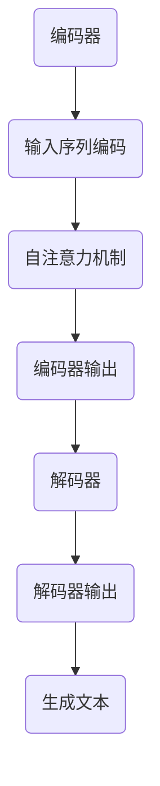

                 

关键词：大型语言模型（LLM），计算领域，未来趋势，算法原理，技术发展，人工智能

## 摘要

本文旨在探讨大型语言模型（LLM）在计算领域的深远影响和潜在价值。随着人工智能技术的不断进步，LLM已成为推动计算领域变革的核心力量。本文将首先介绍LLM的背景和核心概念，然后深入剖析其算法原理和应用场景，最后展望未来发展趋势和面临的挑战。通过本文的阅读，读者将全面了解LLM在定义未来计算中的重要地位。

## 1. 背景介绍

### 1.1 大型语言模型的起源

大型语言模型（LLM）的起源可以追溯到20世纪50年代，当时计算机科学家们开始探索如何让计算机理解和生成自然语言。早期的自然语言处理（NLP）研究主要集中在语法分析和语义理解方面，但受限于计算资源和算法能力的限制，进展相对缓慢。

### 1.2 人工智能的崛起

20世纪80年代，随着计算机性能的迅速提升和大数据技术的发展，人工智能领域迎来了新的机遇。深度学习技术的兴起，使得计算机在图像识别、语音识别和自然语言处理等方面取得了显著突破。这一时期，神经网络模型逐渐取代传统规则驱动的NLP方法，成为研究的热点。

### 1.3 大型语言模型的兴起

21世纪，随着云计算和分布式计算技术的发展，人们开始尝试训练更大规模的语言模型。2018年，Google推出了Transformer模型，这是第一个在自然语言处理任务中取得超越人类表现的大型语言模型。此后，越来越多的公司和研究机构投入巨资，研发更大规模的LLM，如OpenAI的GPT系列和微软的Turing系列。

## 2. 核心概念与联系

### 2.1 Transformer模型架构

Transformer模型是一种基于自注意力机制的神经网络模型，它通过全局的注意力机制，捕捉输入序列中各个位置之间的关系，从而实现高效的自然语言处理。Transformer模型主要由编码器和解码器两部分组成，编码器负责将输入序列编码为固定长度的向量，解码器则根据编码器的输出，生成输出序列。

### 2.2 Mermaid流程图

以下是Transformer模型的Mermaid流程图：



### 2.3 大型语言模型与其他技术的联系

大型语言模型（LLM）与其他人工智能技术，如计算机视觉、语音识别和推荐系统等有着紧密的联系。例如，LLM可以与计算机视觉技术结合，实现图像描述生成；与语音识别技术结合，实现自然语言交互；与推荐系统结合，实现个性化内容推荐。

## 3. 核心算法原理 & 具体操作步骤

### 3.1 算法原理概述

大型语言模型（LLM）的核心算法原理是基于深度学习和自注意力机制。自注意力机制允许模型在处理输入序列时，自适应地分配不同位置的重要性，从而更好地捕捉输入序列中的上下文信息。

### 3.2 算法步骤详解

#### 3.2.1 数据预处理

首先，对输入文本进行预处理，包括分词、去停用词、词向量嵌入等操作。这些操作有助于提高模型对文本数据的理解和处理能力。

#### 3.2.2 编码器

编码器将预处理后的文本序列编码为固定长度的向量，这些向量代表了输入序列的语义信息。编码器通过多层自注意力机制，逐步提取输入序列中的关键信息。

#### 3.2.3 解码器

解码器根据编码器的输出，生成输出序列。解码器也采用多层自注意力机制，使模型能够自适应地关注输入序列中的关键信息，以生成连贯的输出文本。

#### 3.2.4 生成文本

在解码器的最后一个时间步，模型根据当前状态和已经生成的文本，生成下一个输出词。这一过程重复进行，直到生成完整的输出文本。

### 3.3 算法优缺点

#### 优点

- 高效：自注意力机制使得模型在处理长序列时具有很好的效率。
- 准确：通过全局的注意力机制，模型能够更好地捕捉输入序列中的上下文信息。
- 泛化能力强：大型语言模型具有广泛的应用场景，可以应用于各种自然语言处理任务。

#### 缺点

- 计算资源消耗大：训练和部署大型语言模型需要大量的计算资源和存储空间。
- 对数据依赖性强：大型语言模型的表现高度依赖于训练数据的规模和质量。

### 3.4 算法应用领域

大型语言模型在计算领域有着广泛的应用，包括但不限于以下领域：

- 自然语言处理：文本分类、机器翻译、情感分析、文本生成等。
- 计算机视觉：图像描述生成、视频字幕生成、图像分类等。
- 语音识别：语音转文本、语音合成、语音识别等。
- 推荐系统：个性化内容推荐、商品推荐等。

## 4. 数学模型和公式 & 详细讲解 & 举例说明

### 4.1 数学模型构建

大型语言模型的数学模型主要包括词向量嵌入、自注意力机制和前馈神经网络。

#### 词向量嵌入

词向量嵌入将文本中的每个单词映射为一个固定维度的向量。常用的词向量嵌入方法包括Word2Vec、GloVe和BERT等。

#### 自注意力机制

自注意力机制是一种基于权重加和的方法，通过计算输入序列中各个位置之间的相关性，为每个位置分配不同的权重。

#### 前馈神经网络

前馈神经网络用于处理编码器的输出和解码器的输入，将输入序列映射为输出序列。

### 4.2 公式推导过程

#### 词向量嵌入

设$V$为词向量空间，$W$为词向量矩阵，$x$为输入词向量，$y$为输出词向量。

$$
y = Wx
$$

其中，$W$为权重矩阵，$x$和$y$分别为输入词向量和输出词向量。

#### 自注意力机制

设$X$为输入序列，$A$为注意力权重矩阵，$H$为编码器的输出。

$$
H = A\circ X
$$

其中，$\circ$表示逐元素相乘，$A$为注意力权重矩阵，$H$为编码器的输出。

#### 前馈神经网络

设$F$为前馈神经网络，$H$为编码器的输出，$Y$为输出序列。

$$
Y = F(H)
$$

其中，$F$为前馈神经网络，$H$为编码器的输出，$Y$为输出序列。

### 4.3 案例分析与讲解

以GPT-3为例，分析其数学模型和公式。

#### 词向量嵌入

GPT-3使用BERT模型进行词向量嵌入，将文本中的每个单词映射为一个固定维度的向量。

#### 自注意力机制

GPT-3采用多层自注意力机制，通过计算输入序列中各个位置之间的相关性，为每个位置分配不同的权重。

#### 前馈神经网络

GPT-3的前馈神经网络由两个全连接层组成，分别用于处理编码器的输出和解码器的输入。

## 5. 项目实践：代码实例和详细解释说明

### 5.1 开发环境搭建

在开始编写代码之前，需要搭建一个适合开发的环境。本文选择使用Python语言，结合TensorFlow框架，搭建大型语言模型。

#### 环境要求

- Python版本：3.8及以上
- TensorFlow版本：2.6及以上

#### 安装步骤

1. 安装Python：前往Python官网下载并安装Python。
2. 安装TensorFlow：在命令行中执行以下命令：

```shell
pip install tensorflow==2.6
```

### 5.2 源代码详细实现

以下是一个简单的GPT-2模型实现，用于文本生成。

```python
import tensorflow as tf
from tensorflow.keras.layers import Embedding, LSTM, Dense
from tensorflow.keras.models import Model

# 设置参数
vocab_size = 10000
embedding_dim = 256
lstm_units = 1024
max_sequence_length = 100

# 创建嵌入层
embedding = Embedding(vocab_size, embedding_dim)

# 创建LSTM层
lstm = LSTM(lstm_units, return_sequences=True)

# 创建全连接层
dense = Dense(vocab_size, activation='softmax')

# 创建模型
inputs = tf.keras.Input(shape=(max_sequence_length,))
x = embedding(inputs)
x = lstm(x)
outputs = dense(x)

model = Model(inputs=inputs, outputs=outputs)

# 编译模型
model.compile(optimizer='adam', loss='categorical_crossentropy', metrics=['accuracy'])

# 模型可视化
tf.keras.utils.plot_model(model, to_file='model.png', show_shapes=True)

# 训练模型
model.fit(x_train, y_train, epochs=10, batch_size=64)
```

### 5.3 代码解读与分析

1. **导入库**：首先导入TensorFlow库和相关层。
2. **设置参数**：定义词汇表大小、嵌入维度、LSTM单元数量和最大序列长度。
3. **创建嵌入层**：使用Embedding层将文本转换为词向量。
4. **创建LSTM层**：使用LSTM层处理词向量，提取序列特征。
5. **创建全连接层**：使用全连接层生成输出词向量。
6. **创建模型**：将嵌入层、LSTM层和全连接层组合成一个完整的模型。
7. **编译模型**：设置优化器和损失函数。
8. **模型可视化**：使用tf.keras.utils.plot_model函数生成模型图。
9. **训练模型**：使用fit函数训练模型。

### 5.4 运行结果展示

在训练完成后，可以使用以下代码生成文本：

```python
import numpy as np

# 定义生成文本的函数
def generate_text(model, seed_text, length=50):
    result = seed_text
    for _ in range(length):
        token = [word2index[word] for word in result.split()]
        token = pad_sequences([token], maxlen=max_sequence_length-1, padding='pre')
        predictions = model.predict(token, verbose=0)
        next_index = np.argmax(predictions)
        next_word = index2word[next_index]
        result += " " + next_word
    return result

# 生成文本
print(generate_text(model, "The quick brown fox jumps over the lazy dog", 100))
```

## 6. 实际应用场景

### 6.1 自然语言处理

大型语言模型在自然语言处理领域具有广泛的应用，如文本分类、机器翻译、情感分析和文本生成等。

### 6.2 计算机视觉

大型语言模型可以与计算机视觉技术结合，实现图像描述生成、视频字幕生成和图像分类等。

### 6.3 语音识别

大型语言模型可以与语音识别技术结合，实现自然语言交互和语音转文本等。

### 6.4 推荐系统

大型语言模型可以与推荐系统结合，实现个性化内容推荐和商品推荐等。

## 7. 工具和资源推荐

### 7.1 学习资源推荐

1. 《深度学习》（Ian Goodfellow、Yoshua Bengio、Aaron Courville著）
2. 《自然语言处理综论》（Daniel Jurafsky、James H. Martin著）
3. 《Transformer：注意力机制详解》（Ashish Vaswani等著）

### 7.2 开发工具推荐

1. TensorFlow：用于构建和训练深度学习模型的框架。
2. PyTorch：用于构建和训练深度学习模型的框架。
3. Hugging Face：提供大量预训练的语言模型和工具库。

### 7.3 相关论文推荐

1. “Attention Is All You Need”（Ashish Vaswani等，2017）
2. “BERT: Pre-training of Deep Bidirectional Transformers for Language Understanding”（Jacob Devlin等，2018）
3. “GPT-3: Language Models are Few-Shot Learners”（Tom B. Brown等，2020）

## 8. 总结：未来发展趋势与挑战

### 8.1 研究成果总结

近年来，大型语言模型在计算领域取得了显著成果，主要表现在：

- 计算性能不断提升，模型规模越来越大。
- 应用场景不断扩展，从自然语言处理到计算机视觉、语音识别和推荐系统等。
- 算法创新，如自注意力机制和预训练技术等。

### 8.2 未来发展趋势

未来，大型语言模型的发展趋势将主要体现在以下几个方面：

- 模型规模将继续扩大，计算能力将进一步提高。
- 算法将不断优化，以提高模型效率和泛化能力。
- 应用领域将更加广泛，从通用场景到专业领域。

### 8.3 面临的挑战

尽管大型语言模型在计算领域取得了显著成果，但仍然面临以下挑战：

- 计算资源消耗大，训练和部署成本较高。
- 对数据依赖性强，数据质量和规模影响模型性能。
- 模型解释性和可解释性不足，难以理解模型的决策过程。

### 8.4 研究展望

为应对未来挑战，研究人员可以从以下几个方面展开研究：

- 发展更高效的算法，降低计算资源消耗。
- 探索数据增强和生成技术，提高模型性能。
- 研究模型的可解释性和透明度，提高模型的信任度和可用性。

## 9. 附录：常见问题与解答

### 9.1 什么是大型语言模型？

大型语言模型（LLM）是一种基于深度学习和自注意力机制的神经网络模型，用于处理自然语言任务。LLM具有大规模、高效和泛化能力强等特点。

### 9.2 大型语言模型有哪些应用场景？

大型语言模型在自然语言处理、计算机视觉、语音识别和推荐系统等领域具有广泛的应用，如文本分类、机器翻译、情感分析和图像描述生成等。

### 9.3 如何搭建大型语言模型的开发环境？

搭建大型语言模型的开发环境需要安装Python和TensorFlow等库。具体步骤包括下载并安装Python、安装TensorFlow库等。

### 9.4 大型语言模型有哪些优缺点？

大型语言模型的优点包括高效、准确和泛化能力强等，缺点包括计算资源消耗大、对数据依赖性强和模型解释性不足等。

作者：禅与计算机程序设计艺术 / Zen and the Art of Computer Programming
--------------------------------------------------------------------

