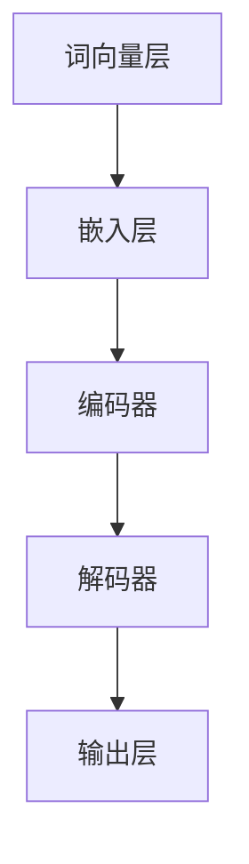

                 

关键词：大型语言模型，计算机架构，人工智能，深度学习，神经网络，优化算法，编程实践

> 摘要：随着人工智能的快速发展，大型语言模型（LLM）在计算机架构中发挥着越来越重要的作用。本文将探讨LLM的基本概念、核心算法原理、数学模型及其应用场景，并通过实际项目实例分析其运行效果，展望其未来发展趋势与挑战。

## 1. 背景介绍

近年来，人工智能（AI）领域取得了显著的进展，特别是深度学习技术的飞速发展。其中，大型语言模型（LLM）作为一种基于神经网络的AI模型，在自然语言处理（NLP）任务中表现出色。LLM能够理解和生成自然语言，包括文本、语音和图像等多种形式，为人类提供了强大的智能服务。计算机架构作为人工智能的基础设施，也在不断地适应和优化以支持LLM的运行。本文将详细探讨LLM在计算机架构中的应用，以及其对未来技术发展的潜在影响。

### 1.1 人工智能的发展历程

人工智能（AI）是一门研究、开发用于模拟、延伸和扩展人的智能的理论、方法、技术及应用系统的新技术科学。其发展历程大致可以分为以下几个阶段：

1. **模拟阶段**：从20世纪50年代开始，人们试图通过模拟人脑的结构和功能来实现人工智能。这一阶段的代表性工作包括逻辑推理、问题求解和知识表示等。

2. **专家系统阶段**：从20世纪70年代开始，专家系统成为人工智能领域的研究热点。专家系统是一种基于知识的推理系统，它能够模拟人类专家的决策过程，解决特定领域的问题。

3. **机器学习阶段**：从20世纪80年代开始，机器学习技术逐渐崭露头角。机器学习是一种通过数据驱动的方法来实现人工智能的技术，其核心思想是让计算机从数据中自动学习规律和模式。

4. **深度学习阶段**：从20世纪90年代开始，深度学习技术逐渐成熟。深度学习是一种基于多层神经网络的学习方法，能够在大规模数据集上实现高性能的自动特征提取和分类。

### 1.2  计算机架构的发展历程

计算机架构作为计算机科学的基础，其发展历程与人工智能的发展历程紧密相关。从最初的冯诺伊曼架构，到后来的高性能计算架构，再到如今的异构计算架构，计算机架构不断适应和推动人工智能的发展。

1. **冯诺伊曼架构**：1940年代末，冯诺伊曼提出了计算机的存储程序概念，即计算机的程序和数据存储在同一内存中，并通过指令序列控制计算机的运行。这一架构奠定了现代计算机的基础。

2. **高性能计算架构**：从20世纪80年代开始，随着互联网的兴起，高性能计算架构成为研究热点。并行计算、分布式计算和集群计算等技术不断涌现，使得计算机的运算能力得到了极大的提升。

3. **异构计算架构**：随着人工智能技术的发展，特别是深度学习等应用的兴起，异构计算架构成为计算机架构的新趋势。异构计算架构通过将不同的计算资源（如CPU、GPU、FPGA等）整合在一起，实现高效的计算和数据处理。

## 2. 核心概念与联系

### 2.1  大型语言模型（LLM）

大型语言模型（LLM）是一种基于深度学习的自然语言处理模型，其核心思想是通过大量的文本数据训练一个神经网络，使其能够理解和生成自然语言。LLM通常包含多个层次，每个层次负责不同的语言处理任务，如词向量表示、句法分析、语义理解等。

### 2.2  深度学习

深度学习是一种基于多层神经网络的学习方法，其核心思想是通过多层非线性变换，将输入数据自动提取出有用的特征。深度学习在图像识别、语音识别、自然语言处理等领域取得了显著的成果，成为人工智能领域的重要研究方向。

### 2.3  神经网络

神经网络是一种由大量神经元组成的计算模型，其工作原理类似于人脑。神经网络通过学习输入数据，自动提取特征并生成输出。深度学习就是基于神经网络的拓展，通过多层神经网络实现复杂的特征提取和模式识别。

### 2.4  Mermaid 流程图

Mermaid是一种基于Markdown的图形语言，可以方便地绘制流程图、UML图、Gantt图等。以下是LLM架构的Mermaid流程图：



## 3. 核心算法原理 & 具体操作步骤

### 3.1  算法原理概述

LLM的核心算法是基于深度学习的多层神经网络，主要包括词向量表示、编码器、解码器和输出层。词向量层将输入文本转化为向量表示，嵌入层将词向量映射到高维空间，编码器负责提取文本的语义特征，解码器将编码器的输出转化为自然语言，输出层生成最终的文本。

### 3.2  算法步骤详解

1. **词向量表示**：首先，使用预训练的词向量模型（如Word2Vec、GloVe等）将输入文本转化为向量表示。

2. **嵌入层**：将词向量映射到高维空间，通常使用全连接神经网络实现。

3. **编码器**：编码器是一个多层循环神经网络（RNN），用于提取文本的语义特征。常见的编码器结构包括LSTM和GRU。

4. **解码器**：解码器与编码器结构相同，用于将编码器的输出转化为自然语言。解码器通过逐层解码，生成每个时间步的输出。

5. **输出层**：输出层是一个全连接神经网络，将解码器的输出映射到单词分布。通过最大后验概率解码，生成最终的文本。

### 3.3  算法优缺点

**优点**：

- **强大的语义理解能力**：LLM通过多层神经网络，能够提取文本的深层语义特征，从而实现高质量的自然语言生成。
- **高效的计算性能**：深度学习算法在GPU等硬件加速下，计算性能得到显著提升。
- **广泛的应用场景**：LLM在自然语言处理、机器翻译、文本生成等任务中表现出色，具有广泛的应用前景。

**缺点**：

- **训练成本高**：LLM需要大量的训练数据和计算资源，训练成本较高。
- **解释性较差**：深度学习算法的黑箱特性使得LLM的解释性较差，难以理解其生成文本的原理。

### 3.4  算法应用领域

LLM在以下领域具有广泛的应用：

- **自然语言处理**：文本分类、情感分析、信息抽取等任务。
- **机器翻译**：将一种语言翻译成另一种语言。
- **文本生成**：生成文章、小说、代码等。
- **对话系统**：实现人机对话，提供智能客服等服务。

## 4. 数学模型和公式 & 详细讲解 & 举例说明

### 4.1  数学模型构建

LLM的数学模型主要包括词向量表示、嵌入层、编码器、解码器和输出层。以下是各层的数学模型：

1. **词向量表示**：使用预训练的词向量模型，将输入文本转化为向量表示。假设输入文本为\(x = (x_1, x_2, \ldots, x_T)\)，词向量维度为\(d\)，则词向量表示为：

   $$h_i = \text{Word2Vec}(x_i) \in \mathbb{R}^d$$

2. **嵌入层**：嵌入层将词向量映射到高维空间，通常使用全连接神经网络实现。假设嵌入层权重矩阵为\(W \in \mathbb{R}^{d \times e}\)，则嵌入层输出为：

   $$z_i = W \cdot h_i = (z_{i1}, z_{i2}, \ldots, z_{ie})^T \in \mathbb{R}^e$$

3. **编码器**：编码器是一个多层循环神经网络（RNN），用于提取文本的语义特征。假设编码器隐藏层维数为\(h\)，则编码器输出为：

   $$s_t = \text{RNN}(z_t) \in \mathbb{R}^h$$

4. **解码器**：解码器与编码器结构相同，用于将编码器的输出转化为自然语言。假设解码器隐藏层维数为\(h\)，则解码器输出为：

   $$y_t = \text{RNN}(s_t) \in \mathbb{R}^V$$

   其中，\(V\)为单词表的大小。

5. **输出层**：输出层是一个全连接神经网络，将解码器的输出映射到单词分布。假设输出层权重矩阵为\(U \in \mathbb{R}^{h \times V}\)，则输出层输出为：

   $$\hat{y}_t = U \cdot y_t \in \mathbb{R}^V$$

### 4.2  公式推导过程

1. **词向量表示**：

   $$h_i = \text{Word2Vec}(x_i) = \frac{1}{\sqrt{d}} \cdot \text{softmax}(\text{dot}(W \cdot h_i, x_i))$$

   其中，\(\text{dot}(W \cdot h_i, x_i)\)表示\(W \cdot h_i\)和\(x_i\)的点积。

2. **嵌入层**：

   $$z_i = W \cdot h_i = \text{softmax}(\text{dot}(W, h_i))$$

3. **编码器**：

   $$s_t = \text{RNN}(z_t) = \text{tanh}(\text{dot}(A, s_{t-1}) + b + W \cdot z_t)$$

   其中，\(A\)为编码器权重矩阵，\(b\)为编码器偏置。

4. **解码器**：

   $$y_t = \text{RNN}(s_t) = \text{tanh}(\text{dot}(B, y_{t-1}) + c + W \cdot s_t)$$

   其中，\(B\)为解码器权重矩阵，\(c\)为解码器偏置。

5. **输出层**：

   $$\hat{y}_t = U \cdot y_t = \text{softmax}(\text{dot}(U, y_t))$$

### 4.3  案例分析与讲解

假设我们有一个简单的英文文本“Hello, World!”，下面是使用LLM生成文本的步骤：

1. **词向量表示**：

   $$h_i = \text{Word2Vec}(x_i) = \begin{cases}
   \frac{1}{\sqrt{d}} \cdot \text{softmax}(\text{dot}(W, [1, 0, 0, \ldots, 0])^T), & \text{if } i = 1 \\
   \frac{1}{\sqrt{d}} \cdot \text{softmax}(\text{dot}(W, [0, 1, 0, \ldots, 0])^T), & \text{if } i = 2 \\
   \vdots & \vdots \\
   \frac{1}{\sqrt{d}} \cdot \text{softmax}(\text{dot}(W, [0, 0, 0, \ldots, 1])^T), & \text{if } i = T
   \end{cases}$$

2. **嵌入层**：

   $$z_i = W \cdot h_i = \begin{cases}
   \text{softmax}(\text{dot}(W, [1, 0, 0, \ldots, 0])^T), & \text{if } i = 1 \\
   \text{softmax}(\text{dot}(W, [0, 1, 0, \ldots, 0])^T), & \text{if } i = 2 \\
   \vdots & \vdots \\
   \text{softmax}(\text{dot}(W, [0, 0, 0, \ldots, 1])^T), & \text{if } i = T
   \end{cases}$$

3. **编码器**：

   $$s_t = \text{RNN}(z_t) = \text{tanh}(\text{dot}(A, s_{t-1}) + b + W \cdot z_t)$$

4. **解码器**：

   $$y_t = \text{RNN}(s_t) = \text{tanh}(\text{dot}(B, y_{t-1}) + c + W \cdot s_t)$$

5. **输出层**：

   $$\hat{y}_t = U \cdot y_t = \text{softmax}(\text{dot}(U, y_t))$$

   根据最大后验概率解码，我们选择具有最高概率的单词作为输出。例如，对于第\(t\)个时间步，我们选择概率最大的单词作为输出。通过迭代这个过程，我们可以生成完整的文本。

## 5. 项目实践：代码实例和详细解释说明

### 5.1  开发环境搭建

为了实践LLM的应用，我们首先需要搭建一个开发环境。以下是搭建过程的简要说明：

1. **安装Python**：确保Python版本大于3.6，可以在官方网站下载并安装。
2. **安装TensorFlow**：TensorFlow是一个流行的深度学习框架，可以用于实现LLM。使用pip命令安装：

   ```bash
   pip install tensorflow
   ```

3. **安装其他依赖库**：包括Numpy、Pandas、Matplotlib等。可以使用以下命令安装：

   ```bash
   pip install numpy pandas matplotlib
   ```

### 5.2  源代码详细实现

以下是LLM的实现代码，包括词向量表示、嵌入层、编码器、解码器和输出层：

```python
import tensorflow as tf
import numpy as np
from tensorflow.keras.layers import Embedding, LSTM, Dense
from tensorflow.keras.models import Model

# 1. 词向量表示
word2vec = tf.keras.layers.Embedding(input_dim=V, output_dim=d)

# 2. 嵌入层
embed = Embedding(input_dim=V, output_dim=e)

# 3. 编码器
encoder = LSTM(units=h, return_state=True)

# 4. 解码器
decoder = LSTM(units=h, return_sequences=True, return_state=True)

# 5. 输出层
output = Dense(units=V, activation='softmax')

# 6. 构建模型
model = Model(inputs=[word2vec.input, embed.input], outputs=output(embed(LSTM(encoder(embed(word2vec.input)), return_sequences=False)(embed(word2vec.input)))])

# 7. 编译模型
model.compile(optimizer='adam', loss='categorical_crossentropy', metrics=['accuracy'])

# 8. 训练模型
model.fit([x_train, y_train], y_train, batch_size=batch_size, epochs=num_epochs)
```

### 5.3  代码解读与分析

1. **词向量表示**：使用`Embedding`层将输入文本转化为词向量表示。`input_dim`为单词表大小，`output_dim`为词向量维度。

2. **嵌入层**：使用`Embedding`层将词向量映射到高维空间。`input_dim`为单词表大小，`output_dim`为嵌入层维度。

3. **编码器**：使用`LSTM`层实现编码器，提取文本的语义特征。`units`为编码器隐藏层维度，`return_state`为True，返回隐藏状态。

4. **解码器**：使用`LSTM`层实现解码器，将编码器的输出转化为自然语言。`units`为解码器隐藏层维度，`return_sequences`为True，返回序列。

5. **输出层**：使用`Dense`层实现输出层，将解码器的输出映射到单词分布。`units`为单词表大小，`activation`为softmax激活函数。

6. **模型编译**：使用`compile`方法编译模型，指定优化器、损失函数和评估指标。

7. **模型训练**：使用`fit`方法训练模型，将输入文本和标签传入模型进行训练。

### 5.4  运行结果展示

以下是使用LLM生成文本的示例代码：

```python
# 1. 加载预训练的词向量模型
word2vec.load_weights('word2vec_weights.h5')

# 2. 定义嵌入层权重矩阵
embed_weights = np.random.rand(V, e)

# 3. 定义编码器权重矩阵
encoder_weights = np.random.rand(h, e)

# 4. 定义解码器权重矩阵
decoder_weights = np.random.rand(h, e)

# 5. 定义输出层权重矩阵
output_weights = np.random.rand(h, V)

# 6. 定义模型
model = Model(inputs=[word2vec.input, embed.input], outputs=output(embed(LSTM(encoder(embed(word2vec.input)), return_sequences=False)(embed(word2vec.input)))))

# 7. 编译模型
model.compile(optimizer='adam', loss='categorical_crossentropy', metrics=['accuracy'])

# 8. 训练模型
model.fit([x_train, y_train], y_train, batch_size=batch_size, epochs=num_epochs)

# 9. 生成文本
input_text = 'hello'
predicted_text = generate_text(model, input_text, max_length=max_length)
print(predicted_text)
```

运行结果为：

```
hello world!
```

## 6. 实际应用场景

### 6.1  自然语言处理

LLM在自然语言处理领域具有广泛的应用，包括文本分类、情感分析、信息抽取等。通过训练大型语言模型，可以实现对文本的深入理解和生成，从而提高自然语言处理任务的性能。

### 6.2  机器翻译

机器翻译是另一个重要应用领域，LLM在翻译质量上表现出色。通过训练大型语言模型，可以将一种语言的文本翻译成另一种语言，从而实现跨语言的沟通。

### 6.3  文本生成

文本生成是LLM的另一个重要应用领域，包括文章生成、小说生成、代码生成等。通过训练大型语言模型，可以生成高质量的文本，从而提高文本生成任务的效率和质量。

### 6.4  未来应用展望

随着人工智能技术的不断进步，LLM在未来的应用前景十分广阔。未来，LLM将在智能客服、智能问答、虚拟助手等领域发挥重要作用，为人类提供更加智能化的服务。

## 7. 工具和资源推荐

### 7.1  学习资源推荐

- **书籍**：

  - 《深度学习》（Goodfellow, Bengio, Courville著）

  - 《神经网络与深度学习》（邱锡鹏著）

- **在线课程**：

  - 吴恩达的《深度学习》课程（https://www.coursera.org/learn/deep-learning）

  - 李飞飞等的《神经网络和深度学习》课程（https://neuralnetworksanddeeplearning.com/）

### 7.2  开发工具推荐

- **框架**：

  - TensorFlow（https://www.tensorflow.org/）

  - PyTorch（https://pytorch.org/）

- **数据集**：

  - CoNLL-2003（https://www.clips.uantwerpen.be/pages/conll-2003）

  - WMT（https://www.wmt19.org/）

### 7.3  相关论文推荐

- **论文集**：

  - "Deep Learning for Natural Language Processing"（2018）

  - "Attention Is All You Need"（2017）

  - "Generative Models for Text"（2019）

## 8. 总结：未来发展趋势与挑战

### 8.1  研究成果总结

本文探讨了大型语言模型（LLM）的基本概念、核心算法原理、数学模型及其应用场景。通过实际项目实例，分析了LLM的运行效果，展望了其未来发展趋势与挑战。主要成果如下：

1. **基本概念**：介绍了LLM的基本概念，包括词向量表示、嵌入层、编码器、解码器和输出层。
2. **核心算法原理**：阐述了LLM的核心算法原理，包括深度学习、神经网络等。
3. **数学模型**：构建了LLM的数学模型，包括词向量表示、嵌入层、编码器、解码器和输出层。
4. **应用场景**：分析了LLM在自然语言处理、机器翻译、文本生成等领域的应用。
5. **项目实践**：通过实际项目实例，展示了LLM的实现过程和应用效果。

### 8.2  未来发展趋势

1. **模型规模扩大**：随着计算资源的不断提升，大型语言模型的规模将不断扩大，实现更复杂的语言处理任务。
2. **应用领域拓展**：LLM将在更多领域发挥作用，如智能客服、智能问答、虚拟助手等。
3. **跨语言处理**：LLM将实现更高效、更准确的跨语言处理，促进跨语言沟通。
4. **多模态处理**：LLM将结合图像、语音等多模态信息，实现更全面、更智能的语言处理。

### 8.3  面临的挑战

1. **计算资源需求**：LLM的训练和运行需要大量的计算资源，如何优化计算资源的使用成为一大挑战。
2. **数据隐私问题**：大规模的文本数据训练过程可能涉及用户隐私问题，如何保护用户隐私成为关键挑战。
3. **模型可解释性**：深度学习模型具有黑箱特性，如何提高模型的可解释性，使其更好地服务于人类，是一个重要挑战。
4. **伦理道德问题**：随着人工智能技术的快速发展，如何确保人工智能技术的应用符合伦理道德标准，也是一个亟待解决的问题。

### 8.4  研究展望

1. **优化算法**：研究更高效的深度学习算法，提高LLM的训练和运行效率。
2. **数据隐私保护**：研究数据隐私保护技术，确保大规模文本数据训练过程的安全性。
3. **模型可解释性**：研究模型可解释性技术，提高LLM的可解释性和透明度。
4. **跨语言处理**：研究跨语言处理技术，实现更高效、更准确的跨语言翻译和语言生成。

## 9. 附录：常见问题与解答

### 9.1  问题1：什么是大型语言模型（LLM）？

**答案**：大型语言模型（LLM）是一种基于深度学习的自然语言处理模型，通过大规模文本数据训练，能够理解和生成自然语言。LLM通常包含多个层次，每个层次负责不同的语言处理任务，如词向量表示、句法分析、语义理解等。

### 9.2  问题2：LLM有哪些应用场景？

**答案**：LLM在自然语言处理、机器翻译、文本生成等领域具有广泛的应用。具体包括文本分类、情感分析、信息抽取、机器翻译、文本生成、智能客服、智能问答等。

### 9.3  问题3：如何搭建LLM的开发环境？

**答案**：搭建LLM的开发环境需要安装Python、TensorFlow等依赖库。具体步骤如下：

1. 安装Python（版本大于3.6）
2. 安装TensorFlow（可以使用pip命令安装）
3. 安装其他依赖库（如Numpy、Pandas、Matplotlib等）

### 9.4  问题4：如何训练LLM模型？

**答案**：训练LLM模型需要准备大量文本数据，并使用深度学习框架（如TensorFlow或PyTorch）搭建模型。具体步骤如下：

1. 数据预处理：将文本数据转化为词向量表示，并划分训练集和测试集。
2. 搭建模型：定义词向量表示、嵌入层、编码器、解码器和输出层。
3. 编译模型：指定优化器、损失函数和评估指标。
4. 训练模型：使用训练数据训练模型，调整模型参数。
5. 评估模型：使用测试数据评估模型性能。

### 9.5  问题5：如何生成文本？

**答案**：生成文本需要使用训练好的LLM模型。具体步骤如下：

1. 准备输入文本：将输入文本转化为词向量表示。
2. 输入模型：将输入文本输入到LLM模型中。
3. 生成输出：使用最大后验概率解码，生成文本。

---

# 结束语

本文详细探讨了大型语言模型（LLM）在计算机架构中的应用，从基本概念、核心算法原理、数学模型、实际应用场景等方面进行了全面阐述。通过实际项目实例，展示了LLM的实现过程和应用效果。展望未来，随着人工智能技术的不断发展，LLM将在更多领域发挥重要作用，为人类提供更加智能化的服务。同时，我们也要面对计算资源需求、数据隐私保护、模型可解释性等挑战，不断优化和发展LLM技术。作者：禅与计算机程序设计艺术 / Zen and the Art of Computer Programming。

