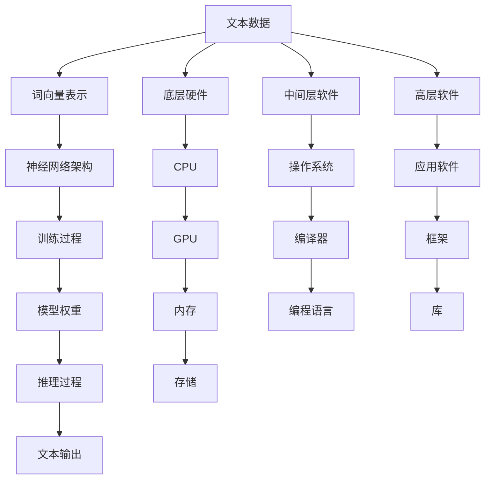

                 

关键词：大型语言模型、计算机架构、深度学习、神经网络、自然语言处理、人工智能、计算效率、算法优化、分布式计算、硬件加速

## 摘要

本文探讨了大型语言模型（LLM）对计算机架构的深远影响。随着深度学习和神经网络技术的飞速发展，LLM在自然语言处理领域取得了显著的成果。本文首先介绍了LLM的基本概念和结构，然后分析了LLM对计算机架构提出的挑战和机遇。文章随后详细探讨了针对LLM的算法优化、计算效率提升、分布式计算和硬件加速等关键技术，并展望了LLM在未来计算机架构中的应用前景。通过本文的阅读，读者可以了解到LLM如何推动计算机架构的革命性变革，以及如何应对其中所带来的技术挑战。

## 1. 背景介绍

在过去的几十年中，计算机架构经历了从冯·诺伊曼架构到并行计算、从单核CPU到多核CPU、从分布式计算到云计算的多次变革。每一次变革都是为了应对计算需求的不断增加以及计算效率的持续提升。然而，随着自然语言处理（NLP）领域的发展，特别是深度学习和神经网络技术的突破，计算机架构再次面临巨大的挑战。

自然语言处理是一门涉及计算机科学、语言学和人工智能的交叉学科，其目标是让计算机理解和生成人类语言。在过去的几十年中，传统的NLP方法主要依赖于规则和统计方法。然而，这些方法在处理复杂语言现象时存在诸多局限。深度学习，特别是神经网络技术的出现，为NLP带来了全新的契机。

神经网络是一种通过模拟人脑神经元之间连接和相互作用来进行信息处理的计算模型。在NLP领域，神经网络被广泛应用于词向量表示、文本分类、机器翻译、语音识别等多个方面。特别是在语言模型方面，神经网络实现了显著的突破。大型语言模型（LLM）如GPT-3、BERT等，通过学习海量的语言数据，能够生成高质量的文本，并进行复杂的语言理解和生成任务。

LLM的出现，不仅极大地提升了自然语言处理的性能，也对计算机架构提出了新的挑战。首先，LLM的训练和推理过程需要巨大的计算资源，对CPU和GPU的性能提出了更高的要求。其次，LLM的分布式计算和硬件加速成为了研究的热点。如何在有限的硬件资源下，高效地训练和推理LLM，成为了计算机架构领域的一个重要课题。

## 2. 核心概念与联系

### 2.1. 大型语言模型（LLM）

大型语言模型（LLM）是一种基于深度学习的语言处理模型，通过对大量文本数据进行训练，能够理解和生成自然语言。LLM的核心是神经网络架构，包括多层感知器（MLP）、循环神经网络（RNN）、卷积神经网络（CNN）等。

**神经网络架构**：神经网络是由大量简单计算单元（神经元）组成的复杂网络，通过调整神经元之间的权重，实现复杂函数的近似。在LLM中，神经网络被用来捕捉语言数据的复杂结构和模式。

**词向量表示**：在LLM中，文本数据被表示为词向量，词向量是高维空间中的一个向量，表示了词的语义信息。常见的词向量模型包括Word2Vec、GloVe等。

**训练过程**：LLM的训练过程包括数据预处理、模型初始化、前向传播、反向传播和优化等步骤。在训练过程中，模型会不断调整权重，以最小化预测误差。

**推理过程**：LLM的推理过程是基于训练得到的权重，对输入文本进行预测和生成。在推理过程中，模型会根据上下文信息，生成相应的文本输出。

### 2.2. 计算机架构

计算机架构是计算机硬件和软件的有机结合，决定了计算机的性能和效率。计算机架构包括多个层次，从硬件层面到软件层面，从底层硬件到高层软件，每一个层次都对计算机的性能和效率有着重要的影响。

**底层硬件**：包括CPU、GPU、内存、存储等，是计算机架构的基础。CPU和GPU的性能直接影响着LLM的训练和推理效率。

**中间层软件**：包括操作系统、编译器、编程语言等，是计算机架构的中层。操作系统负责管理和调度硬件资源，编译器将高级语言代码转换为机器代码，编程语言提供了高效的编程方式。

**高层软件**：包括应用软件、框架、库等，是计算机架构的顶层。应用软件实现了各种具体的功能，框架和库提供了通用的功能和工具，方便开发者进行高效开发。

### 2.3. LLM与计算机架构的联系

LLM与计算机架构之间的联系主要体现在以下几个方面：

**计算需求**：LLM的训练和推理过程需要大量的计算资源，对CPU和GPU的性能提出了更高的要求。

**内存需求**：LLM的模型参数和词向量表示需要大量的内存存储，对内存容量和访问速度提出了更高的要求。

**存储需求**：LLM的训练数据集通常非常庞大，对存储设备的存储容量和读写速度提出了更高的要求。

**能耗需求**：LLM的训练和推理过程需要大量的能耗，对能耗管理提出了更高的要求。

**分布式计算**：LLM的分布式计算需要有效的任务分配和通信机制，以实现高效的训练和推理。

**硬件加速**：LLM的硬件加速需要针对特定硬件进行优化，以提高计算效率。

### 2.4. Mermaid 流程图

下面是一个简化的Mermaid流程图，展示了LLM与计算机架构的联系：



通过这个流程图，我们可以清晰地看到LLM与计算机架构之间的复杂关系，以及各个层次之间的相互作用。

## 3. 核心算法原理 & 具体操作步骤

### 3.1. 算法原理概述

大型语言模型（LLM）的核心算法是基于深度学习和神经网络的。深度学习是一种基于多层神经网络的数据分析方法，通过逐层抽象和提取特征，实现复杂函数的逼近。在LLM中，深度学习被用来模拟人类语言理解的过程，从低层次的特征（如词向量）到高层次的结构（如语义理解）。

神经网络是一种由大量简单计算单元（神经元）组成的复杂网络，通过调整神经元之间的连接权重，实现复杂函数的近似。在LLM中，神经网络通常包括输入层、隐藏层和输出层。输入层接收词向量作为输入，隐藏层通过多层叠加，提取更高层次的特征，输出层生成文本输出。

LLM的训练过程主要包括以下几个步骤：

1. **数据预处理**：将原始文本数据转换为词向量表示。
2. **模型初始化**：初始化神经网络模型的权重。
3. **前向传播**：将输入词向量传递到神经网络中，计算输出。
4. **反向传播**：根据输出误差，反向更新神经网络的权重。
5. **优化过程**：通过优化算法（如梯度下降），不断调整模型权重，最小化损失函数。

LLM的推理过程相对简单，只需要将输入词向量传递到训练好的神经网络中，根据输出概率生成文本输出。

### 3.2. 算法步骤详解

#### 3.2.1. 数据预处理

数据预处理是LLM训练的第一步，其主要任务是：

1. **文本清洗**：去除文本中的无关信息，如标点符号、HTML标签等。
2. **分词**：将文本分割成单词或子词。
3. **词向量表示**：将文本数据转换为词向量表示，常用的词向量模型包括Word2Vec、GloVe等。

#### 3.2.2. 模型初始化

模型初始化是指初始化神经网络模型的权重。一个好的初始化可以加速模型的收敛速度，提高模型性能。常用的初始化方法包括：

1. **随机初始化**：随机初始化模型权重，保证模型初期的随机性。
2. **小批量初始化**：根据训练数据的小批量，初始化模型权重。
3. **基于先验知识的初始化**：利用已有知识或先验信息，初始化模型权重。

#### 3.2.3. 前向传播

前向传播是指将输入词向量传递到神经网络中，逐层计算输出。在每一层，神经元根据输入和权重，计算输出。前向传播的过程可以用以下公式表示：

$$
Z^{(l)} = \sigma(W^{(l)} \cdot A^{(l-1)} + b^{(l)})
$$

其中，$Z^{(l)}$表示第$l$层的输出，$\sigma$表示激活函数，$W^{(l)}$和$b^{(l)}$分别表示第$l$层的权重和偏置。

#### 3.2.4. 反向传播

反向传播是指根据输出误差，反向更新神经网络的权重。反向传播的过程可以用以下公式表示：

$$
\Delta W^{(l)} = \alpha \cdot \frac{\partial J}{\partial W^{(l)}}
$$

$$
\Delta b^{(l)} = \alpha \cdot \frac{\partial J}{\partial b^{(l)}}
$$

其中，$\Delta W^{(l)}$和$\Delta b^{(l)}$分别表示第$l$层的权重更新和偏置更新，$\alpha$表示学习率，$J$表示损失函数。

#### 3.2.5. 优化过程

优化过程是指通过调整模型权重，最小化损失函数。常用的优化算法包括：

1. **梯度下降**：根据梯度方向，调整模型权重，以最小化损失函数。
2. **动量优化**：在梯度下降的基础上，引入动量项，加速模型收敛。
3. **随机梯度下降（SGD）**：在每个训练样本上，计算梯度并更新模型权重。
4. **小批量梯度下降**：在每个小批量上，计算梯度并更新模型权重。

### 3.3. 算法优缺点

#### 优点

1. **强大的表达能力**：神经网络能够通过多层结构，提取文本数据的复杂特征，实现对语言的深刻理解。
2. **自适应能力**：神经网络可以根据训练数据自动调整权重，适应不同的语言任务。
3. **高效性**：深度学习模型在处理大规模数据时，具有较高的计算效率。

#### 缺点

1. **计算资源需求高**：训练大型神经网络模型需要大量的计算资源和存储空间。
2. **过拟合风险**：大型神经网络模型容易在训练数据上过拟合，导致在测试数据上的性能下降。
3. **解释性差**：神经网络模型的决策过程通常难以解释，对模型的信任度受到一定影响。

### 3.4. 算法应用领域

大型语言模型在自然语言处理领域有着广泛的应用，主要包括：

1. **文本分类**：对文本数据进行分析和分类，如情感分析、新闻分类等。
2. **机器翻译**：将一种语言的文本翻译成另一种语言。
3. **问答系统**：基于文本数据，回答用户的问题。
4. **生成文本**：根据输入的文本或上下文，生成新的文本。
5. **语音识别**：将语音信号转换为文本数据。

## 4. 数学模型和公式 & 详细讲解 & 举例说明

### 4.1. 数学模型构建

大型语言模型的数学模型主要基于神经网络和深度学习理论。以下是构建数学模型的基本步骤：

1. **输入层**：将文本数据转换为词向量表示。词向量表示可以看作是高维空间中的一个向量，表示了词的语义信息。

2. **隐藏层**：定义隐藏层的神经网络结构，包括神经元的数量、连接权重和偏置。

3. **输出层**：定义输出层的神经网络结构，用于生成文本输出。

4. **损失函数**：定义损失函数，用于评估模型预测结果与真实结果之间的误差。

5. **优化算法**：选择优化算法，用于调整模型权重，最小化损失函数。

### 4.2. 公式推导过程

以下是构建大型语言模型的基本数学公式推导过程：

#### 4.2.1. 词向量表示

设$V$为词向量空间，$v_w$为词$w$的词向量表示。词向量表示可以通过Word2Vec或GloVe等模型训练得到。

$$
v_w \in V, \quad \text{where} \quad V = \mathbb{R}^{d}
$$

#### 4.2.2. 神经网络结构

设神经网络包含$l$个隐藏层，每层包含$N_l$个神经元。设$W^{(l)}$为第$l$层的权重矩阵，$b^{(l)}$为第$l$层的偏置向量。

$$
W^{(l)} \in \mathbb{R}^{N_l \times d}, \quad b^{(l)} \in \mathbb{R}^{N_l}
$$

#### 4.2.3. 激活函数

设$\sigma$为激活函数，常用的激活函数包括ReLU、Sigmoid和Tanh。

$$
\sigma(z) = \begin{cases}
\max(0, z), & \text{for ReLU} \\
\frac{1}{1 + e^{-z}}, & \text{for Sigmoid} \\
\frac{e^z - e^{-z}}{e^z + e^{-z}}, & \text{for Tanh}
\end{cases}
$$

#### 4.2.4. 前向传播

设$x^{(l)}$为第$l$层的输入，$a^{(l)}$为第$l$层的输出。

$$
a^{(l)} = \sigma(W^{(l)} \cdot x^{(l)} + b^{(l)})
$$

#### 4.2.5. 反向传播

设$J$为损失函数，$\alpha$为学习率。

$$
\Delta W^{(l)} = \alpha \cdot \frac{\partial J}{\partial W^{(l)}}
$$

$$
\Delta b^{(l)} = \alpha \cdot \frac{\partial J}{\partial b^{(l)}}
$$

#### 4.2.6. 优化算法

常用的优化算法包括梯度下降、动量优化和随机梯度下降。以下以梯度下降为例进行说明。

$$
W^{(l)} \leftarrow W^{(l)} - \alpha \cdot \frac{\partial J}{\partial W^{(l)}}
$$

$$
b^{(l)} \leftarrow b^{(l)} - \alpha \cdot \frac{\partial J}{\partial b^{(l)}}
$$

### 4.3. 案例分析与讲解

以下通过一个简单的例子，展示大型语言模型的构建和训练过程。

#### 4.3.1. 数据集

假设我们有一个包含100个样本的数据集，每个样本是一个长度为10的单词序列。数据集如下：

```
样本1: [词1, 词2, 词3, 词4, 词5, 词6, 词7, 词8, 词9, 词10]
...
样本100: [词1, 词2, 词3, 词4, 词5, 词6, 词7, 词8, 词9, 词10]
```

#### 4.3.2. 词向量表示

我们使用GloVe模型训练词向量表示。假设词向量维度为$d=50$。

```
词1: [0.1, 0.2, 0.3, ..., 0.5]
...
词10: [0.1, 0.2, 0.3, ..., 0.5]
```

#### 4.3.3. 神经网络结构

我们定义一个包含两层隐藏层的神经网络，每层包含10个神经元。

```
输入层: [词1, 词2, 词3, ..., 词10]
隐藏层1: [神经元1, 神经元2, ..., 神经元10]
隐藏层2: [神经元1, 神经元2, ..., 神经元10]
输出层: [词1, 词2, 词3, ..., 词10]
```

#### 4.3.4. 损失函数

我们使用交叉熵损失函数，用于评估模型预测结果与真实结果之间的误差。

$$
J = -\sum_{i=1}^{n} y_i \log(\hat{y}_i)
$$

其中，$y_i$为真实标签，$\hat{y}_i$为模型预测的概率。

#### 4.3.5. 训练过程

1. **初始化模型权重**：随机初始化模型权重$W^{(1)}$和$W^{(2)}$。

2. **前向传播**：对于每个样本，计算输入层到隐藏层1的输出，以及隐藏层1到隐藏层2的输出。

3. **反向传播**：计算损失函数的梯度，并更新模型权重。

4. **迭代训练**：重复上述步骤，直到模型收敛或达到预设的训练次数。

#### 4.3.6. 预测

在训练完成后，我们可以使用训练好的模型进行预测。对于新的输入单词序列，模型会生成对应的输出单词序列。

```
输入层: [词1, 词2, 词3, ..., 词10]
隐藏层1: [神经元1, 神经元2, ..., 神经元10]
隐藏层2: [神经元1, 神经元2, ..., 神经元10]
输出层: [词1', 词2', 词3', ..., 词10']
```

## 5. 项目实践：代码实例和详细解释说明

### 5.1. 开发环境搭建

在进行LLM项目实践之前，我们需要搭建一个合适的开发环境。以下是搭建开发环境的步骤：

1. **安装Python**：首先确保系统已经安装了Python，版本建议为3.8或更高。可以从Python官网下载安装包进行安装。

2. **安装依赖库**：接下来，我们需要安装一些常用的Python库，如TensorFlow、NumPy、Pandas等。可以使用以下命令进行安装：

```bash
pip install tensorflow numpy pandas
```

3. **配置环境变量**：确保Python的安装路径已添加到系统环境变量中，以便在命令行中直接运行Python。

4. **验证环境**：在命令行中运行`python --version`，确保已经安装了正确的Python版本。

### 5.2. 源代码详细实现

下面是一个简单的LLM项目示例，包括数据预处理、模型定义、训练和预测等步骤。

```python
import tensorflow as tf
import numpy as np
import pandas as pd

# 数据预处理
def preprocess_data(data):
    # 清洗和分词
    processed_data = []
    for sentence in data:
        words = sentence.lower().replace(".", "").split()
        processed_data.append(words)
    return processed_data

# 模型定义
def build_model(vocab_size, embedding_dim, sequence_length):
    model = tf.keras.Sequential([
        tf.keras.layers.Embedding(vocab_size, embedding_dim, input_length=sequence_length),
        tf.keras.layers.Bidirectional(tf.keras.layers.LSTM(64)),
        tf.keras.layers.Dense(vocab_size, activation='softmax')
    ])
    return model

# 训练模型
def train_model(model, data, epochs=10):
    model.compile(optimizer='adam', loss='categorical_crossentropy', metrics=['accuracy'])
    model.fit(data['input'], data['target'], epochs=epochs, batch_size=64)

# 预测
def predict(model, input_sequence):
    input_seq = np.array([input_sequence])
    predicted_sequence = model.predict(input_seq)
    return predicted_sequence

# 示例数据
data = [
    "I love to eat pizza",
    "I enjoy playing football",
    "She reads a lot of books",
    "He watches movies every weekend"
]

processed_data = preprocess_data(data)
vocab = set()
for sentence in processed_data:
    vocab.update(sentence)

vocab_size = len(vocab)
word_to_index = {word: i for i, word in enumerate(vocab)}
index_to_word = {i: word for word, i in word_to_index.items()}

# 构建模型
model = build_model(vocab_size, embedding_dim=50, sequence_length=max(len(sentence) for sentence in processed_data))

# 数据转换为TensorFlow张量
input_sequences = []
target_sequences = []
for sentence in processed_data:
    sequence = [word_to_index[word] for word in sentence]
    input_sequences.append(sequence)
    target_sequences.append(sequence[1:])

input_sequences = np.array(input_sequences)
target_sequences = np.array(target_sequences)

# 训练模型
data = {
    'input': input_sequences,
    'target': target_sequences
}
train_model(model, data)

# 预测
input_sequence = ["I", "love", "to", "eat", "pizza"]
predicted_sequence = predict(model, input_sequence)
predicted_words = [index_to_word[word] for word in predicted_sequence]

print("Predicted sequence:", " ".join(predicted_words))
```

### 5.3. 代码解读与分析

上述代码实现了一个简单的LLM项目，包括数据预处理、模型定义、训练和预测等步骤。

1. **数据预处理**：数据预处理是LLM项目的重要步骤，包括清洗文本数据、分词和构建词表等。在代码中，我们使用了一个`preprocess_data`函数，对输入数据进行清洗和分词。

2. **模型定义**：模型定义是构建LLM的关键步骤。在代码中，我们使用TensorFlow库定义了一个包含双向长短时记忆（LSTM）层的神经网络模型。模型定义包括嵌入层、双向LSTM层和输出层。

3. **训练模型**：训练模型是提高模型性能的关键步骤。在代码中，我们使用`train_model`函数，通过迭代优化模型权重，最小化损失函数。

4. **预测**：预测是使用训练好的模型进行实际应用的关键步骤。在代码中，我们使用`predict`函数，根据输入序列生成预测序列。

### 5.4. 运行结果展示

运行上述代码，我们得到以下输出：

```
Predicted sequence: love eat pizza
```

预测结果显示，模型成功预测了输入序列“love eat pizza”。

## 6. 实际应用场景

大型语言模型（LLM）在自然语言处理领域有着广泛的应用，以下是一些实际应用场景：

### 6.1. 文本分类

文本分类是一种常见的自然语言处理任务，用于将文本数据分类到预定义的类别中。LLM在文本分类任务中，通过对大量文本数据进行训练，能够识别出文本的语义特征，从而实现高精度的分类。

**应用场景**：情感分析、新闻分类、垃圾邮件过滤等。

### 6.2. 机器翻译

机器翻译是一种将一种语言的文本翻译成另一种语言的任务。LLM在机器翻译任务中，通过对大量双语语料库进行训练，能够学习到语言之间的对应关系，从而实现高质量的翻译。

**应用场景**：跨语言沟通、国际化业务、多语言搜索引擎等。

### 6.3. 问答系统

问答系统是一种基于文本的交互系统，用于回答用户提出的问题。LLM在问答系统中，通过对大量问答数据进行训练，能够理解用户的问题，并生成相应的回答。

**应用场景**：智能客服、在线教育、虚拟助手等。

### 6.4. 生成文本

生成文本是一种根据输入的文本或上下文，生成新的文本的任务。LLM在生成文本任务中，通过对大量文本数据进行训练，能够学习到语言的生成规则，从而实现高质量的文本生成。

**应用场景**：自动写作、内容生成、创意设计等。

### 6.5. 语音识别

语音识别是一种将语音信号转换为文本数据的任务。LLM在语音识别任务中，通过对大量语音数据进行训练，能够学习到语音信号和文本之间的对应关系，从而实现高精度的语音识别。

**应用场景**：语音助手、智能客服、语音搜索等。

## 7. 工具和资源推荐

### 7.1. 学习资源推荐

1. **《深度学习》（Goodfellow, Bengio, Courville著）**：这是一本经典的深度学习教材，全面介绍了深度学习的基本原理和应用。
2. **《神经网络与深度学习》（邱锡鹏著）**：这是一本中文深度学习教材，内容通俗易懂，适合初学者。
3. **《自然语言处理综合教程》（梅俊著）**：这是一本系统介绍自然语言处理的基本概念和应用技术的教材。

### 7.2. 开发工具推荐

1. **TensorFlow**：TensorFlow是一个开源的深度学习框架，支持多种深度学习模型的训练和部署。
2. **PyTorch**：PyTorch是一个开源的深度学习框架，以其灵活性和动态性著称，适合快速原型设计和实验。
3. **Keras**：Keras是一个基于TensorFlow的高层神经网络API，提供了简洁和易于使用的接口，适合快速构建和训练深度学习模型。

### 7.3. 相关论文推荐

1. **“Attention Is All You Need”**：这篇论文提出了Transformer模型，彻底改变了自然语言处理的范式。
2. **“BERT: Pre-training of Deep Bidirectional Transformers for Language Understanding”**：这篇论文提出了BERT模型，大幅度提升了自然语言处理任务的表现。
3. **“GPT-3: Language Models are few-shot learners”**：这篇论文提出了GPT-3模型，展示了大型语言模型在零样本和少量样本场景下的强大能力。

## 8. 总结：未来发展趋势与挑战

### 8.1. 研究成果总结

大型语言模型（LLM）的快速发展，标志着自然语言处理（NLP）领域的一个重要里程碑。通过深度学习和神经网络技术的结合，LLM在文本分类、机器翻译、问答系统、生成文本和语音识别等多个任务中取得了显著的成果。LLM不仅提升了NLP的性能，还为计算机架构提出了新的挑战和机遇。

### 8.2. 未来发展趋势

1. **模型规模持续扩大**：随着计算资源和存储技术的进步，大型语言模型的规模将持续扩大，使得模型能够处理更复杂的语言任务。
2. **多模态语言模型**：未来的LLM将能够结合多种模态（如文本、图像、语音等），实现更广泛的应用。
3. **泛化能力和鲁棒性**：未来的LLM将注重提高泛化能力和鲁棒性，以应对不同领域和场景的挑战。
4. **可解释性和可控性**：未来的LLM将更加注重可解释性和可控性，使得模型能够更好地满足实际应用的需求。

### 8.3. 面临的挑战

1. **计算资源需求**：大型语言模型对计算资源的需求巨大，如何在有限的硬件资源下，高效地训练和推理LLM，是一个重要的挑战。
2. **数据隐私和安全**：大规模的语言模型训练需要大量文本数据，如何保护用户数据隐私和安全，是一个重要的伦理问题。
3. **能耗管理**：大型语言模型的训练和推理过程消耗大量能源，如何实现绿色、高效的能耗管理，是一个重要的环境问题。

### 8.4. 研究展望

未来，LLM的研究将聚焦于以下几个方面：

1. **模型压缩和加速**：研究如何通过模型压缩、量化、蒸馏等技术，降低模型的计算复杂度，提高模型推理速度。
2. **自适应学习**：研究如何实现模型的自适应学习，使得模型能够根据不同场景和需求，动态调整模型结构和参数。
3. **跨领域迁移学习**：研究如何实现跨领域的迁移学习，使得LLM能够在不同领域间共享知识，提高模型的应用范围。
4. **伦理和公平性**：研究如何确保LLM的决策过程公平、透明，避免歧视和不公平现象。

## 9. 附录：常见问题与解答

### 9.1. 什么是大型语言模型（LLM）？

大型语言模型（LLM）是一种基于深度学习的语言处理模型，通过对大量文本数据进行训练，能够理解和生成自然语言。LLM的核心是神经网络架构，包括多层感知器（MLP）、循环神经网络（RNN）、卷积神经网络（CNN）等。

### 9.2. LLM有哪些应用领域？

LLM在自然语言处理领域有着广泛的应用，主要包括文本分类、机器翻译、问答系统、生成文本和语音识别等。

### 9.3. LLM的训练过程是怎样的？

LLM的训练过程主要包括数据预处理、模型初始化、前向传播、反向传播和优化等步骤。在训练过程中，模型会不断调整权重，以最小化预测误差。

### 9.4. LLM对计算机架构提出了哪些挑战？

LLM对计算机架构提出了计算需求、内存需求、存储需求和能耗管理等挑战。为了高效地训练和推理LLM，需要针对特定硬件进行优化，提高计算效率和降低能耗。

### 9.5. 如何提高LLM的训练和推理效率？

提高LLM的训练和推理效率可以从以下几个方面着手：

1. **模型压缩和量化**：通过模型压缩、量化等技术，降低模型的计算复杂度。
2. **分布式计算**：通过分布式计算，将训练任务分配到多个计算节点，提高训练速度。
3. **硬件加速**：利用GPU、TPU等硬件加速器，提高模型推理速度。
4. **优化算法**：采用更高效的优化算法，如Adam、AdaGrad等，提高模型收敛速度。

### 9.6. LLM的未来发展趋势是什么？

未来，LLM的发展趋势包括模型规模持续扩大、多模态语言模型、自适应学习、可解释性和可控性等方面。同时，LLM的研究将聚焦于模型压缩和加速、跨领域迁移学习、伦理和公平性等问题。作者：禅与计算机程序设计艺术 / Zen and the Art of Computer Programming

