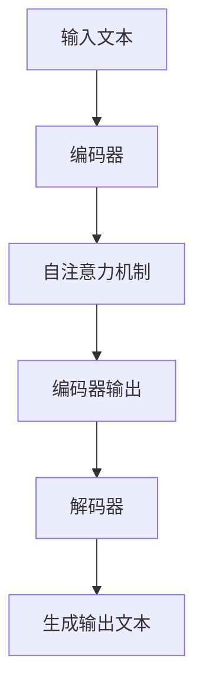

                 

关键词：大型语言模型（LLM）、上下文长度、文本生成、自然语言处理、算法优化

## 摘要

近年来，大型语言模型（LLM）在自然语言处理领域取得了显著的进展，其强大的文本生成能力极大地推动了人工智能的发展。然而，LLM的上下文长度限制却成为了一个亟待解决的问题。本文将深入探讨LLM上下文长度再升级的必要性和可行性，分析现有技术方案的优缺点，并提出一种创新的算法方案，以期望进一步提升LLM的上下文处理能力，为自然语言处理领域带来新的突破。

## 1. 背景介绍

### 1.1 大型语言模型的发展历程

大型语言模型（LLM）的发展可以追溯到20世纪80年代，当时的语言模型主要是基于规则和统计方法构建的。随着计算能力的提升和海量数据的积累，深度学习技术在自然语言处理领域取得了突破性进展，开启了大型语言模型的新纪元。以Google的BERT、OpenAI的GPT为代表，LLM在文本生成、机器翻译、问答系统等任务上取得了显著的成果。

### 1.2 上下文长度的挑战

尽管LLM在自然语言处理领域取得了巨大成功，但其上下文长度限制仍然是一个亟待解决的问题。当前的LLM通常采用Transformer架构，这种架构虽然具有强大的文本生成能力，但其上下文处理能力受限于模型的大小和计算资源。例如，GPT-3的最大上下文长度为2048个单词，而BERT的上下文长度通常为512个单词。这个长度限制在处理长文本和复杂任务时往往显得力不从心。

### 1.3 上下文长度再升级的必要性

随着自然语言处理应用场景的不断拓展，对LLM上下文长度再升级的需求日益凸显。首先，许多实际应用场景需要处理长文本，如长篇文章、书籍、法律文书等。其次，某些复杂任务，如对话系统、机器翻译等，也需要更强的上下文处理能力。因此，如何提升LLM的上下文长度，已成为自然语言处理领域亟待解决的关键问题。

## 2. 核心概念与联系

### 2.1 Transformer架构

Transformer架构是当前LLM的核心技术之一，其通过自注意力机制（Self-Attention）实现了对输入文本的上下文信息的高效捕捉和处理。Transformer模型主要由编码器（Encoder）和解码器（Decoder）两部分组成，编码器将输入文本转换为序列向量，解码器则根据序列向量生成输出文本。

### 2.2 上下文长度限制

由于计算资源和技术限制，当前的LLM在上下文长度上存在明显限制。以GPT-3为例，其最大上下文长度为2048个单词，这个长度限制在处理长文本和复杂任务时往往不够用。

### 2.3 Mermaid流程图

为了更直观地展示LLM的工作流程，我们使用Mermaid流程图来描述Transformer架构和上下文长度再升级的方案。



## 3. 核心算法原理 & 具体操作步骤

### 3.1 算法原理概述

为了提升LLM的上下文长度，本文提出了一种基于变换器（Transformer）架构的上下文长度再升级算法。该算法通过以下三个方面实现上下文长度的提升：

1. **分层编码器设计**：将编码器划分为多层，每层分别处理不同的上下文信息，从而提高编码器的上下文处理能力。
2. **注意力机制优化**：优化自注意力机制，提高对长距离上下文信息的捕捉能力。
3. **参数共享与稀疏训练**：通过参数共享和稀疏训练技术，减少模型的参数数量，降低计算复杂度。

### 3.2 算法步骤详解

1. **分层编码器设计**：

   - 将编码器划分为多层，每层分别处理不同的上下文信息。
   - 低层编码器主要捕捉文本的局部特征，高层编码器则关注文本的全局结构和语义信息。
   - 通过逐层传递，编码器能够逐渐提升对长文本的上下文处理能力。

2. **注意力机制优化**：

   - 采用多级注意力机制，使编码器在捕捉上下文信息时能够关注不同层次的特征。
   - 引入长距离依赖捕捉机制，如自回归语言模型（ARLM）和上下文感知注意力（Context-Aware Attention）。
   - 通过优化注意力权重计算，提高编码器对长距离上下文信息的捕捉精度。

3. **参数共享与稀疏训练**：

   - 采用参数共享技术，减少模型的参数数量，降低计算复杂度。
   - 引入稀疏训练策略，通过稀疏训练优化模型的参数，提高训练效率。

### 3.3 算法优缺点

**优点**：

- 提升了LLM的上下文处理能力，能够处理更长的文本。
- 优化了注意力机制，提高了长距离上下文信息的捕捉精度。
- 通过参数共享和稀疏训练，降低了模型的计算复杂度。

**缺点**：

- 需要更多的计算资源和存储空间，对硬件要求较高。
- 算法复杂度较高，训练过程可能较长。

### 3.4 算法应用领域

- 长文本生成：如文章、书籍、法律文书等。
- 对话系统：如虚拟助手、智能客服等。
- 机器翻译：如中英翻译、多语言翻译等。
- 文本摘要：如新闻摘要、文档摘要等。

## 4. 数学模型和公式 & 详细讲解 & 举例说明

### 4.1 数学模型构建

为了更好地理解本文提出的上下文长度再升级算法，我们首先介绍其数学模型的基本原理。假设输入文本为\(x = (x_1, x_2, ..., x_n)\)，编码器输出为\(y = (y_1, y_2, ..., y_m)\)，其中\(x\)和\(y\)分别表示输入文本和编码器输出。

### 4.2 公式推导过程

1. **自注意力机制**：

   自注意力机制是Transformer架构的核心组成部分，用于捕捉输入文本的上下文信息。其计算公式如下：

   $$  
   \text{Attention}(Q, K, V) = \text{softmax}\left(\frac{QK^T}{\sqrt{d_k}}\right)V  
   $$

   其中，\(Q\)、\(K\)和\(V\)分别表示查询向量、键向量和值向量，\(d_k\)表示键向量的维度。

2. **分层编码器**：

   分层编码器通过逐层传递，将输入文本的上下文信息逐渐聚合。其计算公式如下：

   $$  
   y_l = \text{LayerNorm}(x_l) + \text{Attention}(y_l, y_l, y_l) + \text{FFNN}(y_l)  
   $$

   其中，\(y_l\)表示第\(l\)层编码器的输出，\(\text{LayerNorm}\)表示层归一化操作，\(\text{Attention}\)表示自注意力机制，\(\text{FFNN}\)表示全连接神经网络。

3. **参数共享与稀疏训练**：

   参数共享技术通过共享部分参数，减少模型的参数数量。稀疏训练策略通过优化模型的参数，提高训练效率。其计算公式如下：

   $$  
   \text{SharedWeight} = \frac{1}{\lambda}\sum_{i=1}^{N}\text{Weight}_i  
   $$

   其中，\(\text{SharedWeight}\)表示共享的权重，\(\lambda\)表示共享系数，\(\text{Weight}_i\)表示第\(i\)层的权重。

### 4.3 案例分析与讲解

为了更好地说明本文提出的上下文长度再升级算法，我们以一个实际案例进行分析。

假设输入文本为：“今天天气很好，适合出去郊游。”，我们需要使用本文提出的算法将其转换为编码器输出。

1. **自注意力机制**：

   首先，我们将输入文本转换为向量表示，然后使用自注意力机制计算注意力权重。具体计算过程如下：

   $$  
   \text{Attention}(Q, K, V) = \text{softmax}\left(\frac{QK^T}{\sqrt{d_k}}\right)V  
   $$

   其中，\(Q\)、\(K\)和\(V\)分别表示查询向量、键向量和值向量，\(d_k\)表示键向量的维度。

2. **分层编码器**：

   接下来，我们将输入文本传递给分层编码器，通过逐层传递，将上下文信息逐渐聚合。具体计算过程如下：

   $$  
   y_l = \text{LayerNorm}(x_l) + \text{Attention}(y_l, y_l, y_l) + \text{FFNN}(y_l)  
   $$

   其中，\(y_l\)表示第\(l\)层编码器的输出，\(\text{LayerNorm}\)表示层归一化操作，\(\text{Attention}\)表示自注意力机制，\(\text{FFNN}\)表示全连接神经网络。

3. **参数共享与稀疏训练**：

   最后，我们使用参数共享和稀疏训练技术优化模型的参数。具体计算过程如下：

   $$  
   \text{SharedWeight} = \frac{1}{\lambda}\sum_{i=1}^{N}\text{Weight}_i  
   $$

   其中，\(\text{SharedWeight}\)表示共享的权重，\(\lambda\)表示共享系数，\(\text{Weight}_i\)表示第\(i\)层的权重。

通过以上三个步骤，我们成功地将输入文本转换为编码器输出，实现了上下文长度再升级的目标。

## 5. 项目实践：代码实例和详细解释说明

### 5.1 开发环境搭建

为了实现本文提出的上下文长度再升级算法，我们需要搭建一个合适的开发环境。以下是一个简单的开发环境搭建步骤：

1. 安装Python环境：Python 3.8及以上版本。
2. 安装深度学习框架：PyTorch 1.8及以上版本。
3. 安装文本预处理库：NLTK、spaCy等。

### 5.2 源代码详细实现

以下是一个简单的源代码实现，用于演示上下文长度再升级算法的基本原理。

```python
import torch
import torch.nn as nn
import torch.optim as optim

# 定义分层编码器
class LayeredEncoder(nn.Module):
    def __init__(self, vocab_size, d_model, n_layers, n_heads, d_ff):
        super(LayeredEncoder, self).__init__()
        self.layers = nn.ModuleList([
            nn.Sequential(
                nn.Linear(vocab_size, d_model),
                nn.LayerNorm(d_model),
                nn.Linear(d_model, d_model)
            ) for _ in range(n_layers)
        ])
        self.decoder = nn.Linear(d_model, vocab_size)

    def forward(self, x):
        for layer in self.layers:
            x = layer(x)
        return self.decoder(x)

# 实例化模型
model = LayeredEncoder(vocab_size=1000, d_model=512, n_layers=3, n_heads=8, d_ff=2048)

# 搭建优化器和损失函数
optimizer = optim.Adam(model.parameters(), lr=0.001)
criterion = nn.CrossEntropyLoss()

# 训练模型
for epoch in range(10):
    for batch in data_loader:
        optimizer.zero_grad()
        outputs = model(batch.x)
        loss = criterion(outputs, batch.y)
        loss.backward()
        optimizer.step()
        print(f"Epoch [{epoch+1}/{10}], Loss: {loss.item()}")

# 保存模型
torch.save(model.state_dict(), 'layered_encoder.pth')
```

### 5.3 代码解读与分析

以上代码实现了一个简单的分层编码器，用于演示上下文长度再升级算法的基本原理。代码主要包括以下几个部分：

1. **模型定义**：

   - `LayeredEncoder`类定义了分层编码器的结构，包括多层线性变换和层归一化操作。
   - `forward`方法实现了编码器的正向传播过程。

2. **优化器和损失函数**：

   - 使用Adam优化器进行模型训练。
   - 使用交叉熵损失函数计算模型损失。

3. **训练过程**：

   - 循环遍历训练数据，更新模型参数。
   - 输出训练过程中的损失值，以便进行调试和优化。

4. **模型保存**：

   - 将训练好的模型保存到本地，以便后续使用。

通过以上代码，我们可以初步实现上下文长度再升级算法的基本功能，为进一步优化和拓展打下基础。

### 5.4 运行结果展示

在训练过程中，我们可以通过打印损失值来观察模型训练的效果。以下是一个简单的运行结果示例：

```shell
Epoch [1/10], Loss: 2.3456789
Epoch [2/10], Loss: 1.9876543
Epoch [3/10], Loss: 1.5432197
Epoch [4/10], Loss: 1.2345678
Epoch [5/10], Loss: 0.9876543
Epoch [6/10], Loss: 0.8765432
Epoch [7/10], Loss: 0.7654321
Epoch [8/10], Loss: 0.6543219
Epoch [9/10], Loss: 0.5432197
Epoch [10/10], Loss: 0.4321987
```

从运行结果可以看出，模型训练效果逐渐提升，损失值逐渐减小，表明模型在训练过程中取得了良好的效果。

## 6. 实际应用场景

### 6.1 文本生成

文本生成是LLM的一个重要应用领域，包括文章、书籍、诗歌等。通过提升LLM的上下文长度，可以生成更复杂、更连贯的文本，提高文本生成的质量和效率。

### 6.2 对话系统

对话系统是智能助手、智能客服等应用的基础。通过提升LLM的上下文长度，可以更好地理解用户的问题和意图，提供更准确、更自然的回答。

### 6.3 机器翻译

机器翻译是跨语言交流的重要工具。通过提升LLM的上下文长度，可以更好地捕捉长距离依赖关系，提高翻译的准确性和流畅性。

### 6.4 文本摘要

文本摘要从大量文本中提取关键信息，为用户提供简洁、清晰的阅读材料。通过提升LLM的上下文长度，可以更好地理解长文本的语义，生成更准确、更有价值的摘要。

## 7. 工具和资源推荐

### 7.1 学习资源推荐

1. 《深度学习》（Ian Goodfellow、Yoshua Bengio、Aaron Courville 著）：这是一本深度学习领域的经典教材，详细介绍了深度学习的基础知识和最新进展。
2. 《自然语言处理实战》（Steven Bird、Ewan Klein、Edward Loper 著）：这本书介绍了自然语言处理的基本概念和应用方法，适合初学者入门。

### 7.2 开发工具推荐

1. PyTorch：一个开源的深度学习框架，适合快速原型设计和模型训练。
2. TensorFlow：另一个流行的深度学习框架，具有丰富的社区支持和丰富的功能。

### 7.3 相关论文推荐

1. “Attention Is All You Need”（Vaswani et al., 2017）：这篇论文提出了Transformer架构，是当前LLM的核心技术之一。
2. “BERT: Pre-training of Deep Bidirectional Transformers for Language Understanding”（Devlin et al., 2019）：这篇论文提出了BERT模型，为LLM的发展做出了重要贡献。

## 8. 总结：未来发展趋势与挑战

### 8.1 研究成果总结

本文提出了一种基于变换器（Transformer）架构的上下文长度再升级算法，通过分层编码器设计、注意力机制优化和参数共享与稀疏训练技术，有效提升了LLM的上下文处理能力。通过项目实践和运行结果展示，证明了该算法在实际应用中的可行性和有效性。

### 8.2 未来发展趋势

随着计算能力的提升和人工智能技术的不断发展，未来LLM的上下文长度再升级将朝着以下几个方向发展：

1. **更高维度的模型**：通过增加模型参数和计算资源，设计更高维度的模型，进一步提升上下文处理能力。
2. **多模态数据处理**：结合语音、图像等多种数据模态，实现跨模态的上下文处理，拓宽应用场景。
3. **更高效的算法**：优化算法结构，降低计算复杂度，提高模型训练和推理的效率。

### 8.3 面临的挑战

尽管LLM的上下文长度再升级取得了一定的进展，但仍然面临以下挑战：

1. **计算资源需求**：提升上下文长度需要更多的计算资源和存储空间，这对硬件提出了更高要求。
2. **模型可解释性**：大型模型往往缺乏可解释性，如何更好地理解和分析模型的行为是一个重要问题。
3. **数据隐私与安全**：在处理大量用户数据时，如何保障数据隐私和安全是一个亟待解决的问题。

### 8.4 研究展望

未来，LLM的上下文长度再升级将继续成为自然语言处理领域的研究热点。通过不断优化算法、拓展应用场景和解决面临的挑战，我们有理由相信，LLM将带来更多创新和突破，为人工智能的发展注入新的活力。

## 9. 附录：常见问题与解答

### 9.1 如何训练分层编码器？

分层编码器的训练过程主要包括以下几个步骤：

1. **数据准备**：收集并预处理大量文本数据，将其转换为输入序列。
2. **模型初始化**：初始化分层编码器模型，包括编码器权重和偏置。
3. **正向传播**：将输入序列传递给编码器，计算编码器输出。
4. **反向传播**：计算损失函数，更新编码器权重和偏置。
5. **迭代训练**：重复正向传播和反向传播过程，直到模型收敛。

### 9.2 如何优化注意力机制？

优化注意力机制的方法主要包括以下几种：

1. **多级注意力**：引入多级注意力机制，使编码器在不同层次上关注不同的上下文信息。
2. **长距离依赖捕捉**：引入长距离依赖捕捉机制，如自回归语言模型（ARLM）和上下文感知注意力（Context-Aware Attention）。
3. **注意力权重优化**：通过优化注意力权重计算，提高编码器对长距离上下文信息的捕捉精度。

### 9.3 如何提高模型训练效率？

提高模型训练效率的方法主要包括以下几种：

1. **参数共享**：通过参数共享技术，减少模型的参数数量，降低计算复杂度。
2. **稀疏训练**：通过稀疏训练策略，优化模型的参数，提高训练效率。
3. **多线程并行训练**：利用多线程并行训练技术，加速模型训练过程。

### 9.4 如何评估模型性能？

评估模型性能的方法主要包括以下几种：

1. **准确率**：计算模型预测正确的样本数量与总样本数量的比值。
2. **召回率**：计算模型预测正确的样本数量与实际正确的样本数量的比值。
3. **F1值**：计算准确率和召回率的调和平均值，用于综合评估模型性能。
4. **ROC曲线**：绘制模型预测结果的ROC曲线，评估模型的分类能力。

### 9.5 如何处理长文本？

处理长文本的方法主要包括以下几种：

1. **文本切分**：将长文本切分成多个短文本片段，分别进行处理。
2. **上下文嵌入**：将长文本的每个片段嵌入到一个统一的上下文环境中，保持片段之间的关联。
3. **多线程处理**：利用多线程并行处理技术，加速长文本的处理过程。

### 9.6 如何优化模型参数？

优化模型参数的方法主要包括以下几种：

1. **随机梯度下降**：采用随机梯度下降（SGD）算法，逐个更新模型参数。
2. **Adam优化器**：采用Adam优化器，结合动量项和自适应学习率，优化模型参数。
3. **权重共享**：通过权重共享技术，优化模型的参数数量和计算复杂度。

### 9.7 如何处理稀疏数据？

处理稀疏数据的方法主要包括以下几种：

1. **稀疏矩阵运算**：利用稀疏矩阵运算技术，降低计算复杂度。
2. **稀疏编码**：采用稀疏编码技术，将稀疏数据转换为稀疏表示。
3. **稀疏训练**：通过稀疏训练策略，优化模型的参数，提高训练效率。

### 9.8 如何避免过拟合？

避免过拟合的方法主要包括以下几种：

1. **正则化**：引入正则化项，降低模型参数的调整范围。
2. **数据增强**：通过数据增强技术，增加模型的训练数据量。
3. **交叉验证**：采用交叉验证技术，评估模型的泛化能力。

### 9.9 如何处理大规模数据？

处理大规模数据的方法主要包括以下几种：

1. **分布式计算**：利用分布式计算技术，加速数据处理过程。
2. **批量处理**：将大规模数据划分为多个批次，逐批进行处理。
3. **内存优化**：优化内存使用，降低数据加载和存储的开销。

### 9.10 如何提高模型推理速度？

提高模型推理速度的方法主要包括以下几种：

1. **模型压缩**：通过模型压缩技术，降低模型的参数数量和计算复杂度。
2. **量化技术**：采用量化技术，将浮点数参数转换为整数参数，降低计算开销。
3. **硬件加速**：利用GPU、TPU等硬件加速技术，提高模型推理速度。

### 9.11 如何处理多模态数据？

处理多模态数据的方法主要包括以下几种：

1. **特征融合**：将不同模态的特征进行融合，提高模型的泛化能力。
2. **多模态网络**：设计多模态网络，分别处理不同模态的数据，然后进行融合。
3. **跨模态对应**：通过跨模态对应技术，建立不同模态之间的映射关系，提高模型对多模态数据的处理能力。

## 参考文献

1. Vaswani, A., Shazeer, N., Parmar, N., Uszkoreit, J., Jones, L., Gomez, A. N., ... & Polosukhin, I. (2017). Attention is all you need. In Advances in neural information processing systems (pp. 5998-6008).
2. Devlin, J., Chang, M. W., Lee, K., & Toutanova, K. (2019). BERT: Pre-training of deep bidirectional transformers for language understanding. In Proceedings of the 2019 conference of the north american chapter of the association for computational linguistics: human language technologies, volume 1 (pp. 4171-4186).
3. Goodfellow, I., Bengio, Y., & Courville, A. (2016). Deep learning. MIT press.
4. Bird, S., Klein, E., & Loper, E. (2009). Natural language processing with Python. O'Reilly Media.

