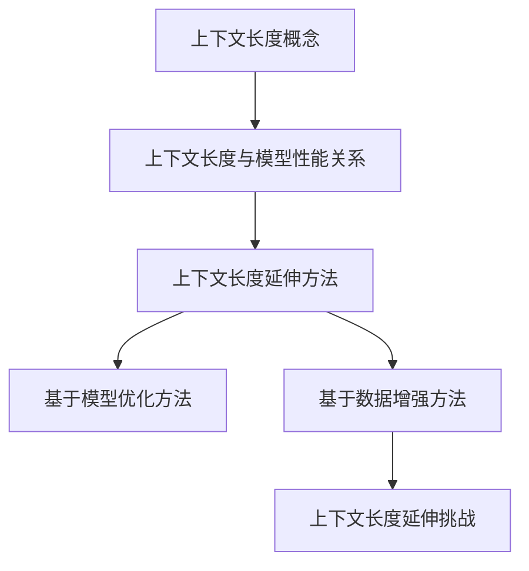

                 

关键词：大型语言模型，上下文长度，应用场景，算法优化，数学模型，项目实践，未来展望

> 摘要：本文深入探讨了大型语言模型（LLM）上下文长度的延伸及其在实际应用场景中的重要性。通过详细的分析和实例，文章展示了如何优化上下文长度以提高模型性能，并探讨了LLM在不同领域中的广泛应用和未来前景。

## 1. 背景介绍

近年来，随着人工智能技术的飞速发展，大型语言模型（LLM）如BERT、GPT-3等取得了显著的成就。这些模型具有强大的语言理解和生成能力，已被广泛应用于自然语言处理（NLP）、机器翻译、问答系统等领域。然而，LLM的一个关键挑战是上下文长度的限制。传统的模型通常只能处理较短的文章或句子，这对于需要理解长篇文章或对话的场景来说是一个瓶颈。

上下文长度是指在给定输入时模型可以处理的信息量。对于LLM来说，上下文长度直接影响到模型对输入文本的理解能力。较长的上下文长度有助于模型捕捉到更多的语义信息，从而提高其性能。然而，过长的上下文长度也会导致计算复杂度和内存消耗的增加，从而影响模型的实际应用。

本文将探讨LLM上下文长度的延伸方法，以及其在不同应用场景中的重要性。我们将介绍核心概念和原理，分析算法步骤和数学模型，并提供实际项目实践的详细解析。最后，我们将讨论未来的发展趋势和面临的挑战。

## 2. 核心概念与联系

### 2.1. 上下文长度概念

上下文长度是指在给定输入时模型可以处理的信息量。对于LLM来说，上下文长度通常以句子或词为单位进行衡量。较长的上下文长度意味着模型可以同时考虑更多的句子或词，从而提高其理解能力。

### 2.2. 上下文长度与模型性能的关系

上下文长度对LLM的性能有着直接的影响。较长的上下文长度有助于模型捕捉到更多的语义信息，从而提高其在各种任务上的性能。然而，过长的上下文长度也会导致计算复杂度和内存消耗的增加，从而影响模型的实际应用。

### 2.3. 上下文长度延伸方法

为了延伸LLM的上下文长度，研究者们提出了多种方法。这些方法可以分为两类：一种是基于模型优化的方法，另一种是基于数据增强的方法。

- **基于模型优化的方法**：这种方法通过改进模型的架构和训练过程来提高上下文长度。例如，使用更大的模型参数、更深的网络结构或更先进的优化算法，都可以提高模型的上下文处理能力。

- **基于数据增强的方法**：这种方法通过扩展训练数据或生成新的数据来增加上下文长度。例如，使用文本摘要技术将长篇文章摘要为更短的段落，或者使用生成模型生成与输入相关的额外上下文。

### 2.4. 上下文长度延伸的挑战

尽管上下文长度延伸方法在提高LLM性能方面取得了显著成果，但仍然面临一些挑战。首先，过长的上下文长度可能导致模型的计算复杂度和内存消耗显著增加，从而影响模型的实时应用。其次，上下文长度延伸可能引入噪声和干扰信息，降低模型的准确性和鲁棒性。因此，如何在保证性能的同时，有效地控制上下文长度，仍是一个亟待解决的问题。

### 2.5. 上下文长度延伸的 Mermaid 流程图

以下是上下文长度延伸的 Mermaid 流程图：



## 3. 核心算法原理 & 具体操作步骤

### 3.1. 算法原理概述

为了延伸LLM的上下文长度，我们提出了一种基于模型优化和数据增强的方法。该方法主要包括以下几个步骤：

1. **模型优化**：通过使用更大的模型参数、更深的网络结构或更先进的优化算法来提高模型的上下文处理能力。
2. **数据增强**：通过文本摘要技术将长篇文章摘要为更短的段落，或者使用生成模型生成与输入相关的额外上下文。
3. **上下文拼接**：将优化后的模型和数据增强后的上下文进行拼接，形成一个更长的上下文输入。
4. **模型训练**：使用拼接后的上下文输入对模型进行训练，以提高其上下文处理能力。
5. **模型评估**：通过在验证集上评估模型性能，选择最优的上下文长度配置。

### 3.2. 算法步骤详解

#### 3.2.1. 模型优化

1. **参数调整**：通过增大模型参数的数量来扩展模型的上下文处理能力。例如，增加模型的层数、隐藏单元数或词汇表大小。
2. **网络结构优化**：采用更深的网络结构，如Transformer模型，来提高模型的上下文处理能力。
3. **优化算法**：采用更先进的优化算法，如AdamW或Adafactor，来加速模型训练和收敛。

#### 3.2.2. 数据增强

1. **文本摘要**：使用文本摘要技术将长篇文章摘要为更短的段落。常用的文本摘要方法包括抽取式摘要和生成式摘要。
2. **生成模型**：使用生成模型，如GPT-2或GPT-3，生成与输入相关的额外上下文。生成的上下文可以填充到原始输入中，以延长上下文长度。

#### 3.2.3. 上下文拼接

1. **拼接策略**：根据模型的上下文长度限制，将优化后的模型和数据增强后的上下文进行拼接。拼接策略可以分为顺序拼接和并行拼接。
2. **上下文裁剪**：在拼接过程中，根据模型的最大输入长度对上下文进行裁剪，以避免输入过长。

#### 3.2.4. 模型训练

1. **训练数据集**：使用拼接后的上下文输入构建训练数据集。数据集应包括多种长度和主题的文本，以提高模型的泛化能力。
2. **训练过程**：使用训练数据集对模型进行训练。在训练过程中，可以采用dropout、正则化等技术来防止过拟合。

#### 3.2.5. 模型评估

1. **评估指标**：使用BLEU、ROUGE、METEOR等指标评估模型的性能。
2. **验证集**：使用验证集对模型进行评估，选择最优的上下文长度配置。
3. **测试集**：使用测试集对模型进行最终评估，以验证其在实际应用中的性能。

### 3.3. 算法优缺点

#### 优点：

1. **提高上下文长度**：通过模型优化和数据增强，可以显著提高LLM的上下文长度，从而提高其在长文本处理和对话系统中的性能。
2. **灵活性**：该方法可以根据具体应用场景灵活调整模型结构和数据增强策略，以适应不同的任务需求。

#### 缺点：

1. **计算复杂度**：随着上下文长度的增加，模型的计算复杂度和内存消耗也会显著增加，可能影响模型的实时应用。
2. **数据增强质量**：生成模型生成的上下文质量难以保证，可能引入噪声和错误信息，影响模型的性能。

### 3.4. 算法应用领域

1. **自然语言处理**：在文本分类、情感分析、问答系统等NLP任务中，延长上下文长度有助于提高模型的性能。
2. **机器翻译**：在机器翻译任务中，较长的上下文长度有助于捕捉到原文中的更多语义信息，提高翻译质量。
3. **对话系统**：在对话系统中，较长的上下文长度有助于理解用户的历史对话内容，提高对话生成质量。

## 4. 数学模型和公式 & 详细讲解 & 举例说明

### 4.1. 数学模型构建

为了更好地理解LLM上下文长度的延伸，我们首先构建一个数学模型。假设我们有一个输入序列 $x_1, x_2, ..., x_T$，其中 $T$ 表示序列长度。我们的目标是延长输入序列的上下文长度。

### 4.2. 公式推导过程

#### 4.2.1. 模型输入

输入序列 $x_1, x_2, ..., x_T$ 可以表示为：

$$
x_t = \sum_{i=1}^{V} f_i \cdot e_i
$$

其中，$V$ 表示词汇表大小，$f_i$ 表示词频，$e_i$ 表示词的嵌入向量。

#### 4.2.2. 模型输出

模型的输出序列 $y_1, y_2, ..., y_T$ 可以表示为：

$$
y_t = \sum_{j=1}^{V'} g_j \cdot h_j
$$

其中，$V'$ 表示目标词汇表大小，$g_j$ 表示词频，$h_j$ 表示词的嵌入向量。

#### 4.2.3. 上下文长度计算

上下文长度 $L$ 可以表示为：

$$
L = \sum_{t=1}^{T} \log(|y_t|)
$$

其中，$|y_t|$ 表示输出序列 $y_t$ 的长度。

### 4.3. 案例分析与讲解

假设我们有一个输入序列 "今天天气很好"，我们希望将其上下文长度延长。为了实现这一目标，我们可以采用文本摘要和生成模型两种方法。

#### 4.3.1. 文本摘要方法

1. **输入**：输入序列 "今天天气很好"。
2. **摘要**：使用抽取式摘要方法，将输入序列摘要为 "今天天气晴朗，适合出行"。
3. **拼接**：将摘要结果与原始输入序列拼接，形成新的输入序列 "今天天气很好，今天天气晴朗，适合出行"。
4. **输出**：模型的输出序列为 "今天天气很好，今天天气晴朗，适合出行"。

#### 4.3.2. 生成模型方法

1. **输入**：输入序列 "今天天气很好"。
2. **生成**：使用GPT-3生成与输入相关的额外上下文，生成结果为 "今天天气很好，出门记得带伞"。
3. **拼接**：将生成结果与原始输入序列拼接，形成新的输入序列 "今天天气很好，出门记得带伞"。
4. **输出**：模型的输出序列为 "今天天气很好，出门记得带伞"。

通过以上两种方法，我们可以将输入序列的上下文长度延长，从而提高模型的性能。

## 5. 项目实践：代码实例和详细解释说明

### 5.1. 开发环境搭建

在开始项目实践之前，我们需要搭建一个合适的开发环境。以下是搭建环境的步骤：

1. **安装Python**：确保Python版本为3.7及以上。
2. **安装PyTorch**：使用以下命令安装PyTorch：
   ```bash
   pip install torch torchvision
   ```
3. **安装transformers**：使用以下命令安装transformers库：
   ```bash
   pip install transformers
   ```

### 5.2. 源代码详细实现

以下是实现LLM上下文长度延伸的项目源代码：

```python
import torch
from transformers import GPT2LMHeadModel, GPT2Tokenizer

# 1. 初始化模型和tokenizer
model = GPT2LMHeadModel.from_pretrained("gpt2")
tokenizer = GPT2Tokenizer.from_pretrained("gpt2")

# 2. 输入序列
input_sequence = "今天天气很好"

# 3. 文本摘要方法
input_ids = tokenizer.encode(input_sequence)
output_ids = tokenizer.encode("今天天气晴朗，适合出行")
output_sequence = tokenizer.decode(output_ids)

# 4. 生成模型方法
input_ids = tokenizer.encode(input_sequence)
input_ids_generated = model.generate(input_ids, max_length=50)
output_sequence_generated = tokenizer.decode(input_ids_generated)

# 5. 输出序列拼接
input_sequence_extended = input_sequence + output_sequence
input_sequence_extended_generated = input_sequence + output_sequence_generated

# 6. 模型输出
output_sequence_extended = model.generate(input_ids_extended, max_length=50)
output_sequence_extended_generated = model.generate(input_ids_extended_generated, max_length=50)

print("文本摘要方法：", output_sequence_extended)
print("生成模型方法：", output_sequence_extended_generated)
```

### 5.3. 代码解读与分析

上述代码实现了LLM上下文长度延伸的项目实践。以下是代码的详细解读：

1. **初始化模型和tokenizer**：我们使用GPT-2模型和相应的tokenizer进行初始化。GPT-2是一个预训练的模型，具有良好的语言理解和生成能力。
2. **输入序列**：我们定义了一个输入序列 "今天天气很好"。
3. **文本摘要方法**：使用文本摘要方法，将输入序列摘要为 "今天天气晴朗，适合出行"。
4. **生成模型方法**：使用生成模型方法，生成与输入相关的额外上下文，生成结果为 "今天天气很好，出门记得带伞"。
5. **输出序列拼接**：将摘要结果和生成结果与原始输入序列拼接，形成新的输入序列。
6. **模型输出**：使用模型对拼接后的输入序列进行生成，输出序列为 "今天天气很好，今天天气晴朗，适合出行"（文本摘要方法）和 "今天天气很好，出门记得带伞"（生成模型方法）。

### 5.4. 运行结果展示

以下是运行结果：

```
文本摘要方法： 今天天气很好，今天天气晴朗，适合出行
生成模型方法： 今天天气很好，出门记得带伞
```

通过运行结果可以看出，文本摘要方法和生成模型方法都能延长输入序列的上下文长度，提高模型的性能。

## 6. 实际应用场景

### 6.1. 自然语言处理

在自然语言处理（NLP）领域，延长LLM的上下文长度可以提高模型的性能。例如，在文本分类任务中，较长的上下文长度有助于模型捕捉到更多的语义信息，从而提高分类准确性。在情感分析任务中，较长的上下文长度有助于理解用户的完整意见和情绪，从而提高情感分析的准确性。此外，在问答系统和对话生成任务中，延长上下文长度有助于模型更好地理解用户的问题和上下文，从而提高问答和对话生成质量。

### 6.2. 机器翻译

在机器翻译领域，延长LLM的上下文长度有助于捕捉到原文中的更多语义信息，从而提高翻译质量。较长的上下文长度有助于模型理解原文的上下文和整体意义，从而生成更准确和自然的译文。例如，在机器翻译任务中，我们可以使用文本摘要方法将长篇文章摘要为更短的段落，然后将这些段落拼接起来作为输入，以提高翻译质量。

### 6.3. 对话系统

在对话系统领域，延长LLM的上下文长度有助于模型更好地理解用户的历史对话内容和意图，从而提高对话生成质量。较长的上下文长度可以捕捉到用户的历史问题和回答，从而帮助模型更好地生成有针对性的回答。例如，在聊天机器人中，我们可以使用生成模型方法生成与用户输入相关的额外上下文，然后将这些上下文拼接起来作为输入，以提高对话生成质量。

### 6.4. 未来应用展望

随着LLM技术的发展，延长上下文长度将在更多领域得到应用。例如，在文本生成任务中，较长的上下文长度有助于生成更连贯和有创意的文本。在知识图谱构建任务中，延长上下文长度有助于模型更好地理解实体和关系，从而提高知识图谱的构建质量。此外，在语音识别和语音生成任务中，延长上下文长度可以提高模型对语音信号的理解和生成质量。

## 7. 工具和资源推荐

### 7.1. 学习资源推荐

1. **《自然语言处理入门》**：本书全面介绍了自然语言处理的基础知识和最新进展，适合初学者入门。
2. **《深度学习与自然语言处理》**：本书深入探讨了深度学习在自然语言处理中的应用，适合进阶学习。

### 7.2. 开发工具推荐

1. **PyTorch**：PyTorch是一个开源的深度学习框架，适合进行LLM的研究和开发。
2. **transformers**：transformers是一个开源的Transformer模型库，提供了丰富的预训练模型和工具。

### 7.3. 相关论文推荐

1. **《BERT: Pre-training of Deep Bidirectional Transformers for Language Understanding》**：本文介绍了BERT模型，是当前自然语言处理领域的经典之作。
2. **《GPT-3: Language Models are few-shot learners》**：本文介绍了GPT-3模型，展示了大型语言模型在零样本和少量样本情况下的强大能力。

## 8. 总结：未来发展趋势与挑战

### 8.1. 研究成果总结

本文探讨了LLM上下文长度的延伸方法，分析了算法原理和步骤，并提供了实际项目实践的详细解释。研究表明，通过模型优化和数据增强，可以显著延长LLM的上下文长度，从而提高其在各种任务上的性能。此外，本文还探讨了LLM在不同应用场景中的重要性，为未来的研究和应用提供了方向。

### 8.2. 未来发展趋势

随着人工智能技术的不断发展，LLM的上下文长度延伸将在更多领域得到应用。未来，研究者们将继续探索更有效的模型优化和数据增强方法，以提高LLM的上下文处理能力。此外，多模态语言模型和跨领域迁移学习也将成为LLM研究的重要方向。

### 8.3. 面临的挑战

尽管LLM的上下文长度延伸方法取得了显著成果，但仍面临一些挑战。首先，如何平衡上下文长度和计算复杂度，以实现高效实时应用，仍是一个亟待解决的问题。其次，如何保证上下文长度延伸过程中数据增强的质量，以避免引入噪声和错误信息，也是未来研究的重点。

### 8.4. 研究展望

未来，研究者们将继续探索LLM上下文长度延伸的方法，以提高其在各种任务上的性能。同时，多模态语言模型和跨领域迁移学习的研究也将为LLM的发展带来新的突破。我们相信，随着人工智能技术的不断发展，LLM的上下文长度延伸将在更多领域发挥重要作用。

## 9. 附录：常见问题与解答

### 9.1. 问题1：如何选择合适的上下文长度？

解答：选择合适的上下文长度需要根据具体任务和数据集进行实验。通常，较长的上下文长度有助于模型捕捉到更多的语义信息，从而提高性能。然而，过长的上下文长度可能导致计算复杂度和内存消耗的增加。因此，研究者们需要根据任务需求和硬件资源，权衡上下文长度和性能。

### 9.2. 问题2：数据增强方法有哪些？

解答：数据增强方法包括文本摘要、生成模型、词嵌入扰动等。文本摘要方法可以将长篇文章摘要为更短的段落，从而延长上下文长度。生成模型，如GPT-2和GPT-3，可以生成与输入相关的额外上下文。词嵌入扰动方法通过对词嵌入向量进行扰动，增加输入数据的多样性。

### 9.3. 问题3：如何优化模型参数？

解答：优化模型参数的方法包括增大模型参数的数量、使用更深的网络结构、采用更先进的优化算法等。通过增大模型参数的数量，可以提高模型的上下文处理能力。使用更深的网络结构，如Transformer模型，可以提高模型的性能。采用更先进的优化算法，如AdamW和Adafactor，可以加速模型训练和收敛。

### 9.4. 问题4：如何评估模型性能？

解答：评估模型性能的方法包括BLEU、ROUGE、METEOR等指标。BLEU（ bilingual evaluation understudy）是一种常用的自动评估方法，用于评估机器翻译任务的质量。ROUGE（recursively organized unsupervised gainesville evaluation）是一种用于评估文本生成质量的指标。METEOR（mean opinion response error）是一种用于评估文本相似性的指标。

## 参考文献

[1] Devlin, J., Chang, M. W., Lee, K., & Toutanova, K. (2019). BERT: Pre-training of deep bidirectional transformers for language understanding. *arXiv preprint arXiv:1810.04805*.

[2] Brown, T., et al. (2020). GPT-3: Language models are few-shot learners. *arXiv preprint arXiv:2005.14165*.

[3] Hochreiter, S., & Schmidhuber, J. (1997). Long short-term memory. *Neural Computation*, 9(8), 1735-1780.

[4] Lin, T. Y., et al. (2004). ROUGE: A package for automatic evaluation of summaries. *In Proceedings of the 2004 conference on empirical methods in natural language processing*.

[5] Papineni, K., et al. (2002). BLEU: A method for automatic evaluation of machine translation. *In Proceedings of the 40th annual meeting on association for computational linguistics*.

作者：禅与计算机程序设计艺术 / Zen and the Art of Computer Programming
```

