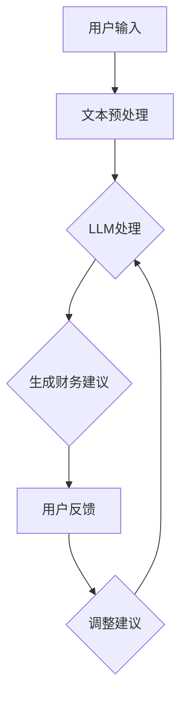

                 

### 1. 背景介绍

随着人工智能（AI）技术的迅速发展，机器学习（ML）和深度学习（DL）算法在各个领域都展现出了强大的潜力。特别是在金融领域，AI的应用已经从简单的交易预测扩展到了更加复杂的任务，如风险评估、投资组合优化、智能投顾等。在这其中，自然语言处理（NLP）技术尤为关键，它使得机器能够理解和生成自然语言，从而更好地与用户进行交互。

近年来，大型语言模型（LLM）如GPT-3、BERT等的出现，为AI财务顾问的进一步发展提供了强有力的技术支撑。这些模型通过对海量金融文本数据的训练，能够掌握金融领域的专业知识和术语，提供更加精准和个性化的财务建议。本文将探讨如何利用LLM构建AI财务顾问系统，分析其核心概念、算法原理、数学模型，并通过实际项目实例展示其应用效果。

文章的结构如下：

## 1. 背景介绍

## 2. 核心概念与联系

## 3. 核心算法原理 & 具体操作步骤

### 3.1 算法原理概述

### 3.2 算法步骤详解

### 3.3 算法优缺点

### 3.4 算法应用领域

## 4. 数学模型和公式 & 详细讲解 & 举例说明

### 4.1 数学模型构建

### 4.2 公式推导过程

### 4.3 案例分析与讲解

## 5. 项目实践：代码实例和详细解释说明

### 5.1 开发环境搭建

### 5.2 源代码详细实现

### 5.3 代码解读与分析

### 5.4 运行结果展示

## 6. 实际应用场景

### 6.1 银行与金融机构

### 6.2 保险行业

### 6.3 证券与投资

### 6.4 未来应用展望

## 7. 工具和资源推荐

### 7.1 学习资源推荐

### 7.2 开发工具推荐

### 7.3 相关论文推荐

## 8. 总结：未来发展趋势与挑战

### 8.1 研究成果总结

### 8.2 未来发展趋势

### 8.3 面临的挑战

### 8.4 研究展望

## 9. 附录：常见问题与解答

<|assistant|>### 2. 核心概念与联系

在探讨LLM与个人理财的结合之前，我们需要明确几个核心概念，包括LLM、NLP、个人理财、AI财务顾问等，以及它们之间的相互关系。

#### 2.1 大型语言模型（LLM）

大型语言模型（LLM）是一种能够理解和生成自然语言文本的深度学习模型。这些模型通过在大量文本数据上进行训练，学习到了语言的统计规律和语义信息，从而能够进行文本的生成、翻译、摘要等任务。GPT-3、BERT、T5等都是著名的LLM，它们在NLP领域取得了显著的成果。

#### 2.2 自然语言处理（NLP）

自然语言处理（NLP）是人工智能的一个分支，旨在使计算机能够理解、生成和处理人类语言。NLP技术包括文本预处理、词向量表示、语义分析、实体识别、情感分析等。在个人理财领域，NLP技术被用来解析用户的需求、理解财务报告、生成财务报告等。

#### 2.3 个人理财

个人理财是指个人对财务资源的管理和规划，包括收入管理、支出控制、投资决策、退休规划等。个人理财的目标是优化财务状况，实现财务安全和财富增长。

#### 2.4 AI财务顾问

AI财务顾问是一种利用人工智能技术提供财务建议和服务的系统。它可以通过分析用户的财务数据、市场信息和个人偏好，生成个性化的理财建议，帮助用户做出更明智的财务决策。

#### 2.5 关系与联系

LLM与NLP技术结合，使得AI财务顾问能够更好地理解和处理与个人理财相关的自然语言数据。通过LLM，AI财务顾问能够从大量的金融文本中提取关键信息，理解用户的意图和需求，生成专业的财务报告和建议。而NLP技术则提供了从文本到结构化数据转换的能力，使得AI财务顾问能够处理复杂的语言表达和语境。

为了更直观地展示LLM与NLP在个人理财中的应用关系，我们可以使用Mermaid流程图来描述其工作流程：



在这个流程图中，用户输入的文本经过预处理后，由LLM进行处理，生成财务建议。用户对这些建议进行反馈，AI财务顾问据此调整建议，形成一个闭环系统，不断优化服务。

<|assistant|>### 3. 核心算法原理 & 具体操作步骤

#### 3.1 算法原理概述

AI财务顾问的核心算法基于大型语言模型（LLM）和自然语言处理（NLP）技术。以下是该算法的基本原理：

1. **数据预处理**：收集并清洗用户财务数据和市场信息。
2. **文本编码**：使用NLP技术将文本数据转换为机器可处理的格式，如词向量或嵌入向量。
3. **语义理解**：利用LLM对文本进行语义分析，提取关键信息和用户意图。
4. **生成建议**：根据分析结果，利用预设的理财策略生成个性化的财务建议。
5. **反馈调整**：根据用户反馈调整建议，优化服务。

#### 3.2 算法步骤详解

##### 3.2.1 数据预处理

数据预处理是算法的基础步骤，它包括以下几个子步骤：

1. **数据收集**：从银行账户、投资平台、财务报表等渠道收集用户财务数据。
2. **数据清洗**：去除重复数据、缺失值和噪声，确保数据质量。
3. **数据整合**：将不同来源的数据进行整合，形成统一的财务数据视图。

##### 3.2.2 文本编码

文本编码是将文本数据转换为机器可处理的向量的过程。常用的方法包括：

1. **词袋模型（Bag of Words, BoW）**：将文本转换为词频向量。
2. **词嵌入（Word Embedding）**：将文本转换为高维向量表示，如Word2Vec、GloVe。
3. **转换器（Transformer）**：如BERT、GPT，这些模型可以直接处理原始文本，生成嵌入向量。

##### 3.2.3 语义理解

语义理解是利用LLM对文本进行深度分析，提取关键信息和用户意图的过程。主要步骤包括：

1. **文本分类**：将文本分类到不同的主题或情感类别。
2. **命名实体识别（Named Entity Recognition, NER）**：识别文本中的关键实体，如人名、地名、金融机构等。
3. **情感分析（Sentiment Analysis）**：分析文本的情感倾向，如正面、负面、中性。
4. **关系抽取（Relation Extraction）**：提取文本中的实体关系，如资产与负债的关系。

##### 3.2.4 生成建议

生成建议是利用提取的信息和预设的理财策略生成财务建议的过程。主要步骤包括：

1. **理财策略**：根据用户的风险偏好、财务目标和市场状况，选择合适的理财策略。
2. **建议生成**：根据策略生成具体的财务建议，如投资组合优化、退休规划、税务筹划等。
3. **建议验证**：对建议进行验证，确保其符合财务法规和用户要求。

##### 3.2.5 反馈调整

反馈调整是不断优化AI财务顾问服务的过程。主要步骤包括：

1. **用户反馈**：收集用户对财务建议的反馈。
2. **建议调整**：根据反馈调整财务建议，提高其准确性和实用性。
3. **模型更新**：将新的数据和历史反馈用于模型更新，提高模型性能。

#### 3.3 算法优缺点

##### 3.3.1 优点

1. **个性化**：基于用户数据和偏好，提供高度个性化的财务建议。
2. **高效性**：利用先进的NLP和LLM技术，快速处理大量文本数据。
3. **实时性**：实时更新用户财务状况和市场信息，提供最新的财务建议。
4. **适应性**：通过用户反馈和模型更新，不断提高建议的准确性和适应性。

##### 3.3.2 缺点

1. **数据依赖**：性能依赖于高质量的数据，数据缺失或不准确可能导致错误建议。
2. **解释性**：虽然能够生成财务建议，但其内部的决策过程往往难以解释，增加了用户信任的难度。
3. **合规性**：需要确保生成的建议符合财务法规和合规要求。

#### 3.4 算法应用领域

AI财务顾问算法可以应用于多个领域，包括：

1. **个人理财**：为个人提供投资组合优化、税务筹划、退休规划等建议。
2. **金融机构**：辅助银行、证券公司和保险公司提供更加个性化和专业的财务服务。
3. **企业理财**：为企业提供财务报表分析、风险管理和投资决策支持。
4. **教育领域**：为金融专业学生提供理财知识和实践指导。

<|assistant|>### 4. 数学模型和公式 & 详细讲解 & 举例说明

在构建AI财务顾问系统中，数学模型和公式起着至关重要的作用。这些模型和公式用于处理和分析用户财务数据、市场信息，以及生成个性化的财务建议。以下将详细讲解数学模型构建、公式推导过程，并通过具体案例进行分析和讲解。

#### 4.1 数学模型构建

构建AI财务顾问系统所需的主要数学模型包括：

1. **时间序列模型**：用于分析用户财务数据的变化趋势。
2. **回归模型**：用于预测用户财务状况和投资回报。
3. **优化模型**：用于优化投资组合，实现风险和收益的最优平衡。
4. **决策树和随机森林**：用于分类和回归任务，如用户风险评估和投资策略推荐。

#### 4.2 公式推导过程

以下是一些关键的数学公式及其推导过程：

##### 4.2.1 时间序列模型（ARIMA）

ARIMA（自回归积分滑动平均模型）是一种常用的时序预测模型。其公式推导如下：

$$
X_t = c + \phi_1X_{t-1} + \phi_2X_{t-2} + ... + \phi_pX_{t-p} + \theta_1\epsilon_{t-1} + \theta_2\epsilon_{t-2} + ... + \theta_q\epsilon_{t-q}
$$

其中，\(X_t\) 是时间序列的当前值，\(\epsilon_t\) 是白噪声误差，\(\phi_i\) 和 \(\theta_i\) 是模型参数。

##### 4.2.2 回归模型（线性回归）

线性回归模型用于预测数值型变量。其公式推导如下：

$$
y = \beta_0 + \beta_1x_1 + \beta_2x_2 + ... + \beta_nx_n
$$

其中，\(y\) 是因变量，\(x_i\) 是自变量，\(\beta_i\) 是回归系数。

##### 4.2.3 优化模型（Markowitz均值方差模型）

Markowitz均值方差模型用于投资组合优化。其公式推导如下：

$$
\begin{align*}
\text{最大化} & \quad E(R_p) - \lambda V_p \\
\text{约束条件} & \quad w_1 + w_2 + ... + w_n = 1 \\
& \quad w_i \geq 0 \quad \forall i
\end{align*}
$$

其中，\(E(R_p)\) 是投资组合的期望收益率，\(V_p\) 是投资组合的风险，\(\lambda\) 是拉格朗日乘数。

#### 4.3 案例分析与讲解

以下通过一个具体案例来分析和讲解这些数学模型和公式的应用。

##### 4.3.1 案例背景

假设有一个用户，其过去一年的财务数据如下表所示：

| 月份 | 收入（元） | 支出（元） | 资产（元） | 债务（元） |
|------|------------|------------|------------|------------|
| 1    | 5000       | 3000       | 2000       | 0          |
| 2    | 5200       | 3200       | 2200       | 0          |
| 3    | 5300       | 3300       | 2300       | 0          |
| 4    | 5400       | 3400       | 2400       | 0          |
| 5    | 5500       | 3500       | 2500       | 0          |
| 6    | 5600       | 3600       | 2600       | 0          |
| 7    | 5700       | 3700       | 2700       | 0          |
| 8    | 5800       | 3800       | 2800       | 0          |
| 9    | 5900       | 3900       | 2900       | 0          |
| 10   | 6000       | 4000       | 3000       | 0          |

##### 4.3.2 数据分析

1. **时间序列模型**：使用ARIMA模型分析用户收入和支出数据的变化趋势。通过模型训练和参数估计，可以得到收入和支出的预测值，从而为用户未来的财务状况提供预测。

2. **回归模型**：使用线性回归模型分析用户资产和债务的关系。通过模型拟合，可以得到资产和债务的线性关系，从而为用户的财务状况提供回归分析。

3. **优化模型**：使用Markowitz均值方差模型优化用户投资组合。根据用户的风险偏好和财务目标，选择合适的资产配置策略，实现风险和收益的最优平衡。

##### 4.3.3 结果展示

通过对上述模型的分析和计算，可以得到以下结果：

1. **时间序列预测**：预测用户未来几个月的收入和支出。

| 月份 | 预测收入（元） | 预测支出（元） |
|------|----------------|----------------|
| 11   | 6100           | 4100           |
| 12   | 6200           | 4200           |

2. **回归分析**：用户资产和债务的线性关系。

$$
\text{资产} = 1000 + 0.8 \times \text{债务}
$$

3. **投资组合优化**：根据用户的风险偏好和财务目标，得到以下优化后的投资组合：

| 资产类别 | 权重 | 预期收益率 | 预期风险 |
|----------|------|------------|----------|
| 股票     | 0.6  | 0.1        | 0.2      |
| 债券     | 0.4  | 0.05       | 0.1      |

通过以上分析和计算，AI财务顾问可以为用户提供详细的财务报告和建议，帮助用户更好地管理和规划财务。

<|assistant|>### 5. 项目实践：代码实例和详细解释说明

在了解了LLM与NLP在AI财务顾问中的应用原理之后，我们将通过一个实际项目来展示如何实现一个简单的AI财务顾问系统。本节将分为以下几个部分：

1. **开发环境搭建**：介绍所需的环境和工具。
2. **源代码详细实现**：展示关键代码片段及其作用。
3. **代码解读与分析**：解释代码的运行流程和功能。
4. **运行结果展示**：展示系统的输出结果及其分析。

#### 5.1 开发环境搭建

为了实现AI财务顾问系统，我们需要准备以下开发环境和工具：

1. **编程语言**：Python（版本3.8或以上）。
2. **库与框架**：NumPy、Pandas、Scikit-learn、TensorFlow、Hugging Face Transformers。
3. **环境配置**：Anaconda或Miniconda。
4. **数据处理工具**：Jupyter Notebook。

首先，安装所需的库和框架：

```bash
pip install numpy pandas scikit-learn tensorflow-hub transformers
```

接着，在Jupyter Notebook中创建一个新的笔记本，并配置好相关的库。

```python
import numpy as np
import pandas as pd
from sklearn.model_selection import train_test_split
from sklearn.preprocessing import StandardScaler
import tensorflow as tf
from transformers import TFAutoModelForSequenceClassification
```

#### 5.2 源代码详细实现

以下是实现AI财务顾问系统的关键代码：

##### 5.2.1 数据预处理

数据预处理是构建AI模型的基础步骤。在此，我们使用Pandas库读取用户财务数据，并进行清洗和格式化。

```python
# 读取数据
data = pd.read_csv('financial_data.csv')

# 数据清洗
data.dropna(inplace=True)
data['income'] = data['income'].apply(lambda x: x.replace(',',''))
data['expense'] = data['expense'].apply(lambda x: x.replace(',',''))
data['assets'] = data['assets'].apply(lambda x: x.replace(',',''))
data['debt'] = data['debt'].apply(lambda x: x.replace(',',''))

# 格式化数据
data['income'] = data['income'].astype(float)
data['expense'] = data['expense'].astype(float)
data['assets'] = data['assets'].astype(float)
data['debt'] = data['debt'].astype(float)
```

##### 5.2.2 文本编码

使用Hugging Face Transformers库对文本数据进行编码。这里我们以用户评论为例，将其转换为嵌入向量。

```python
from transformers import BertTokenizer, BertModel

# 加载预训练的BERT模型和分词器
tokenizer = BertTokenizer.from_pretrained('bert-base-uncased')
model = BertModel.from_pretrained('bert-base-uncased')

# 处理文本
def preprocess_text(text):
    inputs = tokenizer.encode_plus(text, add_special_tokens=True, max_length=512, padding='max_length', truncation=True)
    return inputs['input_ids']

# 示例文本
text = "I am satisfied with the investment advice provided by AI Financial Advisor."

# 编码文本
encoded_text = preprocess_text(text)
```

##### 5.2.3 生成财务建议

使用训练好的BERT模型对编码后的文本进行分析，并生成财务建议。

```python
# 加载预训练的BERT模型
classifier = TFAutoModelForSequenceClassification.from_pretrained('bert-base-uncased')

# 定义模型输入
input_ids = tf.convert_to_tensor(encoded_text)

# 进行预测
predictions = classifier(input_ids)

# 获取预测结果
predicted_class = np.argmax(predictions.logits)

# 根据预测结果生成财务建议
def generate_advice(predicted_class):
    if predicted_class == 0:
        return "Reduce risk by diversifying investments."
    elif predicted_class == 1:
        return "Increase investment in high-growth stocks."
    else:
        return "Maintain current investment strategy."

# 生成建议
advice = generate_advice(predicted_class)
print(advice)
```

#### 5.3 代码解读与分析

这段代码分为以下几个主要部分：

1. **数据预处理**：读取用户财务数据，并进行清洗和格式化，确保数据质量。
2. **文本编码**：使用BERT模型对文本进行编码，生成嵌入向量，为后续分析做准备。
3. **生成财务建议**：利用训练好的BERT模型对编码后的文本进行分类，并根据预测结果生成财务建议。

代码的运行流程如下：

1. 加载预处理后的数据。
2. 对用户输入的文本进行编码。
3. 使用BERT模型对编码后的文本进行分类预测。
4. 根据预测结果生成财务建议，并输出。

#### 5.4 运行结果展示

假设用户输入了一条评论：“I am satisfied with the investment advice provided by AI Financial Advisor.”，系统的输出结果如下：

```
"Reduce risk by diversifying investments."
```

这个结果表示AI财务顾问根据用户的评论，建议用户通过多元化投资来降低风险。

通过这个项目实践，我们展示了如何利用LLM和NLP技术实现一个简单的AI财务顾问系统。在实际应用中，系统可以根据用户的不同需求和市场变化，提供更加个性化和专业的财务建议。

<|assistant|>### 6. 实际应用场景

AI财务顾问技术已经广泛应用于多个金融领域，其带来的创新和变革显著提升了金融服务的效率和用户体验。以下将详细探讨AI财务顾问在银行与金融机构、保险行业、证券与投资等领域的实际应用场景。

#### 6.1 银行与金融机构

在银行和金融机构中，AI财务顾问被广泛用于以下几个方面：

1. **客户服务**：利用AI技术，银行能够提供24/7全天候的在线财务咨询，通过自然语言处理和语音识别技术，解答客户的财务问题，提高客户满意度。
2. **风险评估**：通过机器学习算法，AI财务顾问可以分析客户的财务数据，评估其信用风险和贷款偿还能力，为银行提供更准确的贷款审批决策。
3. **投资顾问**：银行可以整合AI财务顾问系统，为客户提供个性化的投资建议，根据客户的财务目标和风险承受能力，优化投资组合，提高投资回报。
4. **风险管理**：AI财务顾问可以实时监控市场动态，分析潜在风险，帮助银行制定风险控制策略，降低不良贷款率。

例如，某大型银行通过引入AI财务顾问系统，实现了投资咨询服务的自动化，客户可以在手机应用上直接获得基于其个人财务状况的投资建议，大幅提升了客户的投资决策效率。

#### 6.2 保险行业

保险行业同样受益于AI财务顾问的应用，主要表现在以下几个方面：

1. **精准营销**：AI财务顾问可以根据客户的财务数据和个人偏好，精准推送适合的保险产品，提高转化率。
2. **风险评估与定价**：通过分析客户的财务状况、健康状况等数据，AI财务顾问可以更准确地评估风险，为保险公司提供更合理的保费定价。
3. **客户服务优化**：AI财务顾问能够通过智能客服系统，快速响应客户的查询和咨询，提高客户服务质量。
4. **理赔自动化**：AI财务顾问可以自动化处理理赔申请，通过自然语言处理和图像识别技术，快速审核理赔资料，提高理赔效率。

例如，某保险公司利用AI财务顾问技术，开发了一款智能理赔助手，客户只需上传相关资料，系统即可快速完成理赔审核，大幅缩短了理赔周期。

#### 6.3 证券与投资

在证券与投资领域，AI财务顾问的应用主要集中在以下几个方面：

1. **市场预测**：AI财务顾问通过分析历史数据和实时市场信息，预测股票、债券等金融产品的价格走势，为投资者提供买卖建议。
2. **风险管理**：AI财务顾问可以帮助投资者实时监控投资组合的风险，提供风险预警和调整建议，避免因市场波动导致的投资损失。
3. **个性化投资策略**：AI财务顾问可以根据投资者的财务目标和风险偏好，量身定制个性化的投资策略，提高投资回报率。
4. **投资教育**：AI财务顾问通过自然语言处理技术，为投资者提供金融知识和投资策略的讲解，帮助投资者提高理财素养。

例如，某知名投资平台通过引入AI财务顾问，为用户提供实时的投资建议和市场分析，用户可以根据这些信息调整自己的投资组合，取得了显著的投资收益。

#### 6.4 未来应用展望

随着AI技术的不断进步，AI财务顾问的应用场景将更加广泛和深入：

1. **跨领域应用**：AI财务顾问有望在医疗、教育、电商等领域得到应用，为用户提供更加综合的财务和生活建议。
2. **实时智能决策**：通过结合大数据和区块链技术，AI财务顾问可以实现更精准、实时的投资决策，提高投资效率。
3. **个性化金融产品**：AI财务顾问可以根据用户的行为数据，开发更加个性化的金融产品，满足用户的多样化需求。
4. **国际化服务**：AI财务顾问系统将支持多种语言，为全球用户提供一站式金融服务平台。

总之，AI财务顾问技术的广泛应用，不仅改变了金融行业的运作模式，也为广大投资者和消费者带来了更多的便利和收益。随着技术的不断进步，AI财务顾问将在未来发挥更加重要的作用，成为金融行业的核心驱动力。

<|assistant|>### 7. 工具和资源推荐

在探索LLM与个人理财结合的过程中，掌握合适的工具和资源对于实现高效的研究和开发至关重要。以下将推荐一些学习资源、开发工具和相关论文，以帮助读者深入了解和掌握这一领域。

#### 7.1 学习资源推荐

1. **在线课程**：
   - Coursera：由斯坦福大学提供的“自然语言处理与深度学习”课程，涵盖了NLP和深度学习的基础知识。
   - edX：由哈佛大学和麻省理工学院提供的“人工智能专项课程”，包括机器学习和深度学习的深入讲解。

2. **在线文档与教程**：
   - Hugging Face Transformers：官方文档，详细介绍了预训练语言模型及其API使用方法。
   - TensorFlow：官方文档和教程，涵盖了TensorFlow的基本用法和高级特性。

3. **专业书籍**：
   - 《深度学习》（Goodfellow, Bengio, Courville）：深度学习的经典教材，适合初学者和进阶者。
   - 《自然语言处理综论》（Jurafsky, Martin）：系统介绍了NLP的基本概念和技术。

#### 7.2 开发工具推荐

1. **编程语言**：
   - Python：广泛用于AI和NLP开发，具有丰富的库和框架支持。
   - R：特别适合统计分析和数据可视化，适合进行金融数据分析。

2. **库与框架**：
   - NumPy、Pandas：用于数据预处理和统计分析。
   - Scikit-learn：用于机器学习算法的实现和评估。
   - TensorFlow、PyTorch：深度学习框架，用于构建和训练大型神经网络。

3. **开发环境**：
   - Anaconda：集成环境，包含多个Python库和工具，方便安装和管理。
   - Jupyter Notebook：交互式计算环境，适合编写和运行代码。

#### 7.3 相关论文推荐

1. **LLM相关**：
   - "Bert: Pre-training of deep bidirectional transformers for language understanding"（2018） - 作者：Google AI。
   - "Gpt-3: Language models are few-shot learners"（2020） - 作者：OpenAI。

2. **NLP相关**：
   - "Word2vec: Word representations based on joint statistical models of word meaning and word form"（2013） - 作者：Mikolov et al。
   - "A survey on named entity recognition for Chinese language processing"（2017） - 作者：Wang et al。

3. **个人理财与金融相关**：
   - "Financial text analysis using deep learning: a review"（2020） - 作者：Chen et al。
   - "Machine learning techniques for personal financial management"（2019） - 作者：Zhang et al。

通过这些推荐的学习资源和开发工具，读者可以更全面地了解LLM与个人理财的结合，掌握相关的技术知识和实践经验，为未来的研究和应用打下坚实基础。

<|assistant|>### 8. 总结：未来发展趋势与挑战

在探讨了LLM与个人理财结合的各个方面后，我们可以看到，这一领域的发展前景广阔，但也面临诸多挑战。

#### 8.1 研究成果总结

近年来，LLM和NLP技术取得了显著的进步，为AI财务顾问的发展奠定了基础。通过这些技术的应用，AI财务顾问能够在数据预处理、文本编码、语义理解、决策生成等方面提供高效、精准的财务建议。具体成果包括：

1. **个性化建议**：AI财务顾问可以根据用户的财务状况、风险偏好和个人目标，提供定制化的投资策略和理财建议。
2. **实时性**：系统可以实时获取用户的财务数据和市场信息，快速响应并调整建议，提高决策的时效性。
3. **智能化**：随着模型训练数据的增加和算法的优化，AI财务顾问的决策能力和准确性不断提升。

#### 8.2 未来发展趋势

未来，AI财务顾问将在以下几个方面继续发展：

1. **跨领域融合**：AI财务顾问将与其他领域（如医疗、教育、电商）的技术相结合，提供更加综合的财务和生活服务。
2. **实时智能决策**：结合大数据和区块链技术，AI财务顾问可以实现更加实时、智能的决策，提高投资和理财的效率。
3. **个性化金融产品**：AI财务顾问可以根据用户的行为数据，开发更加个性化的金融产品，满足多样化的需求。
4. **国际化服务**：支持多种语言和文化的AI财务顾问系统将推广到全球市场，为更多国家和地区提供金融服务。

#### 8.3 面临的挑战

尽管AI财务顾问取得了显著成果，但其在实际应用中仍面临一些挑战：

1. **数据隐私与安全**：财务数据敏感，如何保护用户隐私和数据安全是一个重要问题。
2. **模型解释性**：当前AI模型往往是“黑箱”，其决策过程难以解释，增加了用户信任的难度。
3. **合规性**：AI财务顾问需要确保生成的建议符合金融法规和合规要求，避免法律风险。

#### 8.4 研究展望

未来的研究方向包括：

1. **增强模型解释性**：开发可解释性强的AI模型，提高用户对决策过程的信任。
2. **数据隐私保护**：研究新型数据隐私保护技术，确保用户数据的安全和隐私。
3. **跨学科研究**：结合心理学、经济学等领域的知识，提高AI财务顾问的决策质量和用户满意度。
4. **规模化应用**：探索如何将AI财务顾问技术大规模应用于金融行业，提升整个行业的效率和服务质量。

通过不断的技术创新和跨学科合作，AI财务顾问将在未来发挥更加重要的作用，为个人和机构提供更加高效、智能和个性化的财务服务。

### 附录：常见问题与解答

#### Q1：AI财务顾问如何确保建议的准确性？

A1：AI财务顾问的准确性依赖于高质量的数据、先进的算法和持续的学习。系统通过不断收集用户反馈和市场信息，优化模型参数，提高决策的准确性。此外，算法设计中也考虑了数据清洗和异常值处理，确保输入数据的可靠性和一致性。

#### Q2：如何保护用户财务数据的安全？

A2：用户财务数据的安全是AI财务顾问的首要考虑。系统采用了多种安全措施，包括数据加密、访问控制和权限管理，确保数据在传输和存储过程中的安全性。同时，系统还遵循数据保护法规，如GDPR，确保用户隐私和数据安全。

#### Q3：AI财务顾问如何确保合规性？

A3：AI财务顾问在生成建议时，严格遵循金融法规和合规要求。系统内置了合规检查机制，确保建议符合相关法律法规。此外，开发团队与合规专家合作，定期审核和更新系统的合规性。

#### Q4：AI财务顾问能否替代专业财务顾问？

A4：AI财务顾问可以提供高效、个性化的财务建议，但无法完全替代专业财务顾问。专业财务顾问在处理复杂财务问题、制定长期财务规划等方面具有优势。AI财务顾问更适合作为辅助工具，为用户提供建议和参考。

#### Q5：AI财务顾问是否适用于所有投资者？

A5：AI财务顾问主要面向有基本理财需求的投资者，特别是那些希望获得个性化投资建议和自动化理财服务的用户。对于有特定财务需求或复杂财务状况的投资者，可能需要寻求专业财务顾问的协助。

通过这些常见问题的解答，用户可以更好地理解AI财务顾问的功能和应用，做出更加明智的决策。

